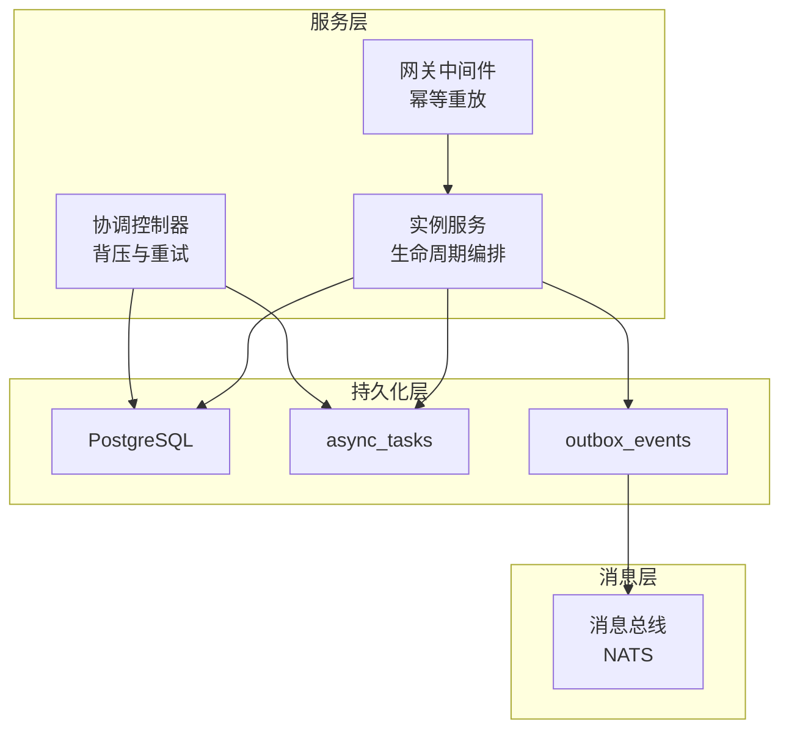
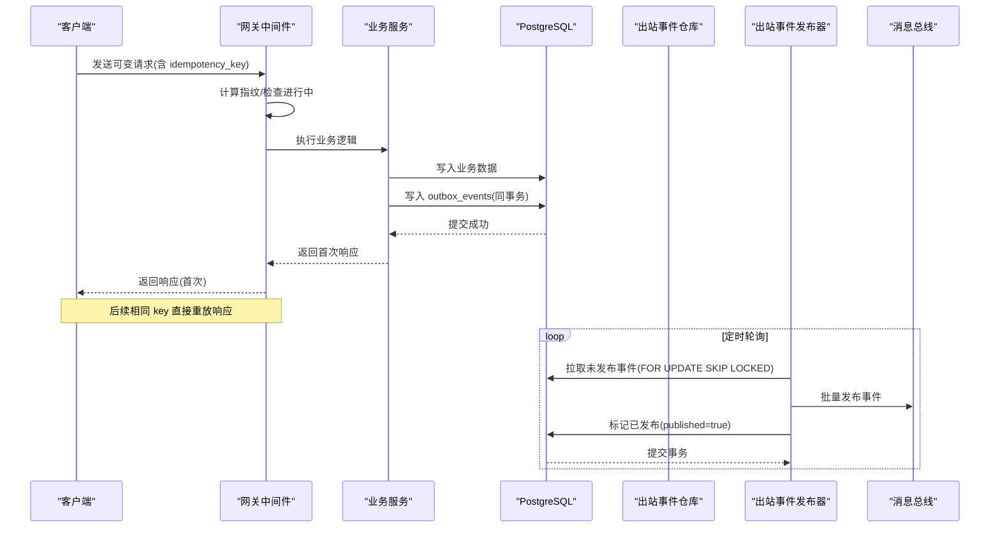
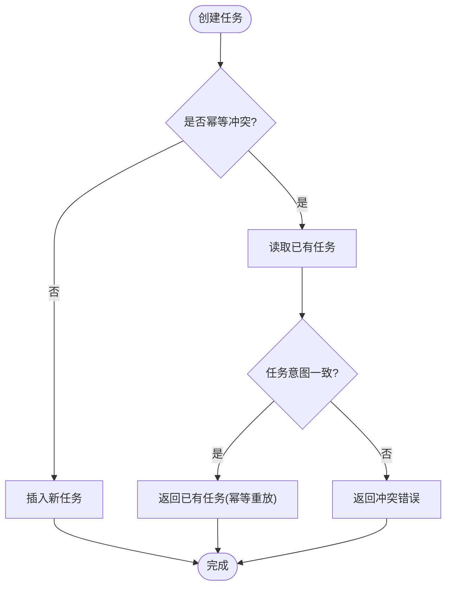
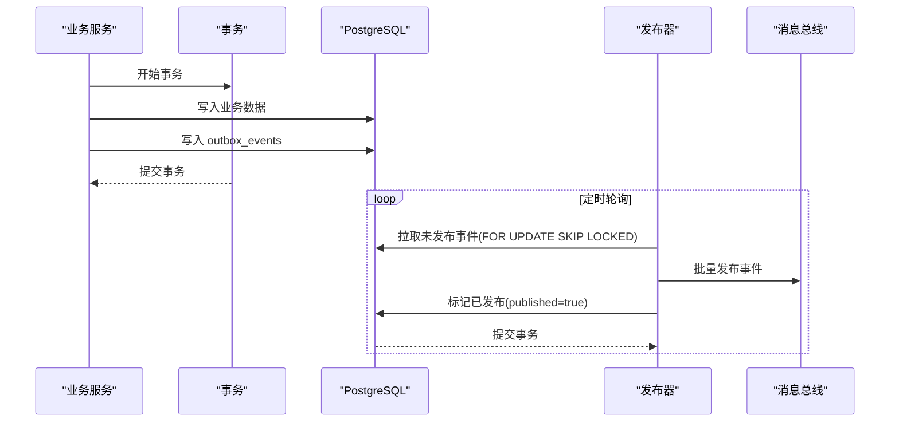
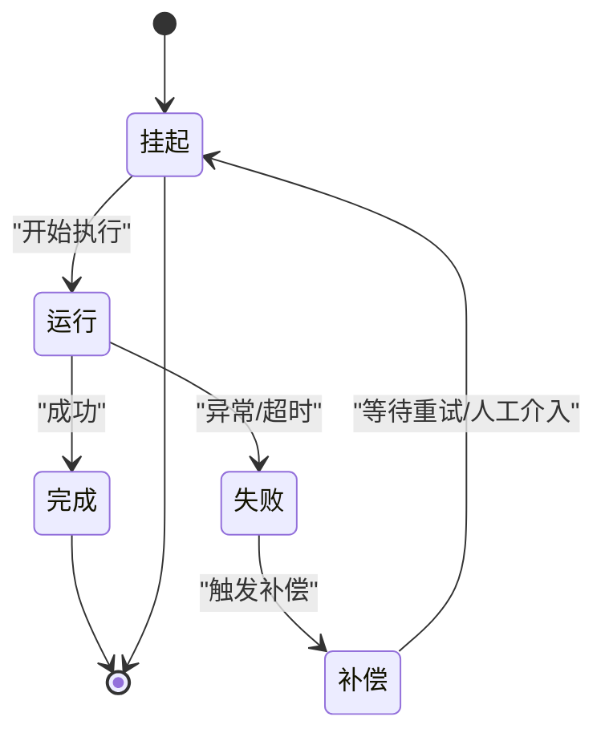
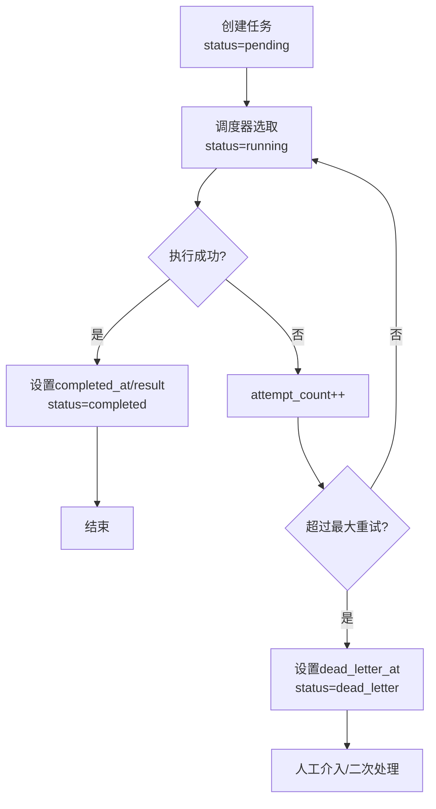
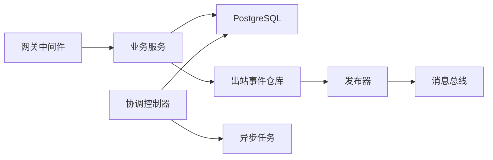

# 异步任务与事件表

<cite>
**本文引用的文件**
- [async_task_store.go](file://repo/pkg/adapters/runtime/async_task_store.go)
- [20260802_001_async_tasks.sql](file://repo/deploy/migrations/20260802_001_async_tasks.sql)
- [apply_kb_migration.py](file://repo/scripts/apply_kb_migration.py)
- [outbox.py](file://repo/services/kb-service/app/repositories/outbox.py)
- [outbox_repo.go](file://repo/pkg/repo/outbox_repo.go)
- [outbox_publisher.go](file://repo/services/task-service/internal/worker/outbox_publisher.go)
- [idempotency_test.go](file://repo/services/ani-gateway/internal/middleware/idempotency_test.go)
- [instance_service.go](file://repo/pkg/adapters/runtime/instance_service.go)
- [reconcile_controller.go](file://repo/pkg/adapters/runtime/reconcile_controller.go)
</cite>

## 目录
1. [简介](#简介)
2. [项目结构](#项目结构)
3. [核心组件](#核心组件)
4. [架构总览](#架构总览)
5. [详细组件分析](#详细组件分析)
6. [依赖关系分析](#依赖关系分析)
7. [性能考虑](#性能考虑)
8. [故障排查指南](#故障排查指南)
9. [结论](#结论)
10. [附录](#附录)

## 简介
本文件聚焦于系统中的“异步任务”和“出站事件”两大持久化机制，围绕以下目标展开：
- 详细说明 async_tasks（异步任务）表的设计与实现，包括幂等性保证、任务租约机制、重试策略、死信队列等高级特性。
- 解释 outbox_events（出站事件）表的实现，用于保证数据库操作与消息发布的原子性。
- 描述 Saga 模式在分布式事务中的应用，包括补偿动作、事务协调与故障恢复。
- 说明任务的执行状态机，从挂起、运行到完成或失败的全生命周期管理。
- 给出性能优化建议，如索引策略、分区设计、批量处理等。

## 项目结构
与异步任务和事件相关的代码主要分布在如下位置：
- 任务存储与查询：Go 侧通过适配器层封装对 PostgreSQL 的访问，提供本地内存与元数据两种实现。
- 迁移脚本：定义 async_tasks 与 outbox_events 表结构及索引。
- 出站事件仓库与发布器：Python 与 Go 分别负责写入与轮询发布，确保业务写与事件落库在同一事务中，再由独立发布者批量投递消息。
- 网关幂等中间件：基于 idempotency_key 进行请求去重与响应重放，避免重复副作用。
- 工作负载编排与服务：将幂等键与操作记录结合，形成可重放的长生命周期操作。

图表来源
- [async_task_store.go:121-153](file://repo/pkg/adapters/runtime/async_task_store.go#L121-L153)
- [outbox_repo.go:41-78](file://repo/pkg/repo/outbox_repo.go#L41-L78)
- [outbox_publisher.go:72-116](file://repo/services/task-service/internal/worker/outbox_publisher.go#L72-L116)
- [idempotency_test.go:308-349](file://repo/services/ani-gateway/internal/middleware/idempotency_test.go#L308-L349)

章节来源
- [async_task_store.go:1-338](file://repo/pkg/adapters/runtime/async_task_store.go#L1-L338)
- [apply_kb_migration.py:79-123](file://repo/scripts/apply_kb_migration.py#L79-L123)
- [outbox.py:17-51](file://repo/services/kb-service/app/repositories/outbox.py#L17-L51)
- [outbox_repo.go:1-105](file://repo/pkg/repo/outbox_repo.go#L1-L105)
- [outbox_publisher.go:1-117](file://repo/services/task-service/internal/worker/outbox_publisher.go#L1-L117)
- [idempotency_test.go:36-361](file://repo/services/ani-gateway/internal/middleware/idempotency_test.go#L36-L361)

## 核心组件
- 异步任务存储（AsyncTaskStore）
  - 提供 Create/Get/Update 接口，支持本地内存与 Postgres 元数据两种后端。
  - 幂等性：通过 tenant_id + idempotency_key 唯一约束与插入冲突处理，防止重复创建不同意图的任务。
  - 状态与进度：维护 status、attempt_count、max_attempts、progress_pct、result、error_message、dead_letter_at、completed_at 等字段。
  - 结果与错误：result 为 JSONB，error_message 记录失败原因；dead_letter_at 标记进入死信的时间。
- 出站事件仓库（OutboxRepo）
  - FetchUnpublished：按 created_at 顺序拉取未发布事件，使用 FOR UPDATE SKIP LOCKED 避免多消费者争抢。
  - MarkPublished：批量标记已发布，更新 published/published_at。
- 出站事件发布器（OutboxPublisher）
  - 定时轮询未发布事件，批量发布到消息总线，并在同一事务中标记已发布，保证至少一次投递与最终一致性。
- 网关幂等中间件
  - 对可变请求基于 (tenant, method, path, idempotency_key) 进行去重与响应重放，并发进行中返回冲突。
- 工作负载服务与协调控制器
  - 将幂等键与工作负载操作关联，支持重放与失败恢复；协调控制器根据状态选择生命周期动作并实施退避。

章节来源
- [async_task_store.go:27-153](file://repo/pkg/adapters/runtime/async_task_store.go#L27-L153)
- [outbox_repo.go:13-96](file://repo/pkg/repo/outbox_repo.go#L13-L96)
- [outbox_publisher.go:14-116](file://repo/services/task-service/internal/worker/outbox_publisher.go#L14-L116)
- [idempotency_test.go:308-361](file://repo/services/ani-gateway/internal/middleware/idempotency_test.go#L308-L361)
- [instance_service.go:798-835](file://repo/pkg/adapters/runtime/instance_service.go#L798-L835)
- [reconcile_controller.go:295-315](file://repo/pkg/adapters/runtime/reconcile_controller.go#L295-L315)

## 架构总览
系统采用“任务驱动 + 出站事件”的解耦架构：
- 调用方提交幂等请求，网关中间件去重并重放响应。
- 业务逻辑在事务内写入业务数据与出站事件，随后由独立发布者轮询并投递消息。
- 长生命周期操作以异步任务形式落地，支持重试、进度上报与死信队列。
- 协调控制器根据资源状态持续收敛期望态，必要时触发补偿或回滚。

图表来源
- [idempotency_test.go:308-349](file://repo/services/ani-gateway/internal/middleware/idempotency_test.go#L308-L349)
- [outbox.py:17-51](file://repo/services/kb-service/app/repositories/outbox.py#L17-L51)
- [outbox_repo.go:41-78](file://repo/pkg/repo/outbox_repo.go#L41-L78)
- [outbox_publisher.go:72-116](file://repo/services/task-service/internal/worker/outbox_publisher.go#L72-L116)

## 详细组件分析

### 异步任务表（async_tasks）设计与实现
- 表结构与字段
  - 主键：id（UUID）
  - 租户隔离：tenant_id（UUID）
  - 幂等键：idempotency_key（TEXT），与 tenant_id 构成唯一约束
  - 任务元信息：task_type、resource_type、resource_id
  - 状态与进度：status（pending/running/completed/failed/cancelled/dead_letter）、attempt_count、max_attempts、progress_pct
  - 结果与错误：result（JSONB）、error_message（TEXT）
  - 死信与完成时间：dead_letter_at（TIMESTAMPTZ）、completed_at（TIMESTAMPTZ）
  - 审计时间：created_at、updated_at
- 幂等性保证
  - 插入时使用 ON CONFLICT (tenant_id, idempotency_key) DO NOTHING，若冲突则读取已有记录并校验任务类型与资源标识一致，否则返回冲突错误。
  - 本地内存实现同样维护 byKey 映射，防止并发重复创建不同意图的任务。
- 任务租约机制
  - 迁移脚本包含 lease_owner、lease_until、last_heartbeat_at 字段，配合 running 状态的过滤索引，可实现任务租约与心跳检测，避免重复执行。
- 重试策略
  - attempt_count 与 max_attempts 控制重试次数；协调控制器根据状态选择生命周期动作并实施退避，避免风暴。
- 死信队列
  - dead_letter_at 标记进入死信的时间；dead_letter 状态用于长期滞留任务的人工干预或二次处理。
- 索引策略
  - idx_async_tasks_tenant：按租户与状态快速筛选待处理任务
  - idx_async_tasks_type：按任务类型与状态筛选
  - idx_async_tasks_lease_owner / idx_async_tasks_lease：针对 running 状态的租约扫描
  - idx_async_tasks_dead_letter：针对 dead_letter 状态的清理与监控
  - 增量迁移新增 result/error_message/dead_letter_at/completed_at/updated_at 列与幂等索引

图表来源
- [async_task_store.go:121-153](file://repo/pkg/adapters/runtime/async_task_store.go#L121-L153)
- [apply_kb_migration.py:79-109](file://repo/scripts/apply_kb_migration.py#L79-L109)
- [20260802_001_async_tasks.sql:1-14](file://repo/deploy/migrations/20260802_001_async_tasks.sql#L1-L14)

章节来源
- [async_task_store.go:27-153](file://repo/pkg/adapters/runtime/async_task_store.go#L27-L153)
- [apply_kb_migration.py:79-109](file://repo/scripts/apply_kb_migration.py#L79-L109)
- [20260802_001_async_tasks.sql:1-14](file://repo/deploy/migrations/20260802_001_async_tasks.sql#L1-L14)

### 出站事件表（outbox_events）与发布流程
- 表结构与字段
  - 自增主键：id（BIGSERIAL）
  - 聚合信息：aggregate_type、aggregate_id（UUID）
  - 事件信息：event_type（TEXT）
  - 租户隔离：tenant_id（UUID）
  - 事件载荷：payload（JSONB）
  - 发布状态：published（BOOLEAN）、published_at（TIMESTAMPTZ）
  - 创建时间：created_at（TIMESTAMPTZ）
- 原子性保证
  - 业务写与 outbox_events 写入在同一事务中提交，确保状态变更与事件落库的一致性。
- 发布流程
  - 发布器按 created_at 顺序拉取未发布事件，使用 FOR UPDATE SKIP LOCKED 避免多实例争抢。
  - 批量发布到消息总线后，在同一事务中标记 published=true，保证至少一次投递。
- 租户隔离与跨租户发布
  - 业务写入受 RLS 限制；发布器使用 BYPASSRLS 角色跨租户扫描与标记，符合平台内部操作语义。

图表来源
- [outbox.py:17-51](file://repo/services/kb-service/app/repositories/outbox.py#L17-L51)
- [outbox_repo.go:41-78](file://repo/pkg/repo/outbox_repo.go#L41-L78)
- [outbox_publisher.go:72-116](file://repo/services/task-service/internal/worker/outbox_publisher.go#L72-L116)

章节来源
- [apply_kb_migration.py:112-123](file://repo/scripts/apply_kb_migration.py#L112-L123)
- [outbox.py:17-51](file://repo/services/kb-service/app/repositories/outbox.py#L17-L51)
- [outbox_repo.go:41-78](file://repo/pkg/repo/outbox_repo.go#L41-L78)
- [outbox_publisher.go:72-116](file://repo/services/task-service/internal/worker/outbox_publisher.go#L72-L116)

### Saga 模式在分布式事务中的应用
- 补偿动作
  - 当某步骤失败时，触发前置步骤的补偿动作，例如撤销资源创建、释放锁、回滚配置等。
  - 任务记录中包含 compensating_action 字段，便于记录与回放补偿逻辑。
- 事务协调
  - 协调控制器根据当前状态选择生命周期动作（创建/启动/停止/删除），并实施退避与重试。
  - 对于沙箱等资源，服务层会构建执行上下文并调用对应运行时，确保状态收敛。
- 故障恢复
  - 通过幂等键与操作记录，支持失败后的重放与恢复；网关中间件对可变请求进行去重与响应重放。
  - 协调控制器识别瞬态状态并跳过退避，避免无效重试。

图表来源
- [reconcile_controller.go:295-315](file://repo/pkg/adapters/runtime/reconcile_controller.go#L295-L315)
- [instance_service.go:798-835](file://repo/pkg/adapters/runtime/instance_service.go#L798-L835)

章节来源
- [reconcile_controller.go:295-315](file://repo/pkg/adapters/runtime/reconcile_controller.go#L295-L315)
- [instance_service.go:798-835](file://repo/pkg/adapters/runtime/instance_service.go#L798-L835)

### 任务执行状态机
- 状态集合
  - pending：待执行
  - running：执行中
  - completed：已完成
  - failed：失败
  - cancelled：已取消
  - dead_letter：死信（长期滞留）
- 状态转换规则
  - 创建任务初始为 pending；调度器将其置为 running 并开始执行。
  - 执行成功置为 completed，并记录 completed_at 与 result。
  - 执行失败增加 attempt_count，超过 max_attempts 或达到策略阈值时进入 dead_letter。
  - 用户或策略可取消任务，置为 cancelled。
- 进度与结果
  - progress_pct 表示执行进度（0-100）；result 与 error_message 分别记录成功结果与失败原因。
- 租约与心跳
  - running 状态的任务具备租约字段，支持心跳检测与租约过期回收，避免僵尸任务。

图表来源
- [async_task_store.go:278-285](file://repo/pkg/adapters/runtime/async_task_store.go#L278-L285)
- [apply_kb_migration.py:79-109](file://repo/scripts/apply_kb_migration.py#L79-L109)

章节来源
- [async_task_store.go:278-285](file://repo/pkg/adapters/runtime/async_task_store.go#L278-L285)
- [apply_kb_migration.py:79-109](file://repo/scripts/apply_kb_migration.py#L79-L109)

## 依赖关系分析
- 组件耦合
  - 业务服务依赖出站事件仓库写入事件；发布器依赖仓库拉取与标记。
  - 网关中间件依赖共享存储进行幂等重放；业务服务通过幂等键与操作记录支持重放。
  - 协调控制器依赖任务状态与资源状态，决定生命周期动作。
- 外部依赖
  - PostgreSQL：持久化任务与事件，提供事务与索引能力。
  - NATS：消息总线，承载出站事件的发布与消费。
- 潜在循环依赖
  - 发布器仅依赖仓库与消息总线，不反向依赖业务服务，避免循环。
  - 网关中间件与业务服务通过幂等键解耦，无直接循环。

图表来源
- [outbox_repo.go:41-78](file://repo/pkg/repo/outbox_repo.go#L41-L78)
- [outbox_publisher.go:72-116](file://repo/services/task-service/internal/worker/outbox_publisher.go#L72-L116)
- [idempotency_test.go:308-349](file://repo/services/ani-gateway/internal/middleware/idempotency_test.go#L308-L349)

章节来源
- [outbox_repo.go:41-78](file://repo/pkg/repo/outbox_repo.go#L41-L78)
- [outbox_publisher.go:72-116](file://repo/services/task-service/internal/worker/outbox_publisher.go#L72-L116)
- [idempotency_test.go:308-349](file://repo/services/ani-gateway/internal/middleware/idempotency_test.go#L308-L349)

## 性能考虑
- 索引策略
  - async_tasks：按 tenant_id/status、task_type/status、lease_owner、lease_until、dead_letter_at 建立条件索引，提升调度与清理效率。
  - outbox_events：按 created_at 建立条件索引，加速未发布事件拉取。
- 分区设计
  - 可按 tenant_id 或时间范围对 async_tasks 与 outbox_events 进行分区，降低单表规模，提升查询与清理性能。
- 批量处理
  - 出站事件发布器支持批量拉取与标记，减少数据库往返与锁竞争。
  - 协调控制器实施退避与跳过，避免频繁重试导致雪崩。
- 并发控制
  - 使用 FOR UPDATE SKIP LOCKED 避免多实例争抢未发布事件。
  - 网关中间件对进行中请求返回冲突，避免重复副作用。

[本节为通用性能指导，无需特定文件来源]

## 故障排查指南
- 幂等冲突
  - 现象：相同 idempotency_key 的请求返回冲突或重放响应。
  - 排查：检查网关中间件的指纹计算与存储；确认业务逻辑未改变意图。
  - 参考：幂等测试覆盖重复请求与不同意图拒绝场景。
- 任务卡住
  - 现象：任务长时间处于 running 且无心跳。
  - 排查：检查租约字段与心跳更新逻辑；确认调度器是否正常选取任务。
  - 参考：async_tasks 表结构与索引设计。
- 事件未发布
  - 现象：outbox_events 中存在未发布事件。
  - 排查：检查发布器轮询与批处理逻辑；确认消息总线可用性与权限。
  - 参考：发布器的拉取与标记流程。
- 协调控制器失效
  - 现象：资源状态未收敛至期望态。
  - 排查：检查状态判断与动作选择逻辑；确认退避与重试策略。
  - 参考：协调控制器的状态映射与瞬态判断。

章节来源
- [idempotency_test.go:308-361](file://repo/services/ani-gateway/internal/middleware/idempotency_test.go#L308-L361)
- [async_task_store.go:278-285](file://repo/pkg/adapters/runtime/async_task_store.go#L278-L285)
- [outbox_publisher.go:72-116](file://repo/services/task-service/internal/worker/outbox_publisher.go#L72-L116)
- [reconcile_controller.go:295-315](file://repo/pkg/adapters/runtime/reconcile_controller.go#L295-L315)

## 结论
本系统通过 async_tasks 与 outbox_events 两大机制，实现了可靠的异步任务执行与事件驱动架构：
- 幂等性贯穿请求、任务与事件，确保重复请求不会产生副作用。
- 任务租约与心跳保障执行安全，重试与死信队列提升鲁棒性。
- 出站事件与发布器保证业务写与消息发布的原子性与最终一致性。
- Saga 模式与协调控制器实现分布式事务的协调与恢复。
- 索引、分区与批量处理优化了性能与可扩展性。

[本节为总结，无需特定文件来源]

## 附录
- 关键表结构参考
  - async_tasks：任务主表，包含幂等键、状态、进度、结果、错误、死信与完成时间。
  - outbox_events：出站事件表，包含聚合信息、事件类型、租户、载荷与发布状态。
- 关键流程参考
  - 幂等重放：网关中间件对可变请求进行去重与响应重放。
  - 事件发布：业务写与事件落库同事务，发布器批量拉取与标记。
  - 任务调度：协调控制器根据状态选择动作并实施退避。

[本节为补充信息，无需特定文件来源]