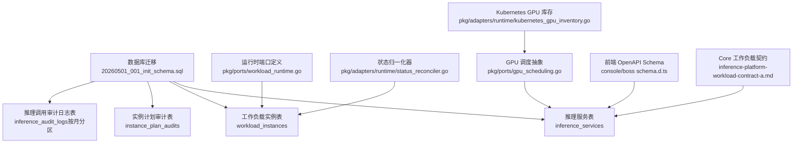
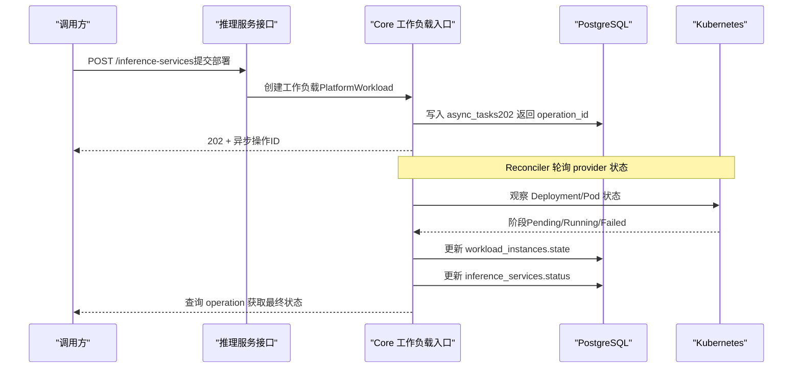
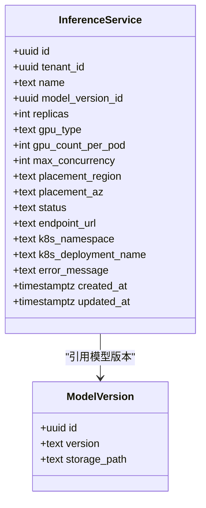
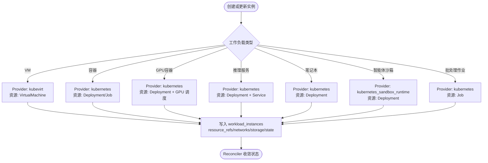
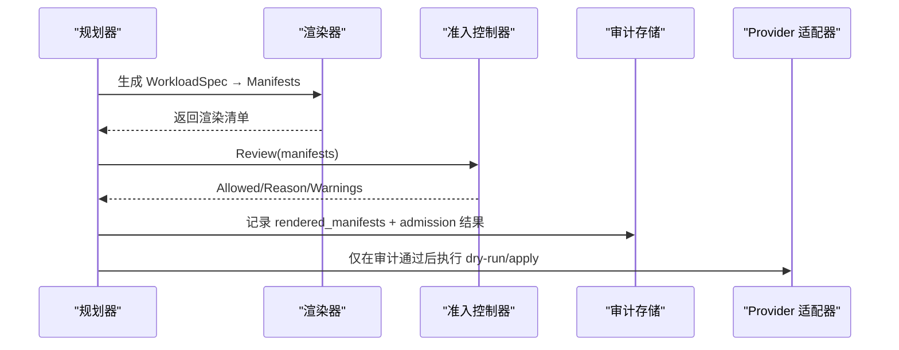
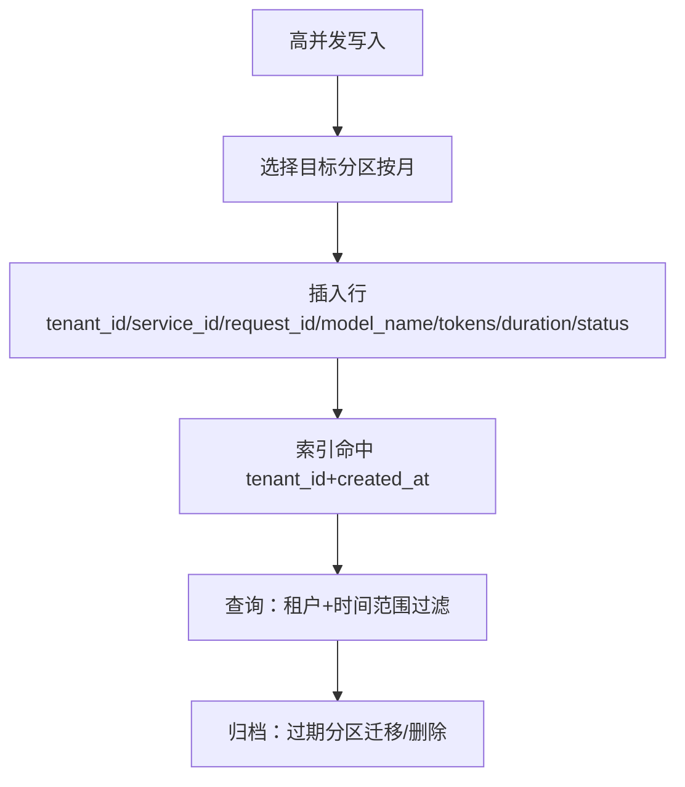
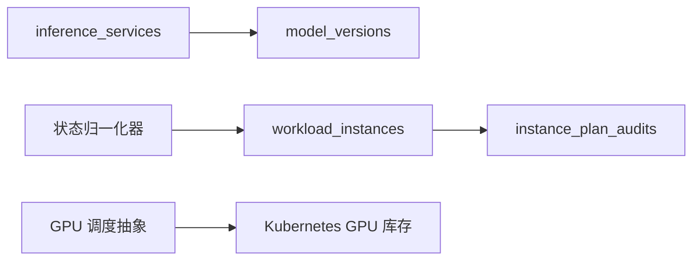
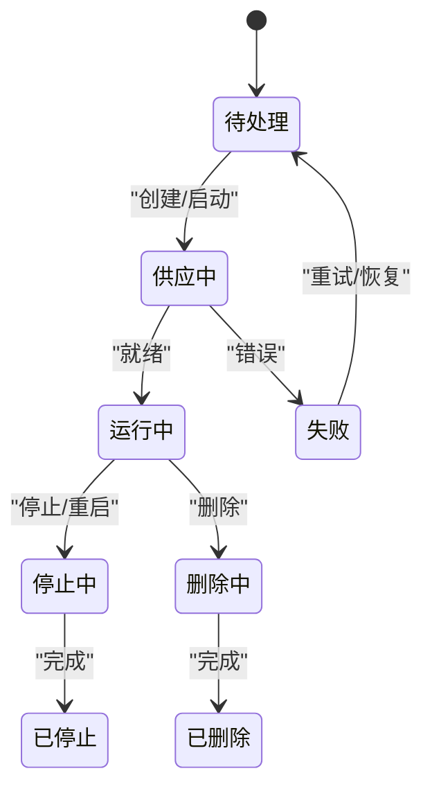

# 推理服务与工作负载表

<cite>
**本文引用的文件**
- [20260501_001_init_schema.sql](file://repo/deploy/migrations/20260501_001_init_schema.sql)
- [workload_runtime.go](file://repo/pkg/ports/workload_runtime.go)
- [status_reconciler.go](file://repo/pkg/adapters/runtime/status_reconciler.go)
- [gpu_scheduling.go](file://repo/pkg/ports/gpu_scheduling.go)
- [kubernetes_gpu_inventory.go](file://repo/pkg/adapters/runtime/kubernetes_gpu_inventory.go)
- [instances.go](file://repo/services/ani-gateway/internal/router/instances.go)
- [schema.d.ts（控制台）](file://repo/frontends/console/src/api/schema.d.ts)
- [schema.d.ts（Boss）](file://repo/frontends/boss/src/api/schema.d.ts)
- [inference-platform-workload-contract-a.md](file://repo/development-records/inference-platform-workload-contract-a.md)
</cite>

## 目录
1. [简介](#简介)
2. [项目结构](#项目结构)
3. [核心数据模型](#核心数据模型)
4. [架构总览](#架构总览)
5. [详细组件分析](#详细组件分析)
6. [依赖关系分析](#依赖关系分析)
7. [性能与高并发写入优化](#性能与高并发写入优化)
8. [故障排查指南](#故障排查指南)
9. [结论](#结论)
10. [附录：状态机与编排流程](#附录：状态机与编排流程)

## 简介
本文件聚焦于推理服务与工作负载相关的数据模型与运行机制，围绕以下目标展开：
- 详细说明 inference_services（推理服务）表的设计，包括服务配置、GPU 资源分配、副本数、部署状态、Kubernetes 集成等。
- 解释 workload_instances（工作负载实例）表的结构，支持多种工作负载类型（VM、容器、GPU 容器、推理服务、笔记本、智能体沙箱、批处理作业）。
- 描述 instance_plan_audits（实例计划审计）表的审计能力，覆盖资源配置审核、准入控制、变更记录。
- 说明推理调用审计日志表的分区设计与高并发写入优化策略。
- 给出工作负载状态机与服务编排的数据模型映射，帮助理解从创建到运行期的全链路。

## 项目结构
与推理服务和工作负载相关的持久化定义集中在数据库迁移脚本中；运行时类型、状态机与调度抽象在 ports 与 adapters 层；前端 OpenAPI schema 暴露了推理服务的 API 契约；开发记录文档明确了 Core 跨层工作负载契约与内部端点约束。

图表来源
- [20260501_001_init_schema.sql:186-280](file://repo/deploy/migrations/20260501_001_init_schema.sql#L186-L280)
- [workload_runtime.go:8-33](file://repo/pkg/ports/workload_runtime.go#L8-L33)
- [status_reconciler.go:105-124](file://repo/pkg/adapters/runtime/status_reconciler.go#L105-L124)
- [gpu_scheduling.go:9-16](file://repo/pkg/ports/gpu_scheduling.go#L9-L16)
- [kubernetes_gpu_inventory.go:14-30](file://repo/pkg/adapters/runtime/kubernetes_gpu_inventory.go#L14-L30)
- [schema.d.ts（控制台）:77-142](file://repo/frontends/console/src/api/schema.d.ts#L77-L142)
- [schema.d.ts（Boss）:77-142](file://repo/frontends/boss/src/api/schema.d.ts#L77-L142)
- [inference-platform-workload-contract-a.md:1-21](file://repo/development-records/inference-platform-workload-contract-a.md#L1-L21)

章节来源
- [20260501_001_init_schema.sql:186-280](file://repo/deploy/migrations/20260501_001_init_schema.sql#L186-L280)
- [workload_runtime.go:8-33](file://repo/pkg/ports/workload_runtime.go#L8-L33)
- [status_reconciler.go:105-124](file://repo/pkg/adapters/runtime/status_reconciler.go#L105-L124)
- [gpu_scheduling.go:9-16](file://repo/pkg/ports/gpu_scheduling.go#L9-L16)
- [kubernetes_gpu_inventory.go:14-30](file://repo/pkg/adapters/runtime/kubernetes_gpu_inventory.go#L14-L30)
- [schema.d.ts（控制台）:77-142](file://repo/frontends/console/src/api/schema.d.ts#L77-L142)
- [schema.d.ts（Boss）:77-142](file://repo/frontends/boss/src/api/schema.d.ts#L77-L142)
- [inference-platform-workload-contract-a.md:1-21](file://repo/development-records/inference-platform-workload-contract-a.md#L1-L21)

## 核心数据模型
本节对三类核心表进行结构化说明，并补充推理调用审计日志的分区设计要点。

- inference_services（推理服务）
  - 主键：id（UUID）
  - 租户隔离：tenant_id（外键至 tenants）
  - 服务标识：name（唯一键 tenant_id+name）
  - 模型绑定：model_version_id（外键至 model_versions）
  - 资源与副本：replicas（默认 1）、gpu_type（A100/A10/H100/910B/CPU 空值）、gpu_count_per_pod（默认 1）、max_concurrency（默认 8）
  - 放置偏好：placement_region、placement_az
  - 部署状态：status（pending/downloading/decrypting/deploying/running/stopping/stopped/failed）
  - Kubernetes 集成：endpoint_url（运行后填充的内部访问地址）、k8s_namespace、k8s_deployment_name
  - 错误信息：error_message
  - 时间戳：created_at、updated_at
  - 索引：按 tenant_id、tenant_id+status 建立索引以支撑列表与状态查询

- workload_instances（工作负载实例）
  - 复合主键：tenant_id + instance_id
  - 基础字段：name、workload_kind（vm/container/gpu_container/inference/notebook/agent_sandbox/batch_job）、provider
  - 审计关联：audit_id（外键至 instance_plan_audits）
  - 提供者标识：provider_id
  - 资源引用：resource_refs（JSON 数组，记录 provider 侧资源如 kubernetes/Deployment/xxx）
  - 状态：state（pending/provisioning/running/starting/stopping/stopped/failed/deleting/deleted）
  - 运行信息：endpoint、node_name、reason
  - 网络与存储：networks、storage（均为 JSON 数组，记录网络平面与存储附件）
  - 时间戳：created_at、updated_at
  - 索引：tenant_id+updated_at、tenant_id+workload_kind+state、tenant_id+audit_id

- instance_plan_audits（实例计划审计）
  - 主键：id（UUID）
  - 租户与用户：tenant_id、user_id
  - 实例标识：instance_id、instance_name
  - 工作负载类型：workload_kind（同上枚举）
  - 提供者：provider
  - 渲染产物：manifest_count、rendered_manifests（JSON 数组，保存渲染后的 manifest 内容）
  - 准入结果：admission_allowed（布尔）、admission_reason（文本）、admission_warnings（JSON 数组）
  - 时间戳：created_at
  - 索引：tenant_id+created_at DESC、tenant_id+instance_name+created_at DESC

- inference_audit_logs（推理调用审计日志）
  - 主键：id（UUID）
  - 租户与服务：tenant_id、service_id
  - 调用者：user_id、api_key_id
  - 追踪与模型：request_id、model_name
  - Token 用量：input_tokens、output_tokens
  - 延迟与状态：duration_ms、status_code
  - 时间戳：created_at
  - 分区策略：按 created_at 范围分区（按月），已预建当月与下月分区，便于自动维护与归档
  - 索引：tenant_id+created_at

章节来源
- [20260501_001_init_schema.sql:186-280](file://repo/deploy/migrations/20260501_001_init_schema.sql#L186-L280)

## 架构总览
推理服务通过 Core 跨层工作负载契约对外暴露，Services 不直接操作 Kubernetes，而是复用租户 /instances 的统一工作负载能力。推理服务创建、扩缩容、生命周期动作均走异步任务（202 + AsyncTask），并由 reconciler 收敛最终状态。

图表来源
- [inference-platform-workload-contract-a.md:11-21](file://repo/development-records/inference-platform-workload-contract-a.md#L11-L21)
- [schema.d.ts（控制台）:77-142](file://repo/frontends/console/src/api/schema.d.ts#L77-L142)
- [schema.d.ts（Boss）:77-142](file://repo/frontends/boss/src/api/schema.d.ts#L77-L142)
- [20260501_001_init_schema.sql:354-389](file://repo/deploy/migrations/20260501_001_init_schema.sql#L354-L389)

章节来源
- [inference-platform-workload-contract-a.md:11-21](file://repo/development-records/inference-platform-workload-contract-a.md#L11-L21)
- [schema.d.ts（控制台）:77-142](file://repo/frontends/console/src/api/schema.d.ts#L77-L142)
- [schema.d.ts（Boss）:77-142](file://repo/frontends/boss/src/api/schema.d.ts#L77-L142)
- [20260501_001_init_schema.sql:354-389](file://repo/deploy/migrations/20260501_001_init_schema.sql#L354-L389)

## 详细组件分析

### 推理服务表（inference_services）设计
- 服务配置
  - 模型绑定：通过 model_version_id 指向模型版本，确保推理镜像与权重一致。
  - 并发与副本：replicas 控制 Pod 副本数；max_concurrency 限制单实例最大并发请求数。
  - GPU 资源：gpu_type 指定 GPU 型号；gpu_count_per_pod 指定每 Pod 分配的 GPU 数量；CPU 场景允许为空。
  - 放置策略：placement_region、placement_az 用于区域与可用区偏好。
- 部署状态
  - status 涵盖从 pending 到 running/stopped/failed 的全生命周期；endpoint_url 在运行后填充内部访问地址。
- Kubernetes 集成
  - k8s_namespace、k8s_deployment_name 记录实际部署命名空间与 Deployment 名称，便于定位与运维。
  - 结合 Core 工作负载契约，所有 mutation 使用 202 + AsyncTask，避免同步阻塞。

图表来源
- [20260501_001_init_schema.sql:186-208](file://repo/deploy/migrations/20260501_001_init_schema.sql#L186-L208)

章节来源
- [20260501_001_init_schema.sql:186-208](file://repo/deploy/migrations/20260501_001_init_schema.sql#L186-L208)

### 工作负载实例表（workload_instances）与多类型支持
- 多类型支持
  - workload_kind 统一枚举：vm、container、gpu_container、inference、notebook、agent_sandbox、batch_job。
  - 不同 kind 对应不同的 provider（如 kubernetes、kubevirt、kubernetes_sandbox_runtime），由 provider 字段标识。
- 资源与状态
  - resource_refs 记录 provider 侧资源引用（例如 kubernetes/Deployment/xxx），便于观测与回滚。
  - state 为标准工作负载状态机，涵盖 pending→provisioning→running→stopping→stopped→failed→deleting→deleted。
- 网络与存储
  - networks、storage 为 JSON 数组，记录网络平面（tenant_vpc/foundation_mesh/storage/management/public_ingress）与存储附件（root_disk/data_disk/shared_pvc/object_fuse/ephemeral）。

图表来源
- [workload_runtime.go:8-33](file://repo/pkg/ports/workload_runtime.go#L8-L33)
- [20260501_001_init_schema.sql:229-252](file://repo/deploy/migrations/20260501_001_init_schema.sql#L229-L252)

章节来源
- [workload_runtime.go:8-33](file://repo/pkg/ports/workload_runtime.go#L8-L33)
- [20260501_001_init_schema.sql:229-252](file://repo/deploy/migrations/20260501_001_init_schema.sql#L229-L252)

### 实例计划审计表（instance_plan_audits）与准入控制
- 审计能力
  - 记录渲染后的 manifests（rendered_manifests）与 manifest 数量（manifest_count）。
  - 记录准入结果（admission_allowed、admission_reason、admission_warnings），即使被拒绝也需可审计。
  - 通过 audit_id 与 workload_instances 关联，形成“计划→应用→观测”的完整证据链。
- 准入控制
  - 在 provider server-side dry-run 或真实 apply 前必须完成本地 admission 校验，禁止 hostNetwork=true、privileged container 等危险配置。
  - 未记录审计不得进入真实 provider 执行，保障变更可追溯。

图表来源
- [20260501_001_init_schema.sql:210-227](file://repo/deploy/migrations/20260501_001_init_schema.sql#L210-L227)
- [workload_runtime.go:408-424](file://repo/pkg/ports/workload_runtime.go#L408-L424)

章节来源
- [20260501_001_init_schema.sql:210-227](file://repo/deploy/migrations/20260501_001_init_schema.sql#L210-L227)
- [workload_runtime.go:408-424](file://repo/pkg/ports/workload_runtime.go#L408-L424)

### 推理调用审计日志表（inference_audit_logs）分区与高并发写入
- 分区设计
  - 按 created_at 范围分区（按月），已预建当月与下月分区，便于自动维护与归档。
  - 建议后续可转换为 TimescaleDB hypertable，chunk_time_interval=1 month，进一步提升时序查询与压缩性能。
- 高并发写入优化
  - 使用分区表减少热点锁竞争，写入路由到当月分区。
  - 索引 tenant_id+created_at 加速租户维度查询。
  - 批量写入与事务合并可降低 WAL 压力；必要时引入旁路采集（如日志聚合）再落库。

图表来源
- [20260501_001_init_schema.sql:254-280](file://repo/deploy/migrations/20260501_001_init_schema.sql#L254-L280)

章节来源
- [20260501_001_init_schema.sql:254-280](file://repo/deploy/migrations/20260501_001_init_schema.sql#L254-L280)

## 依赖关系分析
- 推理服务与模型版本
  - inference_services.model_version_id 引用 model_versions，确保推理镜像与权重一致性。
- 工作负载实例与审计
  - workload_instances.audit_id 引用 instance_plan_audits，形成“计划→应用→观测”的证据链。
- GPU 调度与队列
  - GPU 调度通过 ports 抽象（WorkloadClassInference/Training/Batch）与 Kubernetes GPU Inventory 协作，决定节点选择器、资源名、RuntimeClass、SchedulerName、QueueName。
- 状态归一化
  - status_reconciler 将 provider 阶段映射为标准 WorkloadState，保证跨 provider 的一致性。

图表来源
- [20260501_001_init_schema.sql:186-252](file://repo/deploy/migrations/20260501_001_init_schema.sql#L186-L252)
- [gpu_scheduling.go:9-16](file://repo/pkg/ports/gpu_scheduling.go#L9-L16)
- [kubernetes_gpu_inventory.go:14-30](file://repo/pkg/adapters/runtime/kubernetes_gpu_inventory.go#L14-L30)
- [status_reconciler.go:105-124](file://repo/pkg/adapters/runtime/status_reconciler.go#L105-L124)

章节来源
- [20260501_001_init_schema.sql:186-252](file://repo/deploy/migrations/20260501_001_init_schema.sql#L186-L252)
- [gpu_scheduling.go:9-16](file://repo/pkg/ports/gpu_scheduling.go#L9-L16)
- [kubernetes_gpu_inventory.go:14-30](file://repo/pkg/adapters/runtime/kubernetes_gpu_inventory.go#L14-L30)
- [status_reconciler.go:105-124](file://repo/pkg/adapters/runtime/status_reconciler.go#L105-L124)

## 性能与高并发写入优化
- 推理调用审计日志
  - 按月分区降低热点，配合租户+时间索引提升查询效率。
  - 建议启用 TimescaleDB hypertable，chunk_time_interval=1 month，利用压缩与连续聚合。
- 工作负载实例与推理服务
  - 合理索引（tenant_id+status、tenant_id+updated_at、tenant_id+workload_kind+state）提升列表与状态查询性能。
  - 使用异步任务（async_tasks）与 reconciler 解耦创建与观测，避免同步阻塞。
- GPU 调度
  - 通过 Volcano/HAMi 队列与 scheduler 名称分离流量，避免争用；queue_name 与 resource_name 在实例状态中可见，便于诊断。

[本节提供通用指导，无需特定文件分析]

## 故障排查指南
- 推理服务状态异常
  - 检查 inference_services.status 与 endpoint_url/k8s_namespace/k8s_deployment_name 是否一致。
  - 查看关联的 async_tasks 与 operation steps，定位失败步骤与原因。
- 工作负载实例状态不一致
  - 核对 workload_instances.state 与 provider 实际状态（Kubernetes/KubeVirt）。
  - 使用 status_reconciler 的映射规则（Pending/Provisioning/Running/Stopped/Failed/Deleting/Deleted）对照 provider phase。
- 准入被拒绝
  - 查阅 instance_plan_audits.admission_allowed/admission_reason/admission_warnings，确认是否包含 hostNetwork=true、privileged container 等危险配置。
- GPU 调度问题
  - 检查 gpu_type、gpu_count_per_pod 与集群 GPU 资源匹配性；查看 queue_name、resource_name、scheduler_name 是否正确。

章节来源
- [status_reconciler.go:105-124](file://repo/pkg/adapters/runtime/status_reconciler.go#L105-L124)
- [20260501_001_init_schema.sql:210-227](file://repo/deploy/migrations/20260501_001_init_schema.sql#L210-L227)
- [gpu_scheduling.go:9-16](file://repo/pkg/ports/gpu_scheduling.go#L9-L16)

## 结论
- inference_services 表提供了推理服务的核心配置与部署状态，并与模型版本、Kubernetes 资源紧密关联。
- workload_instances 表统一承载多种工作负载类型，通过 provider、resource_refs、networks、storage 实现跨平台抽象。
- instance_plan_audits 表确保“计划→渲染→准入→应用”的全链路可审计，满足合规与排障需求。
- inference_audit_logs 表采用按月分区与租户索引，适合高并发写入与高效查询；可进一步升级为 TimescaleDB hypertable。
- 状态机与编排流程通过 ports 与 adapters 层标准化，reconciler 负责将 provider 阶段映射为统一状态，保障一致性。

[本节总结性内容，无需特定文件分析]

## 附录：状态机与编排流程
- 工作负载状态机
  - 标准状态：pending、provisioning、running、starting、stopping、stopped、failed、deleting、deleted。
  - 映射规则：provider phase（如 ready/running/started → running；failed/error/crashloopbackoff → failed）由 status_reconciler 统一处理。
- 服务编排
  - 创建：202 + AsyncTask，持久化 payload 与进度。
  - 观测：reconciler 轮询 provider 状态，更新 workload_instances 与 inference_services。
  - 生命周期：start/stop/restart/scale/delete 均通过持久化 operation 与 reconciler 收敛。

图表来源
- [workload_runtime.go:21-33](file://repo/pkg/ports/workload_runtime.go#L21-L33)
- [status_reconciler.go:105-124](file://repo/pkg/adapters/runtime/status_reconciler.go#L105-L124)

章节来源
- [workload_runtime.go:21-33](file://repo/pkg/ports/workload_runtime.go#L21-L33)
- [status_reconciler.go:105-124](file://repo/pkg/adapters/runtime/status_reconciler.go#L105-L124)