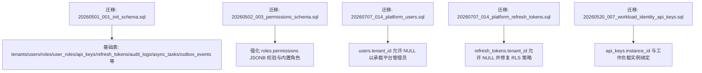
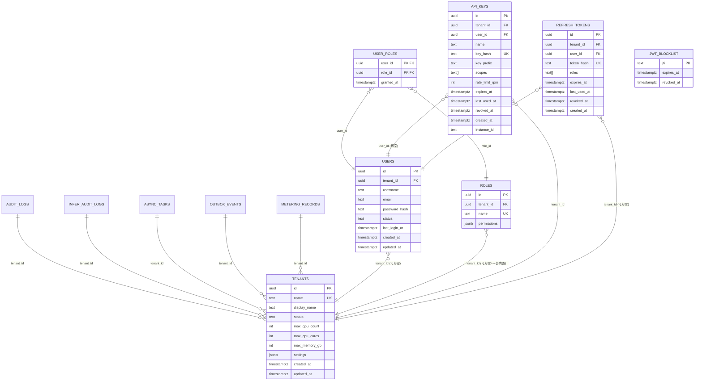

# 核心表结构

<cite>
**本文引用的文件**
- [20260501_001_init_schema.sql](file://repo/deploy/migrations/20260501_001_init_schema.sql)
- [20260707_014_platform_users.sql](file://repo/deploy/migrations/20260707_014_platform_users.sql)
- [20260520_007_workload_identity_api_keys.sql](file://repo/deploy/migrations/20260520_007_workload_identity_api_keys.sql)
- [20260502_003_permissions_schema.sql](file://repo/deploy/migrations/20260502_003_permissions_schema.sql)
</cite>

## 目录
1. [简介](#简介)
2. [项目结构](#项目结构)
3. [核心组件](#核心组件)
4. [架构总览](#架构总览)
5. [详细组件分析](#详细组件分析)
6. [依赖关系分析](#依赖关系分析)
7. [性能考虑](#性能考虑)
8. [故障排查指南](#故障排查指南)
9. [结论](#结论)
10. [附录](#附录)

## 简介
本文件聚焦平台的核心数据模型，围绕多租户隔离、身份与权限、API 密钥生命周期等关键能力，系统梳理主要业务表的定义、字段含义、约束与索引策略，并给出表间关系映射、查询优化建议以及扩展性设计考量。文档以数据库迁移脚本为依据，确保内容与实际落地一致。

## 项目结构
核心表结构由一组按时间顺序执行的数据库迁移脚本维护，其中初始 schema 定义了租户、用户、角色、API 密钥、认证令牌、审计日志、异步任务、计量记录等基础表，后续迁移逐步增强平台管理员支持、刷新令牌兼容性与 API 密钥工作负载绑定能力。

图表来源
- [20260501_001_init_schema.sql:1-658](file://repo/deploy/migrations/20260501_001_init_schema.sql#L1-L658)
- [20260502_003_permissions_schema.sql:1-77](file://repo/deploy/migrations/20260502_003_permissions_schema.sql#L1-L77)
- [20260707_014_platform_users.sql:1-81](file://repo/deploy/migrations/20260707_014_platform_users.sql#L1-L81)
- [20260707_014_platform_refresh_tokens.sql:1-44](file://repo/deploy/migrations/20260707_014_platform_refresh_tokens.sql#L1-L44)
- [20260520_007_workload_identity_api_keys.sql:1-22](file://repo/deploy/migrations/20260520_007_workload_identity_api_keys.sql#L1-L22)

章节来源
- [20260501_001_init_schema.sql:1-658](file://repo/deploy/migrations/20260501_001_init_schema.sql#L1-L658)

## 核心组件
本节概述与“租户、用户、角色、API 密钥”直接相关的基础表及其职责：
- tenants：多租户边界与配额、状态、配置
- users：租户内用户与平台管理员（tenant_id 可为空）
- roles：角色定义与权限集合（JSONB），支持平台内置与租户自定义
- user_roles：用户与角色的多对多关系
- api_keys：API 密钥元数据、作用域、速率限制、过期与撤销
- refresh_tokens：刷新令牌哈希、角色、过期与撤销
- jwt_blocklist：JWT 黑名单
- audit_logs/inference_audit_logs：操作与推理调用审计日志（分区表）
- async_tasks/outbox_events：异步任务与出站事件（跨服务消息）
- metering_records：资源使用计量（可转 TimescaleDB）

章节来源
- [20260501_001_init_schema.sql:32-121](file://repo/deploy/migrations/20260501_001_init_schema.sql#L32-L121)
- [20260501_001_init_schema.sql:254-281](file://repo/deploy/migrations/20260501_001_init_schema.sql#L254-L281)
- [20260501_001_init_schema.sql:354-406](file://repo/deploy/migrations/20260501_001_init_schema.sql#L354-L406)
- [20260501_001_init_schema.sql:440-454](file://repo/deploy/migrations/20260501_001_init_schema.sql#L440-L454)
- [20260501_001_init_schema.sql:499-523](file://repo/deploy/migrations/20260501_001_init_schema.sql#L499-L523)

## 架构总览
下图展示核心实体之间的关系，包括外键约束与级联行为，体现多租户隔离与权限体系。

图表来源
- [20260501_001_init_schema.sql:32-121](file://repo/deploy/migrations/20260501_001_init_schema.sql#L32-L121)
- [20260501_001_init_schema.sql:254-281](file://repo/deploy/migrations/20260501_001_init_schema.sql#L254-L281)
- [20260501_001_init_schema.sql:354-406](file://repo/deploy/migrations/20260501_001_init_schema.sql#L354-L406)
- [20260501_001_init_schema.sql:440-454](file://repo/deploy/migrations/20260501_001_init_schema.sql#L440-L454)
- [20260501_001_init_schema.sql:499-523](file://repo/deploy/migrations/20260501_001_init_schema.sql#L499-L523)
- [20260707_014_platform_users.sql:26-66](file://repo/deploy/migrations/20260707_014_platform_users.sql#L26-L66)
- [20260707_014_platform_refresh_tokens.sql:13-33](file://repo/deploy/migrations/20260707_014_platform_refresh_tokens.sql#L13-L33)
- [20260520_007_workload_identity_api_keys.sql:6-21](file://repo/deploy/migrations/20260520_007_workload_identity_api_keys.sql#L6-L21)

## 详细组件分析

### 租户表 tenants
- 主键：id（UUID，默认随机）
- 唯一标识：name（TEXT，UNIQUE）
- 显示名：display_name（TEXT）
- 状态：status（CHECK：active/suspended/deleted）
- 配额：max_gpu_count、max_cpu_cores、max_memory_gb（INT，0 表示不限）
- 配置：settings（JSONB，默认空对象）
- 时间戳：created_at、updated_at（TIMESTAMPTZ）
- 业务含义：作为所有租户级资源的隔离边界；通过 RLS 强制按 app.current_tenant_id 过滤
- 扩展性：settings 提供弹性扩展点，便于新增租户级开关或特性

章节来源
- [20260501_001_init_schema.sql:32-44](file://repo/deploy/migrations/20260501_001_init_schema.sql#L32-L44)
- [20260501_001_init_schema.sql:528-568](file://repo/deploy/migrations/20260501_001_init_schema.sql#L528-L568)

### 用户表 users
- 主键：id（UUID）
- 租户关联：tenant_id（UUID，可为空，用于平台管理员）
- 账号信息：username、email（TEXT）
- 认证：password_hash（TEXT，外部 OIDC 用户可为空）
- 状态：status（CHECK：active/disabled）
- 登录时间：last_login_at（TIMESTAMPTZ）
- 时间戳：created_at、updated_at
- 唯一性：
  - 租户用户：(tenant_id, username)、(tenant_id, email) 唯一
  - 平台管理员：username、email 全局唯一（通过部分唯一索引实现）
- 索引：idx_users_tenant_id（加速按租户查询）
- 业务含义：统一承载租户用户与平台管理员；通过 user_roles 与角色关联
- 扩展性：支持 OIDC 集成（password_hash 为空）、多因素登录扩展字段预留

章节来源
- [20260501_001_init_schema.sql:50-64](file://repo/deploy/migrations/20260501_001_init_schema.sql#L50-L64)
- [20260707_014_platform_users.sql:26-66](file://repo/deploy/migrations/20260707_014_platform_users.sql#L26-L66)

### 角色表 roles
- 主键：id（UUID）
- 租户关联：tenant_id（UUID，可为空；NULL 表示平台内置角色）
- 名称：name（TEXT，UNIQUE 于 tenant_id）
- 权限：permissions（JSONB，数组，每个元素包含 resource、actions、scope）
- 约束：roles_permissions_schema 校验 permissions 格式与合法 scope（tenant/own/platform）
- 内置角色：platform-admin、tenant-admin、user、auditor（平台内置，tenant_id=NULL）
- 业务含义：RBAC 的权限载体；通过 user_roles 与用户建立多对多关系
- 扩展性：permissions 支持细粒度资源与动作控制，便于未来新增资源类型

章节来源
- [20260501_001_init_schema.sql:66-72](file://repo/deploy/migrations/20260501_001_init_schema.sql#L66-L72)
- [20260502_003_permissions_schema.sql:6-77](file://repo/deploy/migrations/20260502_003_permissions_schema.sql#L6-L77)

### 用户角色关联表 user_roles
- 复合主键：(user_id, role_id)
- 外键：user_id → users(id) ON DELETE CASCADE；role_id → roles(id) ON DELETE CASCADE
- 授予时间：granted_at（TIMESTAMPTZ）
- 业务含义：实现用户与角色的多对多关系，支持动态授权与撤销
- 扩展性：可扩展 granted_by、reason 等审计字段

章节来源
- [20260501_001_init_schema.sql:74-79](file://repo/deploy/migrations/20260501_001_init_schema.sql#L74-L79)

### API 密钥表 api_keys
- 主键：id（UUID）
- 租户关联：tenant_id（UUID，NOT NULL）
- 用户关联：user_id（UUID，可空，删除时 SET NULL）
- 密钥元数据：name、key_hash（SHA256，UNIQUE）、key_prefix（展示用前缀）
- 权限范围：scopes（TEXT[]，默认空数组）
- 限流：rate_limit_rpm（INT，默认 60）
- 生命周期：expires_at（可空，表示永不过期）、last_used_at、revoked_at
- 工作负载绑定：instance_id（TEXT，可选，删除实例时回收）
- 索引：idx_api_keys_tenant_id、idx_api_keys_instance（条件索引，仅当 instance_id 非空）
- 业务含义：为应用或服务提供短期或长期访问凭证；支持按租户隔离与作用域控制
- 扩展性：可结合 scopes 与 rate_limit_rpm 实现精细化网关鉴权与限流

章节来源
- [20260501_001_init_schema.sql:85-99](file://repo/deploy/migrations/20260501_001_init_schema.sql#L85-L99)
- [20260520_007_workload_identity_api_keys.sql:6-21](file://repo/deploy/migrations/20260520_007_workload_identity_api_keys.sql#L6-L21)

### 刷新令牌表 refresh_tokens
- 主键：id（UUID）
- 租户关联：tenant_id（UUID，可为空，平台管理员场景）
- 用户关联：user_id（UUID，NOT NULL）
- 令牌哈希：token_hash（SHA256，UNIQUE）
- 角色：roles（TEXT[]，默认空数组）
- 生命周期：expires_at、last_used_at、revoked_at
- 索引：idx_refresh_tokens_tenant_id、idx_refresh_tokens_expires、idx_refresh_tokens_user_id
- 业务含义：存储刷新令牌的哈希值，支持撤销与批量吊销
- 扩展性：可结合 RLS 与租户隔离策略进行安全访问控制

章节来源
- [20260501_001_init_schema.sql:108-120](file://repo/deploy/migrations/20260501_001_init_schema.sql#L108-L120)
- [20260707_014_platform_refresh_tokens.sql:13-33](file://repo/deploy/migrations/20260707_014_platform_refresh_tokens.sql#L13-L33)

### JWT 黑名单表 jwt_blocklist
- 主键：jti（TEXT）
- 过期时间：expires_at（TIMESTAMPTZ）
- 撤销时间：revoked_at（TIMESTAMPTZ）
- 索引：idx_jwt_blocklist_expires
- 业务含义：用于快速判断已撤销或过期的 JWT，支持定时清理

章节来源
- [20260501_001_init_schema.sql:101-107](file://repo/deploy/migrations/20260501_001_init_schema.sql#L101-L107)

### 审计日志表 audit_logs 与推理审计日志 inference_audit_logs
- audit_logs：操作层面审计，按月分区，包含租户、用户、请求ID、动作、结果、详情、IP、UA
- inference_audit_logs：推理调用审计，高写入量，按月分区，包含租户、服务ID、用户、API Key、请求ID、模型名、输入输出 Token、耗时、状态码
- 索引：按租户与时间排序，便于报表与审计查询
- 业务含义：满足合规与问题定位需求，支持按租户隔离与时间范围检索

章节来源
- [20260501_001_init_schema.sql:254-281](file://repo/deploy/migrations/20260501_001_init_schema.sql#L254-L281)
- [20260501_001_init_schema.sql:499-523](file://repo/deploy/migrations/20260501_001_init_schema.sql#L499-L523)

### 异步任务表 async_tasks 与出站事件 outbox_events
- async_tasks：通用异步任务，含幂等键、任务类型、资源类型与 ID、状态机、重试、租约、心跳、进度、补偿动作、死信队列、回调 URL
- outbox_events：保证“写 DB + 发 NATS 消息”的原子性，publisher 轮询未发布事件
- 索引：按租户与状态、任务类型、租约、死信等维度优化查询
- 业务含义：支撑跨服务可靠消息与任务编排，避免消息丢失与重复处理

章节来源
- [20260501_001_init_schema.sql:354-406](file://repo/deploy/migrations/20260501_001_init_schema.sql#L354-L406)

### 计量记录表 metering_records
- 主键：(id, recorded_at)
- 租户：tenant_id（UUID）
- 资源维度：az_name、resource_type、resource_id、quantity、unit
- 时间：recorded_at（TIMESTAMPTZ）
- 索引：按租户与时间、资源类型优化
- 业务含义：计费与用量统计，可转换为 TimescaleDB hypertable 提升时序查询性能

章节来源
- [20260501_001_init_schema.sql:440-454](file://repo/deploy/migrations/20260501_001_init_schema.sql#L440-L454)

## 依赖关系分析
- 外键与级联：
  - users.tenant_id → tenants.id（ON DELETE CASCADE，租户删除级联用户）
  - roles.tenant_id → tenants.id（ON DELETE CASCADE，租户删除级联角色）
  - user_roles.user_id → users.id（ON DELETE CASCADE）
  - user_roles.role_id → roles.id（ON DELETE CASCADE）
  - api_keys.tenant_id → tenants.id（ON DELETE CASCADE）
  - api_keys.user_id → users.id（ON DELETE SET NULL）
  - refresh_tokens.tenant_id → tenants.id（ON DELETE CASCADE）
  - refresh_tokens.user_id → users.id（ON DELETE CASCADE）
- 租户隔离：
  - 多数表启用行级安全（RLS），基于 app.current_tenant_id 强制隔离
  - refresh_tokens 经迁移后允许 tenant_id IS NULL（平台管理员），并调整 RLS 策略放行
- 索引策略：
  - 高频查询列建立索引（如 users.tenant_id、api_keys.tenant_id、refresh_tokens.expires_at）
  - 条件索引优化特定场景（如 api_keys.instance_id 非空时）
  - 审计与计量表采用分区与时间索引，提升历史数据查询效率

章节来源
- [20260501_001_init_schema.sql:52-120](file://repo/deploy/migrations/20260501_001_init_schema.sql#L52-L120)
- [20260501_001_init_schema.sql:528-627](file://repo/deploy/migrations/20260501_001_init_schema.sql#L528-L627)
- [20260707_014_platform_refresh_tokens.sql:13-33](file://repo/deploy/migrations/20260707_014_platform_refresh_tokens.sql#L13-L33)

## 性能考虑
- 分区表：inference_audit_logs、audit_logs 按月分区，降低大表扫描成本
- 条件索引：api_keys.instance_id 的条件索引减少无效扫描
- 时间序列优化：metering_records 可转换为 TimescaleDB hypertable，提升聚合与时间窗口查询性能
- 索引覆盖：针对常见查询模式（按租户+时间、按租户+状态）建立复合索引
- 缓存与幂等：outbox_events 与 async_tasks 保障消息与任务处理的幂等与可靠性，避免重复计算

章节来源
- [20260501_001_init_schema.sql:254-281](file://repo/deploy/migrations/20260501_001_init_schema.sql#L254-L281)
- [20260501_001_init_schema.sql:354-406](file://repo/deploy/migrations/20260501_001_init_schema.sql#L354-L406)
- [20260501_001_init_schema.sql:440-454](file://repo/deploy/migrations/20260501_001_init_schema.sql#L440-L454)

## 故障排查指南
- 租户隔离失败：检查 RLS 策略是否生效，确认连接设置 app.current_tenant_id 是否正确
- 平台管理员无法插入刷新令牌：确认 refresh_tokens.tenant_id 允许 NULL 且 RLS 策略已更新
- API 密钥未生效：检查 key_hash 唯一性冲突、scopes 与 rate_limit_rpm 配置、instance_id 绑定与实例删除后的回收逻辑
- 审计日志缺失：确认分区表创建与维护任务正常执行，检查索引与查询条件
- 异步任务卡住：查看 lease_until 与 last_heartbeat_at，识别僵尸任务并重新分配

章节来源
- [20260501_001_init_schema.sql:528-627](file://repo/deploy/migrations/20260501_001_init_schema.sql#L528-L627)
- [20260707_014_platform_refresh_tokens.sql:13-33](file://repo/deploy/migrations/20260707_014_platform_refresh_tokens.sql#L13-L33)
- [20260501_001_init_schema.sql:354-406](file://repo/deploy/migrations/20260501_001_init_schema.sql#L354-L406)

## 结论
该核心表结构以多租户隔离为基础，结合 RBAC 与 API 密钥机制，构建了统一的身份与权限体系。通过分区表、条件索引与 RLS 策略，兼顾了安全性与性能。后续扩展可在 settings、permissions、scopes 等 JSONB/数组字段上灵活演进，同时保持向后兼容。

## 附录
- 典型查询优化建议：
  - 按租户+时间范围检索审计日志，优先使用分区裁剪与时间索引
  - 查询用户角色时，先过滤租户再 JOIN，利用 idx_users_tenant_id 与 user_roles 主键
  - API 密钥鉴权路径中，优先使用 key_hash 唯一索引与 tenant_id 条件索引
- 扩展性建议：
  - 在 roles.permissions 中新增资源类型与动作，配合权限校验中间件
  - 在 api_keys.scopes 中细化作用域，结合网关层限流与审计
  - 将 metering_records 与 inference_audit_logs 迁移至 TimescaleDB，提升时序分析能力