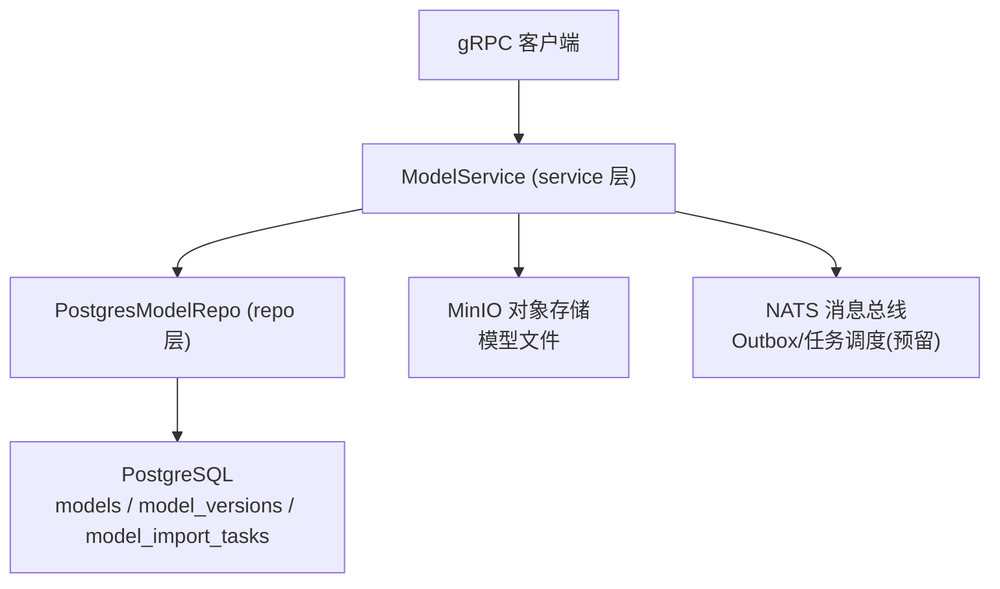
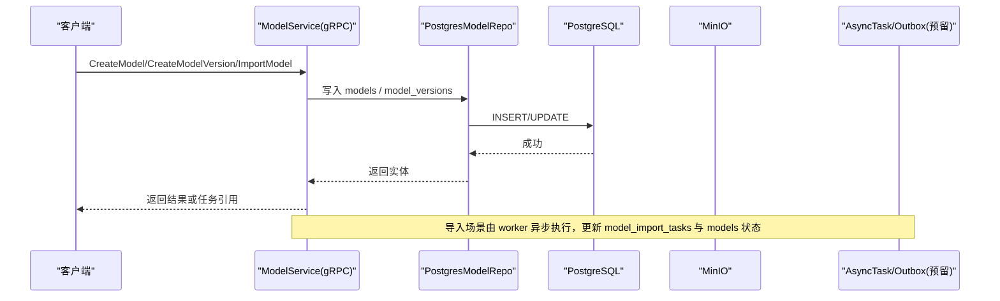
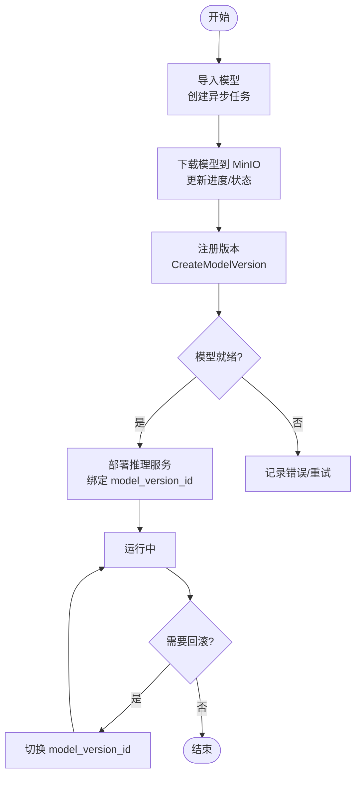
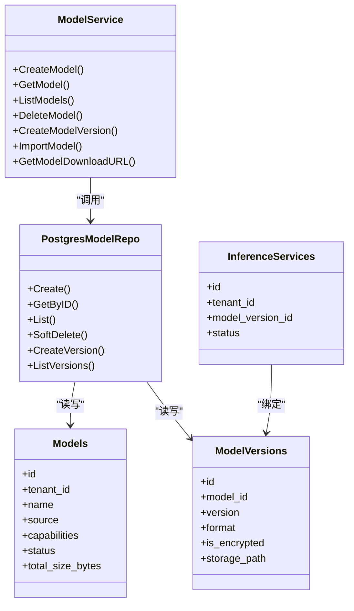

# 模型管理表

<cite>
**本文引用的文件**
- [20260501_001_init_schema.sql](file://repo/deploy/migrations/20260501_001_init_schema.sql)
- [model_service.proto](file://repo/api/proto/model/v1/model_service.proto)
- [model_service.go](file://services/model-service/internal/service/model_service.go)
- [model_repo.go](file://services/model-service/internal/repo/model_repo.go)
- [main.go](file://services/model-service/main.go)
</cite>

## 目录
1. [简介](#简介)
2. [项目结构](#项目结构)
3. [核心组件](#核心组件)
4. [架构总览](#架构总览)
5. [详细组件分析](#详细组件分析)
6. [依赖关系分析](#依赖关系分析)
7. [性能考量](#性能考量)
8. [故障排查指南](#故障排查指南)
9. [结论](#结论)
10. [附录](#附录)

## 简介
本文件聚焦于平台“模型管理”相关的数据表设计与实现，覆盖以下主题：
- models（模型）表：模型元数据、来源管理（上传、HuggingFace、ModelScope、内置）、能力标签、状态管理等。
- model_versions（模型版本）表：版本号管理、加密支持、格式类型、存储路径、配置信息等。
- model_import_tasks（模型导入任务）表：异步任务状态跟踪、进度监控、错误处理。
- 模型生命周期管理：从导入到部署的完整流程。
- 模型版本控制与回滚机制：基于版本表的版本化与推理服务关联的回滚策略。

## 项目结构
围绕模型管理的代码与数据库定义分布在如下位置：
- 数据库迁移脚本定义了 models、model_versions、model_import_tasks、inference_services 等核心表及行级安全策略。
- gRPC 接口定义在 model_service.proto，描述模型创建、版本注册、导入、下载等能力。
- 模型服务实现位于 services/model-service，包含 service 层与 repo 层，负责业务校验、事务与持久化。
- 入口 main.go 完成依赖注入与 gRPC 服务启动。

图表来源
- [model_service.proto:12-40](file://repo/api/proto/model/v1/model_service.proto#L12-L40)
- [model_service.go:22-34](file://services/model-service/internal/service/model_service.go#L22-L34)
- [model_repo.go:16-23](file://services/model-service/internal/repo/model_repo.go#L16-L23)
- [20260501_001_init_schema.sql:126-180](file://repo/deploy/migrations/20260501_001_init_schema.sql#L126-L180)

章节来源
- [model_service.proto:12-40](file://repo/api/proto/model/v1/model_service.proto#L12-L40)
- [model_service.go:22-34](file://services/model-service/internal/service/model_service.go#L22-L34)
- [model_repo.go:16-23](file://services/model-service/internal/repo/model_repo.go#L16-L23)
- [20260501_001_init_schema.sql:126-180](file://repo/deploy/migrations/20260501_001_init_schema.sql#L126-L180)

## 核心组件
- 模型元数据表 models：记录租户隔离、名称唯一性、来源、能力标签、状态、错误信息、累计大小等。
- 模型版本表 model_versions：记录每个版本的版本标识、加密标志与算法、格式、大小、校验和、存储路径、配置 JSON、创建时间；通过外键关联 models。
- 模型导入任务表 model_import_tasks：记录导入来源、仓库 ID、状态、进度、字节统计、错误信息、起止时间等。
- 推理服务表 inference_services：绑定具体 model_version_id，承载部署状态、资源规格、K8s 命名空间与部署名等。
- 通用异步任务表 async_tasks：跨服务的幂等任务、租约、重试、死信队列、回调等通用能力。
- Outbox 事件表 outbox_events：保证“写库 + 发事件”的原子性，供事件发布器轮询投递。

章节来源
- [20260501_001_init_schema.sql:126-208](file://repo/deploy/migrations/20260501_001_init_schema.sql#L126-L208)
- [20260501_001_init_schema.sql:355-406](file://repo/deploy/migrations/20260501_001_init_schema.sql#L355-L406)

## 架构总览
模型管理涉及“元数据 + 版本 + 任务 + 存储 + 事件”的多组件协作：
- 客户端通过 gRPC 调用 ModelService 进行模型创建、版本注册、导入、下载等操作。
- Service 层负责参数校验、租户上下文设置、事务边界控制、错误映射。
- Repo 层执行 SQL 操作，维护 models 与 model_versions 的关系，并在创建版本时更新模型的累计大小与状态。
- 模型文件存储在 MinIO，通过预签名 URL 直传/直读，避免服务成为瓶颈。
- 导入任务采用异步模式，使用 async_tasks/outbox 机制（预留），worker 消费任务并更新 model_import_tasks 与 models 状态。
- 推理服务通过 inference_services 绑定 model_version_id，启动时通过 GetModelDownloadURL 获取预签名下载链接，Init Container 可解密并加载模型。

图表来源
- [model_service.proto:12-40](file://repo/api/proto/model/v1/model_service.proto#L12-L40)
- [model_service.go:36-184](file://services/model-service/internal/service/model_service.go#L36-L184)
- [model_repo.go:90-245](file://services/model-service/internal/repo/model_repo.go#L90-L245)
- [20260501_001_init_schema.sql:126-208](file://repo/deploy/migrations/20260501_001_init_schema.sql#L126-L208)

## 详细组件分析

### models（模型）表设计
- 字段要点
  - tenant_id：租户隔离，配合 RLS 强制隔离。
  - name：模型名称，租户内唯一；服务层对名称做正则校验。
  - display_name/description：展示与描述信息。
  - source：来源枚举 upload/huggingface/modelscope/builtin，用于区分导入方式。
  - source_repo_id：HF/MS 的仓库 ID，便于溯源。
  - capabilities：能力标签数组，如 text-generation/embedding/speech-to-text/ocr。
  - status：状态机 pending/downloading/ready/error/deleted，软删除后不可恢复。
  - error_message：失败原因。
  - total_size_bytes：累计所有版本的大小，便于配额与统计。
  - created_at/updated_at：审计时间戳。
- 索引与约束
  - 唯一约束 (tenant_id, name)。
  - 索引 idx_models_tenant_id、idx_models_status 提升查询与过滤效率。
- 行为说明
  - 创建模型时默认 source=upload，capabilities 可为空。
  - 删除为软删除，将 status 置为 deleted，后续查询需排除 deleted。
  - 列表查询支持按 status 过滤与游标分页。

章节来源
- [20260501_001_init_schema.sql:126-145](file://repo/deploy/migrations/20260501_001_init_schema.sql#L126-L145)
- [model_service.go:36-70](file://services/model-service/internal/service/model_service.go#L36-L70)
- [model_service.go:85-117](file://services/model-service/internal/service/model_service.go#L85-L117)
- [model_service.go:119-137](file://services/model-service/internal/service/model_service.go#L119-L137)
- [model_repo.go:90-114](file://services/model-service/internal/repo/model_repo.go#L90-L114)
- [model_repo.go:138-198](file://services/model-service/internal/repo/model_repo.go#L138-L198)
- [model_repo.go:200-216](file://services/model-service/internal/repo/model_repo.go#L200-L216)

### model_versions（模型版本）表设计
- 字段要点
  - model_id：外键关联 models(id)，级联删除。
  - version：版本标识，如 v1/latest，与 model_id 联合唯一。
  - is_encrypted/encrypt_algo/encrypt_hint：加密开关、算法（sm4/zuc/aes256gcm）、用户自定义密钥提示（非密钥本身）。
  - format：模型格式 safetensors/gguf/pytorch。
  - size_bytes/checksum_sha256：体积与完整性校验。
  - storage_path：MinIO 对象路径，实际文件落盘位置。
  - config_json：模型运行配置（如 max_tokens 等），JSONB 扩展性强。
  - created_at：创建时间。
- 索引与约束
  - 唯一约束 (model_id, version)。
  - 索引 idx_model_versions_model_id 加速按模型查询版本。
- 行为说明
  - 创建版本时需传入 storage_path、format、size_bytes、checksum 等，若加密则必须提供 encrypt_algo。
  - 创建成功后会更新对应 models.status=ready，并累加 total_size_bytes。
  - 列表版本按创建时间倒序，便于最新优先。

章节来源
- [20260501_001_init_schema.sql:147-163](file://repo/deploy/migrations/20260501_001_init_schema.sql#L147-L163)
- [model_service.go:139-172](file://services/model-service/internal/service/model_service.go#L139-L172)
- [model_service.go:195-218](file://services/model-service/internal/service/model_service.go#L195-L218)
- [model_repo.go:218-245](file://services/model-service/internal/repo/model_repo.go#L218-L245)
- [model_repo.go:284-310](file://services/model-service/internal/repo/model_repo.go#L284-L310)

### model_import_tasks（模型导入任务）表设计
- 字段要点
  - tenant_id：租户隔离。
  - model_id：可选，关联已创建的模型元数据。
  - source：huggingface/modelscope，限定来源。
  - source_repo_id：远程仓库 ID。
  - status：pending/running/completed/failed/cancelled。
  - progress_pct/downloaded_bytes/total_bytes：进度与下载统计。
  - error_message：失败原因。
  - started_at/completed_at/created_at：时间戳。
- 行为说明
  - 导入为异步任务，服务端返回任务引用，客户端轮询或接收 Webhook 通知。
  - Worker 更新进度与状态，完成后同步更新 models 状态与累计大小。
  - 结合 async_tasks/outbox 可实现重试、死信、补偿等通用能力（当前预留）。

章节来源
- [20260501_001_init_schema.sql:165-180](file://repo/deploy/migrations/20260501_001_init_schema.sql#L165-L180)
- [model_service.proto:102-109](file://repo/api/proto/model/v1/model_service.proto#L102-L109)
- [model_service.go:178-180](file://services/model-service/internal/service/model_service.go#L178-L180)

### 模型生命周期管理（导入到部署）
- 导入阶段
  - 客户端调用 ImportModel，服务端创建任务（async_tasks/outbox 预留），worker 拉取模型至 MinIO，更新 model_import_tasks 进度与 models 状态。
  - 支持断点续传与分片记录（规划中），确保大模型稳定下载。
- 版本注册
  - 文件上传完成后，客户端调用 CreateModelVersion 登记版本元数据（storage_path、checksum、size、加密信息等）。
  - 服务层校验格式、加密算法、必填字段，写入 model_versions，并更新 models 状态为 ready 与累计大小。
- 部署阶段
  - 通过 InferenceService 绑定 model_version_id，指定副本数、GPU 规格、并发度等。
  - 推理 Pod 启动时，Init Container 调用 GetModelDownloadURL 获取预签名下载链接，按需解密并加载模型。
- 回滚机制
  - 通过切换 InferenceService 绑定的 model_version_id 实现版本回滚。
  - 结合工作负载实例的回滚能力（快照/历史版本），可在更细粒度上恢复。

图表来源
- [model_service.proto:12-40](file://repo/api/proto/model/v1/model_service.proto#L12-L40)
- [model_service.go:139-184](file://services/model-service/internal/service/model_service.go#L139-L184)
- [20260501_001_init_schema.sql:186-208](file://repo/deploy/migrations/20260501_001_init_schema.sql#L186-L208)

### 版本控制与回滚机制
- 版本控制
  - 每个模型可拥有多个版本，version 字段唯一且有序，支持 latest 语义。
  - 版本元数据包含格式、加密、校验、存储路径与配置，便于多格式与多环境复用。
- 回滚策略
  - 推理服务通过 model_version_id 指向具体版本，回滚即切换该字段。
  - 结合工作负载实例的回滚能力（快照/历史），可在运行时快速恢复到已知稳定版本。
  - 建议在 UI 与 API 层提供“查看版本历史”“一键回滚”能力，并记录审计日志。

章节来源
- [20260501_001_init_schema.sql:147-163](file://repo/deploy/migrations/20260501_001_init_schema.sql#L147-L163)
- [20260501_001_init_schema.sql:186-208](file://repo/deploy/migrations/20260501_001_init_schema.sql#L186-L208)

## 依赖关系分析
- 服务层依赖
  - ModelService 依赖 PostgresModelRepo 进行数据访问，并通过 pgxpool 管理连接。
  - 租户上下文通过 context 传递，SQL 执行前设置 app.current_tenant_id，配合 RLS 强制隔离。
- 数据层依赖
  - models 与 model_versions 通过外键关联，删除模型时级联删除版本。
  - inference_services 通过 model_version_id 绑定具体版本，形成“模型 -> 版本 -> 服务”的链路。
- 外部依赖
  - MinIO：模型文件存储，通过预签名 URL 直传/直读。
  - NATS：事件总线，预留 Outbox 与任务调度，保障可靠性与解耦。

图表来源
- [model_service.go:22-34](file://services/model-service/internal/service/model_service.go#L22-L34)
- [model_repo.go:16-23](file://services/model-service/internal/repo/model_repo.go#L16-L23)
- [20260501_001_init_schema.sql:126-208](file://repo/deploy/migrations/20260501_001_init_schema.sql#L126-L208)

章节来源
- [model_service.go:22-34](file://services/model-service/internal/service/model_service.go#L22-L34)
- [model_repo.go:16-23](file://services/model-service/internal/repo/model_repo.go#L16-L23)
- [20260501_001_init_schema.sql:126-208](file://repo/deploy/migrations/20260501_001_init_schema.sql#L126-L208)

## 性能考量
- 索引优化
  - models：idx_models_tenant_id、idx_models_status 提升按租户与状态过滤的效率。
  - model_versions：idx_model_versions_model_id 加速按模型查询版本。
  - inference_services：idx_inference_services_tenant、idx_inference_services_status 提升部署状态查询。
- 分页与游标
  - ListModels 使用游标分页，避免深翻页性能问题。
- 事务边界
  - 创建模型、删除模型、创建版本均使用事务，保证一致性。
- 存储与网络
  - 模型文件直传 MinIO，减少服务带宽压力。
  - 预签名 URL 短期有效，降低安全风险。
- 异步任务
  - 导入任务通过 async_tasks/outbox 解耦，支持重试与死信，提高鲁棒性。

章节来源
- [20260501_001_init_schema.sql:144-163](file://repo/deploy/migrations/20260501_001_init_schema.sql#L144-L163)
- [20260501_001_init_schema.sql:186-208](file://repo/deploy/migrations/20260501_001_init_schema.sql#L186-L208)
- [model_service.go:49-69](file://services/model-service/internal/service/model_service.go#L49-L69)
- [model_service.go:148-171](file://services/model-service/internal/service/model_service.go#L148-L171)
- [model_repo.go:138-198](file://services/model-service/internal/repo/model_repo.go#L138-L198)

## 故障排查指南
- 常见错误与定位
  - 名称不合法：服务层对模型名称进行正则校验，失败返回 InvalidArgument。
  - 重复提交：租户内模型名称唯一，冲突返回 AlreadyExists。
  - 未找到：按 ID 查询不到或已软删除，返回 NotFound。
  - 权限不足：租户不匹配或无权限，返回 PermissionDenied/Unauthenticated。
- 导入任务失败
  - 检查 model_import_tasks.error_message 与 status。
  - 确认源站可达、仓库 ID 正确、网络策略允许外网访问（下载 Pod）。
- 版本注册失败
  - 校验 format、encrypt_algo、storage_path、size_bytes 是否满足要求。
  - 确认 MinIO 路径可写且文件存在。
- 推理服务部署失败
  - 检查 inference_services.status 与 error_message。
  - 确认 model_version_id 存在且文件可下载。
  - Init Container 解密失败时，核对 encrypt_algo 与密钥提示。

章节来源
- [model_service.go:186-218](file://services/model-service/internal/service/model_service.go#L186-L218)
- [model_service.go:282-297](file://services/model-service/internal/service/model_service.go#L282-L297)
- [20260501_001_init_schema.sql:165-180](file://repo/deploy/migrations/20260501_001_init_schema.sql#L165-L180)
- [20260501_001_init_schema.sql:186-208](file://repo/deploy/migrations/20260501_001_init_schema.sql#L186-L208)

## 结论
- 模型管理以 models 为核心，通过 model_versions 实现版本化，借助 model_import_tasks 完成异步导入，结合 inference_services 完成部署与回滚。
- 数据层通过 RLS、索引、唯一约束保障多租户隔离与数据一致性。
- 服务层提供清晰的 gRPC 接口，支持上传、导入、版本注册、下载等关键能力。
- 建议后续完善导入 worker、Outbox 发布器、UI 向导与审计日志，进一步提升可用性与可观测性。

## 附录
- 关键表关系
  - models 1:N model_versions
  - model_versions 1:N inference_services
- 关键字段说明
  - capabilities：文本生成、嵌入、语音转文本、OCR 等能力标签。
  - source：upload/huggingface/modelscope/builtin，区分来源。
  - status：pending/downloading/ready/error/deleted，模型状态机。
  - format：safetensors/gguf/pytorch，模型文件格式。
  - is_encrypted/encrypt_algo/encrypt_hint：加密支持与提示。
- 推荐实践
  - 使用游标分页查询模型列表，避免深翻页。
  - 导入任务启用重试与死信队列，记录详细错误信息。
  - 版本注册前进行完整性校验（checksum）与格式校验。
  - 推理服务部署前验证模型文件可下载与解密可用性。