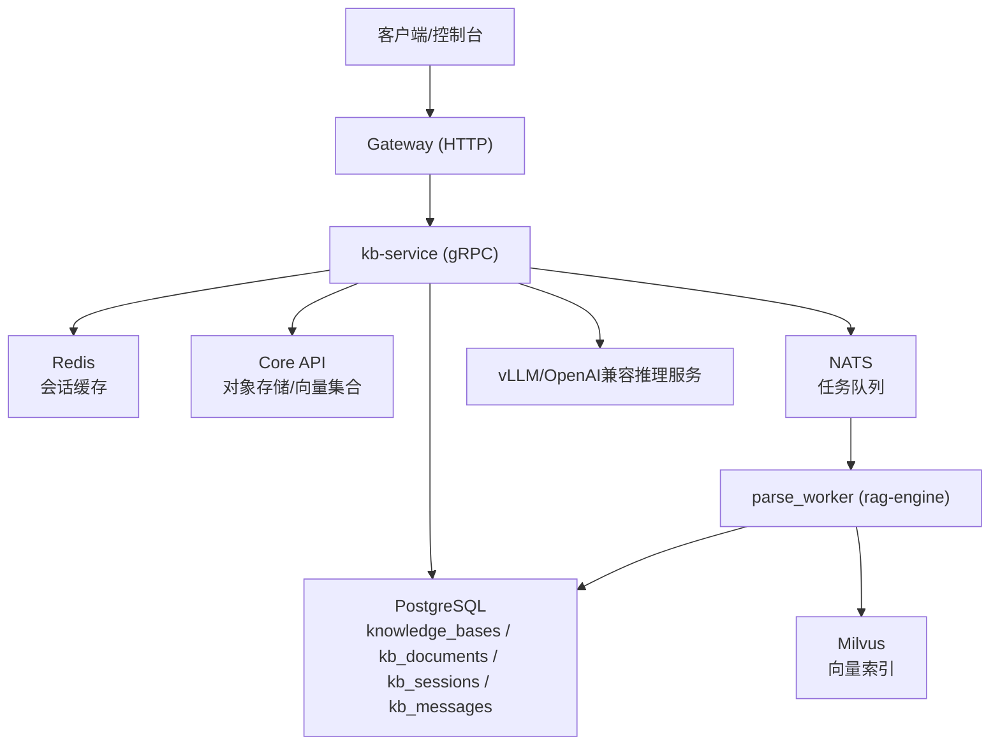
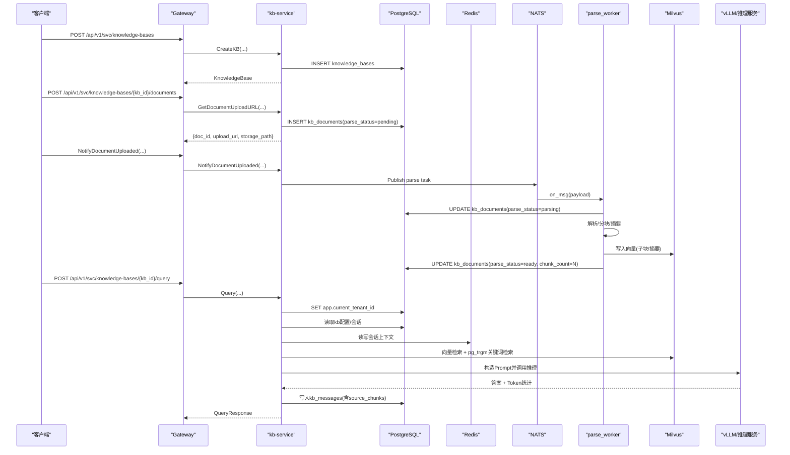
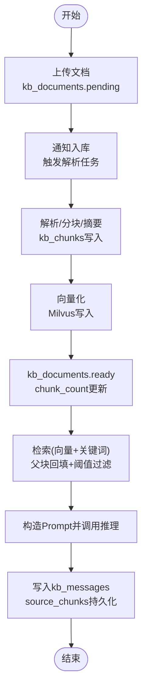
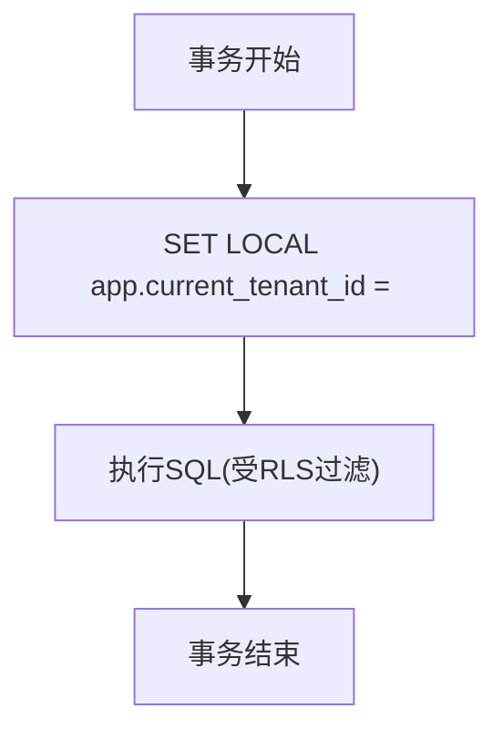
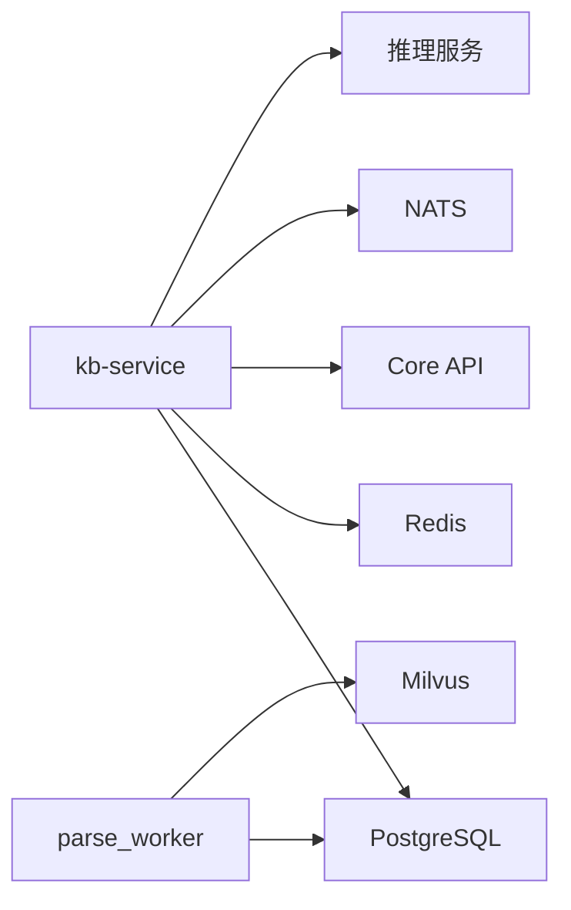

# 知识库相关表

<cite>
**本文引用的文件**
- [apply_kb_migration.py](file://repo/scripts/apply_kb_migration.py)
- [kb_service.proto](file://repo/api/proto/kb/v1/kb_service.proto)
- [rls.py](file://repo/services/kb-service/app/repositories/rls.py)
- [message.py](file://repo/services/kb-service/app/repositories/message.py)
- [parse_worker.py](file://repo/ai/rag-engine/app/workers/parse_worker.py)
- [embed_service.py](file://repo/ai/rag-engine/app/services/embed_service.py)
- [milvus.py](file://repo/ai/rag-engine/app/core/milvus.py)
- [spec-services-kb-service.md](file://repo/services/tasks/modules/spec/core/knowledge/spec-services-kb-service.md)
- [kb_resources.go](file://repo/services/ani-gateway/internal/router/kb_resources.go)
</cite>

## 目录
1. [简介](#简介)
2. [项目结构](#项目结构)
3. [核心组件](#核心组件)
4. [架构总览](#架构总览)
5. [详细组件分析](#详细组件分析)
6. [依赖关系分析](#依赖关系分析)
7. [性能考量](#性能考量)
8. [故障排查指南](#故障排查指南)
9. [结论](#结论)
10. [附录](#附录)

## 简介
本文件聚焦知识库（Knowledge Base）相关数据模型与RAG流程的数据流转，覆盖以下要点：
- knowledge_bases（知识库）表设计：配置项、嵌入模型选择、分块大小、相似度阈值、检索模式等。
- kb_documents（知识库文档）表结构：文件元信息、解析状态机、分片计数、存储路径、校验和等。
- kb_sessions（会话）与 kb_messages（消息）的关系：对话历史管理、上下文维护、引用来源追踪。
- RAG流程数据模型：从文档上传到问答响应的完整数据流，包括向量检索、关键词检索、父块回填、LLM生成与结果持久化。
- 行级安全（RLS）在多租户隔离中的实现方式与调用约定。

## 项目结构
知识库相关数据由迁移脚本创建并启用RLS；业务侧通过kb-service暴露gRPC接口，网关转发至kb-service；解析与索引由rag-engine的parse_worker驱动，写入PostgreSQL与Milvus；会话与消息在kb-service中落库，并通过Redis缓存会话上下文。

图表来源
- [kb_resources.go:140-228](file://repo/services/ani-gateway/internal/router/kb_resources.go#L140-L228)
- [apply_kb_migration.py:11-180](file://repo/scripts/apply_kb_migration.py#L11-L180)
- [parse_worker.py:1-28](file://repo/ai/rag-engine/app/workers/parse_worker.py#L1-L28)
- [milvus.py:111-186](file://repo/ai/rag-engine/app/core/milvus.py#L111-L186)

章节来源
- [apply_kb_migration.py:11-180](file://repo/scripts/apply_kb_migration.py#L11-L180)
- [kb_resources.go:140-228](file://repo/services/ani-gateway/internal/router/kb_resources.go#L140-L228)

## 核心组件
- 知识库配置实体：knowledge_bases，承载租户、名称、描述、嵌入模型、分块大小、top_k、相似度阈值、检索模式、状态、文档计数等。
- 文档实体：kb_documents，记录文件元信息、存储路径、校验和、解析状态、分片计数、错误信息与解析时间戳。
- 会话与消息：kb_sessions与kb_messages，维护多轮对话历史、角色、内容、引用来源、Token用量与耗时。
- 辅助表：async_tasks与outbox_events，支撑异步任务编排与事件出队。
- 向量与文本检索：Milvus（向量）、pg_trgm（关键词），配合父块回填与阈值过滤。
- 行级安全：所有KB表启用RLS，通过设置当前租户上下文进行数据隔离。

章节来源
- [apply_kb_migration.py:14-75](file://repo/scripts/apply_kb_migration.py#L14-L75)
- [apply_kb_migration.py:77-123](file://repo/scripts/apply_kb_migration.py#L77-L123)
- [apply_kb_migration.py:125-180](file://repo/scripts/apply_kb_migration.py#L125-L180)

## 架构总览
知识库系统采用“服务+中间件”的分层架构：
- 接入层：Gateway将REST请求转换为gRPC调用，转发至kb-service。
- 业务层：kb-service负责知识库CRUD、文档上传URL签发、通知入库、查询编排、会话与消息持久化。
- 解析与索引层：rag-engine的parse_worker订阅NATS任务，执行解析、分块、摘要、向量化与索引写入。
- 存储层：PostgreSQL用于结构化数据与RLS隔离；Milvus用于向量检索；Redis用于会话缓存；对象存储用于原始文件。

图表来源
- [kb_resources.go:140-228](file://repo/services/ani-gateway/internal/router/kb_resources.go#L140-L228)
- [apply_kb_migration.py:14-75](file://repo/scripts/apply_kb_migration.py#L14-L75)
- [parse_worker.py:1-28](file://repo/ai/rag-engine/app/workers/parse_worker.py#L1-L28)
- [milvus.py:111-186](file://repo/ai/rag-engine/app/core/milvus.py#L111-L186)
- [message.py:128-180](file://repo/services/kb-service/app/repositories/message.py#L128-L180)

## 详细组件分析

### knowledge_bases（知识库）表
- 主键：id（UUID）
- 租户隔离：tenant_id（外键关联tenants）
- 基本属性：name、description
- 检索配置：
  - embedding_model：默认bge-m3，用于构建向量索引与查询嵌入
  - chunk_size：默认512，控制分块大小
  - top_k：默认5，控制检索返回数量
  - score_threshold：默认0.3，低于阈值的片段不进入LLM，避免幻觉
  - retrieval_mode：vector/hybrid/keyword，控制检索策略
- 状态与统计：status（active/rebuilding/deleted）、doc_count
- 时间戳：created_at、updated_at
- 唯一约束：(tenant_id, name)
- 索引：idx_kb_tenant_id

用途说明：
- 作为检索策略与模型选择的中心配置，影响后续解析、索引与问答行为。
- 在Query时允许请求参数覆盖KB默认值（如top_k、score_threshold、retrieval_mode）。

章节来源
- [apply_kb_migration.py:14-32](file://repo/scripts/apply_kb_migration.py#L14-L32)
- [kb_service.proto:57-66](file://repo/api/proto/kb/v1/kb_service.proto#L57-L66)
- [kb_service.proto:213-227](file://repo/api/proto/kb/v1/kb_service.proto#L213-L227)

### kb_documents（知识库文档）表
- 主键：id（UUID）
- 关联：kb_id（外键指向knowledge_bases）
- 租户隔离：tenant_id
- 文件元信息：file_name、file_type、file_size_bytes、storage_path、checksum_sha256
- 解析状态机：parse_status（pending/parsing/indexing/ready/failed）
- 分片计数：chunk_count（解析完成后更新）
- 错误信息：error_message
- 时间戳：parsed_at、created_at
- 索引：idx_kb_docs_kb_id、idx_kb_docs_parse_status

用途说明：
- 跟踪文档生命周期与解析进度，供前端展示与重试机制使用。
- 与对象存储路径绑定，支持两步式上传与校验。
- 与向量索引及kb_chunks保持同步，确保一致性。

章节来源
- [apply_kb_migration.py:34-51](file://repo/scripts/apply_kb_migration.py#L34-L51)
- [parse_worker.py:117-180](file://repo/ai/rag-engine/app/workers/parse_worker.py#L117-L180)
- [kb_service.proto:229-242](file://repo/api/proto/kb/v1/kb_service.proto#L229-L242)

### kb_sessions（会话）与 kb_messages（消息）表
- kb_sessions：
  - id（UUID）、kb_id（外键）、tenant_id、user_id、title、created_at
  - 作用：按知识库维度组织多轮对话，便于历史回溯与上下文重建
- kb_messages：
  - id（UUID）、session_id（外键）、tenant_id、role（user/assistant）、content、source_chunks（JSONB）、input_tokens、output_tokens、duration_ms、created_at
  - 索引：idx_kb_messages_session、idx_kb_messages_tenant
  - 作用：持久化每轮对话内容与引用来源，支持审计与溯源

关系与上下文维护：
- 会话与消息为一对多关系，消息按created_at排序形成对话时序。
- source_chunks记录引用片段，便于回答可解释性与溯源。
- 会话上下文同时缓存于Redis（最近20条消息，TTL 24小时），提高检索效率与容错性。

章节来源
- [apply_kb_migration.py:53-75](file://repo/scripts/apply_kb_migration.py#L53-L75)
- [message.py:128-180](file://repo/services/kb-service/app/repositories/message.py#L128-L180)

### kb_chunks（分块）表（补充）
- 字段：id、tenant_id、kb_id、doc_id、parent_chunk_id、chunk_type（child/parent/doc_summary）、content、parent_content、page_number、content_type、file_name、token_count、custom_metadata、created_at
- 索引：idx_kb_chunks_kb_doc、idx_kb_chunks_parent、idx_kb_chunks_type、GIN trgm索引
- 作用：存储解析后的父子块结构与元数据，支撑父块回填与关键词检索

章节来源
- [spec-services-kb-service.md:106-131](file://repo/services/tasks/modules/spec/core/knowledge/spec-services-kb-service.md#L106-L131)

### RAG流程数据模型与数据流
- 文档上传：
  - 客户端获取预签名上传URL，直传对象存储
  - kb-service在kb_documents创建pending记录，随后通知入库
- 解析与索引：
  - parse_worker消费任务，更新parse_status为parsing
  - 解析为节点后分块（parents/children/summaries），写入kb_chunks
  - 子块与摘要向量化写入Milvus，父块不直接索引但通过parent_content回填
  - 完成时更新kb_documents为ready并写入chunk_count
- 检索与问答：
  - 混合检索：Milvus向量检索 + pg_trgm关键词检索，RRF融合
  - 父块回填：命中子块或摘要后回填parent_content
  - 阈值过滤：低于score_threshold的片段不进入LLM
  - 会话上下文：Redis缓存最近消息，DB持久化kb_messages
  - 推理与响应：调用vLLM/OpenAI兼容端点，返回answer、sources、session_id、tokens

图表来源
- [parse_worker.py:1-28](file://repo/ai/rag-engine/app/workers/parse_worker.py#L1-L28)
- [embed_service.py:1-42](file://repo/ai/rag-engine/app/services/embed_service.py#L1-L42)
- [milvus.py:111-186](file://repo/ai/rag-engine/app/core/milvus.py#L111-L186)
- [message.py:128-180](file://repo/services/kb-service/app/repositories/message.py#L128-L180)

### 行级安全（RLS）在知识库数据隔离中的实现
- 所有KB表启用RLS并强制应用：ENABLE ROW LEVEL SECURITY; FORCE ROW LEVEL SECURITY
- 策略：tenant_isolation，条件为 tenant_id = NULLIF(current_setting('app.current_tenant_id', true), '')::uuid
- 调用约定：
  - 在每个事务内设置租户上下文：SET LOCAL app.current_tenant_id = '<tenant_id>'
  - 所有SQL操作受该上下文限制，确保跨租户数据隔离
- 适用场景：kb-service的repository、parse_worker的状态更新、查询时的租户透传

图表来源
- [apply_kb_migration.py:125-180](file://repo/scripts/apply_kb_migration.py#L125-L180)
- [rls.py:1-32](file://repo/services/kb-service/app/repositories/rls.py#L1-L32)
- [parse_worker.py:117-180](file://repo/ai/rag-engine/app/workers/parse_worker.py#L117-L180)

章节来源
- [apply_kb_migration.py:125-180](file://repo/scripts/apply_kb_migration.py#L125-L180)
- [rls.py:1-32](file://repo/services/kb-service/app/repositories/rls.py#L1-L32)

## 依赖关系分析
- kb-service依赖：
  - PostgreSQL：知识库、文档、会话、消息、任务、事件
  - Redis：会话上下文缓存
  - Core API：对象存储与向量集合管理
  - NATS：解析任务派发
- rag-engine依赖：
  - PostgreSQL：kb_documents状态、kb_chunks数据
  - Milvus：向量索引
  - vLLM/OpenAI兼容端点：推理服务
- 网关：
  - 将HTTP请求转换为gRPC调用，转发至kb-service

图表来源
- [kb_resources.go:140-228](file://repo/services/ani-gateway/internal/router/kb_resources.go#L140-L228)
- [parse_worker.py:1-28](file://repo/ai/rag-engine/app/workers/parse_worker.py#L1-L28)
- [milvus.py:111-186](file://repo/ai/rag-engine/app/core/milvus.py#L111-L186)

章节来源
- [kb_resources.go:140-228](file://repo/services/ani-gateway/internal/router/kb_resources.go#L140-L228)
- [parse_worker.py:1-28](file://repo/ai/rag-engine/app/workers/parse_worker.py#L1-L28)

## 性能考量
- 向量检索：
  - Milvus HNSW索引（COSINE，M=16，efConstruction=200）提升检索速度
  - 仅索引子块与摘要，父块通过parent_content回填，减少冗余
- 关键词检索：
  - pg_trgm GIN索引加速模糊匹配
- 会话缓存：
  - Redis缓存最近20条消息，TTL 24小时，降低重复查询开销
- 解析并发：
  - parse_worker限制最大并发度，避免资源耗尽
- 阈值过滤：
  - 低于score_threshold的片段跳过LLM调用，减少成本与延迟

[本节为通用性能讨论，不直接分析具体文件]

## 故障排查指南
- 文档解析失败：
  - 检查kb_documents.parse_status是否为failed，查看error_message
  - 确认对象存储文件存在且校验和匹配
- 向量索引不一致：
  - 核对kb_documents.chunk_count与Milvus实际条目数
  - 检查parse_worker是否成功写入kb_chunks与Milvus
- 会话上下文丢失：
  - 检查Redis连接与TTL设置
  - 回退到DB持久化的kb_messages
- RLS隔离异常：
  - 确认每个事务内设置了app.current_tenant_id
  - 验证策略tenant_isolation是否正确生效

章节来源
- [parse_worker.py:117-180](file://repo/ai/rag-engine/app/workers/parse_worker.py#L117-L180)
- [message.py:128-180](file://repo/services/kb-service/app/repositories/message.py#L128-L180)
- [apply_kb_migration.py:125-180](file://repo/scripts/apply_kb_migration.py#L125-L180)

## 结论
知识库相关表以knowledge_bases为核心配置，kb_documents管理文档生命周期，kb_sessions与kb_messages维护对话历史与引用溯源。RAG流程通过parse_worker实现解析、分块、向量化与索引，结合Milvus与pg_trgm提供混合检索能力。RLS确保多租户数据隔离，Redis提升会话上下文访问效率。整体架构清晰、可扩展性强，满足企业级知识库需求。

[本节为总结性内容，不直接分析具体文件]

## 附录
- API契约：kb_service.proto定义了知识库CRUD、文档管理、查询与会话等接口
- 迁移脚本：apply_kb_migration.py创建并启用RLS，确保幂等与一致性
- 网关路由：kb_resources.go实现HTTP到gRPC的转换与参数映射

章节来源
- [kb_service.proto:11-53](file://repo/api/proto/kb/v1/kb_service.proto#L11-L53)
- [apply_kb_migration.py:11-180](file://repo/scripts/apply_kb_migration.py#L11-L180)
- [kb_resources.go:140-228](file://repo/services/ani-gateway/internal/router/kb_resources.go#L140-L228)