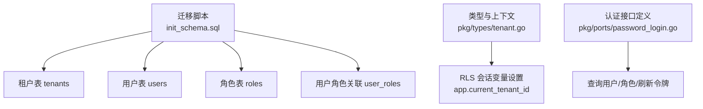
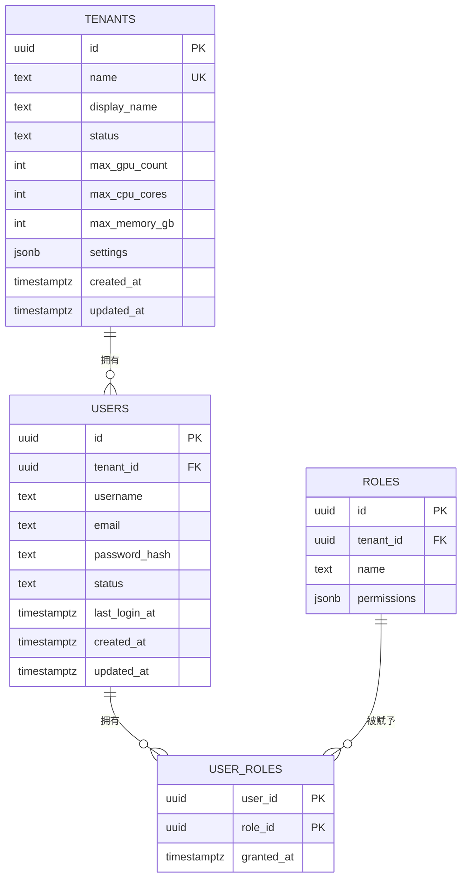
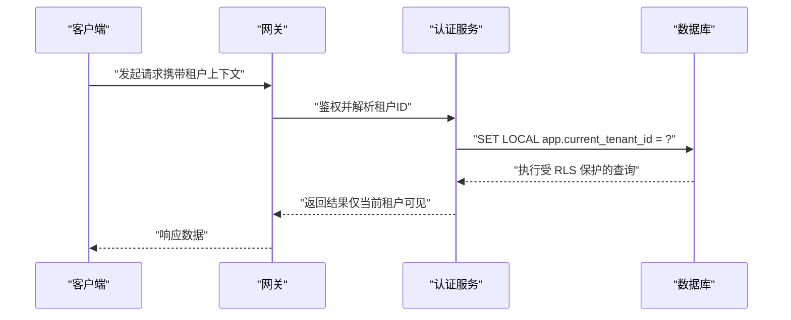
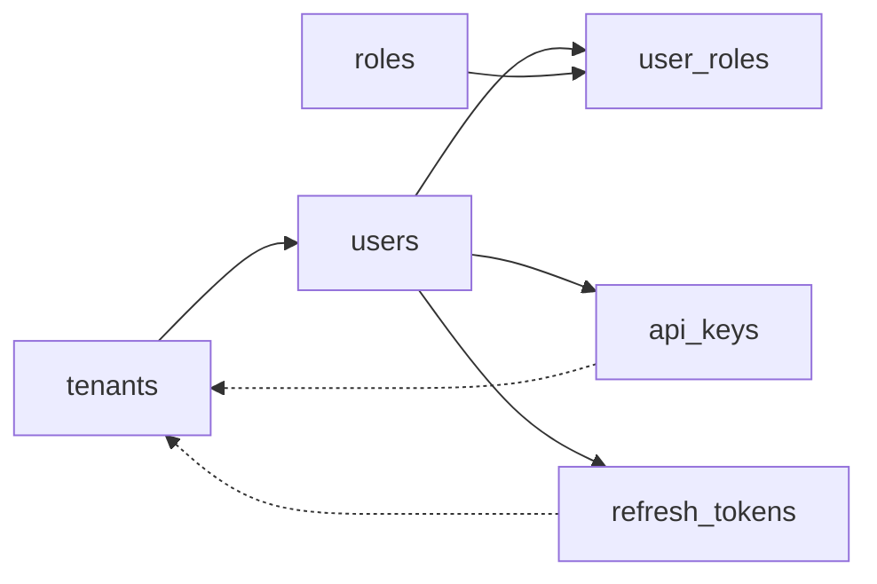

# 租户与用户角色表

<cite>
**本文引用的文件**
- [20260501_001_init_schema.sql](file://repo/deploy/migrations/20260501_001_init_schema.sql)
- [20260502_003_permissions_schema.sql](file://repo/deploy/migrations/20260502_003_permissions_schema.sql)
- [tenant.go](file://repo/pkg/types/tenant.go)
- [password_login.go](file://repo/pkg/ports/password_login.go)
</cite>

## 目录
1. [简介](#简介)
2. [项目结构](#项目结构)
3. [核心组件](#核心组件)
4. [架构总览](#架构总览)
5. [详细组件分析](#详细组件分析)
6. [依赖关系分析](#依赖关系分析)
7. [性能考虑](#性能考虑)
8. [故障排查指南](#故障排查指南)
9. [结论](#结论)
10. [附录](#附录)

## 简介
本文件聚焦于平台的多租户、用户与角色相关数据模型，系统性说明 tenants（租户）、users（用户）、roles（角色）与 user_roles（用户角色关联）四张表的字段定义、约束与索引策略；解释内置角色权限结构与多对多映射；描述外键与级联删除规则；并结合行级安全（RLS）与上下文注入机制，给出典型的多租户数据隔离场景示例。

## 项目结构
- 数据库迁移脚本集中存放于 deploy/migrations，包含初始建表、权限校验与种子数据等。
- 类型与上下文工具位于 pkg/types，提供租户上下文注入与 RLS 会话变量设置。
- 认证数据访问接口定义在 pkg/ports，明确密码登录流程所需的数据访问契约。

图表来源
- [20260501_001_init_schema.sql:32-79](file://repo/deploy/migrations/20260501_001_init_schema.sql#L32-L79)
- [tenant.go:48-63](file://repo/pkg/types/tenant.go#L48-L63)
- [password_login.go:19-73](file://repo/pkg/ports/password_login.go#L19-L73)

章节来源
- [20260501_001_init_schema.sql:32-79](file://repo/deploy/migrations/20260501_001_init_schema.sql#L32-L79)
- [tenant.go:48-63](file://repo/pkg/types/tenant.go#L48-L63)
- [password_login.go:19-73](file://repo/pkg/ports/password_login.go#L19-L73)

## 核心组件
- 租户表（tenants）：承载租户标识、显示名称、状态、GPU/CPU/内存配额上限及扩展配置。
- 用户表（users）：承载用户名、邮箱、密码哈希、登录状态、最近登录时间，并绑定到租户。
- 角色表（roles）：承载角色名与权限集合，支持平台内置角色（无租户归属）与租户内自定义角色。
- 用户角色关联表（user_roles）：实现用户与角色的多对多关系，记录授权时间。

章节来源
- [20260501_001_init_schema.sql:32-79](file://repo/deploy/migrations/20260501_001_init_schema.sql#L32-L79)
- [20260502_003_permissions_schema.sql:22-70](file://repo/deploy/migrations/20260502_003_permissions_schema.sql#L22-L70)

## 架构总览
下图展示租户、用户、角色与关联表之间的实体关系，以及通过 RLS 实现的租户隔离边界。

图表来源
- [20260501_001_init_schema.sql:32-79](file://repo/deploy/migrations/20260501_001_init_schema.sql#L32-L79)

## 详细组件分析

### 租户表（tenants）
- 主键：id（UUID，默认随机生成）。
- 唯一标识：name（TEXT，唯一），用于 URL 友好命名。
- 显示名称：display_name（TEXT）。
- 状态管理：status（TEXT，枚举 active/suspended/deleted）。
- 资源配额限制：
  - max_gpu_count（INT，默认 0，表示不限）。
  - max_cpu_cores（INT，默认 0）。
  - max_memory_gb（INT，默认 0）。
- 扩展配置：settings（JSONB，默认空对象）。
- 审计字段：created_at、updated_at（TIMESTAMPTZ）。

设计要点
- 使用 CHECK 约束保证状态值合法。
- 配额字段便于后续配额检查与限流控制。
- JSONB settings 提供弹性扩展能力，如开关、阈值等。

章节来源
- [20260501_001_init_schema.sql:32-44](file://repo/deploy/migrations/20260501_001_init_schema.sql#L32-L44)

### 用户表（users）
- 主键：id（UUID）。
- 租户归属：tenant_id（UUID，外键引用 tenants.id，级联删除）。
- 身份字段：username（TEXT）、email（TEXT）。
- 认证字段：password_hash（TEXT，bcrypt；OIDC 用户可为 NULL）。
- 状态：status（TEXT，枚举 active/disabled）。
- 登录追踪：last_login_at（TIMESTAMPTZ）。
- 审计字段：created_at、updated_at。
- 唯一性约束：(tenant_id, username)、(tenant_id, email)。
- 索引：idx_users_tenant_id（加速按租户查询）。

设计要点
- 通过 (tenant_id, username/email) 唯一约束避免同租户下重名或重复邮箱。
- 外键级联删除确保租户删除时用户数据一致清理。
- 索引优化按租户维度的用户检索。

章节来源
- [20260501_001_init_schema.sql:50-64](file://repo/deploy/migrations/20260501_001_init_schema.sql#L50-L64)

### 角色表（roles）与用户角色关联表（user_roles）
- 角色表（roles）：
  - 主键：id（UUID）。
  - 租户归属：tenant_id（UUID，可 NULL 表示平台内置角色；外键引用 tenants.id，级联删除）。
  - 角色名：name（TEXT）。
  - 权限集合：permissions（JSONB，默认空数组）。
  - 唯一性约束：(tenant_id, name)。
- 用户角色关联表（user_roles）：
  - 复合主键：(user_id, role_id)。
  - 外键：user_id 引用 users.id（级联删除），role_id 引用 roles.id（级联删除）。
  - 授权时间：granted_at（TIMESTAMPTZ）。

权限结构
- 权限以 JSONB 数组存储，每个元素包含 resource、actions、scope 等字段。
- 通过迁移脚本对 permissions 进行 JSONB Schema 校验，确保结构正确。
- 内置角色包括 platform-admin、tenant-admin、user、auditor，分别对应不同作用域与操作集。

多对多关系
- 一个用户可拥有多个角色，一个角色可分配给多个用户。
- 通过 user_roles 表维护关系与授权时间。

章节来源
- [20260501_001_init_schema.sql:66-79](file://repo/deploy/migrations/20260501_001_init_schema.sql#L66-L79)
- [20260502_003_permissions_schema.sql:22-70](file://repo/deploy/migrations/20260502_003_permissions_schema.sql#L22-L70)

### 外键约束与级联删除规则
- users.tenant_id → tenants.id：ON DELETE CASCADE。
- roles.tenant_id → tenants.id：ON DELETE CASCADE。
- user_roles.user_id → users.id：ON DELETE CASCADE。
- user_roles.role_id → roles.id：ON DELETE CASCADE。

影响
- 删除租户会级联删除其用户与角色，进而级联删除用户角色关联。
- 删除用户会级联删除其所有角色绑定。
- 删除角色会级联删除所有用户与该角色的绑定。

章节来源
- [20260501_001_init_schema.sql:50-79](file://repo/deploy/migrations/20260501_001_init_schema.sql#L50-L79)

### 索引策略与查询优化
- users 表：
  - idx_users_tenant_id：加速按租户查询用户。
- roles 表：
  - 通过 (tenant_id, name) 唯一索引保障角色名唯一性与快速查找。
- user_roles 表：
  - 复合主键 (user_id, role_id) 天然支持高效关联查询。
- 其他相关索引（与认证/令牌相关）：
  - api_keys.tenant_id、refresh_tokens.tenant_id、jwt_blocklist.expires_at 等索引提升鉴权与令牌管理效率。

建议
- 针对高频查询路径（如按租户列出用户、按用户加载角色）保持现有索引。
- 如需跨租户统计或审计，可在只读副本上建立额外聚合索引。

章节来源
- [20260501_001_init_schema.sql:64-79](file://repo/deploy/migrations/20260501_001_init_schema.sql#L64-L79)
- [20260501_001_init_schema.sql:85-120](file://repo/deploy/migrations/20260501_001_init_schema.sql#L85-L120)

### 多租户数据隔离（RLS）与上下文注入
- 行级安全（RLS）：
  - 关键业务表启用 RLS，并通过策略基于 app.current_tenant_id 过滤数据。
  - 例如 knowledge_bases、models、inference_services、api_keys、refresh_tokens、audit_logs、metering_records、outbox_events 等均受 RLS 保护。
- 上下文注入：
  - 在事务开始前调用 SetDBTenant，将当前租户 ID 写入会话变量 app.current_tenant_id。
  - 该变量在 RLS 策略中被读取，实现请求级租户隔离。

典型流程

图表来源
- [tenant.go:48-63](file://repo/pkg/types/tenant.go#L48-L63)
- [20260501_001_init_schema.sql:528-627](file://repo/deploy/migrations/20260501_001_init_schema.sql#L528-L627)

章节来源
- [tenant.go:48-63](file://repo/pkg/types/tenant.go#L48-L63)
- [20260501_001_init_schema.sql:528-627](file://repo/deploy/migrations/20260501_001_init_schema.sql#L528-L627)

### 典型多租户隔离场景示例
- 场景一：同一数据库实例中，租户 A 与租户 B 的用户互不可见。
  - 通过 users.tenant_id 与 RLS 策略，确保查询仅返回当前租户用户。
- 场景二：租户管理员可管理本租户内的模型与服务，但无法访问其他租户数据。
  - 借助 roles.permissions 与作用域（tenant/own/platform）控制资源访问范围。
- 场景三：平台管理员可跨租户审计与计量。
  - 平台内置角色（platform-admin）具备平台级权限，结合审计日志表进行全局观测。

章节来源
- [20260501_001_init_schema.sql:528-627](file://repo/deploy/migrations/20260501_001_init_schema.sql#L528-L627)
- [20260502_003_permissions_schema.sql:41-70](file://repo/deploy/migrations/20260502_003_permissions_schema.sql#L41-L70)

## 依赖关系分析
- 租户与用户：users.tenant_id 外键指向 tenants.id，形成一对多关系。
- 用户与角色：user_roles 作为中间表，连接 users 与 roles，实现多对多。
- 角色与租户：roles.tenant_id 可为 NULL（平台内置）或非 NULL（租户内角色）。
- 认证与令牌：api_keys、refresh_tokens、jwt_blocklist 与用户/租户紧密相关，索引优化提升鉴权性能。

图表来源
- [20260501_001_init_schema.sql:32-120](file://repo/deploy/migrations/20260501_001_init_schema.sql#L32-L120)

章节来源
- [20260501_001_init_schema.sql:32-120](file://repo/deploy/migrations/20260501_001_init_schema.sql#L32-L120)

## 性能考虑
- 索引优化：
  - users.tenant_id 索引加速按租户查询。
  - refresh_tokens.expires_at 索引支持令牌过期清理。
  - jwt_blocklist.expires_at 索引支持 JWT 黑名单清理。
- 分区与归档：
  - 高写入量表（如 inference_audit_logs、audit_logs）采用按月分区，便于历史数据管理与查询裁剪。
- RLS 开销：
  - 在每行增加 tenant_id 过滤条件，建议在应用层尽量缩小查询范围，减少全表扫描。
- 配额与限流：
  - tenants.max_* 字段可用于配额检查，建议在创建资源前进行预检，避免无效提交。

[本节为通用性能讨论，不直接分析具体文件]

## 故障排查指南
- 常见问题
  - 登录失败：检查 users.status 是否为 active，password_hash 是否匹配。
  - 租户不存在：确认 tenants.name 是否存在且状态为 active。
  - 权限不足：核对 roles.permissions 与作用域是否符合预期。
- 定位方法
  - 查看 RLS 策略是否正确设置 app.current_tenant_id。
  - 检查外键约束是否导致意外删除（如删除租户后用户丢失）。
  - 审查索引缺失导致的慢查询（如缺少 users.tenant_id 索引）。

章节来源
- [20260501_001_init_schema.sql:528-627](file://repo/deploy/migrations/20260501_001_init_schema.sql#L528-L627)
- [20260501_001_init_schema.sql:85-120](file://repo/deploy/migrations/20260501_001_init_schema.sql#L85-L120)

## 结论
本仓库通过清晰的表结构设计、严格的约束与索引策略、以及基于 RLS 的租户隔离机制，实现了稳健的多租户、用户与角色管理体系。租户表提供配额与配置扩展点，用户表保障身份与登录状态，角色表与关联表实现灵活的权限控制。结合上下文注入与迁移脚本中的权限校验，系统能够在生产环境中可靠地支撑多租户隔离与细粒度权限管理。

[本节为总结性内容，不直接分析具体文件]

## 附录
- 参考迁移脚本
  - 初始建表与 RLS：[20260501_001_init_schema.sql](file://repo/deploy/migrations/20260501_001_init_schema.sql)
  - 权限 JSONB Schema 校验与内置角色：[20260502_003_permissions_schema.sql](file://repo/deploy/migrations/20260502_003_permissions_schema.sql)
- 参考类型与接口
  - 租户上下文与 RLS 注入：[tenant.go](file://repo/pkg/types/tenant.go)
  - 密码登录数据访问接口：[password_login.go](file://repo/pkg/ports/password_login.go)

[本节为附录信息，不直接分析具体文件]