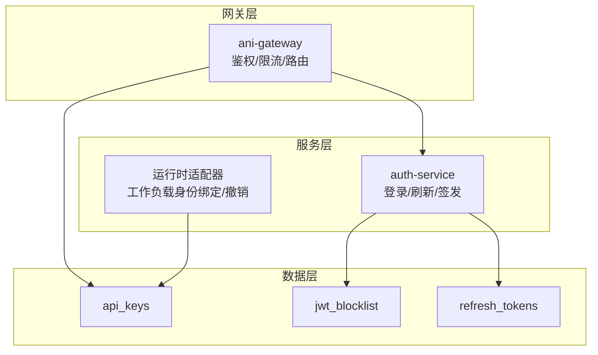
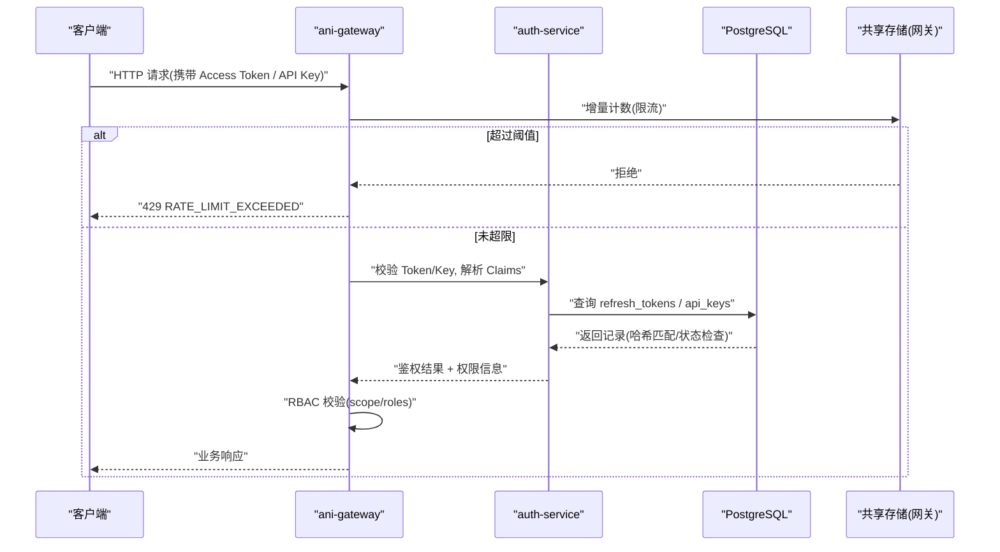
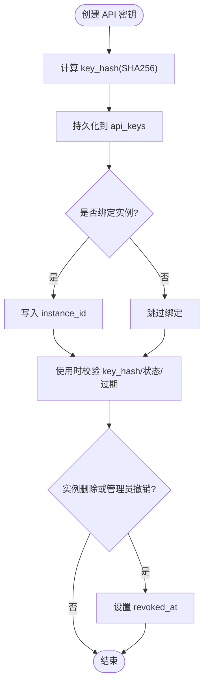
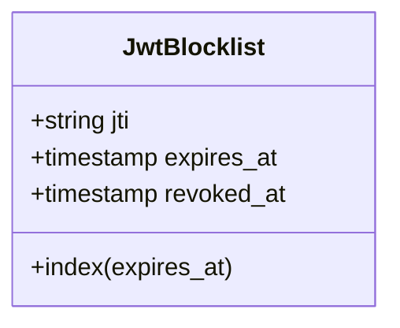
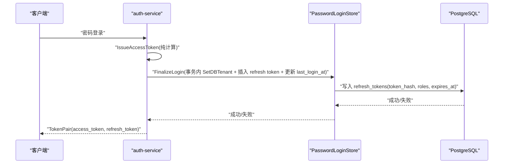
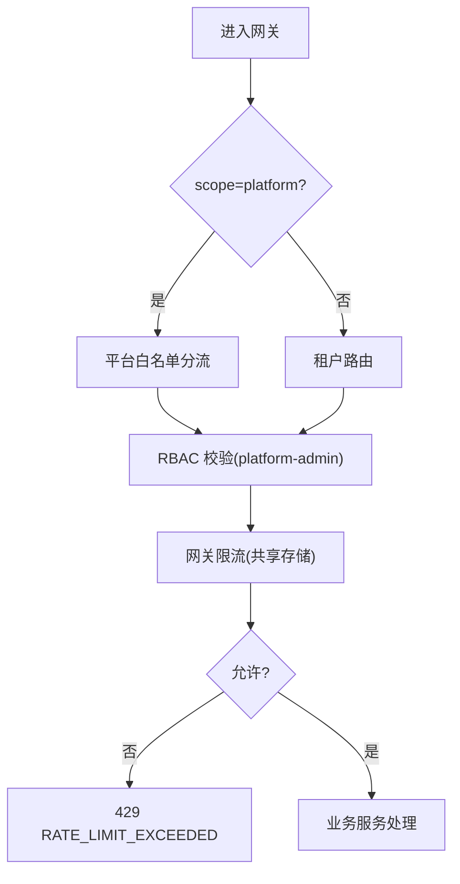
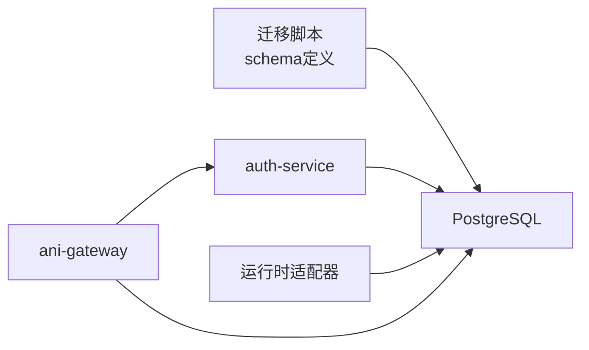

# 认证与安全表

<cite>
**本文引用的文件**
- [20260501_001_init_schema.sql](file://repo/deploy/migrations/20260501_001_init_schema.sql)
- [20260520_007_workload_identity_api_keys.sql](file://repo/deploy/migrations/20260520_007_workload_identity_api_keys.sql)
- [password_login.go](file://repo/services/auth-service/internal/service/password_login.go)
- [refresh_tokens_test.go](file://repo/services/auth-service/internal/service/refresh_tokens_test.go)
- [instance_service.go](file://repo/pkg/adapters/runtime/instance_service.go)
- [r-p0-1-gateway-rate-limit.md](file://repo/development-records/r-p0-1-gateway-rate-limit.md)
- [issue-003-platform-password-login-api.md](file://repo/development-records/m2-2-auth-c-api-keys.md)
</cite>

## 目录
1. [简介](#简介)
2. [项目结构](#项目结构)
3. [核心组件](#核心组件)
4. [架构总览](#架构总览)
5. [详细组件分析](#详细组件分析)
6. [依赖关系分析](#依赖关系分析)
7. [性能考虑](#性能考虑)
8. [故障排查指南](#故障排查指南)
9. [结论](#结论)
10. [附录](#附录)

## 简介
本文件聚焦认证与安全相关的数据表设计与实现，重点覆盖以下三张表：
- api_keys（API 密钥）：用于工作负载身份与外部调用鉴权，支持密钥哈希存储、权限范围、速率限制、过期时间、实例绑定与撤销。
- jwt_blocklist（JWT 黑名单）：用于 Token 撤销与安全管理，支持按 JTI 记录与到期清理。
- refresh_tokens（刷新令牌）：用于长会话续期，支持令牌生命周期管理、角色继承、安全存储与平台/租户作用域区分。

文档同时说明访问控制与权限验证的实现模式，包括数据库行级安全（RLS）、RBAC 中间件对 scope 的校验、以及网关层限流等机制。

## 项目结构
认证与安全相关的数据定义位于迁移脚本中，服务侧逻辑在 auth-service 与运行时适配器中；网关限流策略在开发记录中有明确说明。

图表来源
- [20260501_001_init_schema.sql:85-120](file://repo/deploy/migrations/20260501_001_init_schema.sql#L85-L120)
- [20260520_007_workload_identity_api_keys.sql:1-22](file://repo/deploy/migrations/20260520_007_workload_identity_api_keys.sql#L1-L22)
- [password_login.go:32-92](file://repo/services/auth-service/internal/service/password_login.go#L32-L92)
- [instance_service.go:276-284](file://repo/pkg/adapters/runtime/instance_service.go#L276-L284)
- [r-p0-1-gateway-rate-limit.md:1-29](file://repo/development-records/r-p0-1-gateway-rate-limit.md#L1-L29)

章节来源
- [20260501_001_init_schema.sql:85-120](file://repo/deploy/migrations/20260501_001_init_schema.sql#L85-L120)
- [20260520_007_workload_identity_api_keys.sql:1-22](file://repo/deploy/migrations/20260520_007_workload_identity_api_keys.sql#L1-L22)
- [password_login.go:32-92](file://repo/services/auth-service/internal/service/password_login.go#L32-L92)
- [instance_service.go:276-284](file://repo/pkg/adapters/runtime/instance_service.go#L276-L284)
- [r-p0-1-gateway-rate-limit.md:1-29](file://repo/development-records/r-p0-1-gateway-rate-limit.md#L1-L29)

## 核心组件
- API 密钥（api_keys）
  - 安全存储：key_hash 使用 SHA256 哈希存储，不保存明文；key_prefix 仅用于展示。
  - 权限范围：scopes 数组限定可访问的资源与操作。
  - 速率限制：rate_limit_rpm 字段提供每分钟请求限制能力，结合网关层共享存储进行窗口计数限流。
  - 生命周期：expires_at 控制过期；revoked_at 标记撤销；last_used_at 记录最近使用时间。
  - 工作负载绑定：instance_id 将密钥与工作负载实例生命周期绑定，实例删除时自动撤销。
- JWT 黑名单（jwt_blocklist）
  - 以 jti 为主键记录已撤销的 JWT；expires_at 便于定时清理；revoked_at 记录撤销时间。
- 刷新令牌（refresh_tokens）
  - 安全存储：token_hash 使用 SHA256 哈希存储，不保存明文。
  - 角色继承：roles 数组从用户角色继承，用于续期 access token 时注入 claims。
  - 生命周期：expires_at 控制过期；revoked_at 标记撤销；last_used_at 记录最近使用时间。
  - 作用域：通过 principal.Scope 区分 tenant 与 platform，影响后续 access token 签发。

章节来源
- [20260501_001_init_schema.sql:85-120](file://repo/deploy/migrations/20260501_001_init_schema.sql#L85-L120)
- [20260520_007_workload_identity_api_keys.sql:1-22](file://repo/deploy/migrations/20260520_007_workload_identity_api_keys.sql#L1-L22)
- [password_login.go:69-92](file://repo/services/auth-service/internal/service/password_login.go#L69-L92)
- [refresh_tokens_test.go:14-73](file://repo/services/auth-service/internal/service/refresh_tokens_test.go#L14-L73)
- [refresh_tokens_test.go:75-139](file://repo/services/auth-service/internal/service/refresh_tokens_test.go#L75-L139)

## 架构总览
下图展示了登录、刷新、黑名单与 API 密钥在系统中的交互流程，涵盖鉴权、RBAC 与限流的关键点。

图表来源
- [r-p0-1-gateway-rate-limit.md:1-29](file://repo/development-records/r-p0-1-gateway-rate-limit.md#L1-L29)
- [20260501_001_init_schema.sql:85-120](file://repo/deploy/migrations/20260501_001_init_schema.sql#L85-L120)
- [password_login.go:69-92](file://repo/services/auth-service/internal/service/password_login.go#L69-L92)

## 详细组件分析

### API 密钥（api_keys）设计
- 密钥哈希存储：key_hash 为唯一索引，确保不可逆存储且防碰撞查询。
- 权限范围：scopes 数组限定最小权限，配合 RBAC 中间件做细粒度授权。
- 速率限制：rate_limit_rpm 作为策略参数，网关层基于共享存储执行 per-tenant + method + route-class 窗口计数。
- 过期与撤销：expires_at 控制有效期；revoked_at 标记撤销；last_used_at 辅助审计与风控。
- 工作负载绑定：instance_id 将密钥与实例生命周期绑定，实例删除时触发撤销，避免长期残留凭证。

图表来源
- [20260501_001_init_schema.sql:85-99](file://repo/deploy/migrations/20260501_001_init_schema.sql#L85-L99)
- [20260520_007_workload_identity_api_keys.sql:1-22](file://repo/deploy/migrations/20260520_007_workload_identity_api_keys.sql#L1-L22)
- [instance_service.go:976-1009](file://repo/pkg/adapters/runtime/instance_service.go#L976-L1009)

章节来源
- [20260501_001_init_schema.sql:85-99](file://repo/deploy/migrations/20260501_001_init_schema.sql#L85-L99)
- [20260520_007_workload_identity_api_keys.sql:1-22](file://repo/deploy/migrations/20260520_007_workload_identity_api_keys.sql#L1-L22)
- [instance_service.go:976-1009](file://repo/pkg/adapters/runtime/instance_service.go#L976-L1009)

### JWT 黑名单（jwt_blocklist）设计
- 主键 jti：唯一标识每个 JWT，便于精确撤销。
- 过期时间 expires_at：用于后台清理任务，释放空间并降低查询成本。
- 撤销时间 revoked_at：审计与合规要求，记录撤销动作发生时间。
- 索引优化：expires_at 建立索引，加速过期清理与查询。

图表来源
- [20260501_001_init_schema.sql:101-106](file://repo/deploy/migrations/20260501_001_init_schema.sql#L101-L106)

章节来源
- [20260501_001_init_schema.sql:101-106](file://repo/deploy/migrations/20260501_001_init_schema.sql#L101-L106)

### 刷新令牌（refresh_tokens）设计
- 安全存储：token_hash 唯一索引，防止明文泄露与重复插入。
- 角色继承：roles 数组从用户角色继承，用于续期 access token 时注入 claims。
- 作用域区分：principal.Scope 决定签发 tenant 或 platform 的 access token。
- 生命周期：expires_at 控制有效期；revoked_at 标记撤销；last_used_at 辅助审计。
- 登录流程：先签发 access token（纯计算），再持久化 refresh token，避免孤儿数据。

图表来源
- [password_login.go:69-92](file://repo/services/auth-service/internal/service/password_login.go#L69-L92)
- [20260501_001_init_schema.sql:108-120](file://repo/deploy/migrations/20260501_001_init_schema.sql#L108-L120)

章节来源
- [password_login.go:69-92](file://repo/services/auth-service/internal/service/password_login.go#L69-L92)
- [20260501_001_init_schema.sql:108-120](file://repo/deploy/migrations/20260501_001_init_schema.sql#L108-L120)
- [refresh_tokens_test.go:14-73](file://repo/services/auth-service/internal/service/refresh_tokens_test.go#L14-L73)
- [refresh_tokens_test.go:75-139](file://repo/services/auth-service/internal/service/refresh_tokens_test.go#L75-L139)

### 访问控制与权限验证模式
- 数据库行级安全（RLS）：所有敏感表启用 RLS，通过 current_setting('app.current_tenant_id') 隔离租户数据。
- RBAC 中间件：根据 JWT claims 中的 scope 与 roles 进行拦截与放行，平台 token 与租户 token 隔离。
- 网关限流：基于共享存储的窗口计数，对非公共路径执行 per-tenant + method + route-class 限流，超限返回 429。

图表来源
- [20260501_001_init_schema.sql:591-603](file://repo/deploy/migrations/20260501_001_init_schema.sql#L591-L603)
- [r-p0-1-gateway-rate-limit.md:1-29](file://repo/development-records/r-p0-1-gateway-rate-limit.md#L1-L29)
- [refresh_tokens_test.go:75-139](file://repo/services/auth-service/internal/service/refresh_tokens_test.go#L75-L139)

章节来源
- [20260501_001_init_schema.sql:591-603](file://repo/deploy/migrations/20260501_001_init_schema.sql#L591-L603)
- [r-p0-1-gateway-rate-limit.md:1-29](file://repo/development-records/r-p0-1-gateway-rate-limit.md#L1-L29)
- [refresh_tokens_test.go:75-139](file://repo/services/auth-service/internal/service/refresh_tokens_test.go#L75-L139)

## 依赖关系分析
- 数据层依赖：api_keys、jwt_blocklist、refresh_tokens 由迁移脚本定义，并通过 RLS 强制租户隔离。
- 服务层依赖：auth-service 使用 PasswordLoginStore 与 JWTIssuer 完成登录与令牌签发；运行时适配器负责工作负载身份的绑定与撤销。
- 网关层依赖：网关中间件通过共享存储实现限流，并与 auth-service 协作完成鉴权与 RBAC 校验。

图表来源
- [20260501_001_init_schema.sql:85-120](file://repo/deploy/migrations/20260501_001_init_schema.sql#L85-L120)
- [password_login.go:32-92](file://repo/services/auth-service/internal/service/password_login.go#L32-L92)
- [instance_service.go:276-284](file://repo/pkg/adapters/runtime/instance_service.go#L276-L284)
- [r-p0-1-gateway-rate-limit.md:1-29](file://repo/development-records/r-p0-1-gateway-rate-limit.md#L1-L29)

章节来源
- [20260501_001_init_schema.sql:85-120](file://repo/deploy/migrations/20260501_001_init_schema.sql#L85-L120)
- [password_login.go:32-92](file://repo/services/auth-service/internal/service/password_login.go#L32-L92)
- [instance_service.go:276-284](file://repo/pkg/adapters/runtime/instance_service.go#L276-L284)
- [r-p0-1-gateway-rate-limit.md:1-29](file://repo/development-records/r-p0-1-gateway-rate-limit.md#L1-L29)

## 性能考虑
- 索引优化：api_keys、refresh_tokens、jwt_blocklist 均针对常用查询列建立索引（如 tenant_id、expires_at）。
- 哈希存储：key_hash 与 token_hash 使用唯一索引，避免全表扫描与明文泄露。
- 限流策略：网关层基于共享存储的窗口计数，减少数据库压力并提升吞吐。
- 分区与清理：jwt_blocklist 与审计日志采用分区与定期清理策略，控制数据规模。

[本节为通用指导，无需特定文件引用]

## 故障排查指南
- 登录失败：检查 password_hash 是否为空、用户名是否包含命名空间前缀、用户状态是否为 active。
- 刷新令牌失效：确认 refresh token 是否过期或被撤销；检查 principal.Scope 是否正确区分 tenant/platform。
- API 密钥无效：核对 key_hash 是否匹配、是否被撤销、是否过期、是否绑定到已删除的实例。
- 限流触发：查看网关共享存储计数是否超过阈值；调整 GATEWAY_RATE_LIMIT_REQUESTS 与 GATEWAY_RATE_LIMIT_WINDOW。

章节来源
- [password_login.go:32-62](file://repo/services/auth-service/internal/service/password_login.go#L32-L62)
- [refresh_tokens_test.go:14-73](file://repo/services/auth-service/internal/service/refresh_tokens_test.go#L14-L73)
- [r-p0-1-gateway-rate-limit.md:1-29](file://repo/development-records/r-p0-1-gateway-rate-limit.md#L1-L29)

## 结论
本方案通过哈希存储、作用域区分、RBAC 与网关限流等多层机制，构建了安全的认证与授权体系。api_keys、jwt_blocklist、refresh_tokens 三张表分别承担密钥管理、Token 撤销与长会话续期的职责，并结合 RLS 与实例生命周期绑定，实现了细粒度的访问控制与安全防护。

[本节为总结性内容，无需特定文件引用]

## 附录
- 密码哈希算法：bcrypt 用于密码校验，SHA256 用于密钥与刷新令牌的哈希存储。
- 密钥前缀展示：key_prefix 仅用于前端展示，不承载安全语义。
- 防重放攻击：通过 request_id 与幂等键（如 idempotency_key）在网关与服务层协同实现。
- 平台与租户隔离：JWT claims 中的 scope 与 tenant_id 共同决定路由与权限策略。

章节来源
- [password_login.go:94-102](file://repo/services/auth-service/internal/service/password_login.go#L94-L102)
- [20260501_001_init_schema.sql:85-120](file://repo/deploy/migrations/20260501_001_init_schema.sql#L85-L120)
- [refresh_tokens_test.go:75-139](file://repo/services/auth-service/internal/service/refresh_tokens_test.go#L75-L139)