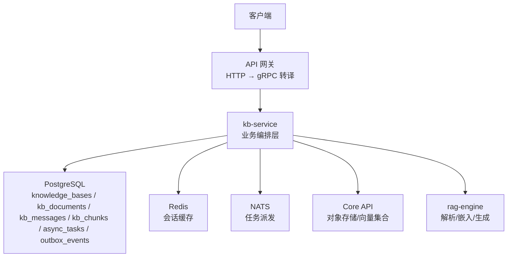
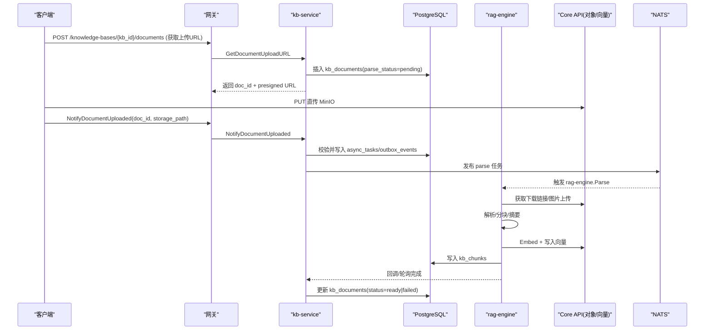
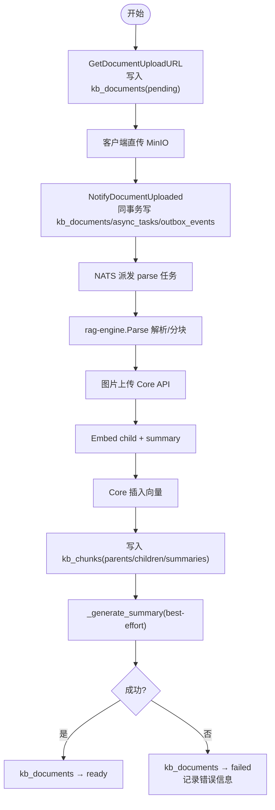
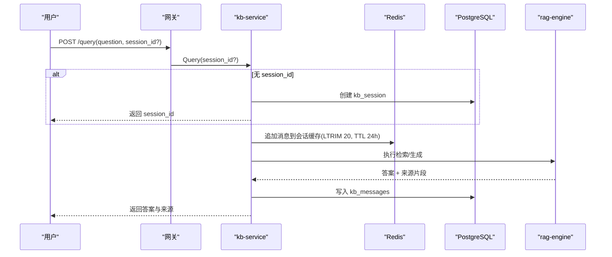
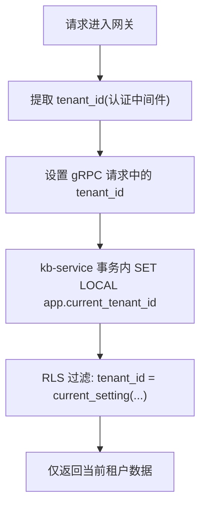
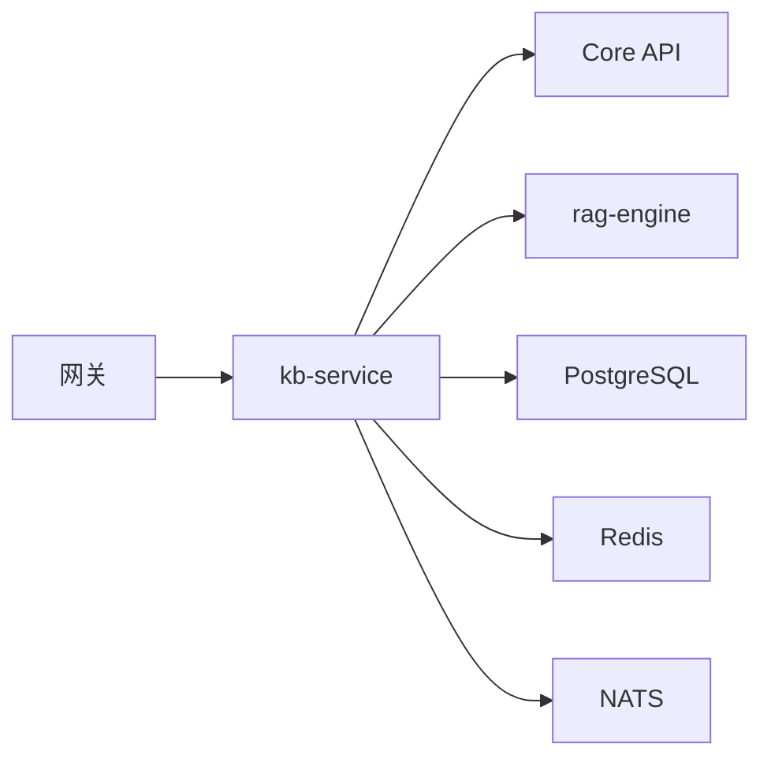

# 知识库相关表

<cite>
**本文引用的文件**
- [kb_service.proto](file://repo/api/proto/kb/v1/kb_service.proto)
- [spec-services-kb-service.md](file://repo/services/tasks/modules/spec/core/knowledge/spec-services-kb-service.md)
- [002_kb_chunks.sql](file://repo/services/kb-service/migrations/002_kb_chunks.sql)
- [003_kb_retrieval_mode.sql](file://repo/services/kb-service/migrations/003_kb_retrieval_mode.sql)
- [rls.py](file://repo/services/kb-service/app/repositories/rls.py)
- [kb_resources.go](file://repo/services/ani-gateway/internal/router/kb_resources.go)
- [prd-core-knowledge-base-platform.md](file://repo/services/tasks/modules/prd/core/knowledge/prd-core-knowledge-base-platform.md)
- [issue-032-feature-kb-service-parse-orchestrator.md](file://repo/services/tasks/modules/issue/core/knowledge/issue-032-feature-kb-service-parse-orchestrator.md)
- [test_backend_apis.py](file://repo/scripts/test_backend_apis.py)
</cite>

## 目录
1. [简介](#简介)
2. [项目结构](#项目结构)
3. [核心组件](#核心组件)
4. [架构总览](#架构总览)
5. [详细组件分析](#详细组件分析)
6. [依赖关系分析](#依赖关系分析)
7. [性能考量](#性能考量)
8. [故障排查指南](#故障排查指南)
9. [结论](#结论)
10. [附录](#附录)

## 简介
本文件聚焦知识库（Knowledge Base）相关数据模型与流程，围绕以下目标展开：
- 说明 knowledge_bases、kb_documents、kb_sessions、kb_messages、kb_chunks 等表的结构设计与职责。
- 解释文档解析全流程：上传、格式识别、分块、向量索引、摘要生成与状态管理。
- 说明对话会话的上下文管理与消息历史记录。
- 阐述多租户隔离机制在知识库场景下的实现方式。
- 覆盖文档解析状态机、错误处理与重试机制。

## 项目结构
知识库能力由网关（Gateway）转发到 kb-service（gRPC），再由 kb-service 协调 Core API（对象存储/向量库）、rag-engine（解析/嵌入/生成）以及 PostgreSQL/Redis/NATS 等基础设施完成端到端流程。

图表来源
- [kb_resources.go:54-90](file://repo/services/ani-gateway/internal/router/kb_resources.go#L54-L90)
- [kb_service.proto:11-53](file://repo/api/proto/kb/v1/kb_service.proto#L11-L53)
- [spec-services-kb-service.md:170-188](file://repo/services/tasks/modules/spec/core/knowledge/spec-services-kb-service.md#L170-L188)

章节来源
- [kb_resources.go:54-90](file://repo/services/ani-gateway/internal/router/kb_resources.go#L54-L90)
- [kb_service.proto:11-53](file://repo/api/proto/kb/v1/kb_service.proto#L11-L53)
- [spec-services-kb-service.md:170-188](file://repo/services/tasks/modules/spec/core/knowledge/spec-services-kb-service.md#L170-L188)

## 核心组件
- 知识库元数据：knowledge_bases（名称、检索模式、嵌入模型、top_k、score_threshold、状态、文档计数等）。
- 文档元数据：kb_documents（文件名、类型、大小、解析状态、分块数、错误信息、自定义元数据、时间戳）。
- 分块内容：kb_chunks（父子层级、类型、内容、页码、token 计数、自定义元数据、全文索引）。
- 会话与消息：kb_sessions（会话列表/统计）、kb_messages（历史消息，用于上下文）。
- 异步任务与出队：async_tasks、outbox_events（保证至少一次派发与幂等）。

章节来源
- [kb_service.proto:213-242](file://repo/api/proto/kb/v1/kb_service.proto#L213-L242)
- [spec-services-kb-service.md:101-135](file://repo/services/tasks/modules/spec/core/knowledge/spec-services-kb-service.md#L101-L135)
- [prd-core-knowledge-base-platform.md:110-128](file://repo/services/tasks/modules/prd/core/knowledge/prd-core-knowledge-base-platform.md#L110-L128)

## 架构总览
知识库查询与文档解析的关键交互如下：

图表来源
- [kb_service.proto:18-44](file://repo/api/proto/kb/v1/kb_service.proto#L18-L44)
- [spec-services-kb-service.md:170-188](file://repo/services/tasks/modules/spec/core/knowledge/spec-services-kb-service.md#L170-L188)
- [prd-core-knowledge-base-platform.md:118-128](file://repo/services/tasks/modules/prd/core/knowledge/prd-core-knowledge-base-platform.md#L118-L128)

## 详细组件分析

### 表结构与字段说明
- knowledge_bases
  - 关键字段：tenant_id、id、name、description、embedding_model、chunk_size、top_k、score_threshold、retrieval_mode（vector | hybrid | keyword）、status（active | rebuilding | deleted）、doc_count、created_at、updated_at。
  - 作用：定义知识库检索策略与默认参数；创建时关联 Core 向量集合。
- kb_documents
  - 关键字段：tenant_id、kb_id、id、file_name、file_type、file_size_bytes、parse_status（pending | parsing | indexing | ready | failed）、chunk_count、error_message、custom_metadata、created_at、parsed_at。
  - 作用：记录每个文档的元数据与解析生命周期。
- kb_chunks
  - 关键字段：tenant_id、kb_id、doc_id、parent_chunk_id、chunk_type（child | parent | doc_summary）、content、parent_content、page_number、content_type、file_name、token_count、custom_metadata、created_at。
  - 索引：按 kb_id/doc_id、parent_chunk_id、chunk_type 建立 B-tree；对 content 建立 GIN trigram 全文索引以支持关键词检索。
- kb_sessions / kb_messages
  - 会话与消息用于保存问答历史与上下文，Query/Retrieve 会写 kb_messages 并在 Redis 中缓存会话窗口（LTRIM 限制长度，TTL 过期）。
- async_tasks / outbox_events
  - 用于异步任务持久化与“出队”派发，保障至少一次投递与幂等重试。

章节来源
- [kb_service.proto:213-242](file://repo/api/proto/kb/v1/kb_service.proto#L213-L242)
- [002_kb_chunks.sql:14-52](file://repo/services/kb-service/migrations/002_kb_chunks.sql#L14-L52)
- [003_kb_retrieval_mode.sql:9-11](file://repo/services/kb-service/migrations/003_kb_retrieval_mode.sql#L9-L11)
- [spec-services-kb-service.md:101-135](file://repo/services/tasks/modules/spec/core/knowledge/spec-services-kb-service.md#L101-L135)
- [prd-core-knowledge-base-platform.md:118-128](file://repo/services/tasks/modules/prd/core/knowledge/prd-core-knowledge-base-platform.md#L118-L128)

### 文档解析流程与状态管理
文档解析采用两步式上传与异步编排：
- 步骤1：调用 GetDocumentUploadURL 预分配 doc_id，写入 kb_documents(parse_status=pending)，返回 MinIO 预签名上传地址。
- 步骤2：客户端直传到 MinIO 后调用 NotifyDocumentUploaded，服务在同一事务内写入 kb_documents、async_tasks 与 outbox_events，并发布到 NATS。
- 解析编排（ParseOrchestrator）：
  - 从 Core API 获取 download_url，调用 rag-engine.Parse RPC 进行解析与分块。
  - 图片上传至 Core API，替换占位符为 object_id。
  - 调用 Embed RPC 分别嵌入 child chunks 与 summary（避免重复写入）。
  - 通过 Core API 插入向量（携带 chunk_id/chunk_type/parent_content/page_number/content_type/doc_id/file_name 等元数据）。
  - 将 parents/children/summaries 写入 kb_chunks。
  - 最佳努力生成摘要（失败不阻塞主流程）。
  - 状态机：pending → parsing → indexing → ready | failed（异常时记录 sanitized error_message）。

图表来源
- [kb_service.proto:18-44](file://repo/api/proto/kb/v1/kb_service.proto#L18-L44)
- [issue-032-feature-kb-service-parse-orchestrator.md:15-26](file://repo/services/tasks/modules/issue/core/knowledge/issue-032-feature-kb-service-parse-orchestrator.md#L15-L26)
- [spec-services-kb-service.md:170-188](file://repo/services/tasks/modules/spec/core/knowledge/spec-services-kb-service.md#L170-L188)

章节来源
- [issue-032-feature-kb-service-parse-orchestrator.md:15-26](file://repo/services/tasks/modules/issue/core/knowledge/issue-032-feature-kb-service-parse-orchestrator.md#L15-L26)
- [kb_service.proto:18-44](file://repo/api/proto/kb/v1/kb_service.proto#L18-L44)
- [spec-services-kb-service.md:170-188](file://repo/services/tasks/modules/spec/core/knowledge/spec-services-kb-service.md#L170-L188)

### 对话会话与上下文管理
- Query/Retrieve 请求可携带 session_id；为空则新建会话。
- 每次问答会写 kb_messages，并在 Redis 中以键 ani:prod:session:kb:{session_id} 缓存最近消息（TTL 24h，LTRIM 20），用于后续对话上下文。
- Retrieve 为流式接口，依次推送 token → sources → done（或 error），便于前端增量渲染答案与引用来源。

图表来源
- [kb_service.proto:136-154](file://repo/api/proto/kb/v1/kb_service.proto#L136-L154)
- [prd-core-knowledge-base-platform.md:118-128](file://repo/services/tasks/modules/prd/core/knowledge/prd-core-knowledge-base-platform.md#L118-L128)

章节来源
- [kb_service.proto:136-154](file://repo/api/proto/kb/v1/kb_service.proto#L136-L154)
- [prd-core-knowledge-base-platform.md:118-128](file://repo/services/tasks/modules/prd/core/knowledge/prd-core-knowledge-base-platform.md#L118-L128)

### 多租户隔离机制
- 所有 KB 相关表启用行级安全（RLS），策略基于 current_setting('app.current_tenant_id') 过滤。
- kb-service 在事务内通过 set_tenant_context(conn, tenant_id) 注入租户上下文，确保 SQL 仅访问当前租户数据。
- 网关侧从认证中间件提取 tenant_id 并注入 gRPC 请求，忽略客户端传入的 tenant_id，防止跨租户越权。

图表来源
- [rls.py:1-32](file://repo/services/kb-service/app/repositories/rls.py#L1-L32)
- [kb_resources.go:62-68](file://repo/services/ani-gateway/internal/router/kb_resources.go#L62-L68)

章节来源
- [rls.py:1-32](file://repo/services/kb-service/app/repositories/rls.py#L1-L32)
- [kb_resources.go:62-68](file://repo/services/ani-gateway/internal/router/kb_resources.go#L62-L68)

### 检索模式与索引
- retrieval_mode 支持 vector（Milvus cosine）、hybrid（向量+pg_trgm全文+RRF融合）、keyword（pg_trgm 全文）。
- kb_chunks 对 content 建立 GIN trigram 索引以支持 LIKE/ILIKE/%query% 等关键词检索。
- 混合检索结合向量相似度与关键词召回，提升召回率与准确性。

章节来源
- [003_kb_retrieval_mode.sql:1-11](file://repo/services/kb-service/migrations/003_kb_retrieval_mode.sql#L1-L11)
- [002_kb_chunks.sql:36-38](file://repo/services/kb-service/migrations/002_kb_chunks.sql#L36-L38)
- [spec-services-kb-service.md:106-131](file://repo/services/tasks/modules/spec/core/knowledge/spec-services-kb-service.md#L106-L131)

### 错误处理与重试机制
- 解析失败时，kb_documents.parse_status 置为 failed 并记录 sanitized error_message（移除敏感路径/凭据，截断长度）。
- 使用 async_tasks + outbox_events 保证至少一次派发；rag-engine 解析需按 doc_id 幂等以避免重复处理。
- 网关对 UNIMPLEMENTED/P1 端点返回 501；对不可用服务返回 503；对冲突状态（如重建中）返回 409。

章节来源
- [issue-032-feature-kb-service-parse-orchestrator.md:15-26](file://repo/services/tasks/modules/issue/core/knowledge/issue-032-feature-kb-service-parse-orchestrator.md#L15-L26)
- [spec-services-kb-service.md:197-208](file://repo/services/tasks/modules/spec/core/knowledge/spec-services-kb-service.md#L197-L208)
- [spec-services-kb-service.md:461-473](file://repo/services/tasks/modules/spec/core/knowledge/spec-services-kb-service.md#L461-L473)

## 依赖关系分析
- kb-service 依赖：
  - Core API：对象存储上传/下载、向量集合 CRUD、向量文档插入。
  - rag-engine：解析、嵌入、生成（含流式）。
  - PostgreSQL：KB 元数据、分块、消息、异步任务、出队事件。
  - Redis：会话缓存。
  - NATS：任务派发。
- 网关负责 HTTP→gRPC 转译与租户上下文注入。

图表来源
- [kb_service.proto:11-53](file://repo/api/proto/kb/v1/kb_service.proto#L11-L53)
- [spec-services-kb-service.md:170-188](file://repo/services/tasks/modules/spec/core/knowledge/spec-services-kb-service.md#L170-L188)

章节来源
- [kb_service.proto:11-53](file://repo/api/proto/kb/v1/kb_service.proto#L11-L53)
- [spec-services-kb-service.md:170-188](file://repo/services/tasks/modules/spec/core/knowledge/spec-services-kb-service.md#L170-L188)

## 性能考量
- 分块与索引：kb_chunks 使用父子层级与类型区分，配合 B-tree 与 GIN trigram 索引优化查询与关键词检索。
- 会话缓存：Redis LTRIM 控制窗口大小，降低上下文膨胀；TTL 自动清理。
- 异步编排：Outbox+NATS 解耦解析与入库，提高吞吐与容错。
- 混合检索：向量+关键词融合，平衡召回与精度。

[本节提供通用指导，无需特定文件引用]

## 故障排查指南
- 常见问题定位：
  - 创建知识库失败：检查 idempotency_key 是否必填、Core 向量集合是否可用。
  - 文档解析失败：查看 kb_documents.error_message，确认 rag-engine/Core 可用性；核对 checksum 与存储路径。
  - 查询不可用：确认 rag-engine 与向量库健康；检查检索模式与阈值配置。
- 已知问题：
  - 测试脚本中 kb-service 在 gRPC ThreadPoolExecutor 线程下存在 asyncpg 事件循环问题，可能返回 500；该端点已接线但需关注修复。

章节来源
- [test_backend_apis.py:485-508](file://repo/scripts/test_backend_apis.py#L485-L508)
- [spec-services-kb-service.md:197-208](file://repo/services/tasks/modules/spec/core/knowledge/spec-services-kb-service.md#L197-L208)

## 结论
知识库模块通过清晰的表结构与严谨的状态机设计，实现了文档从上传到索引的全链路管理；借助 Outbox+NATS 与 Redis 会话缓存，保障了高吞吐与良好用户体验；RLS 与网关租户注入确保了强多租户隔离。未来可通过完善 P1 能力（引用、权限、会话列表）与持续优化检索策略进一步提升效果。

[本节总结性内容，无需特定文件引用]

## 附录
- 关键协议与迁移：
  - gRPC 契约：kb_service.proto 定义了知识库、文档、查询、会话等核心消息。
  - 迁移脚本：kb_chunks 表与检索模式列的幂等迁移。
- 参考实现：
  - 解析编排器：ParseOrchestrator 实现等价于 rag-engine parse_worker 的管线。
  - 租户隔离：RLS 助手函数与网关租户注入。

章节来源
- [kb_service.proto:11-53](file://repo/api/proto/kb/v1/kb_service.proto#L11-L53)
- [002_kb_chunks.sql:14-52](file://repo/services/kb-service/migrations/002_kb_chunks.sql#L14-L52)
- [003_kb_retrieval_mode.sql:9-11](file://repo/services/kb-service/migrations/003_kb_retrieval_mode.sql#L9-L11)
- [issue-032-feature-kb-service-parse-orchestrator.md:15-26](file://repo/services/tasks/modules/issue/core/knowledge/issue-032-feature-kb-service-parse-orchestrator.md#L15-L26)
- [rls.py:1-32](file://repo/services/kb-service/app/repositories/rls.py#L1-L32)