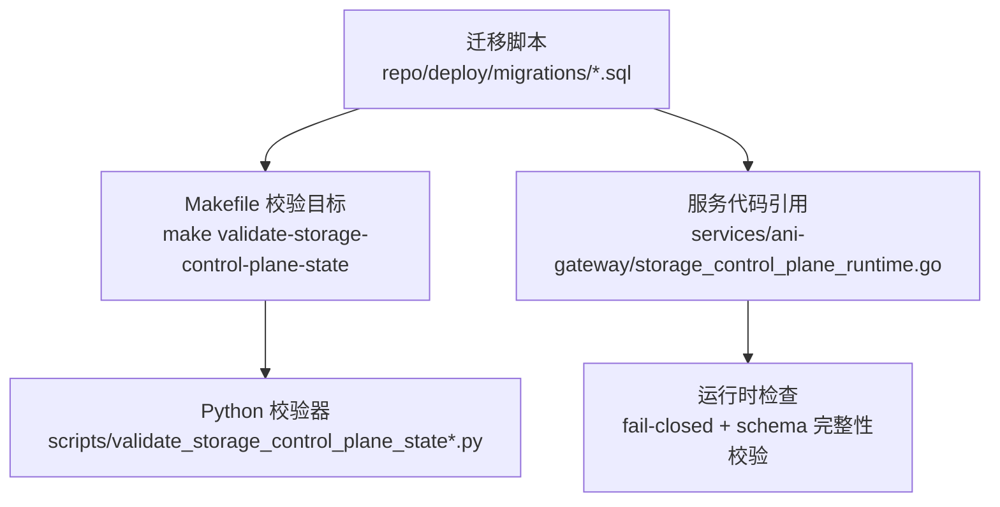
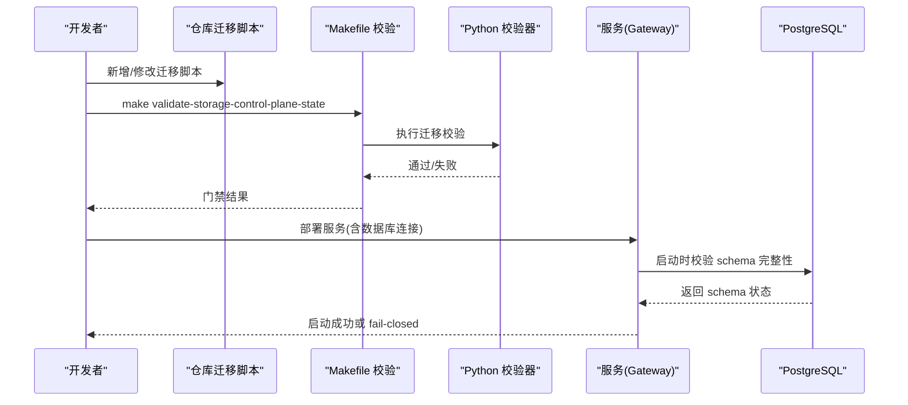
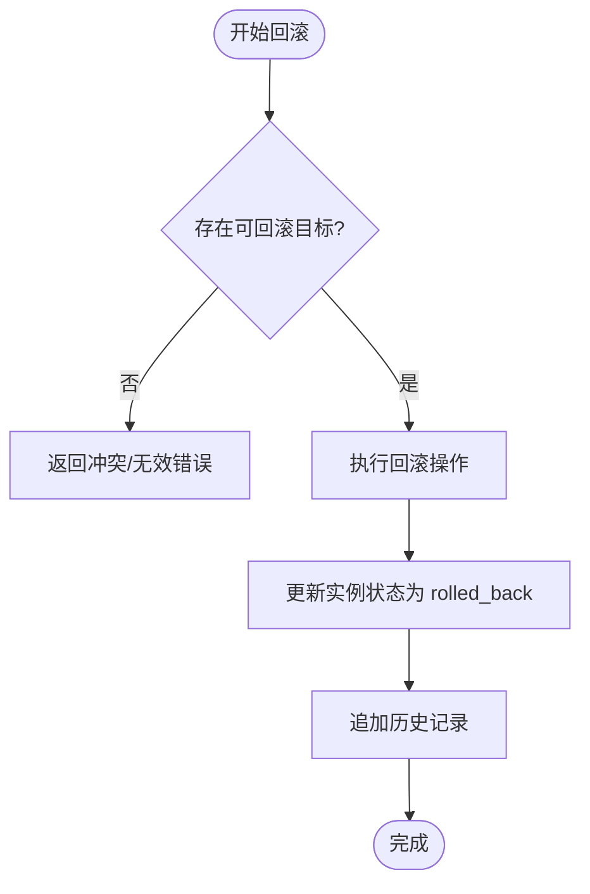
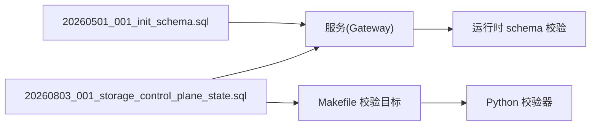

# 迁移与版本管理

<cite>
**本文引用的文件**
- [20260501_001_init_schema.sql](file://repo/deploy/migrations/20260501_001_init_schema.sql)
- [20260803_001_storage_control_plane_state.sql](file://repo/deploy/migrations/20260803_001_storage_control_plane_state.sql)
- [Makefile](file://repo/Makefile)
- [build-image.yml](file://repo/.github/workflows/build-image.yml)
- [validate_storage_control_plane_state_test.py](file://repo/scripts/validate_storage_control_plane_state_test.py)
- [instance_service.go](file://repo/pkg/adapters/runtime/instance_service.go)
- [instance_service_test.go](file://repo/pkg/adapters/runtime/instance_service_test.go)
</cite>

## 目录
1. [简介](#简介)
2. [项目结构](#项目结构)
3. [核心组件](#核心组件)
4. [架构总览](#架构总览)
5. [详细组件分析](#详细组件分析)
6. [依赖关系分析](#依赖关系分析)
7. [性能考虑](#性能考虑)
8. [故障排查指南](#故障排查指南)
9. [结论](#结论)
10. [附录](#附录)

## 简介
本文件面向数据库迁移与版本管理的工程实践，结合仓库中的迁移脚本、构建与验证门禁、以及运行时回滚能力，系统化说明：
- 迁移脚本命名规范、版本控制与执行流程
- Atlas 迁移工具的使用方法与最佳实践（以仓库内注释为依据）
- 向后兼容性策略、数据迁移安全性与回滚机制
- CI/CD 流水线中的迁移验证与执行策略
- 生产环境迁移注意事项、备份恢复方案与故障处理流程
- 如何编写安全的迁移脚本并避免并发冲突

## 项目结构
仓库将数据库迁移脚本集中存放于 deploy/migrations，按“日期_序号_描述”的命名组织；同时通过 Makefile 暴露大量 validate-* 目标，对迁移与契约进行静态校验与 live gate 测试。CI 侧提供镜像构建与签名流程，便于发布可追溯产物。

图表来源
- [Makefile:573-583](file://repo/Makefile#L573-L583)
- [validate_storage_control_plane_state_test.py:1-40](file://repo/scripts/validate_storage_control_plane_state_test.py#L1-L40)
- [20260803_001_storage_control_plane_state.sql:1-10](file://repo/deploy/migrations/20260803_001_storage_control_plane_state.sql#L1-L10)

章节来源
- [Makefile:1-16](file://repo/Makefile#L1-L16)
- [Makefile:573-583](file://repo/Makefile#L573-L583)
- [20260803_001_storage_control_plane_state.sql:1-10](file://repo/deploy/migrations/20260803_001_storage_control_plane_state.sql#L1-L10)

## 核心组件
- 迁移脚本集合：包含初始建库与后续增量变更，覆盖租户、用户、模型、推理审计、知识库、异步任务、计量、存储/向量控制面等。
- 迁移校验与门禁：通过 Python 脚本与 Makefile 目标，对迁移文件的表、列、约束、RLS、幂等键等进行断言。
- 运行时保障：Gateway 在启动时校验关键 schema 是否存在，缺失则 fail-closed，防止未迁移上线。
- 回滚与幂等：迁移脚本广泛使用 IF NOT EXISTS、条件 ALTER、软删除字段、唯一索引与 create_idempotency_key，确保重复执行安全。

章节来源
- [20260501_001_init_schema.sql:1-10](file://repo/deploy/migrations/20260501_001_init_schema.sql#L1-L10)
- [20260501_001_init_schema.sql:525-627](file://repo/deploy/migrations/20260501_001_init_schema.sql#L525-L627)
- [20260803_001_storage_control_plane_state.sql:12-68](file://repo/deploy/migrations/20260803_001_storage_control_plane_state.sql#L12-L68)
- [Makefile:573-583](file://repo/Makefile#L573-L583)

## 架构总览
下图展示从迁移脚本到运行时的完整链路：迁移脚本定义 schema 变更；Makefile 调用 Python 校验器进行静态检查；服务启动时进行运行时 schema 校验；CI 负责构建与签名，保证发布物可追溯。

图表来源
- [Makefile:573-583](file://repo/Makefile#L573-L583)
- [validate_storage_control_plane_state_test.py:1-40](file://repo/scripts/validate_storage_control_plane_state_test.py#L1-L40)
- [20260803_001_storage_control_plane_state.sql:1-10](file://repo/deploy/migrations/20260803_001_storage_control_plane_state.sql#L1-L10)

## 详细组件分析

### 迁移脚本命名规范与版本控制
- 命名格式：YYYYMMDD_NNN_description.sql，例如 20260803_001_storage_control_plane_state.sql。
- 顺序控制：通过文件名前缀保证执行顺序；复杂依赖通过脚本头注释声明（如 Depends on）。
- 幂等设计：广泛采用 CREATE ... IF NOT EXISTS、ALTER TABLE ADD COLUMN IF NOT EXISTS、条件 DROP/ADD CONSTRAINT、软删除 deleted_at 字段、create_idempotency_key + 唯一索引。
- RLS 隔离：所有业务表启用行级安全策略 tenant_isolation，基于 app.current_tenant_id 隔离租户数据。

章节来源
- [20260501_001_init_schema.sql:525-627](file://repo/deploy/migrations/20260501_001_init_schema.sql#L525-L627)
- [20260803_001_storage_control_plane_state.sql:12-68](file://repo/deploy/migrations/20260803_001_storage_control_plane_state.sql#L12-L68)
- [20260803_001_storage_control_plane_state.sql:467-583](file://repo/deploy/migrations/20260803_001_storage_control_plane_state.sql#L467-L583)

### Atlas 迁移工具使用方法与最佳实践
- 迁移入口：初始化脚本注释中明确标注了 Atlas 命令 atlas migrate apply，表明迁移可通过 Atlas 驱动执行。
- 最佳实践建议：
  - 将迁移脚本纳入版本控制，保持只增不改。
  - 使用事务包裹大变更，失败自动回滚。
  - 先 dry-run 再 apply，结合 CI 门禁。
  - 对大表变更分步执行，减少锁竞争。
  - 配合 RLS 与最小权限账号（如 ani_app_user）执行应用访问，迁移账号（如 ani_migrator）仅用于 CI/CD。

章节来源
- [20260501_001_init_schema.sql:1-6](file://repo/deploy/migrations/20260501_001_init_schema.sql#L1-L6)

### 向后兼容性策略
- 增量扩展：优先使用 ADD COLUMN、IF NOT EXISTS、默认值与 CHECK 约束，避免破坏既有写入路径。
- 软删除：为资源表添加 deleted_at 字段，查询与更新逻辑需过滤已删除记录。
- 兼容旧列：保留历史 JSONB 列或名称过渡（如 store_id -> vector_store_id），逐步迁移数据。
- 约束渐进：通过 DO $$ 块尝试添加约束，忽略重复对象异常，确保多次执行安全。

章节来源
- [20260803_001_storage_control_plane_state.sql:12-68](file://repo/deploy/migrations/20260803_001_storage_control_plane_state.sql#L12-L68)
- [20260803_001_storage_control_plane_state.sql:200-321](file://repo/deploy/migrations/20260803_001_storage_control_plane_state.sql#L200-L321)
- [20260803_001_storage_control_plane_state.sql:363-448](file://repo/deploy/migrations/20260803_001_storage_control_plane_state.sql#L363-L448)

### 数据迁移安全性与回滚机制
- 安全：
  - 最小权限：应用账号 ani_app_user 仅授予必要 DML；迁移账号 ani_migrator 仅在 CI/CD 使用。
  - RLS：强制租户隔离，避免越权访问。
  - 幂等：通过唯一索引与 create_idempotency_key 防止重复提交。
- 回滚：
  - 迁移脚本应附带可逆步骤（DROP/RENAME/DELETE 对应反向操作），并在文档中说明回滚影响范围。
  - 对于不可逆变更（如删除列），应在上线前评估风险并准备快照与回滚预案。

章节来源
- [20260501_001_init_schema.sql:12-27](file://repo/deploy/migrations/20260501_001_init_schema.sql#L12-L27)
- [20260501_001_init_schema.sql:525-627](file://repo/deploy/migrations/20260501_001_init_schema.sql#L525-L627)
- [20260803_001_storage_control_plane_state.sql:467-583](file://repo/deploy/migrations/20260803_001_storage_control_plane_state.sql#L467-L583)

### CI/CD 流水线中的迁移验证与执行策略
- 本地与 CI 门禁：
  - 通过 Makefile 目标 validate-storage-control-plane-state 调用 Python 校验器，检查迁移是否符合契约（表、列、约束、RLS、幂等键等）。
  - 其他 validate-* 目标覆盖基础设施、契约一致性、live gate 等。
- 镜像构建与签名：
  - GitHub Actions 构建多平台镜像，执行 Trivy 扫描阻断高危漏洞，并使用 Cosign 签名，确保发布物可信。
- 执行策略建议：
  - 先运行静态校验与单元测试，再通过集成测试与 live gate。
  - 迁移执行应在受控窗口内进行，配合灰度与回滚预案。

章节来源
- [Makefile:573-583](file://repo/Makefile#L573-L583)
- [build-image.yml:1-82](file://repo/.github/workflows/build-image.yml#L1-L82)

### 生产环境迁移注意事项、备份恢复与故障处理
- 注意事项：
  - 迁移前全量备份数据库与对象存储元数据。
  - 分阶段执行：先小流量灰度，观察指标与错误率。
  - 严格权限：迁移账号与账号隔离，应用账号最小权限。
  - 监控与告警：关注锁等待、慢查询、RLS 误配导致的拒绝访问。
- 备份恢复：
  - 使用 pg_dump/pg_restore 或云厂商备份方案，确保可快速回滚。
  - 对大表变更，优先采用在线重建与双写过渡。
- 故障处理：
  - 若迁移失败，立即回滚至上一稳定版本，并恢复数据快照。
  - 针对 RLS 误配导致的数据不可见，优先修复策略并重新校验。

[本节为通用指导，不直接分析具体文件]

### 如何编写安全的迁移脚本与处理并发冲突
- 幂等性：
  - 使用 IF NOT EXISTS、DO $$ 块处理约束添加，忽略重复对象异常。
  - 引入 create_idempotency_key + 唯一索引，防止重复提交。
- 并发冲突：
  - 避免长时间锁表的大变更；必要时分步执行。
  - 对热点表增加合适索引，减少锁竞争。
  - 使用事务包裹相关变更，失败自动回滚。
- 校验与测试：
  - 通过 Python 校验器与单元测试覆盖正负用例。
  - 在本地与 CI 环境中反复验证迁移脚本的可重复执行性。

章节来源
- [20260803_001_storage_control_plane_state.sql:200-321](file://repo/deploy/migrations/20260803_001_storage_control_plane_state.sql#L200-L321)
- [validate_storage_control_plane_state_test.py:1-40](file://repo/scripts/validate_storage_control_plane_state_test.py#L1-L40)

### 运行时回滚与实例生命周期
- 容器/VM 回滚：
  - 支持按 revision 回滚容器实例，或按 snapshot 回滚 VM。
  - 回滚过程记录操作历史，标记 rolled_back 状态，便于审计与追踪。
- 并发与冲突：
  - 回滚请求携带 idempotency_key，避免重复执行。
  - 当目标不存在或冲突时，返回相应错误码（如 409 Conflict）。

图表来源
- [instance_service.go:1925-1964](file://repo/pkg/adapters/runtime/instance_service.go#L1925-L1964)
- [instance_service_test.go:1228-1256](file://repo/pkg/adapters/runtime/instance_service_test.go#L1228-L1256)

章节来源
- [instance_service.go:1925-1964](file://repo/pkg/adapters/runtime/instance_service.go#L1925-L1964)
- [instance_service_test.go:1228-1256](file://repo/pkg/adapters/runtime/instance_service_test.go#L1228-L1256)

## 依赖关系分析
迁移脚本与服务之间的依赖主要体现在：
- 脚本头注释声明依赖的前置迁移（如 storage/vector control-plane 依赖网络与存储资源迁移）。
- 服务启动时对关键表的 schema 完整性进行检查，缺失则 fail-closed。
- Makefile 目标串联 Python 校验器与测试，形成闭环门禁。

图表来源
- [20260803_001_storage_control_plane_state.sql:1-10](file://repo/deploy/migrations/20260803_001_storage_control_plane_state.sql#L1-L10)
- [Makefile:573-583](file://repo/Makefile#L573-L583)

章节来源
- [20260803_001_storage_control_plane_state.sql:1-10](file://repo/deploy/migrations/20260803_001_storage_control_plane_state.sql#L1-L10)
- [Makefile:573-583](file://repo/Makefile#L573-L583)

## 性能考虑
- 分区与索引：
  - 高写入表（如推理审计日志、审计日志）按月分区，提升查询与维护效率。
  - 为高频查询列建立复合索引，如 tenant_id + status、tenant_id + created_at。
- 大表变更：
  - 优先采用 ADD COLUMN 默认值、延迟填充策略，避免长事务锁表。
  - 对历史数据进行分批回填，降低线上压力。
- 资源配额与计量：
  - 计量记录表设计支持高吞吐写入，建议结合 TimescaleDB hypertable 优化时序查询。

章节来源
- [20260501_001_init_schema.sql:254-281](file://repo/deploy/migrations/20260501_001_init_schema.sql#L254-L281)
- [20260501_001_init_schema.sql:436-454](file://repo/deploy/migrations/20260501_001_init_schema.sql#L436-L454)
- [20260501_001_init_schema.sql:499-523](file://repo/deploy/migrations/20260501_001_init_schema.sql#L499-L523)

## 故障排查指南
- 常见错误：
  - 迁移失败：检查事务是否完整、约束是否冲突、权限是否足够。
  - 运行时 fail-closed：确认 Gateway 已配置 DATABASE_URL 且 schema 完整。
  - RLS 误配：检查 tenant_isolation 策略是否正确设置 WITH CHECK 与 USING。
- 排查步骤：
  - 使用 Python 校验器定位缺失表/列/约束。
  - 查看服务日志，确认启动时 schema 校验结果。
  - 对大表变更，检查锁等待与慢查询日志。
- 回滚策略：
  - 若迁移不可逆，优先恢复数据快照并回滚至上一稳定版本。
  - 对 RLS 问题，修正策略后重新校验并重启服务。

章节来源
- [validate_storage_control_plane_state_test.py:1-40](file://repo/scripts/validate_storage_control_plane_state_test.py#L1-L40)
- [20260803_001_storage_control_plane_state.sql:467-583](file://repo/deploy/migrations/20260803_001_storage_control_plane_state.sql#L467-L583)

## 结论
本仓库通过规范的迁移脚本命名、严格的静态校验与运行时 schema 检查、以及完善的幂等与 RLS 设计，构建了可靠的数据库迁移与版本管理体系。结合 CI/CD 门禁与镜像签名，确保了发布物的可追溯性与安全性。生产环境迁移应遵循分阶段灰度、备份恢复与故障回滚的最佳实践，确保系统稳定演进。

[本节为总结性内容，不直接分析具体文件]

## 附录
- 常用命令：
  - 本地依赖：make deps
  - 迁移校验：make validate-storage-control-plane-state
  - 构建镜像：触发 build-image.yml 工作流
- 参考文件：
  - 迁移脚本：repo/deploy/migrations/*.sql
  - 校验器：repo/scripts/validate_storage_control_plane_state*.py
  - 服务运行时：services/ani-gateway/storage_control_plane_runtime.go

[本节为补充信息，不直接分析具体文件]