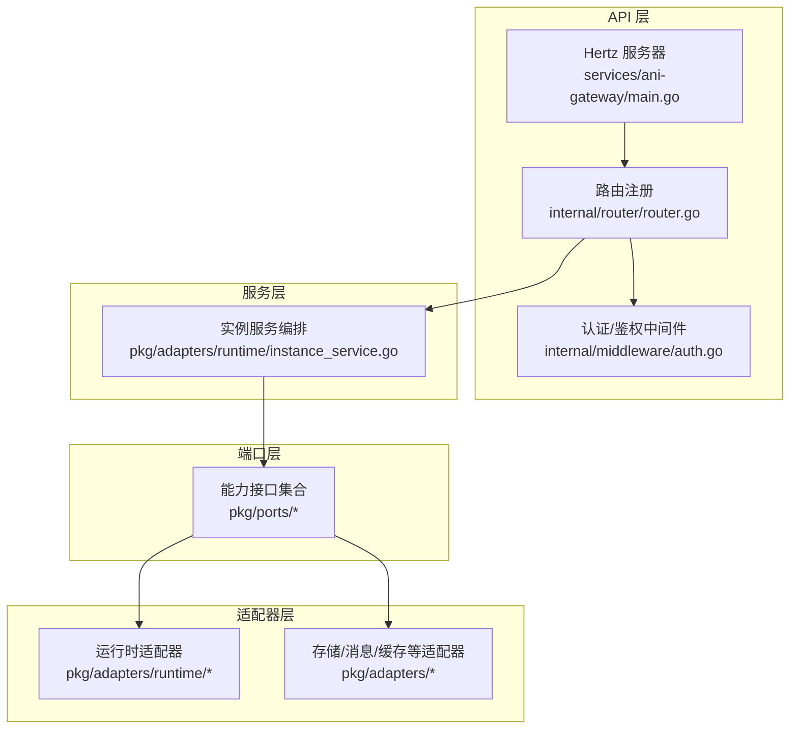
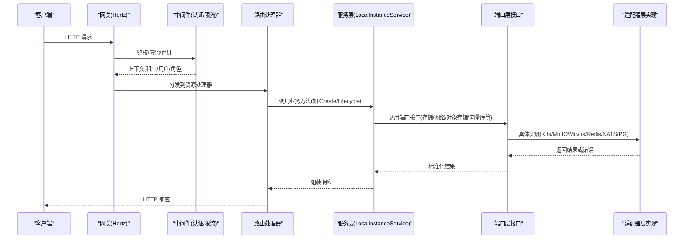
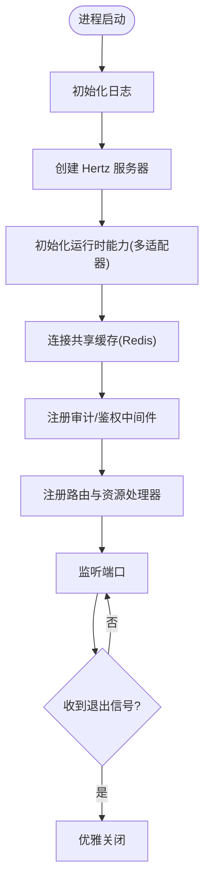
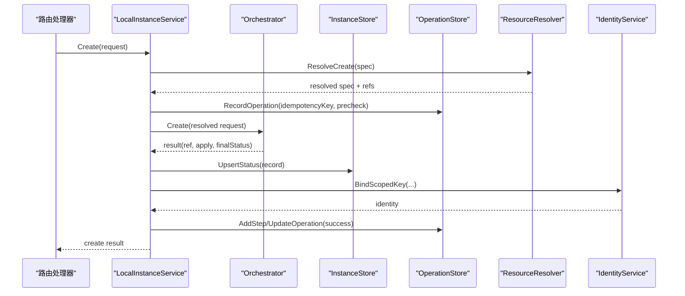
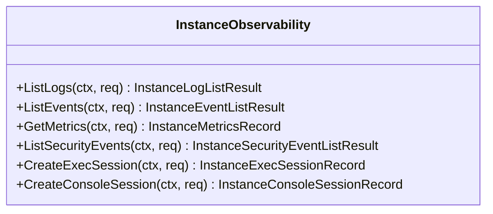
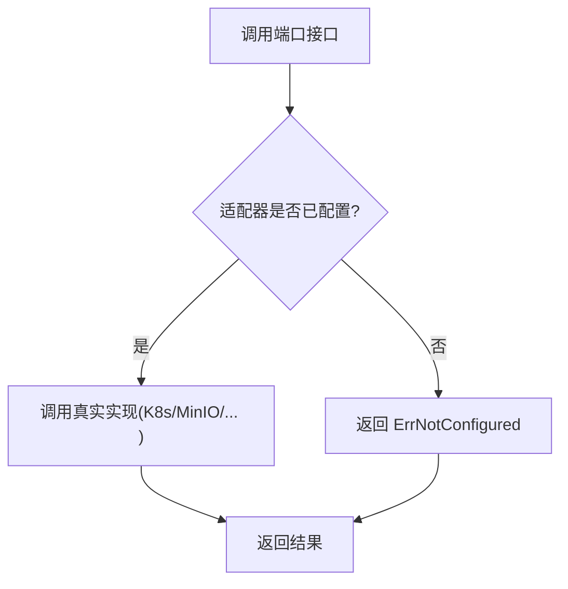
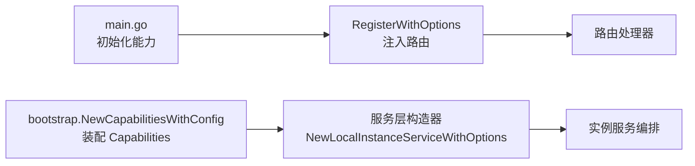
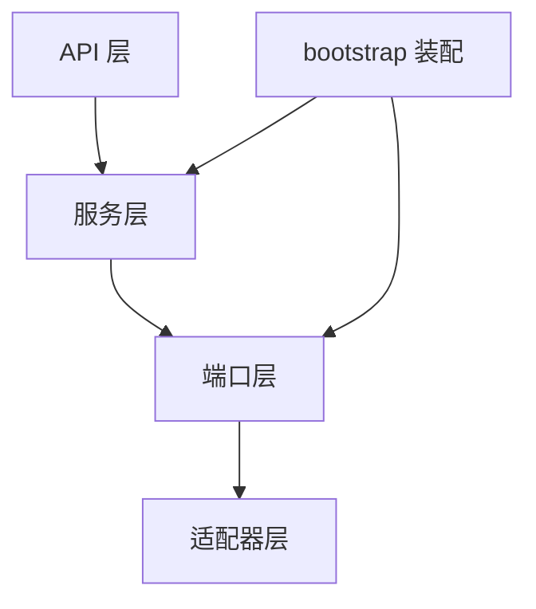

# 分层架构设计

<cite>
**本文引用的文件**
- [main.go](file://repo/services/ani-gateway/main.go)
- [router.go](file://repo/services/ani-gateway/internal/router/router.go)
- [auth.go](file://repo/services/ani-gateway/internal/middleware/auth.go)
- [deps.go](file://repo/pkg/bootstrap/deps.go)
- [errors.go](file://repo/pkg/ports/errors.go)
- [instance_observability.go](file://repo/pkg/ports/instance_observability.go)
- [instance_service.go](file://repo/pkg/adapters/runtime/instance_service.go)
- [not_configured.go](file://repo/pkg/adapters/runtime/not_configured.go)
</cite>

## 目录
1. [简介](#简介)
2. [项目结构](#项目结构)
3. [核心组件](#核心组件)
4. [架构总览](#架构总览)
5. [详细组件分析](#详细组件分析)
6. [依赖关系分析](#依赖关系分析)
7. [性能考虑](#性能考虑)
8. [故障排查指南](#故障排查指南)
9. [结论](#结论)

## 简介
本文件围绕 ANI 平台的四层架构模式进行系统化说明：API 层（路由与请求处理）、服务层（业务编排）、端口层（接口抽象定义）、适配器层（具体实现）。文档聚焦每层的职责边界、数据流向、错误处理机制，并通过调用序列图与依赖注入配置展示各层如何协作完成典型业务。同时总结分层带来的解耦优势与可测试性提升。

## 项目结构
ANI 的网关服务以 Hertz 为 HTTP 框架，入口在 services/ani-gateway/main.go；路由注册在 internal/router；中间件在 internal/middleware；通用能力通过 pkg/ports 暴露接口，由 pkg/adapters 提供多种实现；bootstrap 负责统一初始化与装配。

图表来源
- [main.go:20-220](file://repo/services/ani-gateway/main.go#L20-L220)
- [router.go:47-102](file://repo/services/ani-gateway/internal/router/router.go#L47-L102)
- [auth.go:22-141](file://repo/services/ani-gateway/internal/middleware/auth.go#L22-L141)
- [instance_service.go:23-88](file://repo/pkg/adapters/runtime/instance_service.go#L23-L88)
- [deps.go:25-87](file://repo/pkg/bootstrap/deps.go#L25-L87)

章节来源
- [main.go:20-220](file://repo/services/ani-gateway/main.go#L20-L220)
- [router.go:47-102](file://repo/services/ani-gateway/internal/router/router.go#L47-L102)
- [auth.go:22-141](file://repo/services/ani-gateway/internal/middleware/auth.go#L22-L141)
- [deps.go:25-87](file://repo/pkg/bootstrap/deps.go#L25-L87)

## 核心组件
- API 层：基于 Hertz 的 HTTP 服务，负责监听端口、启动信号处理、注册路由组与资源处理器。
- 服务层：以 LocalInstanceService 为代表的业务编排器，协调实例生命周期、操作审计、身份绑定、存储挂载等跨能力流程。
- 端口层：定义稳定的能力接口（如 InstanceObservability、WorkloadInstanceStore、NetworkService 等），屏蔽底层实现差异。
- 适配器层：对 Kubernetes、对象存储、向量库、NATS、Redis、Postgres 等外部系统进行适配，提供本地或真实实现。

章节来源
- [instance_service.go:23-88](file://repo/pkg/adapters/runtime/instance_service.go#L23-L88)
- [instance_observability.go:127-136](file://repo/pkg/ports/instance_observability.go#L127-L136)
- [deps.go:89-306](file://repo/pkg/bootstrap/deps.go#L89-L306)

## 架构总览
下图展示了从客户端请求到后端资源的全链路：请求经中间件鉴权后进入路由，路由将请求委派给服务层进行编排，服务层通过端口层调用适配器完成实际工作。

图表来源
- [main.go:20-220](file://repo/services/ani-gateway/main.go#L20-L220)
- [router.go:47-102](file://repo/services/ani-gateway/internal/router/router.go#L47-L102)
- [auth.go:22-141](file://repo/services/ani-gateway/internal/middleware/auth.go#L22-L141)
- [instance_service.go:90-294](file://repo/pkg/adapters/runtime/instance_service.go#L90-L294)
- [deps.go:89-306](file://repo/pkg/bootstrap/deps.go#L89-L306)

## 详细组件分析

### API 层：路由与请求处理
- 职责边界：启动 HTTP 服务器、加载配置、注册路由组、注入服务依赖、优雅关停。
- 关键流程：
  - 初始化日志、创建 Hertz 服务器并设置监听地址。
  - 初始化各类运行时能力（K8s 集群代理、加密、密钥、GPU 库存、网络、存储、镜像仓库、实例运行时、向量库、可观测性等）。
  - 连接共享缓存（Redis）并注册审计中间件。
  - 将已初始化的能力通过 RegisterWithOptions 注入到路由层。
  - 监听系统信号并在退出时关闭服务。

图表来源
- [main.go:20-220](file://repo/services/ani-gateway/main.go#L20-L220)

章节来源
- [main.go:20-220](file://repo/services/ani-gateway/main.go#L20-L220)
- [router.go:47-102](file://repo/services/ani-gateway/internal/router/router.go#L47-L102)

### 服务层：业务编排
- 职责边界：封装跨能力的业务流程，保证幂等、审计、身份绑定、资源解析与状态持久化。
- 典型流程（以实例创建为例）：
  - 参数校验与意图指纹计算。
  - 可选的资源解析（网络/存储/镜像/密钥等）。
  - 记录操作（幂等键去重、失败重试标记）。
  - 调用编排器执行创建，随后挂载存储、绑定工作负载身份、记录时间线与操作步骤。
  - 返回最终状态与引用。

图表来源
- [instance_service.go:90-294](file://repo/pkg/adapters/runtime/instance_service.go#L90-L294)

章节来源
- [instance_service.go:90-294](file://repo/pkg/adapters/runtime/instance_service.go#L90-L294)

### 端口层：接口抽象定义
- 职责边界：定义稳定、领域语义清晰的接口，屏蔽底层实现细节，便于替换与测试。
- 示例：
  - 可观测性接口：日志/事件/指标/安全事件/执行会话/控制台会话等查询与创建。
  - 其他端口：消息总线、缓存、对象存储、向量库、网络/存储资源、工作负载运行时等。

图表来源
- [instance_observability.go:127-136](file://repo/pkg/ports/instance_observability.go#L127-L136)

章节来源
- [instance_observability.go:127-136](file://repo/pkg/ports/instance_observability.go#L127-L136)

### 适配器层：具体实现
- 职责边界：对接具体基础设施（Kubernetes、MinIO、Milvus、Redis、NATS、Postgres 等），提供本地或真实实现，遵循端口层契约。
- 未配置降级：当某能力未配置时，适配器返回“未配置”错误，使上层可优雅降级或提示。

图表来源
- [not_configured.go:9-33](file://repo/pkg/adapters/runtime/not_configured.go#L9-L33)

章节来源
- [not_configured.go:9-33](file://repo/pkg/adapters/runtime/not_configured.go#L9-L33)

### 依赖注入配置
- 统一装配：bootstrap 包集中创建 Capabilities，按配置选择不同适配器（本地/真实），并组合成服务所需的能力集合。
- 注入点：
  - 网关 main 中通过 RegisterWithOptions 将能力注入路由层。
  - 服务层通过选项函数注入存储、身份、沙箱、资源解析等依赖。

图表来源
- [main.go:134-208](file://repo/services/ani-gateway/main.go#L134-L208)
- [deps.go:89-306](file://repo/pkg/bootstrap/deps.go#L89-L306)
- [instance_service.go:73-88](file://repo/pkg/adapters/runtime/instance_service.go#L73-L88)

章节来源
- [main.go:134-208](file://repo/services/ani-gateway/main.go#L134-L208)
- [deps.go:89-306](file://repo/pkg/bootstrap/deps.go#L89-L306)
- [instance_service.go:73-88](file://repo/pkg/adapters/runtime/instance_service.go#L73-L88)

## 依赖关系分析
- 耦合与内聚：
  - API 层仅依赖路由与中间件，不直接感知底层实现，内聚于请求处理。
  - 服务层聚合多个端口能力，内聚于业务流程编排。
  - 端口层高度内聚于领域语义，低耦合于实现。
  - 适配器层高内聚于特定技术栈，通过端口层与上层解耦。
- 直接/间接依赖：
  - 路由依赖服务层；服务层依赖端口层；端口层依赖适配器层。
  - bootstrap 集中管理适配器选择与组合，避免散落的 if/switch 逻辑。
- 循环依赖：未发现明显循环依赖，层次清晰。
- 外部依赖：Kubernetes、对象存储、向量库、缓存、消息队列、数据库等。

图表来源
- [deps.go:89-306](file://repo/pkg/bootstrap/deps.go#L89-L306)
- [main.go:134-208](file://repo/services/ani-gateway/main.go#L134-L208)

章节来源
- [deps.go:89-306](file://repo/pkg/bootstrap/deps.go#L89-L306)
- [main.go:134-208](file://repo/services/ani-gateway/main.go#L134-L208)

## 性能考虑
- 中间件链：鉴权、限流、审计在入口处完成，减少后续处理开销。
- 异步任务：路由与服务层支持异步任务存储，适合长耗时操作的后台执行。
- 缓存与会话：共享 Redis 用于配额、缓存与会话，降低重复计算与外部调用压力。
- 可观测性：Prometheus 集成与实例可观测性接口，便于监控与定位瓶颈。
- 资源解析与批量操作：在服务层集中进行资源解析与批处理，减少多次往返。

[本节为通用指导，无需特定文件引用]

## 故障排查指南
- 常见错误类型：
  - 未配置：能力适配器未配置时返回“未配置”，检查环境变量与配置项。
  - 不支持：当前适配器不支持该操作，需升级或切换实现。
  - 无效请求：参数缺失或非法，检查入参与校验逻辑。
  - 冲突/不存在：资源冲突或未找到，检查唯一性与前置条件。
  - 凭证无效/租户不存在：认证失败或租户不存在，检查令牌与租户信息。
  - 不可用：依赖服务不可用，检查下游健康与重试策略。
- 排查建议：
  - 查看中间件日志与审计记录，确认请求上下文（租户/用户/角色）。
  - 检查 bootstrap 装配日志，确认各适配器是否成功初始化。
  - 使用可观测性接口获取实例日志、事件与指标，定位问题阶段。
  - 针对幂等操作，核对操作记录与步骤，判断是否发生重试或回滚。

章节来源
- [errors.go:5-24](file://repo/pkg/ports/errors.go#L5-L24)
- [auth.go:22-141](file://repo/services/ani-gateway/internal/middleware/auth.go#L22-L141)
- [instance_service.go:90-294](file://repo/pkg/adapters/runtime/instance_service.go#L90-L294)

## 结论
ANI 平台采用清晰的四层架构：API 层专注请求处理，服务层负责业务编排，端口层定义稳定接口，适配器层实现具体技术栈。通过 bootstrap 的统一装配与依赖注入，实现了高度的解耦与可测试性。分层使得新增或替换底层能力时，只需关注适配器与端口契约，不影响上层路由与服务逻辑。结合中间件、可观测性与异步任务，系统在可扩展性、可维护性与稳定性方面具备良好基础。