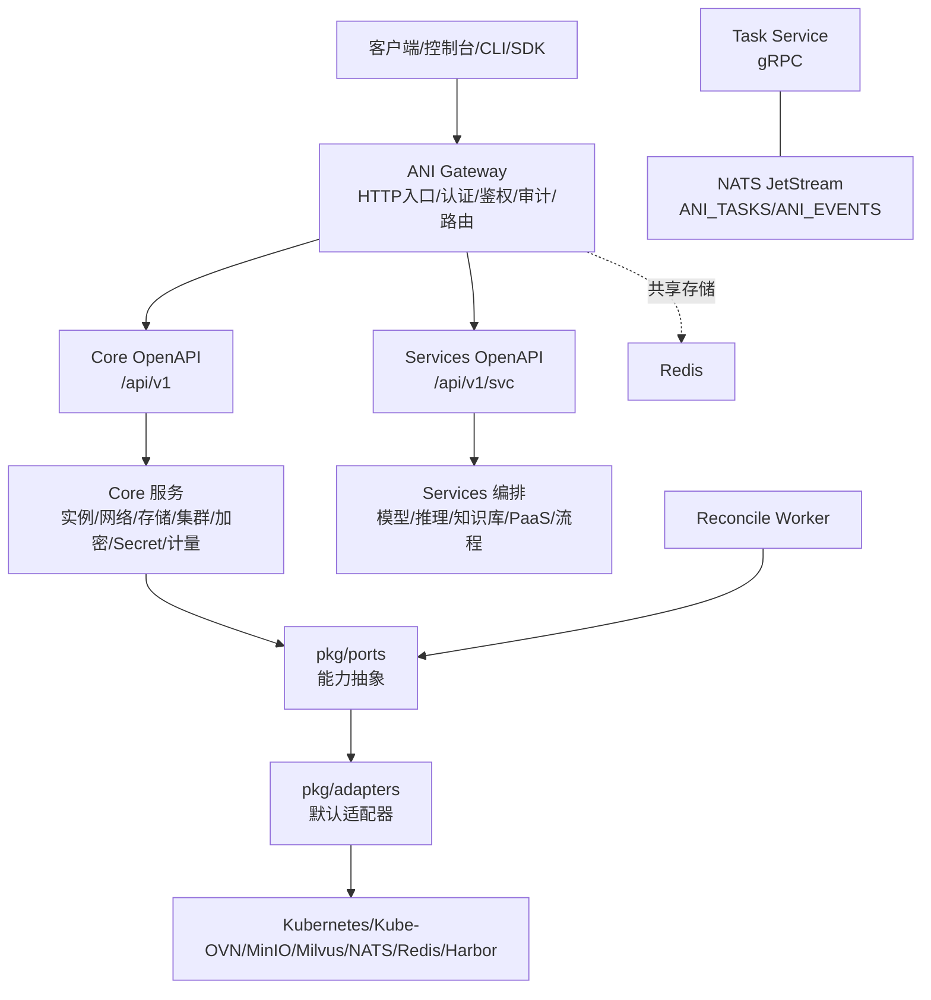
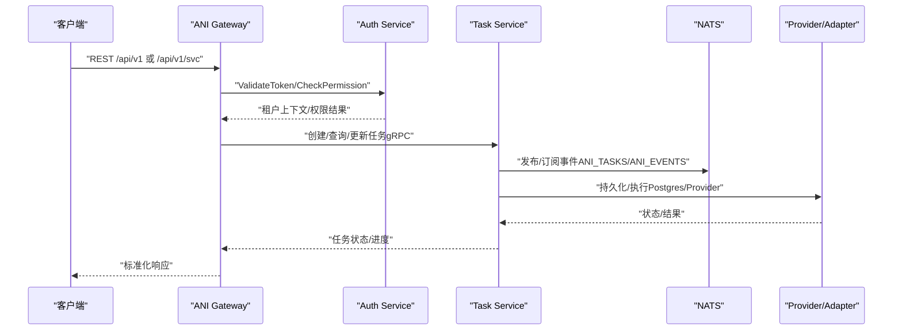
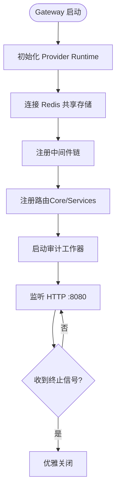
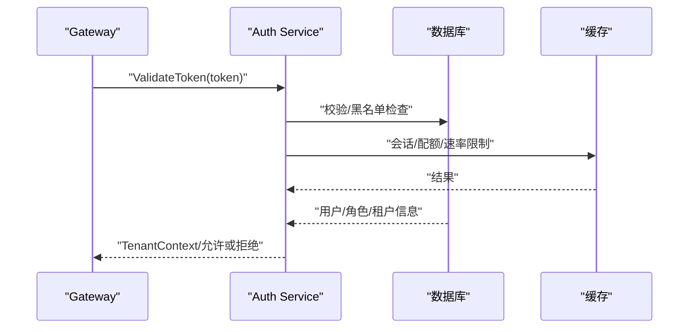
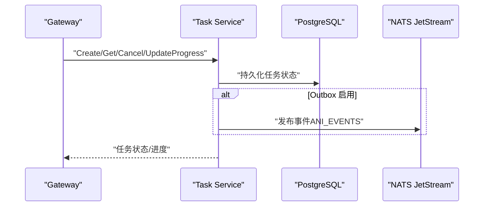
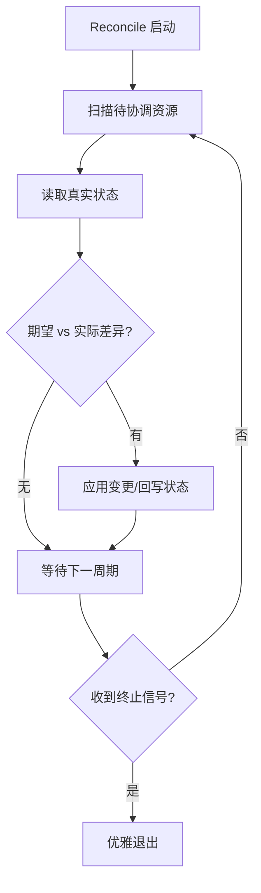
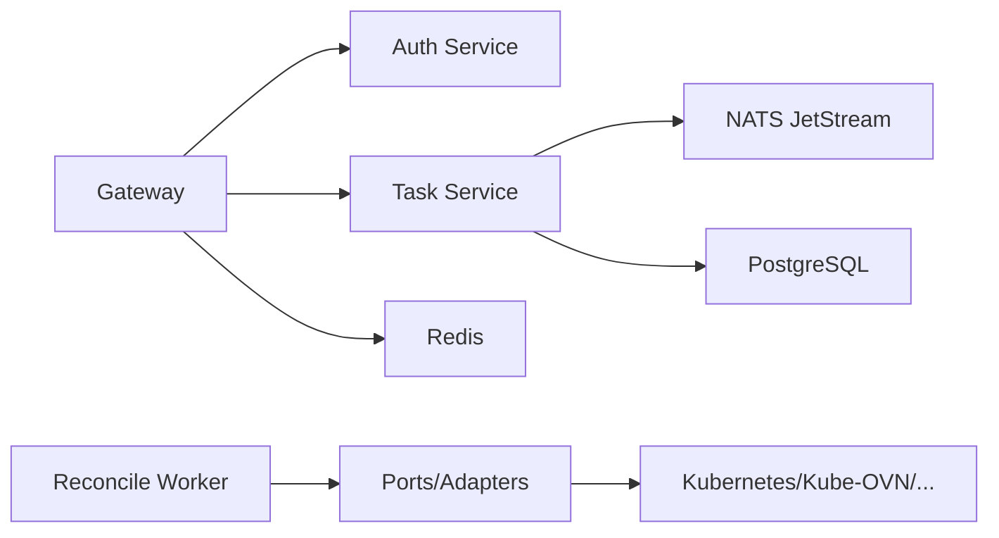

# 微服务架构

<cite>
**本文引用的文件**
- [ANI-05-系统架构设计.md](file://ANI-05-系统架构设计.md)
- [main.go（ani-gateway）](file://repo/services/ani-gateway/main.go)
- [main.go（auth-service）](file://repo/services/auth-service/main.go)
- [main.go（task-service）](file://repo/services/task-service/main.go)
- [main.go（reconcile-worker）](file://repo/services/reconcile-worker/main.go)
- [v1.yaml（Core OpenAPI）](file://repo/api/openapi/v1.yaml)
- [services/v1.yaml（Services OpenAPI）](file://repo/api/openapi/services/v1.yaml)
- [task_service.proto](file://repo/api/proto/task/v1/task_service.proto)
- [auth_service.proto](file://repo/api/proto/auth/v1/auth_service.proto)
- [server.go（bootstrap）](file://repo/pkg/bootstrap/server.go)
- [nats.go（bootstrap）](file://repo/pkg/bootstrap/nats.go)
</cite>

## 目录
1. [简介](#简介)
2. [项目结构](#项目结构)
3. [核心组件](#核心组件)
4. [架构总览](#架构总览)
5. [详细组件分析](#详细组件分析)
6. [依赖关系分析](#依赖关系分析)
7. [性能与扩展性](#性能与扩展性)
8. [部署拓扑与高可用](#部署拓扑与高可用)
9. [故障隔离与可观测性](#故障隔离与可观测性)
10. [配置示例](#配置示例)
11. [监控指标定义](#监控指标定义)
12. [排障指南](#排障指南)
13. [结论](#结论)

## 简介
本文件面向 ANI 平台的微服务架构，聚焦职责划分、通信机制、服务发现、部署拓扑、负载均衡、故障隔离、扩展性设计与可观测性。ANI 将平台拆分为 Core（基础设施控制面）与 Services（云服务/编排/人机交互），通过统一的 API 契约与 SDK 暴露能力；Gateway 作为统一入口承载认证、鉴权、审计与路由；任务与协调工作器通过 gRPC 与消息队列协同完成异步与长时任务。

## 项目结构
- 对外契约层：Core OpenAPI（/api/v1）与 Services OpenAPI（/api/v1/svc）分别定义基础设施与服务编排接口。
- 网关层：ani-gateway 提供 HTTP 入口、中间件链、路由分发与共享存储（Redis）。
- 服务层：auth-service、task-service、model-service 等以 gRPC 提供服务；reconcile-worker 负责状态回写与控制器循环。
- 基础设施适配层：pkg/ports 抽象产品能力，pkg/adapters 提供默认实现，对接 Kubernetes、Kube-OVN、MinIO、Milvus、NATS、Redis、Harbor 等。
- 数据与消息：PostgreSQL、Redis、NATS JetStream（ANI_TASKS、ANI_EVENTS）。

图表来源
- [ANI-05-系统架构设计.md:79-143](file://ANI-05-系统架构设计.md#L79-L143)
- [server.go（bootstrap）:22-106](file://repo/pkg/bootstrap/server.go#L22-L106)
- [nats.go（bootstrap）:56-94](file://repo/pkg/bootstrap/nats.go#L56-L94)

章节来源
- [ANI-05-系统架构设计.md:79-143](file://ANI-05-系统架构设计.md#L79-L143)

## 核心组件
- API 网关（ani-gateway）
  - 职责：统一 HTTP 入口、认证/鉴权/审计、请求标准化、限流与幂等（基于 Redis）、健康探针、路由到 Core/Services handler。
  - 关键装配：初始化各 Provider Runtime（实例、网络、存储、镜像仓库、向量存储、GPU 调度/库存、可观测性等），注册中间件与路由，启动审计工作器。
- 认证服务（auth-service）
  - 职责：用户登录、OIDC 流程、令牌签发/刷新/撤销、API Key 管理、RBAC 权限校验；为 Gateway 中间件提供 ValidateToken/CheckPermission。
  - 运行方式：gRPC 服务，暴露健康端口。
- 任务服务（task-service）
  - 职责：异步任务生命周期管理（创建、查询、取消、进度上报、租约获取/心跳、失败/完成），支持 Outbox 模式发布事件到消息总线。
  - 运行方式：gRPC 服务，连接 PostgreSQL 与 NATS。
- 协调工作器（reconcile-worker）
  - 职责：读取真实底座状态并回写至元数据存储，驱动资源期望与实际一致；支持 Leader Election、退避与指标采集。
  - 运行方式：独立进程，复用 bootstrap 能力，暴露健康探针。

章节来源
- [main.go（ani-gateway）:20-220](file://repo/services/ani-gateway/main.go#L20-L220)
- [main.go（auth-service）:9-31](file://repo/services/auth-service/main.go#L9-L31)
- [main.go（task-service）:15-36](file://repo/services/task-service/main.go#L15-L36)
- [main.go（reconcile-worker）:8-14](file://repo/services/reconcile-worker/main.go#L8-L14)
- [server.go（bootstrap）:387-445](file://repo/pkg/bootstrap/server.go#L387-L445)

## 架构总览
- 分层原则：Core 仅暴露基础设施能力；Services 在 Core 之上组合能力实现业务；前端/CLI/SDK 通过 OpenAPI 调用，不直接访问内部 gRPC。
- 契约优先：新增能力先改 OpenAPI，再实现与测试；Proto 是内部细节，OpenAPI 为权威。
- 控制面边界：Core 通过 ports/adapters 屏蔽底层差异；Controller/Reconciler 负责观察与回写。

图表来源
- [auth_service.proto:11-30](file://repo/api/proto/auth/v1/auth_service.proto#L11-L30)
- [task_service.proto:10-35](file://repo/api/proto/task/v1/task_service.proto#L10-L35)
- [nats.go（bootstrap）:56-94](file://repo/pkg/bootstrap/nats.go#L56-L94)

章节来源
- [ANI-05-系统架构设计.md:207-234](file://ANI-05-系统架构设计.md#L207-L234)

## 详细组件分析

### API 网关（ani-gateway）
- 启动流程：加载各 Provider Runtime（实例、网络、存储、镜像仓库、向量存储、GPU 调度/库存、可观测性），连接 Redis 共享存储，注册中间件与路由，启动审计工作器，监听 HTTP。
- 中间件：认证、鉴权、审计、限流、幂等、错误标准化、健康探针。
- 路由：Core 路径 /api/v1 与 Services 路径 /api/v1/svc 分离，避免 Services 资源写入 Core API。

图表来源
- [main.go（ani-gateway）:20-220](file://repo/services/ani-gateway/main.go#L20-L220)

章节来源
- [main.go（ani-gateway）:20-220](file://repo/services/ani-gateway/main.go#L20-L220)

### 认证服务（auth-service）
- 能力：密码登录、OIDC 授权码流程、令牌签发/刷新/撤销、API Key 全生命周期、权限校验。
- 集成：Gateway 通过 gRPC 调用 ValidateToken/CheckPermission；JWT/OIDC 配置由环境变量注入。

图表来源
- [auth_service.proto:11-30](file://repo/api/proto/auth/v1/auth_service.proto#L11-L30)
- [main.go（auth-service）:9-31](file://repo/services/auth-service/main.go#L9-L31)

章节来源
- [auth_service.proto:11-30](file://repo/api/proto/auth/v1/auth_service.proto#L11-L30)
- [main.go（auth-service）:9-31](file://repo/services/auth-service/main.go#L9-L31)

### 任务服务（task-service）
- 能力：任务 CRUD、进度上报、租约获取/心跳、失败处理、完成回调；可选 Outbox 发布事件。
- 协议：gRPC TaskService；消息总线使用 NATS JetStream。

图表来源
- [task_service.proto:10-35](file://repo/api/proto/task/v1/task_service.proto#L10-L35)
- [main.go（task-service）:15-36](file://repo/services/task-service/main.go#L15-L36)
- [nats.go（bootstrap）:56-94](file://repo/pkg/bootstrap/nats.go#L56-L94)

章节来源
- [task_service.proto:10-35](file://repo/api/proto/task/v1/task_service.proto#L10-L35)
- [main.go（task-service）:15-36](file://repo/services/task-service/main.go#L15-L36)

### 协调工作器（reconcile-worker）
- 能力：周期性扫描目标资源，读取真实底座状态，计算差异并回写；支持 Leader Election、退避策略、指标输出。
- 运行：独立进程，复用 bootstrap 能力，暴露健康探针。

图表来源
- [main.go（reconcile-worker）:8-14](file://repo/services/reconcile-worker/main.go#L8-L14)
- [server.go（bootstrap）:482-549](file://repo/pkg/bootstrap/server.go#L482-L549)

章节来源
- [main.go（reconcile-worker）:8-14](file://repo/services/reconcile-worker/main.go#L8-L14)
- [server.go（bootstrap）:482-549](file://repo/pkg/bootstrap/server.go#L482-L549)

## 依赖关系分析
- 外部依赖
  - 数据库：PostgreSQL（任务/元数据/权限等）
  - 缓存：Redis（限流、幂等、共享存储）
  - 消息：NATS JetStream（ANI_TASKS 点对点任务消费；ANI_EVENTS 多订阅者事件广播）
  - 基础设施：Kubernetes、Kube-OVN、MinIO、Milvus、Harbor 等通过 adapters 接入
- 服务间依赖
  - Gateway → Auth Service（gRPC）
  - Gateway → Task Service（gRPC）
  - Task Service → NATS（发布/订阅）
  - Reconcile Worker → Ports/Adapters → 真实底座

图表来源
- [server.go（bootstrap）:22-106](file://repo/pkg/bootstrap/server.go#L22-L106)
- [nats.go（bootstrap）:56-94](file://repo/pkg/bootstrap/nats.go#L56-L94)

章节来源
- [server.go（bootstrap）:22-106](file://repo/pkg/bootstrap/server.go#L22-L106)
- [nats.go（bootstrap）:56-94](file://repo/pkg/bootstrap/nats.go#L56-L94)

## 性能与扩展性
- 水平扩展
  - Gateway：无状态，横向扩展；依赖 Redis 做跨副本限流与幂等。
  - Task Service：多副本消费 NATS 任务，结合租约与心跳保证单实例处理。
  - Reconcile Worker：Leader Election 确保同一时刻单一协调者，其余副本只读/备援。
- 吞吐与延迟
  - NATS JetStream 提供可靠消息与流式能力；ANI_TASKS 采用 WorkQueuePolicy 适合点对点任务；ANI_EVENTS 采用 InterestPolicy 支持多消费者。
  - Redis 低延迟计数支撑限流与幂等重放。
- 弹性与降级
  - 非关键依赖（如可观测性）可配置开关；Provider 失败时返回标准化错误并记录审计。
  - 控制器退避与批处理降低风暴风险。

章节来源
- [nats.go（bootstrap）:56-94](file://repo/pkg/bootstrap/nats.go#L56-L94)
- [server.go（bootstrap）:387-445](file://repo/pkg/bootstrap/server.go#L387-L445)

## 部署拓扑与高可用
- 典型拓扑
  - 入口：Ingress/Gateway 多副本 + 负载均衡器（L4/L7）
  - 服务：Auth、Task、Model、Reconcile 等按域拆分部署
  - 数据：PostgreSQL HA、Redis Sentinel/Cluster、NATS Cluster
  - 底座：Kubernetes 集群内运行 workload 与存储/网络组件
- 负载均衡策略
  - Gateway：基于请求的轮询/一致性哈希（按租户或资源 ID）
  - Task：NATS 多消费者组，自动负载分担
  - Reconcile：Leader Election 避免重复协调
- 高可用要点
  - 健康探针：gRPC 服务暴露健康端口，供 Liveness/Readiness 检测
  - 优雅关停：SIGINT/SIGTERM 触发有序关闭
  - 数据持久化：PostgreSQL、NATS 文件存储、Redis 持久化

章节来源
- [server.go（bootstrap）:387-445](file://repo/pkg/bootstrap/server.go#L387-L445)
- [server.go（bootstrap）:482-549](file://repo/pkg/bootstrap/server.go#L482-L549)

## 故障隔离与可观测性
- 故障隔离
  - 租户隔离：JWT claims 提取 tenant_id，所有操作带租户边界
  - 资源隔离：Provider 层按租户/命名空间隔离
  - 超时与重试：中间件与 gRPC 拦截器统一处理异常与恢复
- 可观测性
  - 日志：结构化 JSON 日志，包含 request_id、operation_id
  - 指标：gRPC 方法耗时、错误率；控制器指标（重试次数、批大小、退避）
  - 追踪：审计中间件记录关键变更时间线

章节来源
- [server.go（bootstrap）:551-573](file://repo/pkg/bootstrap/server.go#L551-L573)

## 配置示例
以下为常见环境变量的配置要点（具体键名见源码与环境覆盖逻辑）：
- 通用依赖
  - DATABASE_URL：PostgreSQL 连接串
  - NATS_URL：NATS 地址
  - REDIS_*：Redis 模式、地址、主从、凭据、DB
  - HEALTH_PORT：健康探针端口
  - SERVICE_NAME：服务名称
- 提供者与底座
  - WORKLOAD_PROVIDER、NETWORK_PROVIDER、STORAGE_PROVIDER、REGISTRY_PROVIDER_MODE、HARBOR_*
  - INSTANCE_OBSERVABILITY_PROVIDER、INSTANCE_OBSERVABILITY_PROMETHEUS_URL
  - VECTOR_STORE_*、OBJECT_STORE_*
- 控制器与工作器
  - WORKLOAD_RECONCILE_CONTROLLER_ENABLED、INTERVAL/TIMEOUT/BATCH/BACKOFF
  - LEADER_ELECTION_*、LEASE_*
- 网关特定
  - GATEWAY_LISTEN_ADDR、GATEWAY_REDIS_*（限流/幂等）
  - KB_SERVICE_GRPC_ADDR（如需调用 kb-service）

章节来源
- [server.go（bootstrap）:22-106](file://repo/pkg/bootstrap/server.go#L22-L106)
- [server.go（bootstrap）:152-357](file://repo/pkg/bootstrap/server.go#L152-L357)
- [main.go（ani-gateway）:223-271](file://repo/services/ani-gateway/main.go#L223-L271)

## 监控指标定义
- 服务级
  - gRPC 请求数、延迟分布、错误率（按 method/status）
  - 健康探针状态（依赖连通性：DB、NATS、Redis）
- 任务级
  - 任务状态机转换次数（pending→running→completed/failed/cancelled/dead_letter）
  - 租约获取/心跳成功率、失败重试次数
- 控制器级
  - 协调周期、批大小、失败退避、活跃/空闲比例
- 网关级
  - 限流命中数、幂等重放命中数、认证/鉴权失败数

章节来源
- [server.go（bootstrap）:387-445](file://repo/pkg/bootstrap/server.go#L387-L445)
- [server.go（bootstrap）:482-549](file://repo/pkg/bootstrap/server.go#L482-L549)

## 排障指南
- 启动失败
  - 检查数据库/NATS/Redis 连通性与凭据
  - 确认健康端口未被占用
- 认证/鉴权问题
  - 验证 JWT/OIDC 配置与密钥；检查租户上下文是否正确注入
- 任务卡住
  - 检查租约是否过期；查看心跳与重试；核对 NATS 流是否存在
- 控制器抖动
  - 调整退避与批大小；确认 Leader Election 正常；观察依赖健康状态

章节来源
- [server.go（bootstrap）:387-445](file://repo/pkg/bootstrap/server.go#L387-L445)
- [server.go（bootstrap）:551-573](file://repo/pkg/bootstrap/server.go#L551-L573)

## 结论
ANI 通过清晰的 Core/Services 分层、统一的 OpenAPI 契约与 gRPC 内部通信，实现了可扩展、可观测、高可用的微服务架构。Gateway 作为统一入口保障安全与治理；Task Service 与 Reconcile Worker 通过 NATS 与控制器循环实现异步与一致性；ports/adapters 屏蔽底层差异，便于替换与演进。生产环境建议采用多副本、HA 数据层与完善的监控告警体系，持续收敛契约与边界，确保稳定交付。