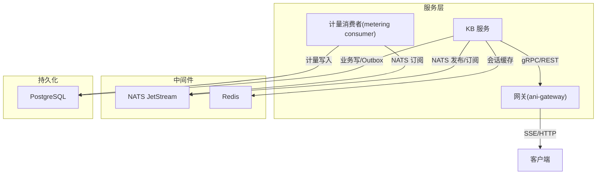
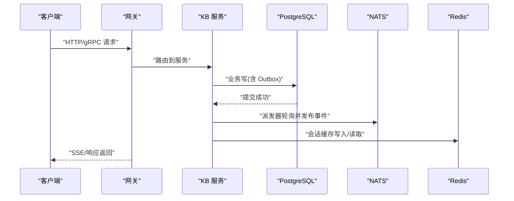
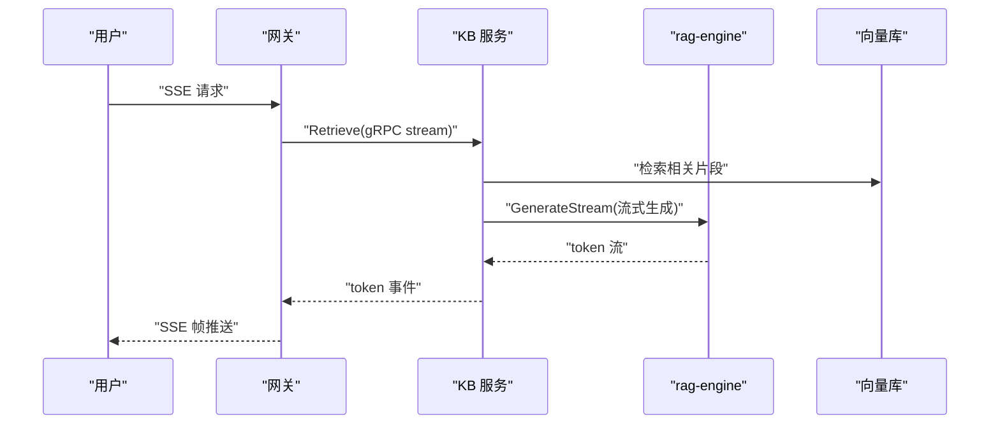
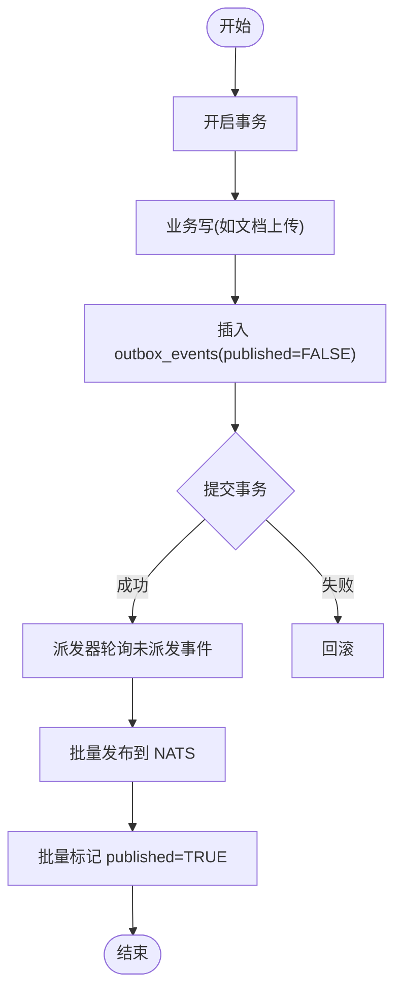
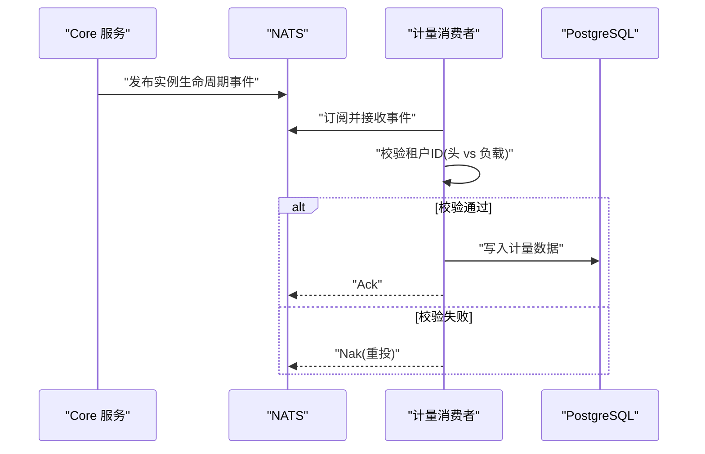
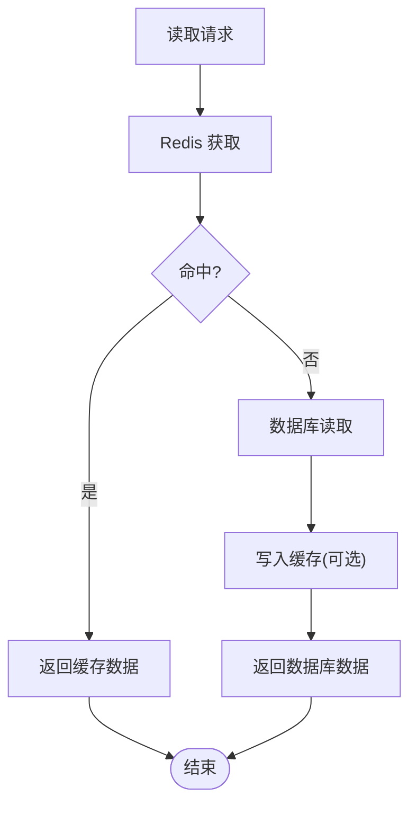
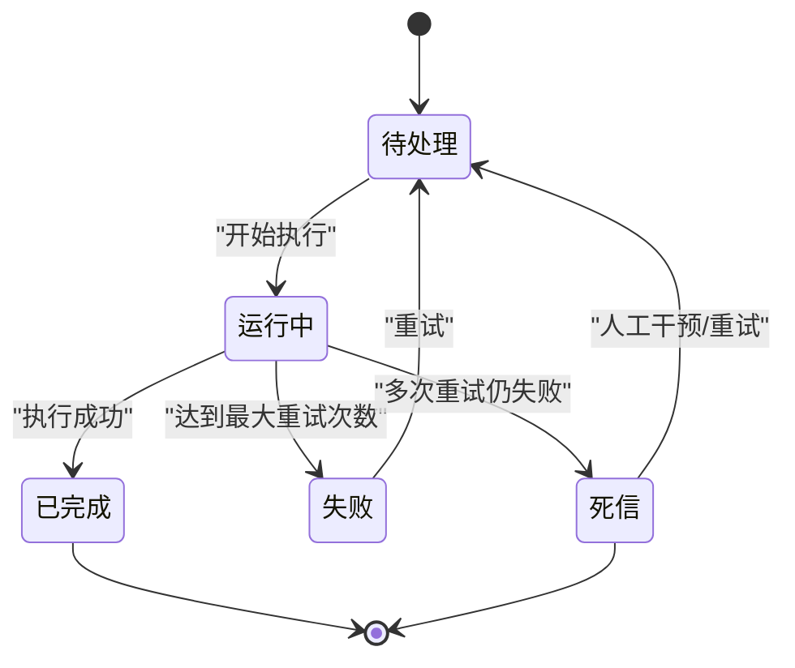
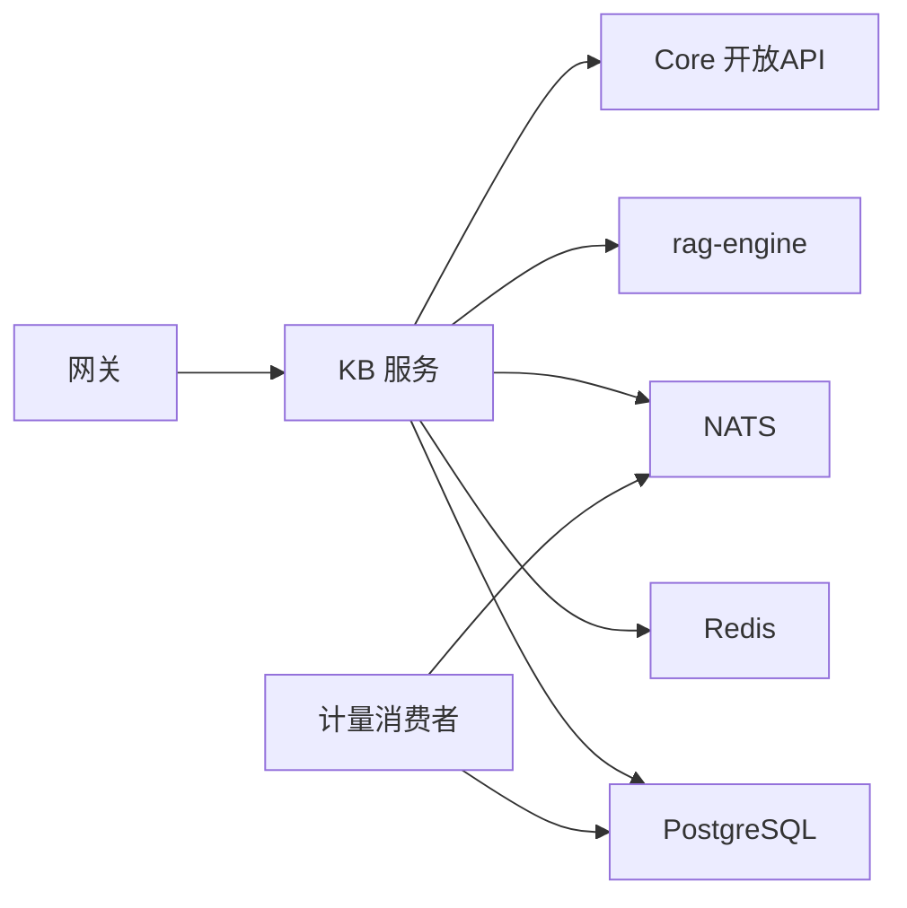

# 数据流设计

<cite>
**本文引用的文件**
- [message_bus.go](file://repo/pkg/ports/message_bus.go)
- [messages.go](file://repo/pkg/nats/messages.go)
- [cache_store.go](file://repo/pkg/ports/cache_store.go)
- [async_task.go](file://repo/pkg/ports/async_task.go)
- [async_task_store.go](file://repo/pkg/adapters/runtime/async_task_store.go)
- [outbox.py](file://repo/services/kb-service/app/repositories/outbox.py)
- [20260802_001_async_tasks.sql](file://repo/deploy/migrations/20260802_001_async_tasks.sql)
- [kb-nats-publish-closure-plan.md](file://repo/services/tasks/modules/spec/core/knowledge/kb-nats-publish-closure-plan.md)
- [m2.1-task-b-kb-service-outbox-redis-session.md](file://repo/development-records/m2.1-task-b-kb-service-outbox-redis-session.md)
- [issue-038-feature-sse-switch-gateway.md](file://repo/services/tasks/modules/issue/core/knowledge/issue-038-feature-sse-switch-gateway.md)
- [plan-metering-consumer-v2.md](file://repo/services/tasks/modules/plan/plan-metering-consumer-v2.md)
- [config.py](file://repo/services/kb-service/app/core/config.py)
</cite>

## 目录
1. [引言](#引言)
2. [项目结构](#项目结构)
3. [核心组件](#核心组件)
4. [架构总览](#架构总览)
5. [详细组件分析](#详细组件分析)
6. [依赖关系分析](#依赖关系分析)
7. [性能考量](#性能考量)
8. [故障排查指南](#故障排查指南)
9. [结论](#结论)
10. [附录](#附录)

## 引言
本文件聚焦 ANI 平台的数据流设计，覆盖三类关键数据流转：同步请求处理流、异步任务处理流与事件驱动的数据更新流。文档基于仓库中的端口定义、NATS 消息契约、Outbox 模式、Redis 缓存接口以及数据库迁移等实现材料，系统阐述读写分离、缓存策略、消息队列使用场景、一致性保障（事务管理、最终一致性与冲突解决）、状态转换与关键路径性能分析，并给出数据迁移管理与版本兼容性策略建议。

## 项目结构
ANI 平台在数据层采用“服务 + 端口/适配器”的分层组织：
- 端口层定义跨进程/服务的稳定契约（如消息总线、缓存存储、异步任务存储）。
- NATS 消息包集中定义主题与负载结构，统一发布/消费约定。
- Outbox 模式将业务写与事件发布解耦，通过轮询派发器可靠投递到消息总线。
- Redis 作为会话级/热点读缓存，提供 best-effort 的加速能力。
- PostgreSQL 承担持久化与幂等约束（唯一索引、时间戳、死信字段等）。

图表来源
- [message_bus.go:8-65](file://repo/pkg/ports/message_bus.go#L8-L65)
- [messages.go:18-133](file://repo/pkg/nats/messages.go#L18-L133)
- [outbox.py:17-74](file://repo/services/kb-service/app/repositories/outbox.py#L17-L74)
- [cache_store.go:8-15](file://repo/pkg/ports/cache_store.go#L8-L15)
- [20260802_001_async_tasks.sql:1-14](file://repo/deploy/migrations/20260802_001_async_tasks.sql#L1-L14)

章节来源
- [message_bus.go:8-65](file://repo/pkg/ports/message_bus.go#L8-L65)
- [messages.go:18-133](file://repo/pkg/nats/messages.go#L18-L133)
- [outbox.py:17-74](file://repo/services/kb-service/app/repositories/outbox.py#L17-L74)
- [cache_store.go:8-15](file://repo/pkg/ports/cache_store.go#L8-L15)
- [20260802_001_async_tasks.sql:1-14](file://repo/deploy/migrations/20260802_001_async_tasks.sql#L1-L14)

## 核心组件
- 消息总线端口：定义事件信封、发布选项、消息只读视图、订阅选项与处理器语义；Ack/Nak 由适配器根据处理器返回值统一执行，业务侧无需显式确认。
- NATS 消息契约：集中声明主题命名规范与负载结构，涵盖推理部署/删除、知识库解析/索引、模型导入及任务完成事件等。
- 缓存存储端口：抽象 Get/Set/SetNX/Delete/Increment/Exists 等原子操作，用于会话缓存、限流计数、分布式锁等。
- 异步任务存储：定义任务记录与更新结构，包含幂等键、重试次数、进度、结果、错误信息、死信时间与完成时间等字段。
- Outbox 仓库：在同一事务内写入业务状态与 outbox_events，再由独立派发器批量拉取并发布到 NATS，最后批量标记已派发。
- 数据库迁移：为异步任务表扩展 JSONB 结果、错误信息、死信时间、完成时间与更新时间，并建立幂等与查询索引。

章节来源
- [message_bus.go:8-65](file://repo/pkg/ports/message_bus.go#L8-L65)
- [messages.go:18-133](file://repo/pkg/nats/messages.go#L18-L133)
- [cache_store.go:8-15](file://repo/pkg/ports/cache_store.go#L8-L15)
- [async_task.go:8-42](file://repo/pkg/ports/async_task.go#L8-L42)
- [outbox.py:17-74](file://repo/services/kb-service/app/repositories/outbox.py#L17-L74)
- [20260802_001_async_tasks.sql:1-14](file://repo/deploy/migrations/20260802_001_async_tasks.sql#L1-L14)

## 架构总览
ANI 的数据流围绕“同步请求—异步任务—事件驱动”三股主线展开：
- 同步请求处理流：客户端经网关发起请求，网关可直连或转发至服务；对需要流式响应的场景（如 SSE），网关负责帧编码与推送。
- 异步任务处理流：服务将副作用写入数据库并落盘 Outbox，派发器轮询未派发事件并通过消息总线发布；消费者按 at-least-once 语义处理，必要时幂等去重。
- 事件驱动的数据更新流：生命周期事件（如实例创建/停止/失败/删除）被消费者监听，触发计量采集、状态同步等后续动作。

图表来源
- [issue-038-feature-sse-switch-gateway.md:1-46](file://repo/services/tasks/modules/issue/core/knowledge/issue-038-feature-sse-switch-gateway.md#L1-L46)
- [outbox.py:17-74](file://repo/services/kb-service/app/repositories/outbox.py#L17-L74)
- [messages.go:18-133](file://repo/pkg/nats/messages.go#L18-L133)
- [cache_store.go:8-15](file://repo/pkg/ports/cache_store.go#L8-L15)

## 详细组件分析

### 同步请求处理流（SSE/流式响应）
- 网关负责将上游 gRPC/REST 调用转换为 SSE 帧，逐 token 推送给客户端；为降低分配开销，采用缓冲预增长与零拷贝拼接方式构建帧。
- 当启用新路径时，网关通过 gRPC 调用 kb-service.Retrieve，由 kb-service 编排检索与流式生成，事件序列保持一致（token* → sources → done）。
- 若下游不可用，网关应降级为空流或回退旧路径，保证可用性。

图表来源
- [issue-038-feature-sse-switch-gateway.md:1-46](file://repo/services/tasks/modules/issue/core/knowledge/issue-038-feature-sse-switch-gateway.md#L1-L46)
- [kb-nats-publish-closure-plan.md:23-293](file://repo/services/tasks/modules/spec/core/knowledge/kb-nats-publish-closure-plan.md#L23-L293)

章节来源
- [issue-038-feature-sse-switch-gateway.md:1-46](file://repo/services/tasks/modules/issue/core/knowledge/issue-038-feature-sse-switch-gateway.md#L1-L46)

### 异步任务处理流（Outbox + NATS）
- 业务写与 Outbox 事件写入在同一事务中提交，确保“业务状态变更”与“事件待派发”强一致。
- 派发器周期性拉取未派发事件，批量发布到 NATS，再批量标记已派发；失败时整批不标记，下次重试，保持 at-least-once。
- 消费者需对重复事件幂等处理（例如 rag-engine 按 doc_id 幂等解析）。

图表来源
- [outbox.py:17-74](file://repo/services/kb-service/app/repositories/outbox.py#L17-L74)
- [kb-nats-publish-closure-plan.md:23-293](file://repo/services/tasks/modules/spec/core/knowledge/kb-nats-publish-closure-plan.md#L23-L293)
- [m2.1-task-b-kb-service-outbox-redis-session.md:46-156](file://repo/development-records/m2.1-task-b-kb-service-outbox-redis-session.md#L46-L156)

章节来源
- [outbox.py:17-74](file://repo/services/kb-service/app/repositories/outbox.py#L17-L74)
- [kb-nats-publish-closure-plan.md:23-293](file://repo/services/tasks/modules/spec/core/knowledge/kb-nats-publish-closure-plan.md#L23-L293)
- [m2.1-task-b-kb-service-outbox-redis-session.md:46-156](file://repo/development-records/m2.1-task-b-kb-service-outbox-redis-session.md#L46-L156)

### 事件驱动的数据更新流（计量采集）
- 实例生命周期事件（created/stopped/failed/deleted）由消费者监听，触发计量采集的开始/停止。
- 消费者使用 DeliverAll 回放历史消息，结合双层幂等保证不丢采；单副本崩溃后自动重启并从服务端 Ack 进度继续。
- 消费者从消息头读取租户 ID 并与负载校验，不一致则记错并重投。

图表来源
- [plan-metering-consumer-v2.md:147-168](file://repo/services/tasks/modules/plan/plan-metering-consumer-v2.md#L147-L168)
- [plan-metering-consumer-v2.md:1050-1072](file://repo/services/tasks/modules/plan/plan-metering-consumer-v2.md#L1050-L1072)

章节来源
- [plan-metering-consumer-v2.md:147-168](file://repo/services/tasks/modules/plan/plan-metering-consumer-v2.md#L147-L168)
- [plan-metering-consumer-v2.md:1050-1072](file://repo/services/tasks/modules/plan/plan-metering-consumer-v2.md#L1050-L1072)

### 数据库读写分离与缓存策略
- 读路径优先命中 Redis 会话缓存，未命中则回退到数据库；缓存异常不影响主流程（best-effort）。
- 写路径通过事务保证 user 消息与 session 行的一致性；assistant 消息因网络调用隔离在独立事务。
- 配置项暴露 Redis URL，便于环境切换与多实例部署。

图表来源
- [cache_store.go:8-15](file://repo/pkg/ports/cache_store.go#L8-L15)
- [m2.1-task-b-kb-service-outbox-redis-session.md:56-70](file://repo/development-records/m2.1-task-b-kb-service-outbox-redis-session.md#L56-L70)
- [config.py:33-47](file://repo/services/kb-service/app/core/config.py#L33-L47)

章节来源
- [cache_store.go:8-15](file://repo/pkg/ports/cache_store.go#L8-L15)
- [m2.1-task-b-kb-service-outbox-redis-session.md:56-70](file://repo/development-records/m2.1-task-b-kb-service-outbox-redis-session.md#L56-L70)
- [config.py:33-47](file://repo/services/kb-service/app/core/config.py#L33-L47)

### 消息队列使用场景与一致性
- 主题与负载集中管理，避免各服务自定义消息格式；任务完成事件用于 SSE 推送与 Webhook 分发。
- 消息处理器返回 nil 表示成功（Ack），返回 error 表示失败（Nak），panic 由适配器兜底 Nak；业务侧自行判断“跳过”或“重投”。
- Outbox 模式保证事件至少一次投递，消费者幂等处理重复事件。

章节来源
- [messages.go:18-133](file://repo/pkg/nats/messages.go#L18-L133)
- [message_bus.go:22-47](file://repo/pkg/ports/message_bus.go#L22-L47)
- [kb-nats-publish-closure-plan.md:23-293](file://repo/services/tasks/modules/spec/core/knowledge/kb-nats-publish-closure-plan.md#L23-L293)

### 数据一致性保证机制
- 事务管理：业务写与 Outbox 事件同事务提交；user 消息与 session 行原子写入，assistant 消息独立事务以避免长事务。
- 最终一致性：Outbox 派发器与消费者配合，保证事件最终到达；消费者幂等确保重复无害。
- 冲突解决：通过幂等键（idempotency_key）与唯一索引（如 async_tasks 的 tenant_id+idempotency_key）防止重复处理与超卖；消费者校验租户 ID 与负载一致性。

章节来源
- [m2.1-task-b-kb-service-outbox-redis-session.md:64-70](file://repo/development-records/m2.1-task-b-kb-service-outbox-redis-session.md#L64-L70)
- [20260802_001_async_tasks.sql:1-14](file://repo/deploy/migrations/20260802_001_async_tasks.sql#L1-L14)
- [plan-metering-consumer-v2.md:147-168](file://repo/services/tasks/modules/plan/plan-metering-consumer-v2.md#L147-L168)

### 状态转换图（异步任务）

图表来源
- [async_task_store.go:278-285](file://repo/pkg/adapters/runtime/async_task_store.go#L278-L285)

章节来源
- [async_task_store.go:278-285](file://repo/pkg/adapters/runtime/async_task_store.go#L278-L285)

### 关键路径的性能分析
- SSE 帧编码：采用缓冲预增长与零拷贝拼接，减少每次 token 事件的内存分配，提升高吞吐下的性能。
- Outbox 派发：批量 publish-all-then-batch-mark，将连接获取次数从 N 次降为 2 次，显著降低高负载下的序列化瓶颈。
- 会话缓存：使用 pipeline 批量执行 Redis 命令，减少网络往返；缓存异常不阻断主流程，保证可用性。
- 消费者吞吐：计量消费者以单并发处理低频实例事件，不会成为吞吐瓶颈；DeliverAll 回放历史消息保证不丢采。

章节来源
- [issue-038-feature-sse-switch-gateway.md:121-180](file://repo/services/tasks/modules/issue/core/knowledge/issue-038-feature-sse-switch-gateway.md#L121-L180)
- [m2.1-task-b-kb-service-outbox-redis-session.md:115-135](file://repo/development-records/m2.1-task-b-kb-service-outbox-redis-session.md#L115-L135)
- [plan-metering-consumer-v2.md:1050-1072](file://repo/services/tasks/modules/plan/plan-metering-consumer-v2.md#L1050-L1072)

## 依赖关系分析
- 服务间依赖：网关依赖 kb-service 的 gRPC 接口；kb-service 依赖 Core OpenAPI（对象/向量存储）与 rag-engine（Query）。
- 中间件依赖：kb-service 通过 NATS 派发解析任务，通过 Redis 缓存会话；计量消费者通过 NATS 订阅事件。
- 持久化依赖：所有服务通过 PostgreSQL 进行持久化，迁移脚本维护 schema 演进。

图表来源
- [kb-nats-publish-closure-plan.md:23-293](file://repo/services/tasks/modules/spec/core/knowledge/kb-nats-publish-closure-plan.md#L23-L293)
- [messages.go:18-133](file://repo/pkg/nats/messages.go#L18-L133)
- [cache_store.go:8-15](file://repo/pkg/ports/cache_store.go#L8-L15)
- [20260802_001_async_tasks.sql:1-14](file://repo/deploy/migrations/20260802_001_async_tasks.sql#L1-L14)

章节来源
- [kb-nats-publish-closure-plan.md:23-293](file://repo/services/tasks/modules/spec/core/knowledge/kb-nats-publish-closure-plan.md#L23-L293)
- [messages.go:18-133](file://repo/pkg/nats/messages.go#L18-L133)
- [cache_store.go:8-15](file://repo/pkg/ports/cache_store.go#L8-L15)
- [20260802_001_async_tasks.sql:1-14](file://repo/deploy/migrations/20260802_001_async_tasks.sql#L1-L14)

## 性能考量
- 高并发 SSE：减少每次帧分配的内存开销，避免频繁 GC。
- Outbox 批量派发：降低连接池压力，提高吞吐。
- 缓存最佳实践：pipeline 批量命令，异常降级不阻塞主流程。
- 消费者幂等：DeliverAll 回放历史消息，结合幂等键避免重复处理。

[本节为通用指导，不直接分析具体文件]

## 故障排查指南
- 消息处理失败：检查处理器返回值与适配器 Ack/Nak 行为；确认租户 ID 校验是否通过。
- Outbox 未派发：查看未派发事件列表与派发器日志；确认批量标记是否成功。
- 缓存异常：确认 Redis 连接与 TTL 配置；检查缓存降级逻辑是否生效。
- 异步任务卡住：检查任务状态机转换与重试次数；查看死信时间与错误信息。

章节来源
- [message_bus.go:22-47](file://repo/pkg/ports/message_bus.go#L22-L47)
- [outbox.py:17-74](file://repo/services/kb-service/app/repositories/outbox.py#L17-L74)
- [async_task_store.go:278-337](file://repo/pkg/adapters/runtime/async_task_store.go#L278-L337)

## 结论
ANI 平台通过端口/适配器分层、Outbox 模式、Redis 缓存与 NATS 消息总线，构建了高可用、可扩展且一致性的数据流体系。同步请求、异步任务与事件驱动三者协同，既保证了实时性，又确保了可靠性与可观测性。未来可进一步引入读写分离优化、更细粒度的缓存失效策略与更完善的监控指标，以提升整体性能与可维护性。

[本节为总结性内容，不直接分析具体文件]

## 附录
- 数据迁移管理：遵循幂等与回滚原则，迁移脚本按顺序执行，新增字段与索引需考虑向后兼容。
- 版本兼容性：保持 API 契约稳定，通过 flag 控制新旧路径切换，确保灰度与回滚能力。

[本节为补充说明，不直接分析具体文件]