# 架构设计

<cite>
**本文引用的文件**
- [ANI-05-系统架构设计.md](file://ANI-05-系统架构设计.md)
- [main.go（ani-gateway）](file://repo/services/ani-gateway/main.go)
- [main.go（auth-service）](file://repo/services/auth-service/main.go)
- [main.go（task-service）](file://repo/services/task-service/main.go)
- [server.go（bootstrap）](file://repo/pkg/bootstrap/server.go)
- [errors.go（ports）](file://repo/pkg/ports/errors.go)
- [workload_runtime.go（ports）](file://repo/pkg/ports/workload_runtime.go)
- [v1.yaml（Core OpenAPI）](file://repo/api/openapi/v1.yaml)
- [services_v1.yaml（Services OpenAPI）](file://repo/api/openapi/services/v1.yaml)
</cite>

## 目录
1. [引言](#引言)
2. [项目结构](#项目结构)
3. [核心组件](#核心组件)
4. [架构总览](#架构总览)
5. [详细组件分析](#详细组件分析)
6. [依赖关系分析](#依赖关系分析)
7. [性能与可观测性](#性能与可观测性)
8. [故障排查指南](#故障排查指南)
9. [结论](#结论)
10. [附录：分层与适配器模式说明](#附录分层与适配器模式说明)

## 引言
本文件面向 ANI 平台的架构设计与实现，聚焦微服务边界、分层架构（API层→服务层→端口层→适配器层→基础设施层）、适配器模式在多后端支持中的运用，以及关键数据流与部署形态。文档以代码库事实为依据，结合 API 契约与启动装配逻辑，给出可落地的架构图、序列图与流程图，并总结技术选型约束与扩展点。

## 项目结构
仓库采用“Core + Services”的双轨组织方式：
- Core 提供基础设施控制面能力，通过 OpenAPI REST 与 SDK 暴露稳定契约；内部使用 gRPC 进行高效通信。
- Services 在 Core 之上组合能力，提供云服务、人机交互与编排。
- Gateway 统一承载 HTTP 入口、认证、路由、错误标准化等横切关注点。
- pkg/ports 定义产品能力抽象接口；pkg/adapters 提供默认实现，屏蔽底层组件差异。
- api/openapi 维护 Core 与 Services 两套独立契约，SDK 与文档由契约生成。

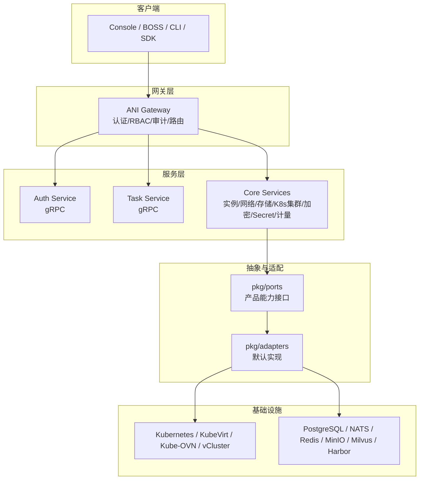

图表来源
- [ANI-05-系统架构设计.md:79-151](file://ANI-05-系统架构设计.md#L79-L151)
- [main.go（ani-gateway）:20-220](file://repo/services/ani-gateway/main.go#L20-L220)
- [server.go（bootstrap）:108-150](file://repo/pkg/bootstrap/server.go#L108-L150)

章节来源
- [ANI-05-系统架构设计.md:79-151](file://ANI-05-系统架构设计.md#L79-L151)
- [v1.yaml（Core OpenAPI）:1-40](file://repo/api/openapi/v1.yaml#L1-L40)
- [services_v1.yaml（Services OpenAPI）:1-20](file://repo/api/openapi/services/v1.yaml#L1-L20)

## 核心组件
- ANI Gateway：HTTP 入口，负责鉴权、RBAC、审计、请求标准化、路由分发，并装配各运行时能力（实例、网络、存储、镜像仓库、向量存储、GPU 库存、可观测性等）。
- Auth Service：gRPC 服务，处理 JWT/OIDC/API Key 等身份与令牌相关能力，供 Gateway 调用。
- Task Service：gRPC 服务，管理异步任务与 Outbox 发布，支撑长耗时操作与可靠事件投递。
- Ports/Adapters：通过接口抽象隔离底层实现，使 Core 不直接耦合具体基础设施。
- Bootstrap：统一连接数据库、消息总线、缓存，并启动 gRPC/健康探针/控制器等。

章节来源
- [main.go（ani-gateway）:20-220](file://repo/services/ani-gateway/main.go#L20-L220)
- [main.go（auth-service）:9-31](file://repo/services/auth-service/main.go#L9-L31)
- [main.go（task-service）:15-36](file://repo/services/task-service/main.go#L15-L36)
- [server.go（bootstrap）:108-150](file://repo/pkg/bootstrap/server.go#L108-L150)

## 架构总览
整体遵循“API 契约 → Gateway → Core/Services → Ports → Adapters → 基础设施”的分层模型。Core 与 Services 的对外契约分离，避免业务耦合；Core 内部通过 gRPC 提升效率，但对外仍以 OpenAPI 为唯一真实来源。

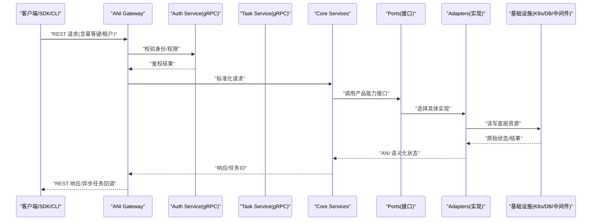

图表来源
- [ANI-05-系统架构设计.md:305-346](file://ANI-05-系统架构设计.md#L305-L346)
- [main.go（ani-gateway）:167-208](file://repo/services/ani-gateway/main.go#L167-L208)
- [server.go（bootstrap）:387-445](file://repo/pkg/bootstrap/server.go#L387-L445)

## 详细组件分析

### ANI Gateway（API 层）
- 职责：启动 HTTP 服务、装配运行时能力、注册路由、启用审计、优雅关闭。
- 关键行为：从环境变量加载配置，初始化各 Provider Runtime（实例、网络、存储、镜像仓库、向量存储、GPU 库存、可观测性等），并通过 router 将 REST 路由绑定到对应能力。
- 与外部集成：通过 gRPC 调用 Auth/KB 等服务；通过 Redis 共享存储；通过 Kubernetes REST Client 做孤儿发现等。

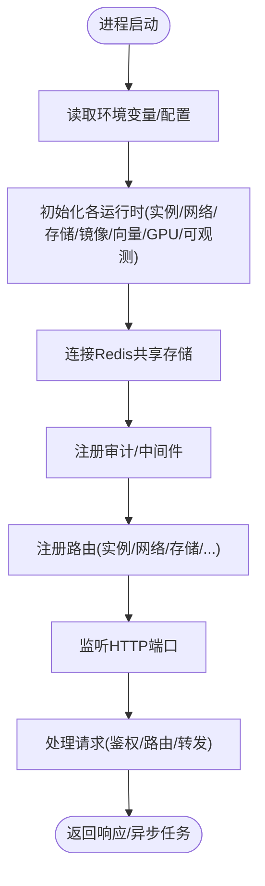

图表来源
- [main.go（ani-gateway）:20-220](file://repo/services/ani-gateway/main.go#L20-L220)

章节来源
- [main.go（ani-gateway）:20-220](file://repo/services/ani-gateway/main.go#L20-L220)

### Auth Service（认证服务）
- 职责：提供 gRPC 认证能力，支持 JWT/OIDC 等机制，供 Gateway 调用。
- 启动流程：加载配置 → 连接依赖（DB/缓存）→ 构建服务 → 注册 gRPC 服务 → 启动健康探针。

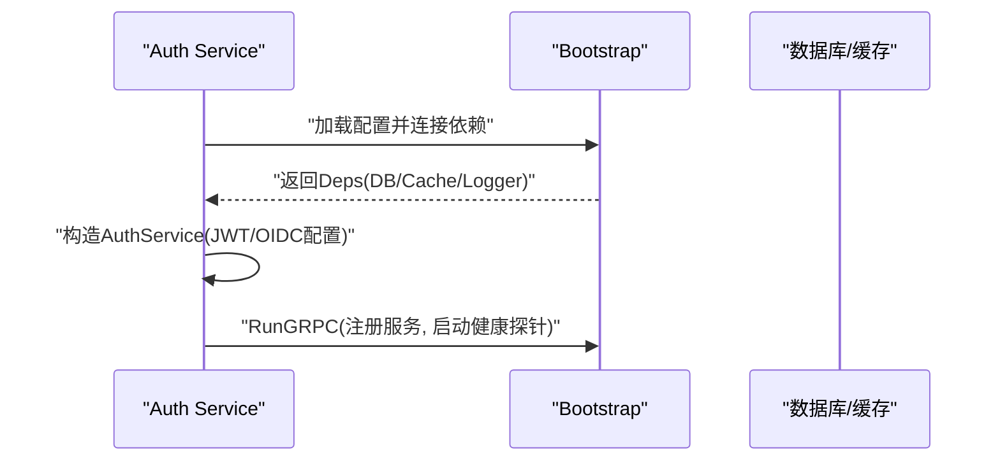

图表来源
- [main.go（auth-service）:9-31](file://repo/services/auth-service/main.go#L9-L31)
- [server.go（bootstrap）:387-445](file://repo/pkg/bootstrap/server.go#L387-L445)

章节来源
- [main.go（auth-service）:9-31](file://repo/services/auth-service/main.go#L9-L31)
- [server.go（bootstrap）:387-445](file://repo/pkg/bootstrap/server.go#L387-L445)

### Task Service（任务服务）
- 职责：管理异步任务与 Outbox 发布，保障长耗时操作的可靠性与可追踪性。
- 启动流程：加载配置 → 连接依赖 → 可选启动 Outbox Publisher → 创建 TaskService → 注册 gRPC 服务。

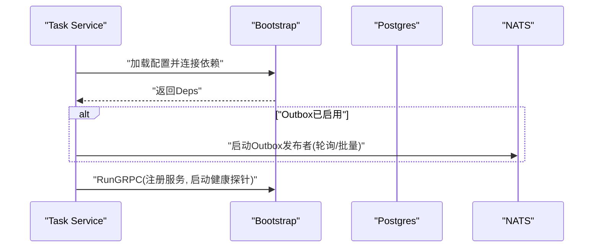

图表来源
- [main.go（task-service）:15-36](file://repo/services/task-service/main.go#L15-L36)
- [server.go（bootstrap）:387-445](file://repo/pkg/bootstrap/server.go#L387-L445)

章节来源
- [main.go（task-service）:15-36](file://repo/services/task-service/main.go#L15-L36)

### Ports/Adapters（端口层与适配器层）
- Ports：定义稳定的产品能力接口，如工作负载生命周期、GPU 库存、对象存储、向量存储、消息总线、配额、可观测性等。
- Adapters：提供默认实现，屏蔽底层组件差异（Kubernetes、MinIO、Milvus、Harbor、NATS、Redis、PostgreSQL 等）。
- 设计原则：所有跨层能力必须经过 ports/adapters；禁止上层直接耦合底层 SDK。

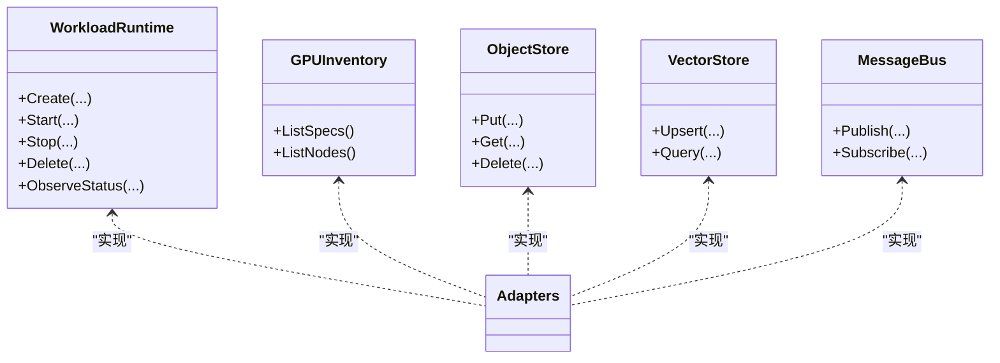

图表来源
- [workload_runtime.go（ports）:8-62](file://repo/pkg/ports/workload_runtime.go#L8-L62)
- [ANI-05-系统架构设计.md:246-279](file://ANI-05-系统架构设计.md#L246-L279)

章节来源
- [workload_runtime.go（ports）:8-62](file://repo/pkg/ports/workload_runtime.go#L8-L62)
- [ANI-05-系统架构设计.md:246-279](file://ANI-05-系统架构设计.md#L246-L279)

### API 契约与 SDK
- Core OpenAPI：定义基础设施资源的 REST 契约，路径前缀为 /api/v1，包含认证、分页、异步任务等规范。
- Services OpenAPI：定义云服务层的 REST 契约，路径前缀为 /api/v1/svc，由 Services 团队维护。
- SDK/文档：基于 OpenAPI 自动生成多语言 SDK 与文档，确保契约一致性。

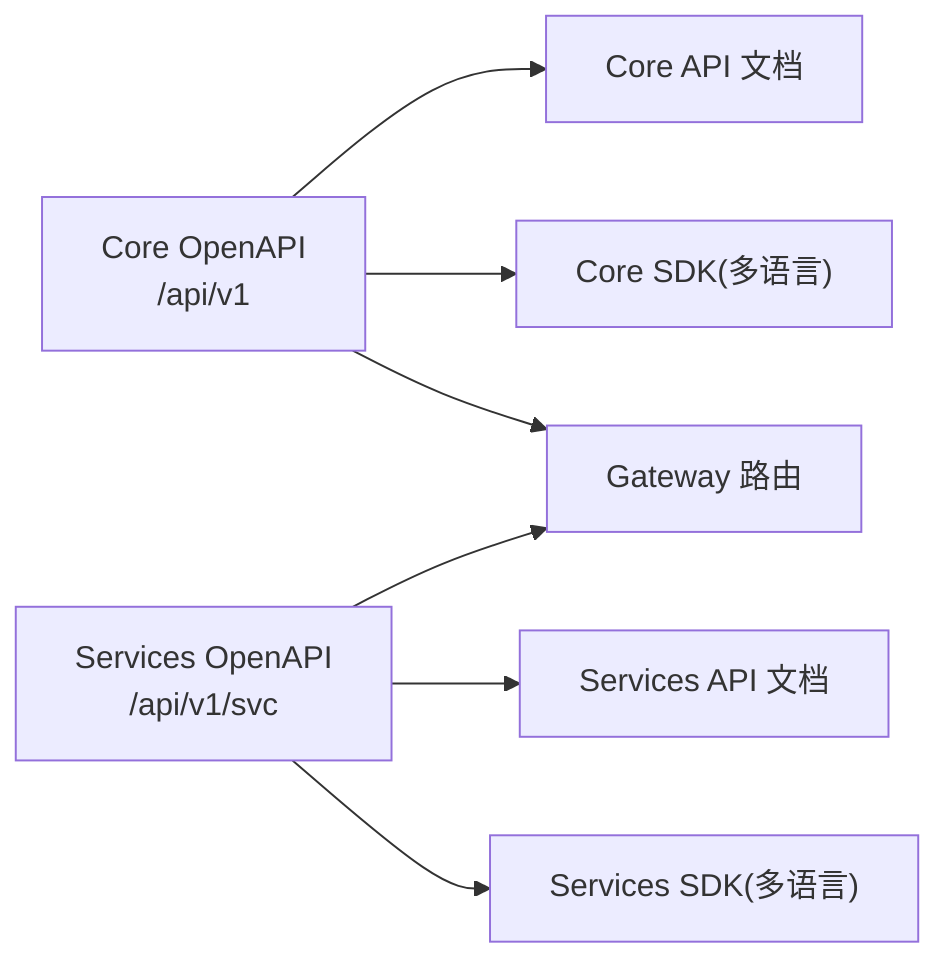

图表来源
- [v1.yaml（Core OpenAPI）:1-40](file://repo/api/openapi/v1.yaml#L1-L40)
- [services_v1.yaml（Services OpenAPI）:1-20](file://repo/api/openapi/services/v1.yaml#L1-L20)

章节来源
- [v1.yaml（Core OpenAPI）:1-40](file://repo/api/openapi/v1.yaml#L1-L40)
- [services_v1.yaml（Services OpenAPI）:1-20](file://repo/api/openapi/services/v1.yaml#L1-L20)

## 依赖关系分析
- Gateway 依赖：各 Provider Runtime（实例、网络、存储、镜像仓库、向量存储、GPU 库存、可观测性）、Redis 共享存储、Kubernetes REST Client、gRPC 客户端（如 KB Service）。
- Auth/Task 服务依赖：数据库、缓存、消息总线；通过 bootstrap 统一装配。
- Ports/Adapters：通过环境配置选择具体实现，保证解耦与可替换性。

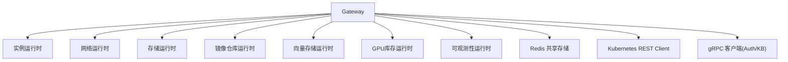

图表来源
- [main.go（ani-gateway）:30-208](file://repo/services/ani-gateway/main.go#L30-L208)

章节来源
- [main.go（ani-gateway）:30-208](file://repo/services/ani-gateway/main.go#L30-L208)

## 性能与可观测性
- 健康探针：服务通过 bootstrap 启动独立的健康探针 HTTP 服务器，便于编排平台探测依赖就绪情况。
- 日志与恢复：gRPC 拦截器统一记录请求日志与异常恢复，提升可观测性与稳定性。
- 异步与重试：Task Service 支持 Outbox 发布与任务重试，保障最终一致性与容错。
- 指标与审计：Gateway 内置审计中间件，Core/Services 可通过可观测性运行时上报指标与事件。

章节来源
- [server.go（bootstrap）:387-445](file://repo/pkg/bootstrap/server.go#L387-L445)
- [main.go（ani-gateway）:167-208](file://repo/services/ani-gateway/main.go#L167-L208)
- [main.go（task-service）:23-36](file://repo/services/task-service/main.go#L23-L36)

## 故障排查指南
- 启动失败：检查环境变量与依赖连接（数据库、NATS、Redis、Provider 配置），参考 bootstrap 的连接与退出逻辑。
- 鉴权失败：确认 JWT/OIDC/API Key 配置是否正确，Gateway 是否成功调用 Auth Service。
- 任务卡住：检查 Task Service 的 Outbox 发布与消费者状态，查看任务状态与错误信息。
- 适配器未配置：ports/errors.go 定义了常见错误语义，如能力未配置、不支持、资源不存在等，用于快速定位问题。

章节来源
- [server.go（bootstrap）:108-150](file://repo/pkg/bootstrap/server.go#L108-L150)
- [errors.go（ports）:5-24](file://repo/pkg/ports/errors.go#L5-L24)

## 结论
ANI 平台采用清晰的微服务分层与适配器模式，通过 OpenAPI 契约与 SDK 固化跨层边界，Gateway 作为统一入口聚合横切能力，Core 专注基础设施控制面，Services 组合能力提供云服务。该架构具备良好的可扩展性、可替换性与生产级可观测性，适合持续演进与多后端接入。

## 附录：分层与适配器模式说明

### 分层架构理念
- API 层：OpenAPI 契约与 Gateway 路由，面向客户端暴露稳定接口。
- 服务层：Core/Services 业务逻辑，通过 gRPC 高效协作。
- 端口层：ports 定义产品能力接口，屏蔽实现细节。
- 适配器层：adapters 提供默认实现，对接底层组件。
- 基础设施层：Kubernetes、数据库、消息总线、对象存储等。

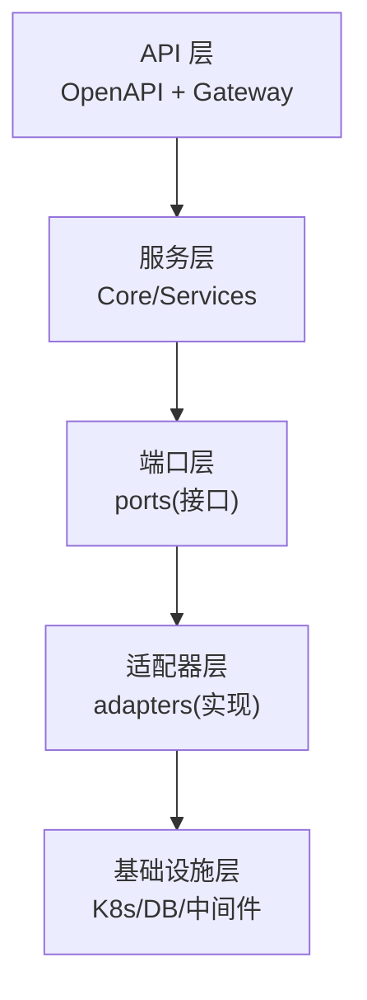

图表来源
- [ANI-05-系统架构设计.md:246-279](file://ANI-05-系统架构设计.md#L246-L279)

### 适配器模式运用
- 通过 ports 抽象能力（如工作负载生命周期、GPU 库存、对象存储、向量存储、消息总线），adapters 提供多种实现（本地/真实组件），运行时根据配置注入。
- 优势：解耦业务与底层实现，支持多后端切换、灰度与回滚，便于测试与仿真。

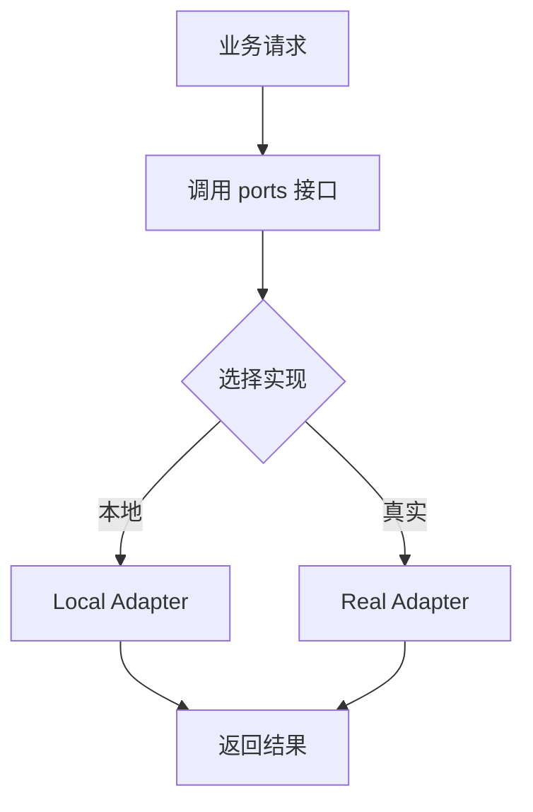

图表来源
- [workload_runtime.go（ports）:8-62](file://repo/pkg/ports/workload_runtime.go#L8-L62)
- [ANI-05-系统架构设计.md:246-279](file://ANI-05-系统架构设计.md#L246-L279)

### 部署架构图
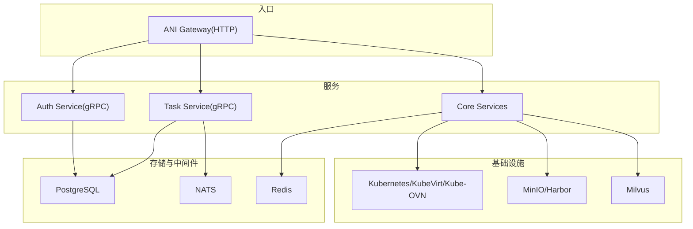

图表来源
- [main.go（ani-gateway）:20-220](file://repo/services/ani-gateway/main.go#L20-L220)
- [server.go（bootstrap）:108-150](file://repo/pkg/bootstrap/server.go#L108-L150)