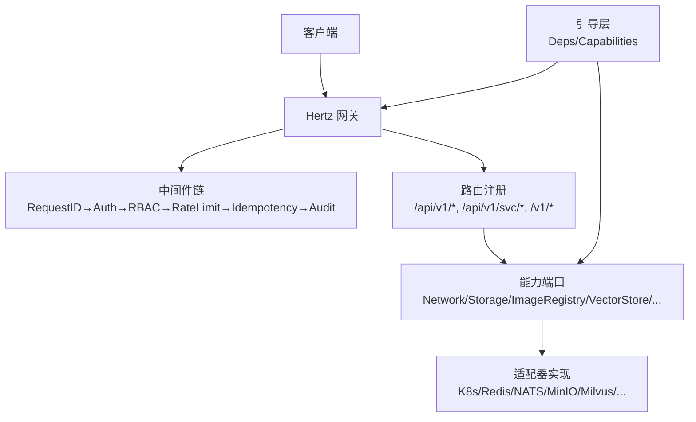
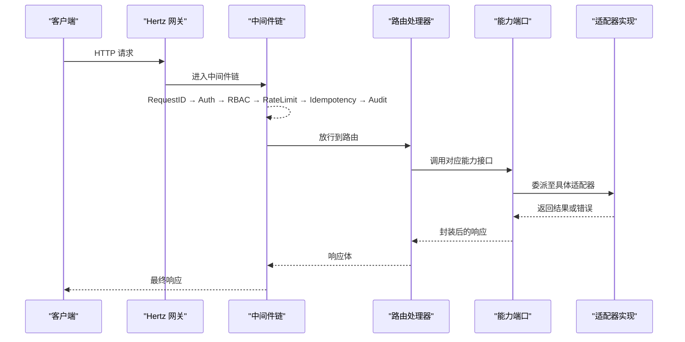
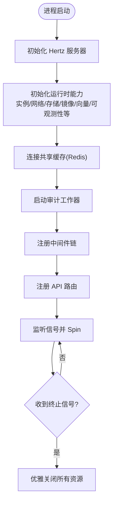
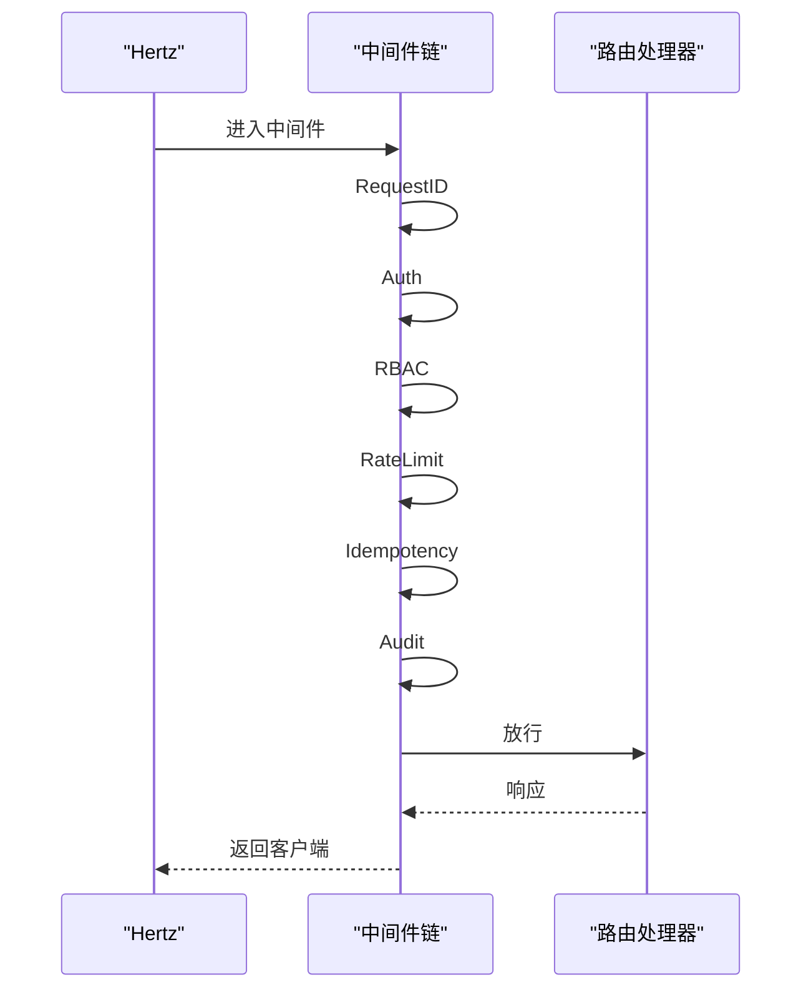
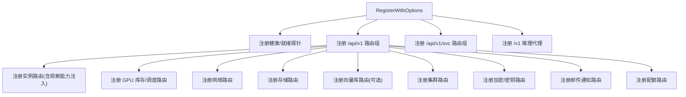
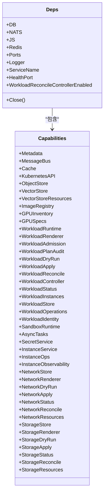
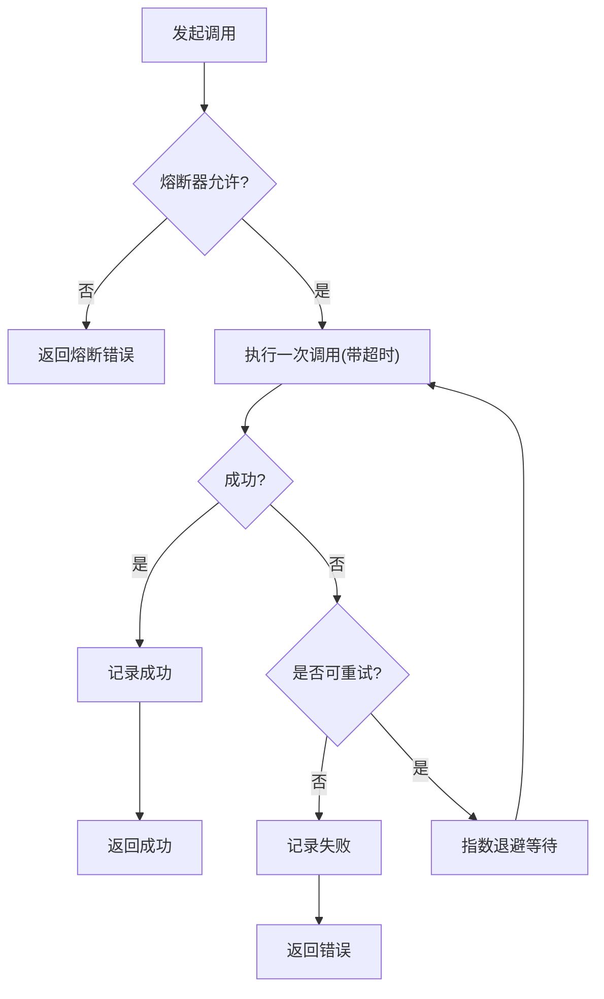
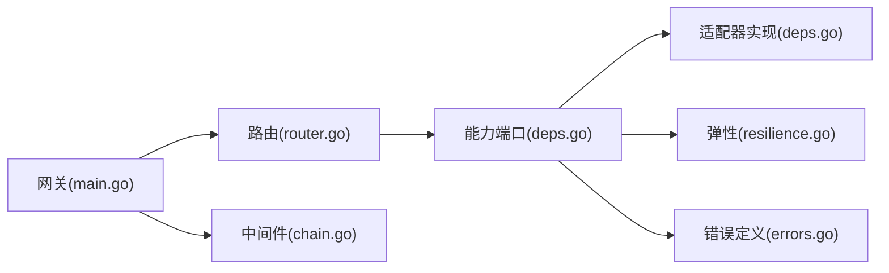

# 组件交互设计

<cite>
**本文引用的文件**
- [services/ani-gateway/main.go](file://repo/services/ani-gateway/main.go)
- [services/ani-gateway/internal/router/router.go](file://repo/services/ani-gateway/internal/router/router.go)
- [services/ani-gateway/internal/middleware/chain.go](file://repo/services/ani-gateway/internal/middleware/chain.go)
- [pkg/bootstrap/deps.go](file://repo/pkg/bootstrap/deps.go)
- [pkg/bootstrap/server.go](file://repo/pkg/bootstrap/server.go)
- [pkg/adapters/resilience/resilience.go](file://repo/pkg/adapters/resilience/resilience.go)
- [pkg/adapters/resilience/degradation.go](file://repo/pkg/adapters/resilience/degradation.go)
- [pkg/ports/errors.go](file://repo/pkg/ports/errors.go)
</cite>

## 目录
1. [简介](#简介)
2. [项目结构](#项目结构)
3. [核心组件](#核心组件)
4. [架构总览](#架构总览)
5. [详细组件分析](#详细组件分析)
6. [依赖关系分析](#依赖关系分析)
7. [性能与可靠性](#性能与可靠性)
8. [故障排查指南](#故障排查指南)
9. [结论](#结论)
10. [附录](#附录)

## 简介
本文件面向 ANI 平台的组件交互设计，聚焦以下目标：
- 描述网关、路由、中间件链、能力适配层（Ports/Adapters）之间的交互模式与通信协议。
- 明确中间件链的执行顺序、请求拦截与响应处理机制。
- 说明依赖注入容器的使用方式、组件生命周期管理与配置传递。
- 展示 API 路由注册过程与请求分发机制。
- 提供组件调用序列图、错误传播机制与熔断降级策略。
- 给出扩展点与插件化设计的实现指南。

## 项目结构
ANI 平台采用“网关 + 路由 + 中间件 + 能力端口/适配器”的分层架构：
- 网关服务入口负责启动 HTTP 服务器、初始化各运行时能力、注册中间件与路由。
- 路由层按资源维度组织 API，将请求分发给对应的能力接口。
- 中间件链统一处理鉴权、权限、限流、幂等、审计等横切关注点。
- 能力端口（Ports）定义稳定契约；适配器（Adapters）实现具体后端（Kubernetes、Redis、NATS、对象存储、向量库等）。
- 引导层（Bootstrap）集中完成依赖连接、能力装配、健康探针与优雅关停。

**图示来源**
- [services/ani-gateway/main.go:20-220](file://repo/services/ani-gateway/main.go#L20-L220)
- [services/ani-gateway/internal/router/router.go:42-102](file://repo/services/ani-gateway/internal/router/router.go#L42-L102)
- [services/ani-gateway/internal/middleware/chain.go:1-22](file://repo/services/ani-gateway/internal/middleware/chain.go#L1-L22)
- [pkg/bootstrap/deps.go:25-87](file://repo/pkg/bootstrap/deps.go#L25-L87)

**章节来源**
- [services/ani-gateway/main.go:20-220](file://repo/services/ani-gateway/main.go#L20-L220)
- [services/ani-gateway/internal/router/router.go:42-102](file://repo/services/ani-gateway/internal/router/router.go#L42-L102)
- [pkg/bootstrap/deps.go:25-87](file://repo/pkg/bootstrap/deps.go#L25-L87)

## 核心组件
- 网关主进程：创建 Hertz 服务器，初始化各运行时能力（实例、网络、存储、镜像仓库、向量库、可观测性等），连接共享缓存（Redis），启动审计工作器，注册中间件与路由，监听信号并优雅关闭。
- 路由注册器：按资源分组注册 API，支持健康探测、品牌资源、任务、认证、配额、GPU 相关、网络、存储、向量库、集群、加密、密钥、邮件通知、模型/推理代理、知识库等。
- 中间件链：统一在网关层执行，顺序为 RequestID → Auth → RBAC → RateLimit → Idempotency → Audit。
- 引导层（Bootstrap）：集中连接数据库、NATS、Redis，构建 Capabilities 能力集，提供 gRPC 运行与健康探针能力。
- 能力端口（Ports）：定义跨服务的稳定接口（如 NetworkService、StorageService、ImageRegistry、VectorStoreService 等）。
- 适配器（Adapters）：基于配置选择具体实现（本地、Kubernetes REST、MinIO、Milvus、Prometheus 等）。
- 弹性与降级：提供重试、退避、熔断与依赖强弱判定工具。

**章节来源**
- [services/ani-gateway/main.go:20-220](file://repo/services/ani-gateway/main.go#L20-L220)
- [services/ani-gateway/internal/router/router.go:42-102](file://repo/services/ani-gateway/internal/router/router.go#L42-L102)
- [services/ani-gateway/internal/middleware/chain.go:1-22](file://repo/services/ani-gateway/internal/middleware/chain.go#L1-L22)
- [pkg/bootstrap/deps.go:25-87](file://repo/pkg/bootstrap/deps.go#L25-L87)
- [pkg/adapters/resilience/resilience.go:13-22](file://repo/pkg/adapters/resilience/resilience.go#L13-L22)
- [pkg/adapters/resilience/degradation.go:3-21](file://repo/pkg/adapters/resilience/degradation.go#L3-L21)

## 架构总览
下图展示了从请求进入到能力调用的整体流程，以及引导层对能力的装配。

**图示来源**
- [services/ani-gateway/main.go:20-220](file://repo/services/ani-gateway/main.go#L20-L220)
- [services/ani-gateway/internal/middleware/chain.go:1-22](file://repo/services/ani-gateway/internal/middleware/chain.go#L1-L22)
- [services/ani-gateway/internal/router/router.go:42-102](file://repo/services/ani-gateway/internal/router/router.go#L42-L102)
- [pkg/bootstrap/deps.go:25-87](file://repo/pkg/bootstrap/deps.go#L25-L87)

## 详细组件分析

### 网关主进程与能力装配
- 启动 Hertz 服务器，设置监听地址与退出等待时间。
- 初始化各类运行时能力：K8s 集群代理、加密服务、密钥服务、GPU 库存、Kubernetes REST 客户端、网络服务、存储服务、镜像仓库、实例运行时、GPU 调度队列与实例存储、向量库、实例可观测性、共享 Redis 缓存、可观测性服务、KB 服务 gRPC 客户端、SSE 配置、异步任务存储、配额管理服务等。
- 启动审计工作器，注册中间件与路由，监听系统信号并优雅关闭。

**图示来源**
- [services/ani-gateway/main.go:20-220](file://repo/services/ani-gateway/main.go#L20-L220)

**章节来源**
- [services/ani-gateway/main.go:20-220](file://repo/services/ani-gateway/main.go#L20-L220)

### 中间件链执行顺序与职责
- 执行顺序固定：RequestID → Auth → RBAC → RateLimit → Idempotency → Audit。
- 职责划分：
  - RequestID：为请求生成唯一标识，贯穿日志链路。
  - Auth：身份认证，校验令牌/凭据。
  - RBAC：基于角色的访问控制，校验操作权限。
  - RateLimit：限流保护，防止过载。
  - Idempotency：幂等控制，避免重复提交。
  - Audit：审计记录，留存关键操作轨迹。

**图示来源**
- [services/ani-gateway/internal/middleware/chain.go:1-22](file://repo/services/ani-gateway/internal/middleware/chain.go#L1-L22)

**章节来源**
- [services/ani-gateway/internal/middleware/chain.go:1-22](file://repo/services/ani-gateway/internal/middleware/chain.go#L1-L22)

### API 路由注册与请求分发
- 路由组：
  - /api/v1：核心资源（实例、网络、存储、镜像仓库、GPU、向量库、集群、加密、密钥、邮件通知、配额等）。
  - /api/v1/svc：过渡期服务路由（模型、推理服务、知识库、GPU 容器、沙箱、租户等）。
  - /v1：OpenAI 兼容推理代理端点。
- 注册时注入能力：将已初始化的服务实例通过选项传入路由注册函数，确保路由处理器可直接调用能力接口。
- 特殊注入：实例观察能力需要实例查找器以解析命名空间/Pod 映射；向量库服务可选注入，未配置时仍保持功能可用。

**图示来源**
- [services/ani-gateway/internal/router/router.go:42-102](file://repo/services/ani-gateway/internal/router/router.go#L42-L102)

**章节来源**
- [services/ani-gateway/internal/router/router.go:42-102](file://repo/services/ani-gateway/internal/router/router.go#L42-L102)

### 依赖注入容器与组件生命周期
- 引导层（Bootstrap）：
  - MustConnect：连接数据库、NATS、Redis，构建 Capabilities 能力集，返回 Deps 供服务使用。
  - RunGRPC：启动 gRPC 服务器，挂载日志与恢复拦截器，暴露健康探针，优雅关停。
  - RunHealthProbe：仅启动健康探针 HTTP 服务。
  - RunWorkloadReconcileWorker：启动工作负载再均衡控制器工作进程。
- 能力装配（Capabilities）：
  - 根据配置选择不同适配器（本地/Kubernetes/MinIO/Milvus/Prometheus/Harbor 等）。
  - 支持共享服务注入（网络、存储、镜像仓库），使 Gateway 与 Core 服务复用同一适配器实例。
  - 组装实例编排、操作、状态读取、审计、干跑、应用、再均衡控制器等。
- 生命周期：
  - 启动阶段：连接外部依赖，装配能力，启动后台控制器。
  - 运行阶段：处理请求，调用能力接口。
  - 关闭阶段：优雅停止 gRPC/HTTP 服务，释放连接。

**图示来源**
- [pkg/bootstrap/deps.go:25-87](file://repo/pkg/bootstrap/deps.go#L25-L87)
- [pkg/bootstrap/deps.go:89-307](file://repo/pkg/bootstrap/deps.go#L89-L307)
- [pkg/bootstrap/server.go:108-150](file://repo/pkg/bootstrap/server.go#L108-L150)
- [pkg/bootstrap/server.go:387-445](file://repo/pkg/bootstrap/server.go#L387-L445)

**章节来源**
- [pkg/bootstrap/deps.go:25-87](file://repo/pkg/bootstrap/deps.go#L25-L87)
- [pkg/bootstrap/deps.go:89-307](file://repo/pkg/bootstrap/deps.go#L89-L307)
- [pkg/bootstrap/server.go:108-150](file://repo/pkg/bootstrap/server.go#L108-L150)
- [pkg/bootstrap/server.go:387-445](file://repo/pkg/bootstrap/server.go#L387-L445)

### 错误传播与熔断降级
- 错误类型：
  - 能力端口错误：未配置、不支持、未找到、冲突、无效、前置条件失败、负载过大、凭证无效、租户不存在、不可用、配额相关错误等。
  - 状态错误：封装系统、方法、路径、HTTP 状态码与响应体，便于上层识别与分类。
- 重试与退避：
  - 可重试判断：上下文取消不重试；超时、网络错误、临时错误、HTTP 429/5xx 可重试。
  - 指数退避：BaseBackoff 起始，MaxBackoff 上限，受上下文控制。
- 熔断器：
  - 基于名称的熔断器实例，统计请求数与失败率，达到阈值后打开，冷却期后可半开试探。
- 依赖强弱：
  - 对象存储、向量库标记为弱依赖，其他为强依赖，便于在不可用时进行降级处理。

**图示来源**
- [pkg/adapters/resilience/resilience.go:56-133](file://repo/pkg/adapters/resilience/resilience.go#L56-L133)
- [pkg/adapters/resilience/resilience.go:166-223](file://repo/pkg/adapters/resilience/resilience.go#L166-L223)
- [pkg/adapters/resilience/degradation.go:3-21](file://repo/pkg/adapters/resilience/degradation.go#L3-L21)
- [pkg/ports/errors.go:5-24](file://repo/pkg/ports/errors.go#L5-L24)

**章节来源**
- [pkg/adapters/resilience/resilience.go:56-133](file://repo/pkg/adapters/resilience/resilience.go#L56-L133)
- [pkg/adapters/resilience/resilience.go:166-223](file://repo/pkg/adapters/resilience/resilience.go#L166-L223)
- [pkg/adapters/resilience/degradation.go:3-21](file://repo/pkg/adapters/resilience/degradation.go#L3-L21)
- [pkg/ports/errors.go:5-24](file://repo/pkg/ports/errors.go#L5-L24)

### 组件扩展点与插件化设计
- 能力端口（Ports）作为稳定契约，新增能力只需实现对应接口并在引导层装配。
- 适配器选择：通过配置项切换具体实现（如 WorkloadProvider、NetworkProvider、StorageProvider、ObjectStoreProvider、VectorStoreProvider、RegistryProviderMode、InstanceObservabilityProvider 等）。
- 共享服务注入：Gateway 可通过 SharedNetworkService、SharedStorageService、SharedImageRegistry 复用 Core 服务中的适配器实例，减少重复配置与连接。
- 路由扩展：在路由注册器中新增资源组与处理器，并通过 RegisterOptions 注入所需能力。
- 中间件扩展：在中间件注册处按顺序插入新中间件，注意与现有横切逻辑的兼容性。
- 弹性策略：通过 Policy 配置 Timeout、MaxAttempts、Backoff、熔断参数，适配不同依赖的稳定性要求。

**章节来源**
- [pkg/bootstrap/deps.go:89-307](file://repo/pkg/bootstrap/deps.go#L89-L307)
- [pkg/bootstrap/server.go:23-106](file://repo/pkg/bootstrap/server.go#L23-L106)
- [services/ani-gateway/internal/router/router.go:13-40](file://repo/services/ani-gateway/internal/router/router.go#L13-L40)
- [services/ani-gateway/internal/middleware/chain.go:1-22](file://repo/services/ani-gateway/internal/middleware/chain.go#L1-L22)
- [pkg/adapters/resilience/resilience.go:13-22](file://repo/pkg/adapters/resilience/resilience.go#L13-L22)

## 依赖关系分析
- 网关依赖路由与中间件，路由依赖能力端口，能力端口依赖适配器实现。
- 引导层集中装配能力，向网关与路由提供统一的能力视图。
- 弹性模块被能力调用方使用，提供重试、熔断与降级策略。
- 错误类型集中在端口层，便于上层统一处理与上报。

**图示来源**
- [services/ani-gateway/main.go:20-220](file://repo/services/ani-gateway/main.go#L20-L220)
- [services/ani-gateway/internal/router/router.go:42-102](file://repo/services/ani-gateway/internal/router/router.go#L42-L102)
- [services/ani-gateway/internal/middleware/chain.go:1-22](file://repo/services/ani-gateway/internal/middleware/chain.go#L1-L22)
- [pkg/bootstrap/deps.go:25-87](file://repo/pkg/bootstrap/deps.go#L25-L87)
- [pkg/adapters/resilience/resilience.go:13-22](file://repo/pkg/adapters/resilience/resilience.go#L13-L22)
- [pkg/ports/errors.go:5-24](file://repo/pkg/ports/errors.go#L5-L24)

**章节来源**
- [services/ani-gateway/main.go:20-220](file://repo/services/ani-gateway/main.go#L20-L220)
- [services/ani-gateway/internal/router/router.go:42-102](file://repo/services/ani-gateway/internal/router/router.go#L42-L102)
- [pkg/bootstrap/deps.go:25-87](file://repo/pkg/bootstrap/deps.go#L25-L87)

## 性能与可靠性
- 中间件链顺序保证高优先级横切逻辑优先执行（鉴权、权限、限流、幂等、审计），降低无效请求进入业务层的开销。
- 路由注册按资源分组，便于独立扩展与维护，减少耦合。
- 引导层集中连接外部依赖，支持健康探针与优雅关停，提升服务可用性。
- 弹性策略提供超时、重试、退避与熔断，增强对外部依赖不稳定性的容忍度。
- 依赖强弱区分，弱依赖不可用时可进行降级，保障核心功能可用。

[本节为通用指导，不直接分析具体文件]

## 故障排查指南
- 启动失败：检查数据库、NATS、Redis 连接配置；确认能力适配器配置正确（如 Provider 模式、Endpoint、Token 等）。
- 路由不可用：确认路由注册是否成功，检查 RegisterWithOptions 注入的能力是否为 nil；部分服务（如向量库、KB 服务）可选配置，未配置时应返回降级响应而非启动失败。
- 鉴权/权限问题：检查中间件链是否生效，确认 Auth/RBAC 配置与令牌有效性。
- 限流/幂等异常：检查中间件 Store 配置是否正确，确认限流策略与幂等键生成规则。
- 熔断触发：查看熔断器配置（FailureRatio、MinRequests、CooldownPeriod），评估下游依赖稳定性；必要时调整策略或启用降级。
- 错误定位：利用 StatusError 携带的系统、方法、路径、状态码与响应体信息快速定位问题；结合审计日志追踪关键操作。

**章节来源**
- [pkg/bootstrap/server.go:108-150](file://repo/pkg/bootstrap/server.go#L108-L150)
- [services/ani-gateway/internal/router/router.go:42-102](file://repo/services/ani-gateway/internal/router/router.go#L42-L102)
- [pkg/adapters/resilience/resilience.go:34-54](file://repo/pkg/adapters/resilience/resilience.go#L34-L54)
- [pkg/ports/errors.go:5-24](file://repo/pkg/ports/errors.go#L5-L24)

## 结论
ANI 平台通过网关、路由、中间件、能力端口与适配器的分层设计，实现了清晰的组件边界与稳定的通信契约。引导层集中管理依赖与生命周期，弹性模块提供可靠的故障恢复与降级策略。扩展点明确，便于按需接入新能力与服务。建议在新增功能时遵循既有模式：定义端口契约、实现适配器、在引导层装配、在路由中注册、在中间件中补充横切逻辑，并使用弹性策略保障稳定性。

[本节为总结性内容，不直接分析具体文件]

## 附录
- 配置与环境变量：通过环境变量覆盖默认配置（如 Redis、Kubernetes、对象存储、向量库、可观测性等），便于多环境部署。
- 健康探针：服务暴露健康与就绪检查，便于编排平台进行存活与就绪探测。
- 优雅关停：服务在收到终止信号后，等待进行中请求完成，再安全释放资源。

[本节为补充说明，不直接分析具体文件]