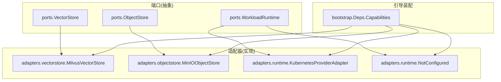
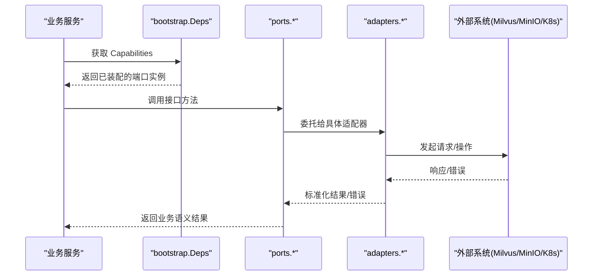
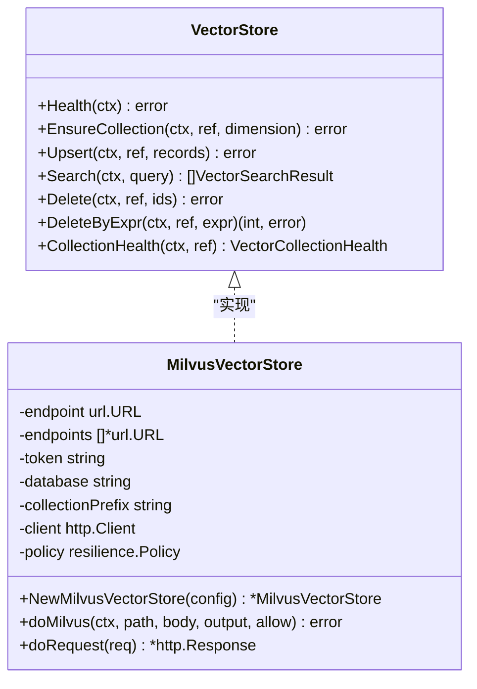
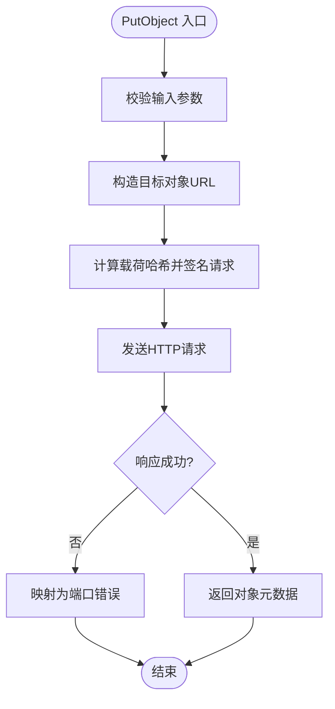
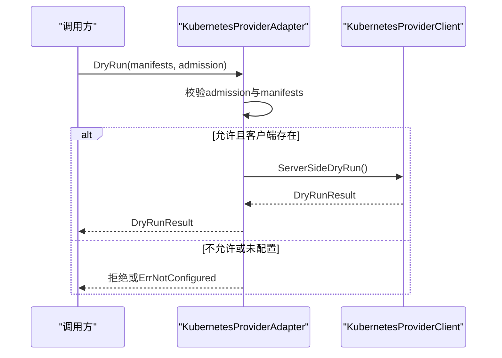
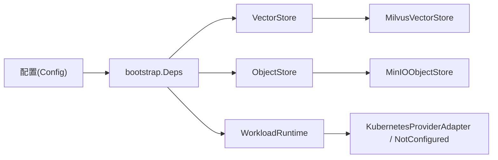

# 适配器模式实现

<cite>
**本文引用的文件**
- [repo/pkg/ports/vector_store.go](file://repo/pkg/ports/vector_store.go)
- [repo/pkg/ports/object_store.go](file://repo/pkg/ports/object_store.go)
- [repo/pkg/ports/workload_runtime.go](file://repo/pkg/ports/workload_runtime.go)
- [repo/pkg/adapters/vectorstore/milvus_store.go](file://repo/pkg/adapters/vectorstore/milvus_store.go)
- [repo/pkg/adapters/objectstore/minio_store.go](file://repo/pkg/adapters/objectstore/minio_store.go)
- [repo/pkg/adapters/runtime/kubernetes_provider_adapter.go](file://repo/pkg/adapters/runtime/kubernetes_provider_adapter.go)
- [repo/pkg/adapters/runtime/not_configured.go](file://repo/pkg/adapters/runtime/not_configured.go)
- [repo/pkg/bootstrap/deps.go](file://repo/pkg/bootstrap/deps.go)
</cite>

## 目录
1. [简介](#简介)
2. [项目结构](#项目结构)
3. [核心组件](#核心组件)
4. [架构总览](#架构总览)
5. [详细组件分析](#详细组件分析)
6. [依赖关系分析](#依赖关系分析)
7. [性能与可靠性](#性能与可靠性)
8. [故障排查指南](#故障排查指南)
9. [结论](#结论)
10. [附录：如何添加新后端](#附录如何添加新后端)

## 简介
本仓库采用“端口（Ports）+ 适配器（Adapters）”的适配器模式，将业务服务与具体后端解耦。端口定义抽象接口与领域模型，适配器提供具体后端实现（如 Milvus、MinIO、Kubernetes），并通过统一的引导装配（bootstrap）根据配置选择并注入运行时实例。该设计支持：
- 存储适配器：对象存储（Object Store）、向量存储（Vector Store）
- 运行时适配器：工作负载生命周期执行、渲染、准入、状态观察等
- 可扩展性：新增后端只需实现对应端口并在引导处注册
- 健壮性：内置重试、超时、错误分类与“未配置”占位实现

## 项目结构
围绕适配器模式的关键目录与职责：
- ports：定义抽象接口与领域类型（如 VectorStore、ObjectStore、WorkloadRuntime 等）
- adapters：按能力域组织的具体实现（vectorstore、objectstore、runtime 等）
- bootstrap：集中装配 Capabilities，依据配置选择具体适配器并组装为服务可用依赖

图表来源
- [repo/pkg/ports/vector_store.go:157-179](file://repo/pkg/ports/vector_store.go#L157-L179)
- [repo/pkg/ports/object_store.go:47-56](file://repo/pkg/ports/object_store.go#L47-L56)
- [repo/pkg/ports/workload_runtime.go:775-786](file://repo/pkg/ports/workload_runtime.go#L775-L786)
- [repo/pkg/adapters/vectorstore/milvus_store.go:46-67](file://repo/pkg/adapters/vectorstore/milvus_store.go#L46-L67)
- [repo/pkg/adapters/objectstore/minio_store.go:60-105](file://repo/pkg/adapters/objectstore/minio_store.go#L60-L105)
- [repo/pkg/adapters/runtime/kubernetes_provider_adapter.go:17-48](file://repo/pkg/adapters/runtime/kubernetes_provider_adapter.go#L17-L48)
- [repo/pkg/adapters/runtime/not_configured.go:9-33](file://repo/pkg/adapters/runtime/not_configured.go#L9-L33)
- [repo/pkg/bootstrap/deps.go:89-307](file://repo/pkg/bootstrap/deps.go#L89-L307)

章节来源
- [repo/pkg/bootstrap/deps.go:89-307](file://repo/pkg/bootstrap/deps.go#L89-L307)

## 核心组件
- 向量存储端口与实现
  - 端口：VectorStore、VectorStoreService、VectorStoreResourceStore
  - 实现：Milvus 适配器（HTTP 调用、多端点、重试、错误映射）
- 对象存储端口与实现
  - 端口：ObjectStore（含桶类、元数据、签名 URL）
  - 实现：MinIO 适配器（S3 兼容签名、多端点、重试、健康检查）
- 运行时端口与实现
  - 端口：WorkloadRuntime、WorkloadRenderer、WorkloadAdmission、WorkloadProviderDryRun/Apply/StatusReader
  - 实现：Kubernetes Provider Adapter（dry-run/apply/observe 统一入口）、NotConfigured（未启用时的占位）

章节来源
- [repo/pkg/ports/vector_store.go:157-190](file://repo/pkg/ports/vector_store.go#L157-L190)
- [repo/pkg/ports/object_store.go:47-56](file://repo/pkg/ports/object_store.go#L47-L56)
- [repo/pkg/ports/workload_runtime.go:775-798](file://repo/pkg/ports/workload_runtime.go#L775-L798)
- [repo/pkg/adapters/vectorstore/milvus_store.go:46-67](file://repo/pkg/adapters/vectorstore/milvus_store.go#L46-L67)
- [repo/pkg/adapters/objectstore/minio_store.go:60-105](file://repo/pkg/adapters/objectstore/minio_store.go#L60-L105)
- [repo/pkg/adapters/runtime/kubernetes_provider_adapter.go:17-48](file://repo/pkg/adapters/runtime/kubernetes_provider_adapter.go#L17-L48)
- [repo/pkg/adapters/runtime/not_configured.go:9-33](file://repo/pkg/adapters/runtime/not_configured.go#L9-L33)

## 架构总览
适配器模式在系统中的位置：
- 上层服务通过 bootstrap.Deps.Capabilities 获取已装配的端口实例
- bootstrap 根据配置选择具体适配器并注入
- 适配器内部封装外部系统细节（HTTP、签名、重试、错误转换）

图表来源
- [repo/pkg/bootstrap/deps.go:89-307](file://repo/pkg/bootstrap/deps.go#L89-L307)
- [repo/pkg/ports/vector_store.go:157-179](file://repo/pkg/ports/vector_store.go#L157-L179)
- [repo/pkg/ports/object_store.go:47-56](file://repo/pkg/ports/object_store.go#L47-L56)
- [repo/pkg/ports/workload_runtime.go:775-798](file://repo/pkg/ports/workload_runtime.go#L775-L798)
- [repo/pkg/adapters/vectorstore/milvus_store.go:180-256](file://repo/pkg/adapters/vectorstore/milvus_store.go#L180-L256)
- [repo/pkg/adapters/objectstore/minio_store.go:333-366](file://repo/pkg/adapters/objectstore/minio_store.go#L333-L366)
- [repo/pkg/adapters/runtime/kubernetes_provider_adapter.go:50-143](file://repo/pkg/adapters/runtime/kubernetes_provider_adapter.go#L50-L143)

## 详细组件分析

### 向量存储适配器（Milvus）
- 职责：实现 VectorStore 接口，提供集合管理、上载、搜索、删除与健康检查
- 关键特性：
  - 多端点支持与可重试策略（基于 resilience 包）
  - 统一错误映射到端口错误类型（NotFound/Invalid/Unavailable 等）
  - 集合名安全化与数据库前缀隔离
  - 搜索过滤表达式构建与结果解析

图表来源
- [repo/pkg/ports/vector_store.go:157-179](file://repo/pkg/ports/vector_store.go#L157-L179)
- [repo/pkg/adapters/vectorstore/milvus_store.go:26-67](file://repo/pkg/adapters/vectorstore/milvus_store.go#L26-L67)
- [repo/pkg/adapters/vectorstore/milvus_store.go:180-256](file://repo/pkg/adapters/vectorstore/milvus_store.go#L180-L256)

章节来源
- [repo/pkg/adapters/vectorstore/milvus_store.go:46-67](file://repo/pkg/adapters/vectorstore/milvus_store.go#L46-L67)
- [repo/pkg/adapters/vectorstore/milvus_store.go:180-256](file://repo/pkg/adapters/vectorstore/milvus_store.go#L180-L256)
- [repo/pkg/adapters/vectorstore/milvus_store.go:362-400](file://repo/pkg/adapters/vectorstore/milvus_store.go#L362-L400)

### 对象存储适配器（MinIO）
- 职责：实现 ObjectStore 接口，提供桶管理、对象读写、统计、签名上传/下载 URL
- 关键特性：
  - 遵循 S3 签名 v4，支持公共端点生成直传/直下链接
  - 多端点与可重试策略，统一错误映射
  - 桶名校验与安全路径构造

图表来源
- [repo/pkg/adapters/objectstore/minio_store.go:163-198](file://repo/pkg/adapters/objectstore/minio_store.go#L163-L198)
- [repo/pkg/adapters/objectstore/minio_store.go:333-366](file://repo/pkg/adapters/objectstore/minio_store.go#L333-L366)
- [repo/pkg/adapters/objectstore/minio_store.go:566-581](file://repo/pkg/adapters/objectstore/minio_store.go#L566-L581)

章节来源
- [repo/pkg/adapters/objectstore/minio_store.go:60-105](file://repo/pkg/adapters/objectstore/minio_store.go#L60-L105)
- [repo/pkg/adapters/objectstore/minio_store.go:163-198](file://repo/pkg/adapters/objectstore/minio_store.go#L163-L198)
- [repo/pkg/adapters/objectstore/minio_store.go:333-366](file://repo/pkg/adapters/objectstore/minio_store.go#L333-L366)
- [repo/pkg/adapters/objectstore/minio_store.go:566-581](file://repo/pkg/adapters/objectstore/minio_store.go#L566-L581)

### 运行时适配器（Kubernetes Provider）
- 职责：统一 WorkloadProviderDryRun/Apply/StatusReader 三合一适配器，负责干跑、应用与状态观察
- 关键特性：
  - 可选启用 apply 开关，避免误写
  - 对 manifests 进行批量校验与提供者一致性检查
  - 对 observe 结果做身份与资源引用完整性校验
  - 未配置时返回 NotConfigured 占位实现

图表来源
- [repo/pkg/adapters/runtime/kubernetes_provider_adapter.go:50-75](file://repo/pkg/adapters/runtime/kubernetes_provider_adapter.go#L50-L75)
- [repo/pkg/adapters/runtime/kubernetes_provider_adapter.go:146-164](file://repo/pkg/adapters/runtime/kubernetes_provider_adapter.go#L146-L164)

章节来源
- [repo/pkg/adapters/runtime/kubernetes_provider_adapter.go:17-48](file://repo/pkg/adapters/runtime/kubernetes_provider_adapter.go#L17-L48)
- [repo/pkg/adapters/runtime/kubernetes_provider_adapter.go:50-143](file://repo/pkg/adapters/runtime/kubernetes_provider_adapter.go#L50-L143)
- [repo/pkg/adapters/runtime/not_configured.go:9-33](file://repo/pkg/adapters/runtime/not_configured.go#L9-L33)

## 依赖关系分析
- bootstrap 作为装配中心，根据配置项选择适配器：
  - 向量存储：milvus -> vectorstore.NewMilvusVectorStore
  - 对象存储：minio -> objectstore.NewMinIOObjectStore
  - 工作负载运行：local/kubernetes_rest -> runtime 适配器
- 各适配器均依赖 resilience 策略进行超时与重试
- 错误统一映射到 ports 的错误类型，便于上层处理

图表来源
- [repo/pkg/bootstrap/deps.go:380-416](file://repo/pkg/bootstrap/deps.go#L380-L416)
- [repo/pkg/bootstrap/deps.go:449-469](file://repo/pkg/bootstrap/deps.go#L449-L469)
- [repo/pkg/adapters/vectorstore/milvus_store.go:46-67](file://repo/pkg/adapters/vectorstore/milvus_store.go#L46-L67)
- [repo/pkg/adapters/objectstore/minio_store.go:60-105](file://repo/pkg/adapters/objectstore/minio_store.go#L60-L105)
- [repo/pkg/adapters/runtime/kubernetes_provider_adapter.go:17-48](file://repo/pkg/adapters/runtime/kubernetes_provider_adapter.go#L17-L48)
- [repo/pkg/adapters/runtime/not_configured.go:9-33](file://repo/pkg/adapters/runtime/not_configured.go#L9-L33)

章节来源
- [repo/pkg/bootstrap/deps.go:89-307](file://repo/pkg/bootstrap/deps.go#L89-L307)
- [repo/pkg/bootstrap/deps.go:380-416](file://repo/pkg/bootstrap/deps.go#L380-L416)
- [repo/pkg/bootstrap/deps.go:449-469](file://repo/pkg/bootstrap/deps.go#L449-L469)

## 性能与可靠性
- 多端点与重试
  - Milvus/MinIO 适配器均维护端点列表，遇到可重试错误或特定 HTTP 状态码时自动切换下一个端点并重试
  - 使用 resilience 策略统一控制超时与重试次数
- 错误分类
  - 将下游错误映射为 NotFound/Invalid/FailedPrecondition/Unavailable 等，便于上层区分处理
- 健康检查
  - 向量存储与对象存储均暴露 Health 方法，用于探针与就绪判断
- 资源限制
  - 合理设置 RequestTimeout，避免长尾请求阻塞
  - 对大对象上传/下载建议分片或流式处理（由调用方配合）

[本节为通用指导，不直接分析具体文件]

## 故障排查指南
- 常见错误定位
  - 未配置：NotConfigured 实现会返回 ErrNotConfigured，检查配置是否启用对应 provider
  - 无效参数：ErrInvalid 通常来自参数校验失败（如维度<=0、缺少必要字段）
  - 未找到：ErrNotFound 表示资源不存在（集合/对象/实例）
  - 前置条件失败：ErrFailedPrecondition 多为鉴权或权限不足
  - 不可用：ErrUnavailable 多为后端暂时不可用，可触发重试
- 排查步骤
  - 确认 bootstrap 装配日志中选择的 provider 是否符合预期
  - 检查适配器配置的 endpoint、认证信息、区域、前缀等
  - 查看健康检查接口返回与错误信息
  - 针对干跑/应用流程，先验证 dry-run 结果再执行 apply

章节来源
- [repo/pkg/adapters/runtime/not_configured.go:9-33](file://repo/pkg/adapters/runtime/not_configured.go#L9-L33)
- [repo/pkg/adapters/vectorstore/milvus_store.go:362-400](file://repo/pkg/adapters/vectorstore/milvus_store.go#L362-L400)
- [repo/pkg/adapters/objectstore/minio_store.go:566-581](file://repo/pkg/adapters/objectstore/minio_store.go#L566-L581)

## 结论
本项目通过清晰的端口定义与适配器实现，实现了对外部系统的强解耦与高内聚。bootstrap 集中装配使得不同环境可通过配置灵活切换后端。Milvus 与 MinIO 适配器具备多端点、重试与错误映射能力；Kubernetes Provider Adapter 统一了干跑、应用与状态观察流程，并提供未配置占位实现。整体架构具备良好的扩展性与可维护性。

[本节为总结性内容，不直接分析具体文件]

## 附录：如何添加新后端
以新增一个“向量存储后端 X”为例：

1. 定义或复用端口
   - 若已有 VectorStore 接口，则无需修改；否则在 ports 中定义新接口与类型
   - 参考：[repo/pkg/ports/vector_store.go:157-179](file://repo/pkg/ports/vector_store.go#L157-L179)

2. 实现适配器
   - 在 adapters/vectorstore 下新建 x_store.go，实现 VectorStore 接口
   - 建议包含：多端点、重试、健康检查、错误映射
   - 参考：[repo/pkg/adapters/vectorstore/milvus_store.go:46-67](file://repo/pkg/adapters/vectorstore/milvus_store.go#L46-L67)

3. 在引导中注册
   - 在 bootstrap/deps.go 的 vectorStoreAdapter 中添加分支，读取配置并返回新适配器
   - 参考：[repo/pkg/bootstrap/deps.go:401-416](file://repo/pkg/bootstrap/deps.go#L401-L416)

4. 配置项
   - 在 Config 中增加必要字段（如 Endpoint、Token、Database 等）
   - 在服务启动时传入配置，确保 NewCapabilitiesWithConfig 能正确装配

5. 测试与验证
   - 编写单元测试覆盖健康检查、CRUD、错误映射
   - 集成测试验证端到端流程（创建集合、插入、搜索、删除）

类似地，新增对象存储后端或运行时后端：
- 对象存储：在 adapters/objectstore 实现 ObjectStore，并在 bootstrap 的 objectStoreAdapter 注册
  - 参考：[repo/pkg/adapters/objectstore/minio_store.go:60-105](file://repo/pkg/adapters/objectstore/minio_store.go#L60-L105)
  - 参考：[repo/pkg/bootstrap/deps.go:380-399](file://repo/pkg/bootstrap/deps.go#L380-L399)
- 运行时：在 adapters/runtime 实现 WorkloadProviderDryRun/Apply/StatusReader，并在 bootstrap 的 workloadProviderAdapters 注册
  - 参考：[repo/pkg/adapters/runtime/kubernetes_provider_adapter.go:17-48](file://repo/pkg/adapters/runtime/kubernetes_provider_adapter.go#L17-L48)
  - 参考：[repo/pkg/bootstrap/deps.go:449-469](file://repo/pkg/bootstrap/deps.go#L449-L469)

章节来源
- [repo/pkg/ports/vector_store.go:157-179](file://repo/pkg/ports/vector_store.go#L157-L179)
- [repo/pkg/adapters/vectorstore/milvus_store.go:46-67](file://repo/pkg/adapters/vectorstore/milvus_store.go#L46-L67)
- [repo/pkg/bootstrap/deps.go:401-416](file://repo/pkg/bootstrap/deps.go#L401-L416)
- [repo/pkg/adapters/objectstore/minio_store.go:60-105](file://repo/pkg/adapters/objectstore/minio_store.go#L60-L105)
- [repo/pkg/bootstrap/deps.go:380-399](file://repo/pkg/bootstrap/deps.go#L380-L399)
- [repo/pkg/adapters/runtime/kubernetes_provider_adapter.go:17-48](file://repo/pkg/adapters/runtime/kubernetes_provider_adapter.go#L17-L48)
- [repo/pkg/bootstrap/deps.go:449-469](file://repo/pkg/bootstrap/deps.go#L449-L469)