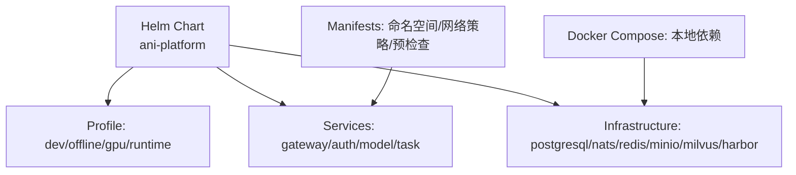
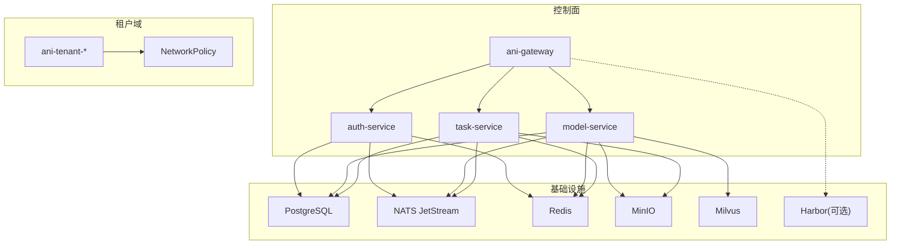
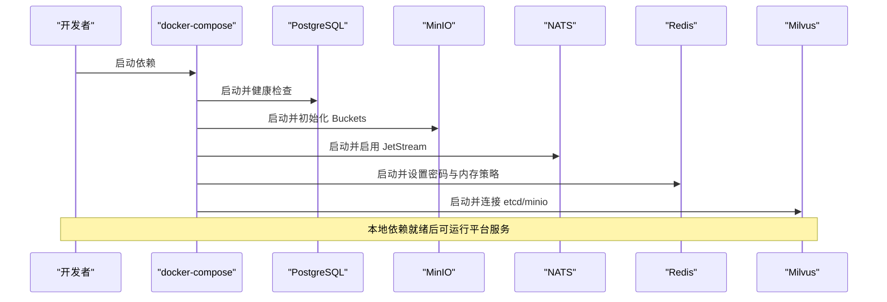
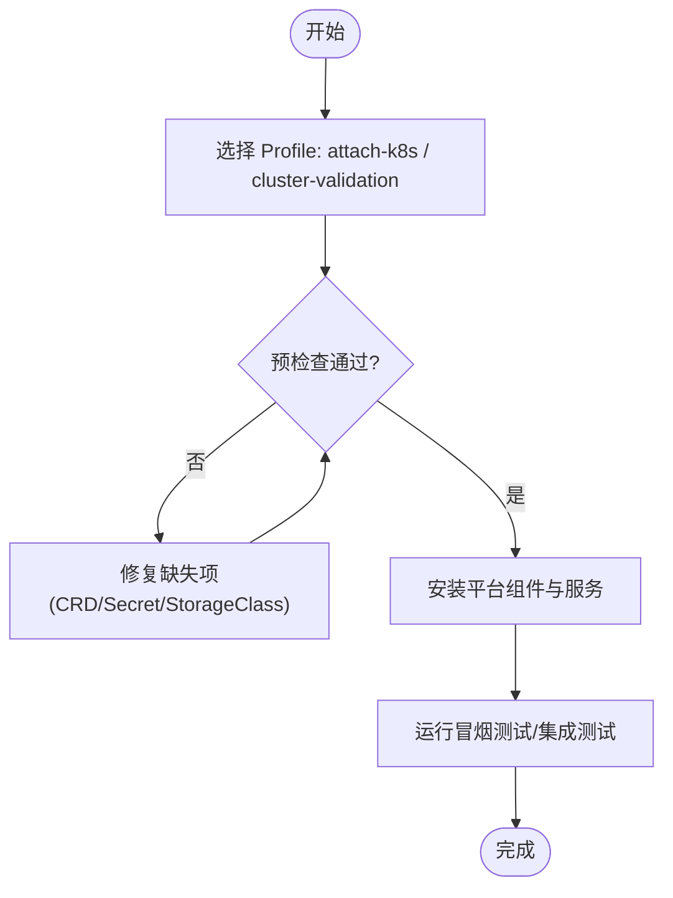
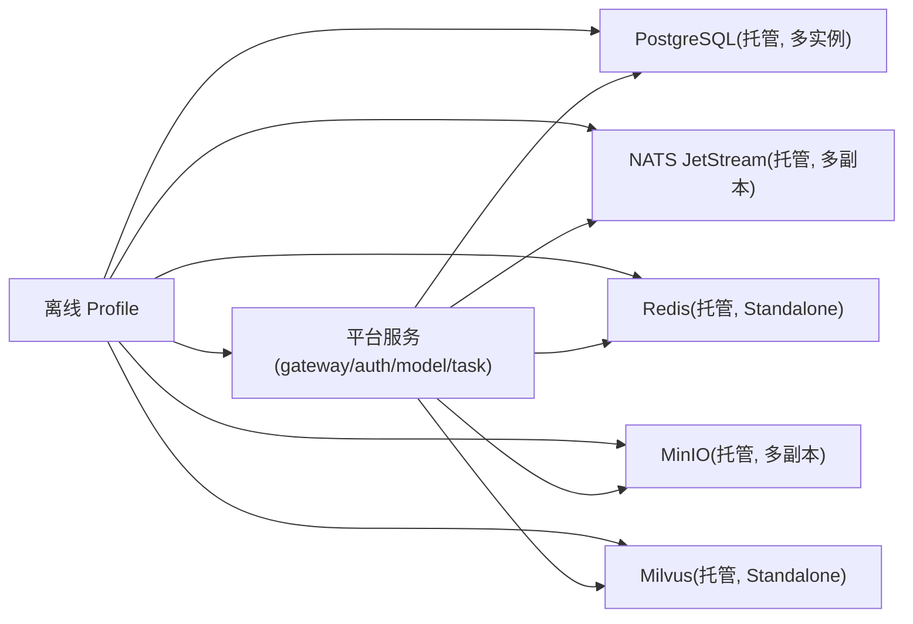
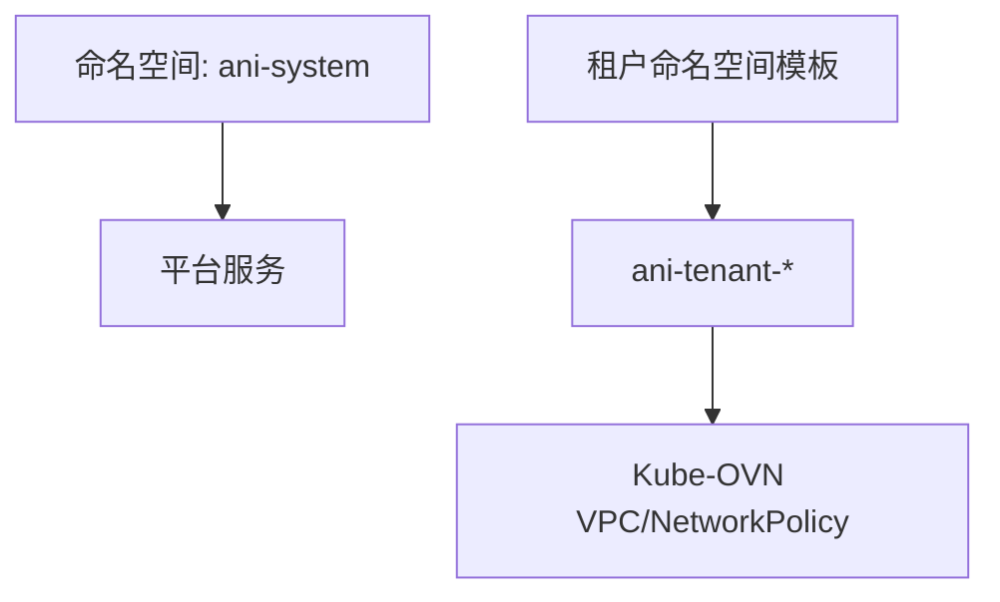
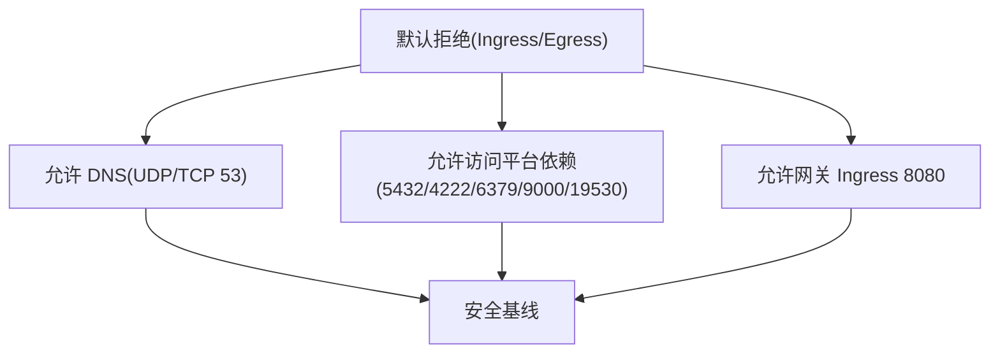
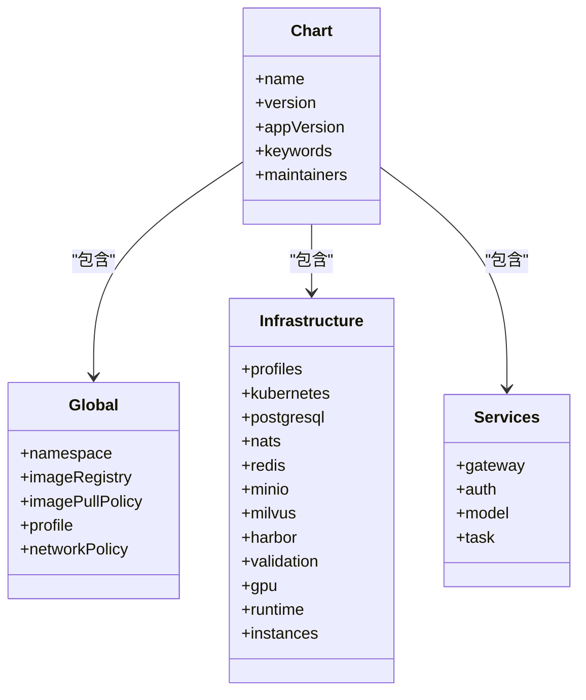
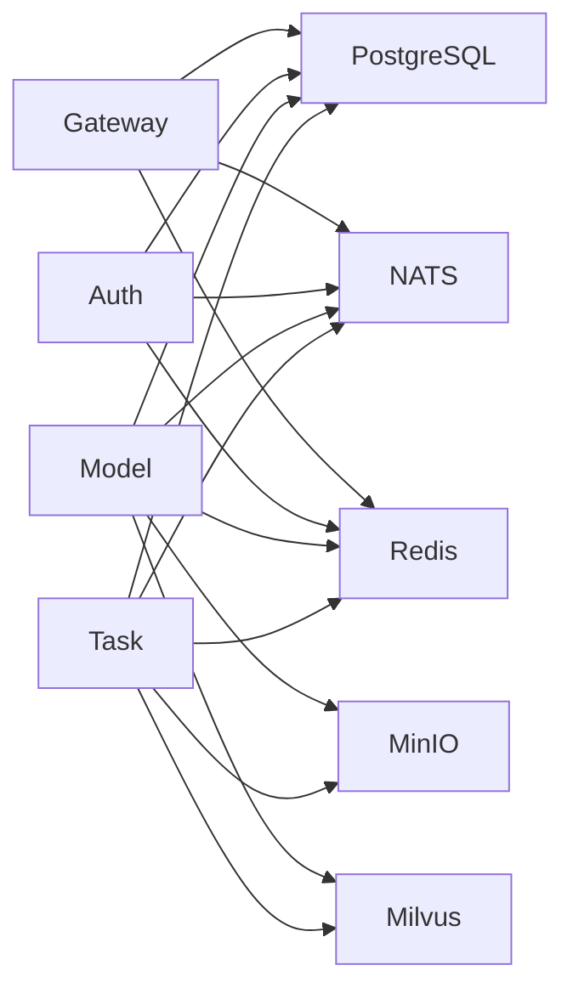

# 部署拓扑设计

<cite>
**本文引用的文件**
- [Chart.yaml](file://repo/deploy/helm/ani-platform/Chart.yaml)
- [values.yaml](file://repo/deploy/helm/ani-platform/values.yaml)
- [dev.yaml](file://repo/deploy/helm/ani-platform/profiles/dev.yaml)
- [offline.yaml](file://repo/deploy/helm/ani-platform/profiles/offline.yaml)
- [docker-compose.yml](file://repo/deploy/docker/docker-compose.yml)
- [00-namespace.yaml](file://repo/deploy/manifests/m1-infra-a/00-namespace.yaml)
- [00-tenant-namespace-template.yaml](file://repo/deploy/manifests/m1-infra-c/00-tenant-namespace-template.yaml)
- [20-networkpolicy.yaml](file://repo/deploy/manifests/m1-infra-a/20-networkpolicy.yaml)
</cite>

## 目录
1. [简介](#简介)
2. [项目结构](#项目结构)
3. [核心组件](#核心组件)
4. [架构总览](#架构总览)
5. [详细组件分析](#详细组件分析)
6. [依赖关系分析](#依赖关系分析)
7. [性能与高可用](#性能与高可用)
8. [故障排查指南](#故障排查指南)
9. [结论](#结论)
10. [附录](#附录)

## 简介
本文件面向 ANI 平台的部署拓扑设计，覆盖开发、测试与生产环境的集群拓扑、命名空间隔离、资源配额、高可用方案（多副本、负载均衡、健康检查）、Helm Chart 配置结构与自定义值覆盖、网络规划、存储与安全策略，以及部署脚本与自动化运维工具的使用方式。文档以仓库中的 Helm Chart、Manifest 与本地开发编排为依据，确保与实际代码一致。

## 项目结构
ANI 平台采用“Helm 伞形 Chart + Profile 叠加 + Manifest 模板”的分层部署结构：
- Helm Chart 定义平台服务与基础设施依赖的默认配置与开关
- Profile 提供不同环境（开发、离线、GPU、运行时基础等）的值覆盖
- Manifest 提供命名空间、网络策略、预检查等基础资源模板
- 本地开发通过 docker-compose 拉起数据库、对象存储、消息总线、缓存、向量检索等依赖

图表来源
- [Chart.yaml:1-16](file://repo/deploy/helm/ani-platform/Chart.yaml#L1-L16)
- [values.yaml:1-108](file://repo/deploy/helm/ani-platform/values.yaml#L1-L108)
- [dev.yaml:1-24](file://repo/deploy/helm/ani-platform/profiles/dev.yaml#L1-L24)
- [offline.yaml:1-44](file://repo/deploy/helm/ani-platform/profiles/offline.yaml#L1-L44)
- [docker-compose.yml:1-184](file://repo/deploy/docker/docker-compose.yml#L1-L184)

章节来源
- [Chart.yaml:1-16](file://repo/deploy/helm/ani-platform/Chart.yaml#L1-L16)
- [values.yaml:1-108](file://repo/deploy/helm/ani-platform/values.yaml#L1-L108)
- [dev.yaml:1-24](file://repo/deploy/helm/ani-platform/profiles/dev.yaml#L1-L24)
- [offline.yaml:1-44](file://repo/deploy/helm/ani-platform/profiles/offline.yaml#L1-L44)
- [docker-compose.yml:1-184](file://repo/deploy/docker/docker-compose.yml#L1-L184)

## 核心组件
- 平台服务
  - ani-gateway：统一入口网关，暴露 HTTP API
  - auth-service：认证授权服务
  - model-service：模型管理服务
  - task-service：任务调度与执行服务
- 基础设施依赖
  - PostgreSQL（TimescaleDB）：持久化数据
  - NATS JetStream：事件总线
  - Redis：缓存与会话
  - MinIO：对象存储（模型、数据集、知识库文档等）
  - Milvus：向量检索
  - Harbor：镜像仓库（可选）
- 运行时与实例
  - 容器/GPU 容器/批作业/沙箱等运行时能力
  - 实例生命周期、网络平面（Kube-OVN VPC）、存储挂载

章节来源
- [values.yaml:237-262](file://repo/deploy/helm/ani-platform/values.yaml#L237-L262)
- [values.yaml:158-236](file://repo/deploy/helm/ani-platform/values.yaml#L158-L236)
- [values.yaml:51-108](file://repo/deploy/helm/ani-platform/values.yaml#L51-L108)

## 架构总览
下图展示 ANI 平台在 Kubernetes 上的总体拓扑：控制面服务通过网关对外暴露；内部服务通过 NATS/Redis/PostgreSQL 通信；对象存储与向量库由外部或托管组件提供；网络策略限制跨命名空间访问；租户命名空间通过模板创建并绑定 Kube-OVN VPC。

图表来源
- [values.yaml:237-262](file://repo/deploy/helm/ani-platform/values.yaml#L237-L262)
- [values.yaml:51-108](file://repo/deploy/helm/ani-platform/values.yaml#L51-L108)
- [20-networkpolicy.yaml:1-76](file://repo/deploy/manifests/m1-infra-a/20-networkpolicy.yaml#L1-L76)
- [00-tenant-namespace-template.yaml:1-10](file://repo/deploy/manifests/m1-infra-c/00-tenant-namespace-template.yaml#L1-L10)

## 详细组件分析

### 开发环境拓扑（本地 Docker Compose）
- 使用 docker-compose 启动 PostgreSQL、MinIO、NATS、Redis、Milvus 及可选 Dex 与 Attu
- 所有端口仅绑定 127.0.0.1，避免意外暴露
- 通过 healthcheck 保证依赖就绪后再启动后续组件
- 适用于本地开发与联调

图表来源
- [docker-compose.yml:16-150](file://repo/deploy/docker/docker-compose.yml#L16-L150)

章节来源
- [docker-compose.yml:1-184](file://repo/deploy/docker/docker-compose.yml#L1-L184)

### 测试/预发环境拓扑（Helm Profile: attach-k8s / cluster-validation）
- 通过 Helm Profile 选择已存在的 Kubernetes 集群，安装平台组件
- 支持预检查 Job 验证 CRD、命名空间、Secret 与 StorageClass
- 可结合 GPU 调度与运行时基础能力进行集成测试

图表来源
- [values.yaml:94-108](file://repo/deploy/helm/ani-platform/values.yaml#L94-L108)
- [values.yaml:10-39](file://repo/deploy/helm/ani-platform/values.yaml#L10-L39)

章节来源
- [values.yaml:10-39](file://repo/deploy/helm/ani-platform/values.yaml#L10-L39)
- [values.yaml:94-108](file://repo/deploy/helm/ani-platform/values.yaml#L94-L108)

### 生产环境拓扑（Helm Profile: offline）
- 全量托管模式：PostgreSQL、NATS、Redis、MinIO、Milvus 均通过 Chart 管理
- 要求镜像与 Chart 包离线可用，锁定版本以确保一致性
- 多副本与持久化存储提升可用性
- Harbor 作为外部镜像仓库（可选）

图表来源
- [offline.yaml:1-44](file://repo/deploy/helm/ani-platform/profiles/offline.yaml#L1-L44)
- [values.yaml:51-108](file://repo/deploy/helm/ani-platform/values.yaml#L51-L108)

章节来源
- [offline.yaml:1-44](file://repo/deploy/helm/ani-platform/profiles/offline.yaml#L1-L44)
- [values.yaml:51-108](file://repo/deploy/helm/ani-platform/values.yaml#L51-L108)

### 命名空间隔离与租户模板
- 平台命名空间：ani-system，用于承载控制面组件
- 租户命名空间：基于模板创建，注入租户 ID 与网络配置文件
- 通过标签区分平台与租户作用域，便于 RBAC 与网络策略治理

图表来源
- [00-namespace.yaml:1-9](file://repo/deploy/manifests/m1-infra-a/00-namespace.yaml#L1-L9)
- [00-tenant-namespace-template.yaml:1-10](file://repo/deploy/manifests/m1-infra-c/00-tenant-namespace-template.yaml#L1-L10)

章节来源
- [00-namespace.yaml:1-9](file://repo/deploy/manifests/m1-infra-a/00-namespace.yaml#L1-L9)
- [00-tenant-namespace-template.yaml:1-10](file://repo/deploy/manifests/m1-infra-c/00-tenant-namespace-template.yaml#L1-L10)

### 网络规划与安全策略
- 默认拒绝入站与出站流量，仅开放必要端口
- 允许控制面 Pod 访问 DNS、数据库、消息总线、对象存储与向量库
- 仅允许网关暴露 8080 端口供外部访问
- 租户侧可通过 NetworkPolicy 进一步隔离

图表来源
- [20-networkpolicy.yaml:1-76](file://repo/deploy/manifests/m1-infra-a/20-networkpolicy.yaml#L1-L76)

章节来源
- [20-networkpolicy.yaml:1-76](file://repo/deploy/manifests/m1-infra-a/20-networkpolicy.yaml#L1-L76)

### 存储配置
- 开发环境：本地卷持久化各依赖数据
- 生产环境：通过 StorageClass 指定持久化类型（需替换为实际存储类名）
- 对象存储：MinIO 提供 models/datasets/kb-docs 等桶
- 向量存储：Milvus 使用对象存储后端

章节来源
- [docker-compose.yml:16-150](file://repo/deploy/docker/docker-compose.yml#L16-L150)
- [offline.yaml:14-40](file://repo/deploy/helm/ani-platform/profiles/offline.yaml#L14-L40)
- [values.yaml:77-88](file://repo/deploy/helm/ani-platform/values.yaml#L77-L88)

### 高可用部署方案
- 多副本：NATS、MinIO 在生产 Profile 中配置多副本
- 负载均衡：网关作为统一入口，配合 Ingress/Service 实现流量分发
- 健康检查：依赖组件均配置健康检查，保障滚动升级与自愈
- 预检查：安装前校验 CRD、命名空间、Secret 与存储类

章节来源
- [offline.yaml:19-35](file://repo/deploy/helm/ani-platform/profiles/offline.yaml#L19-L35)
- [docker-compose.yml:30-150](file://repo/deploy/docker/docker-compose.yml#L30-L150)
- [values.yaml:94-108](file://repo/deploy/helm/ani-platform/values.yaml#L94-L108)

### Helm Chart 配置结构与自定义值覆盖
- Chart 元信息：名称、版本、应用版本、关键字与维护者
- 全局配置：命名空间、镜像仓库、拉取策略、Profile、网络策略
- 基础设施：PostgreSQL/NATS/Redis/MinIO/Milvus/Harbor 的模式与版本
- 运行时与实例：运行时提供者、网络平面、存储挂载、默认隔离策略
- Services：gateway/auth/model/task 的镜像与端口
- Profile：dev/offline/gpu/runtime 等覆盖 global 与 infrastructure

图表来源
- [Chart.yaml:1-16](file://repo/deploy/helm/ani-platform/Chart.yaml#L1-L16)
- [values.yaml:1-108](file://repo/deploy/helm/ani-platform/values.yaml#L1-L108)
- [values.yaml:237-262](file://repo/deploy/helm/ani-platform/values.yaml#L237-L262)

章节来源
- [Chart.yaml:1-16](file://repo/deploy/helm/ani-platform/Chart.yaml#L1-L16)
- [values.yaml:1-108](file://repo/deploy/helm/ani-platform/values.yaml#L1-L108)
- [values.yaml:237-262](file://repo/deploy/helm/ani-platform/values.yaml#L237-L262)

### 部署脚本与自动化运维工具
- 本地依赖：make deps / make deps-down 或通过 docker compose 命令启动/停止
- 平台安装：使用 Helm 安装 ani-platform，并通过 Profile 覆盖值
- 预检查：启用 validation.preflightJob 进行集群前置校验
- 迁移：PostgreSQL 迁移 Job 可按需启用（当前默认关闭）

章节来源
- [docker-compose.yml:1-10](file://repo/deploy/docker/docker-compose.yml#L1-L10)
- [values.yaml:57-63](file://repo/deploy/helm/ani-platform/values.yaml#L57-L63)
- [values.yaml:94-108](file://repo/deploy/helm/ani-platform/values.yaml#L94-L108)

## 依赖关系分析
- 平台服务依赖基础设施：网关、认证、模型、任务服务均依赖 PostgreSQL、NATS、Redis；模型与任务还依赖 MinIO 与 Milvus
- 网络策略约束：控制面 Pod 仅能访问必要的依赖端口；外部仅能通过网关访问
- 租户隔离：租户命名空间通过模板注入标识与网络配置，便于后续 RBAC 与网络策略扩展

图表来源
- [values.yaml:237-262](file://repo/deploy/helm/ani-platform/values.yaml#L237-L262)
- [values.yaml:51-108](file://repo/deploy/helm/ani-platform/values.yaml#L51-L108)

章节来源
- [values.yaml:51-108](file://repo/deploy/helm/ani-platform/values.yaml#L51-L108)
- [values.yaml:237-262](file://repo/deploy/helm/ani-platform/values.yaml#L237-L262)

## 性能与高可用
- 多副本与持久化：NATS、MinIO 在生产 Profile 中配置多副本与持久化存储，提高吞吐与容错
- 健康检查：依赖组件均具备健康检查，支持滚动更新与自动重启
- 预检查机制：安装前校验 CRD、命名空间、Secret 与存储类，降低部署失败风险
- 网络策略：最小权限原则，减少攻击面与误用

章节来源
- [offline.yaml:19-35](file://repo/deploy/helm/ani-platform/profiles/offline.yaml#L19-L35)
- [docker-compose.yml:30-150](file://repo/deploy/docker/docker-compose.yml#L30-L150)
- [values.yaml:94-108](file://repo/deploy/helm/ani-platform/values.yaml#L94-L108)

## 故障排查指南
- 依赖未就绪：检查 docker-compose 健康检查日志与端口绑定；确认依赖服务状态
- 预检查失败：查看 preflight Job 输出，补齐缺失 CRD、命名空间、Secret 或 StorageClass
- 网络不通：核对 NetworkPolicy 是否放行必要端口；确认租户命名空间与 VPC 配置正确
- 存储问题：确认 StorageClass 存在且可用；对象存储桶已创建；向量库后端连接正常

章节来源
- [docker-compose.yml:30-150](file://repo/deploy/docker/docker-compose.yml#L30-L150)
- [values.yaml:94-108](file://repo/deploy/helm/ani-platform/values.yaml#L94-L108)
- [20-networkpolicy.yaml:1-76](file://repo/deploy/manifests/m1-infra-a/20-networkpolicy.yaml#L1-L76)

## 结论
ANI 平台通过 Helm Chart 与 Profile 的组合，实现了从开发到生产的可复用部署拓扑。开发环境以 docker-compose 快速拉起依赖；测试/预发环境通过预检查与 Profile 切换进行集成验证；生产环境采用离线镜像与托管依赖的多副本部署，结合网络策略与租户隔离，满足高可用与安全合规要求。建议在生产环境中持续完善资源配额、监控告警与备份恢复策略，以提升整体稳定性与可观测性。

## 附录
- 关键路径参考
  - Helm Chart 元信息与依赖声明：[Chart.yaml:1-16](file://repo/deploy/helm/ani-platform/Chart.yaml#L1-L16)
  - 全局与基础设施默认配置：[values.yaml:1-108](file://repo/deploy/helm/ani-platform/values.yaml#L1-L108)
  - 服务镜像与端口：[values.yaml:237-262](file://repo/deploy/helm/ani-platform/values.yaml#L237-L262)
  - 开发环境依赖编排：[docker-compose.yml:1-184](file://repo/deploy/docker/docker-compose.yml#L1-L184)
  - 平台与租户命名空间：[00-namespace.yaml:1-9](file://repo/deploy/manifests/m1-infra-a/00-namespace.yaml#L1-L9)、[00-tenant-namespace-template.yaml:1-10](file://repo/deploy/manifests/m1-infra-c/00-tenant-namespace-template.yaml#L1-L10)
  - 网络策略基线：[20-networkpolicy.yaml:1-76](file://repo/deploy/manifests/m1-infra-a/20-networkpolicy.yaml#L1-L76)