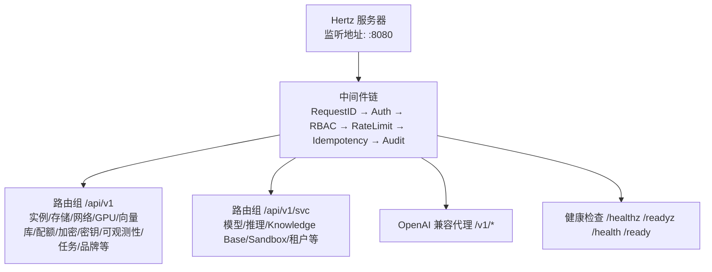
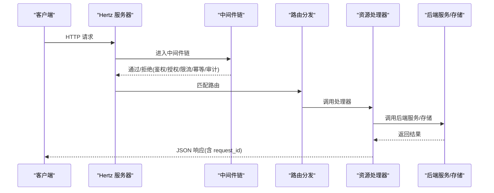
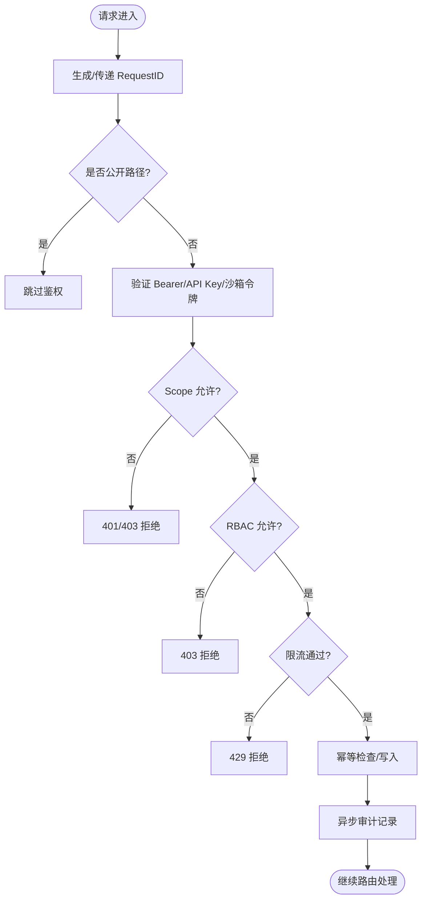
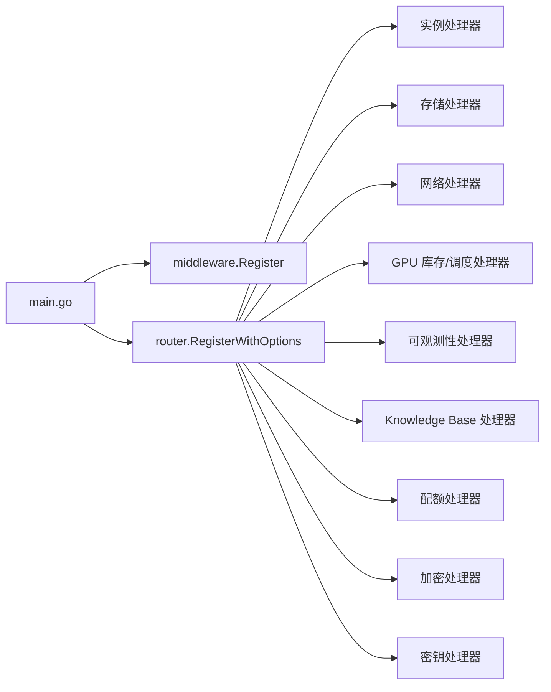

# API 网关服务

<cite>
**本文引用的文件**
- [main.go](file://repo/services/ani-gateway/main.go)
- [chain.go](file://repo/services/ani-gateway/internal/middleware/chain.go)
- [auth.go](file://repo/services/ani-gateway/internal/middleware/auth.go)
- [rbac.go](file://repo/services/ani-gateway/internal/middleware/rbac.go)
- [ratelimit.go](file://repo/services/ani-gateway/internal/middleware/ratelimit.go)
- [audit.go](file://repo/services/ani-gateway/internal/middleware/audit.go)
- [store.go](file://repo/services/ani-gateway/internal/middleware/store.go)
- [router.go](file://repo/services/ani-gateway/internal/router/router.go)
- [health.go](file://repo/services/ani-gateway/internal/router/health.go)
- [errors.go](file://repo/services/ani-gateway/internal/pkg/errors/errors.go)
- [instances.go](file://repo/services/ani-gateway/internal/router/instances.go)
- [storage_resources.go](file://repo/services/ani-gateway/internal/router/storage_resources.go)
- [network_resources.go](file://repo/services/ani-gateway/internal/router/network_resources.go)
- [gpu_inventory_resources.go](file://repo/services/ani-gateway/internal/router/gpu_inventory_resources.go)
</cite>

## 目录
1. [简介](#简介)
2. [项目结构](#项目结构)
3. [核心组件](#核心组件)
4. [架构总览](#架构总览)
5. [详细组件分析](#详细组件分析)
6. [依赖关系分析](#依赖关系分析)
7. [性能与可靠性](#性能与可靠性)
8. [故障排查指南](#故障排查指南)
9. [结论](#结论)
10. [附录：资源处理器接口规范](#附录资源处理器接口规范)

## 简介
本文件为 ANI 平台 API 网关服务的完整技术文档，聚焦以下目标：
- 网关的架构设计与请求处理流程
- 路由机制与中间件链执行顺序
- 认证、RBAC 权限控制、限流、审计日志等核心能力
- 错误处理策略、超时配置与健康检查端点
- 如何新增路由处理器与中间件的实践示例
- 实例、存储、网络、GPU 等资源处理器的接口规范与使用方法

## 项目结构
ANI 网关基于 Hertz 框架实现，入口在 main.go；中间件统一注册于 internal/middleware；路由与资源处理器位于 internal/router；标准错误格式定义于 internal/pkg/errors。

图表来源
- [main.go:20-220](file://repo/services/ani-gateway/main.go#L20-L220)
- [chain.go:7-21](file://repo/services/ani-gateway/internal/middleware/chain.go#L7-L21)
- [router.go:47-102](file://repo/services/ani-gateway/internal/router/router.go#L47-L102)
- [health.go:25-37](file://repo/services/ani-gateway/internal/router/health.go#L25-L37)

章节来源
- [main.go:20-220](file://repo/services/ani-gateway/main.go#L20-L220)
- [chain.go:7-21](file://repo/services/ani-gateway/internal/middleware/chain.go#L7-L21)
- [router.go:47-102](file://repo/services/ani-gateway/internal/router/router.go#L47-L102)
- [health.go:25-37](file://repo/services/ani-gateway/internal/router/health.go#L25-L37)

## 核心组件
- 启动与装配：main.go 负责初始化各运行时（K8s 集群代理、加密、密钥、GPU 库存、网络、存储、镜像仓库、实例运行时、向量库、可观测性、KB gRPC 客户端、SSE 配置、异步任务存储、配额管理等），并注册中间件与路由。
- 中间件链：chain.go 统一注册 RequestID、Auth、RBAC、RateLimit、Idempotency、Audit 等中间件，保证一致的横切关注点。
- 路由与资源处理器：router.go 将 /api/v1 与 /api/v1/svc 分组注册到具体资源处理器；健康检查独立挂载。
- 错误响应：errors.go 提供统一的 APIError 结构与错误响应方法。

章节来源
- [main.go:20-220](file://repo/services/ani-gateway/main.go#L20-L220)
- [chain.go:7-21](file://repo/services/ani-gateway/internal/middleware/chain.go#L7-L21)
- [router.go:47-102](file://repo/services/ani-gateway/internal/router/router.go#L47-L102)
- [errors.go:12-51](file://repo/services/ani-gateway/internal/pkg/errors/errors.go#L12-L51)

## 架构总览
网关采用“中间件 + 路由 + 资源处理器”的分层架构。所有外部请求先经过中间件链进行鉴权、授权、限流、幂等与审计，再进入路由分发至具体资源处理器，最终调用后端适配器或远程服务。

图表来源
- [chain.go:7-21](file://repo/services/ani-gateway/internal/middleware/chain.go#L7-L21)
- [router.go:47-102](file://repo/services/ani-gateway/internal/router/router.go#L47-L102)
- [errors.go:32-42](file://repo/services/ani-gateway/internal/pkg/errors/errors.go#L32-L42)

## 详细组件分析

### 中间件链与执行顺序
- 执行顺序：RequestID → Auth → RBAC → RateLimit → Idempotency → Audit
- 作用：
  - RequestID：为每个请求生成唯一 ID，贯穿日志与错误响应
  - Auth：支持 Bearer Token、API Key、沙箱短令牌与开发模式
  - RBAC：基于角色与资源动作的权限校验
  - RateLimit：按租户+方法+路由类别的窗口限流
  - Idempotency：基于键的幂等保护（由 store 驱动）
  - Audit：异步记录审计日志，不阻塞主路径

图表来源
- [chain.go:7-21](file://repo/services/ani-gateway/internal/middleware/chain.go#L7-L21)
- [auth.go:22-141](file://repo/services/ani-gateway/internal/middleware/auth.go#L22-L141)
- [rbac.go:17-71](file://repo/services/ani-gateway/internal/middleware/rbac.go#L17-L71)
- [ratelimit.go:15-56](file://repo/services/ani-gateway/internal/middleware/ratelimit.go#L15-L56)
- [audit.go:12-55](file://repo/services/ani-gateway/internal/middleware/audit.go#L12-L55)

章节来源
- [chain.go:7-21](file://repo/services/ani-gateway/internal/middleware/chain.go#L7-L21)
- [auth.go:22-141](file://repo/services/ani-gateway/internal/middleware/auth.go#L22-L141)
- [rbac.go:17-71](file://repo/services/ani-gateway/internal/middleware/rbac.go#L17-L71)
- [ratelimit.go:15-56](file://repo/services/ani-gateway/internal/middleware/ratelimit.go#L15-L56)
- [audit.go:12-55](file://repo/services/ani-gateway/internal/middleware/audit.go#L12-L55)

### 认证中间件（Auth）
- 支持的认证方式：
  - Bearer Token：调用认证服务校验，支持 scope 隔离
  - API Key：仅租户范围访问，禁止平台管理端点
  - 沙箱短令牌：本地 HMAC 校验，限制到沙箱子资源
  - 开发模式：通过环境变量与自定义头注入租户上下文
- 公共路径白名单：健康检查、品牌、登录、令牌刷新等
- 安全要点：严格校验 tenant/user ID 格式，防止跨租户数据泄露

章节来源
- [auth.go:22-141](file://repo/services/ani-gateway/internal/middleware/auth.go#L22-L141)
- [auth.go:199-229](file://repo/services/ani-gateway/internal/middleware/auth.go#L199-L229)

### RBAC 权限控制
- 权限推断：根据 HTTP 方法与路径推断资源与动作（如 GET→get，POST→create）
- 权限校验：调用认证服务 CheckPermission，结合租户、用户、角色、资源、动作
- 沙箱令牌：仅允许访问沙箱子资源路径
- 开发模式：跳过 RBAC 校验以方便调试

章节来源
- [rbac.go:17-71](file://repo/services/ani-gateway/internal/middleware/rbac.go#L17-L71)
- [rbac.go:74-98](file://repo/services/ani-gateway/internal/middleware/rbac.go#L74-L98)

### 限流中间件（RateLimit）
- 维度：租户 + 方法 + 路由类别（按 /api/v1/{resource} 归类）
- 存储：使用共享缓存 store（Redis）做窗口计数
- 配置：GATEWAY_RATE_LIMIT_REQUESTS、GATEWAY_RATE_LIMIT_WINDOW
- 行为：未配置或 store 不可用时降级放行；超限返回 429

章节来源
- [ratelimit.go:15-56](file://repo/services/ani-gateway/internal/middleware/ratelimit.go#L15-L56)
- [ratelimit.go:58-86](file://repo/services/ani-gateway/internal/middleware/ratelimit.go#L58-L86)
- [store.go:1-6](file://repo/services/ani-gateway/internal/middleware/store.go#L1-L6)

### 审计日志（Audit）
- 非阻塞：响应发送后异步记录审计条目
- 内容：RequestID、TenantID、Method、Path、StatusCode、DurationMs
- 实现：缓冲通道 + 后台 worker 写入（当前为占位，后续接入 DB）

章节来源
- [audit.go:12-55](file://repo/services/ani-gateway/internal/middleware/audit.go#L12-L55)

### 路由机制
- 分组：/api/v1（核心资源）、/api/v1/svc（过渡服务）、/v1（OpenAI 兼容代理）
- 注册：router.go 集中注册所有资源处理器，按需注入运行时依赖
- 健康检查：/healthz、/readyz、/health、/ready，无需鉴权

章节来源
- [router.go:47-102](file://repo/services/ani-gateway/internal/router/router.go#L47-L102)
- [health.go:25-37](file://repo/services/ani-gateway/internal/router/health.go#L25-L37)

### 健康检查端点
- /healthz、/ready：返回进程状态与版本信息，便于编排系统探测
- 可扩展：readiness 中可加入依赖健康检查（当前为进程级）

章节来源
- [health.go:25-58](file://repo/services/ani-gateway/internal/router/health.go#L25-L58)

### 错误处理策略
- 统一格式：{code, message, request_id, details}
- 预定义错误码：NOT_FOUND、UNAUTHORIZED、FORBIDDEN、BAD_REQUEST、CONFLICT、INTERNAL_ERROR、RATE_LIMIT_EXCEEDED、MODEL_NOT_READY
- 辅助方法：RespondError、NotFound、Unauthorized

章节来源
- [errors.go:12-51](file://repo/services/ani-gateway/internal/pkg/errors/errors.go#L12-L51)

### 超时与关闭
- 优雅关闭：Hertz 设置退出等待时间，信号通知后触发 Shutdown
- 运行时依赖：各服务（存储、镜像仓库、向量库、可观测性等）均支持关闭回调，确保资源释放

章节来源
- [main.go:24-27](file://repo/services/ani-gateway/main.go#L24-L27)
- [main.go:210-220](file://repo/services/ani-gateway/main.go#L210-L220)

### 添加新路由处理器（示例步骤）
- 在 router.go 中为新资源创建分组或复用现有分组
- 编写处理器函数，遵循统一错误响应格式
- 在 RegisterWithOptions 中注册路由，必要时注入依赖
- 若涉及鉴权/授权/限流，自动受中间件链保护

章节来源
- [router.go:47-102](file://repo/services/ani-gateway/internal/router/router.go#L47-L102)
- [errors.go:32-51](file://repo/services/ani-gateway/internal/pkg/errors/errors.go#L32-L51)

### 添加新中间件（示例步骤）
- 在 middleware 包下实现 app.HandlerFunc
- 在 chain.go 的 Register 中按顺序插入中间件
- 如需共享存储，通过 GatewayStore 参数注入

章节来源
- [chain.go:7-21](file://repo/services/ani-gateway/internal/middleware/chain.go#L7-L21)
- [store.go:1-6](file://repo/services/ani-gateway/internal/middleware/store.go#L1-L6)

## 依赖关系分析
网关在启动时组装大量运行时依赖，并通过路由注册注入到处理器中。

图表来源
- [main.go:134-208](file://repo/services/ani-gateway/main.go#L134-L208)
- [router.go:47-102](file://repo/services/ani-gateway/internal/router/router.go#L47-L102)

章节来源
- [main.go:134-208](file://repo/services/ani-gateway/main.go#L134-L208)
- [router.go:47-102](file://repo/services/ani-gateway/internal/router/router.go#L47-L102)

## 性能与可靠性
- 中间件链尽量轻量，避免阻塞主路径；审计采用异步落盘
- 限流基于 Redis 窗口计数，可按租户与路由粒度控制
- 健康检查快速返回，便于编排系统弹性伸缩
- 依赖服务失败时，处理器应返回明确错误码，便于客户端重试或降级

[本节为通用指导，不直接分析具体文件]

## 故障排查指南
- 鉴权失败：检查 Authorization/X-API-Key 是否正确；确认 scope 与路径白名单；查看 UNAUTHORIZED/FORBIDDEN 错误码
- 权限被拒：确认 RBAC 规则与角色映射；查看权限检查返回值 reason
- 限流触发：调整 GATEWAY_RATE_LIMIT_REQUESTS/WINDOW；检查 Redis 连通性与 key 命名
- 健康检查异常：确认进程存活与依赖就绪；扩展 readiness 检查更多依赖
- 审计缺失：确认审计 worker 已启动；检查通道容量与下游写入

章节来源
- [auth.go:22-141](file://repo/services/ani-gateway/internal/middleware/auth.go#L22-L141)
- [rbac.go:17-71](file://repo/services/ani-gateway/internal/middleware/rbac.go#L17-L71)
- [ratelimit.go:15-56](file://repo/services/ani-gateway/internal/middleware/ratelimit.go#L15-L56)
- [audit.go:12-55](file://repo/services/ani-gateway/internal/middleware/audit.go#L12-L55)
- [health.go:25-58](file://repo/services/ani-gateway/internal/router/health.go#L25-L58)

## 结论
ANI 网关通过清晰的中间件链与模块化路由设计，提供了高内聚、低耦合的请求处理能力。认证、RBAC、限流、审计等横切能力统一封装，资源处理器专注于业务逻辑。配合健康检查与统一错误格式，便于运维监控与问题定位。未来可在 readiness 中增强依赖健康检查，并在审计中完善批量写入与持久化。

[本节为总结，不直接分析具体文件]

## 附录：资源处理器接口规范

### 实例处理器（Instances）
- 职责：实例生命周期管理、操作记录、可观测性集成、GPU/网络/存储/镜像等资源的编排
- 关键类型：instanceAPI、InstanceRuntime、各类请求/响应结构体
- 典型能力：创建/查询/更新/删除实例、关联网络与存储、容器与 VM 配置、沙箱模板、任务队列

章节来源
- [instances.go:29-101](file://repo/services/ani-gateway/internal/router/instances.go#L29-L101)
- [instances.go:103-200](file://repo/services/ani-gateway/internal/router/instances.go#L103-L200)

### 存储处理器（Storage）
- 职责：卷、文件系统、对象存储、快照、生命周期策略、挂载/卸载等
- 关键类型：storageAPI、storageCreateVolumeRequest、storageCreateFilesystemRequest、storageCreateObjectRequest 等
- 典型能力：创建/扩容/快照/备份、对象上传/下载、ACL/生命周期规则、多实例挂载

章节来源
- [storage_resources.go:16-19](file://repo/services/ani-gateway/internal/router/storage_resources.go#L16-L19)
- [storage_resources.go:21-182](file://repo/services/ani-gateway/internal/router/storage_resources.go#L21-L182)
- [storage_resources.go:183-200](file://repo/services/ani-gateway/internal/router/storage_resources.go#L183-L200)

### 网络处理器（Network）
- 职责：VPC、子网、安全组、负载均衡、路由、概览与能力展示
- 关键类型：networkAPI、networkCreateVPCRequest、networkCreateSubnetRequest、networkCreateSecurityGroupRequest 等
- 典型能力：创建/更新/删除网络资源、绑定目标、规则优先级、删除风险评估

章节来源
- [network_resources.go:16-18](file://repo/services/ani-gateway/internal/router/network_resources.go#L16-L18)
- [network_resources.go:20-99](file://repo/services/ani-gateway/internal/router/network_resources.go#L20-L99)
- [network_resources.go:100-200](file://repo/services/ani-gateway/internal/router/network_resources.go#L100-L200)

### GPU 库存与调度处理器（GPU Inventory & Scheduling）
- 职责：GPU 设备发现、规格列表、占用统计、沙箱模板管理
- 关键类型：gpuInventoryAPI、gpuSpecResponse、gpuOccupancyResponse、sandboxTemplateResponse
- 典型能力：列出 GPU 节点与规格、查询占用、过滤类型/状态/节点、模板分页

章节来源
- [gpu_inventory_resources.go:21-31](file://repo/services/ani-gateway/internal/router/gpu_inventory_resources.go#L21-L31)
- [gpu_inventory_resources.go:44-114](file://repo/services/ani-gateway/internal/router/gpu_inventory_resources.go#L44-L114)
- [gpu_inventory_resources.go:116-160](file://repo/services/ani-gateway/internal/router/gpu_inventory_resources.go#L116-L160)
- [gpu_inventory_resources.go:162-200](file://repo/services/ani-gateway/internal/router/gpu_inventory_resources.go#L162-L200)

### 其他资源处理器（概览）
- 向量库（Vector Store）：集合管理、文档索引、查询与任务异步化
- 加密（Encryption）：密钥管理与数据加解密能力
- 密钥（Secret）：敏感信息管理
- 可观测性（Observability）：指标采集、PromQL 代理、实例映射
- 配额（Quota）：租户配额管理与元数据
- 邮件通知（Email Notification）：事件通知与投递
- Knowledge Base（KB）：gRPC 代理与 SSE 流式查询

章节来源
- [router.go:70-97](file://repo/services/ani-gateway/internal/router/router.go#L70-L97)