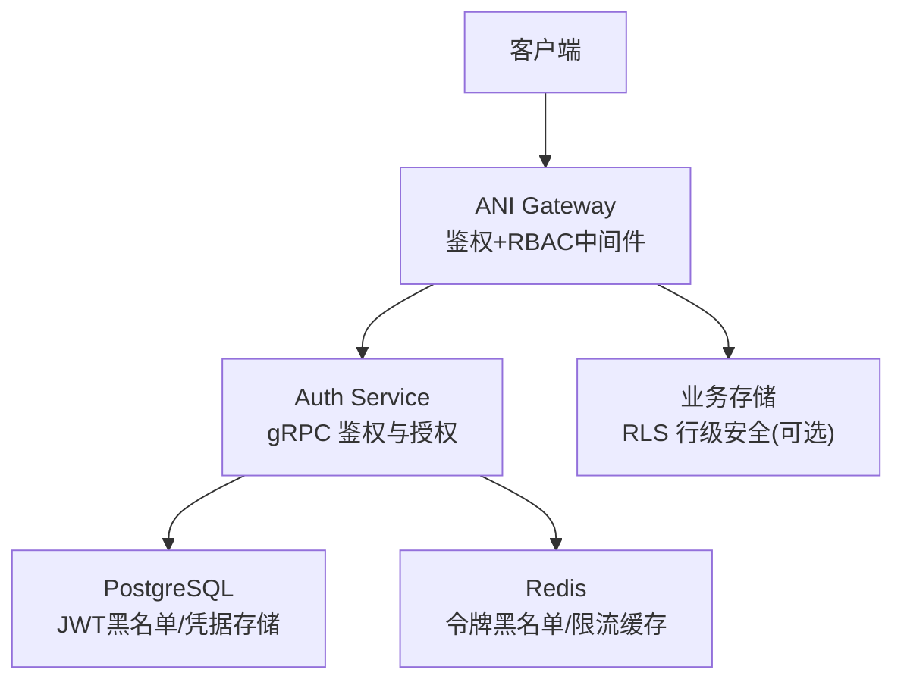
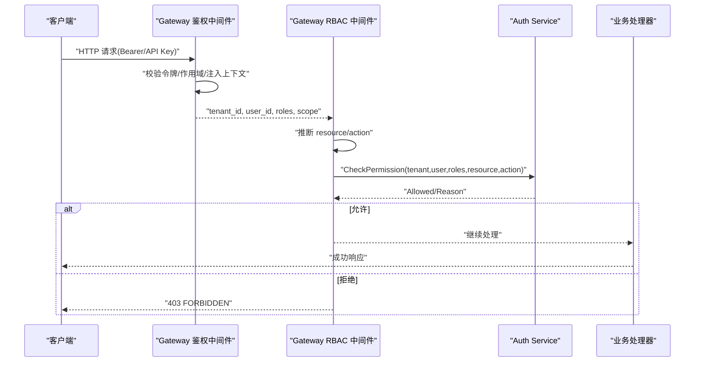
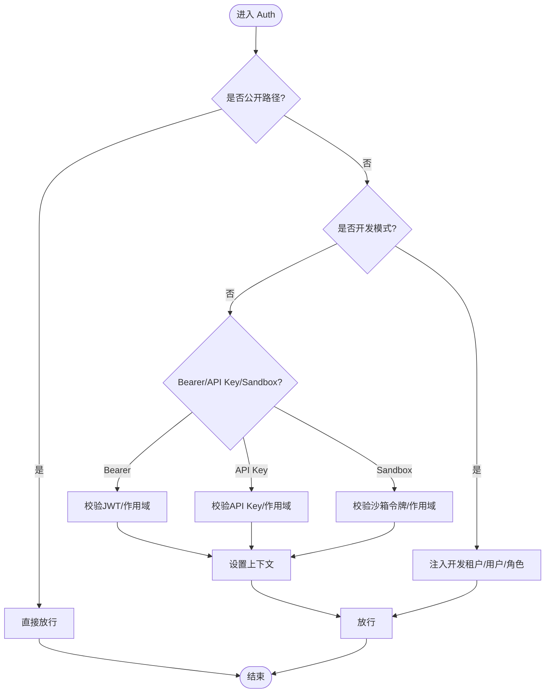
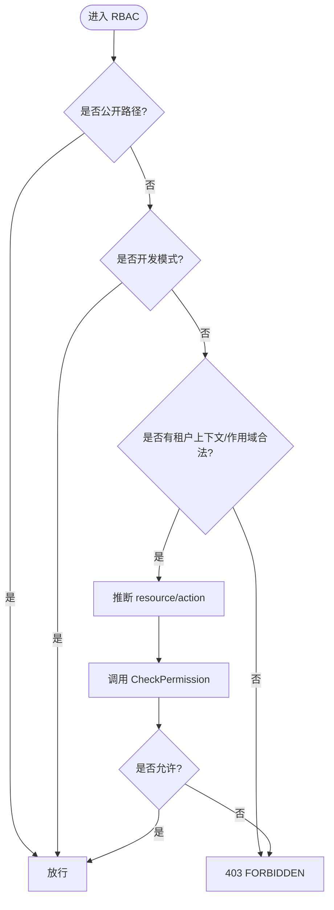
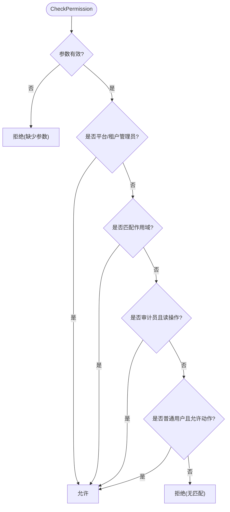
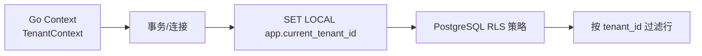
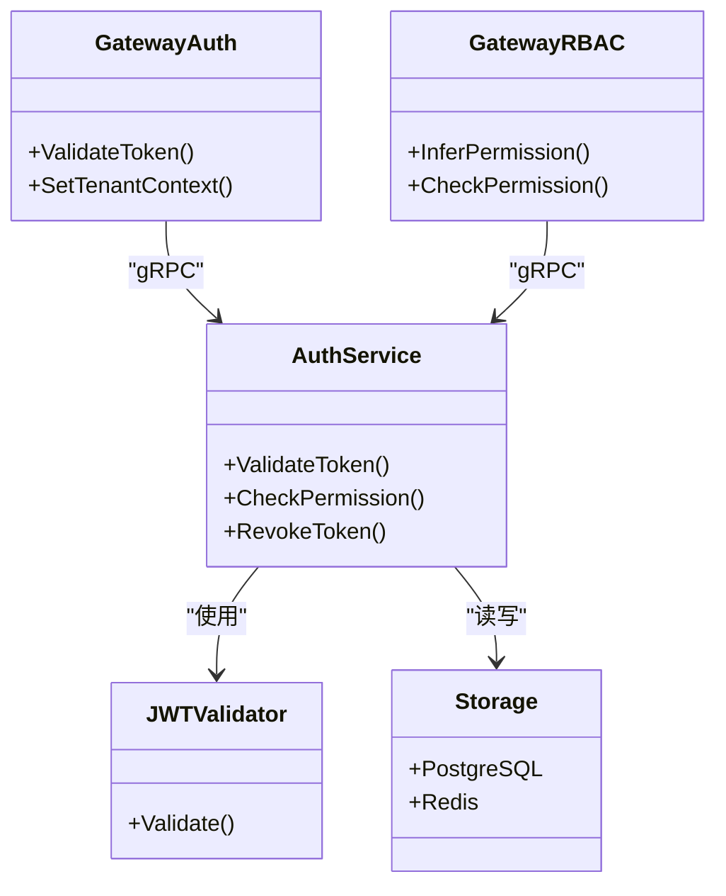

# RBAC 权限控制中间件

<cite>
**本文引用的文件**
- [rbac.go](file://repo/services/ani-gateway/internal/middleware/rbac.go)
- [auth.go](file://repo/services/ani-gateway/internal/middleware/auth.go)
- [auth_client.go](file://repo/services/ani-gateway/internal/middleware/auth_client.go)
- [auth_service.go](file://repo/services/auth-service/internal/service/auth_service.go)
- [jwt.go](file://repo/services/auth-service/internal/service/jwt.go)
- [config.go](file://repo/services/auth-service/internal/config/config.go)
- [rbac_test.go](file://repo/services/ani-gateway/internal/middleware/rbac_test.go)
- [auth_test.go](file://repo/services/ani-gateway/internal/middleware/auth_test.go)
- [apply_kb_migration.py](file://repo/scripts/apply_kb_migration.py)
- [rls.py](file://repo/services/kb-service/app/repositories/rls.py)
</cite>

## 目录
1. [简介](#简介)
2. [项目结构](#项目结构)
3. [核心组件](#核心组件)
4. [架构总览](#架构总览)
5. [详细组件分析](#详细组件分析)
6. [依赖关系分析](#依赖关系分析)
7. [性能与缓存](#性能与缓存)
8. [故障排查指南](#故障排查指南)
9. [结论](#结论)
10. [附录：配置与集成示例](#附录配置与集成示例)

## 简介
本文件面向 ANI 平台的 RBAC（基于角色的访问控制）权限控制中间件，系统性说明其实现原理、权限模型、资源访问控制流程、动态权限评估、缓存机制与性能优化策略，并给出配置选项、权限继承、多租户隔离以及与认证系统的集成方式。文档同时提供流程图与时序图，帮助读者快速理解从请求进入网关到最终授权决策的完整链路。

## 项目结构
RBAC 能力由“网关鉴权 + 网关 RBAC 中间件 + 认证服务”三部分协作完成：
- 网关鉴权中间件负责解析令牌、校验作用域、注入租户上下文。
- RBAC 中间件根据 HTTP 方法与路径推断资源与动作，调用认证服务的 CheckPermission 进行授权判定。
- 认证服务实现 JWT/API Key 校验、角色与作用域匹配、内置角色规则（平台管理员、租户管理员、审计员、普通用户等）。

图表来源
- [auth.go:18-142](file://repo/services/ani-gateway/internal/middleware/auth.go#L18-L142)
- [rbac.go:14-72](file://repo/services/ani-gateway/internal/middleware/rbac.go#L14-L72)
- [auth_service.go:123-187](file://repo/services/auth-service/internal/service/auth_service.go#L123-L187)

章节来源
- [auth.go:18-142](file://repo/services/ani-gateway/internal/middleware/auth.go#L18-L142)
- [rbac.go:14-72](file://repo/services/ani-gateway/internal/middleware/rbac.go#L14-L72)
- [auth_service.go:123-187](file://repo/services/auth-service/internal/service/auth_service.go#L123-L187)

## 核心组件
- 网关鉴权中间件
  - 职责：解析 Bearer/JWT、API Key、沙箱令牌；校验作用域；设置 tenant_id/user_id/roles/scope；将租户上下文注入 Go context。
  - 关键点：开发模式开关、公开路径白名单、作用域路由隔离（platform/tenant/sandbox）。
- RBAC 中间件
  - 职责：推断资源与动作；调用 auth-service 的 CheckPermission；根据返回结果放行或拒绝。
  - 关键点：方法到动作映射、路径到资源推断、sandbox 特殊处理、错误统一响应。
- 认证服务
  - 职责：JWT 验证、API Key 校验、刷新令牌、令牌撤销、CheckPermission 授权逻辑。
  - 关键点：内置角色与规则（平台管理员、租户管理员、审计员、普通用户）、作用域匹配、读操作限制。

章节来源
- [auth.go:18-142](file://repo/services/ani-gateway/internal/middleware/auth.go#L18-L142)
- [rbac.go:14-72](file://repo/services/ani-gateway/internal/middleware/rbac.go#L14-L72)
- [auth_service.go:123-187](file://repo/services/auth-service/internal/service/auth_service.go#L123-L187)

## 架构总览
下图展示一次受保护 API 调用的端到端流程：客户端携带令牌到达网关，鉴权中间件解析并注入上下文，RBAC 中间件推断资源与动作后调用认证服务进行授权判定，最终决定是否执行业务逻辑。

图表来源
- [auth.go:18-142](file://repo/services/ani-gateway/internal/middleware/auth.go#L18-L142)
- [rbac.go:14-72](file://repo/services/ani-gateway/internal/middleware/rbac.go#L14-L72)
- [auth_service.go:123-187](file://repo/services/auth-service/internal/service/auth_service.go#L123-L187)

## 详细组件分析

### 网关鉴权中间件（Auth）
- 令牌类型支持
  - Bearer JWT：本地解析签名、有效期、签发者、黑名单；提取 tenant_id/user_id/roles/scope。
  - API Key：以特定前缀识别，走同一 ValidateToken 流程，默认 tenant 作用域。
  - 沙箱令牌：HMAC 本地校验，仅允许访问实例沙箱子资源。
- 作用域隔离
  - platform：仅可访问 /api/v1/auth/platform/*、/api/v1/platform/*、/api/v1/admin/*。
  - tenant：其他路由。
  - sandbox：仅 /api/v1/instances/{id}/sandbox/*。
- 上下文注入
  - 在 RequestContext 中设置 tenant_id/user_id/roles/scope。
  - 通过 types.TenantContext 注入 Go context，供后续存储层使用（如 RLS）。

图表来源
- [auth.go:18-142](file://repo/services/ani-gateway/internal/middleware/auth.go#L18-L142)
- [auth.go:214-229](file://repo/services/ani-gateway/internal/middleware/auth.go#L214-L229)

章节来源
- [auth.go:18-142](file://repo/services/ani-gateway/internal/middleware/auth.go#L18-L142)
- [auth.go:214-229](file://repo/services/ani-gateway/internal/middleware/auth.go#L214-L229)

### RBAC 中间件（RBAC）
- 资源与动作推断
  - 资源：从路径中提取 v1 后的第一段（若为 svc 则取下一段）。
  - 动作：GET/HEAD→get，POST→create，PUT/PATCH→update，DELETE→delete，其他→小写方法名。
- 授权流程
  - 跳过公开路径与开发模式。
  - 校验租户上下文与作用域（sandbox 特殊处理）。
  - 调用 auth-service 的 CheckPermission，依据 Allowed/Reason 决定放行或拒绝。
- 错误处理
  - 统一返回 403 FORBIDDEN，包含原因信息。

图表来源
- [rbac.go:14-72](file://repo/services/ani-gateway/internal/middleware/rbac.go#L14-L72)
- [rbac.go:74-98](file://repo/services/ani-gateway/internal/middleware/rbac.go#L74-L98)

章节来源
- [rbac.go:14-72](file://repo/services/ani-gateway/internal/middleware/rbac.go#L14-L72)
- [rbac.go:74-98](file://repo/services/ani-gateway/internal/middleware/rbac.go#L74-L98)

### 认证服务（Auth Service）
- 令牌校验
  - JWT：RS256 签名校验、过期时间、签发者、黑名单检查。
  - API Key：前缀识别、速率限制、返回 tenant 上下文。
- 授权规则（CheckPermission）
  - 平台管理员/租户管理员：直接允许。
  - 作用域匹配：支持精确匹配、资源级通配、全局通配。
  - 审计员：仅允许读操作（get/list/read/watch）。
  - 普通用户：允许有限动作（get/list/read/watch/use/create）。
  - 未命中任何规则：拒绝并返回原因。

图表来源
- [auth_service.go:161-187](file://repo/services/auth-service/internal/service/auth_service.go#L161-L187)
- [auth_service.go:232-242](file://repo/services/auth-service/internal/service/auth_service.go#L232-L242)
- [auth_service.go:261-277](file://repo/services/auth-service/internal/service/auth_service.go#L261-L277)

章节来源
- [auth_service.go:123-187](file://repo/services/auth-service/internal/service/auth_service.go#L123-L187)
- [auth_service.go:232-242](file://repo/services/auth-service/internal/service/auth_service.go#L232-L242)
- [auth_service.go:261-277](file://repo/services/auth-service/internal/service/auth_service.go#L261-L277)

### 多租户隔离与行级安全（RLS）
- 网关侧
  - 鉴权中间件将 tenant_id 注入 Go context，供存储层使用。
- 数据库侧
  - PostgreSQL 启用 RLS，创建 tenant_isolation 策略，按 current_setting('app.current_tenant_id') 过滤数据。
  - Python 服务通过 SET LOCAL app.current_tenant_id 在事务内设置租户上下文，确保所有 SQL 受 RLS 约束。

图表来源
- [auth.go:160-197](file://repo/services/ani-gateway/internal/middleware/auth.go#L160-L197)
- [apply_kb_migration.py:125-180](file://repo/scripts/apply_kb_migration.py#L125-L180)
- [rls.py:1-32](file://repo/services/kb-service/app/repositories/rls.py#L1-L32)

章节来源
- [auth.go:160-197](file://repo/services/ani-gateway/internal/middleware/auth.go#L160-L197)
- [apply_kb_migration.py:125-180](file://repo/scripts/apply_kb_migration.py#L125-L180)
- [rls.py:1-32](file://repo/services/kb-service/app/repositories/rls.py#L1-L32)

## 依赖关系分析
- 网关中间件依赖
  - 认证客户端：用于 ValidateToken 与 CheckPermission。
  - 沙箱令牌库：用于本地 HMAC 校验与范围判断。
  - 租户上下文工具：用于注入 Go context。
- 认证服务依赖
  - JWT 验证器：RS256 签名校验、黑名单检查。
  - 存储与缓存：PostgreSQL（凭据、黑名单）、Redis（黑名单、限流）。
  - OIDC/密码登录管理器：登录流程与组映射。

图表来源
- [auth.go:18-142](file://repo/services/ani-gateway/internal/middleware/auth.go#L18-L142)
- [rbac.go:14-72](file://repo/services/ani-gateway/internal/middleware/rbac.go#L14-L72)
- [auth_service.go:21-57](file://repo/services/auth-service/internal/service/auth_service.go#L21-L57)
- [jwt.go:21-94](file://repo/services/auth-service/internal/service/jwt.go#L21-L94)

章节来源
- [auth.go:18-142](file://repo/services/ani-gateway/internal/middleware/auth.go#L18-L142)
- [rbac.go:14-72](file://repo/services/ani-gateway/internal/middleware/rbac.go#L14-L72)
- [auth_service.go:21-57](file://repo/services/auth-service/internal/service/auth_service.go#L21-L57)
- [jwt.go:21-94](file://repo/services/auth-service/internal/service/jwt.go#L21-L94)

## 性能与缓存
- 令牌黑名单缓存
  - 认证服务使用 Redis 维护 JWT 黑名单键，校验时快速判断是否被撤销。
  - 撤销接口将 JTI 写入缓存并设置 TTL，避免频繁查库。
- 会话缓存（kb-service）
  - Redis 作为最佳努力缓存，失败不阻断主流程，降级为仅数据库持久化。
  - 使用 pipeline 批量执行 RPUSH/EXPIRE/LTRIM，减少网络往返。
- 网关侧建议
  - 对 CheckPermission 调用增加本地短生命周期缓存（按 tenant/user/resource/action），注意失效策略（角色变更、令牌更新）。
  - 合理设置超时与重试，避免认证服务抖动影响整体吞吐。

章节来源
- [auth_service.go:110-121](file://repo/services/auth-service/internal/service/auth_service.go#L110-L121)
- [jwt.go:149-170](file://repo/services/auth-service/internal/service/jwt.go#L149-L170)

## 故障排查指南
- 常见错误码与原因
  - 401 UNAUTHORIZED：令牌无效/过期、API Key 无效、认证服务不可用。
  - 403 FORBIDDEN：作用域不匹配、RBAC 拒绝、租户上下文缺失。
- 定位步骤
  - 确认请求头 Authorization/X-API-Key 是否正确。
  - 检查作用域是否与路由匹配（platform/tenant/sandbox）。
  - 查看 RBAC 推断的资源与动作是否符合预期。
  - 核对认证服务返回的 Allowed/Reason。
- 日志与测试
  - 使用单元测试覆盖 inferPermission、scopeAllowedForPath 等关键函数。
  - 在开发模式下通过 X-Dev-Tenant-ID/X-Dev-User-ID 模拟租户上下文。

章节来源
- [auth.go:18-142](file://repo/services/ani-gateway/internal/middleware/auth.go#L18-L142)
- [rbac.go:14-72](file://repo/services/ani-gateway/internal/middleware/rbac.go#L14-L72)
- [auth_test.go:38-66](file://repo/services/ani-gateway/internal/middleware/auth_test.go#L38-L66)
- [rbac_test.go:5-25](file://repo/services/ani-gateway/internal/middleware/rbac_test.go#L5-L25)

## 结论
本 RBAC 中间件通过网关鉴权与授权分离、作用域隔离、内置角色规则与数据库 RLS 多层防护，实现了清晰、可扩展且高性能的权限控制体系。结合令牌黑名单与最佳努力缓存，系统在可用性与性能之间取得良好平衡。未来可引入 OPA 等外部策略引擎，进一步增强动态策略评估能力。

## 附录：配置与集成示例
- 环境变量（认证服务）
  - DATABASE_URL、NATS_URL、REDIS_URL、GRPC_PORT、HEALTH_PORT
  - AUTH_JWT_PUBLIC_KEY_PEM/AUTH_JWT_PRIVATE_KEY_PEM、AUTH_JWT_ISSUER
  - AUTH_OIDC_* 系列 OIDC 相关配置
- 网关开发模式
  - 设置 ANI_AUTH_MODE=dev，并通过 X-Dev-Tenant-ID/X-Dev-User-ID 注入上下文。
- 作用域与路由
  - platform：/api/v1/auth/platform/*、/api/v1/platform/*、/api/v1/admin/*
  - tenant：其余路由
  - sandbox：/api/v1/instances/{id}/sandbox/*
- 权限规则示例（概念）
  - 资源:动作 精确匹配（如 tasks:get）
  - 资源:* 资源级通配（如 tasks:*）
  - *: * 全局通配
  - scope:资源:动作 作用域限定匹配
- 多租户隔离
  - 在事务内设置 app.current_tenant_id，配合 PostgreSQL RLS 策略实现行级隔离。

章节来源
- [config.go:10-52](file://repo/services/auth-service/internal/config/config.go#L10-L52)
- [auth.go:214-229](file://repo/services/ani-gateway/internal/middleware/auth.go#L214-L229)
- [apply_kb_migration.py:125-180](file://repo/scripts/apply_kb_migration.py#L125-L180)
- [rls.py:1-32](file://repo/services/kb-service/app/repositories/rls.py#L1-L32)