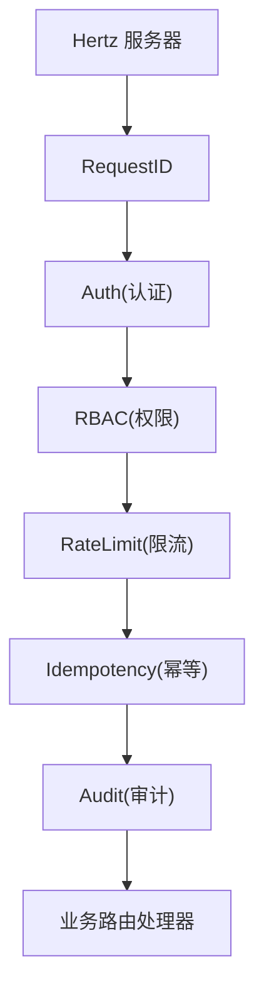
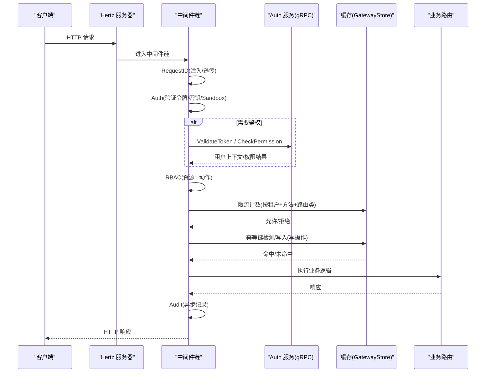
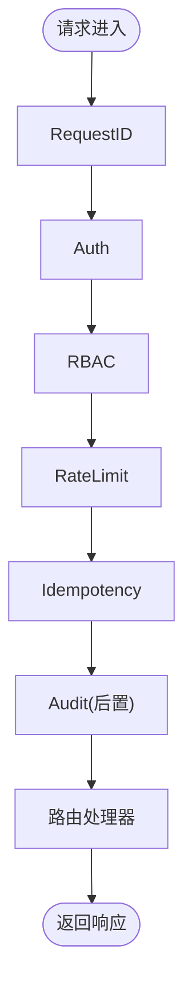
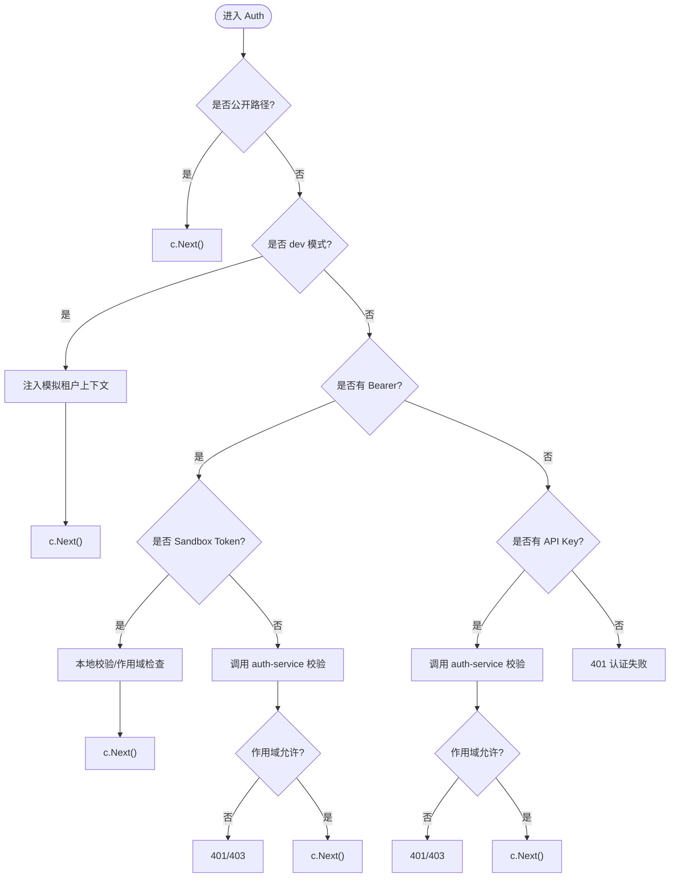
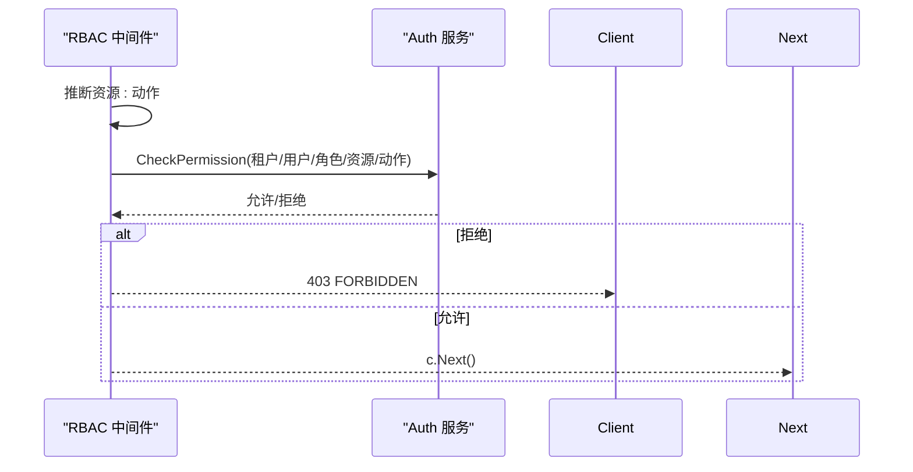
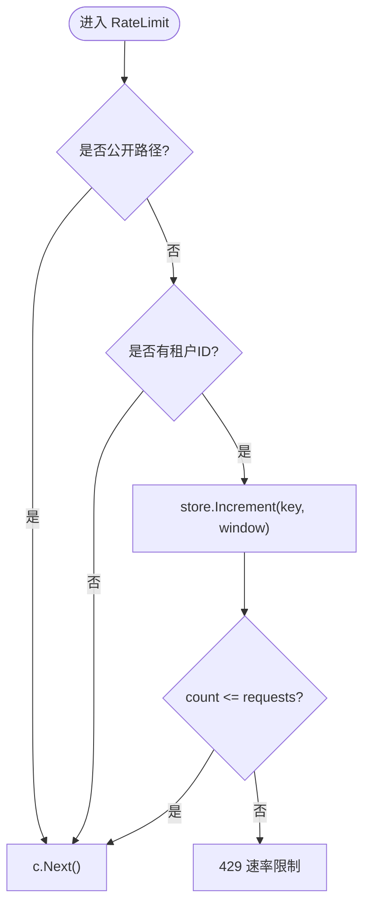
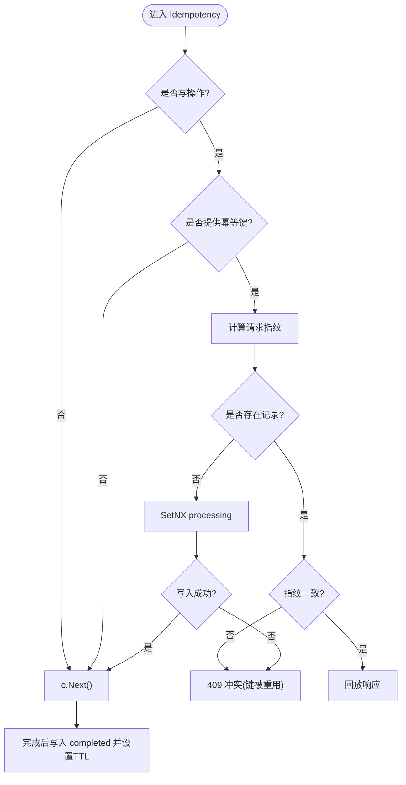
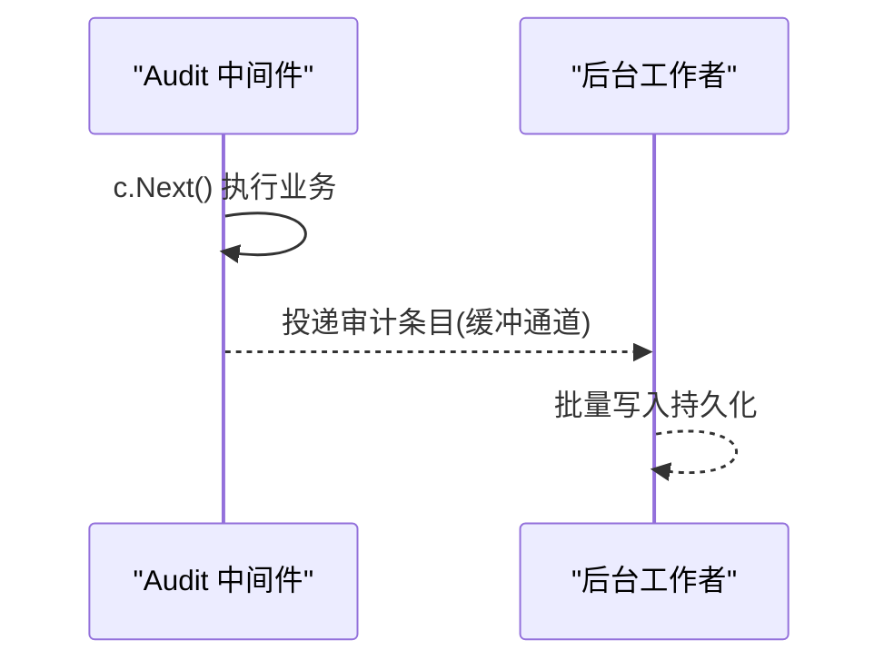
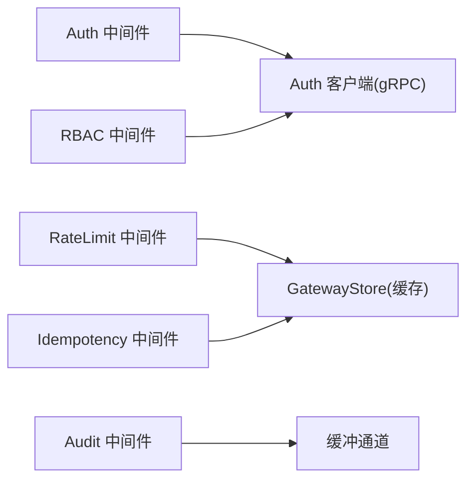

# 中间件系统

<cite>
**本文引用的文件**
- [chain.go](file://repo/services/ani-gateway/internal/middleware/chain.go)
- [auth.go](file://repo/services/ani-gateway/internal/middleware/auth.go)
- [auth_client.go](file://repo/services/ani-gateway/internal/middleware/auth_client.go)
- [rbac.go](file://repo/services/ani-gateway/internal/middleware/rbac.go)
- [ratelimit.go](file://repo/services/ani-gateway/internal/middleware/ratelimit.go)
- [idempotency.go](file://repo/services/ani-gateway/internal/middleware/idempotency.go)
- [audit.go](file://repo/services/ani-gateway/internal/middleware/audit.go)
- [request_id.go](file://repo/services/ani-gateway/internal/middleware/request_id.go)
- [store.go](file://repo/services/ani-gateway/internal/middleware/store.go)
</cite>

## 目录
1. [简介](#简介)
2. [项目结构](#项目结构)
3. [核心组件](#核心组件)
4. [架构总览](#架构总览)
5. [详细组件分析](#详细组件分析)
6. [依赖关系分析](#依赖关系分析)
7. [性能考虑](#性能考虑)
8. [故障排查指南](#故障排查指南)
9. [结论](#结论)
10. [附录](#附录)

## 简介
本文件系统性文档化 ANI Gateway 的中间件体系，涵盖中间件链设计、执行顺序、注册机制、错误处理策略，以及认证（Auth）、RBAC 权限控制、限流（RateLimit）、审计日志（Audit）、幂等性保证（Idempotency）等核心中间件的实现原理与使用方法。同时提供自定义中间件的编写范式、配置项说明、性能考量与最佳实践，并解释中间件与路由的生命周期绑定方式。

## 项目结构
Gateway 的中间件位于 services/ani-gateway/internal/middleware 目录下，通过统一的 Register 函数将中间件按固定顺序挂载到 Hertz 服务上。请求进入后依次经过 RequestID → Auth → RBAC → RateLimit → Idempotency → Audit，最终到达具体路由处理器。

图表来源
- [chain.go:7-21](file://repo/services/ani-gateway/internal/middleware/chain.go#L7-L21)

章节来源
- [chain.go:1-22](file://repo/services/ani-gateway/internal/middleware/chain.go#L1-L22)

## 核心组件
- 请求标识：为每个请求生成或透传唯一 ID，便于追踪与审计。
- 认证（Auth）：支持 JWT Bearer、API Key、Sandbox Token 三种认证方式；在 dev 模式下可注入模拟租户上下文。
- 权限（RBAC）：基于角色与资源/动作进行授权检查，调用 auth-service 校验。
- 限流（RateLimit）：按租户维度对请求进行窗口计数限制，使用共享缓存存储。
- 幂等（Idempotency）：基于 Idempotency-Key 对写操作进行去重与结果回放，支持过期与并发保护。
- 审计（Audit）：异步记录每次 API 调用的关键信息，不阻塞主流程。
- 存储抽象：限流与幂等通过统一 GatewayStore 接口访问底层缓存。

章节来源
- [request_id.go:13-33](file://repo/services/ani-gateway/internal/middleware/request_id.go#L13-L33)
- [auth.go:18-142](file://repo/services/ani-gateway/internal/middleware/auth.go#L18-L142)
- [rbac.go:14-72](file://repo/services/ani-gateway/internal/middleware/rbac.go#L14-L72)
- [ratelimit.go:14-40](file://repo/services/ani-gateway/internal/middleware/ratelimit.go#L14-L40)
- [idempotency.go:31-125](file://repo/services/ani-gateway/internal/middleware/idempotency.go#L31-L125)
- [audit.go:10-32](file://repo/services/ani-gateway/internal/middleware/audit.go#L10-L32)
- [store.go:1-6](file://repo/services/ani-gateway/internal/middleware/store.go#L1-L6)

## 架构总览
中间件链由 Register 集中装配，所有中间件以 Hertz 的 app.HandlerFunc 形式串联。认证与权限均依赖 auth-service 的 gRPC 客户端；限流与幂等依赖共享缓存（GatewayStore）。审计通过缓冲通道异步落盘，避免影响响应时延。

图表来源
- [chain.go:7-21](file://repo/services/ani-gateway/internal/middleware/chain.go#L7-L21)
- [auth_client.go:33-59](file://repo/services/ani-gateway/internal/middleware/auth_client.go#L33-L59)
- [ratelimit.go:47-56](file://repo/services/ani-gateway/internal/middleware/ratelimit.go#L47-L56)
- [idempotency.go:31-125](file://repo/services/ani-gateway/internal/middleware/idempotency.go#L31-L125)
- [audit.go:12-32](file://repo/services/ani-gateway/internal/middleware/audit.go#L12-L32)

## 详细组件分析

### 中间件链与生命周期
- 注册入口：Register(h, store) 将中间件按固定顺序挂载到 Hertz 实例。
- 执行顺序：RequestID → Auth → RBAC → RateLimit → Idempotency → Audit → 路由。
- 生命周期：每个中间件在 c.Next(ctx) 前后分别承担“前置处理”和“后置处理”，例如审计在响应后收集状态码与耗时。

图表来源
- [chain.go:7-21](file://repo/services/ani-gateway/internal/middleware/chain.go#L7-L21)

章节来源
- [chain.go:1-22](file://repo/services/ani-gateway/internal/middleware/chain.go#L1-L22)

### 认证中间件（Auth）
- 支持三种身份源：
  - JWT Bearer：调用 auth-service 校验，设置租户、用户、角色与作用域。
  - API Key：同样调用 auth-service 校验，默认租户作用域，禁止访问平台管理路由。
  - Sandbox Token：本地 HMAC 校验，仅允许访问沙箱子资源。
- 白名单路径：健康检查、品牌、登录、刷新等公开路径跳过认证。
- Dev 模式：可通过环境变量启用开发模式，注入模拟租户上下文，便于联调。
- 作用域隔离：平台/管理路由仅限 platform 作用域；sandbox token 仅限沙箱子资源；其余路由仅限 tenant 作用域。

图表来源
- [auth.go:18-142](file://repo/services/ani-gateway/internal/middleware/auth.go#L18-L142)
- [auth.go:199-229](file://repo/services/ani-gateway/internal/middleware/auth.go#L199-L229)

章节来源
- [auth.go:18-142](file://repo/services/ani-gateway/internal/middleware/auth.go#L18-L142)
- [auth.go:199-229](file://repo/services/ani-gateway/internal/middleware/auth.go#L199-L229)

### RBAC 权限控制
- 权限推断：根据 HTTP 方法与路径推断资源与动作（如 GET→get，POST→create 等）。
- 权限校验：调用 auth-service 的 CheckPermission，传入租户、用户、角色、资源、动作。
- 特殊路径：公开路径与 dev 模式直接放行；sandbox token 走专用放行规则。
- 错误处理：权限不足返回 403，包含原因信息。

图表来源
- [rbac.go:14-72](file://repo/services/ani-gateway/internal/middleware/rbac.go#L14-L72)
- [rbac.go:74-98](file://repo/services/ani-gateway/internal/middleware/rbac.go#L74-L98)

章节来源
- [rbac.go:14-72](file://repo/services/ani-gateway/internal/middleware/rbac.go#L14-L72)
- [rbac.go:74-98](file://repo/services/ani-gateway/internal/middleware/rbac.go#L74-L98)

### 限流中间件（RateLimit）
- 维度：按租户 + HTTP 方法 + 路由类别（如 instances、storage 等）进行窗口计数。
- 存储：通过 GatewayStore 的 Increment 原子递增，判断是否超过阈值。
- 配置：通过环境变量 GATEWAY_RATE_LIMIT_REQUESTS 与 GATEWAY_RATE_LIMIT_WINDOW 控制。
- 行为：未配置或阈值为 0 时不生效；存储不可用返回 503；超限返回 429。

图表来源
- [ratelimit.go:14-40](file://repo/services/ani-gateway/internal/middleware/ratelimit.go#L14-L40)
- [ratelimit.go:47-86](file://repo/services/ani-gateway/internal/middleware/ratelimit.go#L47-L86)

章节来源
- [ratelimit.go:14-40](file://repo/services/ani-gateway/internal/middleware/ratelimit.go#L14-L40)
- [ratelimit.go:47-86](file://repo/services/ani-gateway/internal/middleware/ratelimit.go#L47-L86)

### 幂等性保证（Idempotency）
- 适用方法：POST、PUT、PATCH、DELETE。
- 键来源：优先读取请求头 Idempotency-Key，其次从 JSON 体中解析 idempotency_key。
- 指纹：对方法、路径、查询串与规范化后的请求体计算哈希，防止篡改。
- 流程：
  - 若命中已完成记录：直接回放响应，并设置回放头。
  - 若存在进行中记录：冲突返回 409。
  - 否则写入 processing 状态，执行业务逻辑后写入 completed 状态及响应。
  - 沙箱令牌路径：若响应包含 expires_at，则按该时间作为 TTL 并维护元数据。
- 错误：存储不可用返回 503；指纹不一致返回 409。

图表来源
- [idempotency.go:31-125](file://repo/services/ani-gateway/internal/middleware/idempotency.go#L31-L125)
- [idempotency.go:127-182](file://repo/services/ani-gateway/internal/middleware/idempotency.go#L127-L182)
- [idempotency.go:184-214](file://repo/services/ani-gateway/internal/middleware/idempotency.go#L184-L214)

章节来源
- [idempotency.go:31-125](file://repo/services/ani-gateway/internal/middleware/idempotency.go#L31-L125)
- [idempotency.go:127-182](file://repo/services/ani-gateway/internal/middleware/idempotency.go#L127-L182)
- [idempotency.go:184-214](file://repo/services/ani-gateway/internal/middleware/idempotency.go#L184-L214)

### 审计日志（Audit）
- 非阻塞：在响应发送后异步记录请求 ID、租户、方法、路径、状态码、耗时。
- 背压：通过带缓冲通道将条目投递给后台工作者，满则丢弃（可接受）。
- 扩展：后续可接入批量写入数据库或消息队列。

图表来源
- [audit.go:10-32](file://repo/services/ani-gateway/internal/middleware/audit.go#L10-L32)
- [audit.go:43-55](file://repo/services/ani-gateway/internal/middleware/audit.go#L43-L55)

章节来源
- [audit.go:10-32](file://repo/services/ani-gateway/internal/middleware/audit.go#L10-L32)
- [audit.go:43-55](file://repo/services/ani-gateway/internal/middleware/audit.go#L43-L55)

### 请求标识（RequestID）
- 行为：若请求头 X-Request-ID 不存在则生成 UUID，并回写到响应头。
- 用途：贯穿全链路追踪，审计与错误响应中携带。

章节来源
- [request_id.go:13-33](file://repo/services/ani-gateway/internal/middleware/request_id.go#L13-L33)

### 存储抽象（GatewayStore）
- 定义：GatewayStore 别名指向 ports.CacheStore，供限流与幂等使用。
- 能力：Get/Set/SetNX/Increment/Delete 等基础缓存操作。

章节来源
- [store.go:1-6](file://repo/services/ani-gateway/internal/middleware/store.go#L1-L6)

## 依赖关系分析
- 认证与权限依赖 auth-service 的 gRPC 客户端，用于令牌校验与权限判定。
- 限流与幂等依赖共享缓存（GatewayStore），需确保高可用与一致性。
- 审计依赖缓冲通道与后台工作者，解耦写入路径。

图表来源
- [auth_client.go:33-59](file://repo/services/ani-gateway/internal/middleware/auth_client.go#L33-L59)
- [ratelimit.go:47-56](file://repo/services/ani-gateway/internal/middleware/ratelimit.go#L47-L56)
- [idempotency.go:31-125](file://repo/services/ani-gateway/internal/middleware/idempotency.go#L31-L125)
- [audit.go:43-55](file://repo/services/ani-gateway/internal/middleware/audit.go#L43-L55)

章节来源
- [auth_client.go:33-59](file://repo/services/ani-gateway/internal/middleware/auth_client.go#L33-L59)
- [ratelimit.go:47-56](file://repo/services/ani-gateway/internal/middleware/ratelimit.go#L47-L56)
- [idempotency.go:31-125](file://repo/services/ani-gateway/internal/middleware/idempotency.go#L31-L125)
- [audit.go:43-55](file://repo/services/ani-gateway/internal/middleware/audit.go#L43-L55)

## 性能考虑
- 认证超时：gRPC 客户端调用带有超时控制，避免阻塞请求。
- 限流与幂等：使用原子操作与 SetNX 减少竞争；合理设置缓存 TTL。
- 审计：异步写入，缓冲通道避免峰值抖动影响响应时延。
- 作用域过滤：提前拦截无效作用域的请求，降低后续开销。
- 建议：在高并发场景下评估缓存与 auth-service 的容量与延迟，必要时引入本地缓存或熔断降级。

[本节为通用性能指导，不直接分析具体文件]

## 故障排查指南
- 认证失败：
  - 现象：401 UNAUTHORIZED。
  - 排查：确认 Authorization/X-API-Key 是否正确；dev 模式是否开启；作用域是否匹配目标路由。
- 权限不足：
  - 现象：403 FORBIDDEN。
  - 排查：检查 RBAC 推断的资源与动作；确认用户角色与权限策略；auth-service 是否可达。
- 限流触发：
  - 现象：429 RATE_LIMIT_EXCEEDED。
  - 排查：调整 GATEWAY_RATE_LIMIT_REQUESTS/WINDOW；检查缓存可用性。
- 幂等冲突：
  - 现象：409 CONFLICT。
  - 排查：确认 Idempotency-Key 唯一性；避免重复提交；检查指纹是否因请求体变化而不同。
- 存储不可用：
  - 现象：503 IDEMPOTENCY_UNAVAILABLE/RATE_LIMIT_UNAVAILABLE。
  - 排查：检查缓存服务健康与网络连通性。
- 审计丢失：
  - 现象：部分审计条目未持久化。
  - 排查：检查后台工作者是否启动；缓冲通道是否长期满载。

章节来源
- [auth.go:82-141](file://repo/services/ani-gateway/internal/middleware/auth.go#L82-L141)
- [rbac.go:46-70](file://repo/services/ani-gateway/internal/middleware/rbac.go#L46-L70)
- [ratelimit.go:27-39](file://repo/services/ani-gateway/internal/middleware/ratelimit.go#L27-L39)
- [idempotency.go:50-98](file://repo/services/ani-gateway/internal/middleware/idempotency.go#L50-L98)
- [audit.go:47-55](file://repo/services/ani-gateway/internal/middleware/audit.go#L47-L55)

## 结论
本中间件系统以清晰的链式结构与严格的职责划分，实现了安全、可控、可观测的网关层能力。通过认证、RBAC、限流、幂等与审计的组合，既保障了多租户环境下的安全性与稳定性，又提供了良好的可观测性与可维护性。建议在上线前结合业务特征调优限流与幂等策略，并确保缓存与 auth-service 的高可用。

[本节为总结性内容，不直接分析具体文件]

## 附录

### 中间件配置与环境变量
- 认证模式：ANI_AUTH_MODE=dev（开发模式，跳过真实认证）。
- 限流配置：
  - GATEWAY_RATE_LIMIT_REQUESTS：每窗口最大请求数。
  - GATEWAY_RATE_LIMIT_WINDOW：窗口时长（如 1s、1m）。
- 审计：无需额外配置，需确保后台工作者已启动。

章节来源
- [auth.go:33-48](file://repo/services/ani-gateway/internal/middleware/auth.go#L33-L48)
- [ratelimit.go:58-72](file://repo/services/ani-gateway/internal/middleware/ratelimit.go#L58-L72)
- [audit.go:47-55](file://repo/services/ani-gateway/internal/middleware/audit.go#L47-L55)

### 自定义中间件编写指南
- 签名：实现 app.HandlerFunc，接收 context 与 RequestContext。
- 顺序：在 Register 中按业务需求插入到合适位置。
- 上下文：通过 c.Set/c.Get 传递跨中间件数据（如租户、用户、作用域）。
- 错误：使用 respondError 输出统一错误格式，并调用 c.Abort 终止后续处理。
- 示例要点：
  - 前置：参数校验、上下文注入。
  - 后置：指标统计、响应修改、审计记录。

章节来源
- [chain.go:7-21](file://repo/services/ani-gateway/internal/middleware/chain.go#L7-L21)
- [request_id.go:53-61](file://repo/services/ani-gateway/internal/middleware/request_id.go#L53-L61)

### 中间件与路由绑定与生命周期
- 绑定方式：通过 Register(h, store) 将中间件挂载到 Hertz 实例，所有路由共享同一中间件链。
- 生命周期：
  - 前置阶段：在 c.Next() 之前执行，如鉴权、限流、幂等预检。
  - 后置阶段：在 c.Next() 之后执行，如审计、指标上报、响应增强。
- 注意：中间件应尽早失败（fail-fast），减少不必要的下游调用。

章节来源
- [chain.go:7-21](file://repo/services/ani-gateway/internal/middleware/chain.go#L7-L21)
- [audit.go:12-32](file://repo/services/ani-gateway/internal/middleware/audit.go#L12-L32)