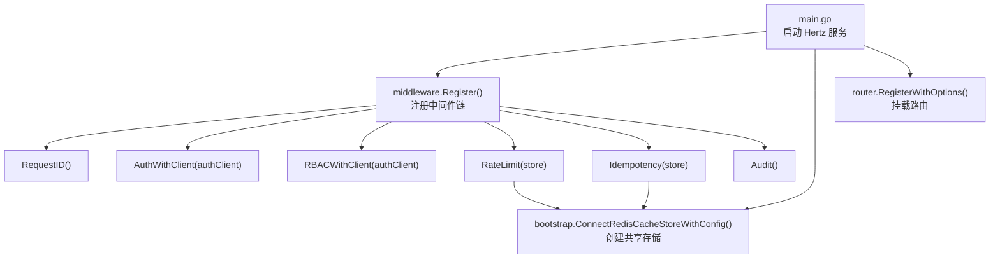
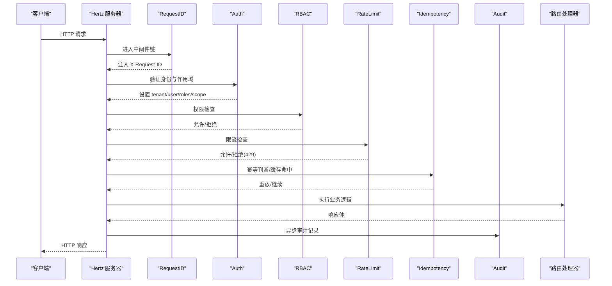
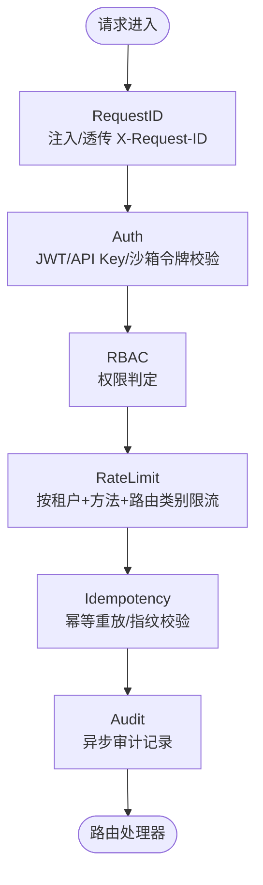
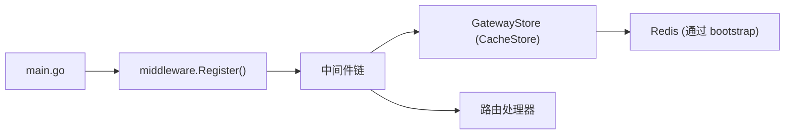

# 中间件链设计

<cite>
**本文引用的文件**
- [services/ani-gateway/internal/middleware/chain.go](file://repo/services/ani-gateway/internal/middleware/chain.go)
- [services/ani-gateway/main.go](file://repo/services/ani-gateway/main.go)
- [services/ani-gateway/internal/middleware/request_id.go](file://repo/services/ani-gateway/internal/middleware/request_id.go)
- [services/ani-gateway/internal/middleware/auth.go](file://repo/services/ani-gateway/internal/middleware/auth.go)
- [services/ani-gateway/internal/middleware/rbac.go](file://repo/services/ani-gateway/internal/middleware/rbac.go)
- [services/ani-gateway/internal/middleware/ratelimit.go](file://repo/services/ani-gateway/internal/middleware/ratelimit.go)
- [services/ani-gateway/internal/middleware/idempotency.go](file://repo/services/ani-gateway/internal/middleware/idempotency.go)
- [services/ani-gateway/internal/middleware/audit.go](file://repo/services/ani-gateway/internal/middleware/audit.go)
- [services/ani-gateway/internal/middleware/store.go](file://repo/services/ani-gateway/internal/middleware/store.go)
- [pkg/ports/cache_store.go](file://repo/pkg/ports/cache_store.go)
</cite>

## 目录
1. [简介](#简介)
2. [项目结构](#项目结构)
3. [核心组件](#核心组件)
4. [架构总览](#架构总览)
5. [详细组件分析](#详细组件分析)
6. [依赖关系分析](#依赖关系分析)
7. [性能考量](#性能考量)
8. [故障排查指南](#故障排查指南)
9. [结论](#结论)
10. [附录](#附录)

## 简介
本文件系统性文档化 ANI Gateway 的中间件链设计与实现，覆盖以下目标：
- 明确中间件的注册机制与执行顺序：RequestID → TLS（由 Hertz 服务器层提供）→ Auth → RBAC → RateLimit → Idempotency → Audit → Route。
- 说明 Hertz 服务器的中间件集成方式：依赖注入、配置管理、生命周期管理。
- 解释中间件链的扩展机制与自定义中间件编写方法。
- 给出添加新中间件的具体步骤与示例路径。
- 文档化中间件间通信与数据传递机制（请求上下文键、Go context 注入、响应头与缓存存储）。

## 项目结构
ANI Gateway 的中间件位于 services/ani-gateway/internal/middleware 包中，通过 chain.Register 统一挂载到 Hertz 服务实例；共享存储通过 bootstrap.ConnectRedisCacheStoreWithConfig 创建并注入到需要持久化的中间件（RateLimit、Idempotency）。审计日志通过后台 goroutine 异步落盘，不阻塞请求路径。

**图表来源**
- [services/ani-gateway/main.go:134-168](file://repo/services/ani-gateway/main.go#L134-L168)
- [services/ani-gateway/internal/middleware/chain.go:7-21](file://repo/services/ani-gateway/internal/middleware/chain.go#L7-L21)

**章节来源**
- [services/ani-gateway/main.go:20-220](file://repo/services/ani-gateway/main.go#L20-L220)
- [services/ani-gateway/internal/middleware/chain.go:1-22](file://repo/services/ani-gateway/internal/middleware/chain.go#L1-L22)

## 核心组件
- RequestID：为每个请求生成或透传唯一 ID，写入请求上下文与响应头，便于全链路追踪。
- Auth：校验 JWT Bearer、API Key 或沙箱令牌，设置租户、用户、角色与作用域，并将租户上下文注入 Go context。
- RBAC：基于资源与动作推断权限，调用认证客户端进行鉴权决策。
- RateLimit：基于共享存储按租户+方法+路由类别窗口计数限流，超限返回 429。
- Idempotency：对写操作进行幂等重放，使用共享存储缓存处理结果，支持过期策略与指纹校验。
- Audit：非阻塞记录每次 API 调用的审计条目，包含请求 ID、租户、方法、路径、状态码与耗时。

**章节来源**
- [services/ani-gateway/internal/middleware/request_id.go:13-33](file://repo/services/ani-gateway/internal/middleware/request_id.go#L13-L33)
- [services/ani-gateway/internal/middleware/auth.go:18-141](file://repo/services/ani-gateway/internal/middleware/auth.go#L18-L141)
- [services/ani-gateway/internal/middleware/rbac.go:14-71](file://repo/services/ani-gateway/internal/middleware/rbac.go#L14-L71)
- [services/ani-gateway/internal/middleware/ratelimit.go:14-56](file://repo/services/ani-gateway/internal/middleware/ratelimit.go#L14-L56)
- [services/ani-gateway/internal/middleware/idempotency.go:31-124](file://repo/services/ani-gateway/internal/middleware/idempotency.go#L31-L124)
- [services/ani-gateway/internal/middleware/audit.go:10-31](file://repo/services/ani-gateway/internal/middleware/audit.go#L10-L31)

## 架构总览
中间件链在 Hertz 中以 Use 方式注册，形成“请求进入 → 中间件依次处理 → 路由处理器 → 响应回传 → 后置中间件”的执行模型。TLS 终止由 Hertz 服务器层负责，不在应用中间件内实现。

**图表来源**
- [services/ani-gateway/internal/middleware/chain.go:7-21](file://repo/services/ani-gateway/internal/middleware/chain.go#L7-L21)
- [services/ani-gateway/internal/middleware/request_id.go:13-23](file://repo/services/ani-gateway/internal/middleware/request_id.go#L13-L23)
- [services/ani-gateway/internal/middleware/auth.go:26-141](file://repo/services/ani-gateway/internal/middleware/auth.go#L26-L141)
- [services/ani-gateway/internal/middleware/rbac.go:21-71](file://repo/services/ani-gateway/internal/middleware/rbac.go#L21-L71)
- [services/ani-gateway/internal/middleware/ratelimit.go:15-39](file://repo/services/ani-gateway/internal/middleware/ratelimit.go#L15-L39)
- [services/ani-gateway/internal/middleware/idempotency.go:32-124](file://repo/services/ani-gateway/internal/middleware/idempotency.go#L32-L124)
- [services/ani-gateway/internal/middleware/audit.go:12-31](file://repo/services/ani-gateway/internal/middleware/audit.go#L12-L31)

## 详细组件分析

### 中间件注册与执行顺序
- 注册入口：chain.Register(h, store) 将中间件以固定顺序挂载到 Hertz 实例。
- 执行顺序：RequestID → Auth → RBAC → RateLimit → Idempotency → Audit → Route。
- 注意：注释中标注了 TLS 位置，实际 TLS 由 Hertz 服务器层处理，不在应用中间件链中实现。

**图表来源**
- [services/ani-gateway/internal/middleware/chain.go:1-21](file://repo/services/ani-gateway/internal/middleware/chain.go#L1-L21)

**章节来源**
- [services/ani-gateway/internal/middleware/chain.go:1-21](file://repo/services/ani-gateway/internal/middleware/chain.go#L1-L21)

### RequestID 中间件
- 功能：从请求头读取或生成唯一 request_id，写入上下文与响应头，供后续中间件与处理器使用。
- 数据传递：通过 RequestContext.Set/Get 存取 keyRequestID；同时提供 GetTenantID、GetUserID 辅助读取 Auth 设置的上下文。
- 错误响应：respondError 统一输出包含 request_id 的错误体。

**章节来源**
- [services/ani-gateway/internal/middleware/request_id.go:13-61](file://repo/services/ani-gateway/internal/middleware/request_id.go#L13-L61)

### Auth 中间件
- 功能：校验 Bearer Token、API Key 或沙箱令牌；设置 tenant_id、user_id、roles、scope；将租户上下文注入 Go context 以便下游 RLS-aware 存储使用。
- 白名单：公共路径直接放行；开发模式可跳过鉴权。
- 作用域隔离：平台/管理路由仅允许 platform scope；沙箱 token 仅允许特定子资源路径。

**章节来源**
- [services/ani-gateway/internal/middleware/auth.go:18-229](file://repo/services/ani-gateway/internal/middleware/auth.go#L18-L229)

### RBAC 中间件
- 功能：根据方法与路径推断资源与动作，调用认证客户端进行权限检查；沙箱 token 走特殊路径授权。
- 失败处理：未携带租户上下文或权限不足时返回 403。

**章节来源**
- [services/ani-gateway/internal/middleware/rbac.go:14-98](file://repo/services/ani-gateway/internal/middleware/rbac.go#L14-L98)

### RateLimit 中间件
- 功能：基于共享存储按租户+方法+路由类别进行窗口计数限流；超限返回 429；不可用时返回 503。
- 配置：通过环境变量 GATEWAY_RATE_LIMIT_REQUESTS 与 GATEWAY_RATE_LIMIT_WINDOW 控制阈值与时窗。
- 键生成：rateLimitKey(tenantID, method, routeClass(path))。

**章节来源**
- [services/ani-gateway/internal/middleware/ratelimit.go:14-86](file://repo/services/ani-gateway/internal/middleware/ratelimit.go#L14-L86)

### Idempotency 中间件
- 功能：对写操作进行幂等重放；使用共享存储缓存处理结果；支持指纹校验防止 key 复用；沙箱 token 路径支持结果过期策略。
- 行为：首次请求标记 processing，完成后缓存 completed；重复请求若指纹一致则重放响应，否则冲突。
- 键生成：idempotencyCacheKey(scope, tenantID, method, path, idempotencyKey)。

**章节来源**
- [services/ani-gateway/internal/middleware/idempotency.go:31-214](file://repo/services/ani-gateway/internal/middleware/idempotency.go#L31-L214)

### Audit 中间件
- 功能：在响应发送后异步记录审计条目，包含 request_id、tenant_id、method、path、status_code、duration_ms。
- 实现：通过带缓冲通道将条目投递给后台 goroutine 消费，避免阻塞请求路径。

**章节来源**
- [services/ani-gateway/internal/middleware/audit.go:10-55](file://repo/services/ani-gateway/internal/middleware/audit.go#L10-L55)

### 共享存储接口
- GatewayStore 抽象了 CacheStore 能力，供 RateLimit 与 Idempotency 使用，包括 Increment、SetNX、Get、Set、Delete、Exists。
- 生产环境通过 bootstrap.ConnectRedisCacheStoreWithConfig 连接 Redis，并在 main 中关闭资源。

**章节来源**
- [services/ani-gateway/internal/middleware/store.go:1-6](file://repo/services/ani-gateway/internal/middleware/store.go#L1-L6)
- [pkg/ports/cache_store.go:8-15](file://repo/pkg/ports/cache_store.go#L8-L15)
- [services/ani-gateway/main.go:134-143](file://repo/services/ani-gateway/main.go#L134-L143)

## 依赖关系分析
- Hertz 服务器在 main 中创建并通过 middleware.Register 挂载中间件链，再注册路由。
- 中间件之间通过 RequestContext 键值传递上下文信息（如 tenant_id、user_id、roles、scope），以及 Go context 中的租户上下文。
- 需要持久化的中间件依赖 GatewayStore（CacheStore 实现），由 main 注入。

**图表来源**
- [services/ani-gateway/main.go:134-168](file://repo/services/ani-gateway/main.go#L134-L168)
- [services/ani-gateway/internal/middleware/chain.go:7-21](file://repo/services/ani-gateway/internal/middleware/chain.go#L7-L21)
- [services/ani-gateway/internal/middleware/store.go:1-6](file://repo/services/ani-gateway/internal/middleware/store.go#L1-L6)

**章节来源**
- [services/ani-gateway/main.go:134-208](file://repo/services/ani-gateway/main.go#L134-L208)
- [services/ani-gateway/internal/middleware/chain.go:7-21](file://repo/services/ani-gateway/internal/middleware/chain.go#L7-L21)

## 性能考量
- 限流：基于 Redis INCR + EXPIRE 的窗口计数，默认 100 req/s/tenant，可通过环境变量调整；不可用降级为 503。
- 幂等：写操作结果缓存 TTL 默认 24h；沙箱 token 路径支持从响应中提取 expires_at 动态缩短 TTL；并发相同 key 会返回冲突。
- 审计：异步写入，缓冲通道容量 1000，避免 DB 写入峰值阻塞请求路径。
- 鉴权：本地 dev 模式可快速绕过，生产需确保 auth service 可用；作用域隔离减少不必要的路径访问。

[本节为通用性能讨论，无需具体文件引用]

## 故障排查指南
- 鉴权失败：检查 Authorization/X-API-Key 是否正确；确认 isPublicPath 与 scopeAllowedForPath 是否符合预期；dev 模式下是否设置了 X-Dev-Tenant-ID。
- 权限拒绝：确认 RBAC 推断的资源与动作是否与后端策略匹配；检查 tenant/user/roles 是否正确注入。
- 限流触发：查看 GATEWAY_RATE_LIMIT_REQUESTS/WINDOW 配置；确认租户上下文是否存在；关注 Redis 可用性。
- 幂等冲突：检查 Idempotency-Key 或 body.idempotency_key 是否重复使用；关注指纹不一致导致的冲突；沙箱 token 路径的结果过期。
- 审计缺失：确认 StartAuditWorker 已调用；检查 auditCh 是否被消费；关注后台 goroutine 是否正常运行。

**章节来源**
- [services/ani-gateway/internal/middleware/auth.go:199-229](file://repo/services/ani-gateway/internal/middleware/auth.go#L199-L229)
- [services/ani-gateway/internal/middleware/rbac.go:21-71](file://repo/services/ani-gateway/internal/middleware/rbac.go#L21-L71)
- [services/ani-gateway/internal/middleware/ratelimit.go:15-56](file://repo/services/ani-gateway/internal/middleware/ratelimit.go#L15-L56)
- [services/ani-gateway/internal/middleware/idempotency.go:32-124](file://repo/services/ani-gateway/internal/middleware/idempotency.go#L32-L124)
- [services/ani-gateway/internal/middleware/audit.go:43-55](file://repo/services/ani-gateway/internal/middleware/audit.go#L43-L55)

## 结论
ANI Gateway 的中间件链采用清晰的分层与职责划分：请求标识、身份认证、权限控制、限流保护、幂等保障、审计记录，最终到达业务路由。通过统一的注册入口与共享存储接口，实现了高内聚、低耦合的可扩展架构。新增中间件只需遵循现有契约（上下文键、错误响应格式、存储接口），即可无缝接入。

[本节为总结性内容，无需具体文件引用]

## 附录

### 如何添加新的中间件到执行链
- 步骤：
  1. 在 middleware 包中实现新的 app.HandlerFunc。
  2. 如需共享存储，通过传入的 GatewayStore 参数进行读写。
  3. 在 chain.Register 中将新中间件插入到期望的位置（例如在 RateLimit 之后、Idempotency 之前）。
  4. 确保中间件正确处理公共路径、租户上下文缺失、错误响应与 c.Next 调用。
- 参考路径：
  - 注册入口：[services/ani-gateway/internal/middleware/chain.go:7-21](file://repo/services/ani-gateway/internal/middleware/chain.go#L7-L21)
  - 共享存储接口：[pkg/ports/cache_store.go:8-15](file://repo/pkg/ports/cache_store.go#L8-L15)
  - 错误响应工具：[services/ani-gateway/internal/middleware/request_id.go:53-61](file://repo/services/ani-gateway/internal/middleware/request_id.go#L53-L61)

### 中间件间通信与数据传递机制
- 请求上下文键：
  - request_id：由 RequestID 设置，用于全链路追踪。
  - tenant_id、user_id、roles、scope：由 Auth 设置，供 RBAC、RateLimit、Idempotency、Audit 使用。
- Go context 注入：
  - withTenantContext/withTenantContextStrict 将租户上下文注入 Go context，供 RLS-aware 存储使用。
- 响应头与缓存：
  - X-Request-ID：响应头携带请求 ID。
  - Idempotent-Replay：幂等重放时设置该响应头。
  - 共享存储：RateLimit 与 Idempotency 使用 GatewayStore 进行计数与结果缓存。

**章节来源**
- [services/ani-gateway/internal/middleware/request_id.go:13-33](file://repo/services/ani-gateway/internal/middleware/request_id.go#L13-L33)
- [services/ani-gateway/internal/middleware/auth.go:144-197](file://repo/services/ani-gateway/internal/middleware/auth.go#L144-L197)
- [services/ani-gateway/internal/middleware/idempotency.go:196-205](file://repo/services/ani-gateway/internal/middleware/idempotency.go#L196-L205)
- [services/ani-gateway/internal/middleware/ratelimit.go:74-86](file://repo/services/ani-gateway/internal/middleware/ratelimit.go#L74-L86)