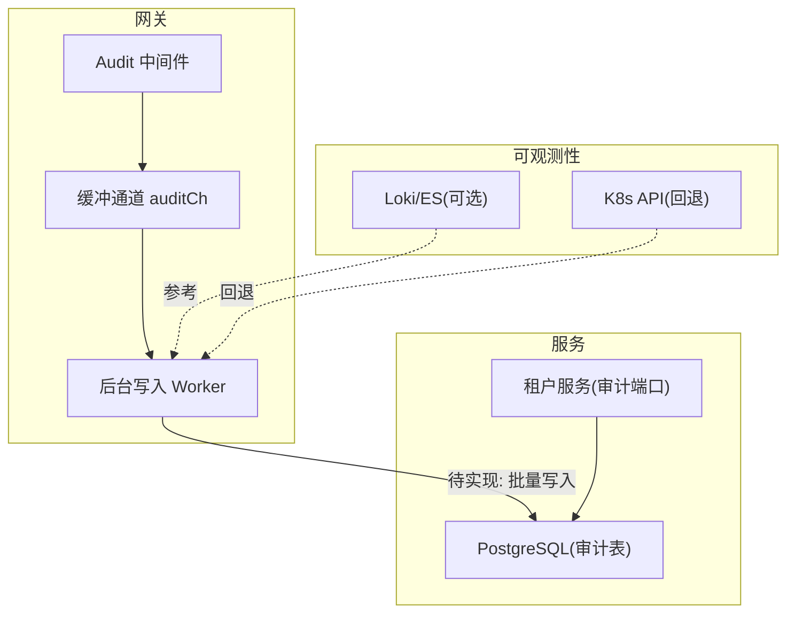
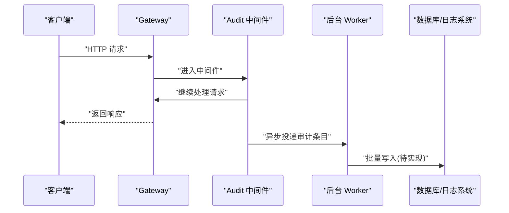
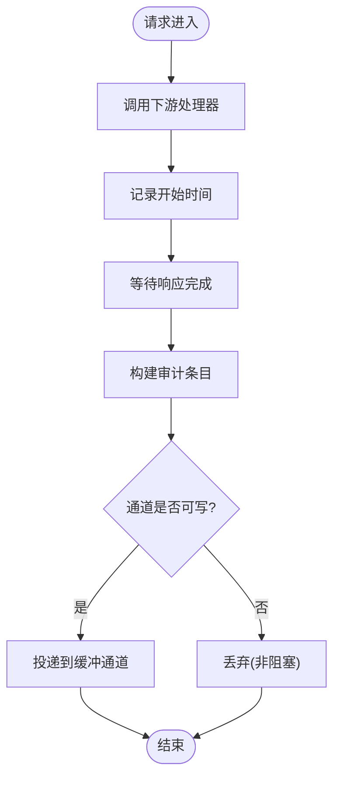
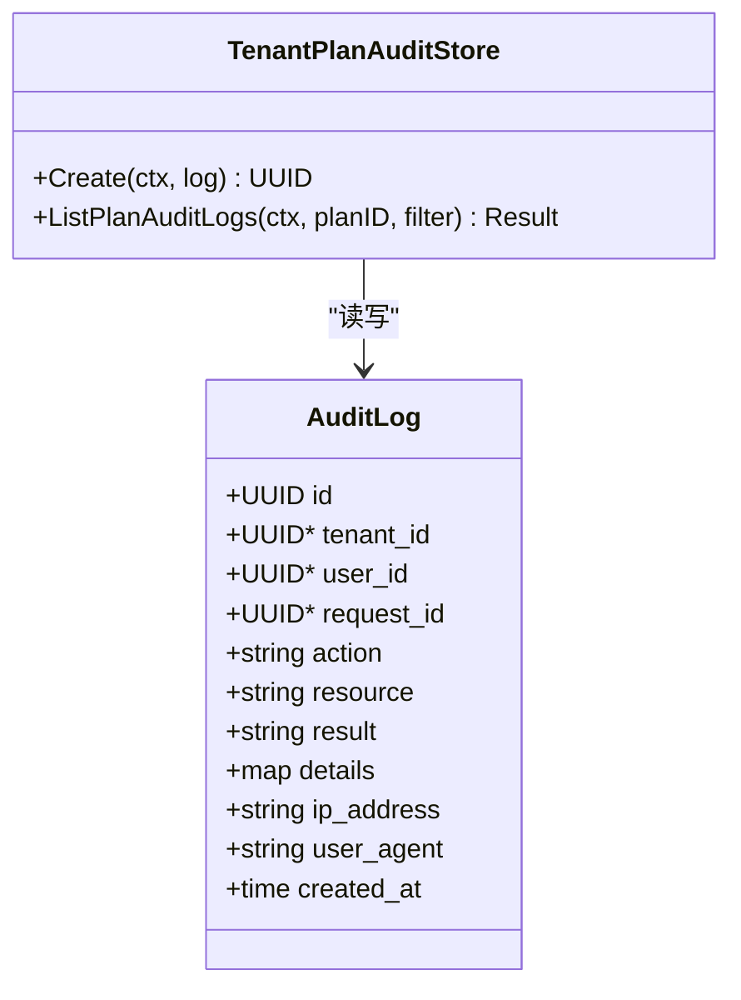
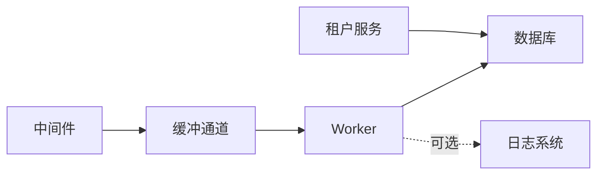

# 审计日志中间件

<cite>
**本文引用的文件**
- [audit.go](file://repo/services/ani-gateway/internal/middleware/audit.go)
- [tenant_plan_audit_store.go](file://repo/services/tenant-service/internal/repo/ports/tenant_plan_audit_store.go)
- [tenant_plan_audit_store.go](file://repo/services/tenant-service/internal/repo/adapters/postgres/tenant_plan_audit_store.go)
- [plan-instance-observability.md](file://repo/services/tasks/modules/plan/plan-instance-observability.md)
- [spec-console-instance-observability-completion.md](file://repo/services/tasks/modules/spec/console/compute/spec-console-instance-observability-completion.md)
- [openapi-phase3-agent-audit-draft.md](file://repo/services/docs/console-modules/openapi-drafts/phase3/openapi-phase3-agent-audit-draft.md)
</cite>

## 目录
1. [简介](#简介)
2. [项目结构](#项目结构)
3. [核心组件](#核心组件)
4. [架构总览](#架构总览)
5. [详细组件分析](#详细组件分析)
6. [依赖关系分析](#依赖关系分析)
7. [性能与采样](#性能与采样)
8. [敏感信息脱敏策略](#敏感信息脱敏策略)
9. [配置选项、日志轮转与归档](#配置选项日志轮转与归档)
10. [监控集成与数据分析](#监控集成与数据分析)
11. [故障排查指南](#故障排查指南)
12. [结论](#结论)

## 简介
本文件面向“审计日志中间件”的落地与使用，覆盖请求审计、操作审计与安全事件记录的记录机制、结构化格式、字段定义、存储策略、敏感信息脱敏、日志采样与性能优化、配置项、日志轮转与归档、以及监控集成与数据分析方法。文档同时给出可操作的配置示例与自定义审计事件的接入方式，帮助平台与业务团队在网关层统一采集审计数据并持久化到数据库或日志系统。

## 项目结构
当前仓库中审计相关能力分布在以下位置：
- 网关中间件：负责非阻塞地捕获每次 API 调用的基础审计条目（请求 ID、租户、方法、路径、状态码、耗时），并通过缓冲通道异步落库。
- 业务域审计：以配额套餐为例，定义了审计日志的数据模型、查询过滤与分页接口，并预留 PostgreSQL 实现占位。
- 实例可观测性：提供日志持久化方案（Loki/ES/K8s API）与多租户隔离思路，可作为审计日志采集与存储的参考实践。
- Agent 审计草案：定义了 Agent 行为审计的事件类型、字段与 RBAC 边界，可作为安全事件与操作审计的扩展参考。

图表来源
- [audit.go:10-55](file://repo/services/ani-gateway/internal/middleware/audit.go#L10-L55)
- [tenant_plan_audit_store.go:19-66](file://repo/services/tenant-service/internal/repo/ports/tenant_plan_audit_store.go#L19-L66)
- [plan-instance-observability.md:122-156](file://repo/services/tasks/modules/plan/plan-instance-observability.md#L122-L156)

章节来源
- [audit.go:10-55](file://repo/services/ani-gateway/internal/middleware/audit.go#L10-L55)
- [tenant_plan_audit_store.go:19-66](file://repo/services/tenant-service/internal/repo/ports/tenant_plan_audit_store.go#L19-L66)
- [plan-instance-observability.md:122-156](file://repo/services/tasks/modules/plan/plan-instance-observability.md#L122-L156)

## 核心组件
- 网关审计中间件
  - 职责：在响应发送后捕获请求元数据，构造审计条目，通过缓冲通道异步投递，不阻塞主请求路径。
  - 关键特性：非阻塞、缓冲防抖、最小化开销。
- 审计数据模型（业务域）
  - 职责：定义审计日志的结构、过滤条件与分页返回，复用现有分区表约定。
  - 关键特性：资源/动作/结果/详情等字段，支持游标分页。
- 审计存储适配器（预留）
  - 职责：基于 PostgreSQL 实现审计日志的写入与查询（当前为占位）。
  - 关键特性：与端口接口解耦，便于后续替换或扩展。

章节来源
- [audit.go:10-55](file://repo/services/ani-gateway/internal/middleware/audit.go#L10-L55)
- [tenant_plan_audit_store.go:19-66](file://repo/services/tenant-service/internal/repo/ports/tenant_plan_audit_store.go#L19-L66)
- [tenant_plan_audit_store.go:11-33](file://repo/services/tenant-service/internal/repo/adapters/postgres/tenant_plan_audit_store.go#L11-L33)

## 架构总览
审计日志整体流程分为三层：
- 采集层（网关中间件）：捕获请求级审计条目，异步投递。
- 处理层（后台 Worker）：消费缓冲通道，进行批处理与落库（待实现）。
- 存储层（数据库/日志系统）：持久化审计日志；对于实例日志，可参考 Loki/ES/K8s API 的多后端选择与回退策略。

图表来源
- [audit.go:10-55](file://repo/services/ani-gateway/internal/middleware/audit.go#L10-L55)

## 详细组件分析

### 网关审计中间件
- 功能要点
  - 在响应完成后收集 RequestID、TenantID、Method、Path、StatusCode、DurationMs。
  - 通过带缓冲的 channel 将审计条目投递给后台 worker，避免阻塞请求路径。
  - 当通道满时直接丢弃，保证高吞吐下不影响主流程。
- 数据结构
  - 审计条目包含请求追踪、租户、HTTP 方法与路径、状态码、耗时等关键字段。
- 扩展点
  - 可在中间件中注入更多上下文（如用户代理、来源 IP、操作意图标签），并在 worker 中按业务域分类写入不同表或主题。

图表来源
- [audit.go:10-55](file://repo/services/ani-gateway/internal/middleware/audit.go#L10-L55)

章节来源
- [audit.go:10-55](file://repo/services/ani-gateway/internal/middleware/audit.go#L10-L55)

### 业务域审计数据模型（配额套餐）
- 数据模型
  - 审计日志包含 ID、租户 ID、用户 ID、请求 ID、Action、Resource、Result、Details、IP、UA、创建时间等。
  - 查询支持 Resource、Action、Result 过滤与游标分页。
- 存储约定
  - 复用现有 audit_logs 分区表，平台级操作 tenant_id 可为 NULL。
  - 资源类型为 tenant_plan，details 中包含 plan_id 等扩展信息。
- 接口设计
  - Create：写入一条审计日志并返回 ID。
  - ListPlanAuditLogs：按 planID 查询历史，支持过滤与分页。

图表来源
- [tenant_plan_audit_store.go:19-66](file://repo/services/tenant-service/internal/repo/ports/tenant_plan_audit_store.go#L19-L66)

章节来源
- [tenant_plan_audit_store.go:19-66](file://repo/services/tenant-service/internal/repo/ports/tenant_plan_audit_store.go#L19-L66)
- [tenant_plan_audit_store.go:11-33](file://repo/services/tenant-service/internal/repo/adapters/postgres/tenant_plan_audit_store.go#L11-L33)

### 实例可观测性与日志持久化（参考）
- 架构思路
  - 通过 port 抽象与 adapter 注入，支持多种日志后端（Loki、Elasticsearch、K8s API）。
  - 未部署存储后端时自动回退到 K8s API，保证向后兼容。
- 多租户隔离
  - 使用 namespace label 过滤实现多租户隔离，不依赖 X-Scope-OrgID。
- 部署建议
  - 推荐 Fluent Bit 采集 Pod 日志到 Loki，Loki 存储于 MinIO S3。

章节来源
- [plan-instance-observability.md:122-156](file://repo/services/tasks/modules/plan/plan-instance-observability.md#L122-L156)
- [spec-console-instance-observability-completion.md:680-723](file://repo/services/tasks/modules/spec/console/compute/spec-console-instance-observability-completion.md#L680-L723)

### Agent 审计事件（参考）
- 事件类型
  - tool_call、tool_result、llm_request、llm_response、policy_hit、policy_denied、error。
- 字段约束
  - 必须包含 id、event_type、occurred_at；summary 不含完整 prompt；metadata 需 redact。
- 权限与可见性
  - 只读访问，禁止删除/篡改；Console 不得合并三类事件为单一 list API。

章节来源
- [openapi-phase3-agent-audit-draft.md:10-67](file://repo/services/docs/console-modules/openapi-drafts/phase3/openapi-phase3-agent-audit-draft.md#L10-L67)

## 依赖关系分析
- 耦合与内聚
  - 中间件仅依赖网关上下文与缓冲通道，低耦合；worker 与存储层通过接口解耦。
  - 业务域审计通过 ports 抽象，adapter 实现可替换。
- 外部依赖
  - 数据库（PostgreSQL）、日志系统（Loki/ES）、消息总线（NATS，用于其他模块，审计可借鉴）。
- 潜在循环依赖
  - 当前无循环依赖；中间件不反向依赖业务域审计。

图表来源
- [audit.go:10-55](file://repo/services/ani-gateway/internal/middleware/audit.go#L10-L55)
- [tenant_plan_audit_store.go:19-66](file://repo/services/tenant-service/internal/repo/ports/tenant_plan_audit_store.go#L19-L66)

章节来源
- [audit.go:10-55](file://repo/services/ani-gateway/internal/middleware/audit.go#L10-L55)
- [tenant_plan_audit_store.go:19-66](file://repo/services/tenant-service/internal/repo/ports/tenant_plan_audit_store.go#L19-L66)

## 性能与采样
- 非阻塞设计
  - 中间件在响应完成后异步投递，不阻塞请求路径。
  - 缓冲通道容量为 1000，防止 DB 写入抖动影响主流程。
- 丢日志策略
  - 通道满时直接丢弃，适用于审计场景（最终一致性优先）。
- 采样建议
  - 可按租户、路径或错误率动态调整采样比例，降低高吞吐下的写入压力。
  - 对高频健康检查或内部探针类请求可跳过审计。
- 批处理优化
  - 建议在 worker 中实现批量写入，减少连接获取与事务开销。

[本节为通用指导，无需具体文件引用]

## 敏感信息脱敏策略
- 原则
  - 不在审计日志中保留明文敏感信息（密码、密钥、令牌、完整请求体/响应体）。
  - 对 metadata 中的敏感键进行 redact，仅保留摘要或哈希。
- 实施建议
  - 在中间件或业务 handler 入口处对入参进行清洗，仅保留必要字段。
  - 对 agent 审计事件，summary 不包含完整 prompt/response，metadata 需后端 redact。
- 参考
  - Agent 审计草案明确要求 PII 脱敏与 summary 限制。

章节来源
- [openapi-phase3-agent-audit-draft.md:10-67](file://repo/services/docs/console-modules/openapi-drafts/phase3/openapi-phase3-agent-audit-draft.md#L10-L67)

## 配置选项、日志轮转与归档
- 网关中间件配置
  - 缓冲通道大小：默认 1000，可根据 QPS 与存储能力调整。
  - 启动 Worker：需在 main 中调用一次，确保后台写入 goroutine 运行。
- 存储后端选择（参考实例可观测性）
  - 环境变量控制：INSTANCE_OBSERVABILITY_LOG_STORE（loki/elasticsearch/k8s）。
  - Loki URL：INSTANCE_OBSERVABILITY_LOKI_URL，未设置时使用默认地址。
- 日志轮转与归档
  - 数据库侧：建议按时间分区（如月/季度），结合 RLS 与索引优化查询。
  - 日志系统侧：Loki 对象存储（MinIO S3）生命周期策略，按天/周归档与清理。
- 安全与合规
  - 审计日志 append-only，禁止修改与删除。
  - 访问控制：仅授权角色可读取审计数据。

章节来源
- [audit.go:47-55](file://repo/services/ani-gateway/internal/middleware/audit.go#L47-L55)
- [spec-console-instance-observability-completion.md:680-723](file://repo/services/tasks/modules/spec/console/compute/spec-console-instance-observability-completion.md#L680-L723)
- [plan-instance-observability.md:122-156](file://repo/services/tasks/modules/plan/plan-instance-observability.md#L122-L156)

## 监控集成与数据分析
- 指标采集
  - 可导出审计写入成功率、延迟分布、丢弃计数（通道满）等指标至 Prometheus。
  - 结合 Grafana 展示审计吞吐、错误率与热点路径。
- 告警规则
  - 审计写入失败率超过阈值触发告警。
  - 高延迟或丢日志比例异常时通知运维。
- 数据分析方法
  - 按租户、路径、状态码聚合统计，识别异常流量与慢接口。
  - 结合 RBAC 与操作审计，定位越权与误用。
  - 对 Agent 审计事件，按 event_type 与 severity 分析策略命中与拒绝情况。

[本节为通用指导，无需具体文件引用]

## 故障排查指南
- 常见问题
  - 审计未写入：检查 Worker 是否启动、数据库连接是否正常、通道是否持续满。
  - 数据不一致：确认批处理事务边界与幂等键，避免重复或丢失。
  - 性能下降：评估采样比例、批大小与连接池参数。
- 诊断步骤
  - 查看中间件日志与指标，确认请求是否进入中间件。
  - 检查 Worker 消费速率与 DB 写入延迟。
  - 对高负载场景启用更细粒度采样与降级策略。
- 回退机制
  - 未部署日志后端时，实例日志走 K8s API；审计写入失败时可临时降级为本地缓冲或丢弃（需权衡）。

章节来源
- [audit.go:10-55](file://repo/services/ani-gateway/internal/middleware/audit.go#L10-L55)
- [plan-instance-observability.md:122-156](file://repo/services/tasks/modules/plan/plan-instance-observability.md#L122-L156)

## 结论
当前网关审计中间件提供了轻量、非阻塞的请求级审计能力，并通过缓冲通道与后台 worker 解耦写入路径。业务域审计已定义清晰的数据模型与接口，便于扩展至更多领域。结合实例可观测性的多后端存储与回退策略，可构建稳定可靠的审计日志体系。建议在生产环境中完善批处理写入、采样策略、敏感信息脱敏与监控告警，以满足合规与运维需求。