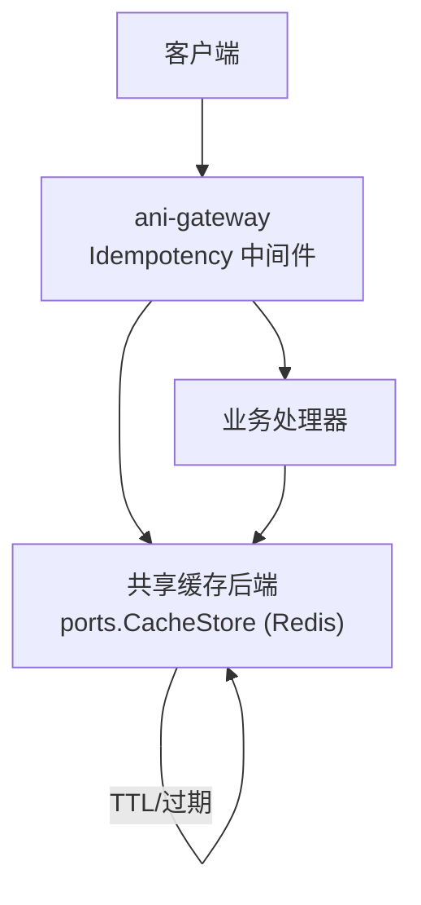
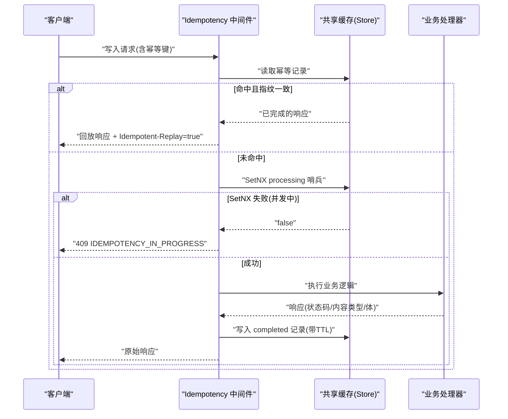
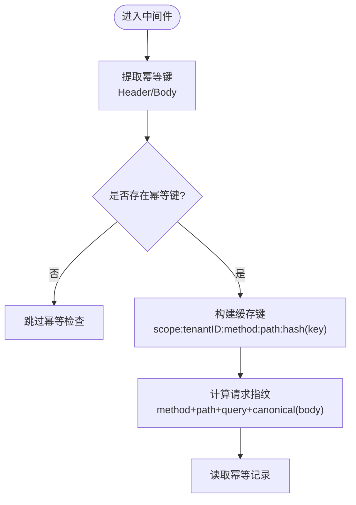
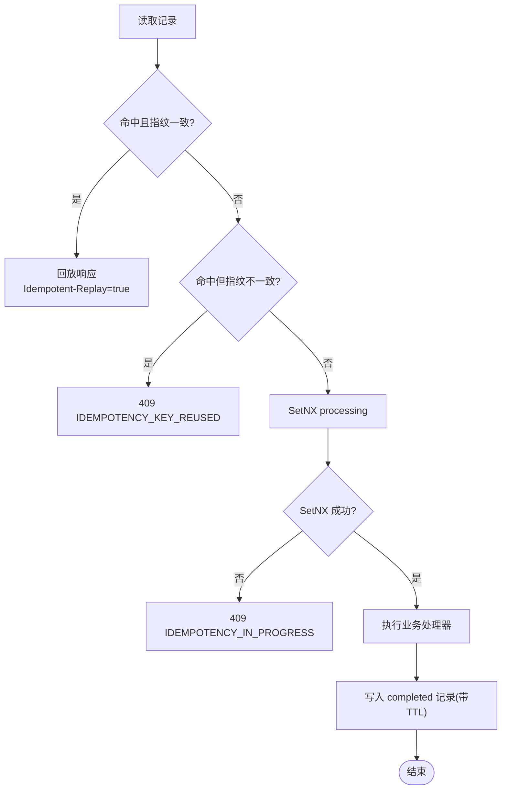
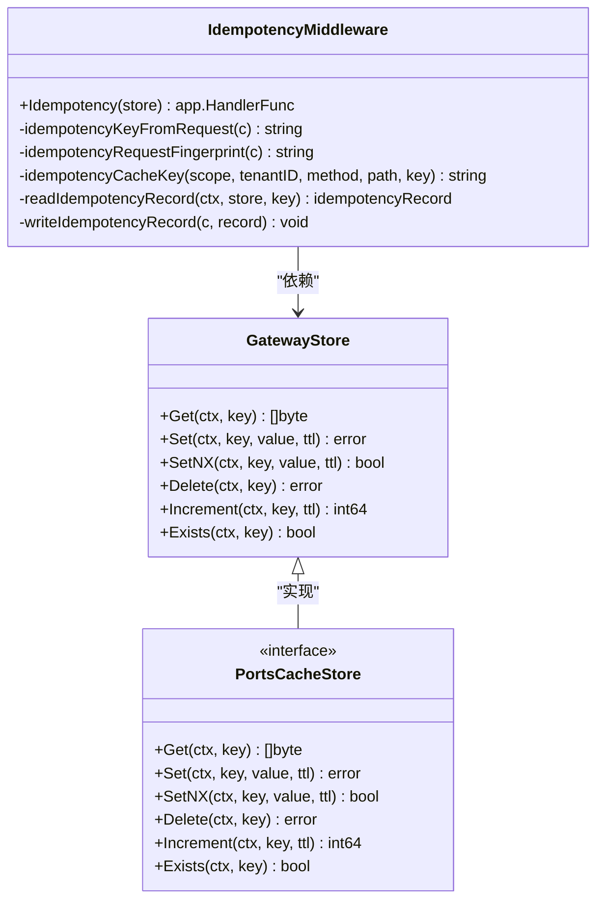

# 幂等性保证中间件

<cite>
**本文引用的文件**
- [idempotency.go](file://repo/services/ani-gateway/internal/middleware/idempotency.go)
- [idempotency_test.go](file://repo/services/ani-gateway/internal/middleware/idempotency_test.go)
- [cache_store.go](file://repo/pkg/ports/cache_store.go)
- [store.go](file://repo/services/ani-gateway/internal/middleware/store.go)
- [20260502_002_operations_idempotency.sql](file://repo/deploy/migrations/20260502_002_operations_idempotency.sql)
- [TerminalTab.tsx](file://repo/frontends/console/src/features/instance-observability/TerminalTab.tsx)
- [gen_sdk_alpha.py](file://repo/scripts/gen_sdk_alpha.py)
- [sprint14-core-resilience-plan.md](file://repo/development-records/sprint14-core-resilience-plan.md)
- [r-p0-1-gateway-rate-limit.md](file://repo/development-records/r-p0-1-gateway-rate-limit.md)
- [run_instance_sandbox_stateless_live_gate.py](file://repo/scripts/run_instance_sandbox_stateless_live_gate.py)
</cite>

## 目录
1. [简介](#简介)
2. [项目结构](#项目结构)
3. [核心组件](#核心组件)
4. [架构总览](#架构总览)
5. [详细组件分析](#详细组件分析)
6. [依赖关系分析](#依赖关系分析)
7. [性能考量](#性能考量)
8. [故障排查指南](#故障排查指南)
9. [结论](#结论)
10. [附录](#附录)

## 简介
本文件系统性文档化 ANI 平台中“幂等性保证中间件”的实现与使用。该中间件位于 ani-gateway，针对有副作用的写入请求（POST/PUT/PATCH/DELETE）提供统一的幂等重放能力：通过客户端提供的幂等键生成唯一标识，在共享存储中记录处理状态与响应结果；重复请求直接回放首次成功响应，避免重复副作用。同时，中间件对并发重复请求进行保护，返回冲突错误，确保数据一致性。

## 项目结构
幂等性相关代码主要分布在以下位置：
- 网关中间件实现：services/ani-gateway/internal/middleware/idempotency.go
- 中间件测试用例：services/ani-gateway/internal/middleware/idempotency_test.go
- 共享缓存接口定义：pkg/ports/cache_store.go
- 网关侧 store 类型别名：services/ani-gateway/internal/middleware/store.go
- 数据库幂等迁移：deploy/migrations/20260502_002_operations_idempotency.sql
- 前端 SDK 与控制台幂等键生成：frontends/console/src/features/instance-observability/TerminalTab.tsx、scripts/gen_sdk_alpha.py
- 设计计划与验收说明：development-records/sprint14-core-resilience-plan.md、development-records/r-p0-1-gateway-rate-limit.md
- 端到端验证脚本：scripts/run_instance_sandbox_stateless_live_gate.py

图表来源
- [idempotency.go:32-124](file://repo/services/ani-gateway/internal/middleware/idempotency.go#L32-L124)
- [cache_store.go:8-15](file://repo/pkg/ports/cache_store.go#L8-L15)

章节来源
- [idempotency.go:17-20](file://repo/services/ani-gateway/internal/middleware/idempotency.go#L17-L20)
- [sprint14-core-resilience-plan.md:299-327](file://repo/development-records/sprint14-core-resilience-plan.md#L299-L327)

## 核心组件
- 幂等中间件 Idempotency(store)：拦截写入请求，基于请求三元组（scope、tenantID、method、path）与幂等键生成缓存键；先读后写，完成时持久化响应并设置 TTL；支持 sandbox token 路径的特殊过期策略。
- 共享缓存接口 CacheStore：Get/Set/SetNX/Delete/Increment/Exists，供限流与幂等复用同一后端。
- 数据库层幂等约束：workload_instances 与 workload_instance_operations 表通过唯一索引与检查约束保障幂等。
- 客户端幂等键生成：SDK 与控制台提供随机幂等键生成与注入方法。

章节来源
- [idempotency.go:32-124](file://repo/services/ani-gateway/internal/middleware/idempotency.go#L32-L124)
- [cache_store.go:8-15](file://repo/pkg/ports/cache_store.go#L8-L15)
- [20260502_002_operations_idempotency.sql:13-22](file://repo/deploy/migrations/20260502_002_operations_idempotency.sql#L13-L22)
- [20260502_002_operations_idempotency.sql:30-61](file://repo/deploy/migrations/20260502_002_operations_idempotency.sql#L30-L61)
- [TerminalTab.tsx:65-74](file://repo/frontends/console/src/features/instance-observability/TerminalTab.tsx#L65-L74)
- [gen_sdk_alpha.py:336-360](file://repo/scripts/gen_sdk_alpha.py#L336-L360)

## 架构总览
幂等性中间件作为网关统一横切能力，位于鉴权与审计之间，对所有写入路由生效。其关键流程如下：
- 提取幂等键：优先从请求头 Idempotency-Key，其次从 JSON body 字段 idempotency_key。
- 计算指纹：对 method、path、query、body 规范化后做哈希，用于检测意图变更。
- 读取缓存：若存在已完成记录且指纹一致，直接回放响应并标记 Idempotent-Replay=true。
- 并发保护：写入 processing 哨兵，SetNX 失败表示已有并发处理，返回 409 IDEMPOTENCY_IN_PROGRESS。
- 执行处理器：完成后将响应体、状态码、内容类型持久化到缓存，默认 TTL 24h；sandbox token 路径可依据 expires_at 动态缩短 TTL。
- 异常与不可用：当共享存储不可用时返回 503 IDEMPOTENCY_UNAVAILABLE。

图表来源
- [idempotency.go:32-124](file://repo/services/ani-gateway/internal/middleware/idempotency.go#L32-L124)
- [idempotency.go:136-182](file://repo/services/ani-gateway/internal/middleware/idempotency.go#L136-L182)

## 详细组件分析

### 幂等键生成与缓存键构造
- 幂等键来源：
  - 请求头：Idempotency-Key
  - JSON body：idempotency_key
- 缓存键维度：
  - scope（租户或平台）
  - tenantID
  - method
  - path
  - hash(idempotency_key)
- 指纹计算：
  - 对 method、path、query string、规范化后的 JSON body 拼接后做 SHA-256，用于检测意图是否变化。

图表来源
- [idempotency.go:166-182](file://repo/services/ani-gateway/internal/middleware/idempotency.go#L166-L182)
- [idempotency.go:136-149](file://repo/services/ani-gateway/internal/middleware/idempotency.go#L136-L149)

章节来源
- [idempotency.go:166-182](file://repo/services/ani-gateway/internal/middleware/idempotency.go#L166-L182)
- [idempotency.go:136-149](file://repo/services/ani-gateway/internal/middleware/idempotency.go#L136-L149)

### 重复请求检测与结果缓存机制
- 重复检测：
  - 命中已完成记录且指纹一致 → 直接回放响应，设置 Idempotent-Replay=true。
  - 指纹不一致 → 返回 409 IDEMPOTENCY_KEY_REUSED，拒绝不同意图重用相同幂等键。
- 并发保护：
  - 写入 processing 哨兵，SetNX 失败表示已有并发处理，返回 409 IDEMPOTENCY_IN_PROGRESS。
- 结果缓存：
  - 成功后写入 {state, fingerprint, status_code, content_type, body}，默认 TTL 24h。
  - sandbox token 路径：若响应包含 expires_at，则按到期时间缩短 TTL，并额外保存 metadata 记录以判断过期。

图表来源
- [idempotency.go:49-124](file://repo/services/ani-gateway/internal/middleware/idempotency.go#L49-L124)

章节来源
- [idempotency.go:49-124](file://repo/services/ani-gateway/internal/middleware/idempotency.go#L49-L124)

### 幂等性范围、时间窗口与存储策略
- 作用范围：
  - 仅对 POST/PUT/PATCH/DELETE 生效，GET 不触发幂等检查。
  - 公共路径（无 tenant_id）也适用，按 (scope, tenantID="", method, path, key) 维度去重。
- 时间窗口：
  - 默认 TTL 24h；sandbox token 路径根据响应中的 expires_at 动态调整 TTL。
- 存储策略：
  - 通过 ports.CacheStore 抽象，实际由 gateway 注入 Redis-backed 实现；支持 Get/Set/SetNX/Delete/Increment/Exists。
  - 中间件不直接依赖 Redis SDK，保持解耦。

章节来源
- [idempotency.go:127-134](file://repo/services/ani-gateway/internal/middleware/idempotency.go#L127-L134)
- [idempotency.go:17-20](file://repo/services/ani-gateway/internal/middleware/idempotency.go#L17-L20)
- [cache_store.go:8-15](file://repo/pkg/ports/cache_store.go#L8-L15)
- [store.go:5-5](file://repo/services/ani-gateway/internal/middleware/store.go#L5-L5)
- [sprint14-core-resilience-plan.md:139-164](file://repo/development-records/sprint14-core-resilience-plan.md#L139-L164)

### 冲突处理与数据一致性保证
- 冲突场景：
  - 指纹不一致：409 IDEMPOTENCY_KEY_REUSED，提示幂等键被用于不同请求。
  - 并发进行中：409 IDEMPOTENCY_IN_PROGRESS，提示幂等请求已在处理中。
  - 存储不可用：503 IDEMPOTENCY_UNAVAILABLE，提示幂等存储不可用。
- 一致性保证：
  - 通过 SetNX 原子写入 processing 哨兵，避免重复副作用。
  - 数据库层对实例创建与操作记录增加唯一索引与检查约束，进一步防止重复。

章节来源
- [idempotency.go:51-61](file://repo/services/ani-gateway/internal/middleware/idempotency.go#L51-L61)
- [idempotency.go:85-98](file://repo/services/ani-gateway/internal/middleware/idempotency.go#L85-L98)
- [20260502_002_operations_idempotency.sql:13-22](file://repo/deploy/migrations/20260502_002_operations_idempotency.sql#L13-L22)
- [20260502_002_operations_idempotency.sql:30-61](file://repo/deploy/migrations/20260502_002_operations_idempotency.sql#L30-L61)

### API 级别的幂等性示例
- 客户端调用：
  - 在请求头或 JSON body 中携带幂等键。
  - SDK 提供 newIdempotencyKey 与 withIdempotencyKey 辅助函数自动生成并注入。
- 服务端行为：
  - 中间件自动识别幂等键，执行幂等检查与响应回放。
  - 回放响应附带 Idempotent-Replay=true 响应头。

章节来源
- [TerminalTab.tsx:65-74](file://repo/frontends/console/src/features/instance-observability/TerminalTab.tsx#L65-L74)
- [gen_sdk_alpha.py:336-360](file://repo/scripts/gen_sdk_alpha.py#L336-L360)
- [gen_sdk_alpha.py:803-822](file://repo/scripts/gen_sdk_alpha.py#L803-L822)

### 配置选项与存储后端选择
- 配置项：
  - 幂等 TTL：默认 24h，可通过中间件常量控制。
  - 共享存储：通过 middleware.Register(h, store) 注入，具体实现为 Redis-backed CacheStore。
- 后端选择：
  - 推荐 Redis：低延迟共享计数与 KV 存储，天然适合幂等与限流。
  - 中间件不直接依赖 Redis SDK，通过 ports.CacheStore 抽象解耦。

章节来源
- [idempotency.go:17-20](file://repo/services/ani-gateway/internal/middleware/idempotency.go#L17-L20)
- [cache_store.go:8-15](file://repo/pkg/ports/cache_store.go#L8-L15)
- [sprint14-core-resilience-plan.md:139-164](file://repo/development-records/sprint14-core-resilience-plan.md#L139-L164)

### 分布式环境下的挑战与解决方案
- 挑战：
  - 多副本并发：需原子写入 processing 哨兵，避免重复副作用。
  - 存储可用性：共享存储不可用时应降级或报错，避免阻塞主链路。
  - 过期与清理：sandbox token 路径需按 expires_at 动态 TTL，避免长期占用。
- 解决方案：
  - 使用 SetNX 原子写入，结合指纹校验确保一致性。
  - 存储不可用时返回 503，上层重试或降级。
  - 对 sandbox token 路径单独处理，按响应中的 expires_at 设置 TTL 与 metadata。

章节来源
- [idempotency.go:79-124](file://repo/services/ani-gateway/internal/middleware/idempotency.go#L79-L124)
- [idempotency.go:151-164](file://repo/services/ani-gateway/internal/middleware/idempotency.go#L151-L164)

## 依赖关系分析

图表来源
- [idempotency.go:32-124](file://repo/services/ani-gateway/internal/middleware/idempotency.go#L32-L124)
- [cache_store.go:8-15](file://repo/pkg/ports/cache_store.go#L8-L15)
- [store.go:5-5](file://repo/services/ani-gateway/internal/middleware/store.go#L5-L5)

章节来源
- [idempotency.go:32-124](file://repo/services/ani-gateway/internal/middleware/idempotency.go#L32-L124)
- [cache_store.go:8-15](file://repo/pkg/ports/cache_store.go#L8-L15)
- [store.go:5-5](file://repo/services/ani-gateway/internal/middleware/store.go#L5-L5)

## 性能考量
- 减少重复副作用：通过幂等重放避免重复执行昂贵或破坏性操作。
- 降低存储压力：合理设置 TTL，避免长期占用缓存空间。
- 并发保护：SetNX 原子写入减少锁竞争与重复处理。
- 可观测性：回放响应附带 Idempotent-Replay 响应头，便于客户端识别。

[本节为通用指导，无需特定文件引用]

## 故障排查指南
- 常见问题：
  - 幂等键重用冲突：检查请求指纹是否一致，确认幂等键是否被用于不同意图。
  - 并发进行中：等待前一个请求完成或更换幂等键重试。
  - 存储不可用：检查共享存储（Redis）健康状态，必要时降级或回退。
- 验证方式：
  - 使用单元测试与端到端脚本验证幂等重放与冲突处理。
  - 检查响应头 Idempotent-Replay 与错误码。

章节来源
- [idempotency_test.go:18-59](file://repo/services/ani-gateway/internal/middleware/idempotency_test.go#L18-L59)
- [idempotency_test.go:351-361](file://repo/services/ani-gateway/internal/middleware/idempotency_test.go#L351-L361)
- [run_instance_sandbox_stateless_live_gate.py:271-292](file://repo/scripts/run_instance_sandbox_stateless_live_gate.py#L271-L292)

## 结论
ANI 平台的幂等性保证中间件通过统一的网关层实现，结合共享存储与数据库约束，提供了可靠的幂等重放能力。其设计遵循解耦、可扩展与高可用的原则，适用于分布式环境下的写入请求保护。通过合理的配置与监控，可有效提升系统的韧性与一致性。

[本节为总结性内容，无需特定文件引用]

## 附录
- 相关开发记录：
  - R-P0-0：gateway shared store 前置
  - R-P0-1：gateway rate limit
  - R-P0-2：gateway idempotency replay
  - R-P0-3：adapter per-call timeout
- 验收命令：
  - make validate-gateway-idempotency
  - make validate-gateway-ratelimit

章节来源
- [sprint14-core-resilience-plan.md:299-333](file://repo/development-records/sprint14-core-resilience-plan.md#L299-L333)
- [r-p0-1-gateway-rate-limit.md:1-39](file://repo/development-records/r-p0-1-gateway-rate-limit.md#L1-L39)