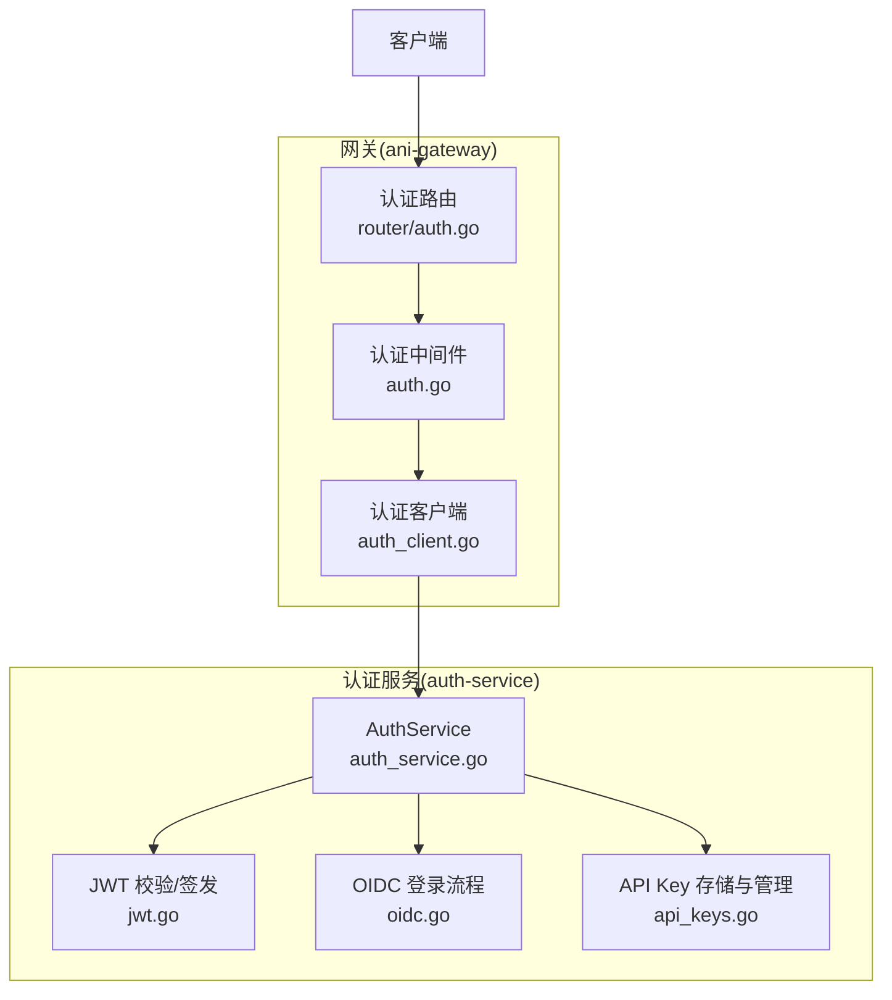
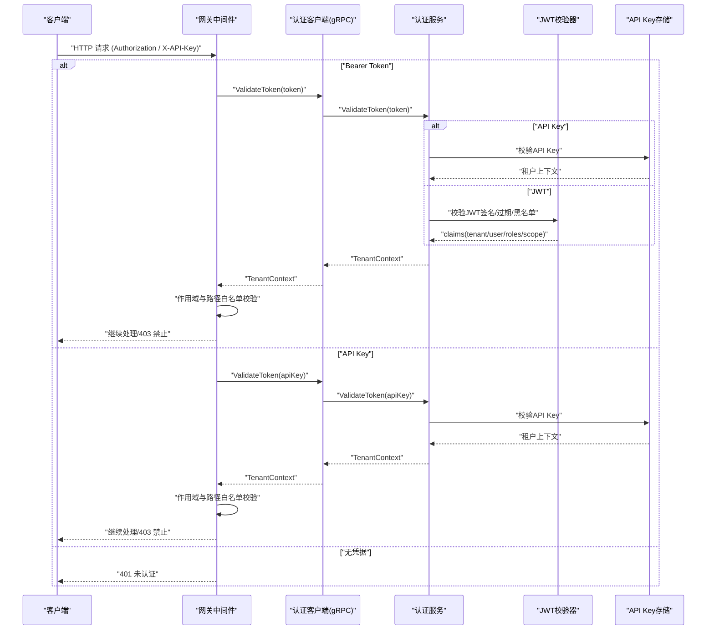
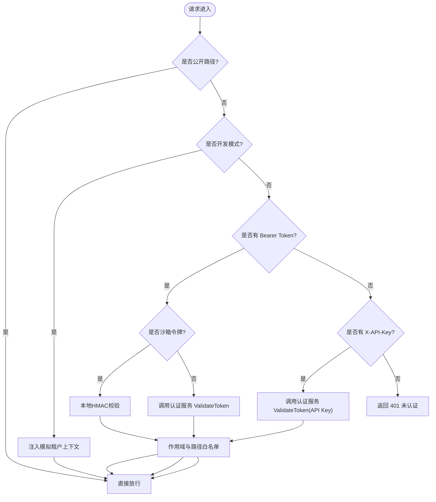
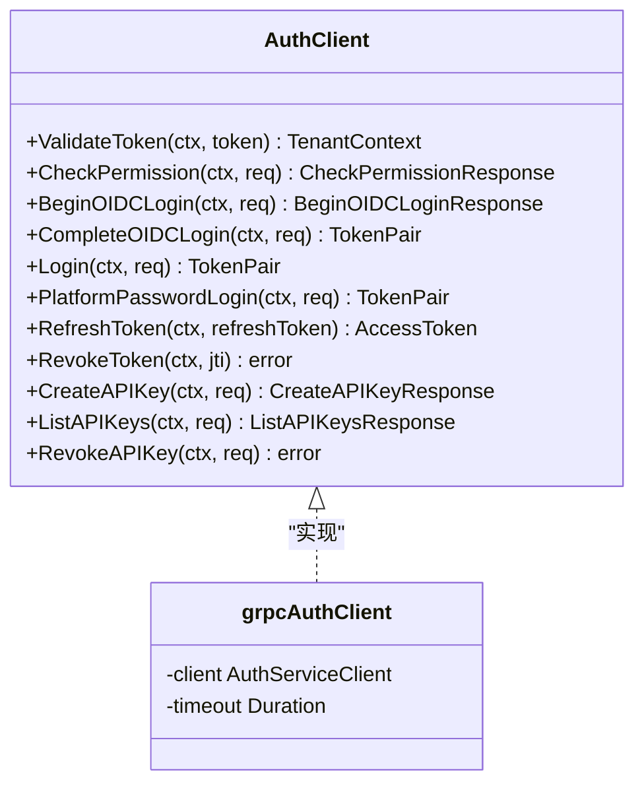
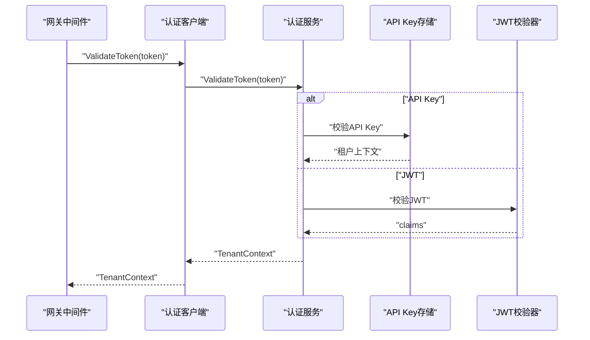
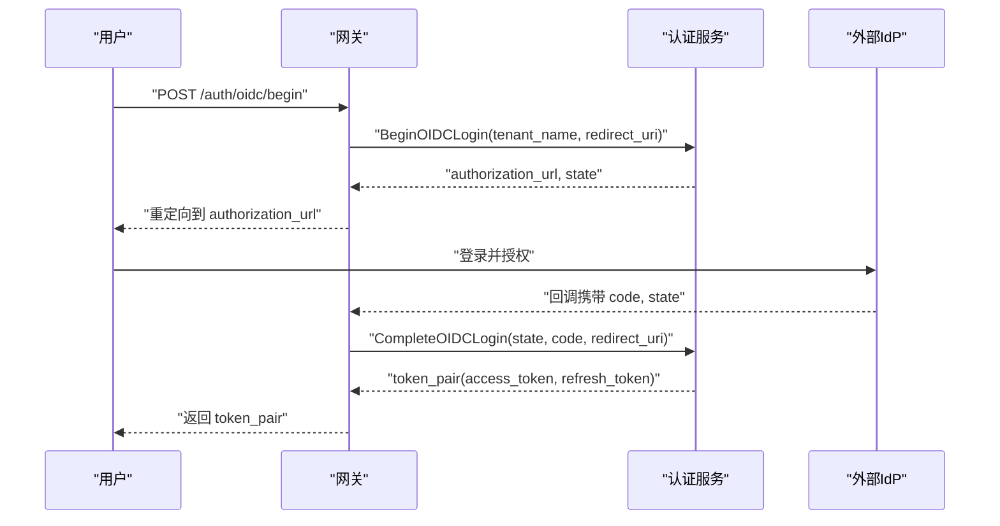
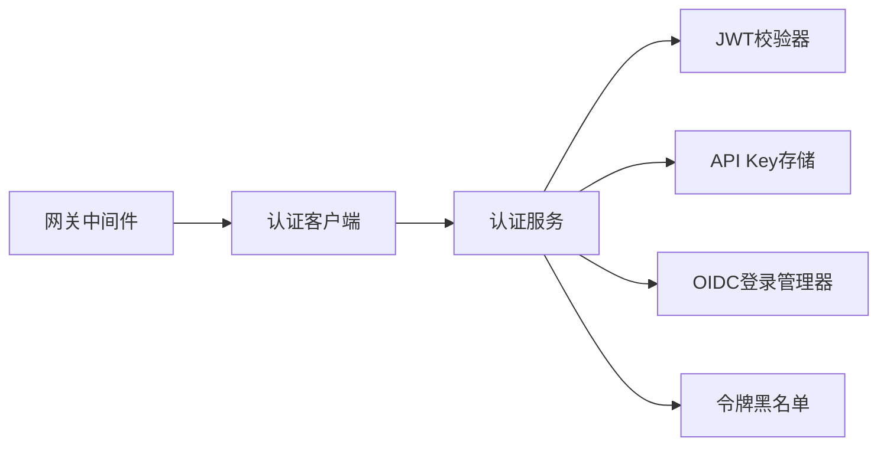

# 认证中间件

<cite>
**本文引用的文件**
- [services/ani-gateway/internal/middleware/auth.go](file://repo/services/ani-gateway/internal/middleware/auth.go)
- [services/ani-gateway/internal/middleware/auth_client.go](file://repo/services/ani-gateway/internal/middleware/auth_client.go)
- [services/ani-gateway/internal/router/auth.go](file://repo/services/ani-gateway/internal/router/auth.go)
- [services/auth-service/internal/service/auth_service.go](file://repo/services/auth-service/internal/service/auth_service.go)
- [services/auth-service/internal/service/jwt.go](file://repo/services/auth-service/internal/service/jwt.go)
- [services/auth-service/internal/service/oidc.go](file://repo/services/auth-service/internal/service/oidc.go)
- [services/auth-service/internal/service/api_keys.go](file://repo/services/auth-service/internal/service/api_keys.go)
</cite>

## 目录
1. [简介](#简介)
2. [项目结构](#项目结构)
3. [核心组件](#核心组件)
4. [架构总览](#架构总览)
5. [详细组件分析](#详细组件分析)
6. [依赖关系分析](#依赖关系分析)
7. [性能考虑](#性能考虑)
8. [故障排查指南](#故障排查指南)
9. [结论](#结论)
10. [附录](#附录)

## 简介
本文件面向 ANI 平台的“认证中间件”，系统性说明网关侧如何对请求进行鉴权，涵盖以下主题：
- JWT Bearer Token 验证与解析、权限信息提取与用户上下文构建
- API Key 认证流程与租户隔离策略
- OIDC 集成（开始登录、完成登录）在网关与认证服务间的交互模式
- 认证失败处理策略与统一错误响应格式
- 配置项、性能优化与安全注意事项
- 与认证服务的通信方式与缓存策略

## 项目结构
认证相关代码主要分布在两个服务中：
- ani-gateway（网关）：提供 HTTP 路由与认证中间件，负责入口鉴权、上下文注入、与认证服务通信
- auth-service（认证服务）：实现 JWT 签发/校验、API Key 管理、OIDC 登录流程、刷新令牌、令牌撤销等

**图表来源**
- [services/ani-gateway/internal/middleware/auth.go:18-141](file://repo/services/ani-gateway/internal/middleware/auth.go#L18-L141)
- [services/ani-gateway/internal/router/auth.go:102-113](file://repo/services/ani-gateway/internal/router/auth.go#L102-L113)
- [services/ani-gateway/internal/middleware/auth_client.go:14-47](file://repo/services/ani-gateway/internal/middleware/auth_client.go#L14-L47)
- [services/auth-service/internal/service/auth_service.go:21-57](file://repo/services/auth-service/internal/service/auth_service.go#L21-L57)

**章节来源**
- [services/ani-gateway/internal/middleware/auth.go:18-141](file://repo/services/ani-gateway/internal/middleware/auth.go#L18-L141)
- [services/ani-gateway/internal/router/auth.go:102-113](file://repo/services/ani-gateway/internal/router/auth.go#L102-L113)
- [services/ani-gateway/internal/middleware/auth_client.go:14-47](file://repo/services/ani-gateway/internal/middleware/auth_client.go#L14-L47)
- [services/auth-service/internal/service/auth_service.go:21-57](file://repo/services/auth-service/internal/service/auth_service.go#L21-L57)

## 核心组件
- 认证中间件（Gateway Middleware）
  - 职责：识别公开路径、解析 Authorization 头或 X-API-Key、调用认证服务校验令牌、设置租户上下文、执行范围白名单控制
  - 关键行为：支持本地开发模式、沙箱短生命周期令牌本地校验、平台/租户作用域隔离
- 认证客户端（AuthClient）
  - 职责：通过 gRPC 与认证服务通信，封装 ValidateToken、BeginOIDCLogin、CompleteOIDCLogin、RefreshToken、RevokeToken、API Key 管理等接口
- 认证服务（AuthService）
  - 职责：集中实现令牌校验、API Key 校验、OIDC 登录、刷新令牌、令牌撤销、权限检查
  - 关键能力：JWT 校验器、API Key 存储与限流、OIDC 会话与组映射、刷新令牌按 scope 分流
- JWT 校验器（JWT Validator）
  - 职责：校验 JWT 签名、过期、黑名单；从 claims 中提取 tenant_id、user_id、roles、scope
- OIDC 登录管理器（OIDC Login Manager）
  - 职责：维护 OIDC 会话、与外部 IdP 交互、完成 code exchange 并签发 token pair
- API Key 存储（API Key Store）
  - 职责：创建、列出、撤销 API Key；支持速率限制与过期时间；校验时返回租户上下文

**章节来源**
- [services/ani-gateway/internal/middleware/auth.go:18-141](file://repo/services/ani-gateway/internal/middleware/auth.go#L18-L141)
- [services/ani-gateway/internal/middleware/auth_client.go:14-47](file://repo/services/ani-gateway/internal/middleware/auth_client.go#L14-L47)
- [services/auth-service/internal/service/auth_service.go:21-57](file://repo/services/auth-service/internal/service/auth_service.go#L21-L57)
- [services/auth-service/internal/service/jwt.go](file://repo/services/auth-service/internal/service/jwt.go)
- [services/auth-service/internal/service/oidc.go](file://repo/services/auth-service/internal/service/oidc.go)
- [services/auth-service/internal/service/api_keys.go](file://repo/services/auth-service/internal/service/api_keys.go)

## 架构总览
网关在请求进入业务路由前，先经过认证中间件。中间件根据请求头选择认证方式：
- 优先尝试 Bearer Token（含沙箱短生命周期令牌本地校验）
- 其次尝试 API Key（X-API-Key）
- 若均不满足，返回未认证错误

认证成功后，中间件将 tenant_id、user_id、roles、scope 写入请求上下文，并注入到 Go context 供后续 RLS-aware 存储使用。同时基于 scope 与路径前缀进行访问控制，防止跨租户或越权访问平台端点。

**图表来源**
- [services/ani-gateway/internal/middleware/auth.go:51-141](file://repo/services/ani-gateway/internal/middleware/auth.go#L51-L141)
- [services/ani-gateway/internal/middleware/auth_client.go:49-53](file://repo/services/ani-gateway/internal/middleware/auth_client.go#L49-L53)
- [services/auth-service/internal/service/auth_service.go:123-159](file://repo/services/auth-service/internal/service/auth_service.go#L123-L159)

**章节来源**
- [services/ani-gateway/internal/middleware/auth.go:51-141](file://repo/services/ani-gateway/internal/middleware/auth.go#L51-L141)
- [services/auth-service/internal/service/auth_service.go:123-159](file://repo/services/auth-service/internal/service/auth_service.go#L123-L159)

## 详细组件分析

### 认证中间件（Gateway Middleware）
- 公开路径跳过鉴权：健康检查、品牌、OIDC 开始、令牌获取、刷新等
- 本地开发模式：可通过环境变量开启 dev 模式，注入模拟租户上下文
- Bearer Token 流程：
  - 沙箱短生命周期令牌：本地 HMAC 校验，仅允许访问沙箱子资源
  - 普通 JWT：调用认证服务 ValidateToken，提取租户上下文与作用域，执行路径作用域白名单
- API Key 流程：
  - 通过 X-API-Key 头传递，调用认证服务 ValidateToken，返回租户上下文
  - API Key 默认租户作用域，禁止访问平台端点
- 上下文注入：
  - 设置 tenant_id、user_id、roles、scope
  - 注入 types.TenantContext 到 Go context，供数据层 RLS 使用
- 作用域与路径隔离：
  - 平台/管理路由（/auth/platform/*、/platform/*、/admin/*）仅允许 platform 作用域
  - sandbox token 仅允许访问实例沙箱子资源
  - 其他路由仅允许 tenant 作用域

**图表来源**
- [services/ani-gateway/internal/middleware/auth.go:22-141](file://repo/services/ani-gateway/internal/middleware/auth.go#L22-L141)
- [services/ani-gateway/internal/middleware/auth.go:199-229](file://repo/services/ani-gateway/internal/middleware/auth.go#L199-L229)

**章节来源**
- [services/ani-gateway/internal/middleware/auth.go:22-141](file://repo/services/ani-gateway/internal/middleware/auth.go#L22-L141)
- [services/ani-gateway/internal/middleware/auth.go:199-229](file://repo/services/ani-gateway/internal/middleware/auth.go#L199-L229)

### 认证客户端（gRPC 客户端）
- 通过环境变量 AUTH_SERVICE_ADDR 连接认证服务，默认端口 9101
- 所有调用带超时控制，避免阻塞网关
- 暴露的接口包括：ValidateToken、CheckPermission、BeginOIDCLogin、CompleteOIDCLogin、Login、PlatformPasswordLogin、RefreshToken、RevokeToken、CreateAPIKey、ListAPIKeys、RevokeAPIKey

**图表来源**
- [services/ani-gateway/internal/middleware/auth_client.go:14-47](file://repo/services/ani-gateway/internal/middleware/auth_client.go#L14-L47)
- [services/ani-gateway/internal/middleware/auth_client.go:49-115](file://repo/services/ani-gateway/internal/middleware/auth_client.go#L49-L115)

**章节来源**
- [services/ani-gateway/internal/middleware/auth_client.go:14-47](file://repo/services/ani-gateway/internal/middleware/auth_client.go#L14-L47)
- [services/ani-gateway/internal/middleware/auth_client.go:49-115](file://repo/services/ani-gateway/internal/middleware/auth_client.go#L49-L115)

### 认证服务（AuthService）
- 构造阶段初始化 JWT 校验器、签发器、API Key 存储、刷新令牌存储、令牌黑名单、OIDC 登录管理器、密码登录与平台登录管理器
- ValidateToken：
  - 识别 API Key（以特定前缀），走 API Key 校验流程，返回租户上下文与作用域
  - 否则走 JWT 校验，从 claims 提取租户上下文与作用域
- RefreshToken：
  - 根据 refresh token 的作用域分流：平台刷新为平台 access token，租户刷新为租户 access token
- RevokeToken：
  - 将 jti 加入黑名单（Redis/缓存），使已签发的 JWT 立即失效
- CheckPermission：
  - 基于角色与作用域进行细粒度授权判断

**图表来源**
- [services/auth-service/internal/service/auth_service.go:123-159](file://repo/services/auth-service/internal/service/auth_service.go#L123-L159)
- [services/auth-service/internal/service/auth_service.go:81-108](file://repo/services/auth-service/internal/service/auth_service.go#L81-L108)
- [services/auth-service/internal/service/auth_service.go:110-121](file://repo/services/auth-service/internal/service/auth_service.go#L110-L121)

**章节来源**
- [services/auth-service/internal/service/auth_service.go:21-57](file://repo/services/auth-service/internal/service/auth_service.go#L21-L57)
- [services/auth-service/internal/service/auth_service.go:81-121](file://repo/services/auth-service/internal/service/auth_service.go#L81-L121)
- [services/auth-service/internal/service/auth_service.go:123-159](file://repo/services/auth-service/internal/service/auth_service.go#L123-L159)

### JWT 校验与令牌撤销
- 校验器负责验证 JWT 签名、过期时间、黑名单
- 黑名单用于即时撤销：当调用 RevokeToken 后，对应 jti 会被加入缓存，后续校验将被拒绝
- 刷新令牌流程区分平台与租户作用域，确保不会降级平台 token

**章节来源**
- [services/auth-service/internal/service/jwt.go](file://repo/services/auth-service/internal/service/jwt.go)
- [services/auth-service/internal/service/auth_service.go:81-121](file://repo/services/auth-service/internal/service/auth_service.go#L81-L121)

### OIDC 集成
- 网关暴露 /api/v1/auth/oidc/begin 与 /api/v1/auth/token 两个端点
- begin：向认证服务发起 OIDC 开始登录，返回授权 URL 与 state
- complete：携带 state、code、redirect_uri 完成 code exchange，换取 token pair
- 认证服务内部维护 OIDC 会话、组映射，最终签发 JWT

**图表来源**
- [services/ani-gateway/internal/router/auth.go:102-113](file://repo/services/ani-gateway/internal/router/auth.go#L102-L113)
- [services/ani-gateway/internal/router/auth.go:231-367](file://repo/services/ani-gateway/internal/router/auth.go#L231-L367)
- [services/auth-service/internal/service/oidc.go](file://repo/services/auth-service/internal/service/oidc.go)

**章节来源**
- [services/ani-gateway/internal/router/auth.go:231-367](file://repo/services/ani-gateway/internal/router/auth.go#L231-L367)
- [services/auth-service/internal/service/oidc.go](file://repo/services/auth-service/internal/service/oidc.go)

### API Key 认证
- 客户端在请求头 X-API-Key 中携带密钥
- 认证服务识别 API Key 前缀，查询存储并返回租户上下文与作用域
- 网关对 API Key 的路径访问进行租户作用域限制，禁止访问平台端点

**章节来源**
- [services/ani-gateway/internal/middleware/auth.go:109-137](file://repo/services/ani-gateway/internal/middleware/auth.go#L109-L137)
- [services/auth-service/internal/service/auth_service.go:123-141](file://repo/services/auth-service/internal/service/auth_service.go#L123-L141)
- [services/auth-service/internal/service/api_keys.go](file://repo/services/auth-service/internal/service/api_keys.go)

### 权限信息与用户上下文构建
- 认证成功后的 TenantContext 包含：tenant_id、user_id、roles、scope
- 中间件将这些信息写入请求上下文，并注入到 Go context 供数据层使用
- 作用域与路径白名单确保平台端点仅能被 platform 作用域访问，租户端点仅能被 tenant 作用域访问

**章节来源**
- [services/ani-gateway/internal/middleware/auth.go:144-197](file://repo/services/ani-gateway/internal/middleware/auth.go#L144-L197)
- [services/ani-gateway/internal/middleware/auth.go:214-229](file://repo/services/ani-gateway/internal/middleware/auth.go#L214-L229)

## 依赖关系分析
- 网关中间件依赖认证客户端，认证客户端通过 gRPC 依赖认证服务
- 认证服务依赖 JWT 校验器、API Key 存储、OIDC 登录管理器、刷新令牌存储、令牌黑名单
- 作用域与路径白名单由网关中间件实现，确保最小权限原则

**图表来源**
- [services/ani-gateway/internal/middleware/auth.go:18-141](file://repo/services/ani-gateway/internal/middleware/auth.go#L18-L141)
- [services/ani-gateway/internal/middleware/auth_client.go:14-47](file://repo/services/ani-gateway/internal/middleware/auth_client.go#L14-L47)
- [services/auth-service/internal/service/auth_service.go:21-57](file://repo/services/auth-service/internal/service/auth_service.go#L21-L57)

**章节来源**
- [services/ani-gateway/internal/middleware/auth.go:18-141](file://repo/services/ani-gateway/internal/middleware/auth.go#L18-L141)
- [services/ani-gateway/internal/middleware/auth_client.go:14-47](file://repo/services/ani-gateway/internal/middleware/auth_client.go#L14-L47)
- [services/auth-service/internal/service/auth_service.go:21-57](file://repo/services/auth-service/internal/service/auth_service.go#L21-L57)

## 性能考虑
- 认证客户端对所有 gRPC 调用设置超时，避免长尾请求拖垮网关
- 令牌黑名单与 API Key 校验可能涉及缓存（如 Redis），应合理配置 TTL 与容量
- 沙箱短生命周期令牌本地校验减少网络往返，提升性能
- 作用域与路径白名单为内存计算，开销极低

[本节为通用指导，无需具体文件引用]

## 故障排查指南
- 401 未认证：
  - 缺少 Authorization 或 X-API-Key
  - Bearer Token 无效或过期
  - API Key 无效或被撤销
- 403 禁止：
  - 作用域与路径不匹配（例如租户 token 访问平台端点）
  - sandbox token 访问非沙箱子资源
- 503 服务不可用：
  - 认证服务不可达或未配置
- 统一错误响应格式：
  - 包含 code、message、request_id

**章节来源**
- [services/ani-gateway/internal/middleware/auth.go:51-141](file://repo/services/ani-gateway/internal/middleware/auth.go#L51-L141)
- [services/ani-gateway/internal/router/auth.go:533-556](file://repo/services/ani-gateway/internal/router/auth.go#L533-L556)

## 结论
该认证中间件通过统一的入口鉴权机制，结合 JWT、API Key 与 OIDC，实现了多模式认证与细粒度权限控制。网关侧的职责清晰：识别凭据、调用认证服务、注入上下文、执行作用域白名单。认证服务则专注于令牌生命周期管理与身份源集成。整体设计遵循最小权限原则，具备可配置性与可扩展性。

[本节为总结性内容，无需具体文件引用]

## 附录
- 配置选项与环境变量
  - AUTH_SERVICE_ADDR：认证服务地址，默认 127.0.0.1:9101
  - ANI_AUTH_MODE=dev：启用本地开发模式，允许通过请求头注入模拟租户上下文
- 安全建议
  - 生产环境禁用 dev 模式
  - 严格配置作用域与路径白名单，避免平台端点被租户 token 访问
  - 定期轮换 API Key 与 JWT 密钥，及时撤销泄露令牌
- 使用示例（路径引用）
  - 账号密码登录：参考网关路由与错误映射
  - OIDC 开始与完成：参考网关路由与认证服务 OIDC 流程
  - 刷新令牌：参考网关路由与认证服务刷新逻辑
  - API Key 管理：参考网关路由与认证服务 API Key 存储

**章节来源**
- [services/ani-gateway/internal/router/auth.go:102-113](file://repo/services/ani-gateway/internal/router/auth.go#L102-L113)
- [services/ani-gateway/internal/router/auth.go:116-174](file://repo/services/ani-gateway/internal/router/auth.go#L116-L174)
- [services/ani-gateway/internal/router/auth.go:231-367](file://repo/services/ani-gateway/internal/router/auth.go#L231-L367)
- [services/ani-gateway/internal/router/auth.go:369-474](file://repo/services/ani-gateway/internal/router/auth.go#L369-L474)
- [services/auth-service/internal/service/auth_service.go:81-121](file://repo/services/auth-service/internal/service/auth_service.go#L81-L121)
- [services/auth-service/internal/service/api_keys.go](file://repo/services/auth-service/internal/service/api_keys.go)