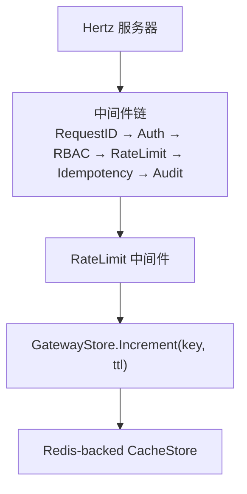
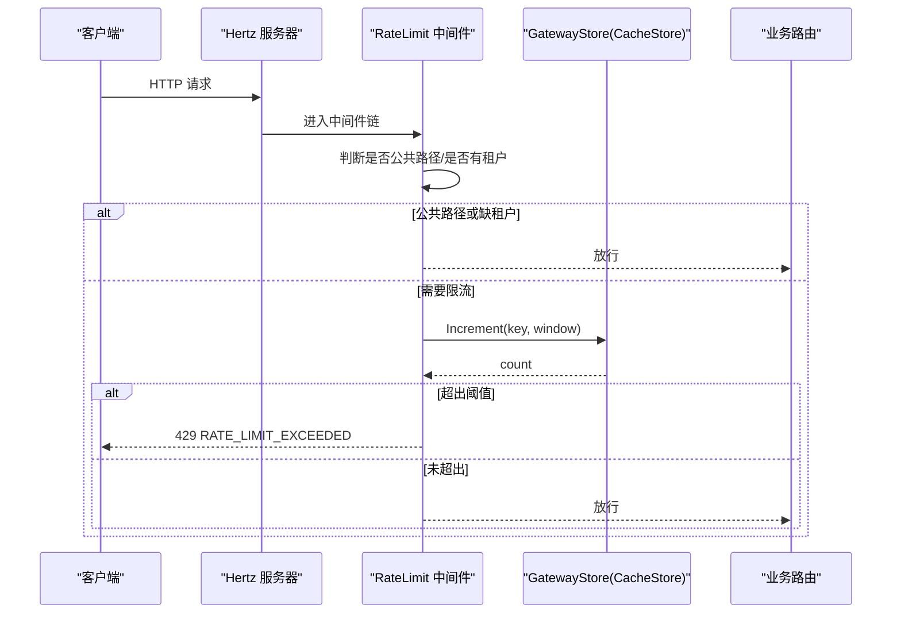
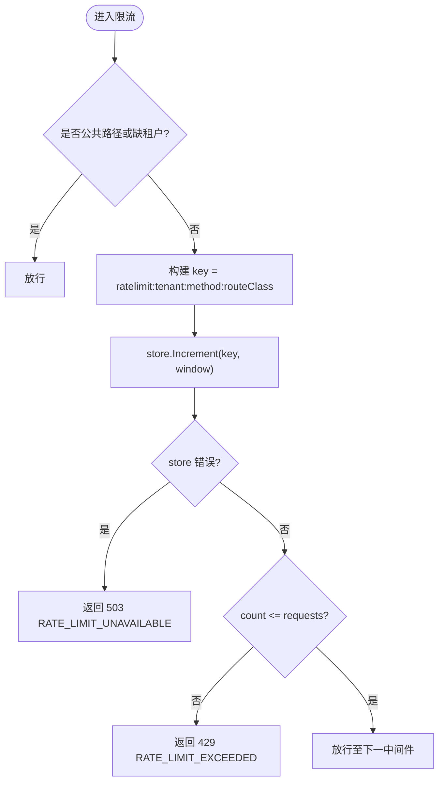
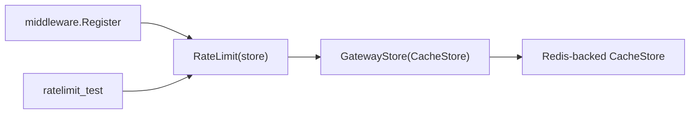

# 限流中间件

<cite>
**本文引用的文件**
- [services/ani-gateway/internal/middleware/ratelimit.go](file://repo/services/ani-gateway/internal/middleware/ratelimit.go)
- [services/ani-gateway/internal/middleware/chain.go](file://repo/services/ani-gateway/internal/middleware/chain.go)
- [services/ani-gateway/internal/middleware/store.go](file://repo/services/ani-gateway/internal/middleware/store.go)
- [pkg/ports/cache_store.go](file://repo/pkg/ports/cache_store.go)
- [pkg/bootstrap/redis.go](file://repo/pkg/bootstrap/redis.go)
- [services/ani-gateway/internal/middleware/ratelimit_test.go](file://repo/services/ani-gateway/internal/middleware/ratelimit_test.go)
- [development-records/r-p0-1-gateway-rate-limit.md](file://repo/development-records/r-p0-1-gateway-rate-limit.md)
</cite>

## 目录
1. [简介](#简介)
2. [项目结构](#项目结构)
3. [核心组件](#核心组件)
4. [架构总览](#架构总览)
5. [详细组件分析](#详细组件分析)
6. [依赖关系分析](#依赖关系分析)
7. [性能考虑](#性能考虑)
8. [故障排查指南](#故障排查指南)
9. [结论](#结论)
10. [附录](#附录)

## 简介
本文件面向 ANI Gateway 的限流中间件，系统性说明其实现原理、配置方式、状态存储与统计收集、告警与持久化策略，以及在不同维度（租户、IP、API）下的限流规则定义与扩展建议。当前实现基于“滑动窗口计数”的分布式共享存储方案，通过 Hertz 中间件链在认证与鉴权之后执行，对非公共路径按租户+方法+路由类别进行窗口内请求计数限制，超限返回 429 并附带错误码 RATE_LIMIT_EXCEEDED。

## 项目结构
限流相关代码集中在 ani-gateway 的中间件层，并通过统一的共享存储接口与 Redis 等后端解耦：
- 中间件入口与顺序注册：services/ani-gateway/internal/middleware/chain.go
- 限流逻辑实现：services/ani-gateway/internal/middleware/ratelimit.go
- 共享存储类型别名：services/ani-gateway/internal/middleware/store.go
- 缓存存储端口定义：pkg/ports/cache_store.go
- Redis 连接与 CacheStore 构造：pkg/bootstrap/redis.go
- 单元测试覆盖：services/ani-gateway/internal/middleware/ratelimit_test.go
- 设计记录与边界说明：development-records/r-p0-1-gateway-rate-limit.md

图表来源
- [services/ani-gateway/internal/middleware/chain.go:7-21](file://repo/services/ani-gateway/internal/middleware/chain.go#L7-L21)
- [services/ani-gateway/internal/middleware/ratelimit.go:14-40](file://repo/services/ani-gateway/internal/middleware/ratelimit.go#L14-L40)
- [pkg/bootstrap/redis.go:50-64](file://repo/pkg/bootstrap/redis.go#L50-L64)

章节来源
- [services/ani-gateway/internal/middleware/chain.go:1-22](file://repo/services/ani-gateway/internal/middleware/chain.go#L1-L22)
- [services/ani-gateway/internal/middleware/ratelimit.go:1-87](file://repo/services/ani-gateway/internal/middleware/ratelimit.go#L1-L87)
- [pkg/ports/cache_store.go:1-15](file://repo/pkg/ports/cache_store.go#L1-L15)
- [pkg/bootstrap/redis.go:1-136](file://repo/pkg/bootstrap/redis.go#L1-L136)

## 核心组件
- 限流中间件：对每个请求计算 key（tenant + method + route-class），调用共享存储 Increment 进行窗口计数，超过阈值返回 429。
- 共享存储接口：CacheStore，提供 Get/Set/SetNX/Delete/Increment/Exists；限流使用 Increment 实现滑动窗口计数。
- Redis 适配：bootstrap.ConnectRedisCacheStore 将 go-redis 客户端包装为 CacheStore，供中间件使用。
- 中间件注册：Register 将限流中间件注入到 Hertz 中间件链中，位于鉴权之后、幂等之前。

章节来源
- [services/ani-gateway/internal/middleware/ratelimit.go:14-87](file://repo/services/ani-gateway/internal/middleware/ratelimit.go#L14-L87)
- [services/ani-gateway/internal/middleware/store.go:1-6](file://repo/services/ani-gateway/internal/middleware/store.go#L1-L6)
- [pkg/ports/cache_store.go:8-15](file://repo/pkg/ports/cache_store.go#L8-L15)
- [pkg/bootstrap/redis.go:50-64](file://repo/pkg/bootstrap/redis.go#L50-L64)
- [services/ani-gateway/internal/middleware/chain.go:7-21](file://repo/services/ani-gateway/internal/middleware/chain.go#L7-L21)

## 架构总览
限流中间件作为网关侧的统一防护点，遵循以下流程：
- 跳过公共路径或无租户上下文请求，直接放行。
- 构造限流 key：ratelimit:{tenant}:{method}:{routeClass}。
- 调用共享存储 Increment(key, window)，以 TTL 控制窗口长度。
- 若 store 不可用，返回 503 并提示 RATE_LIMIT_UNAVAILABLE。
- 若计数超过阈值，返回 429 并提示 RATE_LIMIT_EXCEEDED。
- 否则继续后续中间件处理。

图表来源
- [services/ani-gateway/internal/middleware/ratelimit.go:14-56](file://repo/services/ani-gateway/internal/middleware/ratelimit.go#L14-L56)
- [services/ani-gateway/internal/middleware/chain.go:7-21](file://repo/services/ani-gateway/internal/middleware/chain.go#L7-L21)

## 详细组件分析

### 限流算法与窗口计数
- 算法选择：当前实现采用“滑动窗口计数”，通过 Increment(key, ttl) 在指定时间窗口内累计请求数。key 由 tenant、HTTP 方法与路由类别组成，确保每租户每 API 维度的独立计数。
- 窗口控制：window 来自环境变量 GATEWAY_RATE_LIMIT_WINDOW，默认 1s；requests 来自 GATEWAY_RATE_LIMIT_REQUESTS，默认 100。
- 键生成：rateLimitKey(tenant, method, path) 使用 routeClass(path) 将 /api/v1/{resource}/... 归一化为资源级维度，避免细粒度路径导致键爆炸。

图表来源
- [services/ani-gateway/internal/middleware/ratelimit.go:14-87](file://repo/services/ani-gateway/internal/middleware/ratelimit.go#L14-L87)

章节来源
- [services/ani-gateway/internal/middleware/ratelimit.go:42-87](file://repo/services/ani-gateway/internal/middleware/ratelimit.go#L42-L87)
- [development-records/r-p0-1-gateway-rate-limit.md:7-23](file://repo/development-records/r-p0-1-gateway-rate-limit.md#L7-L23)

### 配置项与环境变量
- GATEWAY_RATE_LIMIT_REQUESTS：窗口内最大请求数，默认 100。
- GATEWAY_RATE_LIMIT_WINDOW：窗口时长，默认 1s。
- 这些值在中间件启动时从环境变量解析，用于构造 gatewayRateLimit 结构体。

章节来源
- [services/ani-gateway/internal/middleware/ratelimit.go:58-72](file://repo/services/ani-gateway/internal/middleware/ratelimit.go#L58-L72)
- [development-records/r-p0-1-gateway-rate-limit.md:13-17](file://repo/development-records/r-p0-1-gateway-rate-limit.md#L13-L17)

### 限流维度与规则
- 租户维度：tenantID 来自上下文，缺失则放行，避免影响未认证流量。
- API 维度：HTTP 方法 + 路由类别（如 instances、documents 等），避免同一资源不同子路径互相影响。
- IP 维度：当前实现未包含 IP 维度；可在 key 中加入 client IP 字段以支持 IP 级限流。
- 用户维度：当前实现未包含用户维度；可在 key 中加入 user ID 或 token 标识以支持用户级限流。

章节来源
- [services/ani-gateway/internal/middleware/ratelimit.go:17-27](file://repo/services/ani-gateway/internal/middleware/ratelimit.go#L17-L27)
- [services/ani-gateway/internal/middleware/ratelimit.go:74-86](file://repo/services/ani-gateway/internal/middleware/ratelimit.go#L74-L86)

### 状态存储与计数器维护
- 共享存储：GatewayStore 即 ports.CacheStore，限流使用 Increment(key, ttl) 原子递增并设置 TTL，天然实现滑动窗口计数。
- Redis 适配：bootstrap.ConnectRedisCacheStore 将 go-redis 客户端封装为 CacheStore，支持 standalone/sentinel/cluster 模式。
- 键空间：ratelimit:{tenant}:{method}:{routeClass}，TTL 等于 window，保证过期自动清理。

章节来源
- [services/ani-gateway/internal/middleware/store.go:1-6](file://repo/services/ani-gateway/internal/middleware/store.go#L1-L6)
- [pkg/ports/cache_store.go:8-15](file://repo/pkg/ports/cache_store.go#L8-L15)
- [pkg/bootstrap/redis.go:50-64](file://repo/pkg/bootstrap/redis.go#L50-L64)
- [pkg/bootstrap/redis.go:80-124](file://repo/pkg/bootstrap/redis.go#L80-L124)

### 限流统计与可观测性
- 当前实现未在中间件中直接暴露指标；可通过以下方式增强：
  - 在 Increment 前后埋点，采集 QPS、拒绝率、P99 延迟。
  - 在 store 层增加失败重试与超时指标。
  - 结合日志输出 key 与 count 信息，便于定位热点资源。

[本节为通用建议，不直接分析具体文件]

### 限流告警机制
- 当前实现未内置告警；建议在 store 层或监控层接入：
  - 当 RATE_LIMIT_EXCEEDED 比例超过阈值时触发告警。
  - 当 RATE_LIMIT_UNAVAILABLE（store 不可用）出现时立即告警。
  - 针对特定租户或 API 的高拒绝率进行定向告警。

[本节为通用建议，不直接分析具体文件]

### 限流数据的持久化存储
- 当前实现使用 Redis 作为临时计数存储，数据随 TTL 过期而清理，适合短期窗口计数。
- 如需长期统计与审计，可将每次拒绝事件写入消息队列或数据库，供离线分析与报表展示。

[本节为通用建议，不直接分析具体文件]

## 依赖关系分析
- 中间件链依赖：Register(h, store) 将 RateLimit(store) 注入到 Hertz 中间件链，顺序为 RequestID → Auth → RBAC → RateLimit → Idempotency → Audit。
- 存储依赖：RateLimit 依赖 GatewayStore.Increment；GatewayStore 由 bootstrap 提供的 Redis-backed CacheStore 实现。
- 测试依赖：ratelimit_test.go 使用内存 store 验证超限与恢复行为。

图表来源
- [services/ani-gateway/internal/middleware/chain.go:7-21](file://repo/services/ani-gateway/internal/middleware/chain.go#L7-L21)
- [services/ani-gateway/internal/middleware/ratelimit.go:14-40](file://repo/services/ani-gateway/internal/middleware/ratelimit.go#L14-L40)
- [pkg/bootstrap/redis.go:50-64](file://repo/pkg/bootstrap/redis.go#L50-L64)
- [services/ani-gateway/internal/middleware/ratelimit_test.go:15-53](file://repo/services/ani-gateway/internal/middleware/ratelimit_test.go#L15-L53)

章节来源
- [services/ani-gateway/internal/middleware/chain.go:1-22](file://repo/services/ani-gateway/internal/middleware/chain.go#L1-L22)
- [services/ani-gateway/internal/middleware/ratelimit.go:1-87](file://repo/services/ani-gateway/internal/middleware/ratelimit.go#L1-L87)
- [services/ani-gateway/internal/middleware/ratelimit_test.go:1-53](file://repo/services/ani-gateway/internal/middleware/ratelimit_test.go#L1-L53)

## 性能考虑
- 窗口大小与请求上限：合理设置 GATEWAY_RATE_LIMIT_WINDOW 与 GATEWAY_RATE_LIMIT_REQUESTS，避免过高 QPS 导致 Redis 压力过大。
- 键空间优化：使用 routeClass 聚合路径，减少键数量；可按需引入 IP 或用户维度时评估键增长。
- 存储降级：store 不可用时返回 503，建议配合熔断与降级策略，避免雪崩。
- 并发与锁：Increment 原子操作由 Redis 保证，无需额外分布式锁。
- 压测建议：在本地使用内存 store 验证逻辑，再在真实 Redis 环境进行压测与故障注入。

[本节为通用指导，不直接分析具体文件]

## 故障排查指南
- 429 RATE_LIMIT_EXCEEDED：检查 GATEWAY_RATE_LIMIT_REQUESTS 与 GATEWAY_RATE_LIMIT_WINDOW 配置；确认 key 是否正确（tenant、method、routeClass）。
- 503 RATE_LIMIT_UNAVAILABLE：检查 Redis 连通性与权限；查看 bootstrap 连接日志与错误信息。
- 测试用例：ratelimit_test.go 覆盖了超限与窗口恢复场景，可用于快速验证配置与逻辑。

章节来源
- [services/ani-gateway/internal/middleware/ratelimit.go:27-36](file://repo/services/ani-gateway/internal/middleware/ratelimit.go#L27-L36)
- [services/ani-gateway/internal/middleware/ratelimit_test.go:15-53](file://repo/services/ani-gateway/internal/middleware/ratelimit_test.go#L15-L53)
- [development-records/r-p0-1-gateway-rate-limit.md:13-23](file://repo/development-records/r-p0-1-gateway-rate-limit.md#L13-L23)

## 结论
当前限流中间件实现了基于滑动窗口计数的分布式限流，具备租户与 API 维度控制能力，并通过共享存储接口与 Redis 解耦，易于扩展与维护。后续可在 key 中引入 IP 与用户维度，完善统计与告警体系，并结合压测与故障演练提升生产可用性。

[本节为总结性内容，不直接分析具体文件]

## 附录

### 配置选项清单
- GATEWAY_RATE_LIMIT_REQUESTS：窗口内最大请求数，默认 100。
- GATEWAY_RATE_LIMIT_WINDOW：窗口时长，默认 1s。
- Redis 连接：通过 bootstrap 提供的 ConnectRedisCacheStore 配置 URL 或集群参数。

章节来源
- [services/ani-gateway/internal/middleware/ratelimit.go:58-72](file://repo/services/ani-gateway/internal/middleware/ratelimit.go#L58-L72)
- [pkg/bootstrap/redis.go:50-64](file://repo/pkg/bootstrap/redis.go#L50-L64)

### 代码示例路径
- 限流中间件实现：services/ani-gateway/internal/middleware/ratelimit.go
- 中间件注册与顺序：services/ani-gateway/internal/middleware/chain.go
- 共享存储接口定义：pkg/ports/cache_store.go
- Redis 适配与连接：pkg/bootstrap/redis.go
- 单元测试示例：services/ani-gateway/internal/middleware/ratelimit_test.go

章节来源
- [services/ani-gateway/internal/middleware/ratelimit.go:14-87](file://repo/services/ani-gateway/internal/middleware/ratelimit.go#L14-L87)
- [services/ani-gateway/internal/middleware/chain.go:7-21](file://repo/services/ani-gateway/internal/middleware/chain.go#L7-L21)
- [pkg/ports/cache_store.go:8-15](file://repo/pkg/ports/cache_store.go#L8-L15)
- [pkg/bootstrap/redis.go:50-64](file://repo/pkg/bootstrap/redis.go#L50-L64)
- [services/ani-gateway/internal/middleware/ratelimit_test.go:15-53](file://repo/services/ani-gateway/internal/middleware/ratelimit_test.go#L15-L53)