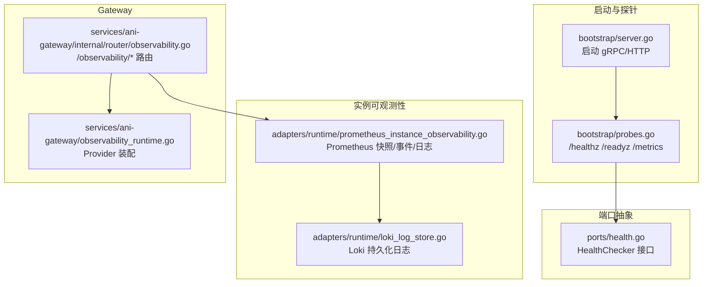
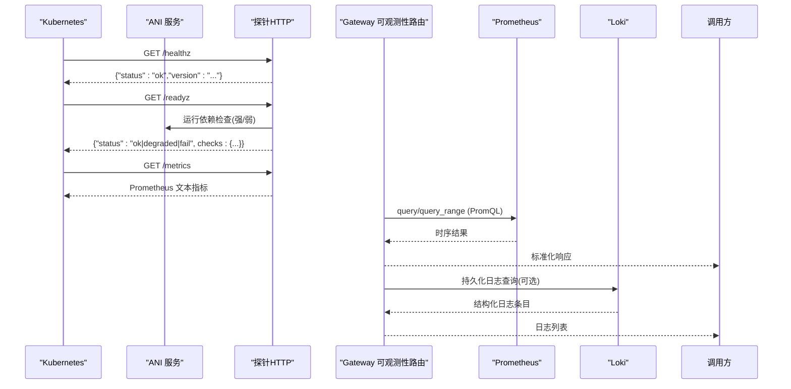
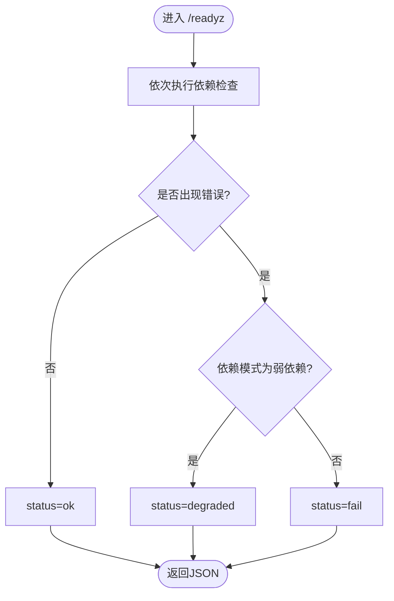
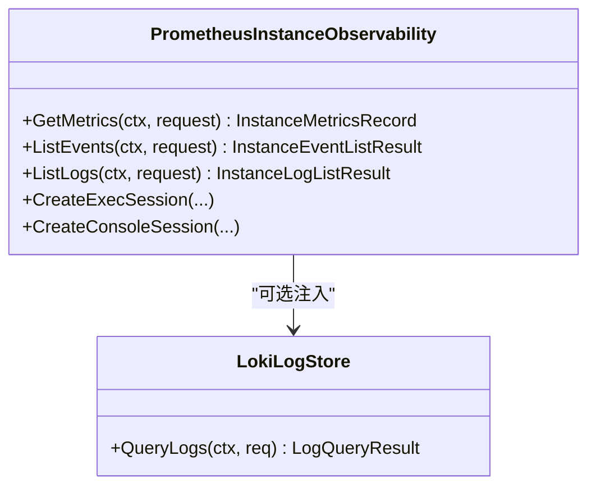
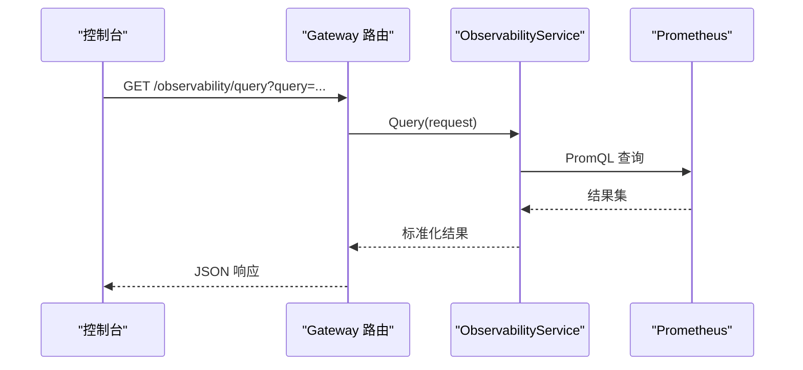
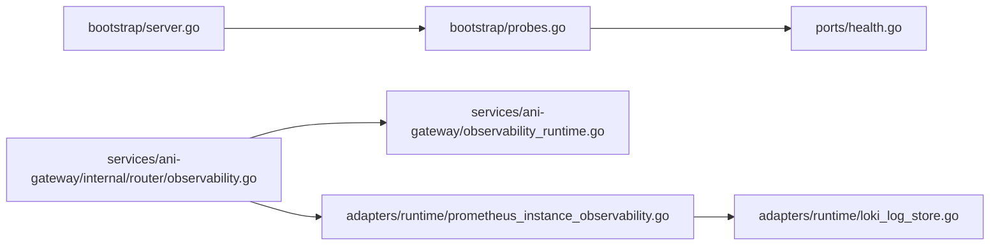

# 健康检查与监控

<cite>
**本文引用的文件**
- [probes.go](file://repo/pkg/bootstrap/probes.go)
- [server.go](file://repo/pkg/bootstrap/server.go)
- [health.go](file://repo/pkg/ports/health.go)
- [prometheus_instance_observability.go](file://repo/pkg/adapters/runtime/prometheus_instance_observability.go)
- [loki_log_store.go](file://repo/pkg/adapters/runtime/loki_log_store.go)
- [observability.go](file://repo/services/ani-gateway/internal/router/observability.go)
- [observability_runtime.go](file://repo/services/ani-gateway/observability_runtime.go)
</cite>

## 目录
1. [简介](#简介)
2. [项目结构](#项目结构)
3. [核心组件](#核心组件)
4. [架构总览](#架构总览)
5. [详细组件分析](#详细组件分析)
6. [依赖关系分析](#依赖关系分析)
7. [性能考量](#性能考量)
8. [故障诊断指南](#故障诊断指南)
9. [结论](#结论)
10. [附录：配置与告警示例](#附录配置与告警示例)

## 简介
本文件系统性文档化 ANI 平台的健康检查与监控能力，覆盖以下方面：
- 健康检查端点实现原理与检查项（liveness/readiness）
- 服务就绪状态、依赖服务健康状态判定
- 资源使用情况监控（Prometheus 指标暴露）
- 日志收集（Loki + Fluent Bit 推荐部署）
- 分布式追踪集成建议（基于现有可观测性接口扩展）
- 监控数据查询与分析（PromQL 模板、API 使用）
- 监控告警规则建议
- 故障诊断流程与性能调优建议

## 项目结构
健康检查与监控相关代码主要分布在以下模块：
- 启动与健康探针：pkg/bootstrap
- 端口抽象与契约：pkg/ports
- 实例可观测性适配器：pkg/adapters/runtime
- Gateway 可观测性路由：services/ani-gateway/internal/router
- Gateway 运行时装配：services/ani-gateway

图表来源
- [server.go:407-421](file://repo/pkg/bootstrap/server.go#L407-L421)
- [probes.go:37-57](file://repo/pkg/bootstrap/probes.go#L37-L57)
- [observability.go:95-104](file://repo/services/ani-gateway/internal/router/observability.go#L95-L104)
- [observability_runtime.go:35-53](file://repo/services/ani-gateway/observability_runtime.go#L35-L53)

章节来源
- [server.go:108-150](file://repo/pkg/bootstrap/server.go#L108-L150)
- [probes.go:17-57](file://repo/pkg/bootstrap/probes.go#L17-L57)

## 核心组件
- 健康探针处理器：提供 /healthz、/readyz、/metrics 三个 HTTP 端点，统一输出 JSON 与 Prometheus 格式指标。
- 依赖健康检查：对 Postgres、NATS、Redis、对象存储、向量存储、Kubernetes API 进行连通性探测，支持强/弱依赖降级策略。
- 实例可观测性适配器：通过 Prometheus 采集容器/GPU/VM 指标，通过 Kubernetes API 获取事件与 Pod 日志，可选接入 Loki 持久化日志。
- Gateway 可观测性路由：对外暴露 /observability/query、/observability/query_range 等 PromQL 代理接口，并支持告警规则管理。
- 运行时装配：根据环境变量选择本地或真实 Prometheus 后端，支持延迟注入实例查找器。

章节来源
- [probes.go:37-57](file://repo/pkg/bootstrap/probes.go#L37-L57)
- [probes.go:144-219](file://repo/pkg/bootstrap/probes.go#L144-L219)
- [prometheus_instance_observability.go:19-86](file://repo/pkg/adapters/runtime/prometheus_instance_observability.go#L19-L86)
- [observability.go:95-104](file://repo/services/ani-gateway/internal/router/observability.go#L95-L104)
- [observability_runtime.go:23-53](file://repo/services/ani-gateway/observability_runtime.go#L23-L53)

## 架构总览
系统通过统一的探针服务器暴露健康与指标；业务侧通过 Gateway 路由将 PromQL 请求转发到 Prometheus，同时聚合实例级指标、事件与日志。

图表来源
- [probes.go:37-57](file://repo/pkg/bootstrap/probes.go#L37-L57)
- [probes.go:102-136](file://repo/pkg/bootstrap/probes.go#L102-L136)
- [observability.go:106-154](file://repo/services/ani-gateway/internal/router/observability.go#L106-L154)
- [prometheus_instance_observability.go:155-251](file://repo/pkg/adapters/runtime/prometheus_instance_observability.go#L155-L251)
- [loki_log_store.go:77-137](file://repo/pkg/adapters/runtime/loki_log_store.go#L77-L137)

## 详细组件分析

### 健康检查端点与检查项
- /healthz：返回进程存活信息（版本），用于 liveness 探针。
- /readyz：执行依赖检查集合，按强/弱依赖策略合并状态：
  - 强依赖失败 → 整体 fail
  - 弱依赖失败 → 整体 degraded
  - 全部成功 → ok
- /metrics：输出 reconcile controller 的计数器指标（ticks/successes/failures/backoff_skips）。

依赖检查项包括：
- postgres：Ping 数据库连接
- nats：IsConnected 检查
- redis：Ping 命令
- object-store：Health 接口（未配置视为通过）
- vector-store：Health 接口（未配置视为通过）
- kubernetes-api：Health 接口（未配置视为通过）

图表来源
- [probes.go:102-136](file://repo/pkg/bootstrap/probes.go#L102-L136)
- [probes.go:144-219](file://repo/pkg/bootstrap/probes.go#L144-L219)

章节来源
- [probes.go:37-57](file://repo/pkg/bootstrap/probes.go#L37-L57)
- [probes.go:102-136](file://repo/pkg/bootstrap/probes.go#L102-L136)
- [probes.go:144-219](file://repo/pkg/bootstrap/probes.go#L144-L219)

### 服务就绪状态与依赖健康
- 就绪判定由 runProbeChecks 汇总各依赖检查结果，结合依赖模式（强/弱）决定最终状态。
- 未配置的依赖端口会跳过检查，避免误报。
- 所有检查记录包含 status、latency_ms、error 字段，便于可视化与告警。

章节来源
- [probes.go:102-136](file://repo/pkg/bootstrap/probes.go#L102-L136)
- [probes.go:144-219](file://repo/pkg/bootstrap/probes.go#L144-L219)

### 资源使用情况监控（Prometheus 指标）
- 探针 /metrics 输出 reconcile controller 计数器指标，带 service label。
- 实例级资源指标通过 PrometheusInstanceObservability 从 Prometheus 采集：
  - 容器：CPU、内存、网络 RX/TX
  - GPU：利用率与显存（DCGM exporter）
  - VM：CPU、内存、网络（kubevirt_vmi_* 指标）
- 指标采集采用逐字段降级，单个 exporter 不可用不影响其他字段。

图表来源
- [prometheus_instance_observability.go:155-251](file://repo/pkg/adapters/runtime/prometheus_instance_observability.go#L155-L251)
- [loki_log_store.go:77-137](file://repo/pkg/adapters/runtime/loki_log_store.go#L77-L137)

章节来源
- [probes.go:69-87](file://repo/pkg/bootstrap/probes.go#L69-L87)
- [prometheus_instance_observability.go:155-251](file://repo/pkg/adapters/runtime/prometheus_instance_observability.go#L155-L251)

### 日志收集（Loki + Fluent Bit 推荐部署）
- 通过 ports.LogStore 抽象解耦日志后端，默认 fallback 到 K8s Pod 日志 API。
- LokiLogStore 实现通过 Loki HTTP API 查询持久化日志，支持：
  - 多租户隔离（namespace label）
  - Cursor 分页（RFC3339 ↔ Unix 纳秒）
  - Level 过滤与推断（兼容非结构化日志）
  - direction=backward 语义，首屏最新日志
- 推荐部署包含 Fluent Bit DaemonSet 采集 Pod 日志并写入 Loki。

章节来源
- [prometheus_instance_observability.go:88-140](file://repo/pkg/adapters/runtime/prometheus_instance_observability.go#L88-L140)
- [loki_log_store.go:16-65](file://repo/pkg/adapters/runtime/loki_log_store.go#L16-L65)
- [loki_log_store.go:77-137](file://repo/pkg/adapters/runtime/loki_log_store.go#L77-L137)
- [loki_log_store.go:219-301](file://repo/pkg/adapters/runtime/loki_log_store.go#L219-L301)

### 分布式追踪集成
- 当前仓库未直接实现分布式追踪（如 OpenTelemetry）集成逻辑。
- 建议在网关层引入拦截器/中间件，将 trace_id/span_id 注入日志上下文，并通过标准日志框架输出，以便被日志采集器（Fluent Bit/Loki）统一收集。
- 可在 gRPC 拦截器中增加 tracing 拦截（参考 logging/recovery 拦截器位置），并在 HTTP 探针中保留原有行为。

[本节为概念性说明，不直接分析具体文件]

### 监控数据查询与分析（PromQL 模板与 API）
- Gateway 暴露 /observability/query 与 /observability/query_range，支持单点与时序区间查询。
- 前端可使用冻结 PromQL 模板（按实例 kind 注入 namespace/pod/name 标签），避免硬编码 label。
- 支持创建/更新/删除告警规则（PromQL + duration + severity + labels/annotations）。

图表来源
- [observability.go:106-154](file://repo/services/ani-gateway/internal/router/observability.go#L106-L154)
- [observability_runtime.go:35-53](file://repo/services/ani-gateway/observability_runtime.go#L35-L53)

章节来源
- [observability.go:95-104](file://repo/services/ani-gateway/internal/router/observability.go#L95-L104)
- [observability.go:106-154](file://repo/services/ani-gateway/internal/router/observability.go#L106-L154)
- [observability_runtime.go:23-53](file://repo/services/ani-gateway/observability_runtime.go#L23-L53)

## 依赖关系分析
- 探针服务器在启动时注册 /healthz、/readyz、/metrics，并绑定依赖检查函数。
- 实例可观测性适配器依赖 Prometheus 与 Kubernetes API，可选依赖 Loki。
- Gateway 可观测性路由依赖 ObservabilityService，运行时根据环境变量装配真实或本地实现。

图表来源
- [server.go:407-421](file://repo/pkg/bootstrap/server.go#L407-L421)
- [probes.go:37-57](file://repo/pkg/bootstrap/probes.go#L37-L57)
- [observability.go:95-104](file://repo/services/ani-gateway/internal/router/observability.go#L95-L104)
- [observability_runtime.go:35-53](file://repo/services/ani-gateway/observability_runtime.go#L35-L53)
- [prometheus_instance_observability.go:19-86](file://repo/pkg/adapters/runtime/prometheus_instance_observability.go#L19-L86)
- [loki_log_store.go:16-65](file://repo/pkg/adapters/runtime/loki_log_store.go#L16-L65)

章节来源
- [server.go:407-421](file://repo/pkg/bootstrap/server.go#L407-L421)
- [probes.go:37-57](file://repo/pkg/bootstrap/probes.go#L37-L57)
- [observability.go:95-104](file://repo/services/ani-gateway/internal/router/observability.go#L95-L104)
- [observability_runtime.go:35-53](file://repo/services/ani-gateway/observability_runtime.go#L35-L53)

## 性能考量
- 指标采集逐字段降级：单个 exporter 不可用时不阻塞其他字段，提升可用性。
- Prometheus 查询使用 sum() 聚合消除多 series 非确定性，减少抖动。
- Loki 日志查询使用 direction=backward 与固定 start=end-24h，避免全量扫描。
- 探针 /metrics 仅输出必要计数器，降低开销。
- 建议：
  - 合理设置 Prometheus scrape 间隔与 retention，避免过载。
  - 对高频 PromQL 查询增加缓存或预聚合。
  - 对 Loki 查询限制 limit，避免大结果集。

[本节提供通用指导，不直接分析具体文件]

## 故障诊断指南
- 健康检查异常：
  - 查看 /readyz 的 checks 字段，定位失败的依赖（postgres/nats/redis/object-store/vector-store/kubernetes-api）。
  - 强依赖失败会导致服务不可用，需优先修复。
- 指标缺失：
  - 确认 Prometheus 已正确采集目标 exporter（容器/GPU/VM）。
  - 检查 PromQL 是否正确重写 namespace/pod/name 标签。
- 日志不可见：
  - 若启用 Loki，检查 BaseURL 与 HTTP 客户端超时。
  - 若未启用 Loki，回退到 K8s Pod 日志 API，确认命名空间与实例名匹配。
- 告警规则无效：
  - 校验 PromQL 语法与 duration 参数。
  - 检查 severity、labels/annotations 是否完整。

章节来源
- [probes.go:102-136](file://repo/pkg/bootstrap/probes.go#L102-L136)
- [prometheus_instance_observability.go:155-251](file://repo/pkg/adapters/runtime/prometheus_instance_observability.go#L155-L251)
- [loki_log_store.go:77-137](file://repo/pkg/adapters/runtime/loki_log_store.go#L77-L137)
- [observability.go:156-254](file://repo/services/ani-gateway/internal/router/observability.go#L156-L254)

## 结论
ANI 平台提供了完善的健康检查与监控能力：
- 通过 /healthz、/readyz、/metrics 实现进程存活、依赖就绪与指标暴露。
- 通过 PrometheusInstanceObservability 采集容器/GPU/VM 指标，并支持 Loki 持久化日志。
- 通过 Gateway 可观测性路由提供 PromQL 查询与告警规则管理能力。
- 建议在生产环境中结合 Prometheus 抓取配置、Loki 部署与告警规则，形成完整的可观测性闭环。

[本节总结性内容，不直接分析具体文件]

## 附录：配置与告警示例

### 健康检查与指标暴露
- 启动探针服务器并暴露端口：
  - 通过 Config.HealthPort 控制端口
  - 自动挂载 /healthz、/readyz、/metrics
- 依赖检查项：
  - postgres、nats、redis、object-store、vector-store、kubernetes-api

章节来源
- [server.go:407-421](file://repo/pkg/bootstrap/server.go#L407-L421)
- [probes.go:144-219](file://repo/pkg/bootstrap/probes.go#L144-L219)

### 实例可观测性 Provider 装配
- 环境变量：
  - INSTANCE_OBSERVABILITY_PROVIDER：local/prometheus_kubernetes/not_configured
  - INSTANCE_OBSERVABILITY_PROMETHEUS_URL：Prometheus 地址
- 当 provider=prometheus_kubernetes 时，启用真实 Prometheus 查询。

章节来源
- [observability_runtime.go:23-53](file://repo/services/ani-gateway/observability_runtime.go#L23-L53)

### 日志存储适配
- 通过 SetLogStore 注入 LokiLogStore，实现持久化日志查询。
- 未注入时 fallback 到 K8s Pod 日志 API。

章节来源
- [prometheus_instance_observability.go:47-53](file://repo/pkg/adapters/runtime/prometheus_instance_observability.go#L47-L53)
- [prometheus_instance_observability.go:88-140](file://repo/pkg/adapters/runtime/prometheus_instance_observability.go#L88-L140)
- [loki_log_store.go:16-65](file://repo/pkg/adapters/runtime/loki_log_store.go#L16-L65)

### 监控数据查询 API
- GET /observability/query：单点查询
- GET /observability/query_range：区间查询（start/end/step）
- 支持告警规则 CRUD：/observability/alert-rules

章节来源
- [observability.go:95-104](file://repo/services/ani-gateway/internal/router/observability.go#L95-L104)
- [observability.go:106-154](file://repo/services/ani-gateway/internal/router/observability.go#L106-L154)
- [observability.go:156-254](file://repo/services/ani-gateway/internal/router/observability.go#L156-L254)

### 告警规则建议
- 基于 PromQL 定义阈值与持续时间，设置 severity、labels/annotations。
- 示例思路：
  - CPU 使用率 > 80% 持续 5 分钟 → warning
  - 内存使用率 > 90% 持续 10 分钟 → critical
  - 错误率 > 1% 持续 5 分钟 → warning

[本节为概念性示例，不直接分析具体文件]