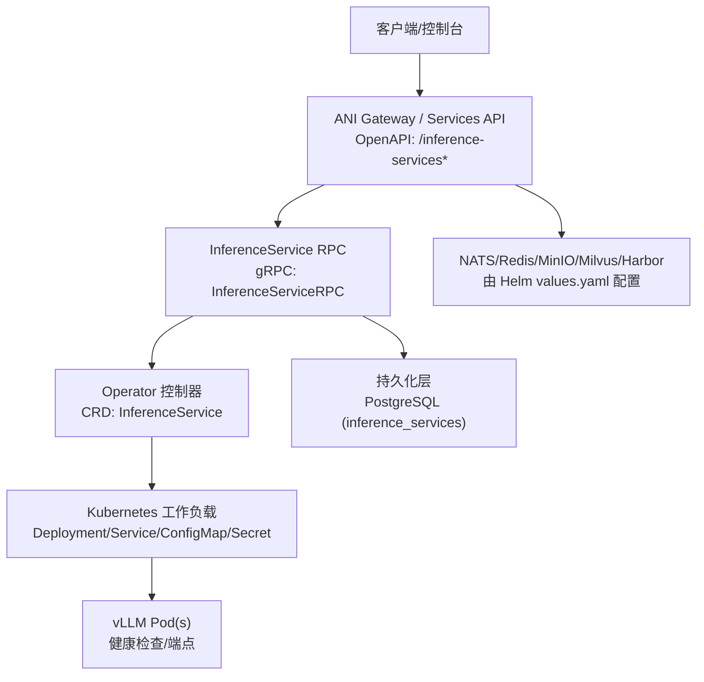
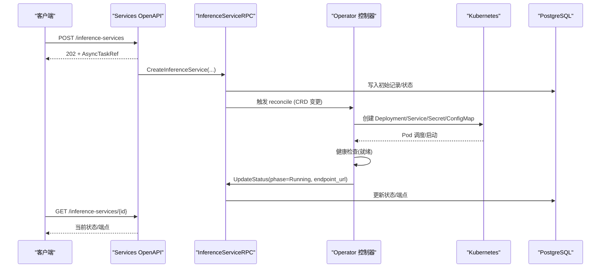
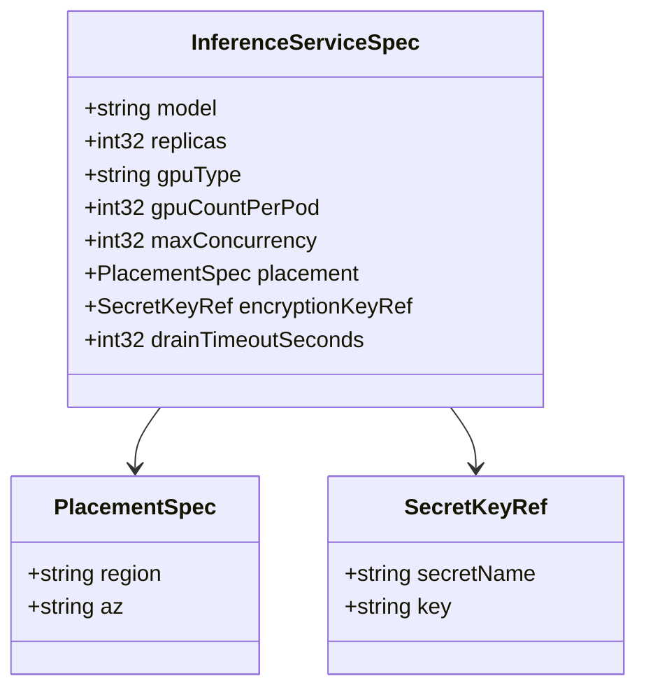
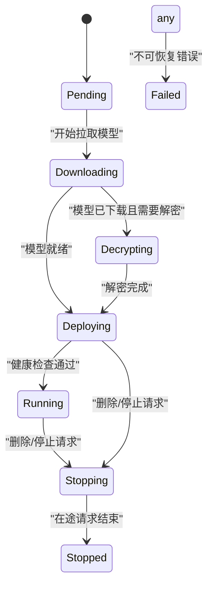
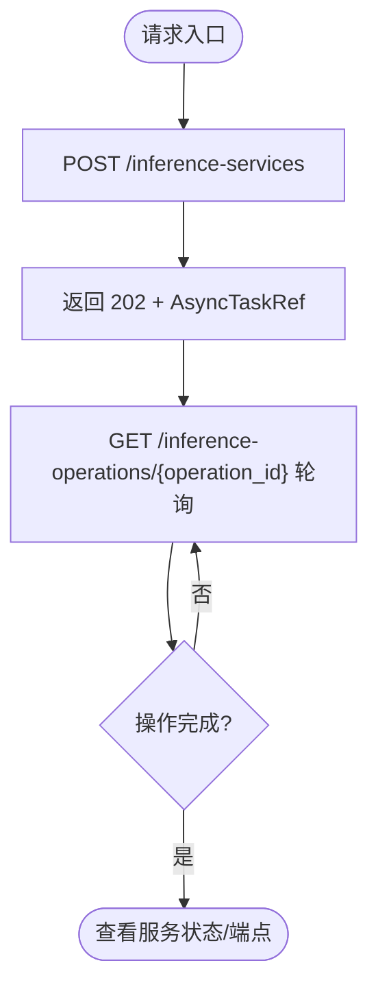
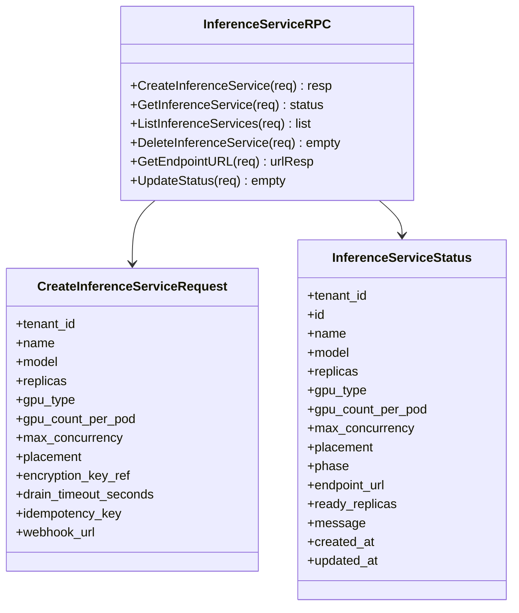
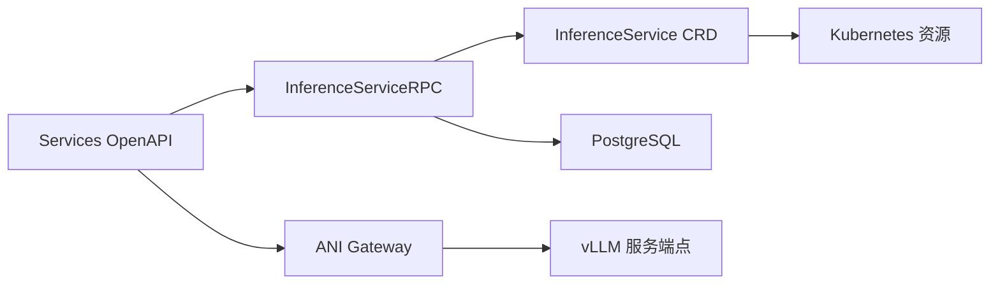

# 推理服务引擎配置

<cite>
**本文引用的文件**
- [inferenceservice_types.go](file://repo/operators/inference-operator/api/v1/inferenceservice_types.go)
- [inference_service.proto](file://repo/api/proto/inference/v1/inference_service.proto)
- [v1.yaml](file://repo/api/openapi/services/v1.yaml)
- [values.yaml](file://repo/deploy/helm/ani-platform/values.yaml)
- [20260501_001_init_schema.sql](file://repo/deploy/migrations/20260501_001_init_schema.sql)
- [config.py](file://repo/ai/rag-engine/app/core/config.py)
- [validate_inference_service_contract.py](file://repo/scripts/validate_inference_service_contract.py)
</cite>

## 目录
1. [简介](#简介)
2. [项目结构](#项目结构)
3. [核心组件](#核心组件)
4. [架构总览](#架构总览)
5. [详细组件分析](#详细组件分析)
6. [依赖关系分析](#依赖关系分析)
7. [性能与容量规划](#性能与容量规划)
8. [故障排查指南](#故障排查指南)
9. [结论](#结论)
10. [附录](#附录)

## 简介
本文件面向“推理服务引擎”的配置与部署，聚焦于 ANI 平台中基于 vLLM 的推理服务（InferenceService）如何从 API 契约、Kubernetes CRD、运行时编排到外部依赖（数据库、消息总线、对象存储等）的完整配置链路。内容覆盖：
- 推理服务的资源规格、副本、并发、放置策略、加密密钥引用、优雅停机参数
- 通过 OpenAPI 与 gRPC 暴露的创建、查询、列表、删除、端点获取、状态更新接口
- Helm 全局与基础设施配置对推理服务运行环境的影响
- 数据库表结构与生命周期阶段映射
- RAG 引擎对 vLLM 的调用配置（作为推理服务的使用方示例）

## 项目结构
推理服务相关的关键位置与职责如下：
- 算子 CRD 定义：operators/inference-operator/api/v1/inferenceservice_types.go
- 服务契约（gRPC）：api/proto/inference/v1/inference_service.proto
- 服务契约（OpenAPI）：api/openapi/services/v1.yaml
- 平台 Helm 配置：deploy/helm/ani-platform/values.yaml
- 数据持久化迁移：deploy/migrations/20260501_001_init_schema.sql
- 使用方配置示例（RAG 引擎调用 vLLM）：ai/rag-engine/app/core/config.py
- 契约校验脚本：scripts/validate_inference_service_contract.py

图表来源
- [v1.yaml:1300-1499](file://repo/api/openapi/services/v1.yaml#L1300-L1499)
- [inference_service.proto:11-33](file://repo/api/proto/inference/v1/inference_service.proto#L11-L33)
- [inferenceservice_types.go:55-96](file://repo/operators/inference-operator/api/v1/inferenceservice_types.go#L55-L96)
- [values.yaml:109-182](file://repo/deploy/helm/ani-platform/values.yaml#L109-L182)

章节来源
- [v1.yaml:1300-1499](file://repo/api/openapi/services/v1.yaml#L1300-L1499)
- [inference_service.proto:11-33](file://repo/api/proto/inference/v1/inference_service.proto#L11-L33)
- [inferenceservice_types.go:55-96](file://repo/operators/inference-operator/api/v1/inferenceservice_types.go#L55-L96)
- [values.yaml:109-182](file://repo/deploy/helm/ani-platform/values.yaml#L109-L182)

## 核心组件
- 推理服务 CRD（InferenceService）：声明模型、副本、GPU 类型与数量、最大并发、放置策略、加密密钥引用、优雅停机超时等期望态；控制器维护阶段与条件，驱动实际资源创建与健康检查。
- 推理服务 RPC（gRPC）：对外提供创建、查询、列表、删除、获取端点 URL、状态同步等能力，用于 Services 层与 Operator 之间的协作。
- Services OpenAPI：以 REST 风格暴露推理服务的创建、伸缩、生命周期操作、日志、测试、策略等路径，并统一错误响应与异步任务语义。
- Helm 平台配置：集中管理基础设施（PostgreSQL、NATS、Redis、MinIO、Milvus、Harbor、GPU 调度与虚拟化、运行时提供者等），影响推理服务运行环境与依赖可用性。
- 数据库迁移：定义 inference_services 表结构，承载租户、名称、模型版本、副本、GPU、并发、放置、状态、端点等信息。
- RAG 引擎配置：展示推理服务作为 LLM/Embedding 提供方时的连接参数与环境变量约定。

章节来源
- [inferenceservice_types.go:55-96](file://repo/operators/inference-operator/api/v1/inferenceservice_types.go#L55-L96)
- [inference_service.proto:11-33](file://repo/api/proto/inference/v1/inference_service.proto#L11-L33)
- [v1.yaml:1300-1499](file://repo/api/openapi/services/v1.yaml#L1300-L1499)
- [values.yaml:109-182](file://repo/deploy/helm/ani-platform/values.yaml#L109-L182)
- [20260501_001_init_schema.sql:186-208](file://repo/deploy/migrations/20260501_001_init_schema.sql#L186-L208)
- [config.py:33-78](file://repo/ai/rag-engine/app/core/config.py#L33-L78)

## 架构总览
推理服务从用户请求到 vLLM 运行的关键路径：
- 用户通过 Services OpenAPI 发起推理服务创建或生命周期操作，返回异步任务引用以便轮询。
- Services 层将请求转换为 gRPC 调用 InferenceServiceRPC，完成幂等校验、状态落库、触发 Operator 协调。
- Operator 根据 InferenceService CRD 的 Spec 创建/更新 Deployment、Service、ConfigMap、Secret，并拉取模型、解密（如需）、调度 Pod、执行健康检查。
- 运行后，Gateway 通过 GetEndpointURL 获取内部 K8s Service 地址进行流量转发。
- 所有状态变更通过 UpdateStatus 回写至 Services 层，供前端与监控消费。

图表来源
- [v1.yaml:1300-1499](file://repo/api/openapi/services/v1.yaml#L1300-L1499)
- [inference_service.proto:11-33](file://repo/api/proto/inference/v1/inference_service.proto#L11-L33)
- [inferenceservice_types.go:116-144](file://repo/operators/inference-operator/api/v1/inferenceservice_types.go#L116-L144)
- [20260501_001_init_schema.sql:186-208](file://repo/deploy/migrations/20260501_001_init_schema.sql#L186-L208)

## 详细组件分析

### 推理服务 CRD 与期望态（InferenceServiceSpec）
- 模型标识：不可变，格式为 name:version，变更后需重建。
- 副本数：默认 1，范围 1–32。
- GPU 类型与每 Pod 数量：支持 CPU-only 与 GPU 推理；可指定 GPU 型号与单 Pod 占用卡数。
- 最大并发：跨副本的并发上限，超出部分由网关排队而非直接拒绝。
- 放置策略：Region/AZ 偏好，用于派生多集群传播策略。
- 加密密钥引用：当模型版本为加密时，必须提供 Secret 引用。
- 优雅停机超时：停止时等待在途请求完成的秒数。

图表来源
- [inferenceservice_types.go:55-96](file://repo/operators/inference-operator/api/v1/inferenceservice_types.go#L55-L96)
- [inferenceservice_types.go:98-112](file://repo/operators/inference-operator/api/v1/inferenceservice_types.go#L98-L112)

章节来源
- [inferenceservice_types.go:55-96](file://repo/operators/inference-operator/api/v1/inferenceservice_types.go#L55-L96)
- [inferenceservice_types.go:98-112](file://repo/operators/inference-operator/api/v1/inferenceservice_types.go#L98-L112)

### 推理服务生命周期与状态机
- 阶段常量：Pending → Downloading → Decrypting → Deploying → Running → Stopping → Stopped；任意阶段可进入 Failed。
- 禁止转换：非 Deploying 不能直接进入 Running；Stopped/Failed 为终态。
- 条件：ModelReady、PodScheduled、Healthy、DrainComplete。
- 状态字段：phase、observedGeneration、endpointURL、readyReplicas、message、conditions。

图表来源
- [inferenceservice_types.go:16-42](file://repo/operators/inference-operator/api/v1/inferenceservice_types.go#L16-L42)
- [inferenceservice_types.go:116-144](file://repo/operators/inference-operator/api/v1/inferenceservice_types.go#L116-L144)

章节来源
- [inferenceservice_types.go:16-42](file://repo/operators/inference-operator/api/v1/inferenceservice_types.go#L16-L42)
- [inferenceservice_types.go:116-144](file://repo/operators/inference-operator/api/v1/inferenceservice_types.go#L116-L144)

### 推理服务 API 契约（OpenAPI）
- 主要路径：
  - POST /inference-services：创建推理服务，返回 202 与异步任务引用
  - GET /inference-services/{service_id}：查询详情
  - PATCH /inference-services/{service_id}：仅允许修改副本数（P0）
  - DELETE /inference-services/{service_id}：停止并删除
  - POST /inference-services/{service_id}/lifecycle：start/stop/restart
  - GET /inference-operations/{operation_id}：查询异步操作
  - GET /inference-services/{service_id}/logs：日志分页
  - POST /inference-services/{service_id}/test：测试调用
  - PUT /inference-services/{service_id}/policies：限流与访问策略（P0 未实现，返回 501）
- 认证与安全：BearerAuth/ApiKeyAuth；统一错误响应（400/401/403/404/409/422/503）。

图表来源
- [v1.yaml:1300-1499](file://repo/api/openapi/services/v1.yaml#L1300-L1499)

章节来源
- [v1.yaml:1300-1499](file://repo/api/openapi/services/v1.yaml#L1300-L1499)

### 推理服务 gRPC 契约
- 服务方法：Create/Get/List/Delete/GetEndpointURL/UpdateStatus
- 请求/响应包含租户、服务名、模型、副本、GPU、并发、放置、加密密钥引用、幂等键、Webhook、端点 URL、阶段、就绪副本数、时间戳等。
- UpdateStatus 由 Operator 调用，不对外暴露。

图表来源
- [inference_service.proto:11-33](file://repo/api/proto/inference/v1/inference_service.proto#L11-L33)
- [inference_service.proto:37-127](file://repo/api/proto/inference/v1/inference_service.proto#L37-L127)

章节来源
- [inference_service.proto:11-33](file://repo/api/proto/inference/v1/inference_service.proto#L11-L33)
- [inference_service.proto:37-127](file://repo/api/proto/inference/v1/inference_service.proto#L37-L127)

### 平台 Helm 配置与推理服务运行环境
- 基础设施模式：PostgreSQL/NATS/Redis/MinIO/Milvus/Harbor 均支持 external 模式，通过 Secret 注入连接信息。
- GPU 调度与虚拟化：可选启用 Volcano 队列（ani-inference/ani-training）、HAMi vGPU、DCGM 遥测。
- 运行时提供者：container/gpuContainer/inference 等；inference 提供者指向 ani-inference-operator。
- 网络与隔离：默认开启 NetworkPolicy；租户网络、管理网、公网入口等可配置。
- 服务镜像与端口：gateway/auth/model/task 等服务镜像仓库与端口可在 values 中调整。

章节来源
- [values.yaml:10-182](file://repo/deploy/helm/ani-platform/values.yaml#L10-L182)
- [values.yaml:237-262](file://repo/deploy/helm/ani-platform/values.yaml#L237-L262)

### 数据持久化与状态映射
- inference_services 表字段涵盖租户、名称、模型版本、副本、GPU 类型与数量、最大并发、放置区域/可用区、状态枚举、端点 URL、命名空间、Deployment 名称、错误信息、时间戳等。
- 状态枚举与 CRD 阶段一致，便于 Services 与 Operator 对齐。

章节来源
- [20260501_001_init_schema.sql:186-208](file://repo/deploy/migrations/20260501_001_init_schema.sql#L186-L208)

### RAG 引擎对 vLLM 的调用配置（使用方示例）
- 环境变量/配置项：vllm_model、vllm_api_base、vllm_api_key、vllm_context_window。
- 默认值与别名：支持多种环境变量命名方式；当缺失时会抛出运行时错误，要求上层注入或使用降级路径。
- 用途：RAG 引擎通过 OpenAI 兼容接口调用推理服务提供的 LLM/Embedding 能力。

章节来源
- [config.py:33-78](file://repo/ai/rag-engine/app/core/config.py#L33-L78)

## 依赖关系分析
- 外部依赖：
  - PostgreSQL：存储推理服务元数据与状态
  - NATS：异步任务与事件通道（由 Helm 配置）
  - Redis：会话/缓存（由 Helm 配置）
  - MinIO：对象存储（模型/文档等）
  - Milvus：向量检索（知识库场景）
  - Harbor：镜像仓库（运行时镜像）
- 内部依赖：
  - Services OpenAPI ↔ gRPC InferenceServiceRPC
  - gRPC ↔ Operator CRD 控制面
  - Operator ↔ Kubernetes 资源（Deployment/Service/Secret/ConfigMap）
  - Gateway ↔ InferenceService 端点路由

图表来源
- [v1.yaml:1300-1499](file://repo/api/openapi/services/v1.yaml#L1300-L1499)
- [inference_service.proto:11-33](file://repo/api/proto/inference/v1/inference_service.proto#L11-L33)
- [inferenceservice_types.go:55-96](file://repo/operators/inference-operator/api/v1/inferenceservice_types.go#L55-L96)
- [values.yaml:109-182](file://repo/deploy/helm/ani-platform/values.yaml#L109-L182)

章节来源
- [v1.yaml:1300-1499](file://repo/api/openapi/services/v1.yaml#L1300-L1499)
- [inference_service.proto:11-33](file://repo/api/proto/inference/v1/inference_service.proto#L11-L33)
- [inferenceservice_types.go:55-96](file://repo/operators/inference-operator/api/v1/inferenceservice_types.go#L55-L96)
- [values.yaml:109-182](file://repo/deploy/helm/ani-platform/values.yaml#L109-L182)

## 性能与容量规划
- 副本与并发：
  - replicas 决定横向扩展能力；max_concurrency 限制整体并发，超出部分由网关排队。
  - 建议根据模型大小、显存占用与 QPS 目标评估副本数与并发上限。
- GPU 资源：
  - gpuType 与 gpuCountPerPod 决定节点选择与调度；结合 Volcano 队列与 HAMi vGPU 可实现更细粒度分配。
  - 若使用 vGPU，需确保虚拟化组件与节点标签满足要求。
- 放置策略：
  - placement.region/az 可用于多集群/多 AZ 部署，提升容灾与就近访问。
- 优雅停机：
  - drainTimeoutSeconds 控制停止时等待在途请求的时间，避免中断长耗时推理。
- 健康检查：
  - 控制器会检查 vLLM 健康端点，只有健康后才标记 Running。

[本节为通用指导，不直接分析具体文件]

## 故障排查指南
- 创建失败：
  - 检查 OpenAPI 请求体是否满足必填字段与约束（如模型格式、副本范围、并发下限等）。
  - 确认幂等键与冲突处理逻辑（409）是否被正确使用。
- 模型拉取/解密失败：
  - 检查对象存储（MinIO）与模型版本是否存在；加密模型需正确配置 Secret 引用。
  - 观察 CRD 阶段是否为 Downloading/Decrypting，并查看 message 与 conditions。
- 调度失败：
  - 确认 GPU 资源与队列（Volcano）可用；检查节点标签与虚拟化（HAMi）配置。
  - 核对 Helm values 中的 GPU 调度与虚拟化开关及队列权重。
- 健康检查不通过：
  - 检查 vLLM 健康端点可达性与日志；确认容器资源限制与启动参数。
- 端点不可用：
  - 确认服务处于 Running 且 endpoint_url 已填充；Gateway 是否正确路由。
- 状态不同步：
  - 检查 Operator 是否成功调用 UpdateStatus；Services 层是否正确落库。

章节来源
- [validate_inference_service_contract.py:219-236](file://repo/scripts/validate_inference_service_contract.py#L219-L236)
- [inferenceservice_types.go:16-42](file://repo/operators/inference-operator/api/v1/inferenceservice_types.go#L16-L42)
- [inferenceservice_types.go:116-144](file://repo/operators/inference-operator/api/v1/inferenceservice_types.go#L116-L144)
- [values.yaml:109-182](file://repo/deploy/helm/ani-platform/values.yaml#L109-L182)

## 结论
推理服务引擎在 ANI 平台中以 CRD 为核心，配合 OpenAPI/gRPC 契约与 Operator 控制器，形成从用户请求到 vLLM 实例的端到端编排链路。通过 Helm 统一管理外部依赖与运行时提供者，结合数据库状态与生命周期阶段，实现了可观测、可运维、可扩展的推理服务管理能力。建议在容量规划与部署前，明确模型规模、GPU 资源、并发目标与放置策略，并通过健康检查与优雅停机保障稳定性。

[本节为总结性内容，不直接分析具体文件]

## 附录
- 常用配置项速查：
  - 副本数：replicas（默认 1，范围 1–32）
  - GPU：gpuType、gpuCountPerPod
  - 并发：maxConcurrency（默认 8，最小 1）
  - 放置：placement.region、placement.az
  - 加密：encryptionKeyRef.secretName、encryptionKeyRef.key
  - 停机：drainTimeoutSeconds（默认 30）
- 外部依赖（Helm）：
  - PostgreSQL/NATS/Redis/MinIO/Milvus/Harbor 均支持 external 模式，通过 Secret 注入连接信息
  - GPU 调度：Volcano 队列（ani-inference/ani-training）
  - 虚拟化：HAMi vGPU
  - 遥测：DCGM Exporter

[本节为补充信息，不直接分析具体文件]