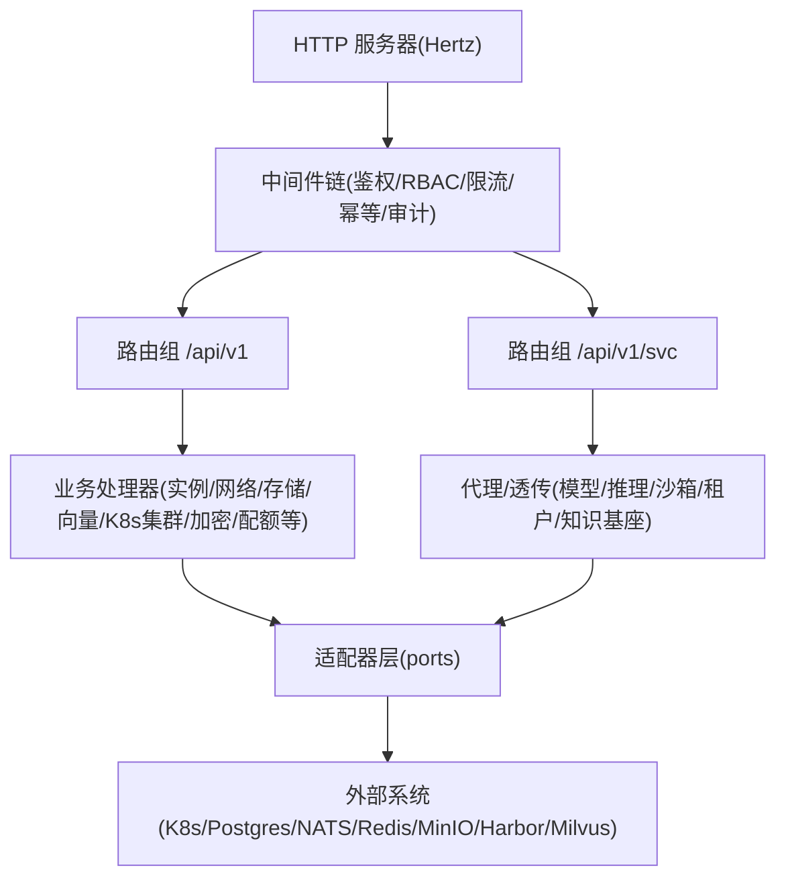
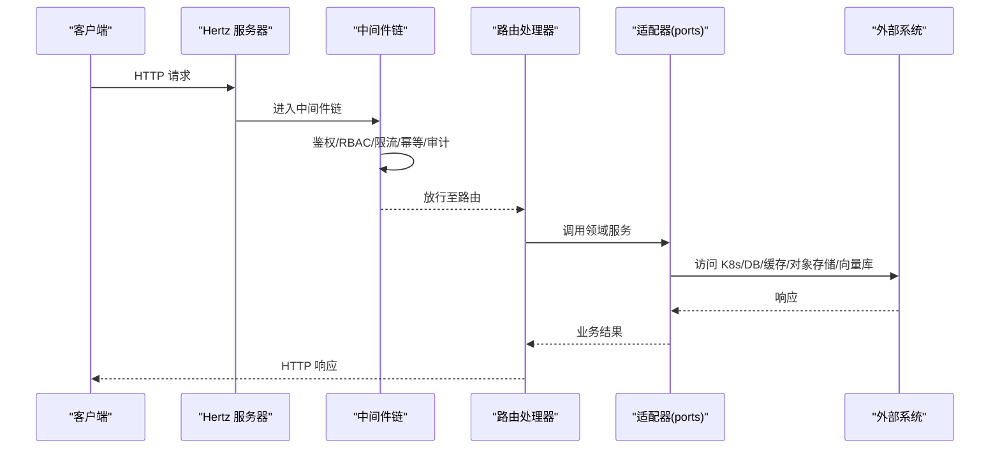
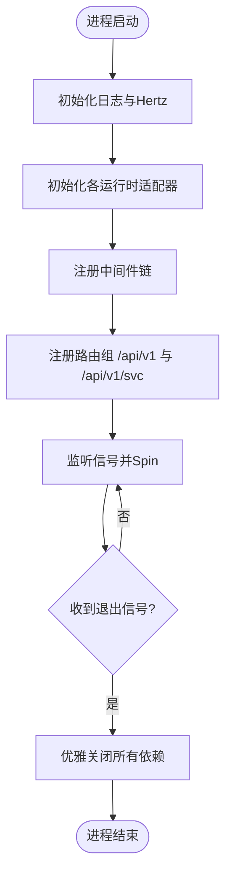
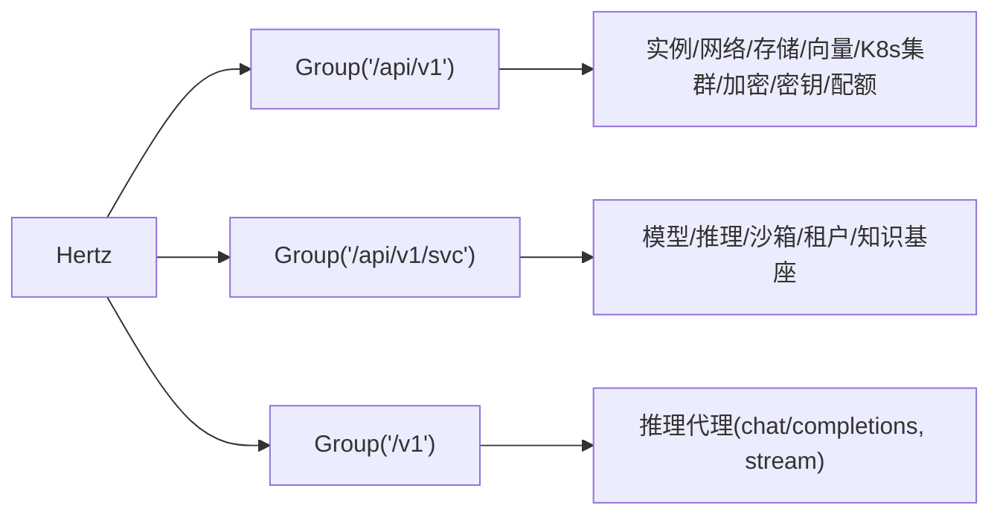
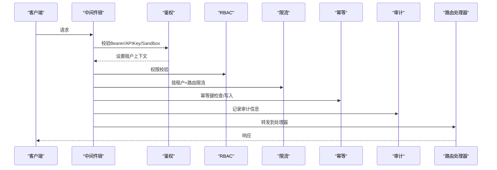
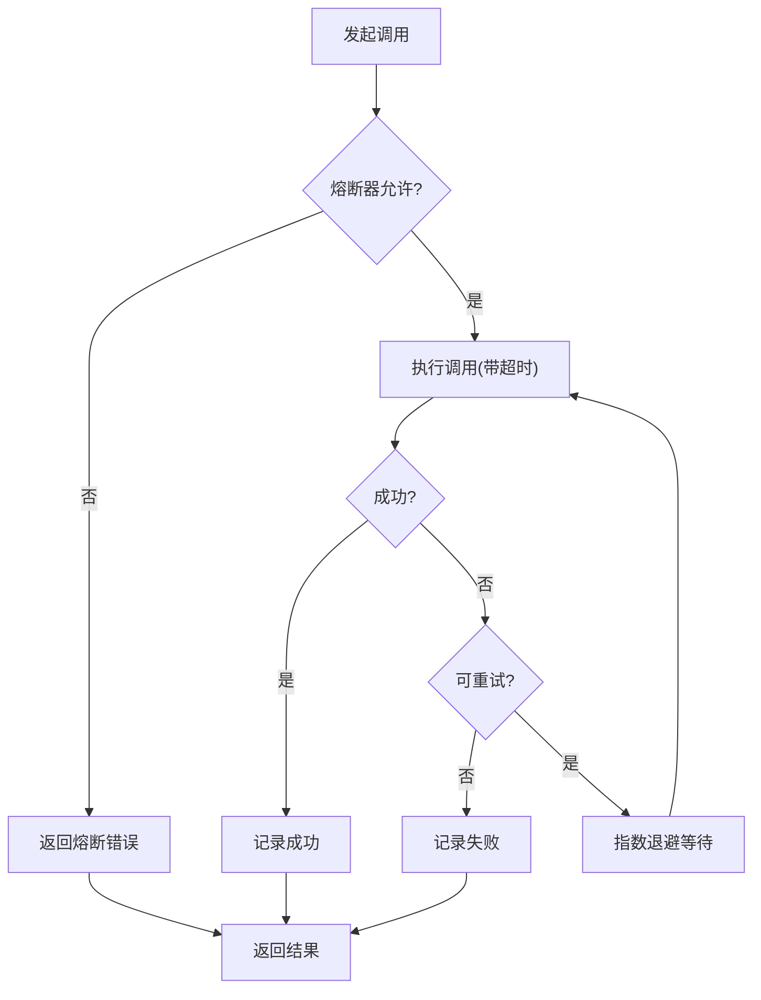
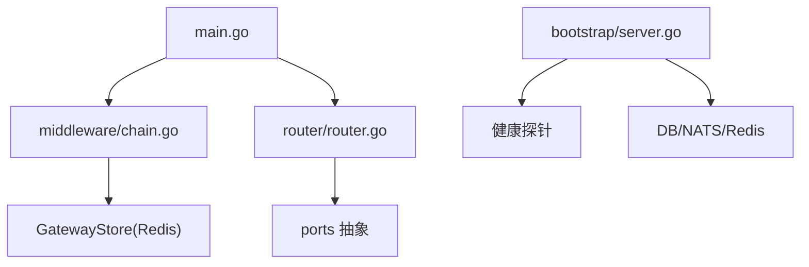

# 网关架构设计

<cite>
**本文引用的文件**
- [services/ani-gateway/main.go](file://services/ani-gateway/main.go)
- [services/ani-gateway/internal/router/router.go](file://services/ani-gateway/internal/router/router.go)
- [services/ani-gateway/internal/middleware/chain.go](file://services/ani-gateway/internal/middleware/chain.go)
- [services/ani-gateway/internal/middleware/auth.go](file://services/ani-gateway/internal/middleware/auth.go)
- [services/ani-gateway/internal/middleware/ratelimit.go](file://services/ani-gateway/internal/middleware/ratelimit.go)
- [pkg/bootstrap/server.go](file://pkg/bootstrap/server.go)
- [pkg/adapters/resilience/resilience.go](file://pkg/adapters/resilience/resilience.go)
- [deploy/helm/ani-platform/values.yaml](file://deploy/helm/ani-platform/values.yaml)
</cite>

## 目录
1. [简介](#简介)
2. [项目结构](#项目结构)
3. [核心组件](#核心组件)
4. [架构总览](#架构总览)
5. [详细组件分析](#详细组件分析)
6. [依赖关系分析](#依赖关系分析)
7. [性能与可靠性](#性能与可靠性)
8. [故障排查指南](#故障排查指南)
9. [结论](#结论)
10. [附录：配置与环境变量](#附录配置与环境变量)

## 简介
本文件面向 ANI 平台的 API 网关（ani-gateway），系统化阐述其整体架构模式、服务启动流程、依赖注入机制、路由注册、中间件链构建、请求处理管道，以及服务发现、负载均衡、熔断降级等关键特性。文档同时覆盖配置管理、环境变量与配置文件的使用方式，并提供扩展点示例路径，帮助读者快速理解并安全地扩展网关能力。

## 项目结构
ANI 网关采用“入口进程 + 可插拔适配器”的分层架构：
- 入口进程负责启动 HTTP 服务器、初始化运行时依赖、装配路由与中间件。
- 路由层按资源域划分，将 /api/v1/* 与 /api/v1/svc/* 两类接口分别注册到 Hertz 服务器。
- 中间件层提供鉴权、RBAC、限流、幂等、审计等横切能力。
- 适配层通过 ports 抽象对接存储、网络、对象存储、镜像仓库、向量库、Kubernetes 等后端能力。
- 引导与基础设施由 bootstrap 包统一连接数据库、NATS、Redis，并暴露健康探针与 gRPC 运行能力（供其他服务复用）。

**图表来源**
- [services/ani-gateway/main.go:20-220](file://services/ani-gateway/main.go#L20-L220)
- [services/ani-gateway/internal/router/router.go:42-102](file://services/ani-gateway/internal/router/router.go#L42-L102)
- [services/ani-gateway/internal/middleware/chain.go:7-21](file://services/ani-gateway/internal/middleware/chain.go#L7-L21)

**章节来源**
- [services/ani-gateway/main.go:20-220](file://services/ani-gateway/main.go#L20-L220)
- [services/ani-gateway/internal/router/router.go:42-102](file://services/ani-gateway/internal/router/router.go#L42-L102)
- [services/ani-gateway/internal/middleware/chain.go:7-21](file://services/ani-gateway/internal/middleware/chain.go#L7-L21)

## 核心组件
- 服务启动与生命周期管理：创建日志、启动 Hertz、初始化各运行时适配器、注册中间件与路由、监听信号优雅关闭。
- 依赖注入：通过 RegisterWithOptions 将各端口实现（如 K8sClusterService、StorageService、VectorStoreService 等）注入到路由层。
- 路由注册：集中式注册 /api/v1 与 /api/v1/svc 两组路由，支持可选能力（如 KB gRPC 客户端、SSE 流）的降级。
- 中间件链：固定顺序执行 RequestID → Auth → RBAC → RateLimit → Idempotency → Audit，确保横切能力一致生效。
- 共享存储：基于 Redis 的 GatewayStore 用于限流、幂等键等状态。
- 可观测性：健康探针、指标采集、审计日志、SSE 事件流。

**章节来源**
- [services/ani-gateway/main.go:20-220](file://services/ani-gateway/main.go#L20-L220)
- [services/ani-gateway/internal/router/router.go:13-40](file://services/ani-gateway/internal/router/router.go#L13-L40)
- [services/ani-gateway/internal/middleware/chain.go:7-21](file://services/ani-gateway/internal/middleware/chain.go#L7-L21)

## 架构总览
网关以 Hertz 为 HTTP 引擎，中间件链作为统一入口，路由层按资源域组织处理器，处理器通过 ports 抽象调用适配器层，最终访问 Kubernetes、数据库、消息总线、对象存储、向量库等外部系统。bootstrap 提供跨服务的通用能力（DB/NATS/Redis 连接、gRPC 运行、健康探针）。

**图表来源**
- [services/ani-gateway/main.go:20-220](file://services/ani-gateway/main.go#L20-L220)
- [services/ani-gateway/internal/middleware/chain.go:7-21](file://services/ani-gateway/internal/middleware/chain.go#L7-L21)
- [services/ani-gateway/internal/router/router.go:42-102](file://services/ani-gateway/internal/router/router.go#L42-L102)

## 详细组件分析

### 服务启动流程与依赖注入
- 启动步骤：
  - 初始化日志与 Hertz 服务器。
  - 依次初始化 K8s 集群代理、加密、密钥、GPU 库存、网络、存储、镜像仓库、实例运行时、GPU 调度队列、GPU 实例存储、向量库、实例可观测性、共享缓存（Redis）、可观测性服务、KB gRPC 客户端。
  - 启动审计工作器，注册中间件，注册路由。
  - 监听 SIGINT/SIGTERM，优雅关闭。
- 依赖注入：
  - 通过 RegisterWithOptions 将各服务实现注入到路由层，支持可选能力（如 VectorStoreService、KBServiceClient）为空时的降级。

**图表来源**
- [services/ani-gateway/main.go:20-220](file://services/ani-gateway/main.go#L20-L220)

**章节来源**
- [services/ani-gateway/main.go:20-220](file://services/ani-gateway/main.go#L20-L220)

### 路由注册机制
- 路由分组：
  - /api/v1：核心资源（实例、网络、存储、向量、K8s 集群、加密、密钥、邮件通知、配额等）。
  - /api/v1/svc：过渡期服务路由（模型、推理、沙箱、租户、知识基座等）。
  - /v1：OpenAI 兼容推理代理端点。
- 依赖注入点：
  - RegisterWithOptions 接收各端口实现，按需注入；当某些后端未配置时，路由仍可用但返回降级响应（如 503）。

**图表来源**
- [services/ani-gateway/internal/router/router.go:42-102](file://services/ani-gateway/internal/router/router.go#L42-L102)

**章节来源**
- [services/ani-gateway/internal/router/router.go:42-102](file://services/ani-gateway/internal/router/router.go#L42-L102)

### 中间件链构建与请求处理管道
- 执行顺序：RequestID → Auth → RBAC → RateLimit → Idempotency → Audit → Route。
- 鉴权策略：
  - 支持 Bearer Token、API Key、Sandbox 短令牌三种认证方式。
  - 公共路径（健康检查、品牌、登录、Token 刷新等）跳过鉴权。
  - 平台/管理路由仅允许 platform scope；sandbox token 仅允许子资源访问。
- 限流策略：
  - 基于 tenant_id + method + route_class 的窗口计数，使用共享存储（GatewayStore）实现。
  - 可通过环境变量调整请求数与时间窗口。
- 幂等与审计：
  - 幂等键基于请求标识与存储，避免重复提交。
  - 审计记录请求上下文与结果，便于追踪。

**图表来源**
- [services/ani-gateway/internal/middleware/chain.go:7-21](file://services/ani-gateway/internal/middleware/chain.go#L7-L21)
- [services/ani-gateway/internal/middleware/auth.go:18-141](file://services/ani-gateway/internal/middleware/auth.go#L18-L141)
- [services/ani-gateway/internal/middleware/ratelimit.go:14-56](file://services/ani-gateway/internal/middleware/ratelimit.go#L14-L56)

**章节来源**
- [services/ani-gateway/internal/middleware/chain.go:7-21](file://services/ani-gateway/internal/middleware/chain.go#L7-L21)
- [services/ani-gateway/internal/middleware/auth.go:18-141](file://services/ani-gateway/internal/middleware/auth.go#L18-L141)
- [services/ani-gateway/internal/middleware/ratelimit.go:14-56](file://services/ani-gateway/internal/middleware/ratelimit.go#L14-L56)

### 服务发现与负载均衡
- 服务发现：
  - 网关本身不直接实现服务发现，而是通过适配器与后端通信（如 K8s REST 客户端、gRPC 客户端）。
  - 对于 KB 服务，通过 gRPC 客户端进行调用；若未配置则返回 503 保持网关可用性。
- 负载均衡：
  - 网关侧未内置应用层负载均衡；对后端的负载均衡通常由基础设施（如 K8s Service/Ingress、NAT/Gateway 层）承担。
  - 多地址 Redis 模式可用于高可用缓存访问（见配置部分）。

**章节来源**
- [services/ani-gateway/main.go:154-166](file://services/ani-gateway/main.go#L154-L166)
- [services/ani-gateway/internal/router/router.go:29-37](file://services/ani-gateway/internal/router/router.go#L29-L37)

### 熔断与降级
- 熔断器：
  - 提供统一的熔断器实现，支持超时、重试、退避、失败率阈值、最小请求数、冷却周期等策略。
  - 适用于对外部系统的调用封装，避免雪崩。
- 降级：
  - 路由层对可选后端（如向量库、KB gRPC）提供空实现或降级逻辑，保证网关在缺少后端时仍可启动与提供服务。

**图表来源**
- [pkg/adapters/resilience/resilience.go:89-133](file://pkg/adapters/resilience/resilience.go#L89-L133)
- [pkg/adapters/resilience/resilience.go:166-223](file://pkg/adapters/resilience/resilience.go#L166-L223)

**章节来源**
- [pkg/adapters/resilience/resilience.go:89-133](file://pkg/adapters/resilience/resilience.go#L89-L133)
- [pkg/adapters/resilience/resilience.go:166-223](file://pkg/adapters/resilience/resilience.go#L166-L223)

### 可观测性与健康检查
- 健康探针：
  - 通过 bootstrap 提供的健康探针服务器，暴露依赖健康状态（DB/NATS/Redis 等）。
- 指标与审计：
  - 中间件审计记录请求上下文；可观测性服务支持 Prometheus 等指标采集。
  - SSE 流用于知识基座查询事件推送（当后端不可用时降级为空流）。

**章节来源**
- [pkg/bootstrap/server.go:387-445](file://pkg/bootstrap/server.go#L387-L445)
- [services/ani-gateway/internal/router/router.go:86-102](file://services/ani-gateway/internal/router/router.go#L86-L102)

## 依赖关系分析
- 入口 main 负责组装依赖并注入到路由层。
- 路由层依赖 ports 抽象，解耦具体实现。
- 中间件依赖共享存储（GatewayStore）实现限流与幂等。
- bootstrap 提供跨服务的基础设施连接与健康探针。

**图表来源**
- [services/ani-gateway/main.go:20-220](file://services/ani-gateway/main.go#L20-L220)
- [services/ani-gateway/internal/middleware/chain.go:7-21](file://services/ani-gateway/internal/middleware/chain.go#L7-L21)
- [services/ani-gateway/internal/router/router.go:42-102](file://services/ani-gateway/internal/router/router.go#L42-L102)
- [pkg/bootstrap/server.go:387-445](file://pkg/bootstrap/server.go#L387-L445)

**章节来源**
- [services/ani-gateway/main.go:20-220](file://services/ani-gateway/main.go#L20-L220)
- [services/ani-gateway/internal/middleware/chain.go:7-21](file://services/ani-gateway/internal/middleware/chain.go#L7-L21)
- [services/ani-gateway/internal/router/router.go:42-102](file://services/ani-gateway/internal/router/router.go#L42-L102)
- [pkg/bootstrap/server.go:387-445](file://pkg/bootstrap/server.go#L387-L445)

## 性能与可靠性
- 中间件顺序优化：
  - 鉴权前置减少无效请求进入后续链路。
  - 限流在鉴权之后，按租户粒度控制，避免热点租户影响整体。
- 并发与超时：
  - 调用外部系统时使用超时控制，防止阻塞。
  - 重试与退避结合熔断器，提升鲁棒性。
- 可扩展性：
  - 通过 ports 抽象新增后端能力，无需修改路由与中间件。
  - 路由注册支持可选后端，保障渐进式上线与灰度。

[本节为通用指导，不直接分析具体文件]

## 故障排查指南
- 鉴权失败：
  - 检查 Authorization 头或 X-API-Key 是否正确。
  - 确认路径是否属于公共路径白名单。
  - 平台/管理路由需 platform scope；sandbox token 仅允许子资源。
- 限流触发：
  - 检查 GATEWAY_RATE_LIMIT_REQUESTS 与 GATEWAY_RATE_LIMIT_WINDOW 配置。
  - 查看 GatewayStore 是否可达（Redis 连接）。
- 熔断触发：
  - 检查后端健康与错误码（5xx/429/网络错误）。
  - 调整熔断策略（FailureRatio、MinRequests、CooldownPeriod）。
- 健康探针：
  - 通过 bootstrap 的健康探针检查 DB/NATS/Redis 等依赖状态。

**章节来源**
- [services/ani-gateway/internal/middleware/auth.go:18-141](file://services/ani-gateway/internal/middleware/auth.go#L18-L141)
- [services/ani-gateway/internal/middleware/ratelimit.go:14-56](file://services/ani-gateway/internal/middleware/ratelimit.go#L14-L56)
- [pkg/adapters/resilience/resilience.go:89-133](file://pkg/adapters/resilience/resilience.go#L89-L133)
- [pkg/bootstrap/server.go:387-445](file://pkg/bootstrap/server.go#L387-L445)

## 结论
ANI 网关以清晰的层次化架构与可插拔适配器实现了高内聚、低耦合的请求处理能力。通过中间件链统一横切关注点，路由层按资源域组织，配合熔断与降级策略，保障了在高负载与后端不稳定场景下的稳定性。配置与环境变量驱动部署灵活性，helm values 提供了丰富的环境定制能力。

[本节为总结，不直接分析具体文件]

## 附录：配置与环境变量
- 网关监听地址：
  - GATEWAY_LISTEN_ADDR（默认 :8080）
- Redis 共享存储：
  - GATEWAY_REDIS_URL / REDIS_URL
  - GATEWAY_REDIS_MODE / REDIS_MODE
  - GATEWAY_REDIS_ADDRS / REDIS_ADDRS
  - GATEWAY_REDIS_DB / REDIS_DB
  - GATEWAY_REDIS_USERNAME / REDIS_USERNAME
  - GATEWAY_REDIS_PASSWORD / REDIS_PASSWORD
  - GATEWAY_REDIS_MASTER_NAME / REDIS_MASTER_NAME
  - GATEWAY_REDIS_SENTINEL_USERNAME / REDIS_SENTINEL_USERNAME
  - GATEWAY_REDIS_SENTINEL_PASSWORD / REDIS_SENTINEL_PASSWORD
- 限流配置：
  - GATEWAY_RATE_LIMIT_REQUESTS
  - GATEWAY_RATE_LIMIT_WINDOW
- 开发模式鉴权：
  - ANI_AUTH_MODE=dev（配合 X-Dev-Tenant-ID、X-Dev-User-ID）
- Helm 值（示例片段）：
  - global.namespace、infrastructure.postgresql/nats/redis/minio/milvus/harbor 的模式与版本
  - runtime.providers.* 启用开关与 provider 选择
  - instances.providerExecution.* 控制实例执行行为

**章节来源**
- [services/ani-gateway/main.go:223-271](file://services/ani-gateway/main.go#L223-L271)
- [services/ani-gateway/internal/middleware/ratelimit.go:58-71](file://services/ani-gateway/internal/middleware/ratelimit.go#L58-L71)
- [deploy/helm/ani-platform/values.yaml:1-200](file://deploy/helm/ani-platform/values.yaml#L1-L200)