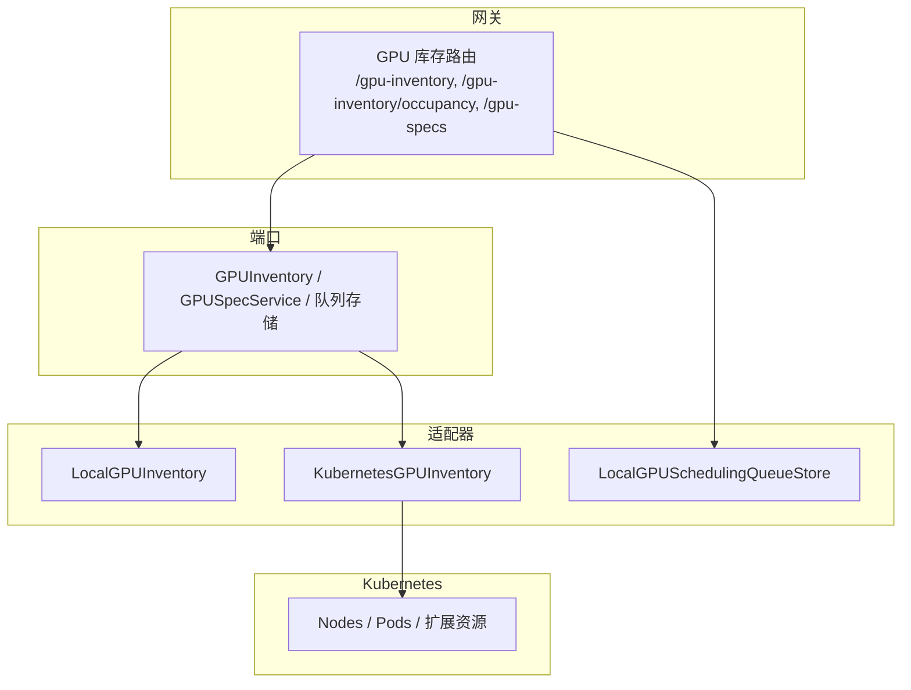
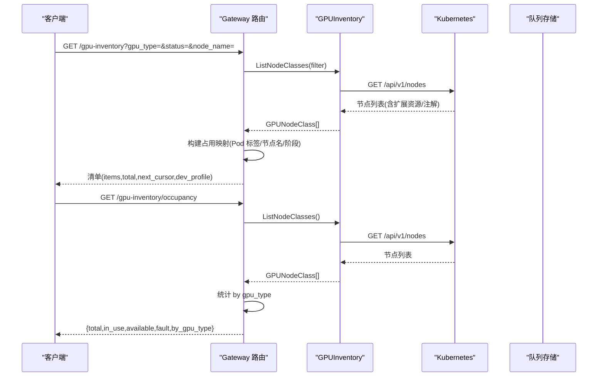
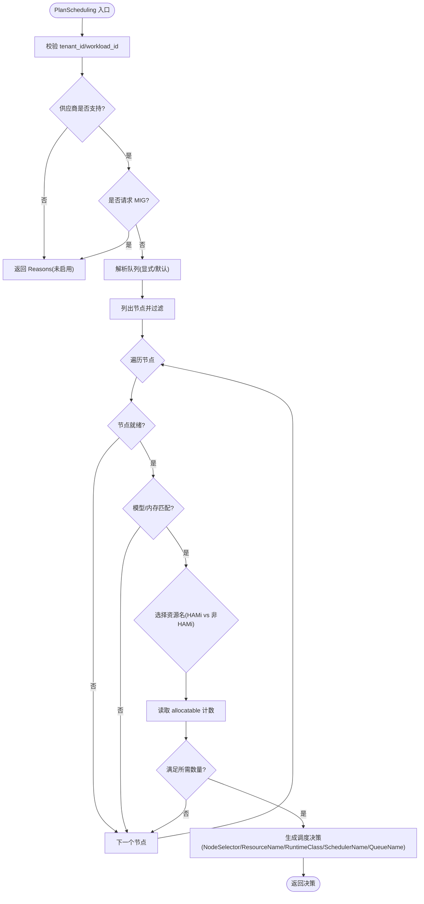
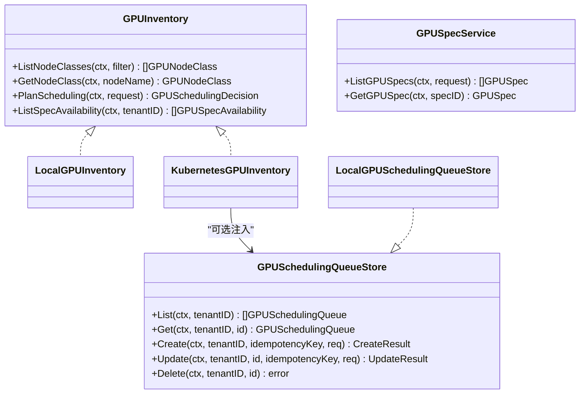

# GPU 库存处理器

<cite>
**本文引用的文件**
- [gpu_inventory_runtime.go](file://services/ani-gateway/gpu_inventory_runtime.go)
- [gpu_inventory_resources.go](file://services/ani-gateway/internal/router/gpu_inventory_resources.go)
- [kubernetes_gpu_inventory.go](file://pkg/adapters/runtime/kubernetes_gpu_inventory.go)
- [local_gpu_inventory.go](file://pkg/adapters/runtime/local_gpu_inventory.go)
- [gpu_inventory.go](file://pkg/ports/gpu_inventory.go)
- [gpu_scheduling.go](file://pkg/ports/gpu_scheduling.go)
- [local_gpu_scheduling_queue_store.go](file://pkg/adapters/runtime/local_gpu_scheduling_queue_store.go)
- [v1.yaml](file://api/openapi/v1.yaml)
</cite>

## 目录
1. [简介](#简介)
2. [项目结构](#项目结构)
3. [核心组件](#核心组件)
4. [架构总览](#架构总览)
5. [详细组件分析](#详细组件分析)
6. [依赖关系分析](#依赖关系分析)
7. [性能与可扩展性](#性能与可扩展性)
8. [故障排查指南](#故障排查指南)
9. [结论](#结论)
10. [附录：API 契约与示例](#附录api-契约与示例)

## 简介
本文件面向 GPU 库存处理器的设计与实现，聚焦以下目标：
- GPU 资源发现、监控与管理：从 Kubernetes 节点与设备插件（含 HAMi）中采集 GPU 能力、状态与可分配资源。
- GPU 库存查询 API：提供 GPU 清单、占用率统计、GPU 规格列表等接口。
- GPU 容器管理接口：通过实例服务与调度决策，将工作负载调度到合适的 GPU 节点或 vGPU 切片。
- 状态同步机制：基于 K8s Pod 标签与节点状态，回显“归属实例”并标记占用。
- 资源分配策略与负载均衡：按虚拟化管理模式（整卡/vGPU/HAMi）、队列选择、模型偏好与内存需求进行决策。
- 故障检测与处理：节点就绪、供应商限制、MIG 支持范围、队列校验等。
- 与 Kubernetes 的交互方式：REST 客户端访问 Nodes/Pods，解析扩展资源与注解，驱动调度约束生成。

## 项目结构
GPU 库存处理器由三层组成：
- Gateway 层：暴露 REST API，组装请求参数、调用适配器、返回响应。
- Ports 层：定义跨实现的统一接口与数据结构（如 GPUInventory、GPUSpecService、队列存储）。
- Adapters 层：具体实现，包括本地模拟与 Kubernetes 真实适配。

图表来源
- [gpu_inventory_resources.go:153-160](file://services/ani-gateway/internal/router/gpu_inventory_resources.go#L153-L160)
- [kubernetes_gpu_inventory.go:32-52](file://pkg/adapters/runtime/kubernetes_gpu_inventory.go#L32-L52)
- [local_gpu_inventory.go:11-49](file://pkg/adapters/runtime/local_gpu_inventory.go#L11-L49)
- [local_gpu_scheduling_queue_store.go:15-77](file://pkg/adapters/runtime/local_gpu_scheduling_queue_store.go#L15-L77)

章节来源
- [gpu_inventory_resources.go:153-160](file://services/ani-gateway/internal/router/gpu_inventory_resources.go#L153-L160)
- [gpu_inventory_runtime.go:43-66](file://services/ani-gateway/gpu_inventory_runtime.go#L43-L66)

## 核心组件
- GPU 库存适配器
  - LocalGPUInventory：开发/本地环境模拟节点与设备，便于无依赖调试。
  - KubernetesGPUInventory：从 K8s 节点与设备插件（含 HAMi）采集 GPU 能力、状态、可分配资源，并生成调度决策。
- GPU 规格服务
  - 基于适配器提供的节点与设备信息，计算规格可用性（当前实现为占位，后续接入配额与预留）。
- 调度队列存储
  - LocalGPUSchedulingQueueStore：内存实现，预置平台默认队列（推理/训练），支持租户隔离、名称冲突、幂等创建/更新。
- Gateway 路由
  - 注册 /gpu-inventory、/gpu-inventory/occupancy、/gpu-specs、/sandbox-templates 等端点，聚合适配器数据并返回分页结果。

章节来源
- [kubernetes_gpu_inventory.go:54-90](file://pkg/adapters/runtime/kubernetes_gpu_inventory.go#L54-L90)
- [local_gpu_inventory.go:51-117](file://pkg/adapters/runtime/local_gpu_inventory.go#L51-L117)
- [gpu_inventory_resources.go:153-220](file://services/ani-gateway/internal/router/gpu_inventory_resources.go#L153-L220)
- [gpu_scheduling.go:18-83](file://pkg/ports/gpu_scheduling.go#L18-L83)

## 架构总览
GPU 库存处理器通过 Gateway 暴露 API，内部通过 Ports 抽象解耦实现。生产环境使用 Kubernetes 适配器读取集群节点与设备信息；开发环境使用本地适配器。调度决策结合队列存储与 K8s 扩展资源，输出 NodeSelector、ResourceName、RuntimeClass、SchedulerName、QueueName 等约束。

图表来源
- [gpu_inventory_resources.go:193-211](file://services/ani-gateway/internal/router/gpu_inventory_resources.go#L193-L211)
- [kubernetes_gpu_inventory.go:54-73](file://pkg/adapters/runtime/kubernetes_gpu_inventory.go#L54-L73)

章节来源
- [gpu_inventory_resources.go:193-211](file://services/ani-gateway/internal/router/gpu_inventory_resources.go#L193-L211)
- [kubernetes_gpu_inventory.go:54-73](file://pkg/adapters/runtime/kubernetes_gpu_inventory.go#L54-L73)

## 详细组件分析

### GPU 库存适配器（Kubernetes）
职责
- 列出节点类并过滤：根据供应商、池、标签筛选。
- 解析节点能力：从 capacity/allocatable 提取 nvidia.com/gpu 与 nvidia.com/vgpu 数量。
- 解析 HAMi 注解：恢复物理卡身份、型号、显存与健康状态，标记 vGPU 虚拟化模式。
- 生成调度决策：拒绝不支持的供应商/MIG，解析队列，选择资源名与运行时类，输出调度约束。

关键流程
- 节点就绪判断：基于条件 Ready。
- 资源名选择：HAMi 节点 vGPU 使用 nvidia.com/gpu；非 HAMi 节点 vGPU 使用 nvidia.com/vgpu。
- 队列解析：优先显式队列（需存在且属于租户），否则按 WorkloadClass 选择默认队列。
- 节点匹配：优先模型匹配，其次内存需求，最后可用扩展资源计数。

图表来源
- [kubernetes_gpu_inventory.go:92-173](file://pkg/adapters/runtime/kubernetes_gpu_inventory.go#L92-L173)
- [kubernetes_gpu_inventory.go:175-295](file://pkg/adapters/runtime/kubernetes_gpu_inventory.go#L175-L295)
- [kubernetes_gpu_inventory.go:306-332](file://pkg/adapters/runtime/kubernetes_gpu_inventory.go#L306-L332)
- [kubernetes_gpu_inventory.go:369-451](file://pkg/adapters/runtime/kubernetes_gpu_inventory.go#L369-L451)

章节来源
- [kubernetes_gpu_inventory.go:92-173](file://pkg/adapters/runtime/kubernetes_gpu_inventory.go#L92-L173)
- [kubernetes_gpu_inventory.go:175-295](file://pkg/adapters/runtime/kubernetes_gpu_inventory.go#L175-L295)
- [kubernetes_gpu_inventory.go:306-332](file://pkg/adapters/runtime/kubernetes_gpu_inventory.go#L306-L332)
- [kubernetes_gpu_inventory.go:369-451](file://pkg/adapters/runtime/kubernetes_gpu_inventory.go#L369-L451)

### GPU 库存适配器（本地）
职责
- 提供固定节点与设备用于开发测试。
- 模拟 P0 供应商与 MIG 门控逻辑，保证开发者体验一致。
- 生成调度决策：选择第一个就绪节点，输出资源名、运行时类、队列名与原因。

章节来源
- [local_gpu_inventory.go:11-49](file://pkg/adapters/runtime/local_gpu_inventory.go#L11-L49)
- [local_gpu_inventory.go:71-117](file://pkg/adapters/runtime/local_gpu_inventory.go#L71-L117)

### Gateway 路由与 API
端点
- GET /gpu-inventory：列出 GPU 设备清单，支持 gpu_type/status/node_name 过滤，返回 items/total/next_cursor/dev_profile。
- GET /gpu-inventory/occupancy：统计占用情况，按 gpu_type 分组，返回 total/in_use/available/fault/by_gpu_type。
- GET /gpu-specs：列出 GPU 规格，支持 available/gpu_type/limit/cursor 过滤。
- GET /gpu-specs/:spec_id：获取单个规格详情。
- GET /sandbox-templates：列出沙箱模板（与 GPU 页面展示相关）。

数据流
- 清单：调用适配器列出节点类，构建设备记录，合并占用映射（Pod 标签 ani.kubercloud.io/instance + nodeName + phase）。
- 占用：遍历节点设备，统计状态并按类型分桶。
- 规格：基于适配器与本地规格服务，计算可用性与元数据。

错误处理
- 将 ports 层错误映射为 HTTP 状态码：NOT_FOUND/CONFLICT/BAD_REQUEST/UNSUPPORTED。

章节来源
- [gpu_inventory_resources.go:153-220](file://services/ani-gateway/internal/router/gpu_inventory_resources.go#L153-L220)
- [gpu_inventory_resources.go:234-295](file://services/ani-gateway/internal/router/gpu_inventory_resources.go#L234-L295)
- [gpu_inventory_resources.go:325-435](file://services/ani-gateway/internal/router/gpu_inventory_resources.go#L325-L435)
- [gpu_inventory_resources.go:487-500](file://services/ani-gateway/internal/router/gpu_inventory_resources.go#L487-L500)

### GPU 规格服务与可用性
- 当前 ListSpecAvailability 在适配器中返回“未支持”，待接入配额与预留后完善。
- 规格可用性视图包含 specID、状态、可用数量、是否有匹配节点、是否有空闲设备、设备空闲数、GPU 数量等字段。

章节来源
- [gpu_inventory.go:141-171](file://pkg/ports/gpu_inventory.go#L141-L171)
- [kubernetes_gpu_inventory.go:543-549](file://pkg/adapters/runtime/kubernetes_gpu_inventory.go#L543-L549)

### 调度队列存储
- 内存实现预置平台默认队列（推理/训练），支持租户隔离、名称冲突检测、幂等创建/更新。
- 保护平台默认队列不被修改或删除。
- 队列名称遵循 K8s 资源命名规范。

章节来源
- [local_gpu_scheduling_queue_store.go:15-77](file://pkg/adapters/runtime/local_gpu_scheduling_queue_store.go#L15-L77)
- [local_gpu_scheduling_queue_store.go:79-239](file://pkg/adapters/runtime/local_gpu_scheduling_queue_store.go#L79-L239)
- [gpu_scheduling.go:18-83](file://pkg/ports/gpu_scheduling.go#L18-L83)

### 与 Kubernetes 的交互
- 读取 Nodes：/api/v1/nodes，解析 capacity/allocatable、labels/annotations、conditions。
- 读取 Pods：按租户 label 过滤，提取 instance 标签、nodeName、phase，用于占用映射。
- 扩展资源：nvidia.com/gpu 与 nvidia.com/vgpu，HAMi 场景下 vGPU 以 nvidia.com/gpu 报告。
- 注解：hami.io/node-nvidia-register 用于恢复物理卡信息。

章节来源
- [kubernetes_gpu_inventory.go:334-451](file://pkg/adapters/runtime/kubernetes_gpu_inventory.go#L334-L451)
- [gpu_inventory_resources.go:437-477](file://services/ani-gateway/internal/router/gpu_inventory_resources.go#L437-L477)

## 依赖关系分析

图表来源
- [gpu_inventory.go:155-171](file://pkg/ports/gpu_inventory.go#L155-L171)
- [gpu_scheduling.go:62-83](file://pkg/ports/gpu_scheduling.go#L62-L83)
- [kubernetes_gpu_inventory.go:32-52](file://pkg/adapters/runtime/kubernetes_gpu_inventory.go#L32-L52)
- [local_gpu_scheduling_queue_store.go:15-77](file://pkg/adapters/runtime/local_gpu_scheduling_queue_store.go#L15-L77)

章节来源
- [gpu_inventory.go:155-171](file://pkg/ports/gpu_inventory.go#L155-L171)
- [gpu_scheduling.go:62-83](file://pkg/ports/gpu_scheduling.go#L62-L83)

## 性能与可扩展性
- 节点列表缓存：当前每次清单查询直接调用 K8s API，可在高并发场景引入短期缓存以减少压力。
- 占用映射优化：Pod 列表按租户过滤，建议在大规模集群中使用更高效的选择器或增量同步。
- 适配器扩展：新增供应商或虚拟化方案时，仅需实现 GPUInventory 接口，保持 Gateway 不变。
- 队列存储扩展：Volcano REST 适配器可替换内存实现，保持接口一致性。

[本节为通用指导，不直接分析具体文件]

## 故障排查指南
常见问题与定位
- 节点不可用：检查节点 Ready 条件与 Reason，确认设备插件与 HAMi 是否正常。
- 供应商不支持：P0 仅支持 NVIDIA，Ascend/Hygon 会返回 Reasons 提示未启用。
- MIG 模式不支持：P0 未启用 MIG，请求将被拒绝并返回原因。
- 队列不存在：显式队列必须存在且属于租户；未配置队列存储时仅走默认队列。
- 占用显示异常：确认 Pod 标签 ani.kubercloud.io/instance 与 nodeName、phase 正确；Running 状态的 Pod 才会计入占用。

章节来源
- [kubernetes_gpu_inventory.go:92-173](file://pkg/adapters/runtime/kubernetes_gpu_inventory.go#L92-L173)
- [kubernetes_gpu_inventory.go:504-515](file://pkg/adapters/runtime/kubernetes_gpu_inventory.go#L504-L515)
- [gpu_inventory_resources.go:437-477](file://services/ani-gateway/internal/router/gpu_inventory_resources.go#L437-L477)

## 结论
GPU 库存处理器通过清晰的分层与接口抽象，实现了从 Kubernetes 集群发现 GPU 资源、统计占用、生成调度决策的能力。当前版本聚焦 NVIDIA 整卡与 vGPU（HAMi），对队列管理与租户隔离提供了基础保障。后续可完善规格可用性计算、配额与预留、以及更细粒度的设备级占用追踪。

[本节为总结，不直接分析具体文件]

## 附录：API 契约与示例

### 请求/响应结构
- GET /gpu-inventory
  - 查询参数：gpu_type、status、node_name、limit、cursor
  - 响应体：items（设备记录）、total、next_cursor、dev_profile
- GET /gpu-inventory/occupancy
  - 响应体：total、in_use、available、fault、by_gpu_type、dev_profile
- GET /gpu-specs
  - 查询参数：available、gpu_type、limit、cursor
  - 响应体：items（规格）、total、next_cursor
- GET /gpu-specs/:spec_id
  - 响应体：单条规格详情

章节来源
- [gpu_inventory_resources.go:153-220](file://services/ani-gateway/internal/router/gpu_inventory_resources.go#L153-L220)
- [v1.yaml:1-200](file://api/openapi/v1.yaml#L1-L200)

### 业务规则与数据验证
- 供应商限制：P0 仅支持 NVIDIA；其他供应商返回 Reasons。
- 虚拟化模式：MIG 未启用；vGPU 通过 HAMi 或原生设备插件区分资源名。
- 队列选择：显式队列需存在且属于租户；否则按 WorkloadClass 选择默认队列。
- 节点匹配：优先模型匹配，其次内存需求，最终依据扩展资源计数。
- 占用映射：仅 Running 且带实例标签的 Pod 计入占用；同节点多实例取字典序最小实例 ID。

章节来源
- [kubernetes_gpu_inventory.go:92-173](file://pkg/adapters/runtime/kubernetes_gpu_inventory.go#L92-L173)
- [kubernetes_gpu_inventory.go:175-295](file://pkg/adapters/runtime/kubernetes_gpu_inventory.go#L175-L295)
- [gpu_inventory_resources.go:325-435](file://services/ani-gateway/internal/router/gpu_inventory_resources.go#L325-L435)

### 代码示例路径
- 查询 GPU 状态
  - 清单：[listGPUInventory:193-202](file://services/ani-gateway/internal/router/gpu_inventory_resources.go#L193-L202)
  - 占用：[getGPUOccupancy:204-211](file://services/ani-gateway/internal/router/gpu_inventory_resources.go#L204-L211)
- 管理 GPU 容器（调度决策）
  - 计划调度：[PlanScheduling:92-173](file://pkg/adapters/runtime/kubernetes_gpu_inventory.go#L92-L173)
  - 本地模拟：[LocalGPUInventory.PlanScheduling:71-117](file://pkg/adapters/runtime/local_gpu_inventory.go#L71-L117)
- 配置 GPU 调度策略（队列）
  - 队列存储：[LocalGPUSchedulingQueueStore:15-77](file://pkg/adapters/runtime/local_gpu_scheduling_queue_store.go#L15-L77)
  - 队列接口：[GPUSchedulingQueueStore:62-83](file://pkg/ports/gpu_scheduling.go#L62-L83)

章节来源
- [gpu_inventory_resources.go:193-211](file://services/ani-gateway/internal/router/gpu_inventory_resources.go#L193-L211)
- [kubernetes_gpu_inventory.go:92-173](file://pkg/adapters/runtime/kubernetes_gpu_inventory.go#L92-L173)
- [local_gpu_inventory.go:71-117](file://pkg/adapters/runtime/local_gpu_inventory.go#L71-L117)
- [local_gpu_scheduling_queue_store.go:15-77](file://pkg/adapters/runtime/local_gpu_scheduling_queue_store.go#L15-L77)
- [gpu_scheduling.go:62-83](file://pkg/ports/gpu_scheduling.go#L62-L83)