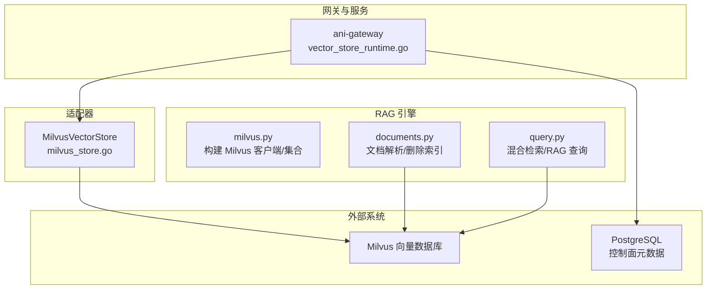
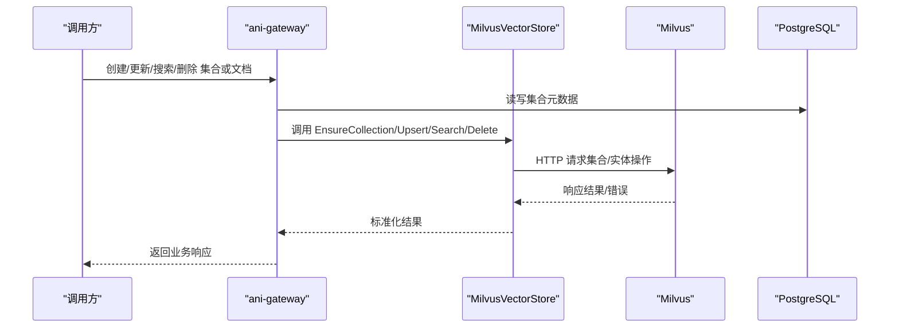
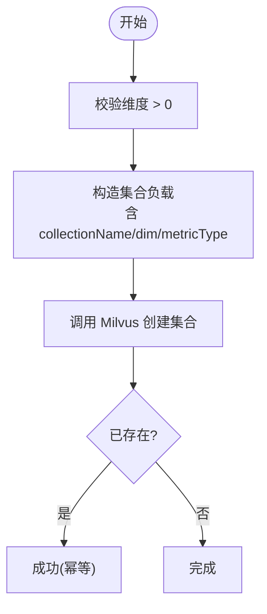
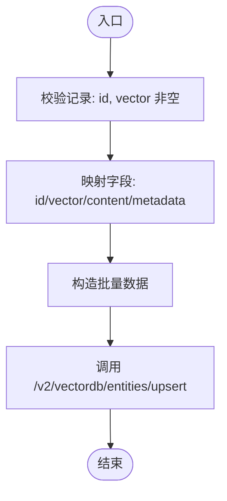
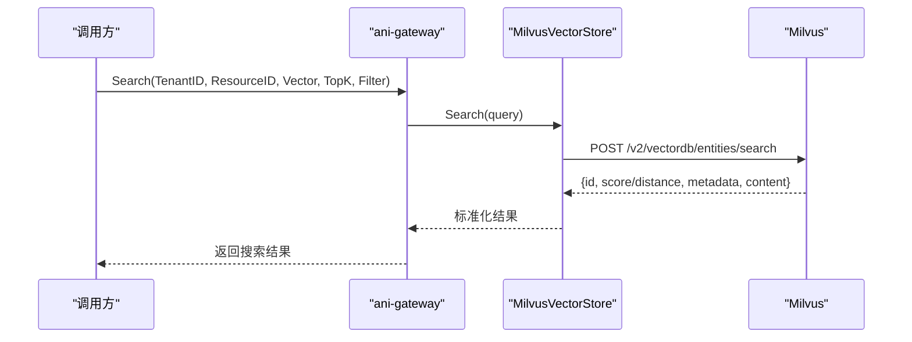
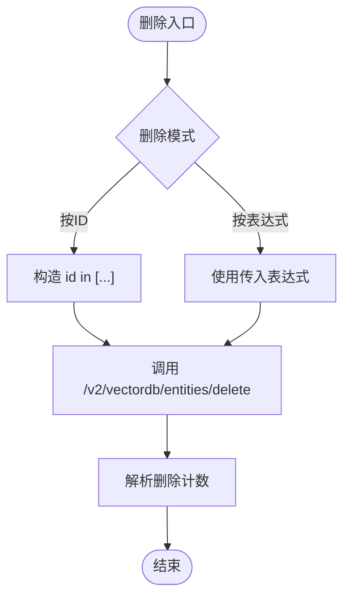
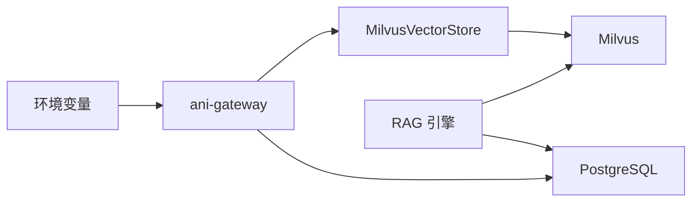

# 向量存储处理器

<cite>
**本文引用的文件**   
- [vector_store.go](file://repo/pkg/ports/vector_store.go)
- [milvus_store.go](file://repo/pkg/adapters/vectorstore/milvus_store.go)
- [vector_store_runtime.go](file://repo/services/ani-gateway/vector_store_runtime.go)
- [milvus.py](file://repo/ai/rag-engine/app/core/milvus.py)
- [documents.py](file://repo/ai/rag-engine/app/routers/documents.py)
- [query.py](file://repo/ai/rag-engine/app/routers/query.py)
- [config.py](file://repo/ai/rag-engine/app/core/config.py)
- [milvus.yaml](file://repo/deploy/helm/ani-platform/component-contracts/milvus.yaml)
</cite>

## 目录
1. [简介](#简介)
2. [项目结构](#项目结构)
3. [核心组件](#核心组件)
4. [架构总览](#架构总览)
5. [详细组件分析](#详细组件分析)
6. [依赖关系分析](#依赖关系分析)
7. [性能与索引优化](#性能与索引优化)
8. [故障排查指南](#故障排查指南)
9. [结论](#结论)
10. [附录：API 契约与数据模型](#附录api-契约与数据模型)

## 简介
本文件面向向量存储处理器的设计与实现，覆盖集合管理、索引创建、相似度搜索、文档插入/更新/删除/查询等能力；并说明与 Milvus 的集成方式、数据一致性保证、以及部署配置要点。文档同时提供代码级流程图与时序图，帮助读者快速理解从网关到后端适配器的调用链路。

## 项目结构
向量存储相关代码分布在三层：
- 接口层（ports）：定义统一的向量存储抽象与资源元数据模型。
- 适配器层（adapters/vectorstore）：基于 HTTP 协议对接 Milvus 向量数据库。
- 服务与网关（services/ani-gateway）：将适配器与资源存储组合为可被上层调用的服务。
- RAG 引擎（ai/rag-engine）：通过 LlamaIndex + pymilvus 直接访问 Milvus，提供文档解析与检索 API。

图表来源
- [vector_store_runtime.go:42-70](file://repo/services/ani-gateway/vector_store_runtime.go#L42-L70)
- [milvus_store.go:69-178](file://repo/pkg/adapters/vectorstore/milvus_store.go#L69-L178)
- [milvus.py:36-153](file://repo/ai/rag-engine/app/core/milvus.py#L36-L153)
- [documents.py:28-115](file://repo/ai/rag-engine/app/routers/documents.py#L28-L115)
- [query.py:112-167](file://repo/ai/rag-engine/app/routers/query.py#L112-L167)

章节来源
- [vector_store_runtime.go:42-70](file://repo/services/ani-gateway/vector_store_runtime.go#L42-L70)
- [milvus_store.go:69-178](file://repo/pkg/adapters/vectorstore/milvus_store.go#L69-L178)
- [milvus.py:36-153](file://repo/ai/rag-engine/app/core/milvus.py#L36-L153)
- [documents.py:28-115](file://repo/ai/rag-engine/app/routers/documents.py#L28-L115)
- [query.py:112-167](file://repo/ai/rag-engine/app/routers/query.py#L112-L167)

## 核心组件
- 统一接口与数据模型（ports）
  - VectorStore 接口：健康检查、集合确保、Upsert、Search、Delete、按表达式删除、集合健康检查。
  - VectorStoreService 接口：集合生命周期管理、文档批量插入/删除、相似度搜索、索引重建、知识库关联等。
  - 资源存储接口：维护向量集合的元数据（如维度、指标、状态、知识库引用）。
- Milvus 适配器（adapters/vectorstore）
  - 通过 HTTP 调用 Milvus 向量数据库 REST API，封装集合名生成、过滤表达式构造、错误映射、重试策略。
- 网关装配（services/ani-gateway）
  - 根据环境变量选择后端（当前支持 milvus），组装 VectorStore 与资源存储，暴露 VectorStoreService。
- RAG 引擎（ai/rag-engine）
  - 使用 LlamaIndex 的 MilvusVectorStore 与 VectorStoreIndex，完成嵌入与检索；提供文档解析与查询路由。

章节来源
- [vector_store.go:157-190](file://repo/pkg/ports/vector_store.go#L157-L190)
- [milvus_store.go:26-178](file://repo/pkg/adapters/vectorstore/milvus_store.go#L26-L178)
- [vector_store_runtime.go:42-70](file://repo/services/ani-gateway/vector_store_runtime.go#L42-L70)
- [milvus.py:111-187](file://repo/ai/rag-engine/app/core/milvus.py#L111-L187)

## 架构总览
向量数据与控制面元数据分离：
- 控制面（PostgreSQL）：保存集合维度、指标、状态、知识库链接等元数据。
- 数据面（Milvus）：存储向量、内容片段与元数据，承担相似度检索。

图表来源
- [vector_store_runtime.go:42-70](file://repo/services/ani-gateway/vector_store_runtime.go#L42-L70)
- [milvus_store.go:180-221](file://repo/pkg/adapters/vectorstore/milvus_store.go#L180-L221)
- [vector_store.go:157-190](file://repo/pkg/ports/vector_store.go#L157-L190)

## 详细组件分析

### 集合管理与索引创建
- 集合命名规则
  - 网关适配器：以“前缀+租户ID_KBID”为基础，清理非法字符并限制长度，必要时加前缀避免数字开头。
  - RAG 引擎：集合名为“kb_去横杠的KBID”，用于 LlamaIndex 直接写入。
- 索引参数
  - HNSW 索引，度量类型为 COSINE，M=16，efConstruction=200。
- 集合确保
  - 适配器在 Upsert/EnsureCollection 时设置维度、主键字段、向量字段、ID 类型与元数据字段约束。

图表来源
- [milvus_store.go:69-81](file://repo/pkg/adapters/vectorstore/milvus_store.go#L69-L81)
- [milvus.py:111-153](file://repo/ai/rag-engine/app/core/milvus.py#L111-L153)

章节来源
- [milvus_store.go:276-298](file://repo/pkg/adapters/vectorstore/milvus_store.go#L276-L298)
- [milvus.py:74-80](file://repo/ai/rag-engine/app/core/milvus.py#L74-L80)
- [milvus.py:111-153](file://repo/ai/rag-engine/app/core/milvus.py#L111-L153)

### 向量数据插入与更新（Upsert）
- 输入校验：记录 ID、向量非空；content 从 metadata 中提升为独立字段。
- 批量写入：将 records 转换为 Milvus 实体格式后调用 upsert。
- 幂等性：由上层 idempotency key 与资源存储保障；Milvus 侧按 id 覆盖。

图表来源
- [milvus_store.go:83-113](file://repo/pkg/adapters/vectorstore/milvus_store.go#L83-L113)

章节来源
- [milvus_store.go:83-113](file://repo/pkg/adapters/vectorstore/milvus_store.go#L83-L113)

### 相似度搜索
- 查询参数：向量、TopK（默认 10）、可选过滤器（metadata 键值对）。
- 结果映射：score/distance 兼容，content 合并进 metadata。
- 过滤构造：将 map 转为 Milvus 过滤表达式，key/value 进行转义。

图表来源
- [milvus_store.go:115-135](file://repo/pkg/adapters/vectorstore/milvus_store.go#L115-L135)
- [milvus_store.go:402-426](file://repo/pkg/adapters/vectorstore/milvus_store.go#L402-L426)
- [milvus_store.go:457-481](file://repo/pkg/adapters/vectorstore/milvus_store.go#L457-L481)

章节来源
- [milvus_store.go:115-135](file://repo/pkg/adapters/vectorstore/milvus_store.go#L115-L135)
- [milvus_store.go:402-426](file://repo/pkg/adapters/vectorstore/milvus_store.go#L402-L426)
- [milvus_store.go:457-481](file://repo/pkg/adapters/vectorstore/milvus_store.go#L457-L481)

### 删除操作
- 按 ID 删除：构造 id in [...] 表达式，调用 delete。
- 按表达式删除：支持任意过滤表达式，返回删除计数。
- RAG 引擎删除文档索引：通过 doc_id 表达式删除对应分片。

图表来源
- [milvus_store.go:137-157](file://repo/pkg/adapters/vectorstore/milvus_store.go#L137-L157)
- [documents.py:93-115](file://repo/ai/rag-engine/app/routers/documents.py#L93-L115)

章节来源
- [milvus_store.go:137-157](file://repo/pkg/adapters/vectorstore/milvus_store.go#L137-L157)
- [documents.py:93-115](file://repo/ai/rag-engine/app/routers/documents.py#L93-L115)

### 健康检查与集合健康
- 全局健康：列出集合，验证连接可用。
- 集合健康：描述集合，未找到视为不可用。

章节来源
- [milvus_store.go:159-178](file://repo/pkg/adapters/vectorstore/milvus_store.go#L159-L178)

### RAG 引擎与 Milvus 集成
- 连接初始化：启动时建立默认连接，失败则降级。
- 集合与索引：通过 LlamaIndex 的 MilvusVectorStore 指定 HNSW/COSINE/M=16/efConstruction=200。
- 文档解析：同步/异步两种方式将文档切块、嵌入并写入 Milvus。
- 查询：混合检索（向量+关键词）→ RRF → LLM 生成答案。

章节来源
- [milvus.py:36-107](file://repo/ai/rag-engine/app/core/milvus.py#L36-L107)
- [milvus.py:111-187](file://repo/ai/rag-engine/app/core/milvus.py#L111-L187)
- [documents.py:28-90](file://repo/ai/rag-engine/app/routers/documents.py#L28-L90)
- [query.py:112-167](file://repo/ai/rag-engine/app/routers/query.py#L112-L167)

## 依赖关系分析
- 网关装配依赖
  - 通过环境变量选择后端（milvus），注入 Endpoint/Endpoints/Token/Database/CollectionPrefix/超时等。
  - 组合本地 VectorStoreService 实现，绑定 Milvus 适配器与资源存储。
- 适配器依赖
  - 依赖 resilience 重试策略、HTTP 客户端、端口定义的接口。
- RAG 引擎依赖
  - 依赖 LlamaIndex、pymilvus、配置中心（Milvus/Embedding/PG/NATS 等）。

图表来源
- [vector_store_runtime.go:29-70](file://repo/services/ani-gateway/vector_store_runtime.go#L29-L70)
- [milvus_store.go:180-221](file://repo/pkg/adapters/vectorstore/milvus_store.go#L180-L221)
- [config.py:13-47](file://repo/ai/rag-engine/app/core/config.py#L13-L47)

章节来源
- [vector_store_runtime.go:29-70](file://repo/services/ani-gateway/vector_store_runtime.go#L29-L70)
- [config.py:13-47](file://repo/ai/rag-engine/app/core/config.py#L13-L47)

## 性能与索引优化
- 索引类型与参数
  - HNSW，COSINE，M=16，efConstruction=200，适合高维向量近似最近邻检索。
- 批量写入
  - 适配器支持批量 upsert，减少网络往返。
- 过滤与输出字段
  - 仅输出必要字段（metadata、content），降低序列化开销。
- 端点与重试
  - 支持多端点与可重试状态码（429/5xx），提高可用性。
- 部署配置
  - Helm 契约声明默认维度与度量类型，便于环境一致性。

章节来源
- [milvus.py:27-31](file://repo/ai/rag-engine/app/core/milvus.py#L27-L31)
- [milvus_store.go:223-256](file://repo/pkg/adapters/vectorstore/milvus_store.go#L223-L256)
- [milvus_store.go:398-400](file://repo/pkg/adapters/vectorstore/milvus_store.go#L398-L400)
- [milvus.yaml:15-18](file://repo/deploy/helm/ani-platform/component-contracts/milvus.yaml#L15-L18)

## 故障排查指南
- 连接问题
  - RAG 引擎启动时若无法连接 Milvus，会降级并记录警告；后续调用需感知连接不可用。
- 集合不存在
  - 适配器在集合健康检查中识别“not found”，返回不可用状态；需在写入前确保集合已创建。
- 认证与权限
  - 401/403 会被映射为前置条件错误；检查 Token 与权限。
- 无效参数
  - 维度必须大于零、记录 ID/向量必填、过滤表达式非空等，否则返回无效参数错误。
- 服务不可用
  - 503/429 触发重试；若持续失败，检查 Milvus 集群状态与限流策略。

章节来源
- [milvus.py:36-72](file://repo/ai/rag-engine/app/core/milvus.py#L36-L72)
- [milvus_store.go:167-178](file://repo/pkg/adapters/vectorstore/milvus_store.go#L167-L178)
- [milvus_store.go:383-395](file://repo/pkg/adapters/vectorstore/milvus_store.go#L383-L395)
- [milvus_store.go:69-81](file://repo/pkg/adapters/vectorstore/milvus_store.go#L69-L81)
- [milvus_store.go:115-135](file://repo/pkg/adapters/vectorstore/milvus_store.go#L115-L135)

## 结论
本项目通过清晰的接口分层与适配器模式，将向量存储能力解耦于具体后端；Milvus 作为数据面承载向量与检索，PostgreSQL 作为控制面维护元数据。RAG 引擎直接对接 Milvus，提供端到端的文档解析与检索能力。整体设计兼顾可扩展性与可运维性，并通过重试、健康检查与配置化索引参数保障稳定性与性能。

## 附录：API 契约与数据模型
- 控制面资源模型（示例）
  - 向量集合记录：包含租户ID、集合ID、名称、维度、指标、嵌入模型、向量数量、索引状态、最后索引时间、知识库引用、状态、原因、时间戳、幂等键与请求指纹。
  - 创建/列表/获取/删除/重建索引/知识库关联/预检查删除等请求与响应结构。
- 文档操作模型（示例）
  - 文档输入：ID、内容、向量（可选）、元数据。
  - 批量插入：返回插入数量、任务ID、状态。
  - 删除：按表达式删除，返回删除数量。
- 搜索模型（示例）
  - 查询：集合引用、向量、TopK、过滤器。
  - 结果：ID、分数、内容（可选）、元数据。
- 健康模型（示例）
  - 集合健康：是否就绪、原因。

章节来源
- [vector_store.go:18-155](file://repo/pkg/ports/vector_store.go#L18-L155)
- [vector_store.go:157-190](file://repo/pkg/ports/vector_store.go#L157-L190)