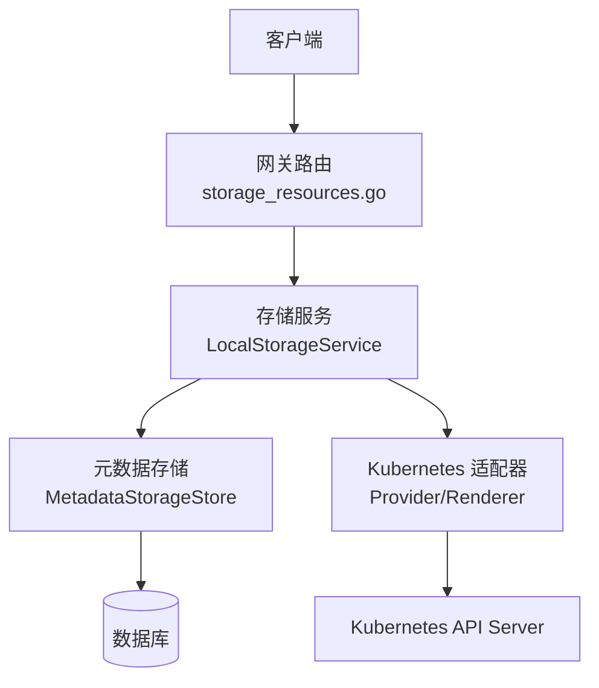
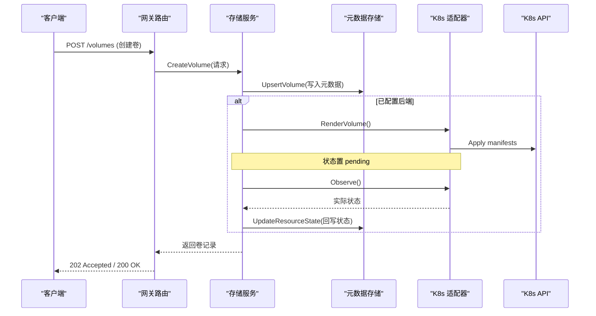
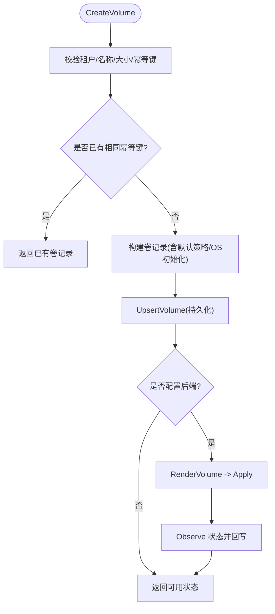
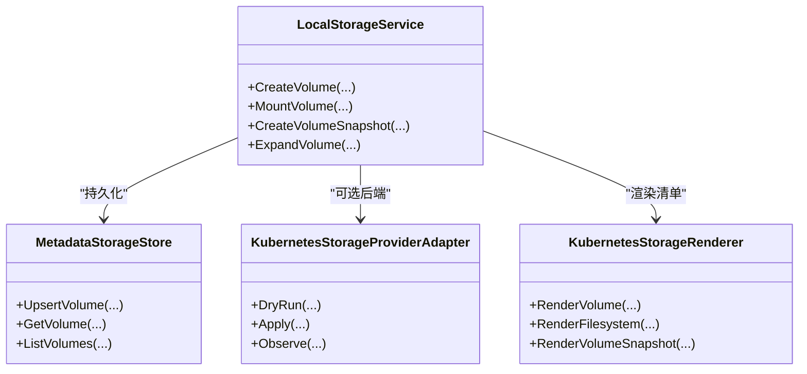

# 存储处理器

<cite>
**本文引用的文件**
- [storage_resources.go](file://repo/pkg/ports/storage_resources.go)
- [storage_service.go](file://repo/pkg/adapters/runtime/storage_service.go)
- [storage_store.go](file://repo/pkg/adapters/runtime/storage_store.go)
- [storage_store_children.go](file://repo/pkg/adapters/runtime/storage_store_children.go)
- [storage_provider.go](file://repo/pkg/adapters/runtime/storage_provider.go)
- [storage_renderer.go](file://repo/pkg/adapters/runtime/storage_renderer.go)
- [storage_status_reconciler.go](file://repo/pkg/adapters/runtime/storage_status_reconciler.go)
- [storage_runtime.go](file://repo/services/ani-gateway/storage_runtime.go)
- [instances.go](file://repo/services/ani-gateway/internal/router/instances.go)
- [storage_resources_router.go](file://repo/services/ani-gateway/internal/router/storage_resources.go)
- [spec-console-block-storage-snapshot.md](file://repo/services/tasks/modules/spec/console/compute/spec-console-block-storage-snapshot.md)
</cite>

## 目录
1. [简介](#简介)
2. [项目结构](#项目结构)
3. [核心组件](#核心组件)
4. [架构总览](#架构总览)
5. [详细组件分析](#详细组件分析)
6. [依赖关系分析](#依赖关系分析)
7. [性能与容量规划](#性能与容量规划)
8. [故障排查指南](#故障排查指南)
9. [结论](#结论)
10. [附录：API 契约与数据模型](#附录api-契约与数据模型)

## 简介
本文件面向“存储处理器”，系统化说明块存储、对象存储、文件存储的统一管理能力，覆盖存储卷创建、挂载、快照、备份（通过对象存储生命周期策略）、配额管理、性能监控与容量规划。文档同时给出关键代码路径、调用序列图与数据流图，帮助读者快速定位实现并理解业务规则与错误处理策略。

## 项目结构
存储能力由网关路由层、运行时服务层、持久化存储层以及可选的 Kubernetes 后端适配器组成：
- 网关路由层：暴露 HTTP API，负责请求校验、幂等键处理、异步任务编排与响应封装。
- 运行时服务层：统一编排存储资源的生命周期，协调本地内存缓存与持久化存储，并在配置了后端时渲染并执行工作负载清单。
- 持久化存储层：基于数据库元数据存储，维护卷、文件系统、对象、桶、快照、挂载目标等资源的完整状态与变更历史。
- 后端适配器层：将资源渲染为 Kubernetes 工作负载清单，并通过 REST 客户端提交到集群，随后观察实际状态并回填。

图表来源
- [storage_resources_router.go:1-200](file://repo/services/ani-gateway/internal/router/storage_resources.go#L1-L200)
- [storage_service.go:18-119](file://repo/pkg/adapters/runtime/storage_service.go#L18-L119)
- [storage_store.go:14-38](file://repo/pkg/adapters/runtime/storage_store.go#L14-L38)
- [storage_provider.go:17-40](file://repo/pkg/adapters/runtime/storage_provider.go#L17-L40)
- [storage_renderer.go:11-20](file://repo/pkg/adapters/runtime/storage_renderer.go#L11-L20)

章节来源
- [storage_resources_router.go:1-200](file://repo/services/ani-gateway/internal/router/storage_resources.go#L1-L200)
- [storage_service.go:18-119](file://repo/pkg/adapters/runtime/storage_service.go#L18-L119)
- [storage_store.go:14-38](file://repo/pkg/adapters/runtime/storage_store.go#L14-L38)

## 核心组件
- 端口定义与数据模型：定义统一的存储资源记录、请求/响应结构、状态枚举与接口契约。
- 存储服务：实现跨后端的统一逻辑，包括创建、删除、扩容、挂载/卸载、快照、自动快照策略、OS 初始化引导等。
- 元数据存储：持久化所有存储资源的状态、关联子资源（快照、挂载目标）及变更历史。
- 后端适配：渲染 Kubernetes 工作负载清单，执行 DryRun/Apply/Observe，驱动真实资源状态收敛。
- 网关路由：对外暴露 REST API，进行参数校验、幂等控制、异步任务编排与结果返回。

章节来源
- [storage_resources.go:8-684](file://repo/pkg/ports/storage_resources.go#L8-L684)
- [storage_service.go:18-119](file://repo/pkg/adapters/runtime/storage_service.go#L18-L119)
- [storage_store.go:14-38](file://repo/pkg/adapters/runtime/storage_store.go#L14-L38)
- [storage_provider.go:17-40](file://repo/pkg/adapters/runtime/storage_provider.go#L17-L40)
- [storage_renderer.go:11-20](file://repo/pkg/adapters/runtime/storage_renderer.go#L11-L20)

## 架构总览
存储处理器采用“服务 + 适配器”的分层设计：
- 服务层屏蔽后端差异，提供一致的 Create/List/Get/Delete/Expand/Mount/Unmount/Snapshot 等能力。
- 当未配置后端时，服务以内存态模拟资源；当配置 Kubernetes 后端时，服务会渲染工作负载清单并提交给集群，再通过状态观察器拉取实际状态并回填。
- 元数据存储保证状态可观测、可审计、可恢复，支持幂等创建与操作去重。

图表来源
- [storage_resources_router.go:1-200](file://repo/services/ani-gateway/internal/router/storage_resources.go#L1-L200)
- [storage_service.go:121-200](file://repo/pkg/adapters/runtime/storage_service.go#L121-L200)
- [storage_store.go:40-112](file://repo/pkg/adapters/runtime/storage_store.go#L40-L112)
- [storage_provider.go:17-40](file://repo/pkg/adapters/runtime/storage_provider.go#L17-L40)

## 详细组件分析

### 存储服务 LocalStorageService
- 职责：统一编排存储资源生命周期，维护内存缓存与幂等控制，协调持久化与后端执行。
- 关键流程：
  - 创建卷：校验参数、幂等键、默认策略填充、持久化、必要时触发后端渲染与应用。
  - 挂载/卸载：记录挂载历史、更新 OS 初始化状态、在需要时联动后端。
  - 快照：创建快照记录、根据后端配置渲染快照清单并观察状态。
  - 自动快照策略：随卷记录持久化，供调度或控制器消费。
  - 扩容：更新卷大小并持久化，必要时触发后端扩容。
- 并发与幂等：使用互斥锁与幂等飞行控制避免重复执行；通过 create_idempotency_key 防重。

图表来源
- [storage_service.go:121-200](file://repo/pkg/adapters/runtime/storage_service.go#L121-L200)
- [storage_store.go:40-112](file://repo/pkg/adapters/runtime/storage_store.go#L40-L112)

章节来源
- [storage_service.go:121-200](file://repo/pkg/adapters/runtime/storage_service.go#L121-L200)
- [storage_store.go:40-112](file://repo/pkg/adapters/runtime/storage_store.go#L40-L112)

### 元数据存储 MetadataStorageStore
- 职责：对卷、文件系统、对象、桶、快照、挂载目标等资源的增删改查与子资源级联加载。
- 关键点：
  - 使用事务包裹 UPSERT，确保主从表一致性。
  - 软删除：deleted_at 标记，查询过滤已删除记录。
  - 子资源加载：快照、挂载事件、挂载目标等在父记录查询后批量加载，避免连接忙冲突。
  - 自动快照策略与挂载历史作为子资源独立落库。

章节来源
- [storage_store.go:40-200](file://repo/pkg/adapters/runtime/storage_store.go#L40-L200)
- [storage_store_children.go:210-224](file://repo/pkg/adapters/runtime/storage_store_children.go#L210-L224)

### 后端适配器与渲染器
- 渲染器：将存储资源记录转换为 Kubernetes 工作负载清单（如 PVC、PV、CSI 相关资源）。
- 适配器：通过 Kubernetes REST 客户端执行 DryRun/Apply/Observe，并将结果反馈给服务层。
- 状态收敛：服务层根据观察到的实际状态更新资源状态，驱动最终一致。

章节来源
- [storage_renderer.go:11-20](file://repo/pkg/adapters/runtime/storage_renderer.go#L11-L20)
- [storage_provider.go:17-40](file://repo/pkg/adapters/runtime/storage_provider.go#L17-L40)
- [storage_status_reconciler.go:12-20](file://repo/pkg/adapters/runtime/storage_status_reconciler.go#L12-L20)

### 网关路由与 API 入口
- 卷挂载/卸载：接收请求，绑定实例信息，调用服务层并返回异步任务接受响应。
- 文件系统挂载命令：生成 mount 指令，便于用户侧手动挂载。
- 快照列表/创建：遵循控制台规范，支持幂等创建与状态查询。

章节来源
- [storage_resources_router.go:537-787](file://repo/services/ani-gateway/internal/router/storage_resources.go#L537-L787)
- [instances.go:2170-2218](file://repo/services/ani-gateway/internal/router/instances.go#L2170-L2218)
- [spec-console-block-storage-snapshot.md:1-19](file://repo/services/tasks/modules/spec/console/compute/spec-console-block-storage-snapshot.md#L1-L19)

## 依赖关系分析
- 服务层依赖：
  - 端口接口：定义统一的 StorageService 与 Store 接口，解耦具体实现。
  - 对象存储：用于生成预签名上传/下载 URL、桶对象管理等。
  - 后端适配器：可选注入，决定资源是否在 Kubernetes 中落地。
- 存储层依赖：
  - 元数据存储：PostgreSQL 事务与行级锁保障并发安全。
  - 子资源表：快照、挂载目标、生命周期规则等。
- 网关依赖：
  - 任务服务：将耗时操作转为异步任务，提升吞吐与用户体验。
  - 配置中心：动态选择本地模式或 Kubernetes 后端模式。

图表来源
- [storage_service.go:18-119](file://repo/pkg/adapters/runtime/storage_service.go#L18-L119)
- [storage_store.go:14-38](file://repo/pkg/adapters/runtime/storage_store.go#L14-L38)
- [storage_provider.go:17-40](file://repo/pkg/adapters/runtime/storage_provider.go#L17-L40)
- [storage_renderer.go:11-20](file://repo/pkg/adapters/runtime/storage_renderer.go#L11-L20)

章节来源
- [storage_service.go:18-119](file://repo/pkg/adapters/runtime/storage_service.go#L18-L119)
- [storage_store.go:14-38](file://repo/pkg/adapters/runtime/storage_store.go#L14-L38)
- [storage_provider.go:17-40](file://repo/pkg/adapters/runtime/storage_provider.go#L17-L40)
- [storage_renderer.go:11-20](file://repo/pkg/adapters/runtime/storage_renderer.go#L11-L20)

## 性能与容量规划
- 性能特性
  - 幂等与并发：通过幂等键与飞行控制避免重复执行；数据库行级锁串行化配额与状态更新。
  - 异步化：网关将耗时操作转为异步任务，降低请求延迟。
  - 子资源批量加载：先获取父记录再加载子资源，避免连接忙冲突。
- 容量规划建议
  - 卷大小与 IOPS：根据 volume_type 与 storage_class 设置合理默认值，结合业务峰值评估。
  - 快照保留策略：通过自动快照策略控制 retain_days 与 schedule，平衡成本与恢复点目标。
  - 对象存储生命周期：为桶配置生命周期规则，按前缀与过期天数归档冷数据。
  - 配额管理：在多租户场景下，结合配额服务限制各租户的资源占用，防止资源争用。
- 监控指标
  - 实例指标：CPU、内存、网络等指标可通过 Prometheus 采集，支撑容量趋势分析与告警。
  - 存储指标：关注卷状态、快照数量、挂载目标可用性、桶对象增长速率等。

章节来源
- [storage_store.go:40-200](file://repo/pkg/adapters/runtime/storage_store.go#L40-L200)
- [storage_resources.go:109-116](file://repo/pkg/ports/storage_resources.go#L109-L116)
- [prometheus_instance_observability_test.go:102-130](file://repo/pkg/adapters/runtime/prometheus_instance_observability_test.go#L102-L130)

## 故障排查指南
- 常见错误
  - 参数无效：租户 ID、名称、大小等必填字段缺失或非法。
  - 资源不存在：卷/文件系统/对象/桶 ID 不存在或已被删除。
  - 后端不可用：Kubernetes 后端未配置或权限不足导致无法渲染/应用。
  - 状态不一致：后端状态与元数据不同步，需检查状态收敛流程。
- 排查步骤
  - 检查请求体与幂等键是否正确。
  - 查看元数据存储中的记录状态与原因字段。
  - 若启用后端，检查渲染清单与实际资源状态。
  - 核对任务服务中的异步任务执行结果与重试情况。
- 日志与追踪
  - 关注服务层的错误包装与原因字段。
  - 利用幂等键追踪同一操作的多次尝试。

章节来源
- [storage_service.go:121-200](file://repo/pkg/adapters/runtime/storage_service.go#L121-L200)
- [storage_store.go:40-112](file://repo/pkg/adapters/runtime/storage_store.go#L40-L112)
- [storage_resources_router.go:537-787](file://repo/services/ani-gateway/internal/router/storage_resources.go#L537-L787)

## 结论
存储处理器通过统一的服务层与适配器机制，实现了块存储、对象存储、文件存储的一致化管理。其核心优势在于：
- 统一接口与数据模型，屏蔽后端差异。
- 强一致性与幂等性，保障高可靠。
- 可扩展的后端适配，支持本地与 Kubernetes 等多种环境。
- 完善的元数据存储与子资源管理，便于审计与恢复。
- 结合配额、监控与容量规划，满足生产环境的治理需求。

## 附录：API 契约与数据模型
- 数据模型
  - 卷：包含租户、ID、名称、大小、存储类、区域、类型、IOPS、加密、挂载信息等。
  - 文件系统：协议、端点、性能模式、挂载目标、挂载命令等。
  - 对象与桶：桶名、区域、访问模式、ACL、版本控制、生命周期规则等。
  - 快照：状态、大小、创建时间、幂等键等。
  - 挂载目标：子网、VPC、IP、状态等。
- 请求/响应
  - 卷创建/扩容/挂载/卸载/删除：对应请求结构与响应记录。
  - 快照创建/列表：遵循控制台规范，支持幂等创建与状态查询。
  - 对象上传/下载：预签名 URL 与元数据。
  - 桶生命周期：规则创建、更新、删除与列表。
- 业务规则
  - 幂等键：所有创建与关键操作必须携带幂等键，防止重复。
  - 状态机：资源状态流转遵循 pending/available/failed/deleting/deleted。
  - 自动快照：默认关闭，可按需开启并配置保留天数与调度。
  - 配额与容量：结合配额服务与监控指标进行容量规划与限流。

章节来源
- [storage_resources.go:18-684](file://repo/pkg/ports/storage_resources.go#L18-L684)
- [storage_resources_router.go:21-183](file://repo/services/ani-gateway/internal/router/storage_resources.go#L21-L183)
- [spec-console-block-storage-snapshot.md:1-19](file://repo/services/tasks/modules/spec/console/compute/spec-console-block-storage-snapshot.md#L1-L19)