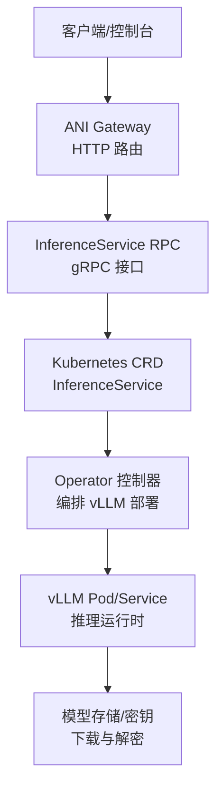
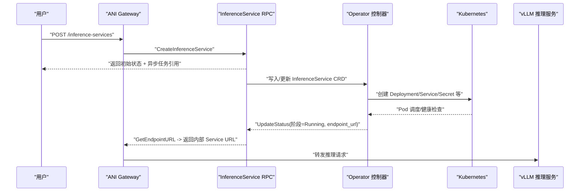
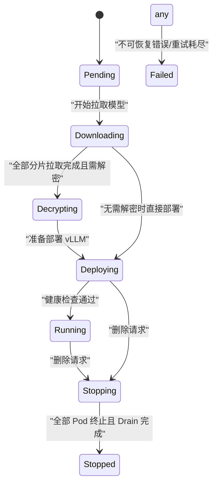
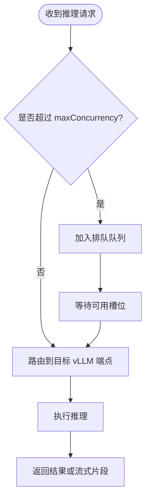

# 推理处理器

<cite>
**本文引用的文件**
- [inference_service.proto](file://repo/api/proto/inference/v1/inference_service.proto)
- [inferenceservice_types.go](file://operators/inference-operator/api/v1/inferenceservice_types.go)
- [inference_resources.go](file://services/ani-gateway/internal/router/inference_resources.go)
</cite>

## 目录
1. [简介](#简介)
2. [项目结构](#项目结构)
3. [核心组件](#核心组件)
4. [架构总览](#架构总览)
5. [详细组件分析](#详细组件分析)
6. [依赖关系分析](#依赖关系分析)
7. [性能与资源调度](#性能与资源调度)
8. [故障恢复与可观测性](#故障恢复与可观测性)
9. [API 契约与数据验证](#api-契约与数据验证)
10. [使用示例与最佳实践](#使用示例与最佳实践)
11. [排障指南](#排障指南)
12. [结论](#结论)

## 简介
本文件面向 AI 推理服务的“推理处理器”能力，围绕推理服务生命周期管理、任务提交与结果获取、流式响应处理、性能优化、资源调度与故障恢复进行系统化说明。文档基于仓库中的协议定义、Operator CRD 类型以及网关路由实现，给出端到端的调用流程、状态机约束与运维要点，帮助开发者快速理解并正确使用推理服务。

## 项目结构
与推理处理器直接相关的代码与契约分布在以下位置：
- API 协议定义：gRPC 接口与消息结构
- Operator CRD：InferenceService 的 Spec/Status、阶段常量与条件
- 网关路由：对外 HTTP 资源的注册与占位实现（后续将对接 gRPC）

图表来源
- [inference_resources.go:12-19](file://services/ani-gateway/internal/router/inference_resources.go#L12-L19)
- [inference_service.proto:11-33](file://repo/api/proto/inference/v1/inference_service.proto#L11-L33)
- [inferenceservice_types.go:55-164](file://operators/inference-operator/api/v1/inferenceservice_types.go#L55-L164)

章节来源
- [inference_resources.go:12-19](file://services/ani-gateway/internal/router/inference_resources.go#L12-L19)
- [inference_service.proto:11-33](file://repo/api/proto/inference/v1/inference_service.proto#L11-L33)
- [inferenceservice_types.go:55-164](file://operators/inference-operator/api/v1/inferenceservice_types.go#L55-L164)

## 核心组件
- InferenceService RPC 服务：提供推理服务的创建、查询、列表、删除、端点解析与状态更新等能力。
- InferenceService CRD：描述推理服务期望规格（模型、副本、GPU、并发度、放置策略、加密密钥引用、优雅停机超时等）与观测状态（阶段、就绪副本数、端点 URL、条件等）。
- ANI Gateway 路由：暴露推理服务管理的 HTTP 资源，作为外部入口，内部将转发到 gRPC 服务。

章节来源
- [inference_service.proto:11-33](file://repo/api/proto/inference/v1/inference_service.proto#L11-L33)
- [inferenceservice_types.go:55-164](file://operators/inference-operator/api/v1/inferenceservice_types.go#L55-L164)
- [inference_resources.go:12-19](file://services/ani-gateway/internal/router/inference_resources.go#L12-L19)

## 架构总览
推理服务采用“控制面 + 数据面”分离：
- 控制面：ANI Gateway 接收用户请求，调用 InferenceService RPC；Operator 监听 CRD 变更，编排 vLLM 部署与生命周期。
- 数据面：vLLM Pod 承载推理运行时，通过 K8s Service 暴露内部端点，由 Gateway 路由至具体实例。

图表来源
- [inference_resources.go:12-19](file://services/ani-gateway/internal/router/inference_resources.go#L12-L19)
- [inference_service.proto:11-33](file://repo/api/proto/inference/v1/inference_service.proto#L11-L33)
- [inferenceservice_types.go:16-42](file://operators/inference-operator/api/v1/inferenceservice_types.go#L16-L42)

## 详细组件分析

### InferenceService RPC 接口
- CreateInferenceService：启动异步部署，返回初始状态记录与异步任务引用，便于轮询进度。
- GetInferenceService：查询当前服务状态。
- ListInferenceServices：游标分页列出服务。
- DeleteInferenceService：触发优雅关闭（drain 后销毁）。
- GetEndpointURL：供 Gateway 在运行中解析推理请求的目标内部地址。
- UpdateStatus：Operator 回调以同步 CRD 阶段与端点信息。

章节来源
- [inference_service.proto:11-33](file://repo/api/proto/inference/v1/inference_service.proto#L11-L33)

### CRD 类型与状态机
- 阶段常量：Pending → Downloading → Decrypting → Deploying → Running → Stopping → Stopped；任意阶段可进入 Failed。
- 禁止转换：任何状态→Running（仅允许从 Deploying 经健康检查）、Stopped/Failed 为终态。
- Spec 字段：模型标识、副本数、GPU 类型与每 Pod GPU 数量、最大并发、区域/可用区放置、加密密钥引用、优雅停机超时。
- Status 字段：阶段、观测代数、端点 URL、就绪副本数、人类可读消息、条件集合（模型就绪、Pod 已调度、健康、Drain 完成）。

图表来源
- [inferenceservice_types.go:16-42](file://operators/inference-operator/api/v1/inferenceservice_types.go#L16-L42)

章节来源
- [inferenceservice_types.go:16-42](file://operators/inference-operator/api/v1/inferenceservice_types.go#L16-L42)
- [inferenceservice_types.go:55-164](file://operators/inference-operator/api/v1/inferenceservice_types.go#L55-L164)

### 网关路由与外部 API
- 注册推理服务相关 HTTP 资源：创建、查询、列表、更新、删除、日志查看。
- 当前为占位实现，后续将接入 InferenceService RPC 以完成真实业务逻辑。

章节来源
- [inference_resources.go:12-19](file://services/ani-gateway/internal/router/inference_resources.go#L12-L19)

## 依赖关系分析
- 网关依赖 RPC：Gateway 路由层负责鉴权与路由，最终调用 InferenceService RPC。
- RPC 依赖 Operator：通过 CRD 驱动 Operator 编排底层资源。
- Operator 依赖 K8s：创建/管理 Deployment、Service、Secret 等资源。
- 运行时依赖模型与密钥：根据模型版本是否加密，决定是否解密并加载。

图表来源
- [inference_resources.go:12-19](file://services/ani-gateway/internal/router/inference_resources.go#L12-L19)
- [inference_service.proto:11-33](file://repo/api/proto/inference/v1/inference_service.proto#L11-L33)
- [inferenceservice_types.go:55-164](file://operators/inference-operator/api/v1/inferenceservice_types.go#L55-L164)

章节来源
- [inference_service.proto:11-33](file://repo/api/proto/inference/v1/inference_service.proto#L11-L33)
- [inferenceservice_types.go:55-164](file://operators/inference-operator/api/v1/inferenceservice_types.go#L55-L164)
- [inference_resources.go:12-19](file://services/ani-gateway/internal/router/inference_resources.go#L12-L19)

## 性能与资源调度
- 并发控制：Spec.maxConcurrency 限制所有副本的并发请求上限，超出部分由 Gateway 队列化而非直接拒绝。
- 副本与 GPU：replicas 与 gpuCountPerPod 决定横向扩展与单 Pod GPU 占用，结合 gpuType 选择合适算力。
- 放置策略：placement.region/az 用于跨域部署与亲和性调度，配合 Karmada PropagationPolicy。
- 优雅停机：drainTimeoutSeconds 控制停止期间等待请求完成的最长时间，保障无损下线。
- 健康检查：Deploying→Running 依赖健康检查通过，确保只有就绪副本参与流量。

图表来源
- [inferenceservice_types.go:77-81](file://operators/inference-operator/api/v1/inferenceservice_types.go#L77-L81)
- [inference_service.proto:37-50](file://repo/api/proto/inference/v1/inference_service.proto#L37-L50)

章节来源
- [inferenceservice_types.go:77-81](file://operators/inference-operator/api/v1/inferenceservice_types.go#L77-L81)
- [inference_service.proto:37-50](file://repo/api/proto/inference/v1/inference_service.proto#L37-L50)

## 故障恢复与可观测性
- 阶段与条件：通过 Phase 与 Conditions（ModelReady、PodScheduled、Healthy、DrainComplete）表达关键门控状态。
- 终态保护：Stopped/Failed 为终态，需重建服务以继续。
- 优雅停机：Stopping→Stopped 要求 DrainComplete 条件满足，确保请求完成后再释放资源。
- 健康检查：Healthy 条件保证流量只进入健康实例。
- 日志与监控：Gateway 提供日志查看路由，便于定位问题；建议结合平台指标与事件观察阶段变化。

章节来源
- [inferenceservice_types.go:16-51](file://operators/inference-operator/api/v1/inferenceservice_types.go#L16-L51)
- [inferenceservice_types.go:116-144](file://operators/inference-operator/api/v1/inferenceservice_types.go#L116-L144)
- [inference_resources.go:12-19](file://services/ani-gateway/internal/router/inference_resources.go#L12-L19)

## API 契约与数据验证
- 创建推理服务
  - 方法：POST /inference-services（Gateway 路由）
  - 行为：调用 CreateInferenceService，返回初始状态与异步任务引用
  - 输入关键字段：tenant_id、name、model、replicas、gpu_type、gpu_count_per_pod、max_concurrency、placement、encryption_key_ref、drain_timeout_seconds、idempotency_key、webhook_url
- 查询服务
  - 方法：GET /inference-services/:service_id
  - 行为：返回当前 InferenceServiceStatus
- 列表服务
  - 方法：GET /inference-services
  - 行为：游标分页返回服务列表
- 删除服务
  - 方法：DELETE /inference-services/:service_id
  - 行为：触发优雅关闭
- 获取端点
  - 方法：GET /inference-services/:service_id/logs（日志），内部通过 GetEndpointURL 获取推理端点
- 状态更新
  - 方法：UpdateStatus（内部调用，受 RBAC 限制）

数据验证规则（来自 CRD 与 Proto）
- model 格式：name:version，创建后不可变
- replicas/gpuCountPerPod/maxConcurrency：有默认值与范围约束
- placement：region/az 可选
- encryptionKeyRef：当模型加密时必须提供
- drainTimeoutSeconds：默认 30 秒
- phase：严格遵循状态机约束

章节来源
- [inference_resources.go:12-19](file://services/ani-gateway/internal/router/inference_resources.go#L12-L19)
- [inference_service.proto:37-95](file://repo/api/proto/inference/v1/inference_service.proto#L37-L95)
- [inferenceservice_types.go:55-96](file://operators/inference-operator/api/v1/inferenceservice_types.go#L55-L96)

## 使用示例与最佳实践
- 启动推理服务
  - 通过 Gateway 的 POST /inference-services 提交创建请求，携带 model、replicas、gpu_type、gpu_count_per_pod、max_concurrency、placement、encryption_key_ref、drain_timeout_seconds、idempotency_key、webhook_url
  - 使用返回的异步任务引用轮询状态，直至 phase=Running
- 获取推理端点
  - 调用 GetEndpointURL 获取内部 K8s Service URL，随后向该端点发起推理请求
- 流式响应处理
  - 若 vLLM 支持流式输出，客户端应建立长连接并按片段消费；建议在 Gateway 侧设置合理的超时与重试策略
- 并发与限流
  - 合理设置 max_concurrency 以避免过载；超出部分将被排队，注意队列长度与延迟
- 优雅停机
  - 删除服务时，drain_timeout_seconds 控制等待时间；确保业务侧能容忍短暂中断
- 监控与排障
  - 关注 Conditions：ModelReady、PodScheduled、Healthy、DrainComplete
  - 查看服务日志与事件，定位阶段卡滞原因

章节来源
- [inference_service.proto:37-95](file://repo/api/proto/inference/v1/inference_service.proto#L37-L95)
- [inferenceservice_types.go:16-51](file://operators/inference-operator/api/v1/inferenceservice_types.go#L16-L51)
- [inference_resources.go:12-19](file://services/ani-gateway/internal/router/inference_resources.go#L12-L19)

## 排障指南
- 阶段卡在 Downloading/Decrypting
  - 检查模型是否存在、网络连通性与密钥是否正确
  - 确认 EncryptionKeyRef 指向正确的 Secret 与 key
- 阶段卡在 Deploying
  - 检查 GPU 资源是否充足、节点是否满足 gpu_type 与副本需求
  - 关注 PodScheduled 与 Healthy 条件
- 无法获取端点
  - 确认 phase=Running 且 endpoint_url 已设置
  - 检查 K8s Service 是否正常暴露
- 删除不生效
  - 检查 DrainComplete 条件是否达成；必要时调整 drain_timeout_seconds
- 高延迟或超时
  - 评估 max_concurrency 与副本数；考虑水平扩展或提升 GPU 规格
  - 检查 Gateway 队列长度与后端健康状态

章节来源
- [inferenceservice_types.go:16-51](file://operators/inference-operator/api/v1/inferenceservice_types.go#L16-L51)
- [inferenceservice_types.go:116-144](file://operators/inference-operator/api/v1/inferenceservice_types.go#L116-L144)
- [inference_service.proto:37-95](file://repo/api/proto/inference/v1/inference_service.proto#L37-L95)

## 结论
推理处理器通过清晰的 gRPC 契约、严格的 CRD 状态机与网关路由，实现了推理服务从创建、运行到停用的全生命周期管理。借助并发控制、放置策略与健康检查，系统可在多租户环境下稳定提供推理能力。建议在生产环境中结合监控与日志，持续优化并发与资源分配，确保低延迟与高可用。