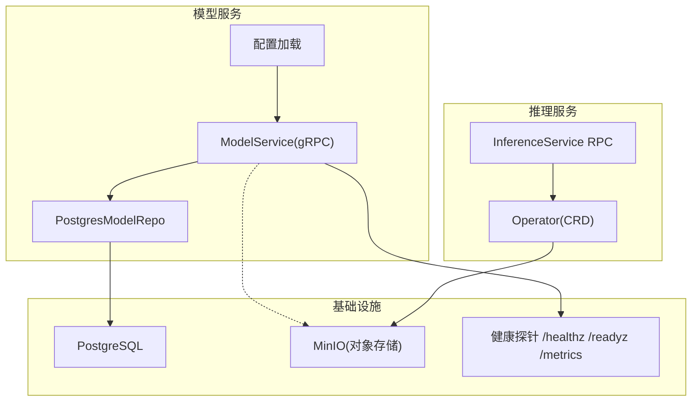
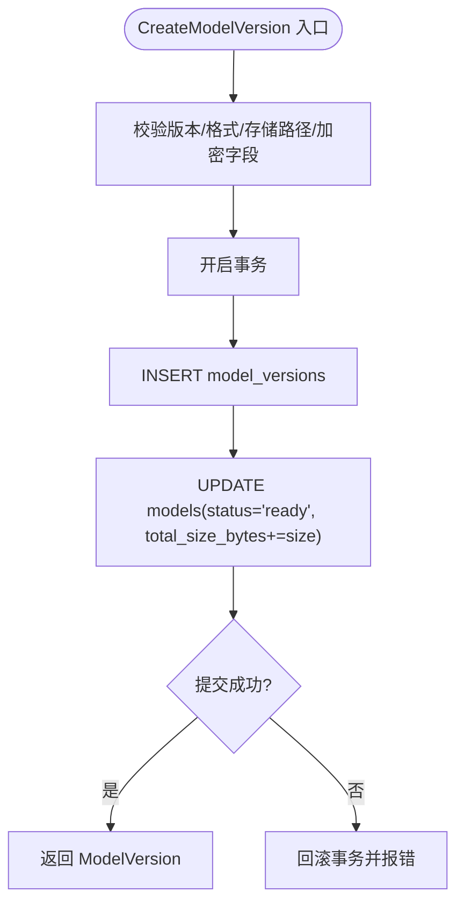
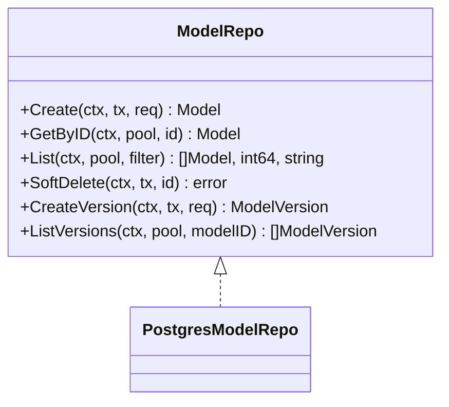
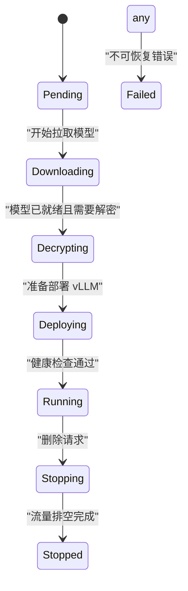
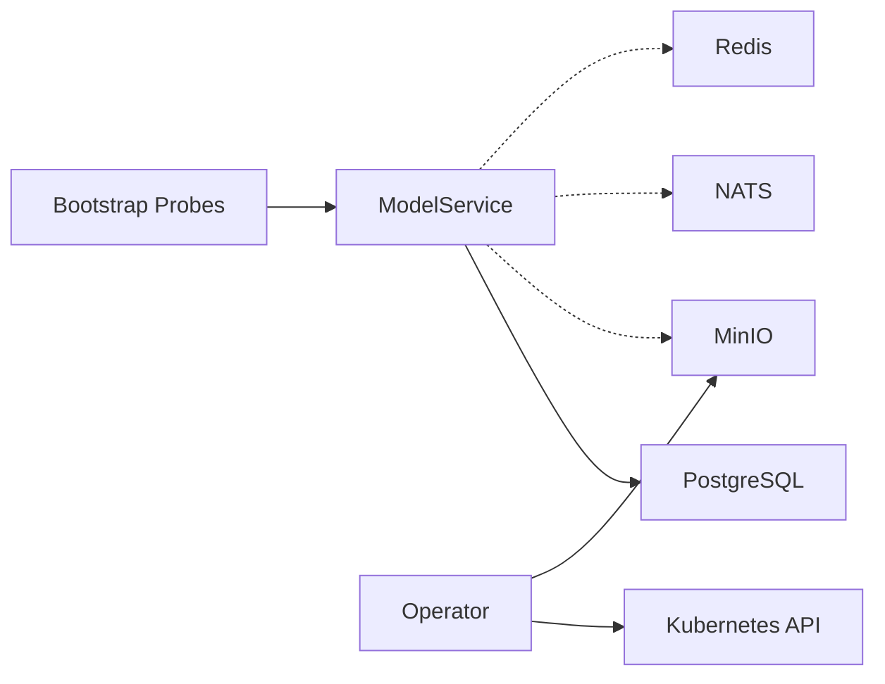

# 模型处理器

<cite>
**本文引用的文件**
- [model_service.proto](file://repo/api/proto/model/v1/model_service.proto)
- [inference_service.proto](file://repo/api/proto/inference/v1/inference_service.proto)
- [inferenceservice_types.go](file://repo/operators/inference-operator/api/v1/inferenceservice_types.go)
- [main.go](file://repo/services/model-service/main.go)
- [model_service.go](file://repo/services/model-service/internal/service/model_service.go)
- [model_repo.go](file://repo/services/model-service/internal/repo/model_repo.go)
- [config.go](file://repo/services/model-service/internal/config/config.go)
- [probes.go](file://repo/pkg/bootstrap/probes.go)
</cite>

## 目录
1. [简介](#简介)
2. [项目结构](#项目结构)
3. [核心组件](#核心组件)
4. [架构总览](#架构总览)
5. [详细组件分析](#详细组件分析)
6. [依赖关系分析](#依赖关系分析)
7. [性能与监控](#性能与监控)
8. [故障排查指南](#故障排查指南)
9. [结论](#结论)
10. [附录：API 契约与校验规则](#附录api-契约与校验规则)

## 简介
本文件面向“模型处理器”（Model Service）的完整技术文档，聚焦以下目标：
- 模型注册、版本管理与生命周期控制
- 与推理服务（InferenceService）和对象存储（MinIO）的集成方式
- A/B 测试与灰度发布策略在模型版本上的落地方案
- 模型性能监控、资源使用统计与自动扩缩容机制
- 所有模型相关 API 的请求/响应结构与业务规则、数据验证逻辑
- 代码级流程图与时序图，帮助快速理解关键路径

## 项目结构
模型服务采用 Go 语言实现，基于 gRPC 暴露接口，通过 Postgres 持久化模型元数据，结合 MinIO 进行模型文件存储。推理服务由 Operator 管理 Pod 生命周期，并负责拉取模型、解密与部署。



图表来源
- [main.go:10-18](file://repo/services/model-service/main.go#L10-L18)
- [model_service.go:22-34](file://repo/services/model-service/internal/service/model_service.go#L22-L34)
- [model_repo.go:16-29](file://repo/services/model-service/internal/repo/model_repo.go#L16-L29)
- [config.go:10-20](file://repo/services/model-service/internal/config/config.go#L10-L20)
- [probes.go:37-57](file://repo/pkg/bootstrap/probes.go#L37-L57)

章节来源
- [main.go:10-18](file://repo/services/model-service/main.go#L10-L18)
- [config.go:10-20](file://repo/services/model-service/internal/config/config.go#L10-L20)

## 核心组件
- ModelService（gRPC 服务）：提供模型注册、版本创建、列表查询、软删除等能力；部分功能（上传/下载 URL、导入）预留扩展点。
- PostgresModelRepo：封装模型与版本的数据库访问，支持租户隔离、游标分页、软删除与事务一致性。
- 配置模块：从环境变量加载数据库、NATS、Redis、端口等运行参数。
- 健康探针：统一暴露 /healthz、/readyz、/metrics，用于集群编排与健康检查。

章节来源
- [model_service.go:22-34](file://repo/services/model-service/internal/service/model_service.go#L22-L34)
- [model_repo.go:16-29](file://repo/services/model-service/internal/repo/model_repo.go#L16-L29)
- [config.go:10-20](file://repo/services/model-service/internal/config/config.go#L10-L20)
- [probes.go:37-57](file://repo/pkg/bootstrap/probes.go#L37-L57)

## 架构总览
模型处理器的整体流程如下：
- 客户端通过 gRPC 调用 ModelService 创建模型元数据，随后通过 MinIO 直传模型文件，再回调 CreateModelVersion 完成版本登记。
- InferenceService 创建后，Operator 根据模型版本信息生成 Init Container，调用 GetModelDownloadURL 获取临时下载链接，拉取并解密模型，最终启动 vLLM 推理容器。
- 平台通过 Prometheus 采集实例指标，结合 K8s HPA/VPA 或自定义控制器实现自动扩缩容。

```mermaid
sequenceDiagram
participant Client as "客户端"
participant MS as "ModelService"
participant Repo as "PostgresModelRepo"
participant DB as "PostgreSQL"
participant MinIO as "MinIO"
participant INF as "InferenceService RPC"
participant Op as "Operator"
Client->>MS : CreateModel
MS->>Repo : 写入模型元数据
Repo->>DB : INSERT models
DB-->>Repo : 成功
Repo-->>MS : 返回模型
MS-->>Client : Model
Client->>MS : GetUploadURL
MS-->>Client : presigned PUT URL + storage_path
Client->>MinIO : 上传模型文件
Client->>MS : CreateModelVersion(storage_path, checksum, size, encrypt info)
MS->>Repo : 写入版本并更新模型状态/大小
Repo->>DB : INSERT model_versions; UPDATE models
DB-->>Repo : 成功
Repo-->>MS : 返回版本
MS-->>Client : ModelVersion
Client->>INF : CreateInferenceService(model_name : version)
INF->>Op : 创建 CRD
Op->>MS : GetModelDownloadURL(model_version_id)
MS-->>Op : presigned GET URL + 加密信息
Op->>MinIO : 拉取并解密模型
Op->>Op : 启动 vLLM 推理容器
```

图表来源
- [model_service.go:36-171](file://repo/services/model-service/internal/service/model_service.go#L36-L171)
- [model_repo.go:90-245](file://repo/services/model-service/internal/repo/model_repo.go#L90-L245)
- [inference_service.proto:12-55](file://repo/api/proto/inference/v1/inference_service.proto#L12-L55)
- [inferenceservice_types.go:55-96](file://repo/operators/inference-operator/api/v1/inferenceservice_types.go#L55-L96)

## 详细组件分析

### 模型服务（ModelService）
- 职责：接收并校验请求，维护模型与版本的生命周期，协调对象存储与后续推理服务。
- 关键方法：
  - CreateModel：创建模型元数据，设置 source=upload，事务写入。
  - ListModels：游标分页，支持按状态过滤。
  - DeleteModel：软删除，避免被引用时删除。
  - CreateModelVersion：登记版本，更新模型状态为 ready 并累计大小。
  - GetUploadURL / GetModelDownloadURL：当前返回未实现占位，需接入 MinIO 客户端。
  - ImportModel：异步导入外部仓库，需 outbox 与下载 worker。



图表来源
- [model_service.go:139-171](file://repo/services/model-service/internal/service/model_service.go#L139-L171)
- [model_repo.go:218-245](file://repo/services/model-service/internal/repo/model_repo.go#L218-L245)

章节来源
- [model_service.go:36-184](file://repo/services/model-service/internal/service/model_service.go#L36-L184)
- [model_repo.go:90-245](file://repo/services/model-service/internal/repo/model_repo.go#L90-L245)

### 数据访问层（PostgresModelRepo）
- 租户隔离：通过 SetDBTenant 在每个事务中注入租户上下文。
- 游标分页：基于 (created_at, id) 组合键编码/解码 cursor，保证稳定排序。
- 软删除：将 status 置为 deleted，查询默认排除已删除记录。
- 版本关联：创建版本后同步更新模型状态与累计大小。



图表来源
- [model_repo.go:16-29](file://repo/services/model-service/internal/repo/model_repo.go#L16-L29)

章节来源
- [model_repo.go:16-29](file://repo/services/model-service/internal/repo/model_repo.go#L16-L29)
- [model_repo.go:138-198](file://repo/services/model-service/internal/repo/model_repo.go#L138-L198)
- [model_repo.go:200-245](file://repo/services/model-service/internal/repo/model_repo.go#L200-L245)

### 推理服务与 Operator 集成
- InferenceServiceSpec 指定模型 name:version、副本数、GPU 类型与数量、并发上限、放置策略、加密密钥引用、优雅关闭超时。
- Operator 阶段机：Pending → Downloading → Decrypting → Deploying → Running → Stopping → Stopped/Failed。
- 模型下载：Init Container 调用 GetModelDownloadURL 获取临时链接，支持加密模型解密。



图表来源
- [inferenceservice_types.go:16-42](file://repo/operators/inference-operator/api/v1/inferenceservice_types.go#L16-L42)
- [inference_service.proto:12-33](file://repo/api/proto/inference/v1/inference_service.proto#L12-L33)

章节来源
- [inferenceservice_types.go:55-96](file://repo/operators/inference-operator/api/v1/inferenceservice_types.go#L55-L96)
- [inference_service.proto:37-127](file://repo/api/proto/inference/v1/inference_service.proto#L37-L127)

## 依赖关系分析
- ModelService 依赖：
  - PostgreSQL：通过 pgxpool 连接，执行事务与查询。
  - MinIO：用于生成上传/下载预签名 URL（当前为未实现占位）。
  - NATS/Redis：配置项存在，当前服务未直接使用（可用于未来任务队列与缓存）。
- Operator 依赖：
  - Kubernetes API：创建/管理 Deployment、Service、Secret 等。
  - MinIO：拉取并解密模型文件。
- 健康探针：
  - /healthz：进程存活。
  - /readyz：依赖健康检查（Postgres、NATS、Redis、对象存储、向量存储、K8s API）。
  - /metrics：Prometheus 指标输出。



图表来源
- [config.go:10-20](file://repo/services/model-service/internal/config/config.go#L10-L20)
- [probes.go:144-219](file://repo/pkg/bootstrap/probes.go#L144-L219)

章节来源
- [config.go:10-20](file://repo/services/model-service/internal/config/config.go#L10-L20)
- [probes.go:144-219](file://repo/pkg/bootstrap/probes.go#L144-L219)

## 性能与监控
- 指标采集：
  - 服务内置 /metrics 端点输出 reconcile 控制器指标（tick、success、failure、backoff skip）。
  - 实例观测适配器可从 Prometheus 拉取 CPU、内存、网络等指标，支持容器与 VM 两种模式。
- 自动扩缩容建议：
  - 基于 K8s HPA：以 CPU/内存利用率或自定义指标（如 QPS、延迟分位数）触发扩缩容。
  - 基于 VPA：自动调整 requests/limits，优化资源分配。
  - 针对推理服务：可结合 maxConcurrency 与 GPU 利用率，动态调整 replicas 与 gpuCountPerPod。
- 资源使用统计：
  - 通过 Prometheus 查询 container_cpu_usage_seconds_total、container_memory_working_set_bytes 等指标。
  - 对 VM 场景使用 kubevirt_vmi_* 指标，精确匹配 name label。

章节来源
- [probes.go:37-87](file://repo/pkg/bootstrap/probes.go#L37-L87)
- [prometheus_instance_observability_test.go:79-130](file://repo/pkg/adapters/runtime/prometheus_instance_observability_test.go#L79-L130)
- [prometheus_instance_observability_test.go:721-750](file://repo/pkg/adapters/runtime/prometheus_instance_observability_test.go#L721-L750)

## 故障排查指南
- 常见错误映射：
  - 未找到：NotFound
  - 冲突：AlreadyExists
  - 参数非法：InvalidArgument
  - 权限不足：PermissionDenied
  - 未认证：Unauthenticated
  - 内部错误：Internal
- 健康检查：
  - /healthz：确认进程存活。
  - /readyz：查看各依赖（Postgres、NATS、Redis、对象存储、向量存储、K8s API）是否可用。
- 事务与回滚：
  - 所有写操作均使用事务，失败时自动回滚，确保数据一致性。
- 模型删除保护：
  - 若仍有 InferenceService 引用模型，应拒绝删除（需在业务层增加引用检查）。

章节来源
- [model_service.go:282-301](file://repo/services/model-service/internal/service/model_service.go#L282-L301)
- [probes.go:37-57](file://repo/pkg/bootstrap/probes.go#L37-L57)
- [probes.go:144-219](file://repo/pkg/bootstrap/probes.go#L144-L219)

## 结论
模型处理器提供了完整的模型注册与版本管理能力，并通过 Operator 与推理服务协同完成模型的拉取、解密与部署。当前服务已具备稳定的数据一致性与基础健康探针，后续需完善 MinIO 集成、异步导入与监控告警，以实现更完善的 A/B 测试与灰度发布能力。

## 附录：API 契约与校验规则

### 模型服务 API（gRPC）
- CreateModel：创建模型元数据，source=upload，capabilities 可选。
- GetModel/ListModels：按租户查询模型，支持游标分页与状态过滤。
- DeleteModel：软删除，需确保无引用。
- CreateModelVersion：登记版本，包含 format、storage_path、checksum、size、加密信息。
- GetUploadURL：返回 MinIO 预签名上传 URL（当前未实现）。
- GetModelDownloadURL：返回 MinIO 预签名下载 URL（当前未实现）。
- ImportModel：异步导入外部仓库（当前未实现）。

章节来源
- [model_service.proto:11-40](file://repo/api/proto/model/v1/model_service.proto#L11-L40)
- [model_service.proto:44-123](file://repo/api/proto/model/v1/model_service.proto#L44-L123)

### 推理服务 API（gRPC）
- CreateInferenceService：异步创建推理服务，返回初始状态与任务引用。
- GetInferenceService/ListInferenceServices：查询服务状态与列表。
- DeleteInferenceService：优雅关闭（drain 然后销毁）。
- GetEndpointURL：网关路由时使用，返回内部 K8s Service URL。
- UpdateStatus：Operator 回调，更新 CRD 状态。

章节来源
- [inference_service.proto:12-33](file://repo/api/proto/inference/v1/inference_service.proto#L12-L33)
- [inference_service.proto:37-127](file://repo/api/proto/inference/v1/inference_service.proto#L37-L127)

### 数据校验规则
- 模型名称：小写字母数字开头，允许连字符与点，长度限制。
- 版本格式：仅支持 safetensors、gguf、pytorch。
- 存储路径：必填，指向 MinIO 对象路径。
- 大小：非负整数。
- 加密算法：sm4、zuc、aes256gcm（仅在 is_encrypted=true 时生效）。
- 租户 ID：必须为有效 UUID。

章节来源
- [model_service.go:186-218](file://repo/services/model-service/internal/service/model_service.go#L186-L218)

### A/B 测试与灰度发布策略（实践建议）
- 多版本并存：同一模型名下保留多个版本，通过 InferenceService 的 model 字段选择具体版本。
- 流量切分：
  - 网关层按 header/query 分流到不同 InferenceService 实例（对应不同模型版本）。
  - 或使用 K8s Service/Ingress 权重路由，逐步放量。
- 灰度步骤：
  - 先部署新版本到少量节点，观察指标与错误率。
  - 逐步扩大流量比例，直至全量切换。
- 回滚策略：
  - 快速切回旧版本 InferenceService，保持版本可回退。

[本节为概念性说明，不直接分析具体文件]