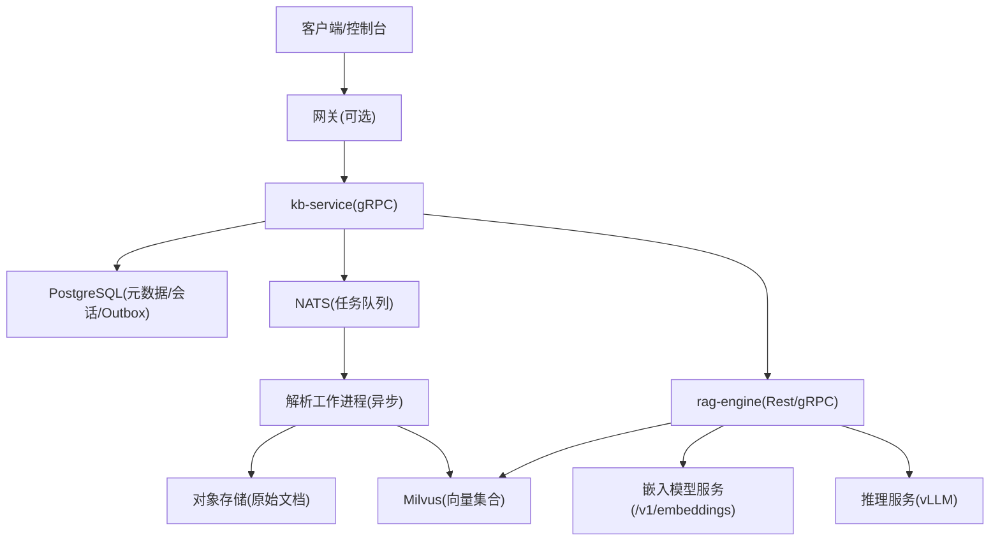
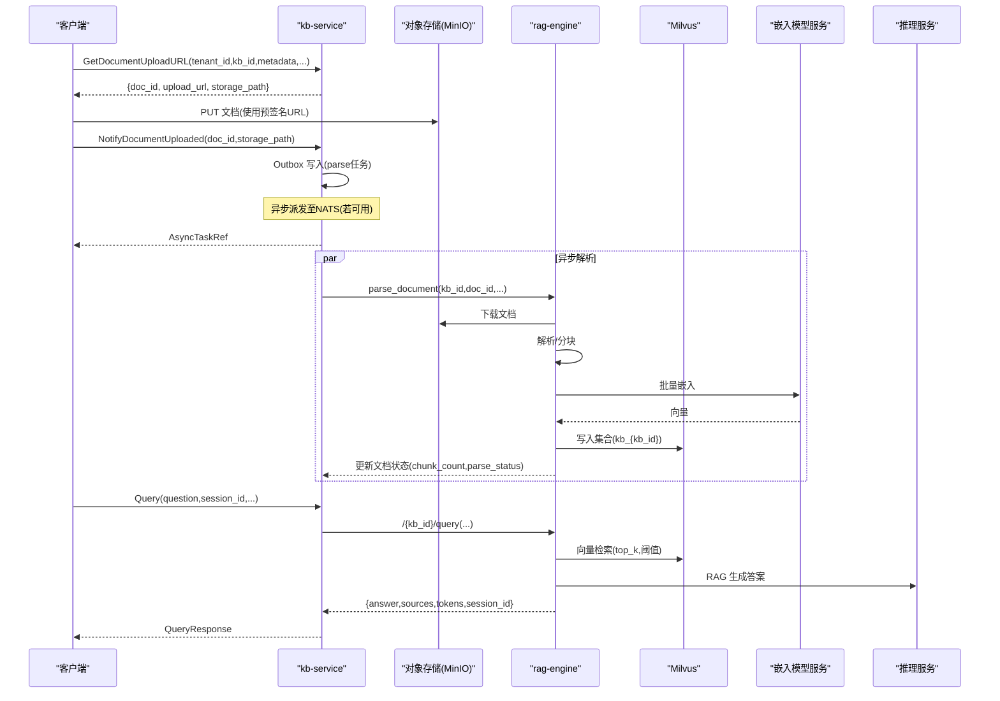
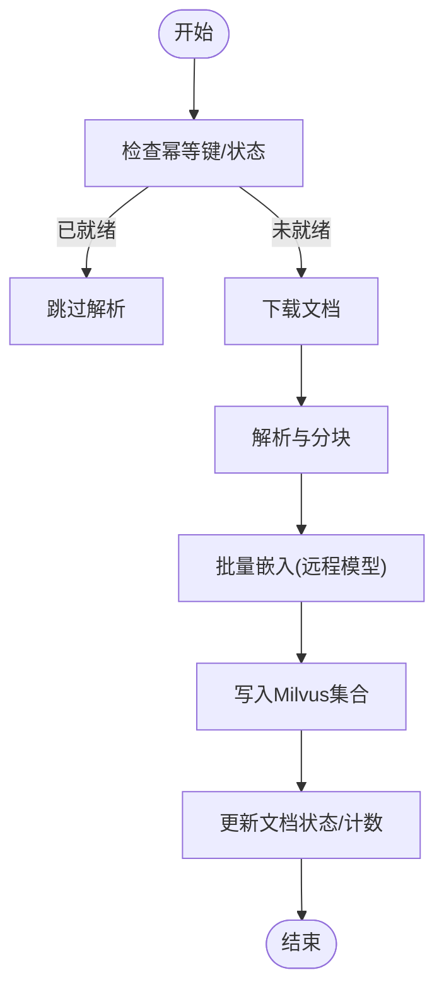
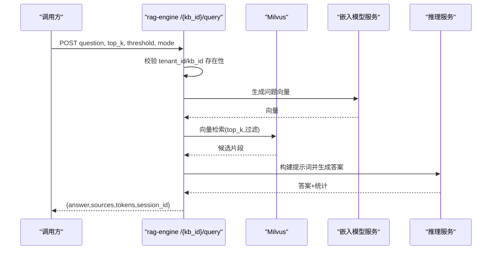
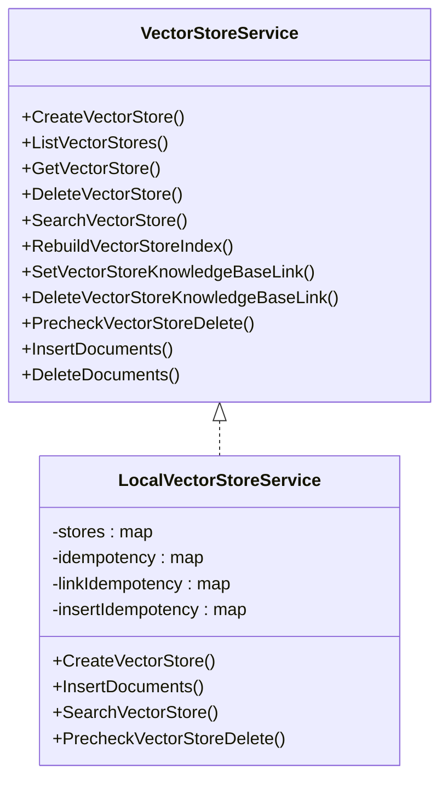
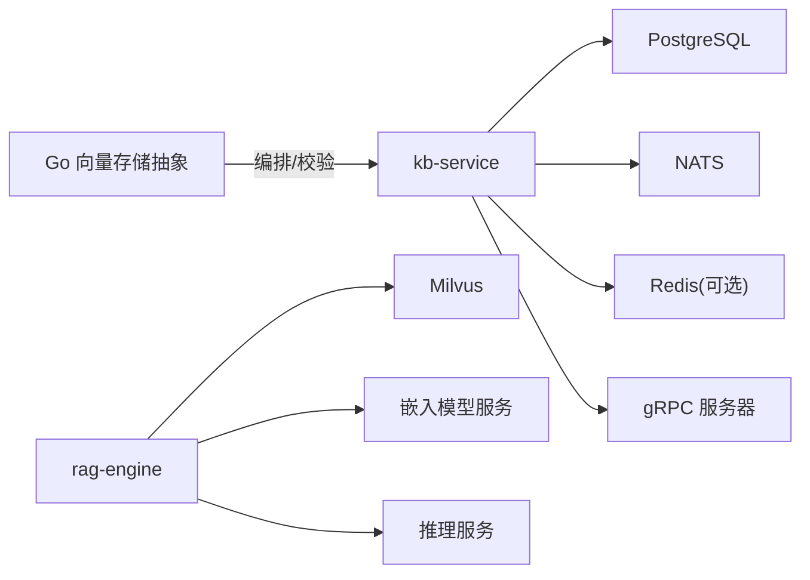

# 知识库处理器

<cite>
**本文引用的文件**
- [kb_service.proto](file://repo/api/proto/kb/v1/kb_service.proto)
- [documents.py](file://repo/ai/rag-engine/app/routers/documents.py)
- [query.py](file://repo/ai/rag-engine/app/routers/query.py)
- [milvus.py](file://repo/ai/rag-engine/app/core/milvus.py)
- [embeddings.py](file://repo/ai/rag-engine/app/core/embeddings.py)
- [vector_store.go](file://repo/pkg/ports/vector_store.go)
- [vector_store_service.go](file://repo/pkg/adapters/runtime/vector_store_service.go)
- [main.py](file://repo/services/kb-service/main.py)
</cite>

## 目录
1. [简介](#简介)
2. [项目结构](#项目结构)
3. [核心组件](#核心组件)
4. [架构总览](#架构总览)
5. [详细组件分析](#详细组件分析)
6. [依赖关系分析](#依赖关系分析)
7. [性能考量](#性能考量)
8. [故障排查指南](#故障排查指南)
9. [结论](#结论)
10. [附录：API 契约与数据模型](#附录api-契约与数据模型)

## 简介
本文件面向“知识库处理器”的创建、文档管理、向量检索等能力，覆盖文档上传、解析、索引、搜索全流程；说明权限控制、版本管理、批量处理能力；提供端到端调用示例路径；并解释与向量数据库（Milvus）、文档解析服务、推理服务的集成方式与数据处理流程。

## 项目结构
知识库相关代码分布在三个层次：
- 协议层：定义 gRPC 接口与消息类型（KBService）。
- 服务层：kb-service 负责知识空间、文档元数据、会话、Outbox 分发、gRPC 服务启动与生命周期管理。
- 引擎层：rag-engine 提供文档解析、向量化、检索与 RAG 查询（REST 与 gRPC 共享逻辑），并与 Milvus、嵌入模型服务交互。
- 平台侧：Go 端口与适配器定义了向量存储抽象与本地实现，用于资源编排与一致性校验。

图表来源
- [kb_service.proto:12-53](file://repo/api/proto/kb/v1/kb_service.proto#L12-L53)
- [main.py:133-178](file://repo/services/kb-service/main.py#L133-L178)
- [documents.py:28-90](file://repo/ai/rag-engine/app/routers/documents.py#L28-L90)
- [milvus.py:36-153](file://repo/ai/rag-engine/app/core/milvus.py#L36-L153)
- [embeddings.py:147-191](file://repo/ai/rag-engine/app/core/embeddings.py#L147-L191)
- [query.py:112-166](file://repo/ai/rag-engine/app/routers/query.py#L112-L166)

章节来源
- [kb_service.proto:12-53](file://repo/api/proto/kb/v1/kb_service.proto#L12-L53)
- [main.py:149-178](file://repo/services/kb-service/main.py#L149-L178)

## 核心组件
- 协议与服务边界
  - KBService 定义知识空间 CRUD、文档上传 URL、文档通知、文档查询、同步/流式检索、引用与会话列表、权限更新等 RPC。
- kb-service
  - 启动 gRPC 服务、维护 DB 连接池、Outbox 分发器、Redis 会话缓存；对外暴露健康检查。
- rag-engine
  - 提供文档解析 REST 端点（同步回退）与 RAG 查询 REST 端点；通过 Milvus 进行向量检索，通过嵌入模型服务生成向量，最终调用推理服务生成答案。
- 向量存储抽象（Go）
  - VectorStore/VectorStoreService 定义集合操作、文档插入/删除、搜索、健康检查；LocalVectorStoreService 提供内存/持久化混合实现与幂等保障。

章节来源
- [kb_service.proto:12-53](file://repo/api/proto/kb/v1/kb_service.proto#L12-L53)
- [main.py:149-178](file://repo/services/kb-service/main.py#L149-L178)
- [documents.py:28-90](file://repo/ai/rag-engine/app/routers/documents.py#L28-L90)
- [query.py:112-166](file://repo/ai/rag-engine/app/routers/query.py#L112-L166)
- [vector_store.go:157-179](file://repo/pkg/ports/vector_store.go#L157-L179)
- [vector_store_service.go:66-149](file://repo/pkg/adapters/runtime/vector_store_service.go#L66-L149)

## 架构总览
知识库处理采用“控制面 + 数据面 + 引擎”的分层设计：
- 控制面（kb-service）：管理知识空间、文档元数据、会话、权限、Outbox 事件。
- 数据面（MinIO/Milvus/PG/Redis/NATS）：对象存储、向量库、关系型数据库、缓存、消息总线。
- 引擎面（rag-engine）：解析、分块、向量化、检索、RAG 生成答案。

图表来源
- [kb_service.proto:18-44](file://repo/api/proto/kb/v1/kb_service.proto#L18-L44)
- [documents.py:28-90](file://repo/ai/rag-engine/app/routers/documents.py#L28-L90)
- [milvus.py:111-153](file://repo/ai/rag-engine/app/core/milvus.py#L111-L153)
- [embeddings.py:194-203](file://repo/ai/rag-engine/app/core/embeddings.py#L194-L203)
- [query.py:112-166](file://repo/ai/rag-engine/app/routers/query.py#L112-L166)

## 详细组件分析

### 知识空间与文档管理（kb-service）
- 能力
  - 创建/获取/列出/删除知识空间。
  - 文档上传 URL 预签发、上传后通知、文档元数据查询、分页列表、删除文档（幂等）。
  - 同步检索 Query 与流式检索 Retrieve（服务端流）。
  - 引用与会话列表、权限更新（Phase A P1）。
- 关键流程
  - 获取上传 URL：创建 kb_documents 记录（parse_status=pending），返回 doc_id、预签名 PUT URL、storage_path。
  - 通知已上传：校验 checksum，写入 Outbox 事件，后续由解析工作进程消费。
  - 删除文档：从 Milvus 中按 doc_id 表达式删除向量（幂等）。
- 幂等与一致性
  - 上传 URL 请求支持 idempotency_key 避免重复创建。
  - 删除文档在 Milvus 层按 doc_id 表达式删除，保证幂等。

章节来源
- [kb_service.proto:18-44](file://repo/api/proto/kb/v1/kb_service.proto#L18-L44)
- [kb_service.proto:88-134](file://repo/api/proto/kb/v1/kb_service.proto#L88-L134)
- [kb_service.proto:229-242](file://repo/api/proto/kb/v1/kb_service.proto#L229-L242)
- [documents.py:93-115](file://repo/ai/rag-engine/app/routers/documents.py#L93-L115)

### 文档解析与索引（rag-engine）
- 能力
  - 同步解析端点：下载 → 解析 → 分块 → 嵌入 → 写入 Milvus；可用作无 NATS 环境下的回退路径。
  - 幂等：同一 doc_id 重复解析会跳过已完成文档。
  - 删除索引：按 doc_id 表达式删除向量集合中的条目。
- 处理细节
  - 解析入口接收 kb_id/doc_id/tenant_id/storage_path/file_type/idempotency_key。
  - 内部复用 ParseWorker 的 process_message 完成全链路。
  - 完成后读取 chunk_count 与 parse_status 返回。

图表来源
- [documents.py:28-90](file://repo/ai/rag-engine/app/routers/documents.py#L28-L90)
- [milvus.py:111-153](file://repo/ai/rag-engine/app/core/milvus.py#L111-L153)
- [embeddings.py:194-203](file://repo/ai/rag-engine/app/core/embeddings.py#L194-L203)

章节来源
- [documents.py:28-90](file://repo/ai/rag-engine/app/routers/documents.py#L28-L90)
- [documents.py:93-115](file://repo/ai/rag-engine/app/routers/documents.py#L93-L115)

### 语义检索与 RAG（rag-engine）
- 能力
  - 混合检索：向量检索（Milvus）+ 关键词检索（pg_trgm）→ RRF 融合 → LLM 生成答案。
  - 当未命中阈值时返回结构化“无相关内容”响应，避免幻觉。
  - 支持 top_k、score_threshold、retrieval_mode、inference_service_name 等参数覆盖。
- 安全与可用性
  - 查询前校验 kb_id 是否存在于当前租户且状态为 active，否则返回 404。
  - 将阻塞式 QAService.chat 下放到线程执行，避免阻塞事件循环。
  - 超时与运行时错误映射为 HTTP 504/503。

图表来源
- [query.py:75-166](file://repo/ai/rag-engine/app/routers/query.py#L75-L166)
- [milvus.py:111-153](file://repo/ai/rag-engine/app/core/milvus.py#L111-L153)
- [embeddings.py:194-203](file://repo/ai/rag-engine/app/core/embeddings.py#L194-L203)

章节来源
- [query.py:75-166](file://repo/ai/rag-engine/app/routers/query.py#L75-L166)

### 向量存储抽象与本地实现（Go）
- 能力
  - 集合创建/确保、文档插入（批量）、删除（表达式）、搜索、健康检查。
  - 资源级幂等：创建、重建索引、文档插入均支持幂等键。
  - 知识空间关联：将向量资源与知识空间建立/解除关联。
  - 删除前置检查：若向量资源被知识空间引用则阻止删除。
- 约束与验证
  - 维度必须大于零；指标仅支持 cosine/l2/ip；top_k 上限 100；文档内容必填；过滤表达式长度限制。
  - 本地实现会在无后端时生成伪向量以支撑测试与编排流程。

图表来源
- [vector_store.go:157-179](file://repo/pkg/ports/vector_store.go#L157-L179)
- [vector_store_service.go:17-64](file://repo/pkg/adapters/runtime/vector_store_service.go#L17-L64)
- [vector_store_service.go:66-149](file://repo/pkg/adapters/runtime/vector_store_service.go#L66-L149)
- [vector_store_service.go:361-432](file://repo/pkg/adapters/runtime/vector_store_service.go#L361-L432)
- [vector_store_service.go:341-359](file://repo/pkg/adapters/runtime/vector_store_service.go#L341-L359)

章节来源
- [vector_store.go:157-179](file://repo/pkg/ports/vector_store.go#L157-L179)
- [vector_store_service.go:66-149](file://repo/pkg/adapters/runtime/vector_store_service.go#L66-L149)
- [vector_store_service.go:341-359](file://repo/pkg/adapters/runtime/vector_store_service.go#L341-L359)
- [vector_store_service.go:361-432](file://repo/pkg/adapters/runtime/vector_store_service.go#L361-L432)

### 嵌入模型与 Milvus 集成
- 嵌入模型
  - 通过 OpenAI 兼容 /v1/embeddings 端点统一嵌入；写读共用同一模型以保证一致性。
  - 支持批处理与异步封装，避免阻塞事件循环。
- Milvus
  - 集合命名规则：kb_{kb_id 去横杠}；HNSW 索引，余弦相似度，M=16，efConstruction=200。
  - 提供连接初始化、客户端获取、向量存储与索引构建工具。

章节来源
- [embeddings.py:1-22](file://repo/ai/rag-engine/app/core/embeddings.py#L1-L22)
- [embeddings.py:147-191](file://repo/ai/rag-engine/app/core/embeddings.py#L147-L191)
- [milvus.py:1-14](file://repo/ai/rag-engine/app/core/milvus.py#L1-L14)
- [milvus.py:36-153](file://repo/ai/rag-engine/app/core/milvus.py#L36-L153)

## 依赖关系分析
- kb-service 依赖
  - PostgreSQL：知识空间、文档、会话、Outbox 事件。
  - NATS：Outbox 分发解析任务（启动失败不影响服务启动）。
  - Redis：会话缓存（降级为 DB-only）。
  - gRPC：对外暴露 KBService。
- rag-engine 依赖
  - Milvus：向量检索与写入。
  - 嵌入模型服务：统一嵌入端点。
  - 推理服务：RAG 生成答案。
- Go 向量存储抽象
  - 作为平台侧对向量资源的编排与一致性校验，与 kb-service/rag-engine 解耦。

图表来源
- [main.py:149-178](file://repo/services/kb-service/main.py#L149-L178)
- [query.py:112-166](file://repo/ai/rag-engine/app/routers/query.py#L112-L166)
- [milvus.py:36-153](file://repo/ai/rag-engine/app/core/milvus.py#L36-L153)
- [embeddings.py:147-191](file://repo/ai/rag-engine/app/core/embeddings.py#L147-L191)
- [vector_store.go:157-179](file://repo/pkg/ports/vector_store.go#L157-L179)

章节来源
- [main.py:149-178](file://repo/services/kb-service/main.py#L149-L178)
- [query.py:112-166](file://repo/ai/rag-engine/app/routers/query.py#L112-L166)
- [milvus.py:36-153](file://repo/ai/rag-engine/app/core/milvus.py#L36-L153)
- [embeddings.py:147-191](file://repo/ai/rag-engine/app/core/embeddings.py#L147-L191)
- [vector_store.go:157-179](file://repo/pkg/ports/vector_store.go#L157-L179)

## 性能考量
- 并发与阻塞
  - rag-engine 将阻塞式 QAService.chat 下放到线程执行，避免阻塞 FastAPI 事件循环。
  - Milvus 连接初始化使用 worker 线程与超时保护，避免启动阻塞。
- 批处理
  - 嵌入模型支持批量嵌入（默认批次大小 100），提升吞吐。
- 索引参数
  - HNSW 索引参数（M=16，efConstruction=200）平衡召回与延迟。
- 幂等与重试
  - 上传 URL、文档解析、向量资源创建/重建/插入均支持幂等键，降低重复成本。

[本节为通用指导，不直接分析具体文件]

## 故障排查指南
- 常见错误与定位
  - 查询返回 404：kb_id 不存在或状态非 active；检查租户隔离与 RBAC。
  - 查询返回 504：推理服务超时；检查 vLLM 实例健康与负载。
  - 查询返回 503：运行时错误（如嵌入/检索异常）；查看 rag-engine 日志。
  - 解析失败：检查 MinIO 对象是否可达、解析器输出、Milvus 连接状态。
  - 向量删除失败：确认 Milvus 集合存在与表达式正确。
- 健康检查
  - kb-service /readyz 报告 DB、Outbox、Session Cache、gRPC 状态；NATS 不可用仍启动但 Outbox 延迟。
- 建议步骤
  - 先查 kb-service /readyz 与 /health。
  - 再查 rag-engine 日志与 Milvus 连接。
  - 最后核对 MinIO 对象与 pg_trgm 扩展。

章节来源
- [query.py:112-166](file://repo/ai/rag-engine/app/routers/query.py#L112-L166)
- [documents.py:93-115](file://repo/ai/rag-engine/app/routers/documents.py#L93-L115)
- [main.py:218-232](file://repo/services/kb-service/main.py#L218-L232)

## 结论
知识库处理器通过 kb-service 与 rag-engine 的协作，实现了从文档上传、解析、索引到语义检索与 RAG 生成的完整闭环；借助 Milvus 与统一的嵌入模型服务，保证了写读一致性与检索质量；Go 向量存储抽象提供了平台侧的一致编排与幂等保障。整体架构具备高内聚、低耦合、可扩展与可观测的特点。

[本节为总结，不直接分析具体文件]

## 附录：API 契约与数据模型
- 知识空间
  - 创建/获取/列出/删除：见 CreateKBRequest/GetKBRequest/ListKBsRequest/DeleteKBRequest 与 KnowledgeBase。
  - 权限更新：UpdateKBPermissionsRequest（Phase A P1）。
- 文档
  - 获取上传 URL：GetDocumentUploadURLRequest/Response（含 idempotency_key、checksum_sha256、custom_metadata）。
  - 通知已上传：NotifyDocumentUploadedRequest → AsyncTaskRef。
  - 文档查询/列表/删除：GetDocumentRequest/ListDocumentsRequest/DeleteDocumentRequest 与 KBDocument。
- 检索
  - 同步检索：QueryRequest/QueryResponse（支持 session_id、top_k、score_threshold、inference_service_name、retrieval_mode）。
  - 流式检索：RetrieveRequest/RetrieveEvent（token/sources/done/error）。
- 数据模型要点
  - 知识空间：embedding_model、chunk_size、top_k、score_threshold、retrieval_mode、status、doc_count。
  - 文档：file_type、parse_status、chunk_count、custom_metadata。
  - 来源片段：doc_id、file_name、page、content、score。

章节来源
- [kb_service.proto:57-162](file://repo/api/proto/kb/v1/kb_service.proto#L57-L162)
- [kb_service.proto:164-209](file://repo/api/proto/kb/v1/kb_service.proto#L164-L209)
- [kb_service.proto:213-242](file://repo/api/proto/kb/v1/kb_service.proto#L213-L242)
- [kb_service.proto:245-294](file://repo/api/proto/kb/v1/kb_service.proto#L245-L294)