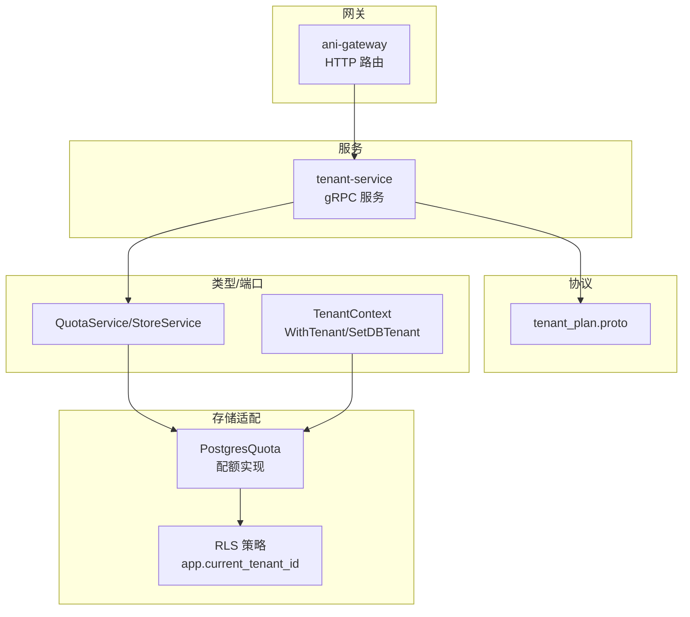
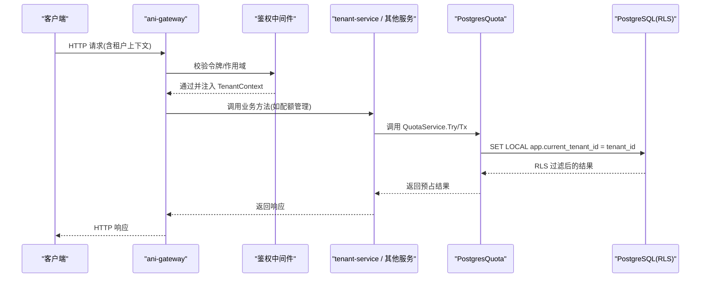
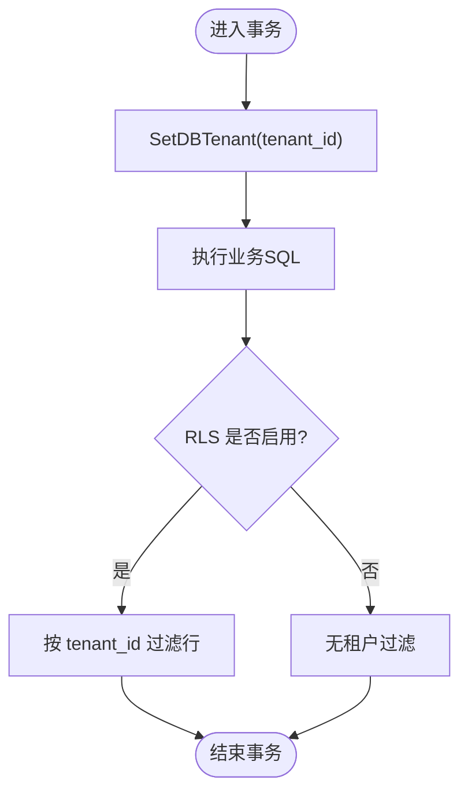
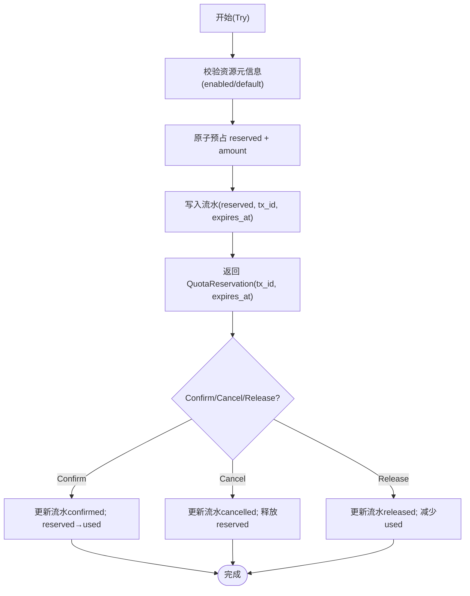
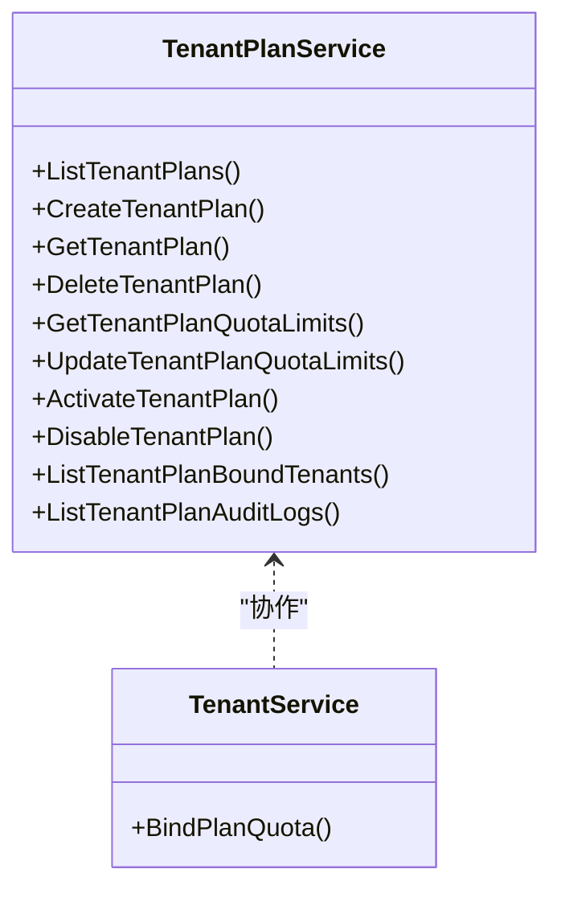
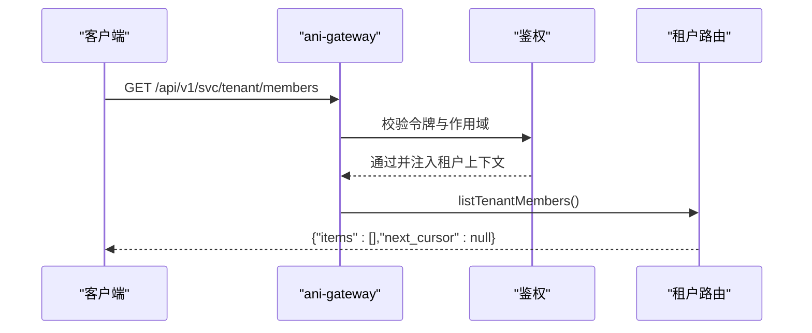
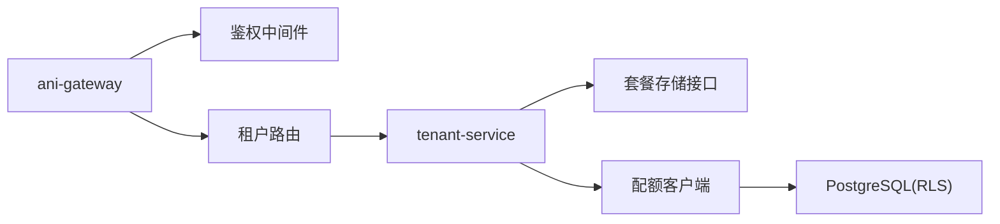

# 租户处理器

<cite>
**本文引用的文件**
- [pkg/types/tenant.go](file://repo/pkg/types/tenant.go)
- [pkg/ports/quota.go](file://repo/pkg/ports/quota.go)
- [pkg/adapters/runtime/postgres_quota.go](file://repo/pkg/adapters/runtime/postgres_quota.go)
- [services/ani-gateway/internal/router/tenant_resources.go](file://repo/services/ani-gateway/internal/router/tenant_resources.go)
- [services/ani-gateway/internal/router/auth.go](file://repo/services/ani-gateway/internal/router/auth.go)
- [services/tenant-service/internal/service/tenant_service.go](file://repo/services/tenant-service/internal/service/tenant_service.go)
- [services/tenant-service/internal/repo/ports/tenant_plan_store.go](file://repo/services/tenant-service/internal/repo/ports/tenant_plan_store.go)
- [api/proto/tenant/v1/tenant_plan.proto](file://repo/api/proto/tenant/v1/tenant_plan.proto)
- [services/kb-service/app/repositories/rls.py](file://repo/services/kb-service/app/repositories/rls.py)
- [scripts/apply_kb_migration.py](file://repo/scripts/apply_kb_migration.py)
- [development-records/auth-login-core-001.md](file://repo/development-records/auth-login-core-001.md)
- [development-records/instance-sandbox-token-a.md](file://repo/development-records/instance-sandbox-token-a.md)
</cite>

## 目录
1. [简介](#简介)
2. [项目结构](#项目结构)
3. [核心组件](#核心组件)
4. [架构总览](#架构总览)
5. [详细组件分析](#详细组件分析)
6. [依赖关系分析](#依赖关系分析)
7. [性能考量](#性能考量)
8. [故障排查指南](#故障排查指南)
9. [结论](#结论)
10. [附录：API 契约与数据模型](#附录api-契约与数据模型)

## 简介
本文件聚焦多租户架构下的“租户处理器”能力，覆盖租户创建、配置、权限控制、资源配额管理、隔离机制、数据安全与访问控制策略，并说明与认证授权系统的集成方式及租户上下文管理机制。文档同时梳理所有租户相关 API 接口的请求/响应结构、业务规则与数据验证逻辑，并提供可操作的流程图与时序图帮助理解。

## 项目结构
围绕租户处理的核心代码分布在以下层次：
- 网关层（ani-gateway）：暴露 HTTP 路由，承载租户成员、角色、SSO、Webhook 等接口；鉴权后将租户上下文注入后续处理链。
- 服务层（tenant-service）：gRPC 服务，承载套餐管理与绑定配额等能力（当前为占位实现，预留扩展点）。
- 存储适配层（postgres_quota、RLS 迁移脚本）：通过 PostgreSQL RLS 实现行级租户隔离；提供配额预占、确认、释放与管理操作。
- 类型与端口（types、ports）：定义租户上下文、配额领域模型与服务接口。
- 协议定义（proto）：定义租户套餐管理的 gRPC 接口与消息结构。

**图表来源**
- [services/ani-gateway/internal/router/tenant_resources.go:12-22](file://repo/services/ani-gateway/internal/router/tenant_resources.go#L12-L22)
- [services/tenant-service/internal/service/tenant_service.go:11-39](file://repo/services/tenant-service/internal/service/tenant_service.go#L11-L39)
- [pkg/adapters/runtime/postgres_quota.go:37-73](file://repo/pkg/adapters/runtime/postgres_quota.go#L37-L73)
- [api/proto/tenant/v1/tenant_plan.proto:12-42](file://repo/api/proto/tenant/v1/tenant_plan.proto#L12-L42)
- [pkg/types/tenant.go:14-63](file://repo/pkg/types/tenant.go#L14-L63)
- [pkg/ports/quota.go:70-101](file://repo/pkg/ports/quota.go#L70-L101)

**章节来源**
- [services/ani-gateway/internal/router/tenant_resources.go:12-22](file://repo/services/ani-gateway/internal/router/tenant_resources.go#L12-L22)
- [services/tenant-service/internal/service/tenant_service.go:11-39](file://repo/services/tenant-service/internal/service/tenant_service.go#L11-L39)
- [pkg/adapters/runtime/postgres_quota.go:37-73](file://repo/pkg/adapters/runtime/postgres_quota.go#L37-L73)
- [api/proto/tenant/v1/tenant_plan.proto:12-42](file://repo/api/proto/tenant/v1/tenant_plan.proto#L12-L42)
- [pkg/types/tenant.go:14-63](file://repo/pkg/types/tenant.go#L14-L63)
- [pkg/ports/quota.go:70-101](file://repo/pkg/ports/quota.go#L70-L101)

## 核心组件
- 租户上下文与数据库隔离
  - TenantContext 携带 TenantID、UserID、Roles，并通过 WithTenant/SetDBTenant 在事务内设置 app.current_tenant_id，驱动 PostgreSQL RLS 进行行级隔离。
- 配额服务（QuotaService/StoreService）
  - 提供 Try/TryMany/Confirm/Cancel/Release 的 TCC 预占流程，以及 Put/List/GetMy/GetTotalForUpdateTx 的管理与查询能力。
- 租户服务（TenantService）
  - 承载套餐管理与绑定配额能力（BindPlanQuota），当前为占位实现，预留扩展点。
- 网关路由
  - 暴露租户成员、角色、SSO、Webhook 等 HTTP 接口；鉴权后调用下游服务或返回占位响应。

**章节来源**
- [pkg/types/tenant.go:14-63](file://repo/pkg/types/tenant.go#L14-L63)
- [pkg/ports/quota.go:70-101](file://repo/pkg/ports/quota.go#L70-L101)
- [services/tenant-service/internal/service/tenant_service.go:11-39](file://repo/services/tenant-service/internal/service/tenant_service.go#L11-L39)
- [services/ani-gateway/internal/router/tenant_resources.go:12-22](file://repo/services/ani-gateway/internal/router/tenant_resources.go#L12-L22)

## 架构总览
下图展示从网关到存储的完整链路，包括租户上下文注入、RLS 隔离与配额预占流程。

**图表来源**
- [services/ani-gateway/internal/router/auth.go:398-432](file://repo/services/ani-gateway/internal/router/auth.go#L398-L432)
- [pkg/types/tenant.go:48-63](file://repo/pkg/types/tenant.go#L48-L63)
- [pkg/adapters/runtime/postgres_quota.go:37-73](file://repo/pkg/adapters/runtime/postgres_quota.go#L37-L73)
- [pkg/ports/quota.go:70-101](file://repo/pkg/ports/quota.go#L70-L101)

## 详细组件分析

### 租户上下文与 RLS 隔离
- 上下文注入
  - 认证中间件将 TenantContext 注入请求上下文；业务代码通过 FromContext/TryFromContext 获取。
- 数据库隔离
  - 在事务中调用 SetDBTenant 设置 app.current_tenant_id，配合 PostgreSQL RLS 策略自动按租户过滤数据。
- Python 侧对齐
  - kb-service 使用 set_tenant_context(conn, tenant_id) 在同一事务内设置会话变量，确保 RLS 生效。

**图表来源**
- [pkg/types/tenant.go:48-63](file://repo/pkg/types/tenant.go#L48-L63)
- [services/kb-service/app/repositories/rls.py:16-32](file://repo/services/kb-service/app/repositories/rls.py#L16-L32)
- [scripts/apply_kb_migration.py:145-180](file://repo/scripts/apply_kb_migration.py#L145-L180)

**章节来源**
- [pkg/types/tenant.go:14-63](file://repo/pkg/types/tenant.go#L14-L63)
- [services/kb-service/app/repositories/rls.py:16-32](file://repo/services/kb-service/app/repositories/rls.py#L16-L32)
- [scripts/apply_kb_migration.py:145-180](file://repo/scripts/apply_kb_migration.py#L145-L180)

### 配额管理（TCC 预占与确认）
- 预占（Try/TryMany）
  - 校验资源已注册且 enabled；原子预占 reserved；插入流水记录 resource_reservations；返回 TxID。
- 确认（Confirm）
  - 幂等更新流水状态为 confirmed；将 reserved 转为 used，关联 resource_ref。
- 取消（Cancel）
  - 幂等更新流水状态为 cancelled；释放 reserved。
- 释放（Release）
  - 幂等更新流水状态为 released；减少 used。
- 管理（Put/List/GetMy/GetTotalForUpdateTx）
  - Put：平台级 UPSERT total；List：支持跨租户分页；GetMy：租户自查；GetTotalForUpdateTx：锁行读取 total 用于并发校验。

**图表来源**
- [pkg/adapters/runtime/postgres_quota.go:37-73](file://repo/pkg/adapters/runtime/postgres_quota.go#L37-L73)
- [pkg/ports/quota.go:70-101](file://repo/pkg/ports/quota.go#L70-L101)

**章节来源**
- [pkg/adapters/runtime/postgres_quota.go:37-73](file://repo/pkg/adapters/runtime/postgres_quota.go#L37-L73)
- [pkg/ports/quota.go:70-101](file://repo/pkg/ports/quota.go#L70-L101)

### 租户套餐与绑定配额
- 套餐管理（TenantPlanService）
  - 提供套餐的创建、查询、激活/禁用、限额视图与审计日志等 RPC。
- 绑定配额（BindPlanQuota）
  - 读取套餐有效限额 → 跳过已审批维度 → 批量下发 Core → 更新 tenants.plan_id（当前为占位实现）。

**图表来源**
- [api/proto/tenant/v1/tenant_plan.proto:12-42](file://repo/api/proto/tenant/v1/tenant_plan.proto#L12-L42)
- [services/tenant-service/internal/service/tenant_service.go:11-39](file://repo/services/tenant-service/internal/service/tenant_service.go#L11-L39)

**章节来源**
- [api/proto/tenant/v1/tenant_plan.proto:12-42](file://repo/api/proto/tenant/v1/tenant_plan.proto#L12-L42)
- [services/tenant-service/internal/service/tenant_service.go:11-39](file://repo/services/tenant-service/internal/service/tenant_service.go#L11-L39)
- [services/tenant-service/internal/repo/ports/tenant_plan_store.go:18-168](file://repo/services/tenant-service/internal/repo/ports/tenant_plan_store.go#L18-L168)

### 网关租户接口与鉴权集成
- 租户接口
  - 成员管理、角色列表、SSO 配置、Webhook 管理等路由已注册，当前返回占位响应。
- 鉴权与租户上下文
  - 鉴权中间件校验令牌与作用域，必要时拒绝缺少租户上下文的请求；API Key 管理通过 auth service 完成。

**图表来源**
- [services/ani-gateway/internal/router/tenant_resources.go:12-22](file://repo/services/ani-gateway/internal/router/tenant_resources.go#L12-L22)
- [services/ani-gateway/internal/router/auth.go:398-432](file://repo/services/ani-gateway/internal/router/auth.go#L398-L432)

**章节来源**
- [services/ani-gateway/internal/router/tenant_resources.go:12-22](file://repo/services/ani-gateway/internal/router/tenant_resources.go#L12-L22)
- [services/ani-gateway/internal/router/auth.go:398-432](file://repo/services/ani-gateway/internal/router/auth.go#L398-L432)

### 权限控制与访问策略
- 平台与租户隔离
  - 平台 token 与租户 token 隔离，RBAC 基于 scope 区分拦截策略；平台管理员 JWT 中 tid 为空字符串。
- Sandbox Token
  - 短期签名凭证，仅允许访问对应实例的沙箱子资源，不用于再签发 token。

**章节来源**
- [development-records/auth-login-core-001.md:22-28](file://repo/development-records/auth-login-core-001.md#L22-L28)
- [development-records/instance-sandbox-token-a.md:17-23](file://repo/development-records/instance-sandbox-token-a.md#L17-L23)

## 依赖关系分析
- 组件耦合
  - 网关依赖鉴权中间件与租户路由；租户服务依赖套餐存储与配额客户端；配额实现依赖 PostgreSQL 与 RLS。
- 外部依赖
  - PostgreSQL（RLS）、gRPC（tenant-plan.proto）、鉴权服务（auth-service）。

**图表来源**
- [services/ani-gateway/internal/router/tenant_resources.go:12-22](file://repo/services/ani-gateway/internal/router/tenant_resources.go#L12-L22)
- [services/tenant-service/internal/service/tenant_service.go:11-39](file://repo/services/tenant-service/internal/service/tenant_service.go#L11-L39)
- [pkg/adapters/runtime/postgres_quota.go:37-73](file://repo/pkg/adapters/runtime/postgres_quota.go#L37-L73)

**章节来源**
- [services/ani-gateway/internal/router/tenant_resources.go:12-22](file://repo/services/ani-gateway/internal/router/tenant_resources.go#L12-L22)
- [services/tenant-service/internal/service/tenant_service.go:11-39](file://repo/services/tenant-service/internal/service/tenant_service.go#L11-L39)
- [pkg/adapters/runtime/postgres_quota.go:37-73](file://repo/pkg/adapters/runtime/postgres_quota.go#L37-L73)

## 性能考量
- 事务边界
  - Try/TryMany 自开租户事务；Confirm/Cancel/Release 接入外部事务以保证原子性。
- 并发安全
  - 预占使用原子 UPDATE 守卫 reserved+used+amount <= total；GetTotalForUpdateTx 锁行读取 total。
- 分页与聚合
  - List 支持 keyset 分页，跨租户时先取 distinct tenant_id 再聚合。

[本节为通用指导，无需具体文件引用]

## 故障排查指南
- 常见错误
  - 资源未注册/enabled=false：ErrQuotaResourceNotRegistered。
  - 配额不足：ErrQuotaExceeded。
  - 租户不存在：ErrTenantNotFound。
  - 配额项不存在：ErrQuotaNotFound。
- 排查步骤
  - 检查资源元数据是否注册且启用。
  - 确认事务中已设置 app.current_tenant_id。
  - 核对预占金额与 reserved/used 约束。
  - 查看审计日志与幂等键重放情况。

**章节来源**
- [pkg/adapters/runtime/postgres_quota.go:37-73](file://repo/pkg/adapters/runtime/postgres_quota.go#L37-L73)
- [pkg/ports/quota.go:70-101](file://repo/pkg/ports/quota.go#L70-L101)

## 结论
本项目在多租户架构下通过 TenantContext 与 PostgreSQL RLS 实现了强隔离的数据访问；配额管理采用 TCC 模式保障并发与一致性；网关与服务层职责清晰，协议定义完备。后续应完善 tenant-service 的业务实现，补齐套餐绑定与配额下发的端到端流程，并增强监控与审计能力。

[本节为总结，无需具体文件引用]

## 附录：API 契约与数据模型
- 租户套餐管理（gRPC）
  - 服务：TenantPlanService、TenantService
  - 关键 RPC：ListTenantPlans、CreateTenantPlan、GetTenantPlan、DeleteTenantPlan、GetTenantPlanQuotaLimits、UpdateTenantPlanQuotaLimits、ActivateTenantPlan、DisableTenantPlan、ListTenantPlanBoundTenants、ListTenantPlanAuditLogs、BindPlanQuota
  - 消息：TenantPlan、PlanQuotaLimitInput、PlanQuotaLimitView、BoundTenant、AuditLog、IdempotentResult
- 配额管理（HTTP/内部接口）
  - 预占：Try/TryMany（返回 QuotaReservation）
  - 确认/取消/释放：Confirm/Cancel/Release（幂等）
  - 管理：Put（平台级 UPSERT）、List（跨租户分页）、GetMy（租户自查）、GetTotalForUpdateTx（锁行）
- 网关租户接口（HTTP）
  - 成员、角色、SSO、Webhook 等路由已注册，当前返回占位响应。

**章节来源**
- [api/proto/tenant/v1/tenant_plan.proto:12-184](file://repo/api/proto/tenant/v1/tenant_plan.proto#L12-L184)
- [pkg/ports/quota.go:8-101](file://repo/pkg/ports/quota.go#L8-L101)
- [services/ani-gateway/internal/router/tenant_resources.go:12-22](file://repo/services/ani-gateway/internal/router/tenant_resources.go#L12-L22)