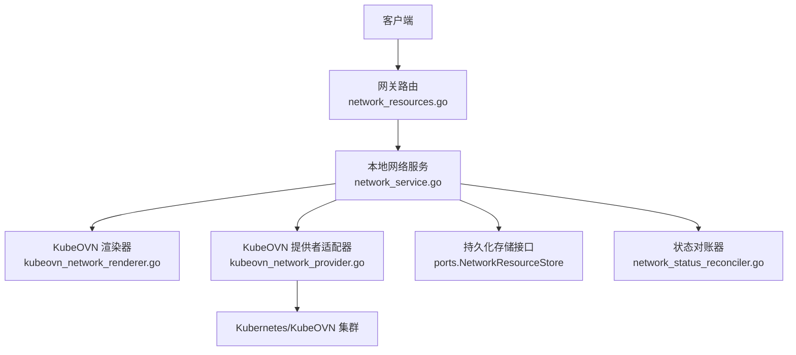
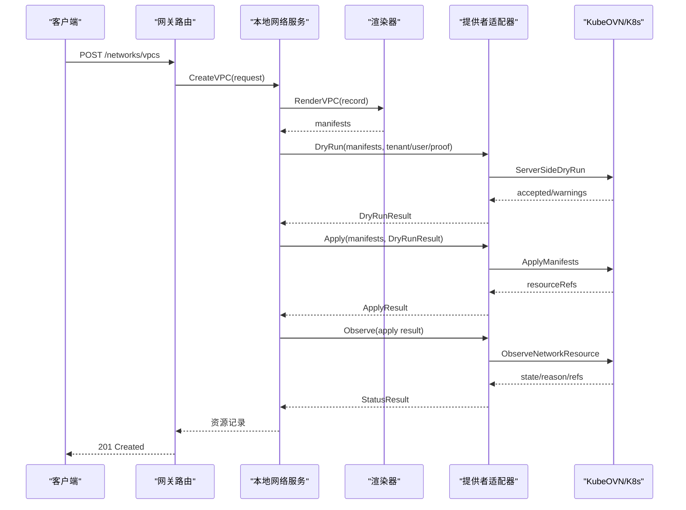
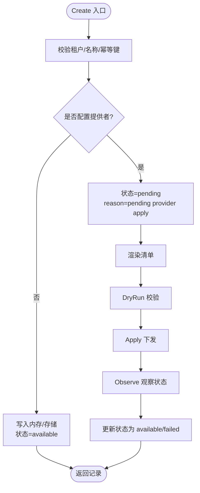
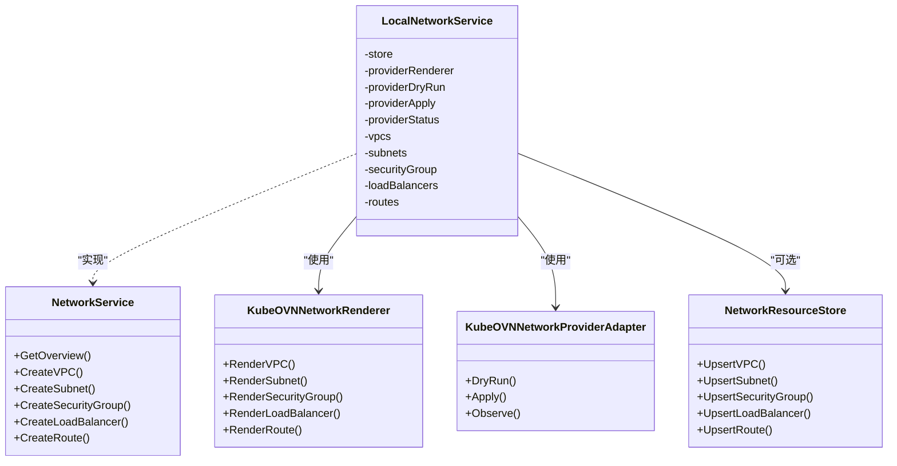

# 网络处理器

<cite>
**本文引用的文件**
- [services/ani-gateway/network_runtime.go](file://services/ani-gateway/network_runtime.go)
- [pkg/ports/network_resources.go](file://pkg/ports/network_resources.go)
- [pkg/adapters/runtime/network_service.go](file://pkg/adapters/runtime/network_service.go)
- [pkg/adapters/runtime/kubeovn_network_provider.go](file://pkg/adapters/runtime/kubeovn_network_provider.go)
- [pkg/adapters/runtime/kubeovn_network_renderer.go](file://pkg/adapters/runtime/kubeovn_network_renderer.go)
- [services/ani-gateway/internal/router/network_resources.go](file://services/ani-gateway/internal/router/network_resources.go)
- [pkg/adapters/runtime/network_status_reconciler.go](file://pkg/adapters/runtime/network_status_reconciler.go)
</cite>

## 目录
1. [简介](#简介)
2. [项目结构](#项目结构)
3. [核心组件](#核心组件)
4. [架构总览](#架构总览)
5. [详细组件分析](#详细组件分析)
6. [依赖关系分析](#依赖关系分析)
7. [性能与可扩展性](#性能与可扩展性)
8. [故障排查指南](#故障排查指南)
9. [结论](#结论)
10. [附录：API 契约与数据模型](#附录api-契约与数据模型)

## 简介
本文件面向“网络处理器”，系统化说明 VPC、子网、安全组、负载均衡器、路由等网络资源的生命周期管理，覆盖网络隔离策略、流量控制、网络安全配置、拓扑管理、连接监控与故障恢复机制。文档同时给出创建网络资源、配置安全规则、设置负载均衡策略的示例路径，并完整文档化所有网络相关 API 的请求/响应结构、业务规则与数据验证逻辑。最后解释网络处理器与底层 KubeOVN/Kubernetes 基础设施的集成方式及策略执行机制。

## 项目结构
网络处理器的实现由三层构成：
- 网关层（HTTP 路由）：暴露 RESTful 接口，负责请求解析、租户上下文注入、错误封装与响应序列化。
- 服务层（本地网络服务）：提供统一的 NetworkService 接口，维护内存状态、幂等键、资源关联、渲染与下发流程编排。
- 适配层（KubeOVN 渲染与提供者）：将内部记录渲染为 KubeOVN/Kubernetes 清单，并通过 DryRun→Apply→Observe 三阶段执行与状态回写。

图表来源
- [services/ani-gateway/internal/router/network_resources.go:246-283](file://services/ani-gateway/internal/router/network_resources.go#L246-L283)
- [pkg/adapters/runtime/network_service.go:15-38](file://pkg/adapters/runtime/network_service.go#L15-L38)
- [pkg/adapters/runtime/kubeovn_network_renderer.go:13-17](file://pkg/adapters/runtime/kubeovn_network_renderer.go#L13-L17)
- [pkg/adapters/runtime/kubeovn_network_provider.go:17-48](file://pkg/adapters/runtime/kubeovn_network_provider.go#L17-L48)
- [pkg/adapters/runtime/network_status_reconciler.go:12-28](file://pkg/adapters/runtime/network_status_reconciler.go#L12-L28)

章节来源
- [services/ani-gateway/network_runtime.go:30-88](file://services/ani-gateway/network_runtime.go#L30-L88)
- [services/ani-gateway/internal/router/network_resources.go:246-283](file://services/ani-gateway/internal/router/network_resources.go#L246-L283)
- [pkg/adapters/runtime/network_service.go:87-109](file://pkg/adapters/runtime/network_service.go#L87-L109)

## 核心组件
- 网关路由：注册 /networks/* 路由，统一鉴权与租户上下文，调用 NetworkService。
- 本地网络服务：实现 NetworkService 接口，维护 VPC/Subnet/SecurityGroup/LB/Route 的内存索引与幂等映射；在启用提供者时，驱动渲染→DryRun→Apply→Observe 流程。
- KubeOVN 渲染器：将资源记录转换为 KubeOVN/Vpc、Subnet、NetworkPolicy、Service 等清单。
- KubeOVN 提供者适配器：校验身份与权限证明，执行 ServerSide DryRun、Apply、Observe，并返回资源引用与状态。
- 状态对账器：根据 Apply 结果与 Provider 观察结果，持久化资源状态，支持失败重试与一致性修复。

章节来源
- [pkg/ports/network_resources.go:314-350](file://pkg/ports/network_resources.go#L314-L350)
- [pkg/adapters/runtime/network_service.go:111-163](file://pkg/adapters/runtime/network_service.go#L111-L163)
- [pkg/adapters/runtime/kubeovn_network_renderer.go:19-142](file://pkg/adapters/runtime/kubeovn_network_renderer.go#L19-L142)
- [pkg/adapters/runtime/kubeovn_network_provider.go:50-134](file://pkg/adapters/runtime/kubeovn_network_provider.go#L50-L134)
- [pkg/adapters/runtime/network_status_reconciler.go:27-67](file://pkg/adapters/runtime/network_status_reconciler.go#L27-L67)

## 架构总览
网络处理器采用“声明式 + 可插拔提供者”的架构：
- 声明式：通过 NetworkService 接收高层资源请求，生成内部记录。
- 可插拔：当配置了 KubeOVN 提供者时，使用渲染器产出清单，经 DryRun→Apply→Observe 落地到 KubeOVN/K8s；未配置时走本地开发模式，直接落库并标记可用。

图表来源
- [services/ani-gateway/internal/router/network_resources.go:294-311](file://services/ani-gateway/internal/router/network_resources.go#L294-L311)
- [pkg/adapters/runtime/network_service.go:165-218](file://pkg/adapters/runtime/network_service.go#L165-L218)
- [pkg/adapters/runtime/kubeovn_network_renderer.go:19-33](file://pkg/adapters/runtime/kubeovn_network_renderer.go#L19-L33)
- [pkg/adapters/runtime/kubeovn_network_provider.go:50-105](file://pkg/adapters/runtime/kubeovn_network_provider.go#L50-L105)

## 详细组件分析

### 网关路由：网络资源 API
- 路由注册：/networks/overview、vpcs、subnets、security-groups、load-balancers、routes 及其 CRUD。
- 请求绑定：JSON Body 绑定到结构化请求体，查询参数用于过滤。
- 租户上下文：从请求上下文中提取 TenantID 注入服务层。
- 错误处理：统一写错函数，区分 BAD_REQUEST 与网络错误。

章节来源
- [services/ani-gateway/internal/router/network_resources.go:246-283](file://services/ani-gateway/internal/router/network_resources.go#L246-L283)
- [services/ani-gateway/internal/router/network_resources.go:294-311](file://services/ani-gateway/internal/router/network_resources.go#L294-L311)
- [services/ani-gateway/internal/router/network_resources.go:348-367](file://services/ani-gateway/internal/router/network_resources.go#L348-L367)
- [services/ani-gateway/internal/router/network_resources.go:422-440](file://services/ani-gateway/internal/router/network_resources.go#L422-L440)
- [services/ani-gateway/internal/router/network_resources.go:622-642](file://services/ani-gateway/internal/router/network_resources.go#L622-L642)
- [services/ani-gateway/internal/router/network_resources.go:680-700](file://services/ani-gateway/internal/router/network_resources.go#L680-L700)

### 本地网络服务：生命周期与状态机
- 资源模型：VPC、Subnet、SecurityGroup、LoadBalancer、Route 均具备 State（pending/available/failed/deleting/deleted）。
- 幂等性：每个创建操作基于 idempotency_key 去重，避免重复下发。
- 提供者开关：当配置了渲染器/提供者时，创建后进入 pending，随后执行 DryRun→Apply→Observe，再更新为 available/failed。
- 安全组规则：优先级范围 1..32766，方向 ingress/egress，协议 tcp/udp/icmp/all，动作 allow/deny，端口与 CIDR 必填。
- 关联校验：创建 Subnet/LB/Route 需先存在对应 VPC；删除操作仅做软删除标记。

图表来源
- [pkg/adapters/runtime/network_service.go:165-218](file://pkg/adapters/runtime/network_service.go#L165-L218)
- [pkg/adapters/runtime/network_service.go:1010-1060](file://pkg/adapters/runtime/network_service.go#L1010-L1060)
- [pkg/adapters/runtime/network_service.go:1062-1139](file://pkg/adapters/runtime/network_service.go#L1062-L1139)

章节来源
- [pkg/adapters/runtime/network_service.go:165-218](file://pkg/adapters/runtime/network_service.go#L165-L218)
- [pkg/adapters/runtime/network_service.go:268-331](file://pkg/adapters/runtime/network_service.go#L268-L331)
- [pkg/adapters/runtime/network_service.go:390-460](file://pkg/adapters/runtime/network_service.go#L390-L460)
- [pkg/adapters/runtime/network_service.go:537-641](file://pkg/adapters/runtime/network_service.go#L537-L641)
- [pkg/adapters/runtime/network_service.go:735-800](file://pkg/adapters/runtime/network_service.go#L735-L800)
- [pkg/adapters/runtime/network_service.go:852-924](file://pkg/adapters/runtime/network_service.go#L852-L924)
- [pkg/adapters/runtime/network_service.go:1194-1267](file://pkg/adapters/runtime/network_service.go#L1194-L1267)

### KubeOVN 渲染器：清单生成
- VPC：渲染为 kubeovn.io/v1::Vpc，包含命名空间与租户标签。
- Subnet：渲染为 kubeovn.io/v1::Subnet，指定 CIDR、VPC 引用、私有与 NAT 策略。
- SecurityGroup：渲染为 networking.k8s.io/v1::NetworkPolicy，按规则生成 Ingress/Egress 条目。
- LoadBalancer：渲染为 v1::Service，scheme=public 时使用 LoadBalancer 类型，否则 ClusterIP。
- Route：以注解形式向 Vpc 追加静态路由，当前仅支持 gateway 下一跳类型。

章节来源
- [pkg/adapters/runtime/kubeovn_network_renderer.go:19-142](file://pkg/adapters/runtime/kubeovn_network_renderer.go#L19-L142)
- [pkg/adapters/runtime/kubeovn_network_renderer.go:177-250](file://pkg/adapters/runtime/kubeovn_network_renderer.go#L177-L250)

### KubeOVN 提供者适配器：DryRun/Apply/Observe
- DryRun：服务端预检，返回接受与否、警告与资源引用。
- Apply：仅在 DryRun 通过后执行，返回实际下发的资源引用。
- Observe：读取真实状态，要求 Apply 已应用且包含资源引用，缺失则报错。
- 身份与权限：强制校验 tenant_id、user_id、resource_kind、resource_id、permission_proof。

章节来源
- [pkg/adapters/runtime/kubeovn_network_provider.go:50-134](file://pkg/adapters/runtime/kubeovn_network_provider.go#L50-L134)
- [pkg/adapters/runtime/kubeovn_network_provider.go:136-176](file://pkg/adapters/runtime/kubeovn_network_provider.go#L136-L176)

### 状态对账器：一致性与恢复
- 输入：Apply 结果与 Provider 观察结果。
- 行为：校验资源引用一致性，持久化状态变更，支持失败重试与最终一致。
- 用途：在控制器循环中拉取待对账目标，持续收敛至期望态。

章节来源
- [pkg/adapters/runtime/network_status_reconciler.go:27-67](file://pkg/adapters/runtime/network_status_reconciler.go#L27-L67)

### 网关与服务装配：提供者选择
- 环境变量决定提供者模式：NETWORK_PROVIDER=kubeovn_rest 时，构建 Kubernetes REST 客户端，装配渲染器与提供者适配器，并注入用户 ID 与权限证明。
- 未配置或 local/not_configured：不启用外部提供者，走本地模式。

章节来源
- [services/ani-gateway/network_runtime.go:30-88](file://services/ani-gateway/network_runtime.go#L30-L88)

## 依赖关系分析
- 网关路由依赖 ports.NetworkService 接口，默认注入本地网络服务。
- 本地网络服务依赖：
  - 渲染器：将记录转为清单。
  - DryRun/Apply/StatusReader：与底层 KubeOVN 交互。
  - 存储接口：可选持久化资源状态。
- 提供者适配器依赖 KubernetesRESTClient，封装 DryRun/Apply/Observe。

图表来源
- [pkg/ports/network_resources.go:314-350](file://pkg/ports/network_resources.go#L314-L350)
- [pkg/adapters/runtime/network_service.go:15-38](file://pkg/adapters/runtime/network_service.go#L15-L38)
- [pkg/adapters/runtime/kubeovn_network_renderer.go:13-17](file://pkg/adapters/runtime/kubeovn_network_renderer.go#L13-L17)
- [pkg/adapters/runtime/kubeovn_network_provider.go:17-48](file://pkg/adapters/runtime/kubeovn_network_provider.go#L17-L48)

章节来源
- [pkg/ports/network_resources.go:352-367](file://pkg/ports/network_resources.go#L352-L367)
- [pkg/adapters/runtime/network_service.go:1006-1008](file://pkg/adapters/runtime/network_service.go#L1006-L1008)

## 性能与可扩展性
- 并发安全：LocalNetworkService 使用读写锁保护内存索引，列表与概览为读锁，写操作加写锁。
- 幂等优化：基于 idempotency_key 的去重，避免重复渲染与下发。
- 批量渲染：一次创建可能产生多条清单（如安全组规则），但整体在单次事务内提交。
- 可扩展点：
  - 新增资源类型：扩展 NetworkService 接口与渲染器。
  - 新提供者：实现 DryRun/Apply/StatusReader 接口，替换 KubeOVN 适配器。
  - 存储后端：实现 NetworkResourceStore 以接入持久化。

[本节为通用指导，无需具体文件来源]

## 故障排查指南
- 常见错误与定位
  - 缺少必要字段：如 vpc_id、destination_cidr、next_hop_type、next_hop_id、port_range、cidr、direction、protocol、action 等，会返回无效参数错误。
  - 提供者未配置：DryRun/Apply/Observe 返回未配置错误。
  - 权限证明缺失：执行 DryRun/Apply/Observe 必须携带 permission_proof。
  - 资源不存在：获取/删除时若找不到或已删除，返回未找到。
  - 状态不一致：对账器拒绝引用不匹配的观察结果。
- 建议排查步骤
  - 检查环境变量 NETWORK_PROVIDER、NETWORK_PROVIDER_USER_ID、NETWORK_PROVIDER_PERMISSION_PROOF。
  - 查看资源状态与 reason，确认是否处于 pending/failed。
  - 核对渲染清单是否符合 KubeOVN/K8s 规范。
  - 使用概览接口 /networks/overview 了解能力与风险。

章节来源
- [pkg/adapters/runtime/kubeovn_network_provider.go:136-176](file://pkg/adapters/runtime/kubeovn_network_provider.go#L136-L176)
- [pkg/adapters/runtime/network_service.go:1141-1183](file://pkg/adapters/runtime/network_service.go#L1141-L1183)
- [pkg/adapters/runtime/network_service.go:1194-1267](file://pkg/adapters/runtime/network_service.go#L1194-L1267)

## 结论
网络处理器通过清晰的三层架构实现了网络资源的声明式管理与可插拔提供者集成。本地服务保证幂等、状态机与关联校验；渲染器将抽象资源映射为 KubeOVN/K8s 清单；提供者适配器完成 DryRun→Apply→Observe 的闭环。配合状态对账器，系统具备强一致性与故障恢复能力。

[本节为总结，无需具体文件来源]

## 附录：API 契约与数据模型

### 路由与请求/响应
- 概览：GET /networks/overview
- VPC：POST/GET/DELETE /networks/vpcs/{vpc_id}，列表 GET /networks/vpcs
- 子网：POST/GET/DELETE /networks/subnets/{subnet_id}，列表 GET /networks/subnets，IP 分配列表 GET /networks/subnets/{subnet_id}/ip-allocations
- 安全组：POST/GET/DELETE /networks/security-groups/{security_group_id}，列表 GET /networks/security-groups
  - 规则：POST/GET/PUT/DELETE /networks/security-groups/{security_group_id}/rules/{rule_id}，列表 GET .../rules
  - 绑定：POST/DELETE /networks/security-groups/{security_group_id}/bindings/{binding_id}，列表 GET .../bindings
- 负载均衡器：POST/GET/DELETE /networks/load-balancers/{load_balancer_id}，列表 GET /networks/load-balancers
- 路由：POST/GET/DELETE /networks/routes/{route_id}，列表 GET /networks/routes

章节来源
- [services/ani-gateway/internal/router/network_resources.go:246-283](file://services/ani-gateway/internal/router/network_resources.go#L246-L283)

### 数据模型与业务规则
- 资源状态：pending、available、failed、deleting、deleted
- 安全组规则：
  - 优先级：1..32766
  - 方向：ingress/egress
  - 协议：tcp/udp/icmp/all
  - 动作：allow/deny
  - 端口与 CIDR：必填
- 路由下一跳类型：gateway、instance、nat（渲染器当前仅支持 gateway）
- 负载均衡 scheme：internal/public（public 映射为 LoadBalancer 类型）

章节来源
- [pkg/ports/network_resources.go:8-16](file://pkg/ports/network_resources.go#L8-L16)
- [pkg/adapters/runtime/network_service.go:1244-1267](file://pkg/adapters/runtime/network_service.go#L1244-L1267)
- [pkg/adapters/runtime/kubeovn_network_renderer.go:108-142](file://pkg/adapters/runtime/kubeovn_network_renderer.go#L108-L142)
- [pkg/adapters/runtime/kubeovn_network_renderer.go:83-106](file://pkg/adapters/runtime/kubeovn_network_renderer.go#L83-L106)

### 代码级示例路径
- 创建 VPC：参考 [services/ani-gateway/internal/router/network_resources.go:294-311](file://services/ani-gateway/internal/router/network_resources.go#L294-L311)
- 创建子网：参考 [services/ani-gateway/internal/router/network_resources.go:348-367](file://services/ani-gateway/internal/router/network_resources.go#L348-L367)
- 创建安全组与规则：参考 [services/ani-gateway/internal/router/network_resources.go:422-440](file://services/ani-gateway/internal/router/network_resources.go#L422-L440)、[services/ani-gateway/internal/router/network_resources.go:495-518](file://services/ani-gateway/internal/router/network_resources.go#L495-L518)
- 创建负载均衡器：参考 [services/ani-gateway/internal/router/network_resources.go:622-642](file://services/ani-gateway/internal/router/network_resources.go#L622-L642)
- 创建路由：参考 [services/ani-gateway/internal/router/network_resources.go:680-700](file://services/ani-gateway/internal/router/network_resources.go#L680-L700)
- 渲染清单：参考 [pkg/adapters/runtime/kubeovn_network_renderer.go:19-142](file://pkg/adapters/runtime/kubeovn_network_renderer.go#L19-L142)
- 提供者执行：参考 [pkg/adapters/runtime/kubeovn_network_provider.go:50-134](file://pkg/adapters/runtime/kubeovn_network_provider.go#L50-L134)