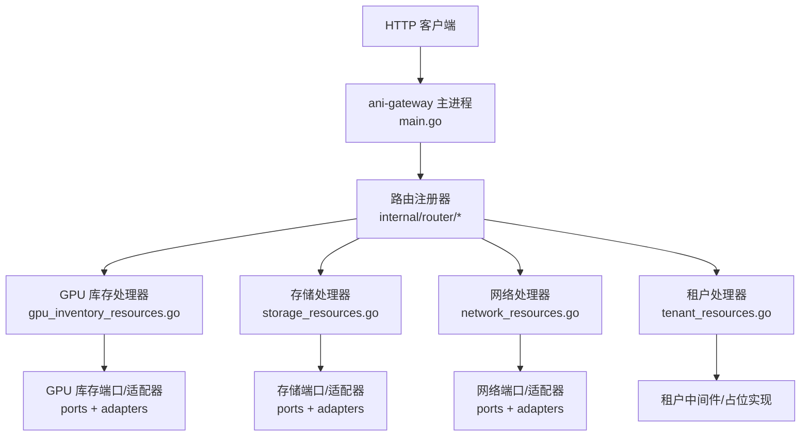
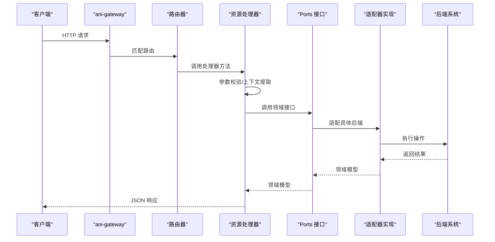
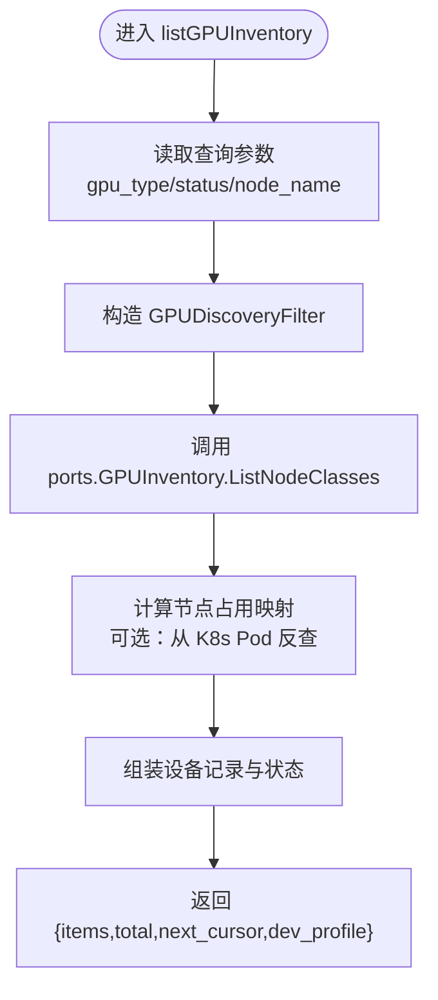
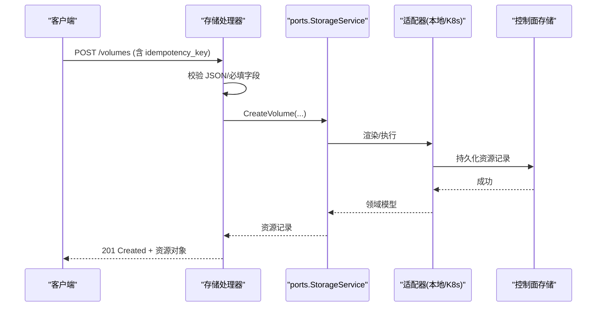
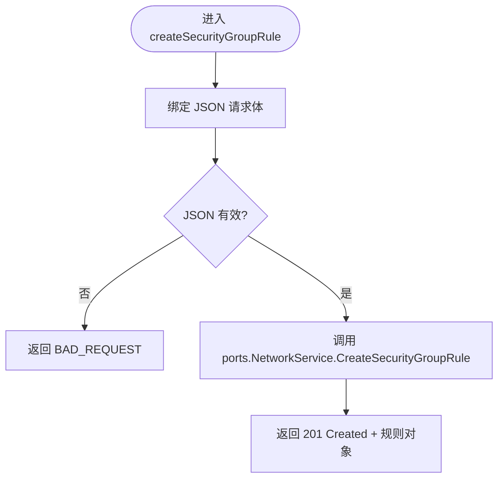
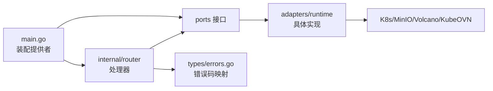

# 资源处理器

<cite>
**本文引用的文件**
- [main.go](file://services/ani-gateway/main.go)
- [gpu_inventory_runtime.go](file://services/ani-gateway/gpu_inventory_runtime.go)
- [storage_runtime.go](file://services/ani-gateway/storage_runtime.go)
- [network_runtime.go](file://services/ani-gateway/network_runtime.go)
- [gpu_inventory_resources.go](file://services/ani-gateway/internal/router/gpu_inventory_resources.go)
- [storage_resources.go](file://services/ani-gateway/internal/router/storage_resources.go)
- [network_resources.go](file://services/ani-gateway/internal/router/network_resources.go)
- [tenant_resources.go](file://services/ani-gateway/internal/router/tenant_resources.go)
- [gpu_inventory.go](file://pkg/ports/gpu_inventory.go)
- [storage_resources.go](file://pkg/ports/storage_resources.go)
- [errors.go](file://pkg/types/errors.go)
</cite>

## 目录
1. [简介](#简介)
2. [项目结构](#项目结构)
3. [核心组件](#核心组件)
4. [架构总览](#架构总览)
5. [详细组件分析](#详细组件分析)
6. [依赖关系分析](#依赖关系分析)
7. [性能考虑](#性能考虑)
8. [故障排查指南](#故障排查指南)
9. [结论](#结论)
10. [附录：API 参考与新增处理器指南](#附录api-参考与新增处理器指南)

## 简介
本文件面向“资源处理器”的完整实现与使用，覆盖 GPU 库存、存储、网络、租户等资源的 RESTful API 设计、请求参数校验、响应格式规范、错误处理策略、状态码定义、异常捕获机制，以及处理器与服务层（ports/adapters）的交互方式与数据流转。文档同时提供如何添加新资源处理器的步骤化指引，帮助开发者快速扩展平台能力。

## 项目结构
ANI Gateway 作为统一入口，负责装配各资源服务运行时配置，注册路由并转发请求到对应处理器。处理器位于 internal/router 下，按资源域拆分；领域接口定义在 pkg/ports；适配器实现位于 pkg/adapters/runtime。

图表来源
- [main.go:187-208](file://services/ani-gateway/main.go#L187-L208)
- [gpu_inventory_resources.go:153-160](file://services/ani-gateway/internal/router/gpu_inventory_resources.go#L153-L160)
- [storage_resources.go:414-465](file://services/ani-gateway/internal/router/storage_resources.go#L414-L465)
- [network_resources.go:246-283](file://services/ani-gateway/internal/router/network_resources.go#L246-L283)
- [tenant_resources.go:12-22](file://services/ani-gateway/internal/router/tenant_resources.go#L12-L22)

章节来源
- [main.go:20-221](file://services/ani-gateway/main.go#L20-L221)

## 核心组件
- GPU 库存：提供节点与设备发现、占用统计、规格列表与可用性查询，支持 Kubernetes 后端或本地模拟。
- 存储：提供卷、文件系统、对象、桶及快照等资源的 CRUD、挂载/卸载、扩缩容、生命周期规则管理。
- 网络：提供 VPC、子网、安全组、负载均衡、路由等资源的管理与概览。
- 租户：成员、角色、SSO、Webhook 等租户级管理能力（当前为占位实现）。

章节来源
- [gpu_inventory_resources.go:153-160](file://services/ani-gateway/internal/router/gpu_inventory_resources.go#L153-L160)
- [storage_resources.go:414-465](file://services/ani-gateway/internal/router/storage_resources.go#L414-L465)
- [network_resources.go:246-283](file://services/ani-gateway/internal/router/network_resources.go#L246-L283)
- [tenant_resources.go:12-22](file://services/ani-gateway/internal/router/tenant_resources.go#L12-L22)

## 架构总览
Gateway 启动时根据环境变量装配各资源服务的运行时提供者（如 Kubernetes REST、MinIO、KubeOVN），将 ports 接口注入到对应处理器。处理器完成参数校验后调用服务层，再将结果序列化为统一的 JSON 响应。

图表来源
- [main.go:187-208](file://services/ani-gateway/main.go#L187-L208)
- [gpu_inventory_resources.go:153-160](file://services/ani-gateway/internal/router/gpu_inventory_resources.go#L153-L160)
- [storage_resources.go:414-465](file://services/ani-gateway/internal/router/storage_resources.go#L414-L465)
- [network_resources.go:246-283](file://services/ani-gateway/internal/router/network_resources.go#L246-L283)

## 详细组件分析

### GPU 库存处理器
- 路由与职责
  - GET /gpu-inventory：列出节点与 GPU 设备，支持 gpu_type、status、node_name 过滤。
  - GET /gpu-inventory/occupancy：汇总可用、占用、故障数量，并按 GPU 类型分桶。
  - GET /gpu-specs：列出可调度规格，支持 gpu_type、available、limit、cursor。
  - GET /gpu-specs/:spec_id：获取指定规格详情。
  - GET /sandbox-templates：列出沙箱模板（用于开发/演示）。
- 请求参数验证
  - available 必须为布尔值，否则返回 BAD_REQUEST。
  - 分页参数 limit/cursor 由通用工具解析。
- 响应格式
  - 列表响应包含 items、total、next_cursor、dev_profile。
  - 设备记录包含 id、node_name、gpu_type、gpu_index、memory_total_mb、driver_version、status、tenant_id、instance_id、dev_profile。
  - 占用统计包含 total、in_use、available、fault、by_gpu_type[]、dev_profile。
- 业务逻辑要点
  - 通过 ports.GPUInventory 获取节点与设备信息。
  - 若存在 k8sClient，则查询 Pod 标签 ani.kubercloud.io/instance 与 spec.nodeName，构建节点级占用映射，回显归属实例。
  - 当节点未就绪或无占用时标记为可用；有占用时标记为 in_use 并回填 tenant_id/instance_id。
- 错误处理
  - 将 ports.ErrNotFound/ErrConflict/ErrInvalid/ErrUnsupported 映射为 404/409/400/400，并返回稳定错误码 NOT_FOUND/CONFLICT/BAD_REQUEST/UNSUPPORTED。

图表来源
- [gpu_inventory_resources.go:193-211](file://services/ani-gateway/internal/router/gpu_inventory_resources.go#L193-L211)
- [gpu_inventory_resources.go:325-357](file://services/ani-gateway/internal/router/gpu_inventory_resources.go#L325-L357)
- [gpu_inventory_resources.go:393-435](file://services/ani-gateway/internal/router/gpu_inventory_resources.go#L393-L435)

章节来源
- [gpu_inventory_resources.go:153-160](file://services/ani-gateway/internal/router/gpu_inventory_resources.go#L153-L160)
- [gpu_inventory_resources.go:162-191](file://services/ani-gateway/internal/router/gpu_inventory_resources.go#L162-L191)
- [gpu_inventory_resources.go:193-211](file://services/ani-gateway/internal/router/gpu_inventory_resources.go#L193-L211)
- [gpu_inventory_resources.go:325-357](file://services/ani-gateway/internal/router/gpu_inventory_resources.go#L325-L357)
- [gpu_inventory_resources.go:393-435](file://services/ani-gateway/internal/router/gpu_inventory_resources.go#L393-L435)
- [gpu_inventory_resources.go:487-500](file://services/ani-gateway/internal/router/gpu_inventory_resources.go#L487-L500)
- [gpu_inventory.go:155-171](file://pkg/ports/gpu_inventory.go#L155-L171)

### 存储处理器
- 路由与职责
  - 卷：/volumes（CRUD）、/volumes/:id/snapshots（快照）、/volumes/:id/expand（扩容）、/volumes/:id/mount|unmount（挂载/卸载）、/volumes/:id/os-init-guide|os-init-complete（OS 初始化）。
  - 文件系统：/filesystems（CRUD）、/filesystems/:id/mount-targets（挂载点）、/filesystems/:id/expand、/filesystems/:id/mount|unmount、/filesystems/:id/mount-command。
  - 对象与桶：/objects（CRUD+上传下载）、/buckets（CRUD）、/buckets/:id/objects（列举/删除/上传/预签名 URL）、/buckets/:id/lifecycle-rules（生命周期规则）。
- 请求参数验证
  - 所有写操作均要求 idempotency_key 字段，确保幂等。
  - JSON 绑定失败返回 BAD_REQUEST。
- 响应格式
  - 资源对象包含 id、tenant_id、state、reason、dev_profile、时间戳等。
  - 列表响应包含 items、total、next_cursor。
- 业务逻辑要点
  - 通过 ports.StorageService 执行领域操作。
  - 部分写操作会写入异步任务（如扩容、挂载/卸载、快照创建），以 Accepted 任务形式返回进度。
- 错误处理
  - 统一通过 writeStorageError 将底层错误转换为标准响应。

图表来源
- [storage_resources.go:467-485](file://services/ani-gateway/internal/router/storage_resources.go#L467-L485)
- [storage_resources.go:518-535](file://services/ani-gateway/internal/router/storage_resources.go#L518-L535)
- [storage_runtime.go:75-157](file://services/ani-gateway/storage_runtime.go#L75-L157)
- [storage_resources.go:487-534](file://services/ani-gateway/internal/router/storage_resources.go#L487-L534)

章节来源
- [storage_resources.go:414-465](file://services/ani-gateway/internal/router/storage_resources.go#L414-L465)
- [storage_resources.go:467-535](file://services/ani-gateway/internal/router/storage_resources.go#L467-L535)
- [storage_resources.go:647-717](file://services/ani-gateway/internal/router/storage_resources.go#L647-L717)
- [storage_resources.go:789-800](file://services/ani-gateway/internal/router/storage_resources.go#L789-L800)
- [storage_runtime.go:75-157](file://services/ani-gateway/storage_runtime.go#L75-L157)
- [storage_resources.go:487-534](file://pkg/ports/storage_resources.go#L487-L534)

### 网络处理器
- 路由与职责
  - 概览：/networks/overview（资源摘要、能力、创建顺序、关系、删除风险）。
  - VPC：/networks/vpcs（CRUD）。
  - 子网：/networks/subnets（CRUD）、/networks/subnets/:id/ip-allocations（IP 分配）。
  - 安全组：/networks/security-groups（CRUD）、规则（CRUD）、绑定（CRUD）。
  - 负载均衡：/networks/load-balancers（CRUD）。
  - 路由：/networks/routes（CRUD）。
- 请求参数验证
  - JSON 绑定失败返回 BAD_REQUEST。
  - 列表接口支持 name/state/vpc_id/scheme 等过滤。
- 响应格式
  - 资源对象包含 id、tenant_id、state、reason、dev_profile、时间戳等。
  - 列表响应包含 items、total、next_cursor。
- 错误处理
  - 统一通过 writeNetworkError 转换错误。

图表来源
- [network_resources.go:495-518](file://services/ani-gateway/internal/router/network_resources.go#L495-L518)

章节来源
- [network_resources.go:246-283](file://services/ani-gateway/internal/router/network_resources.go#L246-L283)
- [network_resources.go:285-292](file://services/ani-gateway/internal/router/network_resources.go#L285-L292)
- [network_resources.go:294-311](file://services/ani-gateway/internal/router/network_resources.go#L294-L311)
- [network_resources.go:348-367](file://services/ani-gateway/internal/router/network_resources.go#L348-L367)
- [network_resources.go:422-440](file://services/ani-gateway/internal/router/network_resources.go#L422-L440)
- [network_resources.go:495-518](file://services/ani-gateway/internal/router/network_resources.go#L495-L518)
- [network_resources.go:622-642](file://services/ani-gateway/internal/router/network_resources.go#L622-L642)
- [network_resources.go:680-700](file://services/ani-gateway/internal/router/network_resources.go#L680-L700)

### 租户处理器
- 路由与职责
  - 成员：/tenant/members（列表/邀请/移除）。
  - 角色：/tenant/roles（列表）。
  - SSO：/tenant/sso（获取/更新）。
  - Webhook：/tenant/webhooks（列表/创建/删除）。
- 说明
  - 当前为占位实现，主要用于预留接口与鉴权上下文（tenant ID 提取）。

章节来源
- [tenant_resources.go:12-22](file://services/ani-gateway/internal/router/tenant_resources.go#L12-L22)
- [tenant_resources.go:24-76](file://services/ani-gateway/internal/router/tenant_resources.go#L24-L76)

## 依赖关系分析
- 运行时装配
  - main.go 根据环境变量选择 GPU/存储/网络的提供者模式（local/kubernetes_rest/kubeovn_rest/minio 等），并注入到处理器。
- 端口与适配器
  - ports 定义领域接口（如 GPUInventory、StorageService、NetworkService）。
  - adapters/runtime 提供具体实现（本地、Kubernetes、Volcano、KubeOVN、MinIO 等）。
- 错误体系
  - types/errors.go 定义统一错误码与 HTTP 状态映射，处理器据此返回一致的错误响应。

图表来源
- [main.go:46-104](file://services/ani-gateway/main.go#L46-L104)
- [gpu_inventory_runtime.go:43-66](file://services/ani-gateway/gpu_inventory_runtime.go#L43-L66)
- [storage_runtime.go:75-157](file://services/ani-gateway/storage_runtime.go#L75-L157)
- [network_runtime.go:47-87](file://services/ani-gateway/network_runtime.go#L47-L87)
- [errors.go:51-67](file://pkg/types/errors.go#L51-L67)

章节来源
- [main.go:46-104](file://services/ani-gateway/main.go#L46-L104)
- [gpu_inventory_runtime.go:43-66](file://services/ani-gateway/gpu_inventory_runtime.go#L43-L66)
- [storage_runtime.go:75-157](file://services/ani-gateway/storage_runtime.go#L75-L157)
- [network_runtime.go:47-87](file://services/ani-gateway/network_runtime.go#L47-L87)
- [errors.go:51-67](file://pkg/types/errors.go#L51-L67)

## 性能考虑
- 批量查询与分页：列表接口普遍支持 limit/cursor，避免一次性拉取大量数据。
- 缓存与复用：Kubernetes REST 客户端与对象存储客户端可复用连接与超时配置，减少握手开销。
- 异步任务：对耗时操作（如扩容、挂载/卸载、快照）采用任务队列，降低请求阻塞。
- 只读路径优化：GPU 占用统计可通过直接查询 K8s Pod 标签减少数据库依赖。

[本节为通用指导，不直接分析具体文件]

## 故障排查指南
- 常见错误码
  - NOT_FOUND：资源不存在（404）。
  - CONFLICT：资源已存在（409）。
  - BAD_REQUEST：请求参数无效（400）。
  - UNSUPPORTED：不支持的提供者模式（400）。
  - UNAUTHORIZED/FORBIDDEN：鉴权失败（401/403）。
  - INTERNAL_ERROR：内部错误（500）。
- 定位建议
  - 检查请求体是否包含必填字段与正确类型（如 idempotency_key、布尔值）。
  - 确认环境变量是否正确设置（如 STORAGE_PROVIDER、NETWORK_PROVIDER、GPU_INVENTORY_PROVIDER）。
  - 查看 dev_profile 字段了解当前运行模式与提供者。
  - 对于 GPU 库存，确认节点就绪状态与 Pod 标签 ani.kubercloud.io/instance 是否存在。

章节来源
- [errors.go:21-49](file://pkg/types/errors.go#L21-L49)
- [errors.go:51-67](file://pkg/types/errors.go#L51-L67)
- [gpu_inventory_resources.go:487-500](file://services/ani-gateway/internal/router/gpu_inventory_resources.go#L487-L500)

## 结论
ANI Gateway 通过清晰的端口/适配器分层与统一的错误体系，实现了 GPU、存储、网络、租户等资源的标准化 REST 暴露。处理器专注于参数校验、上下文提取与响应序列化，服务层封装领域逻辑，适配器对接具体后端。该架构便于扩展新资源处理器，并保持行为一致性与可维护性。

[本节为总结，不直接分析具体文件]

## 附录：API 参考与新增处理器指南

### API 端点总览
- GPU 库存
  - GET /gpu-inventory：列表（支持 gpu_type、status、node_name）
  - GET /gpu-inventory/occupancy：占用统计
  - GET /gpu-specs：规格列表（支持 gpu_type、available、limit、cursor）
  - GET /gpu-specs/:spec_id：规格详情
  - GET /sandbox-templates：模板列表
- 存储
  - 卷：/volumes（CRUD）、/volumes/:id/snapshots、/volumes/:id/expand、/volumes/:id/mount|unmount、/volumes/:id/os-init-guide|os-init-complete
  - 文件系统：/filesystems（CRUD）、/filesystems/:id/mount-targets、/filesystems/:id/expand、/filesystems/:id/mount|unmount、/filesystems/:id/mount-command
  - 对象与桶：/objects（CRUD+上传下载）、/buckets（CRUD）、/buckets/:id/objects、/buckets/:id/prefixes、/buckets/:id/objects/presigned-url、/buckets/:id/acl、/buckets/:id/storage-class、/buckets/:id/lifecycle-rules
- 网络
  - /networks/overview
  - /networks/vpcs（CRUD）
  - /networks/subnets（CRUD）、/networks/subnets/:id/ip-allocations
  - /networks/security-groups（CRUD）、规则（CRUD）、绑定（CRUD）
  - /networks/load-balancers（CRUD）
  - /networks/routes（CRUD）
- 租户
  - /tenant/members（列表/邀请/移除）
  - /tenant/roles（列表）
  - /tenant/sso（获取/更新）
  - /tenant/webhooks（列表/创建/删除）

章节来源
- [gpu_inventory_resources.go:153-160](file://services/ani-gateway/internal/router/gpu_inventory_resources.go#L153-L160)
- [storage_resources.go:414-465](file://services/ani-gateway/internal/router/storage_resources.go#L414-L465)
- [network_resources.go:246-283](file://services/ani-gateway/internal/router/network_resources.go#L246-L283)
- [tenant_resources.go:12-22](file://services/ani-gateway/internal/router/tenant_resources.go#L12-L22)

### 请求/响应规范
- 通用列表响应
  - { items: [], total: number, next_cursor?: string }
- 通用资源对象
  - 包含 id、tenant_id、state、reason、dev_profile、时间戳等
- 幂等键
  - 写操作需携带 idempotency_key，保证重复提交安全
- 错误响应
  - { code: string, message: string }，HTTP 状态码依据错误类型映射

章节来源
- [storage_resources.go:183-208](file://services/ani-gateway/internal/router/storage_resources.go#L183-L208)
- [storage_resources.go:235-253](file://services/ani-gateway/internal/router/storage_resources.go#L235-L253)
- [storage_resources.go:273-285](file://services/ani-gateway/internal/router/storage_resources.go#L273-L285)
- [storage_resources.go:308-324](file://services/ani-gateway/internal/router/storage_resources.go#L308-L324)
- [errors.go:21-49](file://pkg/types/errors.go#L21-L49)

### 新增资源处理器步骤
- 定义端口接口
  - 在 pkg/ports 中新增接口与数据结构（参考 storage_resources.go、gpu_inventory.go、network_resources.go）。
- 实现适配器
  - 在 pkg/adapters/runtime 中实现具体后端适配（本地/K8s/第三方）。
- 编写处理器
  - 在 services/ani-gateway/internal/router 下新建资源处理器文件，注册路由并实现方法。
  - 遵循参数校验、错误映射、响应序列化规范。
- 装配运行时
  - 在 services/ani-gateway 下的 *_runtime.go 中根据环境变量装配提供者。
  - 在 main.go 中将服务注入到路由注册器。
- 测试与验证
  - 编写单元测试与集成测试，覆盖正常路径与错误路径。
  - 使用 OpenAPI 契约校验与冒烟脚本验证端点。

章节来源
- [main.go:187-208](file://services/ani-gateway/main.go#L187-L208)
- [gpu_inventory_runtime.go:43-66](file://services/ani-gateway/gpu_inventory_runtime.go#L43-L66)
- [storage_runtime.go:75-157](file://services/ani-gateway/storage_runtime.go#L75-L157)
- [network_runtime.go:47-87](file://services/ani-gateway/network_runtime.go#L47-L87)
- [storage_resources.go:414-465](file://services/ani-gateway/internal/router/storage_resources.go#L414-L465)
- [network_resources.go:246-283](file://services/ani-gateway/internal/router/network_resources.go#L246-L283)
- [gpu_inventory_resources.go:153-160](file://services/ani-gateway/internal/router/gpu_inventory_resources.go#L153-L160)