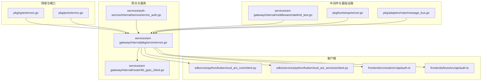
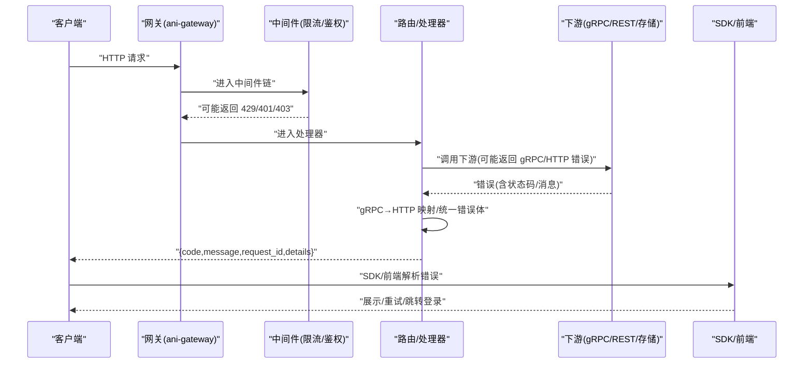
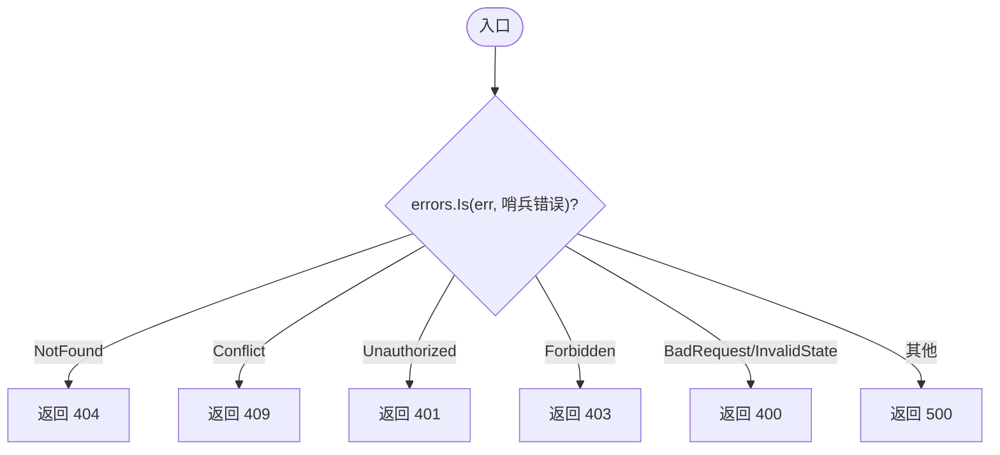
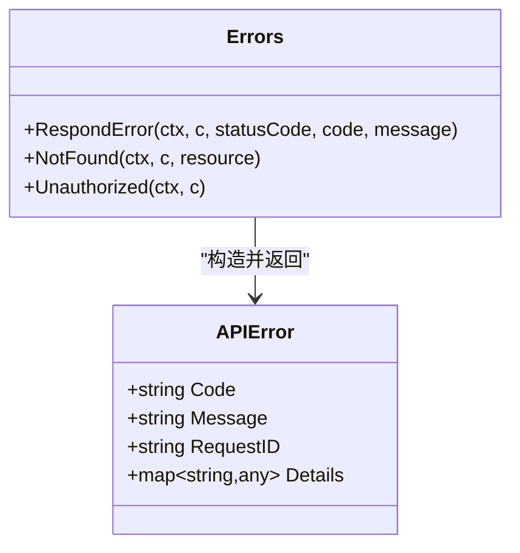
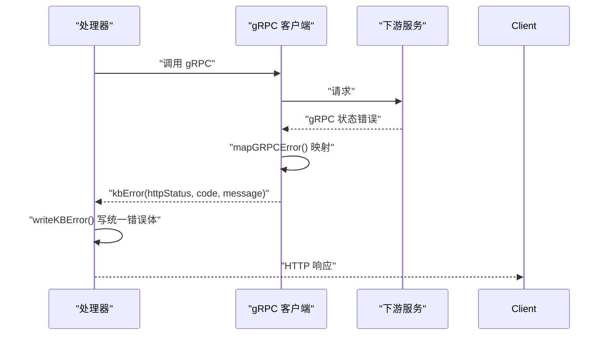
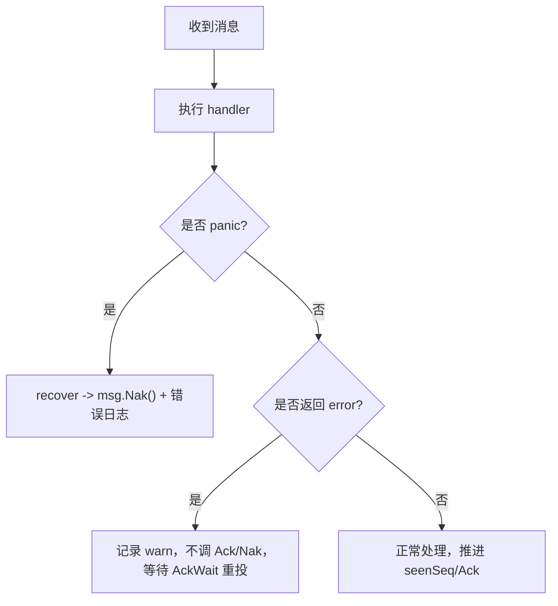
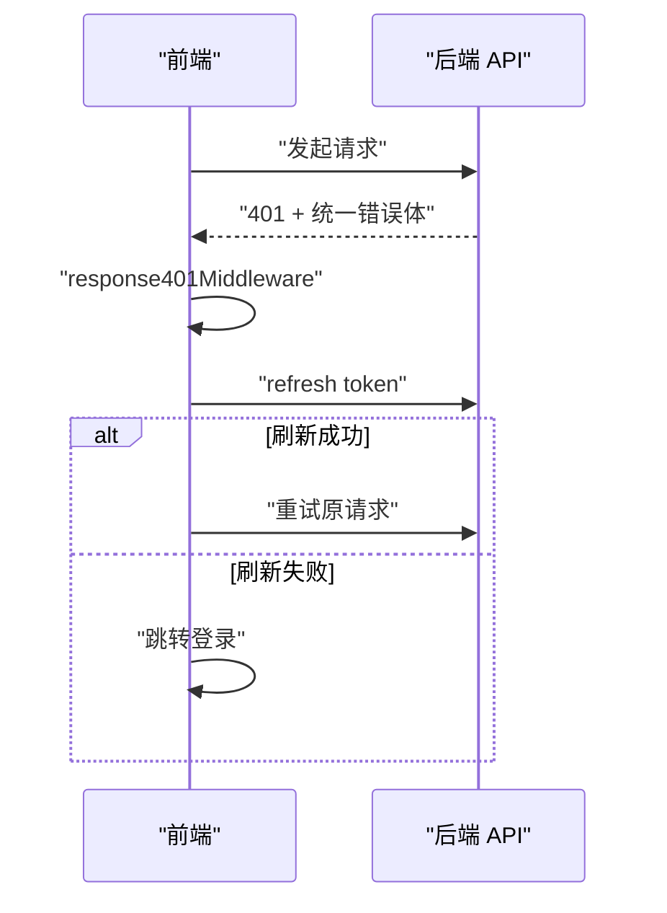
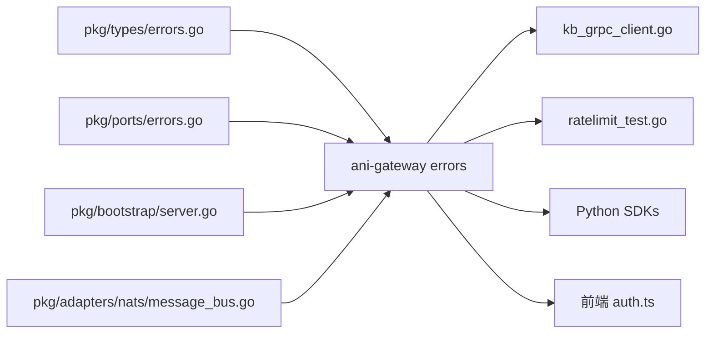

# 错误处理机制

<cite>
**本文引用的文件**
- [pkg/types/errors.go](file://repo/pkg/types/errors.go)
- [pkg/ports/errors.go](file://repo/pkg/ports/errors.go)
- [services/ani-gateway/internal/pkg/errors/errors.go](file://repo/services/ani-gateway/internal/pkg/errors/errors.go)
- [services/auth-service/internal/service/errors_auth.go](file://repo/services/auth-service/internal/service/errors_auth.go)
- [services/ani-gateway/internal/router/kb_grpc_client.go](file://repo/services/ani-gateway/internal/router/kb_grpc_client.go)
- [services/ani-gateway/internal/middleware/ratelimit_test.go](file://repo/services/ani-gateway/internal/middleware/ratelimit_test.go)
- [pkg/bootstrap/server.go](file://repo/pkg/bootstrap/server.go)
- [pkg/adapters/nats/message_bus.go](file://repo/pkg/adapters/nats/message_bus.go)
- [sdks/core/python/kubercloud_ani_core/client.py](file://repo/sdks/core/python/kubercloud_ani_core/client.py)
- [sdks/services/python/kubercloud_ani_services/client.py](file://repo/sdks/services/python/kubercloud_ani_services/client.py)
- [frontends/console/src/api/auth.ts](file://repo/frontends/console/src/api/auth.ts)
- [frontends/boss/src/api/auth.ts](file://repo/frontends/boss/src/api/auth.ts)
</cite>

## 目录
1. [简介](#简介)
2. [项目结构](#项目结构)
3. [核心组件](#核心组件)
4. [架构总览](#架构总览)
5. [详细组件分析](#详细组件分析)
6. [依赖关系分析](#依赖关系分析)
7. [性能考虑](#性能考虑)
8. [故障排查指南](#故障排查指南)
9. [结论](#结论)
10. [附录](#附录)

## 简介
本文件系统化梳理 ANI 平台的统一错误处理机制，覆盖错误类型定义、错误码规范、消息格式化、全局错误处理器、中间件捕获、业务异常策略、日志与监控指标、错误追踪集成，以及客户端响应格式与调试方法。目标是让开发者在网关、服务、适配器与前端中一致地表达、传递和处理错误。

## 项目结构
错误处理贯穿“领域层 → 端口层 → 网关/服务 → 中间件 → 客户端 SDK/前端”的完整链路：
- 领域层：统一的领域错误与 HTTP 状态映射（pkg/types）
- 端口层：能力适配器的通用错误（pkg/ports）
- 网关/服务：统一 API 错误体与 gRPC→HTTP 错误映射（services/ani-gateway, services/auth-service）
- 中间件：限流等拦截器返回标准错误（services/ani-gateway/internal/middleware）
- 基础设施：gRPC 恢复拦截器、NATS 消息处理的 panic 恢复（pkg/bootstrap, pkg/adapters/nats）
- 客户端：SDK 与前端对统一错误体的解析与展示（sdks/*, frontends/*）

**图表来源**
- [pkg/types/errors.go:1-74](file://repo/pkg/types/errors.go#L1-L74)
- [pkg/ports/errors.go:1-25](file://repo/pkg/ports/errors.go#L1-L25)
- [services/ani-gateway/internal/pkg/errors/errors.go:1-51](file://repo/services/ani-gateway/internal/pkg/errors/errors.go#L1-L51)
- [services/ani-gateway/internal/router/kb_grpc_client.go:237-308](file://repo/services/ani-gateway/internal/router/kb_grpc_client.go#L237-L308)
- [services/auth-service/internal/service/errors_auth.go:1-71](file://repo/services/auth-service/internal/service/errors_auth.go#L1-L71)
- [services/ani-gateway/internal/middleware/ratelimit_test.go:15-53](file://repo/services/ani-gateway/internal/middleware/ratelimit_test.go#L15-L53)
- [pkg/bootstrap/server.go:562-563](file://repo/pkg/bootstrap/server.go#L562-L563)
- [pkg/adapters/nats/message_bus.go:80-90](file://repo/pkg/adapters/nats/message_bus.go#L80-L90)
- [sdks/core/python/kubercloud_ani_core/client.py:854-866](file://repo/sdks/core/python/kubercloud_ani_core/client.py#L854-L866)
- [sdks/services/python/kubercloud_ani_services/client.py:338-376](file://repo/sdks/services/python/kubercloud_ani_services/client.py#L338-L376)
- [frontends/console/src/api/auth.ts:47-91](file://repo/frontends/console/src/api/auth.ts#L47-L91)
- [frontends/boss/src/api/auth.ts:46-83](file://repo/frontends/boss/src/api/auth.ts#L46-L83)

**章节来源**
- [pkg/types/errors.go:1-74](file://repo/pkg/types/errors.go#L1-L74)
- [pkg/ports/errors.go:1-25](file://repo/pkg/ports/errors.go#L1-L25)
- [services/ani-gateway/internal/pkg/errors/errors.go:1-51](file://repo/services/ani-gateway/internal/pkg/errors/errors.go#L1-L51)

## 核心组件
- 领域错误与 HTTP 映射：提供哨兵错误、稳定错误码常量、HTTP 状态映射与上下文包装工具，确保上层以语义化错误表达问题。
- 端口错误：为各能力适配器定义一致的失败语义（未配置、不支持、冲突、无效、前置条件失败、负载过大、凭证无效、租户不存在、不可用、配额相关）。
- 网关统一错误体：所有 API 错误统一为 {code, message, request_id, details} 结构，并提供便捷响应函数。
- gRPC→HTTP 错误映射：将 gRPC 状态码转换为 HTTP 状态与统一错误码，保证跨语言一致性。
- 认证服务错误：将认证域错误映射到 gRPC 状态码，供网关或调用方消费。
- 中间件错误：如限流中间件返回 429 并附带 RATE_LIMIT_EXCEEDED。
- 全局恢复：gRPC 服务器拦截器捕获 panic 转为 Internal；NATS 消费者在 panic 时 Nak 并记录日志，避免崩溃与消息丢失。
- 客户端 SDK/前端：SDK 封装 APIError 与错误码枚举；前端 401 自动刷新令牌并重试，失败则跳转登录。

**章节来源**
- [pkg/types/errors.go:9-74](file://repo/pkg/types/errors.go#L9-L74)
- [pkg/ports/errors.go:5-24](file://repo/pkg/ports/errors.go#L5-L24)
- [services/ani-gateway/internal/pkg/errors/errors.go:12-51](file://repo/services/ani-gateway/internal/pkg/errors/errors.go#L12-L51)
- [services/ani-gateway/internal/router/kb_grpc_client.go:237-308](file://repo/services/ani-gateway/internal/router/kb_grpc_client.go#L237-L308)
- [services/auth-service/internal/service/errors_auth.go:8-71](file://repo/services/auth-service/internal/service/errors_auth.go#L8-L71)
- [services/ani-gateway/internal/middleware/ratelimit_test.go:15-53](file://repo/services/ani-gateway/internal/middleware/ratelimit_test.go#L15-L53)
- [pkg/bootstrap/server.go:562-563](file://repo/pkg/bootstrap/server.go#L562-L563)
- [pkg/adapters/nats/message_bus.go:80-90](file://repo/pkg/adapters/nats/message_bus.go#L80-L90)
- [sdks/core/python/kubercloud_ani_core/client.py:854-866](file://repo/sdks/core/python/kubercloud_ani_core/client.py#L854-L866)
- [sdks/services/python/kubercloud_ani_services/client.py:338-376](file://repo/sdks/services/python/kubercloud_ani_services/client.py#L338-L376)
- [frontends/console/src/api/auth.ts:47-91](file://repo/frontends/console/src/api/auth.ts#L47-L91)
- [frontends/boss/src/api/auth.ts:46-83](file://repo/frontends/boss/src/api/auth.ts#L46-L83)

## 架构总览
下图展示了请求从网关进入，经过中间件、路由、下游服务/适配器，最终通过统一错误体返回给客户端的完整路径，以及关键错误转换点。

**图表来源**
- [services/ani-gateway/internal/pkg/errors/errors.go:32-51](file://repo/services/ani-gateway/internal/pkg/errors/errors.go#L32-L51)
- [services/ani-gateway/internal/router/kb_grpc_client.go:237-308](file://repo/services/ani-gateway/internal/router/kb_grpc_client.go#L237-L308)
- [services/ani-gateway/internal/middleware/ratelimit_test.go:15-53](file://repo/services/ani-gateway/internal/middleware/ratelimit_test.go#L15-L53)
- [sdks/core/python/kubercloud_ani_core/client.py:854-866](file://repo/sdks/core/python/kubercloud_ani_core/client.py#L854-L866)
- [frontends/console/src/api/auth.ts:47-91](file://repo/frontends/console/src/api/auth.ts#L47-L91)

## 详细组件分析

### 领域错误与 HTTP 映射（pkg/types）
- 哨兵错误：NotFound、Conflict、Unauthorized、Forbidden、BadRequest、InvalidState、LeaseTaken、DeadLetter。使用 errors.Is 判断，禁止直接 == 比较。
- 统一错误体 ANIError：包含稳定 code、用户可见 message、仅服务端记录的 cause，支持 Unwrap。
- 错误码常量：NOT_FOUND、CONFLICT、UNAUTHORIZED、FORBIDDEN、BAD_REQUEST、RATE_LIMIT_EXCEEDED、INVALID_STATE、INTERNAL_ERROR、NOT_IMPLEMENTED。
- HTTP 状态映射：根据哨兵错误返回对应 4xx/5xx。
- 上下文包装：Wrapf 保留哨兵类型并附加上下文，便于日志定位。

**图表来源**
- [pkg/types/errors.go:9-67](file://repo/pkg/types/errors.go#L9-L67)

**章节来源**
- [pkg/types/errors.go:9-74](file://repo/pkg/types/errors.go#L9-L74)

### 端口错误（pkg/ports）
- 为各能力适配器定义一致的错误语义：未配置、不支持、资源不存在、冲突、请求无效、前置条件失败、负载过大、凭证无效、租户不存在、依赖不可用、配额相关错误。
- 业务层通过返回这些哨兵错误，由网关或服务层统一映射为 HTTP/gRPC 错误。

**章节来源**
- [pkg/ports/errors.go:5-24](file://repo/pkg/ports/errors.go#L5-L24)

### 网关统一错误体与响应（ani-gateway/internal/pkg/errors）
- 统一错误体：{code, message, request_id, details}，request_id 来自请求上下文，便于全链路追踪。
- 预置错误码：NOT_FOUND、UNAUTHORIZED、FORBIDDEN、BAD_REQUEST、CONFLICT、INTERNAL_ERROR、RATE_LIMIT_EXCEEDED、MODEL_NOT_READY。
- 响应函数：RespondError 输出 JSON 并中止后续处理；提供 NotFound、Unauthorized 快捷方法。

**图表来源**
- [services/ani-gateway/internal/pkg/errors/errors.go:12-51](file://repo/services/ani-gateway/internal/pkg/errors/errors.go#L12-L51)

**章节来源**
- [services/ani-gateway/internal/pkg/errors/errors.go:1-51](file://repo/services/ani-gateway/internal/pkg/errors/errors.go#L1-L51)

### gRPC→HTTP 错误映射（kb_grpc_client）
- 将 gRPC 状态码映射为 HTTP 状态与统一错误码：
  - NotFound→404/NOT_FOUND
  - InvalidArgument→400/BAD_REQUEST
  - Unimplemented→501/NOT_IMPLEMENTED
  - FailedPrecondition→409/CONFLICT
  - PermissionDenied→403/FORBIDDEN
  - Unauthenticated→401/UNAUTHORIZED
  - Unavailable→503/UNAVAILABLE
  - DeadlineExceeded→504/DEADLINE_EXCEEDED
  - 未知码→500，避免掩盖服务端故障
- writeKBError/writeInstanceError 将 kbError 写入统一错误体。

**图表来源**
- [services/ani-gateway/internal/router/kb_grpc_client.go:237-308](file://repo/services/ani-gateway/internal/router/kb_grpc_client.go#L237-L308)

**章节来源**
- [services/ani-gateway/internal/router/kb_grpc_client.go:237-308](file://repo/services/ani-gateway/internal/router/kb_grpc_client.go#L237-L308)

### 认证服务错误（auth-service）
- 定义认证域错误码：INVALID_CREDENTIALS、TENANT_NOT_FOUND。
- 将认证错误转换为 gRPC 状态码：Unauthenticated、NotFound、InvalidArgument。
- 提供 asAuthError/statusFromAuthError 辅助判断与转换。

**章节来源**
- [services/auth-service/internal/service/errors_auth.go:8-71](file://repo/services/auth-service/internal/service/errors_auth.go#L8-L71)

### 中间件错误（限流）
- 超过配额时返回 429，并在响应体中包含 RATE_LIMIT_EXCEEDED。
- 测试验证了窗口过期后恢复正常。

**章节来源**
- [services/ani-gateway/internal/middleware/ratelimit_test.go:15-53](file://repo/services/ani-gateway/internal/middleware/ratelimit_test.go#L15-L53)

### 全局恢复与消息可靠性
- gRPC 服务器拦截器：捕获 panic 并转换为 Internal 错误，避免进程崩溃。
- NATS 消费者：handler panic 时 recover 并调用 Nak，记录错误日志；若 handler 返回 error，adapter 仅记录 warn，交由 NATS AckWait 超时重投，不丢消息。

**图表来源**
- [pkg/bootstrap/server.go:562-563](file://repo/pkg/bootstrap/server.go#L562-L563)
- [pkg/adapters/nats/message_bus.go:80-90](file://repo/pkg/adapters/nats/message_bus.go#L80-L90)

**章节来源**
- [pkg/bootstrap/server.go:562-563](file://repo/pkg/bootstrap/server.go#L562-L563)
- [pkg/adapters/nats/message_bus.go:80-90](file://repo/pkg/adapters/nats/message_bus.go#L80-L90)

### 客户端错误处理（SDK/前端）
- Python SDK：APIError 包含 code、message、request_id、details；提供 to_dict 序列化；ERROR_CODES 列表用于校验。
- 前端：401 时先尝试刷新 token，成功则重试，失败则跳转登录；错误信息可显示 request_id 辅助定位。

**图表来源**
- [frontends/console/src/api/auth.ts:47-91](file://repo/frontends/console/src/api/auth.ts#L47-L91)
- [frontends/boss/src/api/auth.ts:46-83](file://repo/frontends/boss/src/api/auth.ts#L46-L83)
- [sdks/core/python/kubercloud_ani_core/client.py:854-866](file://repo/sdks/core/python/kubercloud_ani_core/client.py#L854-L866)
- [sdks/services/python/kubercloud_ani_services/client.py:338-376](file://repo/sdks/services/python/kubercloud_ani_services/client.py#L338-L376)

**章节来源**
- [frontends/console/src/api/auth.ts:47-91](file://repo/frontends/console/src/api/auth.ts#L47-L91)
- [frontends/boss/src/api/auth.ts:46-83](file://repo/frontends/boss/src/api/auth.ts#L46-L83)
- [sdks/core/python/kubercloud_ani_core/client.py:854-866](file://repo/sdks/core/python/kubercloud_ani_core/client.py#L854-L866)
- [sdks/services/python/kubercloud_ani_services/client.py:338-376](file://repo/sdks/services/python/kubercloud_ani_services/client.py#L338-L376)

## 依赖关系分析
- 低耦合：领域错误与端口错误被网关和服务复用，避免在各处重复定义。
- 明确边界：网关负责 HTTP 错误体与 gRPC→HTTP 映射；服务内部保持 gRPC 错误语义；适配器通过端口错误向上抛出。
- 可观测性：统一错误体携带 request_id，结合 gRPC 恢复与 NATS 恢复，形成端到端追踪。

**图表来源**
- [pkg/types/errors.go:9-74](file://repo/pkg/types/errors.go#L9-L74)
- [pkg/ports/errors.go:5-24](file://repo/pkg/ports/errors.go#L5-L24)
- [services/ani-gateway/internal/pkg/errors/errors.go:12-51](file://repo/services/ani-gateway/internal/pkg/errors/errors.go#L12-L51)
- [services/ani-gateway/internal/router/kb_grpc_client.go:237-308](file://repo/services/ani-gateway/internal/router/kb_grpc_client.go#L237-L308)
- [services/ani-gateway/internal/middleware/ratelimit_test.go:15-53](file://repo/services/ani-gateway/internal/middleware/ratelimit_test.go#L15-L53)
- [pkg/bootstrap/server.go:562-563](file://repo/pkg/bootstrap/server.go#L562-L563)
- [pkg/adapters/nats/message_bus.go:80-90](file://repo/pkg/adapters/nats/message_bus.go#L80-L90)
- [sdks/core/python/kubercloud_ani_core/client.py:854-866](file://repo/sdks/core/python/kubercloud_ani_core/client.py#L854-L866)
- [frontends/console/src/api/auth.ts:47-91](file://repo/frontends/console/src/api/auth.ts#L47-L91)

**章节来源**
- [services/ani-gateway/internal/pkg/errors/errors.go:12-51](file://repo/services/ani-gateway/internal/pkg/errors/errors.go#L12-L51)
- [services/ani-gateway/internal/router/kb_grpc_client.go:237-308](file://repo/services/ani-gateway/internal/router/kb_grpc_client.go#L237-L308)

## 性能考虑
- 错误映射应轻量：gRPC→HTTP 映射为 O(1) 分支，避免额外 I/O。
- 日志级别合理：业务错误使用 warn/info，系统错误使用 error；避免在高频路径打印堆栈。
- 恢复开销最小化：panic 恢复仅在极端情况下触发；NACK 重投需配合合理的 AckWait/MaxDeliver。
- 限流与缓存：在高并发场景下，限流可减少下游压力，降低错误率。

[本节为通用指导，无需特定文件引用]

## 故障排查指南
- 快速定位：查看响应体中的 request_id，结合服务端日志按 request_id 检索全链路日志。
- 常见错误码：
  - NOT_FOUND：检查资源是否存在、路径参数是否正确。
  - UNAUTHORIZED/FORBIDDEN：检查认证头、权限范围。
  - BAD_REQUEST：检查入参校验规则。
  - CONFLICT：检查幂等键、状态机约束。
  - UNAVAILABLE：检查下游服务健康与网络连通性。
  - RATE_LIMIT_EXCEEDED：调整限流阈值或客户端退避。
- 前端 401 流程：确认 refresh token 逻辑是否生效；若失败，引导用户重新登录。
- NATS 消息重投：若 handler 返回 error，确认 AckWait 配置；若 panic，确认 recover 已调用 Nak。

**章节来源**
- [services/ani-gateway/internal/pkg/errors/errors.go:32-51](file://repo/services/ani-gateway/internal/pkg/errors/errors.go#L32-L51)
- [services/ani-gateway/internal/router/kb_grpc_client.go:237-308](file://repo/services/ani-gateway/internal/router/kb_grpc_client.go#L237-L308)
- [services/ani-gateway/internal/middleware/ratelimit_test.go:15-53](file://repo/services/ani-gateway/internal/middleware/ratelimit_test.go#L15-L53)
- [pkg/adapters/nats/message_bus.go:80-90](file://repo/pkg/adapters/nats/message_bus.go#L80-L90)
- [frontends/console/src/api/auth.ts:47-91](file://repo/frontends/console/src/api/auth.ts#L47-L91)

## 结论
ANI 平台通过“领域错误 → 端口错误 → 网关统一错误体 → 客户端 SDK/前端”的分层设计，实现了错误语义清晰、传输格式统一、可观测性强、容错可靠的错误处理机制。建议在新增功能时遵循以下原则：
- 使用领域哨兵错误表达业务失败，并通过 HTTPStatusForError 映射状态码。
- 网关内统一使用 APIError 输出错误体，携带 request_id。
- 下游 gRPC 错误经 mapGRPCError 转换为 HTTP 错误。
- 中间件与基础设施提供兜底保护（限流、panic 恢复、NATS NACK）。
- 客户端 SDK/前端解析统一错误体，提供友好提示与重试/跳转逻辑。

[本节为总结，无需特定文件引用]

## 附录
- 统一错误体字段说明：
  - code：稳定的错误码，客户端可据此做差异化处理。
  - message：面向用户的可读消息。
  - request_id：请求唯一标识，用于日志关联。
  - details：可选的扩展信息，便于调试。
- 推荐实践：
  - 在入口处注入 request_id，贯穿整个请求生命周期。
  - 对外只暴露安全消息，敏感细节仅记录在服务端日志。
  - 对幂等操作使用 idempotency_key，避免重复副作用。
  - 对下游不可用采用退避与熔断策略，减少雪崩风险。

[本节为补充说明，无需特定文件引用]