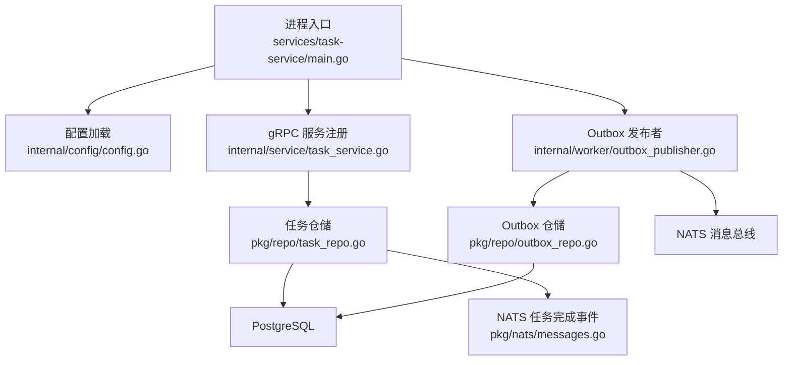
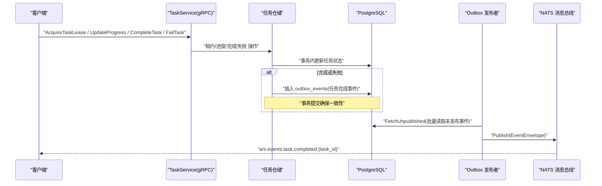
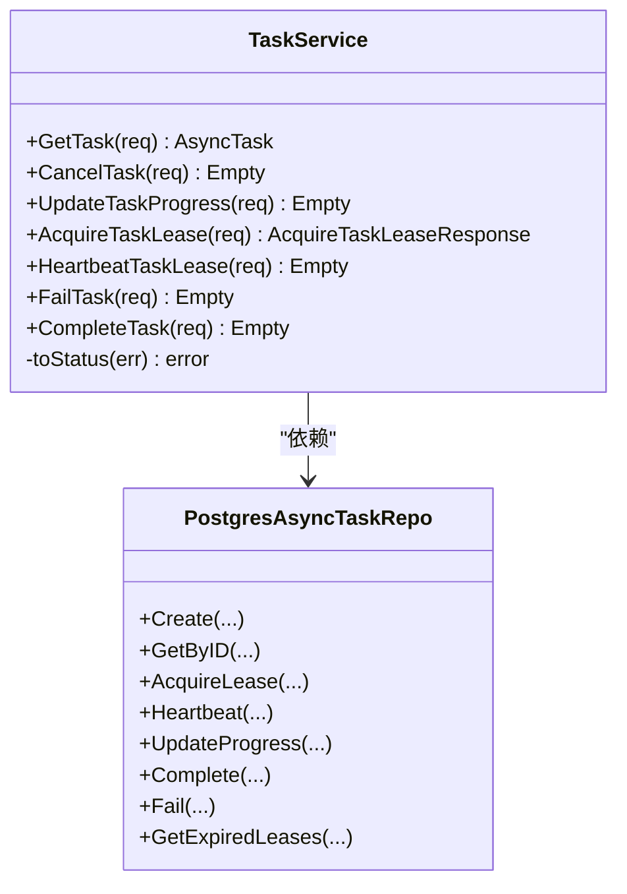
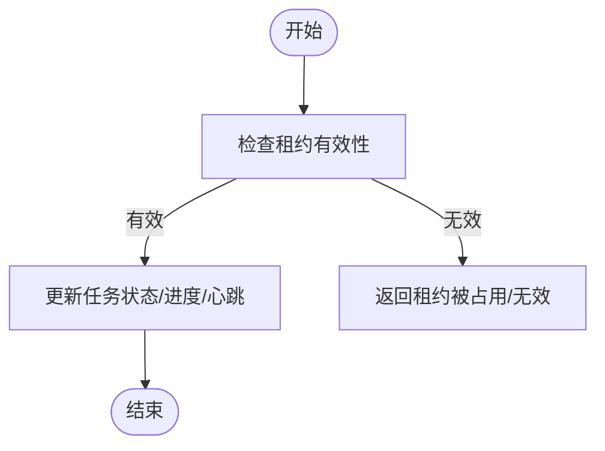
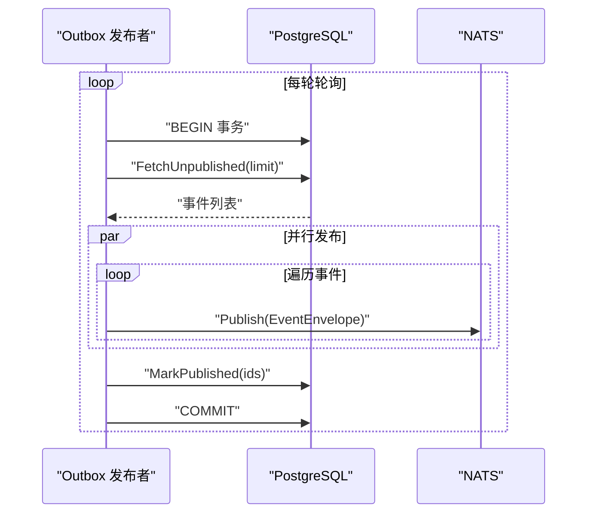
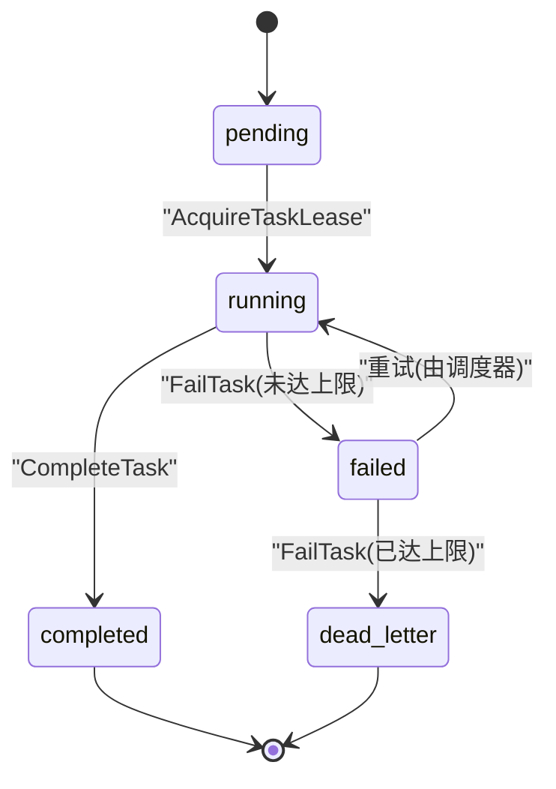
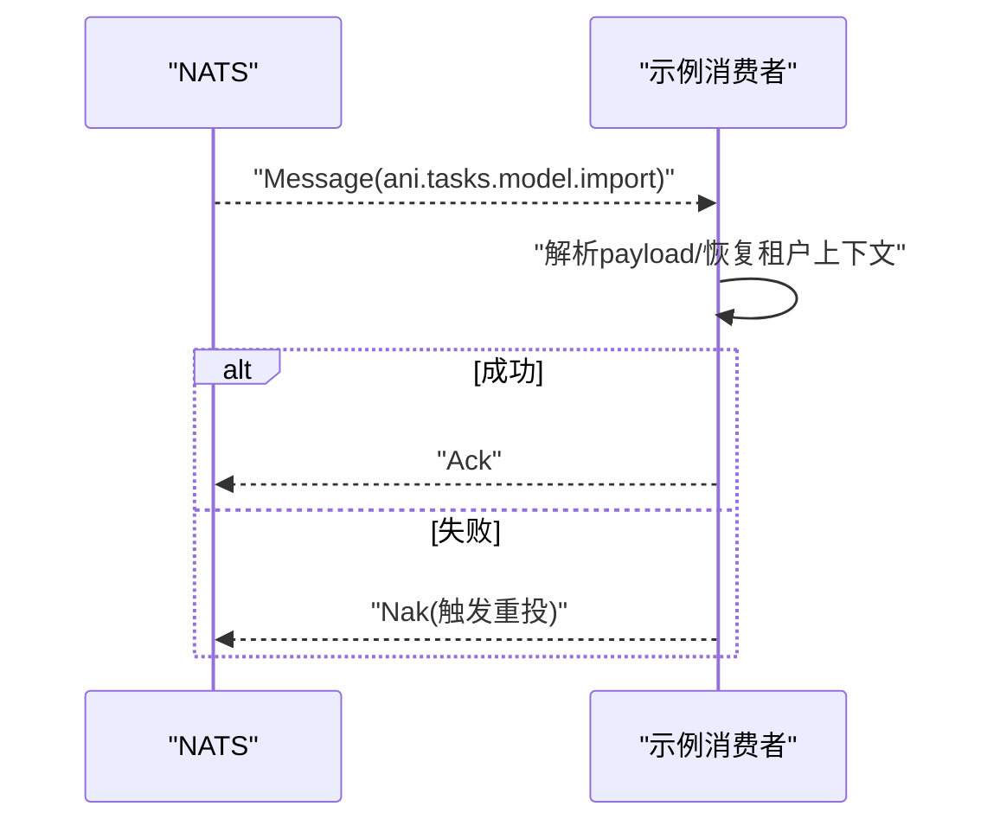
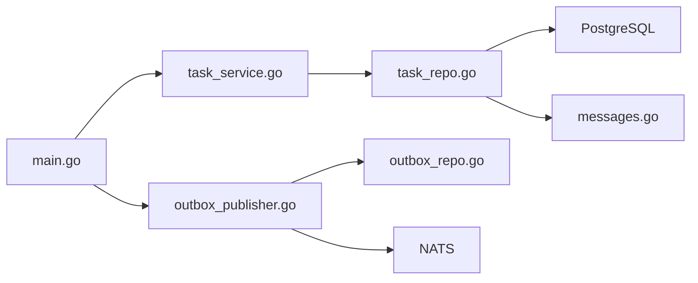

# 任务服务

<cite>
**本文引用的文件**
- [main.go](file://repo/services/task-service/main.go)
- [task_service.proto](file://repo/api/proto/task/v1/task_service.proto)
- [task_service.go](file://repo/services/task-service/internal/service/task_service.go)
- [outbox_publisher.go](file://repo/services/task-service/internal/worker/outbox_publisher.go)
- [config.go](file://repo/services/task-service/internal/config/config.go)
- [task_repo.go](file://repo/pkg/repo/task_repo.go)
- [outbox_repo.go](file://repo/pkg/repo/outbox_repo.go)
- [messages.go](file://repo/pkg/nats/messages.go)
- [consumer.go](file://repo/services/task-service/internal/taskconsumer/consumer.go)
</cite>

## 目录
1. [简介](#简介)
2. [项目结构](#项目结构)
3. [核心组件](#核心组件)
4. [架构总览](#架构总览)
5. [详细组件分析](#详细组件分析)
6. [依赖关系分析](#依赖关系分析)
7. [性能与并发](#性能与并发)
8. [故障排查指南](#故障排查指南)
9. [结论](#结论)
10. [附录：任务处理器开发指南与最佳实践](#附录：任务处理器开发指南与最佳实践)

## 简介
本文件面向“任务服务”的异步任务处理体系，覆盖以下主题：
- 异步任务处理架构与工作器调度机制
- Outbox 模式实现与事件发布
- 任务状态管理与生命周期（创建、执行、监控、重试、失败处理）
- 任务队列配置、并发控制与性能优化
- 监控指标与可观测性建议
- 任务处理器开发指南与最佳实践示例

该服务通过 gRPC 暴露任务能力，使用 PostgreSQL 持久化任务与 Outbox 事件，并通过 NATS 进行消息驱动。工作器通过租约（Lease）与心跳（Heartbeat）机制安全地抢占并执行业务任务，完成后回写结果或记录失败，同时产出任务完成事件供外部订阅。

## 项目结构
任务服务位于 services/task-service，核心入口负责加载配置、连接基础设施、启动 Outbox 发布者（可选）、注册 gRPC 服务。共享仓储层在 pkg/repo 中提供任务与 Outbox 的数据库访问。NATS 消息类型定义在 pkg/nats/messages.go。

**图表来源**
- [main.go:15-36](file://repo/services/task-service/main.go#L15-L36)
- [config.go:11-31](file://repo/services/task-service/internal/config/config.go#L11-L31)
- [task_service.go:22-34](file://repo/services/task-service/internal/service/task_service.go#L22-L34)
- [outbox_publisher.go:19-47](file://repo/services/task-service/internal/worker/outbox_publisher.go#L19-L47)
- [task_repo.go:19-37](file://repo/pkg/repo/task_repo.go#L19-L37)
- [outbox_repo.go:13-39](file://repo/pkg/repo/outbox_repo.go#L13-L39)
- [messages.go:18-27](file://repo/pkg/nats/messages.go#L18-L27)

**章节来源**
- [main.go:15-36](file://repo/services/task-service/main.go#L15-L36)
- [config.go:11-31](file://repo/services/task-service/internal/config/config.go#L11-L31)

## 核心组件
- gRPC TaskService：对外暴露任务查询、进度上报、租约获取、心跳、失败与完成等接口。
- 任务仓储（PostgresAsyncTaskRepo）：封装任务状态的增删改查、租约抢占、心跳续期、进度更新、完成与失败处理，并在完成/失败时写入 outbox_events。
- Outbox 发布者（OutboxPublisher）：定时从 outbox_events 拉取未发布事件，批量推送到 NATS，并标记已发布。
- 配置（Config）：数据库、NATS、Redis、端口及 Outbox 开关与批大小、轮询间隔等。
- NATS 消息类型：统一的任务载荷与事件主题定义。
- 示例消费者（Consumer）：演示如何订阅任务消息并进行 Ack/Nak 处理。

**章节来源**
- [task_service.proto:10-35](file://repo/api/proto/task/v1/task_service.proto#L10-L35)
- [task_service.go:22-34](file://repo/services/task-service/internal/service/task_service.go#L22-L34)
- [task_repo.go:19-37](file://repo/pkg/repo/task_repo.go#L19-L37)
- [outbox_publisher.go:19-47](file://repo/services/task-service/internal/worker/outbox_publisher.go#L19-L47)
- [config.go:11-31](file://repo/services/task-service/internal/config/config.go#L11-L31)
- [messages.go:18-27](file://repo/pkg/nats/messages.go#L18-L27)
- [consumer.go:12-46](file://repo/services/task-service/internal/taskconsumer/consumer.go#L12-L46)

## 架构总览
任务服务采用“数据库 + Outbox + 消息总线”的解耦架构：
- 业务侧通过 gRPC 调用任务服务创建任务、查询状态、上报进度、完成或失败。
- 任务状态变更（完成/失败）会原子性地写入任务表与 outbox_events。
- Outbox 发布者周期性扫描未发布事件，批量发送到 NATS，并标记已发布，保证至少一次投递。
- 工作器通过租约抢占任务，定期心跳续期；超时释放后其他工作器可重新抢占。
- 任务完成事件通过 NATS 广播给网关 SSE、Webhook 等消费者。

**图表来源**
- [task_service.go:65-151](file://repo/services/task-service/internal/service/task_service.go#L65-L151)
- [task_repo.go:259-343](file://repo/pkg/repo/task_repo.go#L259-L343)
- [outbox_publisher.go:72-116](file://repo/services/task-service/internal/worker/outbox_publisher.go#L72-L116)
- [messages.go:117-133](file://repo/pkg/nats/messages.go#L117-L133)

## 详细组件分析

### gRPC 任务服务（TaskService）
- 职责：解析租户与任务标识、校验参数、将请求委派至仓储层，并将错误映射为 gRPC 状态码。
- 关键接口：
  - GetTask：按 ID 查询任务。
  - UpdateTaskProgress：工作器上报进度（受 RBAC 限制）。
  - AcquireTaskLease：原子抢占任务租约，返回租约到期时间。
  - HeartbeatTaskLease：续期租约。
  - FailTask：记录失败、递增尝试次数，达到上限转入死信。
  - CompleteTask：记录结果并完成任务。
- 错误映射：NotFound、InvalidArgument、AlreadyExists、PermissionDenied、Unauthenticated、Internal。

**图表来源**
- [task_service.go:22-151](file://repo/services/task-service/internal/service/task_service.go#L22-L151)
- [task_repo.go:19-37](file://repo/pkg/repo/task_repo.go#L19-L37)

**章节来源**
- [task_service.go:36-151](file://repo/services/task-service/internal/service/task_service.go#L36-L151)
- [task_service.go:153-238](file://repo/services/task-service/internal/service/task_service.go#L153-L238)

### 任务仓储（PostgresAsyncTaskRepo）
- 职责：以事务方式维护任务状态机，支持租约抢占、心跳续期、进度更新、完成与失败处理；在任务完成/失败时写入 outbox_events。
- 关键行为：
  - Create：幂等创建任务（基于 idempotency_key），同时写入 outbox_events。
  - AcquireLease：条件更新任务状态为 running，设置 lease_owner 与 lease_until。
  - Heartbeat：仅当租约有效且属于当前 worker 时续期。
  - UpdateProgress：仅当租约有效且处于 running 时更新进度。
  - Complete/Fail：原子更新任务状态，并插入任务完成事件到 outbox_events。
  - GetExpiredLeases：用于回收过期租约（由上层调度器使用）。

**图表来源**
- [task_repo.go:164-257](file://repo/pkg/repo/task_repo.go#L164-L257)

**章节来源**
- [task_repo.go:74-125](file://repo/pkg/repo/task_repo.go#L74-L125)
- [task_repo.go:164-257](file://repo/pkg/repo/task_repo.go#L164-L257)
- [task_repo.go:259-343](file://repo/pkg/repo/task_repo.go#L259-L343)
- [task_repo.go:345-380](file://repo/pkg/repo/task_repo.go#L345-L380)

### Outbox 发布者（OutboxPublisher）
- 职责：定时从 outbox_events 拉取未发布事件，批量发送到 NATS，并标记已发布，保证至少一次投递。
- 配置项：
  - PollInterval：轮询间隔（默认 500ms）。
  - BatchSize：每批拉取数量（默认 100）。
- 事务语义：在同一事务中读取未发布事件、发布到 NATS、标记已发布，避免重复投递。

**图表来源**
- [outbox_publisher.go:49-116](file://repo/services/task-service/internal/worker/outbox_publisher.go#L49-L116)
- [outbox_repo.go:41-96](file://repo/pkg/repo/outbox_repo.go#L41-L96)

**章节来源**
- [outbox_publisher.go:14-47](file://repo/services/task-service/internal/worker/outbox_publisher.go#L14-L47)
- [outbox_publisher.go:72-116](file://repo/services/task-service/internal/worker/outbox_publisher.go#L72-L116)
- [outbox_repo.go:13-39](file://repo/pkg/repo/outbox_repo.go#L13-L39)
- [outbox_repo.go:41-96](file://repo/pkg/repo/outbox_repo.go#L41-L96)

### 任务状态机与生命周期
- 状态：pending、running、completed、failed、cancelled、dead_letter。
- 生命周期：
  - 创建：幂等创建任务，同时写入 outbox_events。
  - 抢占：工作器通过租约抢占任务，进入 running。
  - 进度：工作器上报进度（0-100）。
  - 完成：写入结果，状态置 completed，并产出完成事件。
  - 失败：递增 attempt_count，若达到 max_attempts 则转为 dead_letter，并产出完成事件（含错误信息）。
  - 取消：接口预留，待后续设计完善。

**图表来源**
- [task_service.proto:91-112](file://repo/api/proto/task/v1/task_service.proto#L91-L112)
- [task_repo.go:303-343](file://repo/pkg/repo/task_repo.go#L303-L343)

**章节来源**
- [task_service.proto:10-35](file://repo/api/proto/task/v1/task_service.proto#L10-L35)
- [task_service.proto:91-112](file://repo/api/proto/task/v1/task_service.proto#L91-L112)
- [task_repo.go:303-343](file://repo/pkg/repo/task_repo.go#L303-L343)

### 任务队列与消费者（示例）
- 示例消费者订阅 ani.tasks.model.import，配置 AckWait、MaxDeliver、MaxInflight，演示消息处理流程。
- 处理逻辑：解析 payload，打印日志，返回 nil 表示 Ack；返回 error 表示 Nak 重投；毒丸消息需记错后返回 nil 跳过。

**图表来源**
- [consumer.go:31-46](file://repo/services/task-service/internal/taskconsumer/consumer.go#L31-L46)
- [consumer.go:63-90](file://repo/services/task-service/internal/taskconsumer/consumer.go#L63-L90)

**章节来源**
- [consumer.go:12-46](file://repo/services/task-service/internal/taskconsumer/consumer.go#L12-L46)
- [consumer.go:63-90](file://repo/services/task-service/internal/taskconsumer/consumer.go#L63-L90)

## 依赖关系分析
- 服务入口依赖配置与引导模块，初始化数据库、NATS、Redis 等基础设施。
- gRPC 服务依赖任务仓储，仓储依赖 PostgreSQL。
- Outbox 发布者依赖 Outbox 仓储与 NATS 消息总线。
- 任务完成事件通过 NATS 广播，供网关 SSE、Webhook 等消费。

**图表来源**
- [main.go:15-36](file://repo/services/task-service/main.go#L15-L36)
- [task_service.go:22-34](file://repo/services/task-service/internal/service/task_service.go#L22-L34)
- [task_repo.go:19-37](file://repo/pkg/repo/task_repo.go#L19-L37)
- [outbox_publisher.go:19-47](file://repo/services/task-service/internal/worker/outbox_publisher.go#L19-L47)
- [outbox_repo.go:13-39](file://repo/pkg/repo/outbox_repo.go#L13-L39)
- [messages.go:18-27](file://repo/pkg/nats/messages.go#L18-L27)

**章节来源**
- [main.go:15-36](file://repo/services/task-service/main.go#L15-L36)
- [task_service.go:22-34](file://repo/services/task-service/internal/service/task_service.go#L22-L34)
- [task_repo.go:19-37](file://repo/pkg/repo/task_repo.go#L19-L37)
- [outbox_publisher.go:19-47](file://repo/services/task-service/internal/worker/outbox_publisher.go#L19-L47)
- [outbox_repo.go:13-39](file://repo/pkg/repo/outbox_repo.go#L13-L39)
- [messages.go:18-27](file://repo/pkg/nats/messages.go#L18-L27)

## 性能与并发
- 租约与心跳：
  - 租约抢占使用原子 UPDATE 条件判断，避免多工作器竞争同一任务。
  - 心跳续期仅在租约有效且属于当前 worker 时生效，防止误续。
- Outbox 批处理：
  - 批量拉取与标记已发布，减少数据库往返与锁竞争。
  - 可通过 BatchSize 与 PollInterval 调节吞吐与延迟。
- 并发控制：
  - 示例消费者使用 MaxInflight 限制并发处理数，避免过载。
  - 可根据业务特性调整 AckWait、MaxDeliver 以平衡可靠性与性能。
- 数据库事务：
  - 所有写操作均包裹在事务中，确保任务状态与 outbox_events 的一致性。
- 监控指标建议：
  - 任务创建量、完成率、失败率、死信数、租约抢占成功率、心跳续期成功率、Outbox 发布延迟与吞吐量。
  - 建议在服务中增加 Prometheus 指标采集（如计数器、直方图、仪表盘）。

[本节为通用性能指导，不直接分析具体文件]

## 故障排查指南
- 常见错误与定位：
  - 租约冲突：AcquireTaskLease 返回 AlreadyExists，说明任务已被其他工作器持有。
  - 心跳失败：Heartbeat 返回租约被占用，可能因 worker 宕机或租约过期。
  - 进度更新失败：UpdateProgress 返回租约被占用，检查 worker_id 与租约有效性。
  - 完成/失败失败：Complete/Fail 返回租约被占用，确认任务是否仍由当前 worker 持有。
  - Outbox 发布失败：检查 NATS 连通性与权限，关注错误日志。
- 日志与调试：
  - Outbox 发布者记录轮询间隔、批次大小、发布失败与停止信息。
  - 消费者记录租户上下文恢复、消息解析失败（毒丸消息）等信息。
- 恢复策略：
  - 使用 GetExpiredLeases 回收过期租约，交由上层调度器重试。
  - 对毒丸消息应记录错误并 Ack 跳过，避免无限重投。

**章节来源**
- [task_service.go:65-151](file://repo/services/task-service/internal/service/task_service.go#L65-L151)
- [task_repo.go:164-257](file://repo/pkg/repo/task_repo.go#L164-L257)
- [task_repo.go:303-343](file://repo/pkg/repo/task_repo.go#L303-L343)
- [outbox_publisher.go:49-116](file://repo/services/task-service/internal/worker/outbox_publisher.go#L49-L116)
- [consumer.go:63-90](file://repo/services/task-service/internal/taskconsumer/consumer.go#L63-L90)

## 结论
任务服务通过 gRPC 暴露任务能力，结合 PostgreSQL 与 NATS 实现了可靠的异步任务处理。租约与心跳机制保障了工作器的安全抢占与续期；Outbox 模式确保了事件发布的最终一致性与至少一次投递。通过合理的并发控制与批处理策略，可在高负载下保持稳定的吞吐与低延迟。建议在生产环境完善监控指标与告警，持续优化性能与可靠性。

[本节为总结性内容，不直接分析具体文件]

## 附录：任务处理器开发指南与最佳实践
- 任务创建：
  - 使用幂等键（idempotency_key）避免重复创建。
  - 指定 task_type、resource_type/resource_id、max_attempts、webhook_url 等必要字段。
  - 参考路径：[Create 请求与入库逻辑:74-125](file://repo/pkg/repo/task_repo.go#L74-L125)
- 任务执行：
  - 工作器先调用 AcquireTaskLease 获取租约，再执行业务逻辑。
  - 定期调用 HeartbeatTaskLease 续期，避免租约过期。
  - 参考路径：[租约获取与心跳:164-230](file://repo/pkg/repo/task_repo.go#L164-L230)
- 进度上报：
  - 在执行业务逻辑过程中，调用 UpdateTaskProgress 上报进度（0-100）。
  - 参考路径：[进度更新:232-257](file://repo/pkg/repo/task_repo.go#L232-L257)
- 任务完成：
  - 成功后调用 CompleteTask，附带 JSON 结果。
  - 参考路径：[任务完成:259-301](file://repo/pkg/repo/task_repo.go#L259-L301)
- 任务失败：
  - 失败时调用 FailTask，记录错误信息与补偿动作；达到最大尝试次数后进入死信。
  - 参考路径：[任务失败:303-343](file://repo/pkg/repo/task_repo.go#L303-L343)
- 事件订阅：
  - 订阅 ani.events.task.completed.{task_id} 获取任务完成事件。
  - 参考路径：[任务完成事件主题:117-133](file://repo/pkg/nats/messages.go#L117-L133)
- 消息处理最佳实践：
  - 正确设置 AckWait、MaxDeliver、MaxInflight，避免消息堆积与重复处理。
  - 对毒丸消息记录错误并 Ack 跳过，避免无限重投。
  - 参考路径：[示例消费者:31-90](file://repo/services/task-service/internal/taskconsumer/consumer.go#L31-L90)
- 配置调优：
  - 调整 OutboxPollInterval 与 OutboxBatchSize 以平衡延迟与吞吐。
  - 参考路径：[配置加载:18-31](file://repo/services/task-service/internal/config/config.go#L18-L31)

**章节来源**
- [task_repo.go:74-125](file://repo/pkg/repo/task_repo.go#L74-L125)
- [task_repo.go:164-230](file://repo/pkg/repo/task_repo.go#L164-L230)
- [task_repo.go:232-301](file://repo/pkg/repo/task_repo.go#L232-L301)
- [task_repo.go:303-343](file://repo/pkg/repo/task_repo.go#L303-L343)
- [messages.go:117-133](file://repo/pkg/nats/messages.go#L117-L133)
- [consumer.go:31-90](file://repo/services/task-service/internal/taskconsumer/consumer.go#L31-L90)
- [config.go:18-31](file://repo/services/task-service/internal/config/config.go#L18-L31)