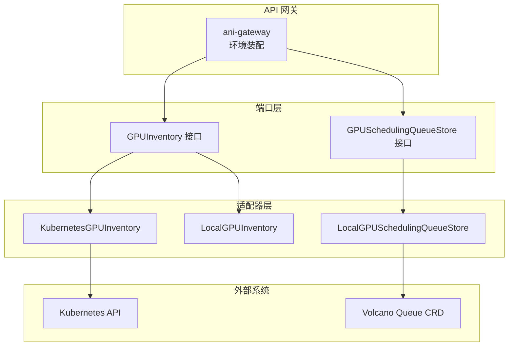
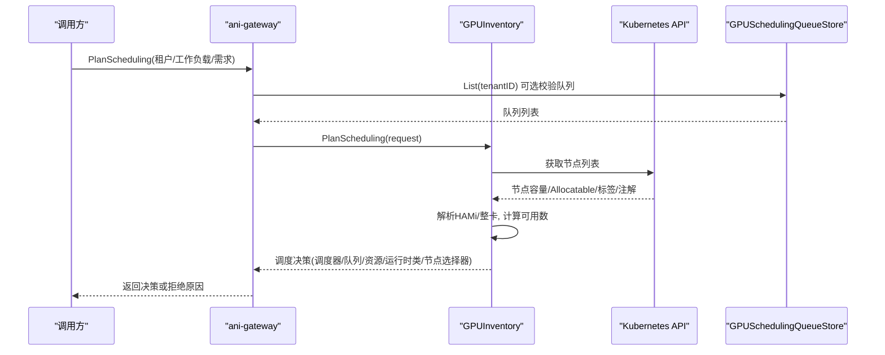
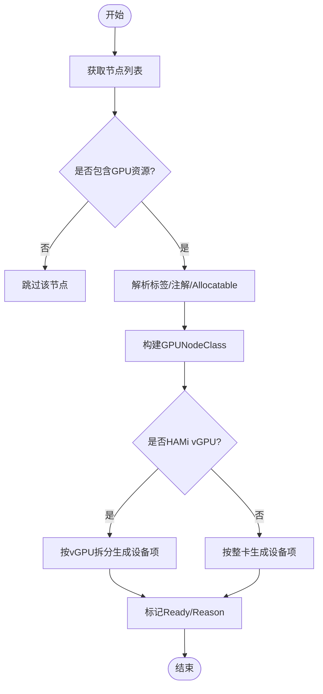
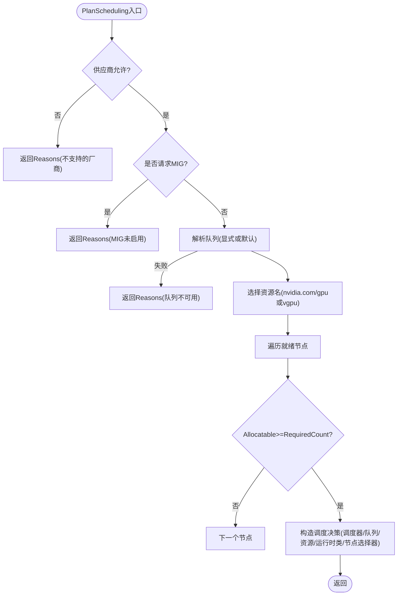
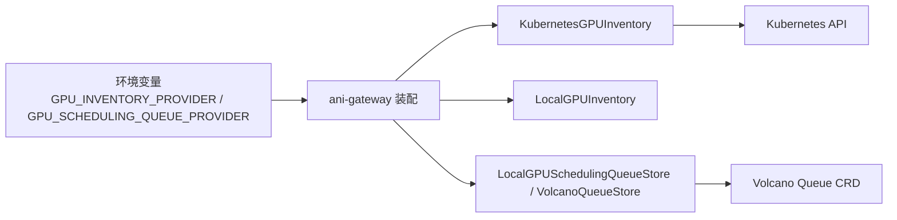
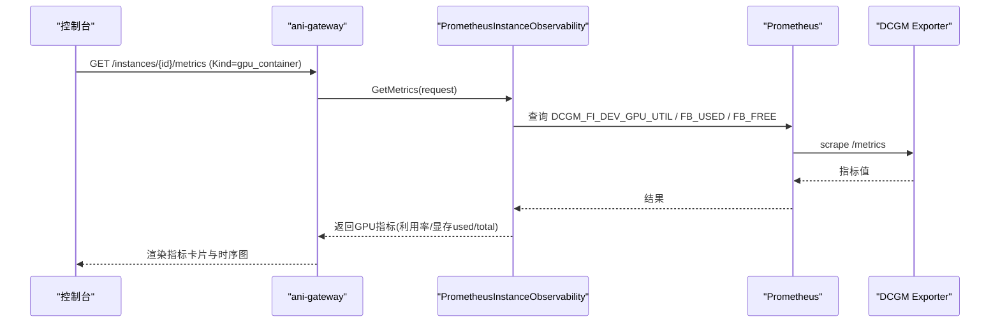
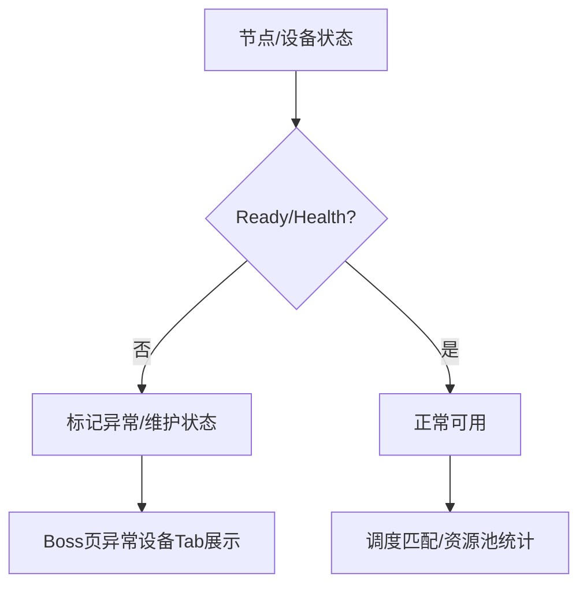

# GPU资源接口

<cite>
**本文引用的文件**
- [gpu_inventory.go](file://repo/pkg/ports/gpu_inventory.go)
- [gpu_scheduling.go](file://repo/pkg/ports/gpu_scheduling.go)
- [kubernetes_gpu_inventory.go](file://repo/pkg/adapters/runtime/kubernetes_gpu_inventory.go)
- [local_gpu_inventory.go](file://repo/pkg/adapters/runtime/local_gpu_inventory.go)
- [gpu_spec_service.go](file://repo/pkg/adapters/runtime/gpu_spec_service.go)
- [local_gpu_scheduling_queue_store.go](file://repo/pkg/adapters/runtime/local_gpu_scheduling_queue_store.go)
- [gpu_inventory_runtime.go](file://repo/services/ani-gateway/gpu_inventory_runtime.go)
- [plan-scheduling-extend.md](file://repo/development-records/gpu-scheduling-issue-03-plan-scheduling-extend.md)
- [spec-boss-gpu-pool.md](file://repo/services/tasks/modules/spec/boss/gpu-inventory/spec-boss-gpu-pool.md)
- [plan-instance-observability.md](file://repo/services/tasks/modules/plan/plan-instance-observability.md)
- [instance-observability-completion-b3-gpu-adapter-e2e-verify.md](file://repo/development-records/instance-observability-completion-b3-gpu-adapter-e2e-verify.md)
</cite>

## 目录
1. [简介](#简介)
2. [项目结构](#项目结构)
3. [核心组件](#核心组件)
4. [架构总览](#架构总览)
5. [详细组件分析](#详细组件分析)
6. [依赖关系分析](#依赖关系分析)
7. [性能与利用率优化](#性能与利用率优化)
8. [故障检测与恢复](#故障检测与恢复)
9. [多租户隔离与成本控制](#多租户隔离与成本控制)
10. [排错指南](#排错指南)
11. [结论](#结论)

## 简介
本文件面向平台开发者与运维人员，系统化说明 ANI 平台的 GPU 资源接口设计，覆盖设备发现、库存管理、调度算法、队列管理、异构支持、监控指标采集、以及 Kubernetes 与本地环境的适配器差异。文档同时给出资源分配策略、故障检测与恢复机制，以及 GPU 利用率优化、多租户隔离和成本控制的实践建议。

## 项目结构
GPU 能力由“端口（ports）+ 适配器（adapters）+ 网关运行时（services/ani-gateway）”三层构成：
- ports 层定义抽象接口与数据模型（如 GPUInventory、GPUSchedulingRequest、GPUNodeClass 等）。
- adapters 层提供具体实现：Kubernetes 适配器读取节点标签/注解并解析 HAMi/vGPU；Local 适配器用于开发/本地模拟。
- services/ani-gateway 负责根据环境变量装配不同的后端（Kubernetes REST、Volcano Queue CRD、本地内存存储），对外暴露统一 API。

图表来源
- [gpu_inventory_runtime.go:43-66](file://repo/services/ani-gateway/gpu_inventory_runtime.go#L43-L66)
- [kubernetes_gpu_inventory.go:32-52](file://repo/pkg/adapters/runtime/kubernetes_gpu_inventory.go#L32-L52)
- [local_gpu_inventory.go:11-49](file://repo/pkg/adapters/runtime/local_gpu_inventory.go#L11-L49)
- [local_gpu_scheduling_queue_store.go:15-46](file://repo/pkg/adapters/runtime/local_gpu_scheduling_queue_store.go#L15-L46)

章节来源
- [gpu_inventory_runtime.go:29-66](file://repo/services/ani-gateway/gpu_inventory_runtime.go#L29-L66)
- [gpu_inventory.go:155-171](file://repo/pkg/ports/gpu_inventory.go#L155-L171)
- [gpu_scheduling.go:18-74](file://repo/pkg/ports/gpu_scheduling.go#L18-L74)

## 核心组件
- GPUInventory：抽象异构 GPU 的发现、查询与调度决策能力。
- GPUSchedulingRequest/Decision：描述工作负载的 GPU 意图与调度约束（节点选择器、资源名、数量、运行时类、调度器、队列、拒绝原因等）。
- GPUNodeClass/GPUDeviceClass：描述节点级与设备级的 GPU 能力、虚拟化模式、驱动版本、标签/污点等。
- GPUSchedulingQueueStore：抽象 Volcano 队列的 CRUD，支持租户隔离、平台默认队列保护、幂等性。
- Local/Kubernetes 适配器：分别提供本地模拟与真实集群的设备发现与调度计划。
- 规格服务（GPUSpecService）：基于节点设备聚合出可创建的 GPU 规格（含显存、切片粒度、可用性）。

章节来源
- [gpu_inventory.go:22-171](file://repo/pkg/ports/gpu_inventory.go#L22-L171)
- [gpu_scheduling.go:9-83](file://repo/pkg/ports/gpu_scheduling.go#L9-L83)
- [gpu_spec_service.go:12-56](file://repo/pkg/adapters/runtime/gpu_spec_service.go#L12-L56)

## 架构总览
ANI 通过统一的 GPUInventory 接口屏蔽底层差异：
- Kubernetes 适配器从节点列表解析 GPU 能力，识别整卡与 vGPU，结合 HAMi 注解推导物理卡信息，输出调度决策（调度器、队列、资源名、运行时类、节点选择器等）。
- Local 适配器在开发/测试环境提供固定节点与设备集合，复用相同调度逻辑以验证行为一致性。
- 队列管理通过 GPUSchedulingQueueStore 抽象，本地使用内存存储预置平台默认队列，生产可对接 Volcano CRD。

图表来源
- [kubernetes_gpu_inventory.go:92-173](file://repo/pkg/adapters/runtime/kubernetes_gpu_inventory.go#L92-L173)
- [kubernetes_gpu_inventory.go:369-451](file://repo/pkg/adapters/runtime/kubernetes_gpu_inventory.go#L369-L451)
- [gpu_inventory_runtime.go:43-66](file://repo/services/ani-gateway/gpu_inventory_runtime.go#L43-L66)
- [local_gpu_scheduling_queue_store.go:79-91](file://repo/pkg/adapters/runtime/local_gpu_scheduling_queue_store.go#L79-L91)

## 详细组件分析

### 设备发现与库存管理
- 节点发现：Kubernetes 适配器拉取节点列表，过滤具备 GPU 资源的节点，解析标签/注解，生成 GPUNodeClass。
- 设备建模：区分整卡与 vGPU，记录虚拟化模式、驱动版本、能力集、显存大小等。
- 本地模拟：Local 适配器内置两个节点（A100、L40S），便于开发与演示。

图表来源
- [kubernetes_gpu_inventory.go:369-451](file://repo/pkg/adapters/runtime/kubernetes_gpu_inventory.go#L369-L451)
- [local_gpu_inventory.go:11-49](file://repo/pkg/adapters/runtime/local_gpu_inventory.go#L11-L49)

章节来源
- [kubernetes_gpu_inventory.go:54-90](file://repo/pkg/adapters/runtime/kubernetes_gpu_inventory.go#L54-L90)
- [local_gpu_inventory.go:51-69](file://repo/pkg/adapters/runtime/local_gpu_inventory.go#L51-L69)

### 调度算法与队列管理
- 供应商门控：P0 仅支持 NVIDIA；昇腾/海光返回拒绝原因。
- MIG 模式：P0 未启用，请求 MIG 将返回拒绝原因。
- 队列解析：优先使用显式 QueueName；为空时按 WorkloadClass 选择默认队列（推理→ani-inference，训练/批→ani-training）。当注入队列存储时，显式队列需属于当前租户。
- 资源名选择：vGPU 模式下，若节点由 HAMi 管理则使用 nvidia.com/gpu，否则使用 nvidia.com/vgpu；整卡模式使用 nvidia.com/gpu。
- 节点匹配：遍历就绪节点，检查 Allocatable 中对应资源数量是否满足 RequiredCount；输出调度器名称（volcano 或 hami-scheduler）、运行时类、节点选择器、队列名、所选节点型号等。
- 无可用节点：返回决策对象并填充 Reasons，上层映射为 422 错误。

图表来源
- [kubernetes_gpu_inventory.go:92-173](file://repo/pkg/adapters/runtime/kubernetes_gpu_inventory.go#L92-L173)
- [kubernetes_gpu_inventory.go:175-319](file://repo/pkg/adapters/runtime/kubernetes_gpu_inventory.go#L175-L319)
- [plan-scheduling-extend.md:36-66](file://repo/development-records/gpu-scheduling-issue-03-plan-scheduling-extend.md#L36-L66)

章节来源
- [kubernetes_gpu_inventory.go:92-173](file://repo/pkg/adapters/runtime/kubernetes_gpu_inventory.go#L92-L173)
- [plan-scheduling-extend.md:36-66](file://repo/development-records/gpu-scheduling-issue-03-plan-scheduling-extend.md#L36-L66)

### 规格服务与规格可用性
- 规格聚合：基于节点设备聚合 GPUType、显存总量、切片粒度（Shares/MBPerShare），并标记是否可用。
- 规格可用性：当前实现返回“未支持”，待接入配额与预留后完善（SPEC §5.1）。

章节来源
- [gpu_spec_service.go:23-56](file://repo/pkg/adapters/runtime/gpu_spec_service.go#L23-L56)
- [gpu_inventory.go:128-171](file://repo/pkg/ports/gpu_inventory.go#L128-L171)

### Kubernetes 与本地适配器的差异
- 数据来源：Kubernetes 适配器从 K8s API 拉取节点；Local 适配器使用内置节点集合。
- 队列存储：Kubernetes 适配器可注入队列存储进行租户校验；Local 适配器直接走默认队列解析。
- 调度器与运行时类：Kubernetes 适配器根据节点是否由 HAMi 管理选择调度器与运行时类；Local 适配器固定为 volcano 与 vGPU 运行时类。
- 行为一致性：两者均复用相同的供应商门控、MIG 门控、资源名选择与节点匹配逻辑，保证开发与生产行为一致。

章节来源
- [kubernetes_gpu_inventory.go:32-52](file://repo/pkg/adapters/runtime/kubernetes_gpu_inventory.go#L32-L52)
- [local_gpu_inventory.go:71-117](file://repo/pkg/adapters/runtime/local_gpu_inventory.go#L71-L117)
- [gpu_inventory_runtime.go:43-66](file://repo/services/ani-gateway/gpu_inventory_runtime.go#L43-L66)

## 依赖关系分析
- 端口层与适配器层解耦：通过 GPUInventory、GPUSchedulingQueueStore 等接口抽象，便于替换实现。
- 运行时装配：ani-gateway 根据环境变量选择 GPU 库存提供者（local/kubernetes_rest）与队列存储（local/volcano_rest）。
- 外部依赖：Kubernetes API、Volcano Queue CRD、DCGM Exporter/Prometheus（监控）。

图表来源
- [gpu_inventory_runtime.go:29-66](file://repo/services/ani-gateway/gpu_inventory_runtime.go#L29-L66)
- [gpu_inventory_runtime.go:93-151](file://repo/services/ani-gateway/gpu_inventory_runtime.go#L93-L151)

章节来源
- [gpu_inventory_runtime.go:29-66](file://repo/services/ani-gateway/gpu_inventory_runtime.go#L29-L66)
- [gpu_inventory_runtime.go:93-151](file://repo/services/ani-gateway/gpu_inventory_runtime.go#L93-L151)

## 性能与利用率优化
- 指标采集：通过 DCGM Exporter 采集 GPU 利用率与显存使用量，Prometheus scrape 配置新增 dcgm-exporter job。
- 指标字段：
  - GPU 利用率：DCGM_FI_DEV_GPU_UTIL
  - 显存已用：DCGM_FI_DEV_FB_USED
  - 显存空闲：DCGM_FI_DEV_FB_FREE
  - 显存总量：由 FB_FREE + FB_USED 推导（真实 DCGM 不暴露 FB_TOTAL）
- 分支触发：仅当实例类型为 gpu_container 时触发 GPU 指标采集分支，非 GPU 实例不采集。
- 单位对齐：DCGM 单位为 MiB，无需额外换算。

图表来源
- [plan-instance-observability.md:62-121](file://repo/services/tasks/modules/plan/plan-instance-observability.md#L62-L121)
- [instance-observability-completion-b3-gpu-adapter-e2e-verify.md:109-137](file://repo/development-records/instance-observability-completion-b3-gpu-adapter-e2e-verify.md#L109-L137)

章节来源
- [plan-instance-observability.md:62-121](file://repo/services/tasks/modules/plan/plan-instance-observability.md#L62-L121)
- [instance-observability-completion-b3-gpu-adapter-e2e-verify.md:109-137](file://repo/development-records/instance-observability-completion-b3-gpu-adapter-e2e-verify.md#L109-L137)

## 故障检测与恢复
- 节点就绪状态：Kubernetes 适配器依据节点条件判断 Ready，并记录 Reason（如 KubeletReady、not ready 的原因）。
- 设备健康：HAMi 注解中包含物理卡健康信息，可用于识别异常设备。
- 页面展示：Boss 端 GPU 资源池页展示总量、已分配、空闲、异常设备数；异常设备 Tab 可按状态过滤。
- 降级处理：当 Inventory 加载失败但 Occupancy 可用时，页面仍显示占用统计并提示设备清单加载失败。

图表来源
- [kubernetes_gpu_inventory.go:504-515](file://repo/pkg/adapters/runtime/kubernetes_gpu_inventory.go#L504-L515)
- [spec-boss-gpu-pool.md:129-167](file://repo/services/tasks/modules/spec/boss/gpu-inventory/spec-boss-gpu-pool.md#L129-L167)

章节来源
- [kubernetes_gpu_inventory.go:504-515](file://repo/pkg/adapters/runtime/kubernetes_gpu_inventory.go#L504-L515)
- [spec-boss-gpu-pool.md:129-167](file://repo/services/tasks/modules/spec/boss/gpu-inventory/spec-boss-gpu-pool.md#L129-L167)

## 多租户隔离与成本控制
- 队列租户隔离：队列存储实现强制租户隔离，平台默认队列对所有租户可见，自定义队列按租户 ID 过滤。
- 队列保护：平台默认队列禁止修改/删除，防止破坏全局调度策略。
- 幂等性：创建/更新操作支持 idempotencyKey，重复请求返回原结果并标记 IdempotentReplay=true。
- 配额与预留：规格可用性计算需结合租户配额与预留机制（当前实现暂返回未支持，后续接入）。

章节来源
- [local_gpu_scheduling_queue_store.go:79-204](file://repo/pkg/adapters/runtime/local_gpu_scheduling_queue_store.go#L79-L204)
- [gpu_scheduling.go:62-83](file://repo/pkg/ports/gpu_scheduling.go#L62-L83)
- [gpu_inventory.go:128-171](file://repo/pkg/ports/gpu_inventory.go#L128-L171)

## 排错指南
- 调度失败常见原因：
  - 供应商不支持：P0 仅支持 NVIDIA，其他厂商会返回 Reasons。
  - MIG 模式未启用：请求 MIG 将被拒绝。
  - 队列不存在或不属于租户：显式队列需存在且属于当前租户。
  - 无可用节点：没有就绪节点满足所需资源数量。
- 指标采集问题：
  - 确认 Prometheus 已配置 dcgm-exporter job。
  - 确认实例 Kind 为 gpu_container，否则不会触发 GPU 指标分支。
  - 指标名与单位：使用 FB_FREE + FB_USED 推导总量，单位为 MiB。
- 页面异常：
  - Inventory 加载失败但 Occupancy 可用时，页面仍显示占用统计并提示设备清单加载失败。
  - 403 权限错误会在页面顶部提示无权查看平台 GPU 资源池。

章节来源
- [kubernetes_gpu_inventory.go:92-173](file://repo/pkg/adapters/runtime/kubernetes_gpu_inventory.go#L92-L173)
- [plan-instance-observability.md:62-121](file://repo/services/tasks/modules/plan/plan-instance-observability.md#L62-L121)
- [spec-boss-gpu-pool.md:129-167](file://repo/services/tasks/modules/spec/boss/gpu-inventory/spec-boss-gpu-pool.md#L129-L167)

## 结论
ANI 的 GPU 资源接口通过清晰的端口/适配器分层，实现了异构 GPU 的统一抽象与调度决策。Kubernetes 适配器深度集成 HAMi 与 Volcano，支持整卡与 vGPU 两种模式；Local 适配器确保开发体验与生产行为一致。监控方面，基于 DCGM 与 Prometheus 的指标采集链路完整，能够直观展示 GPU 利用率与显存使用情况。队列管理与租户隔离保障了多租户场景下的公平性与安全性。未来接入配额与预留机制后，规格可用性将更精确，进一步支撑成本控制与资源优化。