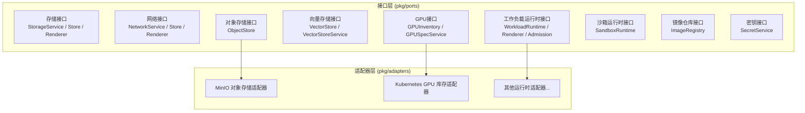
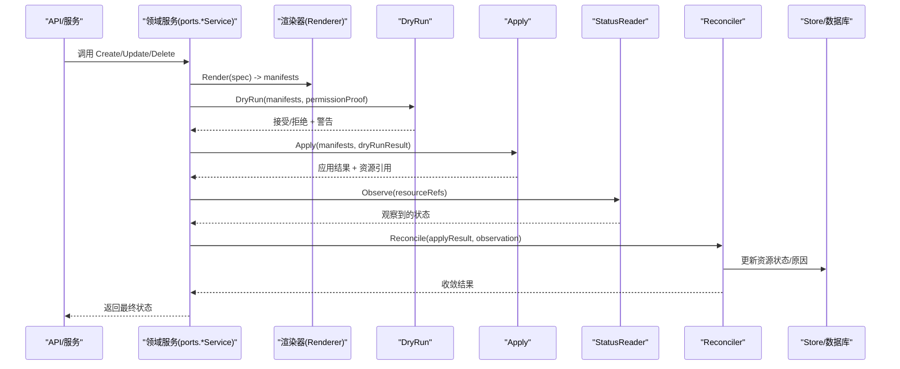
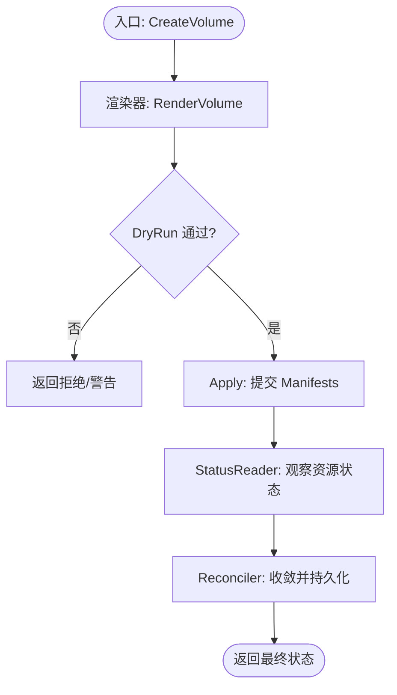
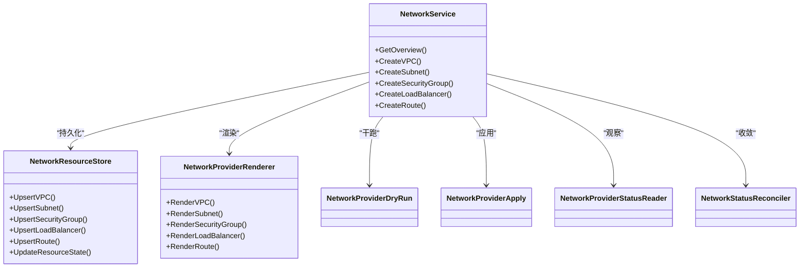
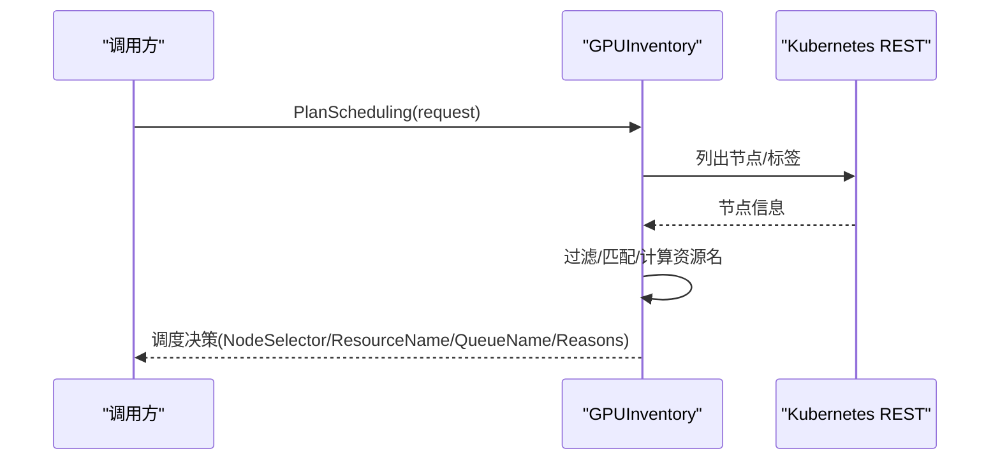
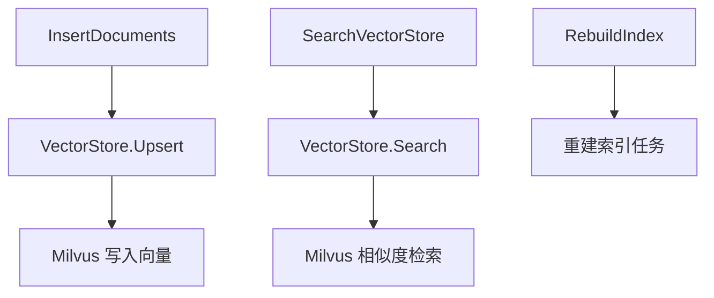
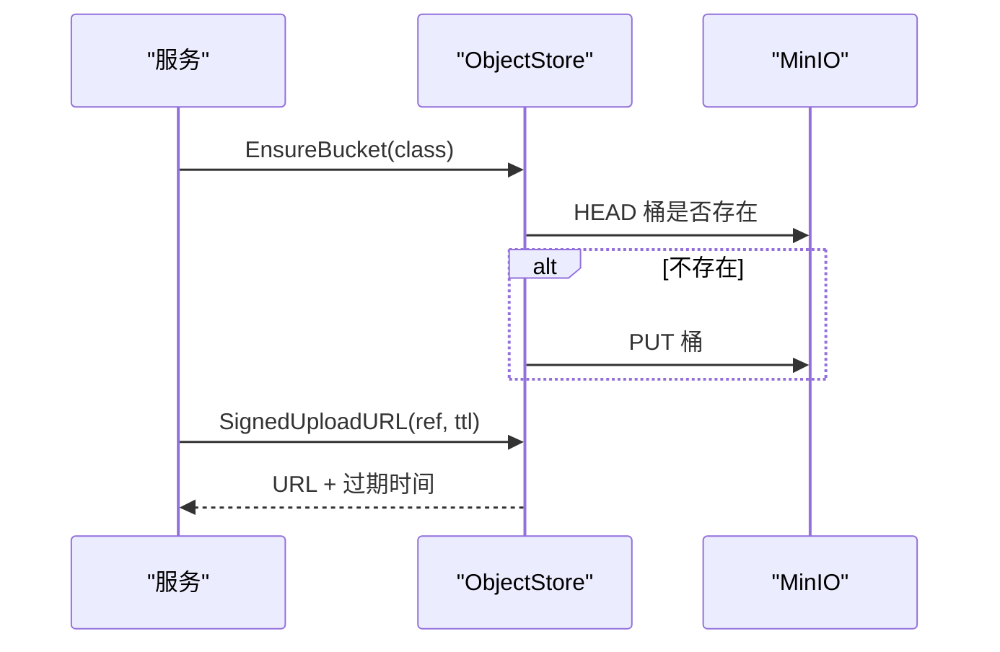
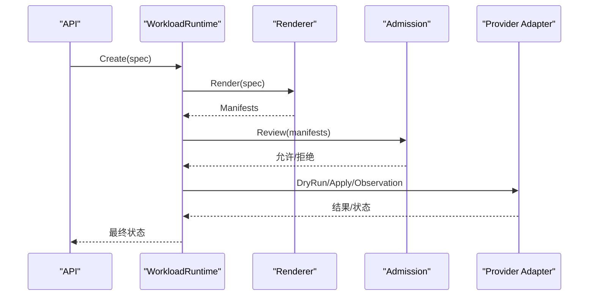
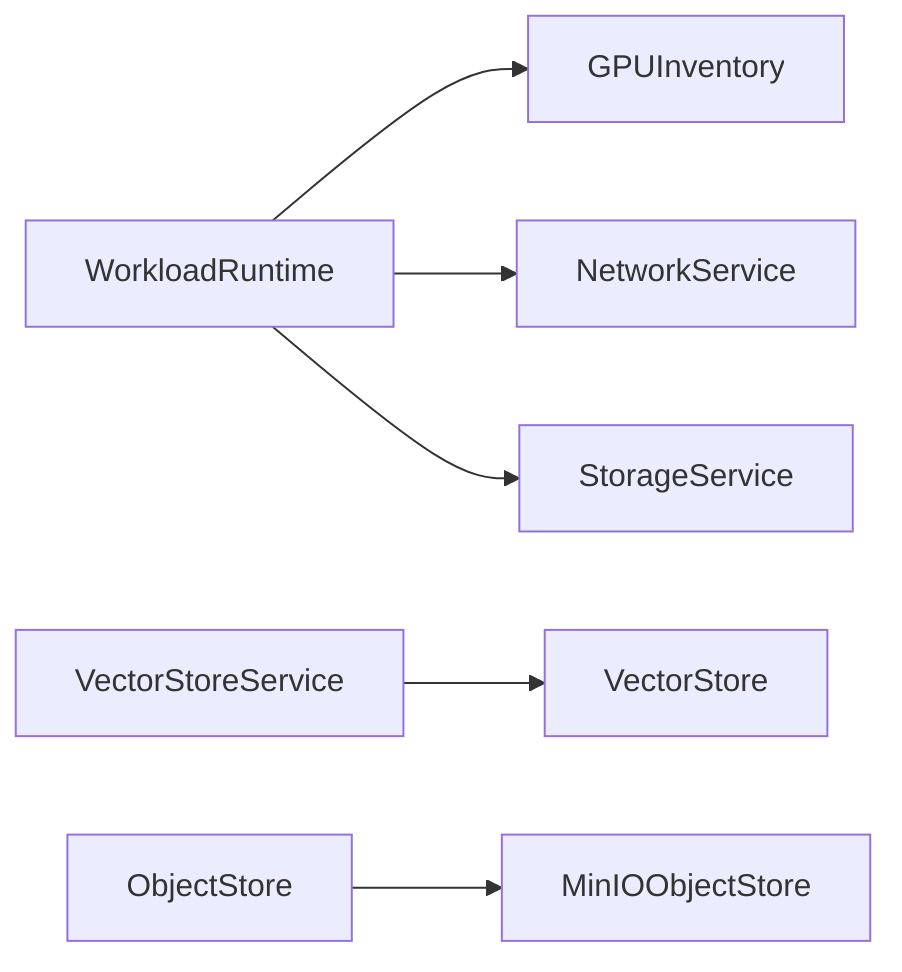

# 共享端口接口

<cite>
**本文引用的文件**
- [storage_resources.go](file://repo/pkg/ports/storage_resources.go)
- [network_resources.go](file://repo/pkg/ports/network_resources.go)
- [gpu_inventory.go](file://repo/pkg/ports/gpu_inventory.go)
- [vector_store.go](file://repo/pkg/ports/vector_store.go)
- [object_store.go](file://repo/pkg/ports/object_store.go)
- [workload_runtime.go](file://repo/pkg/ports/workload_runtime.go)
- [sandbox_runtime.go](file://repo/pkg/ports/sandbox_runtime.go)
- [image_registry.go](file://repo/pkg/ports/image_registry.go)
- [secrets.go](file://repo/pkg/ports/secrets.go)
- [errors.go](file://repo/pkg/ports/errors.go)
- [minio_store.go](file://repo/pkg/adapters/objectstore/minio_store.go)
- [kubernetes_gpu_inventory.go](file://repo/pkg/adapters/runtime/kubernetes_gpu_inventory.go)
</cite>

## 目录
1. [简介](#简介)
2. [项目结构](#项目结构)
3. [核心组件](#核心组件)
4. [架构总览](#架构总览)
5. [详细组件分析](#详细组件分析)
6. [依赖关系分析](#依赖关系分析)
7. [性能与可靠性考虑](#性能与可靠性考虑)
8. [故障排查指南](#故障排查指南)
9. [结论](#结论)
10. [附录：实现与测试指南](#附录：实现与测试指南)

## 简介
本文件面向平台能力抽象层“共享端口接口”，目标是统一存储、网络、GPU、向量存储、对象存储、工作负载运行时、沙箱、镜像仓库、密钥等能力的对外契约。通过定义清晰的接口、数据模型、错误语义和状态机，配合适配器模式（ports + adapters），实现对不同后端（如 MinIO、Kubernetes、Milvus、Volcano/HAMi 等）的统一访问与可插拔替换。

## 项目结构
- 接口契约集中在 pkg/ports，按能力域拆分文件，每个文件定义：
  - 资源记录类型（Record）
  - 请求/响应类型（Request/Result）
  - 服务接口（Service/Interface）
  - 持久化存储接口（Store）
  - 渲染器接口（Renderer）
  - 提供者生命周期（DryRun/Apply/StatusReader/Reconciler）
- 适配器实现在 pkg/adapters，例如：
  - objectstore.MinIOObjectStore 实现 ports.ObjectStore
  - runtime.KubernetesGPUInventory 实现 ports.GPUInventory
- 上层服务通过依赖注入绑定具体适配器，屏蔽后端差异。

图表来源
- [object_store.go:47-56](file://repo/pkg/ports/object_store.go#L47-L56)
- [minio_store.go:60-104](file://repo/pkg/adapters/objectstore/minio_store.go#L60-L104)
- [gpu_inventory.go:87-171](file://repo/pkg/ports/gpu_inventory.go#L87-L171)
- [kubernetes_gpu_inventory.go:32-52](file://repo/pkg/adapters/runtime/kubernetes_gpu_inventory.go#L32-L52)

章节来源
- [storage_resources.go:487-534](file://repo/pkg/ports/storage_resources.go#L487-L534)
- [network_resources.go:314-350](file://repo/pkg/ports/network_resources.go#L314-L350)
- [gpu_inventory.go:87-171](file://repo/pkg/ports/gpu_inventory.go#L87-L171)
- [vector_store.go:157-179](file://repo/pkg/ports/vector_store.go#L157-L179)
- [object_store.go:47-56](file://repo/pkg/ports/object_store.go#L47-L56)
- [workload_runtime.go:775-792](file://repo/pkg/ports/workload_runtime.go#L775-L792)
- [sandbox_runtime.go:278-296](file://repo/pkg/ports/sandbox_runtime.go#L278-L296)
- [image_registry.go:375-392](file://repo/pkg/ports/image_registry.go#L375-L392)
- [secrets.go:80-86](file://repo/pkg/ports/secrets.go#L80-L86)

## 核心组件
- 存储（Storage）
  - 卷、文件系统、对象、桶、快照、挂载目标、生命周期规则
  - 提供 CRUD、扩缩容、挂载/卸载、预签名 URL、OS 初始化引导
  - 提供 DryRun/Apply/StatusReader/Reconcile 的提供者生命周期
- 网络（Network）
  - VPC、子网、安全组、负载均衡、路由、IP 分配
  - 提供概览、能力、关系、删除风险评估
  - 同样具备 DryRun/Apply/StatusReader/Reconcile 生命周期
- GPU（GPU Inventory & Scheduling）
  - 节点类、设备类、规格列表、计划调度决策、可用性视图
  - 支持多厂商、虚拟化模式（none/mig/vgpu）、队列选择
- 向量存储（Vector Store）
  - 集合管理、文档插入/删除、搜索、索引重建、健康检查
  - 控制面元数据持久化（PostgreSQL），数据面由 Milvus 等后端承载
- 对象存储（Object Store）
  - 桶/对象级操作、预签名上传/下载、健康检查、桶存在性保证
- 工作负载运行时（Workload Runtime）
  - 实例创建/查询/生命周期/列表；渲染、准入、审计、编排
  - 支持 VM、容器、GPU 容器、Notebook、Sandbox、Batch、Inference
- 沙箱运行时（Sandbox Runtime）
  - 会话、端口、文件、检查点、代码执行、令牌
- 镜像仓库（Image Registry）
  - 项目、仓库、制品、权限、扫描、拉取 Secret、推送指引
- 密钥（Secrets）
  - 创建、绑定、列举、删除；Provider Apply 适配

章节来源
- [storage_resources.go:18-116](file://repo/pkg/ports/storage_resources.go#L18-L116)
- [storage_resources.go:317-465](file://repo/pkg/ports/storage_resources.go#L317-L465)
- [storage_resources.go:487-683](file://repo/pkg/ports/storage_resources.go#L487-L683)
- [network_resources.go:18-168](file://repo/pkg/ports/network_resources.go#L18-L168)
- [network_resources.go:170-239](file://repo/pkg/ports/network_resources.go#L170-L239)
- [network_resources.go:314-483](file://repo/pkg/ports/network_resources.go#L314-L483)
- [gpu_inventory.go:22-85](file://repo/pkg/ports/gpu_inventory.go#L22-L85)
- [gpu_inventory.go:92-171](file://repo/pkg/ports/gpu_inventory.go#L92-L171)
- [vector_store.go:18-155](file://repo/pkg/ports/vector_store.go#L18-L155)
- [vector_store.go:157-190](file://repo/pkg/ports/vector_store.go#L157-L190)
- [object_store.go:18-56](file://repo/pkg/ports/object_store.go#L18-L56)
- [workload_runtime.go:8-19](file://repo/pkg/ports/workload_runtime.go#L8-L19)
- [workload_runtime.go:353-381](file://repo/pkg/ports/workload_runtime.go#L353-L381)
- [workload_runtime.go:775-792](file://repo/pkg/ports/workload_runtime.go#L775-L792)
- [sandbox_runtime.go:33-53](file://repo/pkg/ports/sandbox_runtime.go#L33-L53)
- [sandbox_runtime.go:278-296](file://repo/pkg/ports/sandbox_runtime.go#L278-L296)
- [image_registry.go:69-125](file://repo/pkg/ports/image_registry.go#L69-L125)
- [image_registry.go:375-392](file://repo/pkg/ports/image_registry.go#L375-L392)
- [secrets.go:8-46](file://repo/pkg/ports/secrets.go#L8-L46)
- [secrets.go:80-86](file://repo/pkg/ports/secrets.go#L80-L86)

## 架构总览
共享端口接口将业务服务与底层基础设施解耦。上层调用统一的 Service 接口，内部通过 Renderer/DryRun/Apply/StatusReader/Reconcile 流程完成声明式资源的生成、校验、下发与状态收敛。

图表来源
- [storage_resources.go:561-683](file://repo/pkg/ports/storage_resources.go#L561-L683)
- [network_resources.go:361-483](file://repo/pkg/ports/network_resources.go#L361-L483)
- [workload_runtime.go:788-792](file://repo/pkg/ports/workload_runtime.go#L788-L792)

## 详细组件分析

### 存储（Storage）
- 资源模型
  - 卷：包含大小、存储类、可用区、加密、挂载历史、快照策略、OS 初始化引导等
  - 文件系统：协议、端点、挂载目标、性能模式、挂载命令
  - 对象/桶：ACL、版本控制、生命周期规则、预签名 URL、分页列举
  - 快照：创建、列表、状态
- 接口契约
  - StorageService：CRUD、扩缩容、挂载/卸载、从快照恢复、自动快照策略、OS 初始化引导
  - StorageResourceStore：记录持久化、幂等查找、批量 Upsert
  - StorageProviderRenderer：渲染为 WorkloadManifest
  - 提供者生命周期：DryRun/Apply/StatusReader/Reconcile
- 错误处理
  - 使用通用错误集（未配置、不支持、未找到、冲突、无效、前置条件失败、负载过大、凭证无效、租户不存在、不可用）
- 数据流
  - 渲染 -> 干跑 -> 应用 -> 观察 -> 收敛 -> 持久化

图表来源
- [storage_resources.go:317-465](file://repo/pkg/ports/storage_resources.go#L317-L465)
- [storage_resources.go:487-683](file://repo/pkg/ports/storage_resources.go#L487-L683)
- [errors.go:5-24](file://repo/pkg/ports/errors.go#L5-L24)

章节来源
- [storage_resources.go:18-116](file://repo/pkg/ports/storage_resources.go#L18-L116)
- [storage_resources.go:317-465](file://repo/pkg/ports/storage_resources.go#L317-L465)
- [storage_resources.go:487-683](file://repo/pkg/ports/storage_resources.go#L487-L683)
- [errors.go:5-24](file://repo/pkg/ports/errors.go#L5-L24)

### 网络（Network）
- 资源模型
  - VPC/子网/CIDR/网关、安全组规则/绑定、负载均衡监听器、路由、IP 分配
- 接口契约
  - NetworkService：CRUD、概览、能力、关系、删除风险
  - NetworkResourceStore：Upsert、状态更新
  - NetworkProviderRenderer：渲染为 Manifests
  - 提供者生命周期：DryRun/Apply/StatusReader/Reconcile
- 错误处理
  - 复用通用错误集；对非法参数、前置条件失败、依赖不可用等进行区分
- 数据流
  - 渲染 -> 干跑 -> 应用 -> 观察 -> 收敛 -> 持久化

图表来源
- [network_resources.go:314-367](file://repo/pkg/ports/network_resources.go#L314-L367)
- [network_resources.go:369-483](file://repo/pkg/ports/network_resources.go#L369-L483)

章节来源
- [network_resources.go:18-168](file://repo/pkg/ports/network_resources.go#L18-L168)
- [network_resources.go:170-239](file://repo/pkg/ports/network_resources.go#L170-L239)
- [network_resources.go:314-483](file://repo/pkg/ports/network_resources.go#L314-L483)

### GPU（库存与调度）
- 资源模型
  - 设备类（厂商、型号、显存、虚拟化模式、驱动/运行时版本、能力）
  - 节点类（标签、污点、Allocatable、就绪、模式/规格/共享策略）
  - 规格列表与可用性视图（available/full/device_full/unavailable）
- 接口契约
  - GPUInventory：节点发现、单节点查询、计划调度、规格可用性
  - GPUSpecService：规格列表/获取
- 错误处理
  - 对不支持的厂商/MIG 模式在 P0 阶段以 Reasons 返回，便于上层映射为 422
- 数据流
  - 根据请求偏好（厂商/型号/内存/虚拟化模式/队列）选择节点与资源名，输出 NodeSelector/Tolerations/RuntimeClassName/SchedulerName/QueueName

图表来源
- [gpu_inventory.go:92-171](file://repo/pkg/ports/gpu_inventory.go#L92-L171)
- [kubernetes_gpu_inventory.go:92-173](file://repo/pkg/adapters/runtime/kubernetes_gpu_inventory.go#L92-L173)

章节来源
- [gpu_inventory.go:22-85](file://repo/pkg/ports/gpu_inventory.go#L22-L85)
- [gpu_inventory.go:92-171](file://repo/pkg/ports/gpu_inventory.go#L92-L171)
- [kubernetes_gpu_inventory.go:32-52](file://repo/pkg/adapters/runtime/kubernetes_gpu_inventory.go#L32-L52)
- [kubernetes_gpu_inventory.go:92-173](file://repo/pkg/adapters/runtime/kubernetes_gpu_inventory.go#L92-L173)

### 向量存储（Vector Store）
- 资源模型
  - 向量库记录（维度、度量、嵌入模型、索引状态、知识库关联）
  - 文档输入（内容、可选预计算向量、元数据）
  - 搜索结果（ID、分数、内容、元数据）
- 接口契约
  - VectorStore：健康、集合确保、Upsert、Search、Delete、DeleteByExpr、集合健康
  - VectorStoreService：集合 CRUD、搜索、重建索引、知识库链接、文档增删
  - VectorStoreResourceStore：控制面元数据持久化（PostgreSQL）
- 错误处理
  - 复用通用错误集；对无效请求、前置条件失败、依赖不可用进行区分
- 数据流
  - 控制面（PostgreSQL）维护集合元数据；数据面（Milvus）承载向量与检索

图表来源
- [vector_store.go:18-155](file://repo/pkg/ports/vector_store.go#L18-L155)
- [vector_store.go:157-190](file://repo/pkg/ports/vector_store.go#L157-L190)

章节来源
- [vector_store.go:18-155](file://repo/pkg/ports/vector_store.go#L18-L155)
- [vector_store.go:157-190](file://repo/pkg/ports/vector_store.go#L157-L190)

### 对象存储（Object Store）
- 资源模型
  - 对象引用（租户、桶类、键、版本）、对象元数据、预签名 URL
- 接口契约
  - ObjectStore：健康、桶确保、Put/Get/Delete/Stat、预签名上传/下载
- 适配器示例
  - MinIOObjectStore 实现上述接口，封装签名、重试、超时等

图表来源
- [object_store.go:18-56](file://repo/pkg/ports/object_store.go#L18-L56)
- [minio_store.go:127-161](file://repo/pkg/adapters/objectstore/minio_store.go#L127-L161)

章节来源
- [object_store.go:18-56](file://repo/pkg/ports/object_store.go#L18-L56)
- [minio_store.go:60-104](file://repo/pkg/adapters/objectstore/minio_store.go#L60-L104)
- [minio_store.go:127-161](file://repo/pkg/adapters/objectstore/minio_store.go#L127-L161)

### 工作负载运行时（Workload Runtime）
- 资源模型
  - 工作负载种类、状态、生命周期动作、网络平面、存储附件、镜像摘要、GPU 规格引用、身份绑定、操作审计等
- 接口契约
  - WorkloadRuntime：能力、创建、获取、生命周期、删除、列表
  - WorkloadRenderer：渲染为 Provider Manifests
  - WorkloadAdmission：准入审查
- 错误处理
  - 复用通用错误集；对无效请求、前置条件失败、依赖不可用进行区分
- 数据流
  - 渲染 -> 准入 -> 干跑 -> 应用 -> 观察 -> 收敛 -> 持久化

图表来源
- [workload_runtime.go:775-792](file://repo/pkg/ports/workload_runtime.go#L775-L792)

章节来源
- [workload_runtime.go:8-19](file://repo/pkg/ports/workload_runtime.go#L8-L19)
- [workload_runtime.go:353-381](file://repo/pkg/ports/workload_runtime.go#L353-L381)
- [workload_runtime.go:775-792](file://repo/pkg/ports/workload_runtime.go#L775-L792)

### 沙箱运行时（Sandbox Runtime）
- 资源模型
  - 配置（模板、超时、出口策略、端口、环境变量）、执行上下文、端口结果、文件、检查点、代码运行
- 接口契约
  - SandboxRuntime：创建、获取、列表、生命周期、令牌、端口、文件、检查点、代码运行
- 错误处理
  - 复用通用错误集；对无效请求、前置条件失败、依赖不可用进行区分

章节来源
- [sandbox_runtime.go:33-53](file://repo/pkg/ports/sandbox_runtime.go#L33-L53)
- [sandbox_runtime.go:278-296](file://repo/pkg/ports/sandbox_runtime.go#L278-L296)

### 镜像仓库（Image Registry）
- 资源模型
  - 项目、仓库、制品、权限、扫描结果、拉取 Secret、推送指令、镜像引用
- 接口契约
  - ImageRegistry：项目/仓库/制品/权限/扫描/Secret/概览/镜像/推送指令/标签删除/引用列表
- 错误处理
  - 复用通用错误集；对无效请求、前置条件失败、依赖不可用进行区分

章节来源
- [image_registry.go:69-125](file://repo/pkg/ports/image_registry.go#L69-L125)
- [image_registry.go:375-392](file://repo/pkg/ports/image_registry.go#L375-L392)

### 密钥（Secrets）
- 资源模型
  - 密钥记录、绑定记录、Provider Apply 请求/结果
- 接口契约
  - SecretService：创建、获取、列举、删除、绑定
  - SecretProviderApply：Provider 侧应用
- 错误处理
  - 复用通用错误集；对无效请求、前置条件失败、依赖不可用进行区分

章节来源
- [secrets.go:8-46](file://repo/pkg/ports/secrets.go#L8-L46)
- [secrets.go:80-86](file://repo/pkg/ports/secrets.go#L80-L86)

## 依赖关系分析
- 耦合与内聚
  - 各 Service 仅依赖自身领域的 Store/Renderer/Provider 接口，保持高内聚
  - 适配器实现单一职责，如 MinIO 仅关注对象存储协议细节
- 直接/间接依赖
  - 工作负载运行时依赖 GPU 库存、网络、存储等能力，通过接口组合
  - 向量存储控制面依赖 PostgreSQL，数据面依赖 Milvus（通过 VectorStore 接口）
- 外部依赖与集成点
  - Kubernetes（节点/调度/REST）、MinIO（对象存储）、Milvus（向量检索）、Volcano/HAMi（GPU 调度）
- 循环依赖
  - 通过接口分层避免循环依赖；Service 不反向依赖适配器

图表来源
- [workload_runtime.go:775-792](file://repo/pkg/ports/workload_runtime.go#L775-L792)
- [gpu_inventory.go:87-171](file://repo/pkg/ports/gpu_inventory.go#L87-L171)
- [network_resources.go:314-350](file://repo/pkg/ports/network_resources.go#L314-L350)
- [storage_resources.go:487-534](file://repo/pkg/ports/storage_resources.go#L487-L534)
- [vector_store.go:157-179](file://repo/pkg/ports/vector_store.go#L157-L179)
- [object_store.go:47-56](file://repo/pkg/ports/object_store.go#L47-L56)
- [minio_store.go:60-104](file://repo/pkg/adapters/objectstore/minio_store.go#L60-L104)

章节来源
- [workload_runtime.go:775-792](file://repo/pkg/ports/workload_runtime.go#L775-L792)
- [gpu_inventory.go:87-171](file://repo/pkg/ports/gpu_inventory.go#L87-L171)
- [network_resources.go:314-350](file://repo/pkg/ports/network_resources.go#L314-L350)
- [storage_resources.go:487-534](file://repo/pkg/ports/storage_resources.go#L487-L534)
- [vector_store.go:157-179](file://repo/pkg/ports/vector_store.go#L157-L179)
- [object_store.go:47-56](file://repo/pkg/ports/object_store.go#L47-L56)
- [minio_store.go:60-104](file://repo/pkg/adapters/objectstore/minio_store.go#L60-L104)

## 性能与可靠性考虑
- 幂等性
  - 所有写操作均支持 IdempotencyKey，防止重复提交导致副作用
- 超时与重试
  - 适配器层可结合韧性策略（超时、退避、熔断）提升稳定性
- 并发与分页
  - 列表接口普遍支持 Limit/Cursor，避免一次性加载大量数据
- 状态收敛
  - 通过 StatusReader 观察与 Reconciler 收敛，保证期望态与实际态一致
- 容量与配额
  - GPU 规格可用性视图结合租户配额与节点空闲设备计数，避免超卖

[本节为通用指导，不直接分析具体文件]

## 故障排查指南
- 常见错误分类
  - 未配置：能力适配器未配置（ErrNotConfigured）
  - 不支持：当前适配器不支持该操作（ErrUnsupported）
  - 未找到：资源不存在（ErrNotFound）
  - 冲突：资源冲突（ErrConflict）
  - 无效：请求参数无效（ErrInvalid）
  - 前置条件失败：前置条件不满足（ErrFailedPrecondition）
  - 负载过大：请求体过大（ErrPayloadTooLarge）
  - 凭证无效：认证失败（ErrInvalidCredentials）
  - 租户不存在：租户未找到（ErrTenantNotFound）
  - 不可用：依赖服务不可用（ErrUnavailable）
- 定位步骤
  - 查看 DryRun 返回的 Reason/Warnings，确认 Manifest 是否合法
  - 检查 Apply 结果中的 ResourceRefs，确认实际资源是否创建成功
  - 通过 StatusReader 观察资源状态，结合 Reconciler 输出的 State/Reason 定位问题
  - 对于 GPU 调度，检查 Reasons 中关于厂商/模式/队列/节点匹配的原因
  - 对于对象存储，检查 Health 与桶存在性、签名是否正确
- 日志与审计
  - 工作负载运行时提供 PlanAudit 记录，便于回溯渲染/准入/应用过程

章节来源
- [errors.go:5-24](file://repo/pkg/ports/errors.go#L5-L24)
- [storage_resources.go:561-683](file://repo/pkg/ports/storage_resources.go#L561-L683)
- [network_resources.go:369-483](file://repo/pkg/ports/network_resources.go#L369-L483)
- [workload_runtime.go:788-792](file://repo/pkg/ports/workload_runtime.go#L788-L792)

## 结论
共享端口接口通过清晰的契约与适配器模式，实现了跨后端的统一访问与可插拔扩展。存储、网络、GPU、向量存储、对象存储、工作负载运行时、沙箱、镜像仓库、密钥等能力均以接口为中心，配合渲染、干跑、应用、观察、收敛的声明式流程，保障一致性、可观测性与可运维性。遵循幂等、分页、超时与韧性策略，可在复杂环境中稳定运行。

[本节为总结，不直接分析具体文件]

## 附录：实现与测试指南

### 如何实现一个适配器
- 明确接口
  - 选择要实现的 ports.* 接口（如 ObjectStore、GPUInventory）
- 设计配置
  - 定义配置结构（如 MinIO 端点、凭据、超时、公共端点）
- 实现方法
  - 健康检查：验证后端可达
  - 幂等写：基于 IdempotencyKey 去重
  - 错误映射：将后端错误映射为通用错误
  - 超时与重试：结合韧性策略
- 注册与注入
  - 在启动时根据配置选择并注入具体适配器实现
- 参考实现
  - 对象存储：MinIOObjectStore 实现 ObjectStore
  - GPU 库存：KubernetesGPUInventory 实现 GPUInventory

章节来源
- [object_store.go:47-56](file://repo/pkg/ports/object_store.go#L47-L56)
- [minio_store.go:60-104](file://repo/pkg/adapters/objectstore/minio_store.go#L60-L104)
- [gpu_inventory.go:87-171](file://repo/pkg/ports/gpu_inventory.go#L87-L171)
- [kubernetes_gpu_inventory.go:32-52](file://repo/pkg/adapters/runtime/kubernetes_gpu_inventory.go#L32-L52)

### 测试策略
- 单元测试
  - 针对适配器边界逻辑（参数校验、错误映射、幂等判断）
- 集成测试
  - 对接真实或 Mock 后端（MinIO、Kubernetes、Milvus）
  - 覆盖健康检查、桶/集合创建、读写、删除、预签名 URL
- 契约测试
  - 验证接口契约与 OpenAPI/Proto 的一致性
- 端到端测试
  - 模拟完整流程：渲染 -> 干跑 -> 应用 -> 观察 -> 收敛
  - 验证状态机转换与最终一致性

[本节为通用指导，不直接分析具体文件]