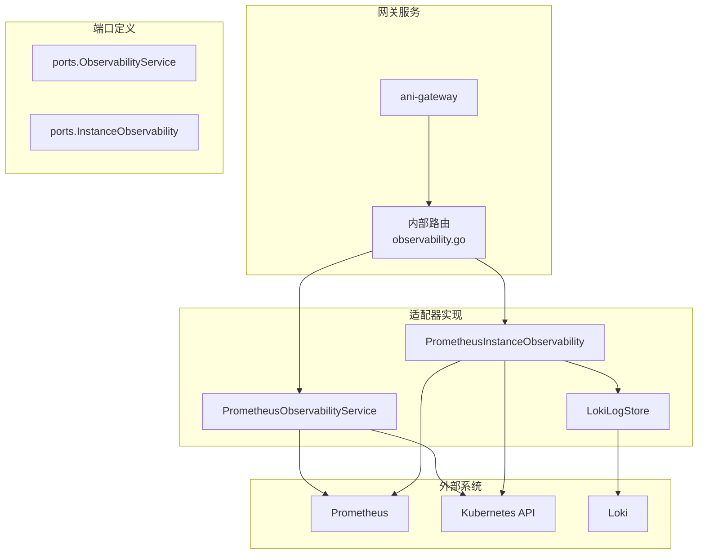
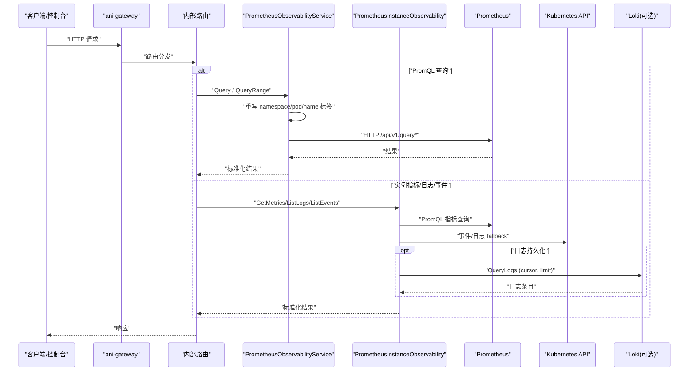
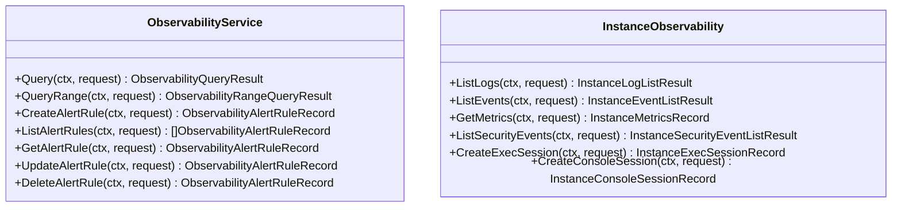
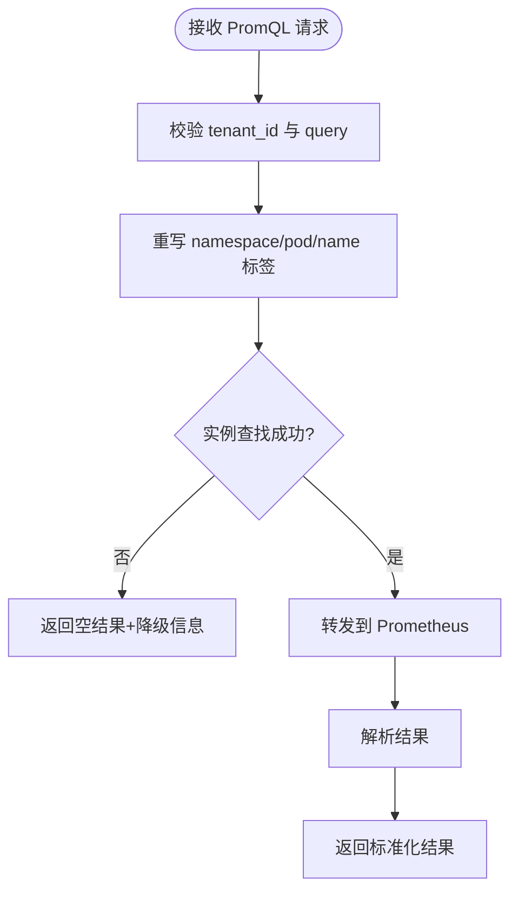
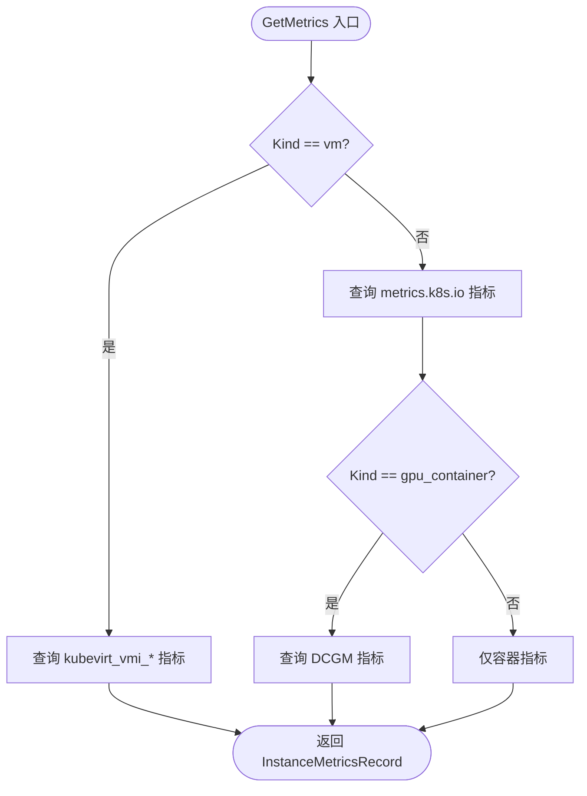
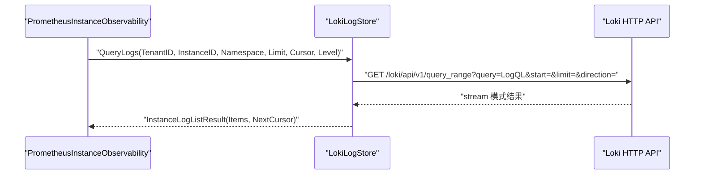
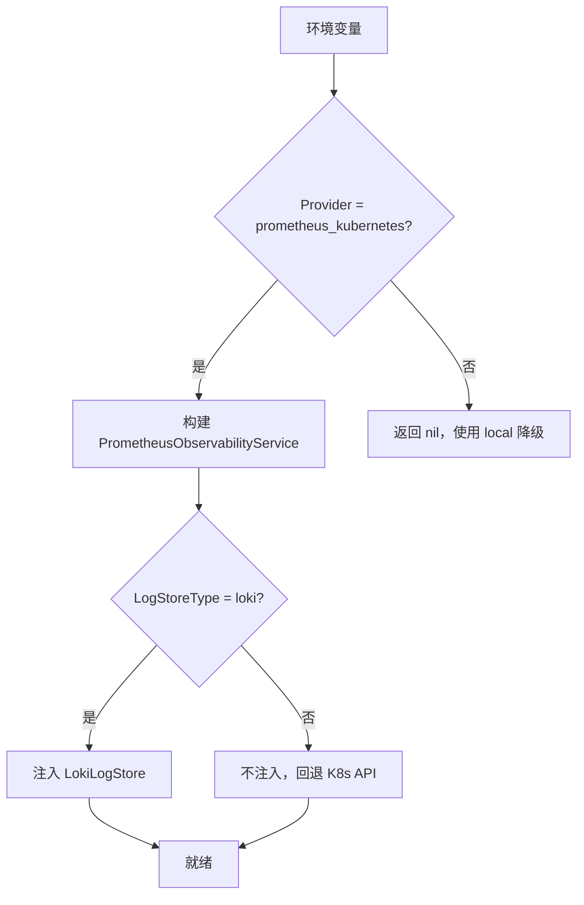
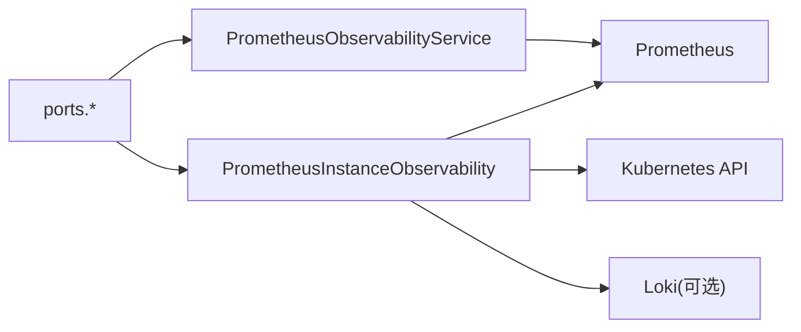

# 可观测性接口

<cite>
**本文引用的文件**
- [observability.go](file://repo/pkg/ports/observability.go)
- [instance_observability.go](file://repo/pkg/ports/instance_observability.go)
- [prometheus_instance_observability.go](file://repo/pkg/adapters/runtime/prometheus_instance_observability.go)
- [prometheus_observability_service.go](file://repo/pkg/adapters/runtime/prometheus_observability_service.go)
- [loki_log_store.go](file://repo/pkg/adapters/runtime/loki_log_store.go)
- [instance_observability_runtime.go](file://repo/services/ani-gateway/instance_observability_runtime.go)
- [observability_runtime.go](file://repo/services/ani-gateway/observability_runtime.go)
- [observability.go](file://repo/services/ani-gateway/internal/router/observability.go)
</cite>

## 目录
1. [简介](#简介)
2. [项目结构](#项目结构)
3. [核心组件](#核心组件)
4. [架构总览](#架构总览)
5. [详细组件分析](#详细组件分析)
6. [依赖关系分析](#依赖关系分析)
7. [性能与容量规划](#性能与容量规划)
8. [故障诊断与排错](#故障诊断与排错)
9. [结论](#结论)
10. [附录](#附录)

## 简介
本文件面向 ANI 平台的“可观测性接口”，统一封装监控指标、日志收集、链路追踪（PromQL 查询）等能力，提供实例级与系统级可观测性的标准化入口。其设计要点包括：
- 统一的端口定义：通过 ports 层暴露 ObservabilityService 与 InstanceObservability 接口，屏蔽底层 Prometheus、Kubernetes、Loki 等实现细节。
- 适配器模式：PrometheusInstanceObservability 负责实例级指标、事件、日志、会话；PrometheusObservabilityService 负责 PromQL 查询代理与告警规则元数据管理。
- 运行时装配：Gateway 根据环境变量选择真实后端或降级路径，支持 Loki 日志存储注入与 K8s pod log 回退。
- 租户隔离与安全：所有查询均基于 tenant_id 进行命名空间隔离与实例归属校验。
- 可观测性闭环：指标快照、时序图、日志、事件、安全事件、执行与会话能力一体化，便于控制台与运维工具使用。

## 项目结构
可观测性相关代码主要分布在以下层次：
- 端口层（ports）：定义统一的数据结构与接口契约。
- 适配器层（adapters/runtime）：实现具体后端适配（Prometheus、Kubernetes、Loki）。
- 网关服务（services/ani-gateway）：按环境变量装配运行时实现，并暴露 HTTP 路由。
- 路由层（internal/router）：将 HTTP 请求映射到端口方法，处理参数与错误。

**图表来源**
- [observability_runtime.go:31-54](file://repo/services/ani-gateway/observability_runtime.go#L31-L54)
- [instance_observability_runtime.go:51-82](file://repo/services/ani-gateway/instance_observability_runtime.go#L51-L82)
- [prometheus_observability_service.go:18-77](file://repo/pkg/adapters/runtime/prometheus_observability_service.go#L18-L77)
- [prometheus_instance_observability.go:19-86](file://repo/pkg/adapters/runtime/prometheus_instance_observability.go#L19-L86)
- [loki_log_store.go:16-60](file://repo/pkg/adapters/runtime/loki_log_store.go#L16-L60)

**章节来源**
- [observability_runtime.go:31-54](file://repo/services/ani-gateway/observability_runtime.go#L31-L54)
- [instance_observability_runtime.go:51-82](file://repo/services/ani-gateway/instance_observability_runtime.go#L51-L82)

## 核心组件
- 端口接口
  - ObservabilityService：提供 PromQL 即时与区间查询、告警规则 CRUD。
  - InstanceObservability：提供实例日志、事件、指标、安全事件、exec 与会话创建。
- 适配器
  - PrometheusObservabilityService：重写前端 PromQL 中的 namespace/pod/name 标签为真实值，转发到 Prometheus；告警规则委托本地服务。
  - PrometheusInstanceObservability：聚合 Prometheus、Kubernetes、可选 Loki 的日志存储，提供实例级可观测能力。
  - LokiLogStore：通过 Loki HTTP API 查询持久化日志，支持 cursor 分页与租户隔离。
- 运行时装配
  - Gateway 根据 INSTANCE_OBSERVABILITY_PROVIDER 与 INSTANCE_OBSERVABILITY_LOG_STORE 选择实现，支持 Loki 注入与 K8s 回退。

**章节来源**
- [observability.go:8-144](file://repo/pkg/ports/observability.go#L8-L144)
- [instance_observability.go:8-137](file://repo/pkg/ports/instance_observability.go#L8-L137)
- [prometheus_observability_service.go:18-77](file://repo/pkg/adapters/runtime/prometheus_observability_service.go#L18-L77)
- [prometheus_instance_observability.go:19-86](file://repo/pkg/adapters/runtime/prometheus_instance_observability.go#L19-L86)
- [loki_log_store.go:16-60](file://repo/pkg/adapters/runtime/loki_log_store.go#L16-L60)
- [observability_runtime.go:31-54](file://repo/services/ani-gateway/observability_runtime.go#L31-L54)
- [instance_observability_runtime.go:51-82](file://repo/services/ani-gateway/instance_observability_runtime.go#L51-L82)

## 架构总览
下图展示从 Gateway 到后端的完整调用链，包括指标快照、PromQL 查询、日志与事件采集。

**图表来源**
- [observability_runtime.go:31-54](file://repo/services/ani-gateway/observability_runtime.go#L31-L54)
- [instance_observability_runtime.go:51-82](file://repo/services/ani-gateway/instance_observability_runtime.go#L51-L82)
- [prometheus_observability_service.go:94-176](file://repo/pkg/adapters/runtime/prometheus_observability_service.go#L94-L176)
- [prometheus_instance_observability.go:88-153](file://repo/pkg/adapters/runtime/prometheus_instance_observability.go#L88-L153)
- [loki_log_store.go:77-173](file://repo/pkg/adapters/runtime/loki_log_store.go#L77-L173)

## 详细组件分析

### 端口接口设计
- ObservabilityService
  - 提供即时与区间 PromQL 查询，返回向量、矩阵、标量、字符串类型结果。
  - 提供告警规则的创建、列表、获取、更新、删除，规则包含名称、PromQL、持续时间、严重级别、标签、注解、启用状态等。
- InstanceObservability
  - 提供实例日志、事件、指标、安全事件、exec 与会话创建。
  - 指标记录包含 CPU、内存、网络、GPU 利用率与显存等字段，支持 VM 分支与容器/GPU 容器分支。

**图表来源**
- [observability.go:135-144](file://repo/pkg/ports/observability.go#L135-L144)
- [instance_observability.go:127-137](file://repo/pkg/ports/instance_observability.go#L127-L137)

**章节来源**
- [observability.go:8-144](file://repo/pkg/ports/observability.go#L8-L144)
- [instance_observability.go:8-137](file://repo/pkg/ports/instance_observability.go#L8-L137)

### Prometheus 适配器：PrometheusObservabilityService
- 功能
  - 重写前端 PromQL 中的 namespace/pod/name 标签为真实值，确保跨租户隔离与精确匹配。
  - 转发到 Prometheus /api/v1/query 与 /api/v1/query_range，解析结果为标准结构。
  - 告警规则 CRUD 委托给本地服务（LocalObservabilityService），不直接操作 Prometheus。
- 降级策略
  - 实例查找失败或 Prometheus 查询失败时，返回空结果并附带 DevProfile 原因说明，避免阻塞 API。

**图表来源**
- [prometheus_observability_service.go:94-176](file://repo/pkg/adapters/runtime/prometheus_observability_service.go#L94-L176)
- [prometheus_observability_service.go:242-312](file://repo/pkg/adapters/runtime/prometheus_observability_service.go#L242-L312)

**章节来源**
- [prometheus_observability_service.go:18-77](file://repo/pkg/adapters/runtime/prometheus_observability_service.go#L18-L77)
- [prometheus_observability_service.go:94-176](file://repo/pkg/adapters/runtime/prometheus_observability_service.go#L94-L176)
- [prometheus_observability_service.go:242-312](file://repo/pkg/adapters/runtime/prometheus_observability_service.go#L242-L312)

### 实例级可观测性：PrometheusInstanceObservability
- 功能
  - 指标采集：容器、GPU 容器、VM 三类分支，分别查询 metrics.k8s.io、DCGM、KubeVirt 指标。
  - 日志采集：优先走注入的 LogStore（如 Loki），否则回退到 K8s pod log API。
  - 事件与安全事件：读取 Kubernetes Events，过滤 Warning 作为安全事件。
  - 会话管理：创建 exec 与 console 会话，支持幂等键与过期时间。
- VM 指标逻辑
  - CPU 使用率：rate(kubevirt_vmi_cpu_usage_seconds_total[5m])
  - 内存总量：kubevirt_vmi_memory_domain_bytes
  - 内存已用：domain - usable（遵循 PRD FR-17）
  - 网络 RX/TX：rate(kubevirt_vmi_network_*_total[5m])

**图表来源**
- [prometheus_instance_observability.go:155-251](file://repo/pkg/adapters/runtime/prometheus_instance_observability.go#L155-L251)
- [prometheus_instance_observability.go:253-324](file://repo/pkg/adapters/runtime/prometheus_instance_observability.go#L253-L324)

**章节来源**
- [prometheus_instance_observability.go:19-86](file://repo/pkg/adapters/runtime/prometheus_instance_observability.go#L19-L86)
- [prometheus_instance_observability.go:88-153](file://repo/pkg/adapters/runtime/prometheus_instance_observability.go#L88-L153)
- [prometheus_instance_observability.go:155-251](file://repo/pkg/adapters/runtime/prometheus_instance_observability.go#L155-L251)
- [prometheus_instance_observability.go:253-324](file://repo/pkg/adapters/runtime/prometheus_instance_observability.go#L253-L324)

### 日志存储适配器：LokiLogStore
- 功能
  - 通过 Loki HTTP API 查询持久化日志，支持租户隔离（namespace label）、cursor 分页、limit 限制。
  - 将 Loki 响应映射为 InstanceLogEntry，计算 next_cursor。
- 回退机制
  - 未注入 LogStore 时，PrometheusInstanceObservability 回退到 K8s pod log API，保证零回归。

**图表来源**
- [prometheus_instance_observability.go:88-123](file://repo/pkg/adapters/runtime/prometheus_instance_observability.go#L88-L123)
- [loki_log_store.go:77-173](file://repo/pkg/adapters/runtime/loki_log_store.go#L77-L173)

**章节来源**
- [prometheus_instance_observability.go:88-123](file://repo/pkg/adapters/runtime/prometheus_instance_observability.go#L88-L123)
- [loki_log_store.go:16-60](file://repo/pkg/adapters/runtime/loki_log_store.go#L16-L60)
- [loki_log_store.go:77-173](file://repo/pkg/adapters/runtime/loki_log_store.go#L77-L173)

### 运行时装配与路由
- 运行时装配
  - Gateway 根据 INSTANCE_OBSERVABILITY_PROVIDER 选择 prometheus_kubernetes 实现。
  - 根据 INSTANCE_OBSERVABILITY_LOG_STORE 注入 LokiLogStore，未知或未配置时回退到 K8s pod log API。
- 路由
  - 内部路由将 HTTP 请求映射到端口方法，处理参数绑定与错误响应。

**图表来源**
- [observability_runtime.go:31-54](file://repo/services/ani-gateway/observability_runtime.go#L31-L54)
- [instance_observability_runtime.go:51-118](file://repo/services/ani-gateway/instance_observability_runtime.go#L51-L118)

**章节来源**
- [observability_runtime.go:31-54](file://repo/services/ani-gateway/observability_runtime.go#L31-L54)
- [instance_observability_runtime.go:51-118](file://repo/services/ani-gateway/instance_observability_runtime.go#L51-L118)
- [observability.go:185-254](file://repo/services/ani-gateway/internal/router/observability.go#L185-L254)

## 依赖关系分析
- 耦合与内聚
  - ports 层高内聚，定义稳定契约；adapters/runtime 层低耦合，通过接口解耦后端实现。
  - Gateway 通过环境变量装配，避免硬编码依赖。
- 外部依赖
  - Prometheus：指标与时序查询。
  - Kubernetes：事件与 pod 日志回退。
  - Loki：持久化日志查询（可选）。
- 循环依赖
  - 未发现循环依赖；适配器与端口之间通过接口解耦。

**图表来源**
- [observability.go:135-144](file://repo/pkg/ports/observability.go#L135-L144)
- [instance_observability.go:127-137](file://repo/pkg/ports/instance_observability.go#L127-L137)
- [prometheus_observability_service.go:18-77](file://repo/pkg/adapters/runtime/prometheus_observability_service.go#L18-L77)
- [prometheus_instance_observability.go:19-86](file://repo/pkg/adapters/runtime/prometheus_instance_observability.go#L19-L86)
- [loki_log_store.go:16-60](file://repo/pkg/adapters/runtime/loki_log_store.go#L16-L60)

**章节来源**
- [observability.go:135-144](file://repo/pkg/ports/observability.go#L135-L144)
- [instance_observability.go:127-137](file://repo/pkg/ports/instance_observability.go#L127-L137)
- [prometheus_observability_service.go:18-77](file://repo/pkg/adapters/runtime/prometheus_observability_service.go#L18-L77)
- [prometheus_instance_observability.go:19-86](file://repo/pkg/adapters/runtime/prometheus_instance_observability.go#L19-L86)
- [loki_log_store.go:16-60](file://repo/pkg/adapters/runtime/loki_log_store.go#L16-L60)

## 性能与容量规划
- 指标采集
  - 容器指标：使用 sum() 聚合多 series，避免非确定性；过滤 pause 容器与 pod 级聚合 series。
  - GPU 指标：仅在 gpu_container 分支查询 DCGM，避免无关开销。
  - VM 指标：使用 rate 转换 Counter 为瞬时速率，遵循 PRD FR-17 内存公式。
- 日志查询
  - Loki 查询使用 cursor 分页与 limit 控制，减少单次响应体积。
  - K8s pod log 回退使用 tailLines 限制行数。
- 超时与降级
  - Prometheus 查询失败返回空结果并附带降级信息，避免阻塞 API。
  - 实例查找失败时同样降级，确保前端可用。
- 容量建议
  - 合理设置 step 与范围，避免过大查询窗口导致 Prometheus 压力。
  - 对高频查询增加缓存或限流策略（可在 Gateway 层扩展）。
  - Loki 查询建议结合索引优化与标签规范化，提升查询效率。

[本节为通用指导，不直接分析具体文件]

## 故障诊断与排错
- 常见问题
  - Prometheus 不可用：检查 provider 配置与 URL；查看 DevProfile.Reason 中的降级原因。
  - 实例查找失败：确认 tenant_id 与 instance_id 正确；检查 InstanceLookup 是否延迟注入完成。
  - Loki 查询失败：检查 LogStoreType 与 LokiURL；验证 LogQL 与标签是否正确。
  - 指标为空：确认 exporter 是否运行（metrics.k8s.io、DCGM、KubeVirt virt-handler）。
- 诊断步骤
  - 查看 Gateway 日志与 DevProfile 信息，定位降级原因。
  - 直接使用 Prometheus/Loki/K8s API 验证后端可用性。
  - 逐步缩小查询范围，确认是否为特定指标或标签问题。

**章节来源**
- [prometheus_observability_service.go:94-176](file://repo/pkg/adapters/runtime/prometheus_observability_service.go#L94-L176)
- [prometheus_instance_observability.go:88-153](file://repo/pkg/adapters/runtime/prometheus_instance_observability.go#L88-L153)
- [loki_log_store.go:77-173](file://repo/pkg/adapters/runtime/loki_log_store.go#L77-L173)

## 结论
ANI 的可观测性接口通过端口抽象与适配器模式，实现了实例级与系统级能力的统一封装。Prometheus 适配器负责 PromQL 查询代理与告警规则管理，实例级适配器聚合指标、日志、事件与会话能力，并支持 Loki 注入与 K8s 回退。运行时装配与环境变量控制确保了灵活部署与零回归升级。整体设计兼顾了可扩展性、健壮性与可维护性，适合大规模生产环境使用。

[本节为总结性内容，不直接分析具体文件]

## 附录
- 环境变量参考
  - INSTANCE_OBSERVABILITY_PROVIDER：选择 prometheus_kubernetes。
  - INSTANCE_OBSERVABILITY_PROMETHEUS_URL：Prometheus HTTP API 地址。
  - INSTANCE_OBSERVABILITY_LOG_STORE：选择日志存储实现（loki/k8s/not_configured）。
  - INSTANCE_OBSERVABILITY_LOKI_URL：Loki HTTP API 地址（可选）。
- 关键接口路径
  - PromQL 查询：/observability/query（即时）、/observability/query_range（区间）。
  - 实例指标：/instances/{instance_id}/metrics。
  - 日志与事件：/instances/{instance_id}/logs、/instances/{instance_id}/events。
  - 告警规则：/observability/alert-rules（CRUD）。

[本节为补充信息，不直接分析具体文件]