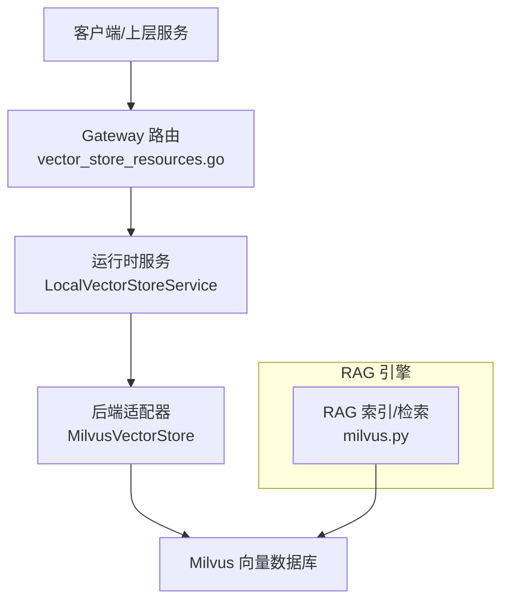
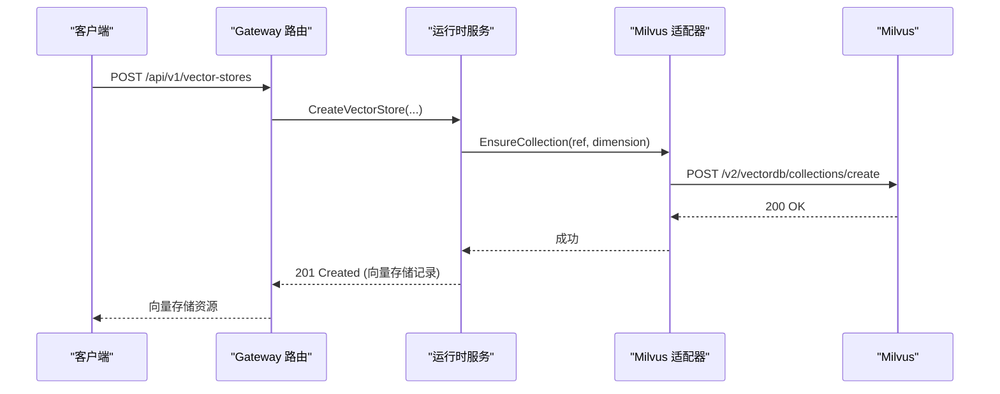
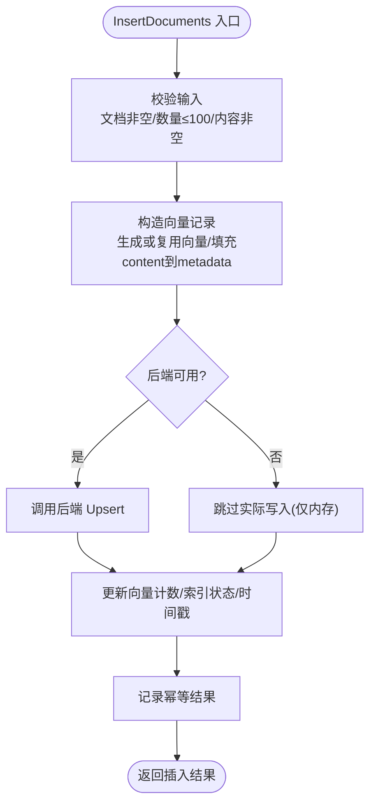
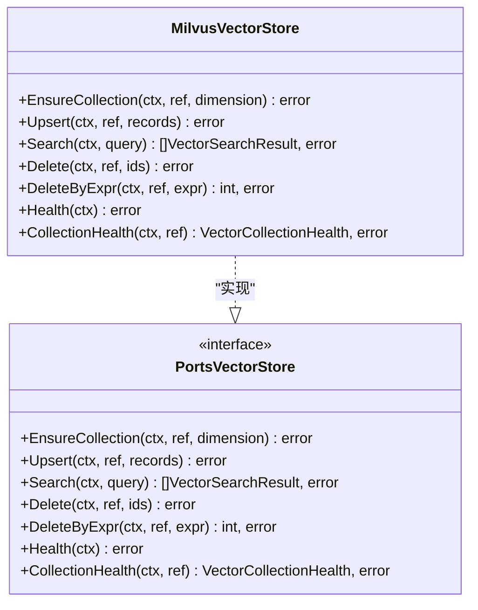
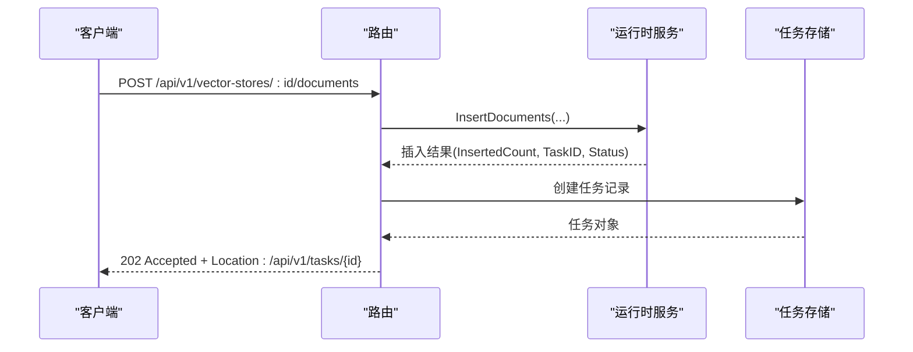
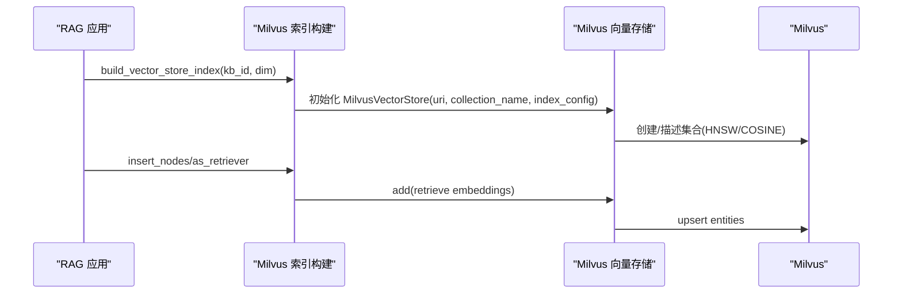
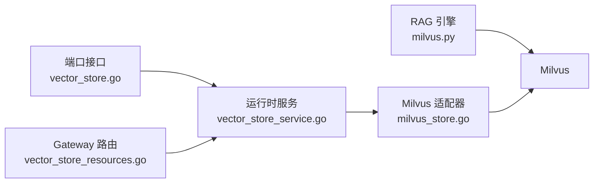

# 向量存储接口

<cite>
**本文引用的文件**
- [repo/pkg/ports/vector_store.go](file://repo/pkg/ports/vector_store.go)
- [repo/pkg/adapters/runtime/vector_store_service.go](file://repo/pkg/adapters/runtime/vector_store_service.go)
- [repo/pkg/adapters/vectorstore/milvus_store.go](file://repo/pkg/adapters/vectorstore/milvus_store.go)
- [repo/services/ani-gateway/vector_store_runtime.go](file://repo/services/ani-gateway/vector_store_runtime.go)
- [repo/services/ani-gateway/internal/router/vector_store_resources.go](file://repo/services/ani-gateway/internal/router/vector_store_resources.go)
- [repo/ai/rag-engine/app/core/milvus.py](file://repo/ai/rag-engine/app/core/milvus.py)
</cite>

## 目录
1. [简介](#简介)
2. [项目结构](#项目结构)
3. [核心组件](#核心组件)
4. [架构总览](#架构总览)
5. [详细组件分析](#详细组件分析)
6. [依赖关系分析](#依赖关系分析)
7. [性能与调优](#性能与调优)
8. [故障处理指南](#故障处理指南)
9. [结论](#结论)
10. [附录：RAG 使用模式与最佳实践](#附录rag-使用模式与最佳实践)

## 简介
本文件面向“向量存储接口”的抽象设计与实现，覆盖集合管理、向量索引、相似度搜索等核心能力；说明 Milvus 后端的适配器实现；给出向量数据生命周期管理、批量操作与查询优化建议；并提供 RAG 场景下的使用模式、性能调优与故障处理指南。文档基于仓库中 Go 服务（端口定义、运行时服务、Milvus 适配器、Gateway 路由）以及 Python RAG 引擎对 Milvus 的直接调用进行梳理。

## 项目结构
围绕向量存储的关键代码分布在以下位置：
- 端口与领域模型：定义统一的向量存储接口、资源状态、请求/响应结构
- 运行时服务：提供幂等、校验、元数据持久化、与后端适配器的编排
- Milvus 适配器：通过 HTTP REST v2 协议与 Milvus 交互，封装集合创建、Upsert、搜索、删除与健康检查
- Gateway 路由：暴露 REST API，将外部请求映射到运行时服务
- RAG 引擎：Python 侧直接通过 LlamaIndex/Milvus 客户端构建集合与索引，用于检索增强生成

图表来源
- [repo/services/ani-gateway/internal/router/vector_store_resources.go:128-145](file://repo/services/ani-gateway/internal/router/vector_store_resources.go#L128-L145)
- [repo/pkg/adapters/runtime/vector_store_service.go:17-27](file://repo/pkg/adapters/runtime/vector_store_service.go#L17-L27)
- [repo/pkg/adapters/vectorstore/milvus_store.go:26-46](file://repo/pkg/adapters/vectorstore/milvus_store.go#L26-L46)
- [repo/ai/rag-engine/app/core/milvus.py:111-153](file://repo/ai/rag-engine/app/core/milvus.py#L111-L153)

章节来源
- [repo/pkg/ports/vector_store.go:8-191](file://repo/pkg/ports/vector_store.go#L8-L191)
- [repo/services/ani-gateway/internal/router/vector_store_resources.go:128-145](file://repo/services/ani-gateway/internal/router/vector_store_resources.go#L128-L145)
- [repo/pkg/adapters/runtime/vector_store_service.go:17-27](file://repo/pkg/adapters/runtime/vector_store_service.go#L17-L27)
- [repo/pkg/adapters/vectorstore/milvus_store.go:26-46](file://repo/pkg/adapters/vectorstore/milvus_store.go#L26-L46)
- [repo/ai/rag-engine/app/core/milvus.py:111-153](file://repo/ai/rag-engine/app/core/milvus.py#L111-L153)

## 核心组件
- 端口接口与数据模型：定义 VectorStore、VectorStoreService、VectorStoreResourceStore 及相关的记录、请求、搜索结果、健康状态等
- 运行时服务 LocalVectorStoreService：负责参数校验、幂等控制、状态机推进、与后端适配器的协调
- Milvus 适配器 MilvusVectorStore：通过 HTTP REST v2 与 Milvus 通信，实现集合创建、Upsert、Search、Delete、健康检查
- Gateway 路由：对外暴露 REST API，统一错误码与任务返回
- RAG 引擎：通过 LlamaIndex 的 Milvus 客户端直接创建集合与 HNSW 索引，供检索增强生成使用

章节来源
- [repo/pkg/ports/vector_store.go:8-191](file://repo/pkg/ports/vector_store.go#L8-L191)
- [repo/pkg/adapters/runtime/vector_store_service.go:17-517](file://repo/pkg/adapters/runtime/vector_store_service.go#L17-L517)
- [repo/pkg/adapters/vectorstore/milvus_store.go:26-504](file://repo/pkg/adapters/vectorstore/milvus_store.go#L26-L504)
- [repo/services/ani-gateway/internal/router/vector_store_resources.go:128-469](file://repo/services/ani-gateway/internal/router/vector_store_resources.go#L128-L469)
- [repo/ai/rag-engine/app/core/milvus.py:1-187](file://repo/ai/rag-engine/app/core/milvus.py#L1-L187)

## 架构总览
整体采用“端口-适配器-运行时服务-Gateway”的分层设计：
- 端口层定义稳定契约，屏蔽具体后端差异
- 运行时服务承载业务编排、幂等与元数据管理
- 适配器层对接 Milvus（HTTP REST v2），并封装重试、超时、错误映射
- Gateway 路由提供 HTTP 接口，统一错误与任务回调

图表来源
- [repo/services/ani-gateway/internal/router/vector_store_resources.go:147-166](file://repo/services/ani-gateway/internal/router/vector_store_resources.go#L147-L166)
- [repo/pkg/adapters/runtime/vector_store_service.go:66-150](file://repo/pkg/adapters/runtime/vector_store_service.go#L66-L150)
- [repo/pkg/adapters/vectorstore/milvus_store.go:69-81](file://repo/pkg/adapters/vectorstore/milvus_store.go#L69-L81)

## 详细组件分析

### 端口与领域模型（ports.VectorStore*）
- 职责
  - 定义向量存储资源的生命周期状态（pending/ready/failed/deleting/deleted）
  - 定义集合引用、向量记录、搜索查询与结果、健康状态
  - 定义服务接口：集合管理、Upsert、搜索、删除、健康检查
  - 定义资源服务接口：创建、列表、获取、删除、重建索引、知识图谱关联、文档插入/删除
  - 定义元数据存储接口：用于持久化向量存储资源元数据（如 StoreID、维度、指标、状态等）

- 关键数据结构
  - 向量存储记录：包含租户、名称、维度、度量、嵌入模型、向量计数、索引状态、时间戳、状态与原因等
  - 搜索请求/结果：支持 TopK、过滤条件、返回内容片段与元数据
  - 健康检查：集合级就绪状态与原因

章节来源
- [repo/pkg/ports/vector_store.go:8-191](file://repo/pkg/ports/vector_store.go#L8-L191)

### 运行时服务（LocalVectorStoreService）
- 职责
  - 参数校验：租户、名称、维度、度量、TopK、文档数量与长度限制等
  - 幂等控制：创建、重建索引、链接知识库、文档插入均支持幂等键
  - 状态机推进：根据后端可用性设置 pending/ready/failed，更新索引状态与时间戳
  - 元数据持久化：可选地写入 PostgreSQL 控制面（通过 VectorStoreResourceStore）
  - 与后端适配器协作：在可用时调用 EnsureCollection/Upsert/Search/DeleteByExpr

- 典型流程
  - 创建向量存储：校验→幂等检查→创建本地记录→必要时调用后端 EnsureCollection→更新状态
  - 文档插入：校验→构造向量记录（若无预计算向量则生成伪向量）→调用后端 Upsert→更新计数与索引状态
  - 搜索：校验维度匹配与 TopK 上限→调用后端 Search→返回结果
  - 删除文档：校验表达式长度→调用后端 DeleteByExpr→返回删除计数

图表来源
- [repo/pkg/adapters/runtime/vector_store_service.go:361-432](file://repo/pkg/adapters/runtime/vector_store_service.go#L361-L432)

章节来源
- [repo/pkg/adapters/runtime/vector_store_service.go:17-517](file://repo/pkg/adapters/runtime/vector_store_service.go#L17-L517)

### Milvus 适配器（MilvusVectorStore）
- 职责
  - 通过 HTTP REST v2 与 Milvus 交互：集合创建、实体 Upsert、搜索、删除、健康检查
  - 安全集合名生成：按前缀+租户+KB 拼接，清理非法字符，保证以字母开头且长度受限
  - 多端点与重试：支持主端点与备选端点，结合可重试状态码与网络错误进行重试
  - 错误映射：将 HTTP 状态码与 Milvus 返回码映射为统一错误类型（NotFound/Invalid/Unavailable 等）
  - 过滤表达式：将 metadata 过滤条件转换为 Milvus 表达式

- 关键行为
  - EnsureCollection：使用 quick-setup schema，固定 metricType=COSINE，primaryFieldName=id，vectorFieldName=vector，idType=VarChar(max_length=256)
  - Upsert：将 VectorRecord 映射为 id、vector、content、metadata；content 单独字段，其余放入 metadata
  - Search：默认 limit=10，输出 fields 包含 metadata 与 content；支持 filter
  - Delete/DeleteByExpr：支持按 ID 列表或表达式删除，返回删除计数
  - Health/CollectionHealth：列出集合或描述集合，判断就绪状态

图表来源
- [repo/pkg/adapters/vectorstore/milvus_store.go:26-178](file://repo/pkg/adapters/vectorstore/milvus_store.go#L26-L178)
- [repo/pkg/ports/vector_store.go:157-165](file://repo/pkg/ports/vector_store.go#L157-L165)

章节来源
- [repo/pkg/adapters/vectorstore/milvus_store.go:26-504](file://repo/pkg/adapters/vectorstore/milvus_store.go#L26-L504)

### Gateway 路由（REST API）
- 暴露的向量存储资源接口
  - 列表/创建/获取/删除向量存储
  - 搜索向量存储
  - 重建索引
  - 关联/解除知识库
  - 删除前置检查
  - 批量插入/删除文档（插入返回任务 ID 与状态）
- 错误映射：将端口错误映射为 HTTP 状态码与业务错误码
- 任务机制：文档插入等操作会创建任务记录，并通过 Location 头返回任务路径

图表来源
- [repo/services/ani-gateway/internal/router/vector_store_resources.go:292-338](file://repo/services/ani-gateway/internal/router/vector_store_resources.go#L292-L338)

章节来源
- [repo/services/ani-gateway/internal/router/vector_store_resources.go:128-469](file://repo/services/ani-gateway/internal/router/vector_store_resources.go#L128-L469)

### RAG 引擎中的 Milvus 使用
- 集合命名：kb_{kb_id 去横杠}，符合 Milvus 标识符规范
- 索引配置：HNSW，metric=COSINE，M=16，efConstruction=200
- 客户端连接：启动时建立连接，失败时降级并记录日志
- 索引构建：通过 LlamaIndex 的 VectorStoreIndex.from_vector_store 包装 Milvus 向量存储，由 Index 层完成嵌入与写入

图表来源
- [repo/ai/rag-engine/app/core/milvus.py:111-186](file://repo/ai/rag-engine/app/core/milvus.py#L111-L186)

章节来源
- [repo/ai/rag-engine/app/core/milvus.py:1-187](file://repo/ai/rag-engine/app/core/milvus.py#L1-L187)

## 依赖关系分析
- 运行时服务依赖端口接口与后端适配器，可选择性地依赖元数据存储（PostgreSQL）
- Milvus 适配器依赖 HTTP 客户端与重试策略，内部维护端点列表与令牌
- Gateway 路由依赖运行时服务与任务存储，负责序列化请求与响应
- RAG 引擎直接依赖 LlamaIndex 与 pymilvus，独立于 Go 服务链路

图表来源
- [repo/pkg/ports/vector_store.go:157-191](file://repo/pkg/ports/vector_store.go#L157-L191)
- [repo/pkg/adapters/runtime/vector_store_service.go:17-27](file://repo/pkg/adapters/runtime/vector_store_service.go#L17-L27)
- [repo/pkg/adapters/vectorstore/milvus_store.go:26-46](file://repo/pkg/adapters/vectorstore/milvus_store.go#L26-L46)
- [repo/services/ani-gateway/internal/router/vector_store_resources.go:128-145](file://repo/services/ani-gateway/internal/router/vector_store_resources.go#L128-L145)
- [repo/ai/rag-engine/app/core/milvus.py:111-153](file://repo/ai/rag-engine/app/core/milvus.py#L111-L153)

章节来源
- [repo/pkg/ports/vector_store.go:157-191](file://repo/pkg/ports/vector_store.go#L157-L191)
- [repo/pkg/adapters/runtime/vector_store_service.go:17-27](file://repo/pkg/adapters/runtime/vector_store_service.go#L17-L27)
- [repo/pkg/adapters/vectorstore/milvus_store.go:26-46](file://repo/pkg/adapters/vectorstore/milvus_store.go#L26-L46)
- [repo/services/ani-gateway/internal/router/vector_store_resources.go:128-145](file://repo/services/ani-gateway/internal/router/vector_store_resources.go#L128-L145)
- [repo/ai/rag-engine/app/core/milvus.py:111-153](file://repo/ai/rag-engine/app/core/milvus.py#L111-L153)

## 性能与调优
- 集合与索引
  - 使用 HNSW 索引，COSINE 相似度，M=16，efConstruction=200（RAG 引擎侧）
  - 确保维度一致：搜索前校验向量维度与集合维度匹配
  - 合理设置 TopK：默认 10，最大 100，避免过大导致延迟上升
- 批量操作
  - 文档插入单次最多 100 条，减少多次小批次带来的开销
  - 若已有预计算向量，可直接传入以减少嵌入成本
- 过滤与元数据
  - 使用 metadata 过滤提升召回精度，注意表达式长度限制（≤512）
  - 将 content 作为单独字段存储，便于检索时返回片段
- 网络与重试
  - 适配器支持多端点与可重试状态码（429/5xx），配合请求超时控制
  - 建议在 Gateway 层配置合理的请求超时与重试策略
- 健康检查
  - 定期执行 Health/CollectionHealth，提前发现不可用集合或服务

[本节为通用指导，不直接分析具体文件]

## 故障处理指南
- 常见错误与定位
  - 维度不匹配：搜索时报错，需确认集合维度与查询向量维度一致
  - 集合不存在：CollectionHealth 返回未就绪，需先 EnsureCollection
  - 认证/权限：HTTP 401/403 或 Milvus 返回非法请求，检查 Token 与访问权限
  - 服务不可用：HTTP 503 或网络错误，触发重试或切换端点
  - 过滤器非法：表达式为空或超长，需校验并截断
- 恢复策略
  - 重建索引：RebuildVectorStoreIndex 重置索引状态与时间戳
  - 幂等重试：利用幂等键重复提交创建/插入/重建操作，避免重复副作用
  - 降级运行：无后端时，运行时服务仍可在内存中维护状态（开发/本地 profile）

章节来源
- [repo/pkg/adapters/runtime/vector_store_service.go:204-231](file://repo/pkg/adapters/runtime/vector_store_service.go#L204-L231)
- [repo/pkg/adapters/vectorstore/milvus_store.go:159-178](file://repo/pkg/adapters/vectorstore/milvus_store.go#L159-L178)
- [repo/services/ani-gateway/internal/router/vector_store_resources.go:340-376](file://repo/services/ani-gateway/internal/router/vector_store_resources.go#L340-L376)

## 结论
该向量存储接口通过清晰的端口定义、健壮的运行时服务与稳定的 Milvus 适配器，提供了集合管理、向量索引、相似度搜索、批量操作与生命周期管理能力。RAG 引擎侧通过 LlamaIndex 与 Milvus 原生客户端，实现了高效的索引构建与检索。结合幂等、重试、健康检查与错误映射，系统在生产环境中具备较好的可用性与可维护性。

[本节为总结，不直接分析具体文件]

## 附录：RAG 使用模式与最佳实践
- 使用模式
  - 索引构建：通过 build_vector_store_index 创建 HNSW+COSINE 索引，由 Index 层完成嵌入与写入
  - 检索增强：使用 as_retriever 获取相关片段，结合大模型生成回答
  - 集合命名：遵循 kb_{kb_id 去横杠} 规范，确保唯一性与兼容性
- 最佳实践
  - 保持嵌入模型一致性：写路径与读路径共享同一嵌入模型
  - 控制 TopK 与过滤：平衡召回率与延迟，合理使用 metadata 过滤
  - 监控与告警：关注集合健康与服务可用性，及时重建索引
  - 容量规划：根据向量维度与数据规模评估存储与计算资源

[本节为概念性指导，不直接分析具体文件]