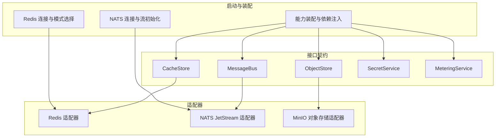
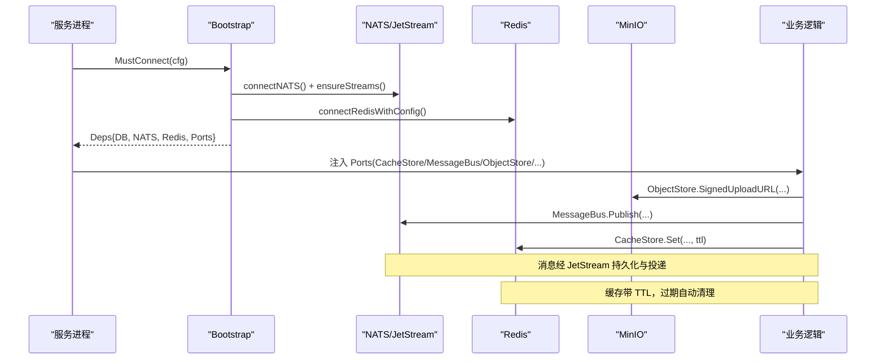
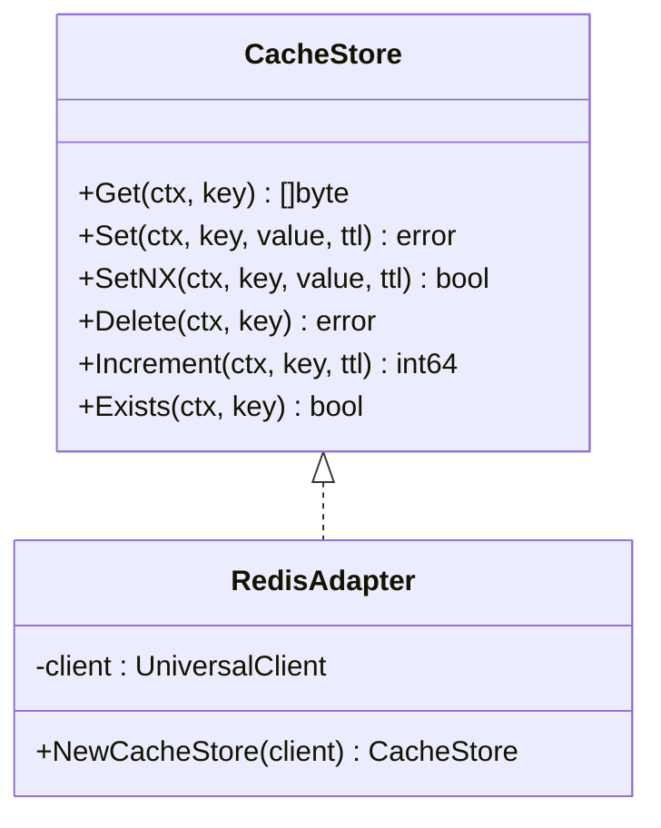
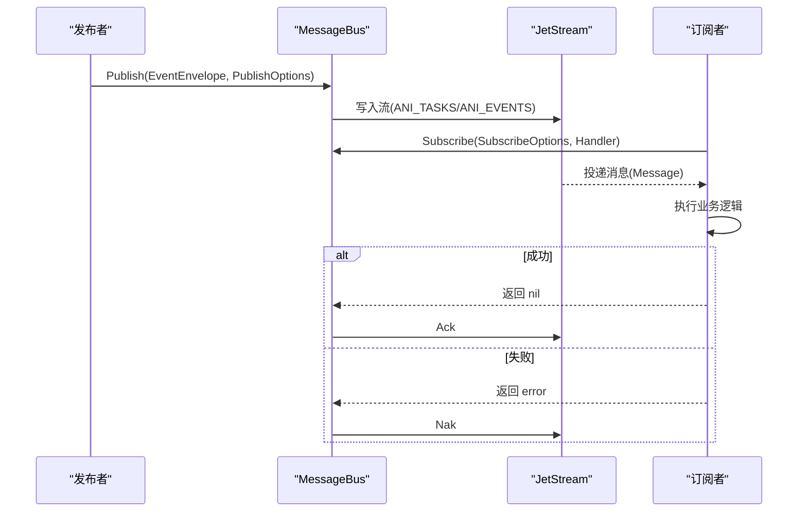
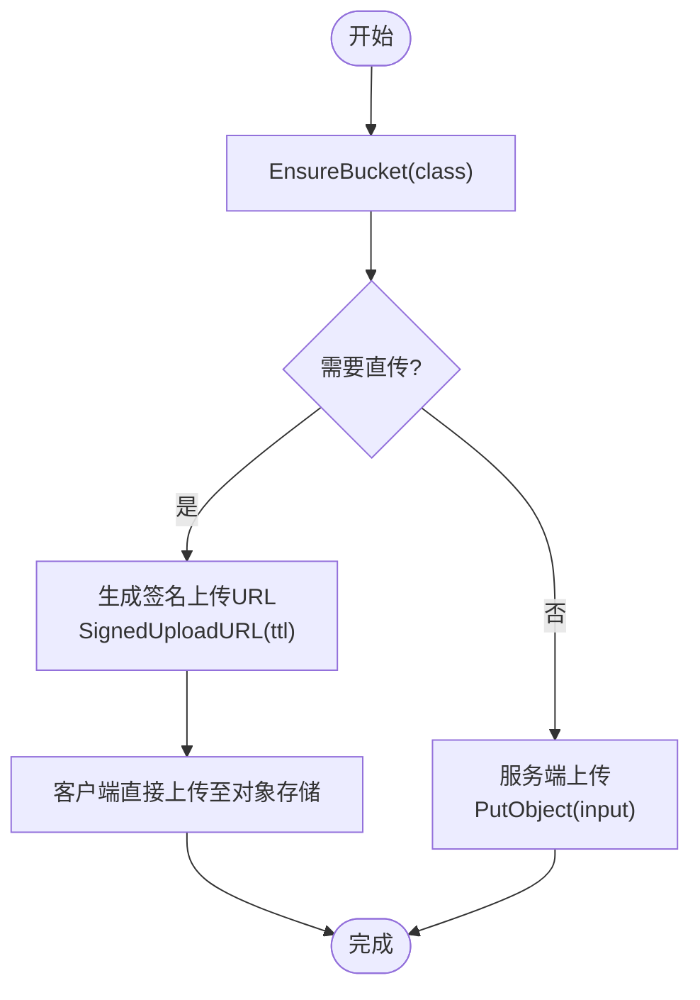
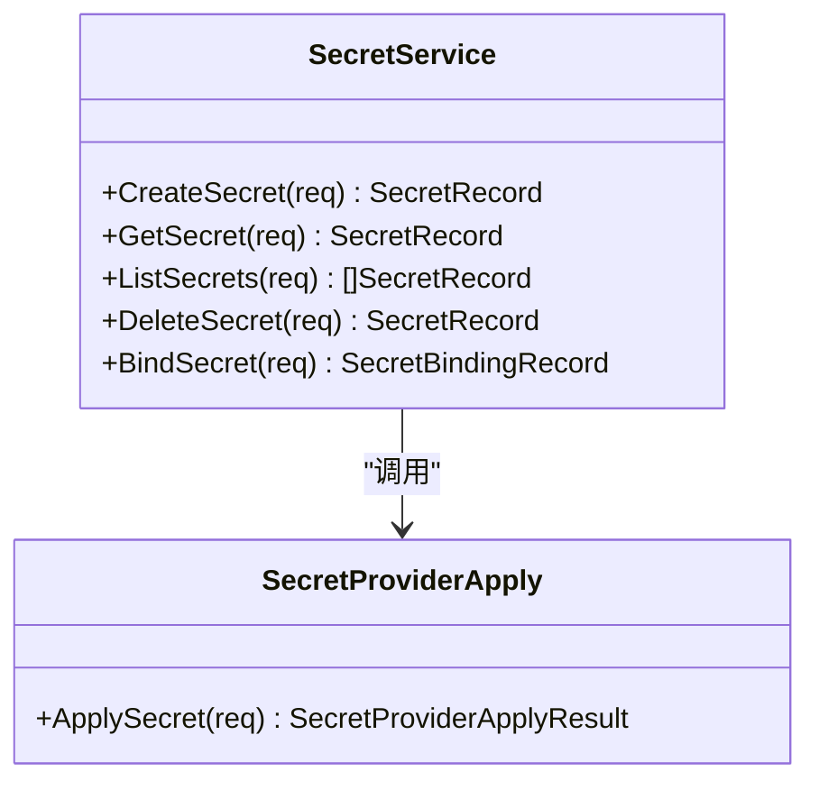
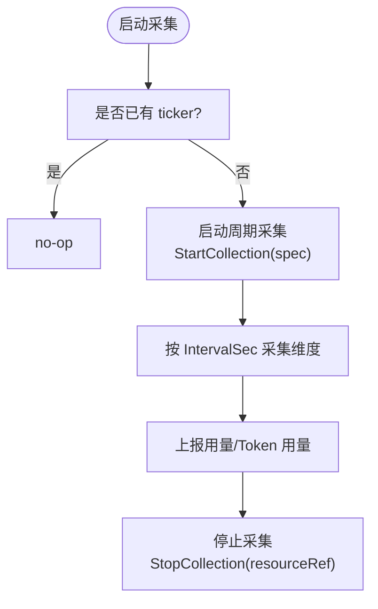
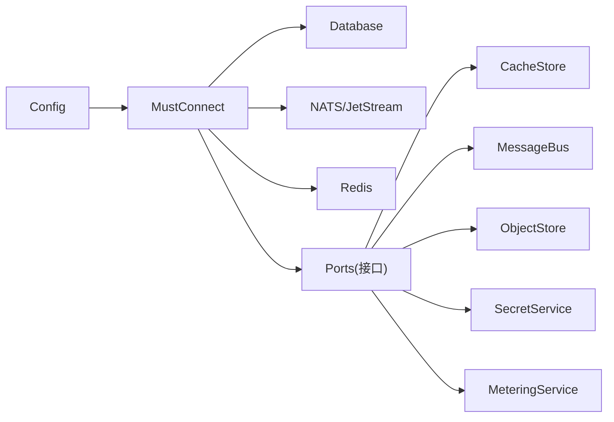

# 基础设施接口

<cite>
**本文引用的文件**
- [cache_store.go](file://repo/pkg/ports/cache_store.go)
- [message_bus.go](file://repo/pkg/ports/message_bus.go)
- [object_store.go](file://repo/pkg/ports/object_store.go)
- [secrets.go](file://repo/pkg/ports/secrets.go)
- [metering.go](file://repo/pkg/ports/metering.go)
- [redis.go](file://repo/pkg/bootstrap/redis.go)
- [nats.go](file://repo/pkg/bootstrap/nats.go)
- [server.go](file://repo/pkg/bootstrap/server.go)
- [minio_store.go](file://repo/pkg/adapters/objectstore/minio_store.go)
- [message_bus.go](file://repo/pkg/adapters/nats/message_bus.go)
</cite>

## 目录
1. [简介](#简介)
2. [项目结构](#项目结构)
3. [核心组件](#核心组件)
4. [架构总览](#架构总览)
5. [详细组件分析](#详细组件分析)
6. [依赖关系分析](#依赖关系分析)
7. [性能与高可用配置](#性能与高可用配置)
8. [监控、容量规划与成本优化](#监控容量规划与成本优化)
9. [故障转移策略](#故障转移策略)
10. [故障排查指南](#故障排查指南)
11. [结论](#结论)

## 简介
本文件面向平台工程与后端开发者，系统化说明 ANI 平台对缓存存储、消息队列、对象存储（镜像仓库）、密钥管理、计量统计等基础设施服务的统一接口设计。通过 ports 层抽象出稳定契约，由 adapters 层实现 Redis、NATS JetStream、MinIO 等中间件的具体适配；bootstrap 层负责连接初始化、健康检查与生命周期管理。文档同时给出高可用配置、性能优化与故障转移策略，以及监控、容量规划与成本优化的实践建议。

## 项目结构
- 接口契约：位于 pkg/ports，定义 CacheStore、MessageBus、ObjectStore、SecretService、MeteringService 等统一接口。
- 适配器实现：位于 pkg/adapters，提供 Redis 缓存、NATS JetStream 消息总线、MinIO 对象存储的适配实现。
- 启动与装配：位于 pkg/bootstrap，负责 NATS/Redis 连接、能力装配、gRPC/健康探针服务启动与优雅关闭。
- 服务入口：各业务服务通过 bootstrap.MustConnect 获取依赖并注册 gRPC 服务。

图表来源
- [message_bus.go:8-65](file://repo/pkg/ports/message_bus.go#L8-L65)
- [cache_store.go:8-15](file://repo/pkg/ports/cache_store.go#L8-L15)
- [object_store.go:9-56](file://repo/pkg/ports/object_store.go#L9-L56)
- [secrets.go:8-86](file://repo/pkg/ports/secrets.go#L8-L86)
- [metering.go:8-111](file://repo/pkg/ports/metering.go#L8-L111)
- [nats.go:12-94](file://repo/pkg/bootstrap/nats.go#L12-L94)
- [redis.go:15-64](file://repo/pkg/bootstrap/redis.go#L15-L64)
- [server.go:23-149](file://repo/pkg/bootstrap/server.go#L23-L149)

章节来源
- [server.go:23-149](file://repo/pkg/bootstrap/server.go#L23-L149)
- [nats.go:12-94](file://repo/pkg/bootstrap/nats.go#L12-L94)
- [redis.go:15-64](file://repo/pkg/bootstrap/redis.go#L15-L64)

## 核心组件
- 缓存存储（CacheStore）：提供 Get/Set/SetNX/Delete/Increment/Exists 等原子操作，用于会话、限流、分布式锁与热点数据缓存。
- 消息总线（MessageBus）：基于 NATS JetStream 的事件驱动模型，支持发布事件、订阅消费、消费者组与最大并发控制。
- 对象存储（ObjectStore）：统一的桶/对象操作，支持上传下载、签名 URL、元数据查询与健康检查，适用于镜像、数据集、知识库文档与品牌资源。
- 密钥管理（SecretService）：创建、读取、列出、删除密钥，绑定到目标工作负载或实例，支持幂等创建与提供者应用结果。
- 计量统计（MeteringService/MeteringCollectionService）：上报与查询用量（CPU/内存/GPU/Token），支持周期采集的生命周期管理与去重。

章节来源
- [cache_store.go:8-15](file://repo/pkg/ports/cache_store.go#L8-L15)
- [message_bus.go:8-65](file://repo/pkg/ports/message_bus.go#L8-L65)
- [object_store.go:9-56](file://repo/pkg/ports/object_store.go#L9-L56)
- [secrets.go:8-86](file://repo/pkg/ports/secrets.go#L8-L86)
- [metering.go:8-111](file://repo/pkg/ports/metering.go#L8-L111)

## 架构总览
ANI 采用“接口契约 + 适配器 + 启动装配”的分层架构：
- 接口契约层（ports）：定义跨中间件的稳定 API，屏蔽底层差异。
- 适配器层（adapters）：针对 Redis/NATS/MinIO 等具体实现，封装客户端细节与错误映射。
- 启动装配层（bootstrap）：集中处理连接、重试、流初始化、能力装配与服务生命周期。

图表来源
- [server.go:108-149](file://repo/pkg/bootstrap/server.go#L108-L149)
- [nats.go:12-94](file://repo/pkg/bootstrap/nats.go#L12-L94)
- [redis.go:27-64](file://repo/pkg/bootstrap/redis.go#L27-L64)
- [object_store.go:47-56](file://repo/pkg/ports/object_store.go#L47-L56)
- [message_bus.go:62-65](file://repo/pkg/ports/message_bus.go#L62-L65)
- [cache_store.go:8-15](file://repo/pkg/ports/cache_store.go#L8-L15)

## 详细组件分析

### 缓存存储（CacheStore）
- 职责：提供键值缓存的读写、存在性判断与原子自增，支持 TTL。
- 关键方法：Get/Set/SetNX/Delete/Increment/Exists。
- 典型用途：分布式锁、请求去重、限流计数、热点数据缓存。
- 适配器：Redis 适配器实现上述接口，使用 go-redis UniversalClient 以支持单机/Sentinel/Cluster。

图表来源
- [cache_store.go:8-15](file://repo/pkg/ports/cache_store.go#L8-L15)
- [redis.go:50-64](file://repo/pkg/bootstrap/redis.go#L50-L64)

章节来源
- [cache_store.go:8-15](file://repo/pkg/ports/cache_store.go#L8-L15)
- [redis.go:50-64](file://repo/pkg/bootstrap/redis.go#L50-L64)

### 消息总线（MessageBus）
- 职责：发布事件与订阅消费，基于 NATS JetStream，支持消费者组、最大并发、确认语义。
- 关键类型：EventEnvelope、PublishOptions、SubscribeOptions、Message、MessageHandler、Subscription。
- 确认语义：handler 返回 nil → Ack；返回 error → Nak；panic → 捕获后 Nak。
- 流初始化：启动时确保 ANI_TASKS（WorkQueuePolicy）与 ANI_EVENTS（InterestPolicy）两个流存在。

图表来源
- [message_bus.go:8-65](file://repo/pkg/ports/message_bus.go#L8-L65)
- [nats.go:12-94](file://repo/pkg/bootstrap/nats.go#L12-L94)
- [message_bus.go](file://repo/pkg/adapters/nats/message_bus.go)

章节来源
- [message_bus.go:8-65](file://repo/pkg/ports/message_bus.go#L8-L65)
- [nats.go:12-94](file://repo/pkg/bootstrap/nats.go#L12-L94)

### 对象存储（ObjectStore）
- 职责：统一的桶/对象操作，支持直传签名 URL、元数据查询与健康检查。
- 关键类型：BucketClass、ObjectRef、ObjectMetadata、SignedURL、PutObjectInput。
- 适配器：MinIO 适配器实现 Put/Get/Delete/Stat/SignedURL 等。

图表来源
- [object_store.go:9-56](file://repo/pkg/ports/object_store.go#L9-L56)
- [minio_store.go](file://repo/pkg/adapters/objectstore/minio_store.go)

章节来源
- [object_store.go:9-56](file://repo/pkg/ports/object_store.go#L9-L56)
- [minio_store.go](file://repo/pkg/adapters/objectstore/minio_store.go)

### 密钥管理（SecretService）
- 职责：密钥的创建、读取、列出、删除与绑定；支持幂等创建与提供者应用结果。
- 关键类型：SecretCreateRequest、SecretRecord、SecretBindingRecord、SecretProviderApplyResult。
- 使用场景：为工作负载注入凭据、挂载路径或环境变量前缀。

图表来源
- [secrets.go:8-86](file://repo/pkg/ports/secrets.go#L8-L86)

章节来源
- [secrets.go:8-86](file://repo/pkg/ports/secrets.go#L8-L86)

### 计量统计（MeteringService / MeteringCollectionService）
- 职责：上报 Token/CPU/内存/GPU 用量，查询聚合结果；周期采集的生命周期管理（Start/Stop）。
- 关键类型：MeteringUsageQueryRequest、TokenUsageReportRequest、CollectionSpec、MeteringUsageResult。
- 幂等与去重：进程内 map 按 ResourceRef 去重；DB UNIQUE 约束兜底重启/重放。

图表来源
- [metering.go:8-111](file://repo/pkg/ports/metering.go#L8-L111)

章节来源
- [metering.go:8-111](file://repo/pkg/ports/metering.go#L8-L111)

## 依赖关系分析
- 启动依赖：服务启动时依次连接数据库、NATS、Redis，再装配各端口能力。
- 适配器依赖：
  - Redis 适配器依赖 go-redis UniversalClient，支持 standalone/sentinel/cluster。
  - NATS 适配器依赖 nats.go，启用 JetStream 并确保核心流。
  - MinIO 适配器对接对象存储端点与认证信息。
- 服务间解耦：业务代码仅依赖 ports 接口，不感知具体中间件。

图表来源
- [server.go:23-149](file://repo/pkg/bootstrap/server.go#L23-L149)
- [nats.go:12-94](file://repo/pkg/bootstrap/nats.go#L12-L94)
- [redis.go:15-64](file://repo/pkg/bootstrap/redis.go#L15-L64)

章节来源
- [server.go:23-149](file://repo/pkg/bootstrap/server.go#L23-L149)

## 性能与高可用配置
- Redis
  - 模式：standalone/sentinel/cluster，根据部署规模选择；集群需至少两个地址。
  - 连接：Ping 校验连通性，超时 10s；支持 URL 或显式参数。
  - 建议：生产环境开启 Sentinel 或 Cluster；合理设置 TTL 避免雪崩；增量操作用于限流与计数器。
- NATS JetStream
  - 连接：带重试与重连等待，最多 5 次重连；初始化 JetStream 上下文。
  - 流：ANI_TASKS（WorkQueuePolicy）适合点对点任务；ANI_EVENTS（InterestPolicy）适合多消费者广播。
  - 建议：生产环境将流副本数提升至 3；合理设置 MaxInflight/AckWait/MaxDeliver；避免长事务阻塞消费。
- 对象存储（MinIO）
  - 直传：优先使用 SignedUploadURL 让客户端直传，降低网关压力。
  - 桶：EnsureBucket 保证桶存在；按 BucketClass 隔离不同资源。
  - 建议：配置多端点与区域；使用 HTTPS；大文件分片上传；合理设置生命周期规则。
- 密钥管理
  - 幂等：IdempotencyKey 防止重复创建；ProviderApply 返回已应用状态与资源引用。
  - 建议：最小权限原则；定期轮换；敏感字段加密存储。
- 计量统计
  - 采集：IntervalSec 控制采样频率；Dimensions 描述资源类型与来源。
  - 建议：按租户与资源维度聚合；对高频指标进行降采样；结合 Prometheus 做实时告警。

章节来源
- [redis.go:15-125](file://repo/pkg/bootstrap/redis.go#L15-L125)
- [nats.go:12-94](file://repo/pkg/bootstrap/nats.go#L12-L94)
- [object_store.go:9-56](file://repo/pkg/ports/object_store.go#L9-L56)
- [secrets.go:8-86](file://repo/pkg/ports/secrets.go#L8-L86)
- [metering.go:8-111](file://repo/pkg/ports/metering.go#L8-L111)

## 监控、容量规划与成本优化
- 监控
  - 健康探针：RunHealthProbe/RunGRPC 暴露健康检查端点，集成依赖探测与控制器指标。
  - 日志：结构化日志记录连接、错误与恢复过程。
  - 指标：建议接入 Prometheus，暴露 NATS 流积压、Redis 命中率、对象存储吞吐、密钥操作次数、计量上报延迟。
- 容量规划
  - Redis：根据峰值 QPS 与内存占用评估节点规格；热点 Key 打散；使用 Pipeline 批量操作。
  - NATS：根据消息吞吐与保留策略评估磁盘与副本；合理设置 MaxAge 与存储类型。
  - 对象存储：按对象大小分布与访问热度选择存储层级；冷热分层降低成本。
  - 密钥：限制密钥数量与绑定范围；审计与告警异常访问。
  - 计量：按租户与资源维度设定采样间隔；对高频指标进行聚合与归档。
- 成本优化
  - 缓存：合理 TTL 与失效策略；避免全量刷新；使用 SetNX 实现轻量锁。
  - 消息：按需消费与退避；减少无效重投；合并小消息。
  - 对象存储：生命周期规则自动清理；压缩与去重；CDN 加速静态资源。
  - 密钥：共享密钥复用；避免冗余绑定。
  - 计量：离线批处理与近线分析分离；历史数据归档到低成本存储。

章节来源
- [server.go:387-480](file://repo/pkg/bootstrap/server.go#L387-L480)
- [nats.go:56-94](file://repo/pkg/bootstrap/nats.go#L56-L94)
- [redis.go:80-125](file://repo/pkg/bootstrap/redis.go#L80-L125)

## 故障转移策略
- Redis
  - Standalone：单点故障风险高，建议升级至 Sentinel 或 Cluster。
  - Sentinel：主从切换透明；配置 MasterName 与哨兵凭据。
  - Cluster：多分片高可用；至少两节点；注意跨槽操作限制。
- NATS
  - 连接重试：RetryOnFailedConnect、MaxReconnects、ReconnectWait。
  - 流高可用：生产环境将流副本数提升至 3；关注 InterestPolicy 下未消费消息保留。
- 对象存储
  - 多端点：配置多个 Endpoint；客户端侧重试与回退。
  - 签名 URL：短时效；失败重试需重新生成。
- 密钥管理
  - 幂等：IdempotencyKey 防重；ProviderApply 返回已应用状态。
  - 降级：本地缓存只读密钥（短期），在 Provider 不可用时降级为只读。
- 计量统计
  - 采集器：进程内 map 去重；DB UNIQUE 约束兜底；StopCollection 幂等。
  - 上报：失败重试与退避；批量上报降低开销。

章节来源
- [redis.go:80-125](file://repo/pkg/bootstrap/redis.go#L80-L125)
- [nats.go:12-94](file://repo/pkg/bootstrap/nats.go#L12-L94)
- [object_store.go:47-56](file://repo/pkg/ports/object_store.go#L47-L56)
- [secrets.go:60-86](file://repo/pkg/ports/secrets.go#L60-L86)
- [metering.go:83-111](file://repo/pkg/ports/metering.go#L83-L111)

## 故障排查指南
- 连接问题
  - Redis：检查 URL/Mode/Addrs/MasterName/凭据；确认 Ping 成功；查看模式校验错误。
  - NATS：确认 URL 可达；观察重试日志；检查 JetStream 初始化与流是否存在。
- 消息问题
  - 未消费：检查消费者组名称、队列名、最大并发与 AckWait；确认流策略与保留时间。
  - 重复消费：确认 WorkQueuePolicy 与 InterestPolicy 的差异；检查幂等键。
- 对象存储问题
  - 直传失败：检查签名 URL 有效期与权限；确认客户端网络与端点可达。
  - 桶不存在：调用 EnsureBucket；检查 BucketPrefix 与 Region。
- 密钥问题
  - 重复创建：检查 IdempotencyKey；查看 ProviderApply 结果与 Reason。
  - 绑定失败：核对 TargetType/TargetID/MountPath/EnvPrefix。
- 计量问题
  - 采集未停止：确认 StopCollection 被调用；检查 ResourceRef 一致性。
  - 上报重复：利用唯一约束与幂等键；检查 Source/Model/RequestID。

章节来源
- [redis.go:80-125](file://repo/pkg/bootstrap/redis.go#L80-L125)
- [nats.go:12-94](file://repo/pkg/bootstrap/nats.go#L12-L94)
- [object_store.go:47-56](file://repo/pkg/ports/object_store.go#L47-L56)
- [secrets.go:60-86](file://repo/pkg/ports/secrets.go#L60-L86)
- [metering.go:83-111](file://repo/pkg/ports/metering.go#L83-L111)

## 结论
通过 ports 层统一接口与 adapters 层具体实现，ANI 平台实现了缓存、消息、对象存储、密钥与计量的松耦合与可替换性。bootstrap 层提供健壮的连接初始化与生命周期管理，配合高可用配置、性能优化与故障转移策略，满足生产环境的稳定性与可扩展性需求。建议在部署中遵循本文的配置与实践指南，并结合监控与容量规划持续优化成本与性能。