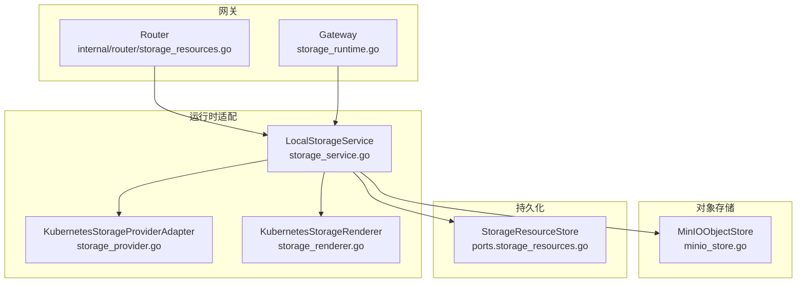
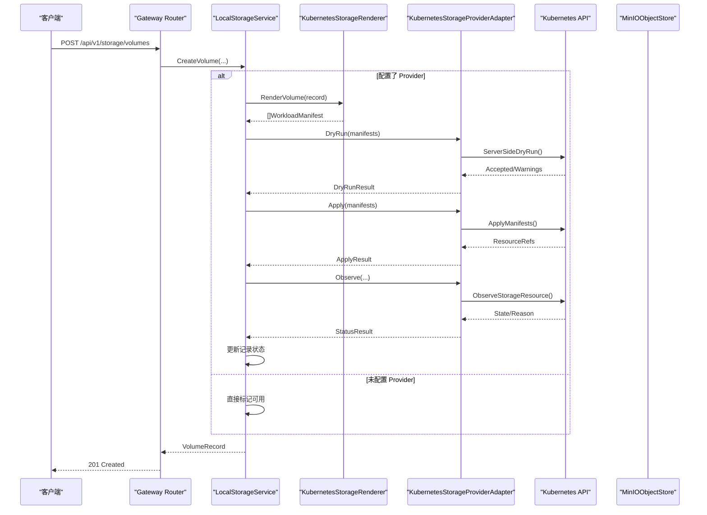
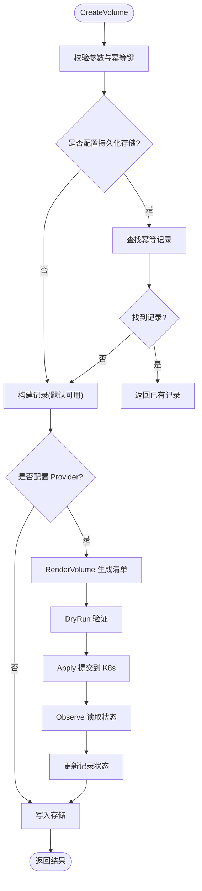
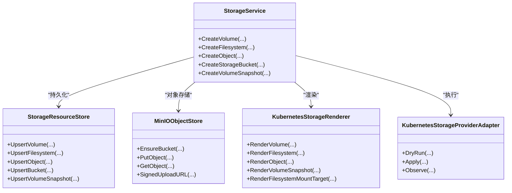

# 存储资源接口

<cite>
**本文引用的文件**
- [storage_resources.go](file://repo/pkg/ports/storage_resources.go)
- [storage_service.go](file://repo/pkg/adapters/runtime/storage_service.go)
- [storage_provider.go](file://repo/pkg/adapters/runtime/storage_provider.go)
- [storage_renderer.go](file://repo/pkg/adapters/runtime/storage_renderer.go)
- [minio_store.go](file://repo/pkg/adapters/objectstore/minio_store.go)
- [storage_runtime.go](file://repo/services/ani-gateway/storage_runtime.go)
- [storage_resources.go](file://repo/services/ani-gateway/internal/router/storage_resources.go)
</cite>

## 目录
1. [简介](#简介)
2. [项目结构](#项目结构)
3. [核心组件](#核心组件)
4. [架构总览](#架构总览)
5. [详细组件分析](#详细组件分析)
6. [依赖关系分析](#依赖关系分析)
7. [性能考虑](#性能考虑)
8. [故障排查指南](#故障排查指南)
9. [结论](#结论)
10. [附录：API与最佳实践](#附录api与最佳实践)

## 简介
本文件面向“存储资源接口”的统一抽象设计，覆盖块存储、对象存储、文件存储的跨后端能力建模，包括存储卷管理、挂载操作、快照备份等核心功能。同时说明不同存储后端（Ceph、MinIO、NFS等）的适配器实现模式，给出生命周期管理、错误处理策略与性能优化建议，并提供可直接参考的API调用路径与最佳实践。

## 项目结构
存储子系统由三层组成：
- 端口定义层（ports）：统一抽象接口与数据模型，屏蔽后端差异。
- 运行时适配层（adapters/runtime）：本地服务实现、Kubernetes Provider 适配、渲染器、状态协调器等。
- 网关装配层（services/ani-gateway）：根据环境变量装配具体后端（MinIO、Kubernetes/Ceph/NFS），暴露HTTP API路由。

图表来源
- [storage_runtime.go:75-157](file://repo/services/ani-gateway/storage_runtime.go#L75-L157)
- [storage_service.go:18-119](file://repo/pkg/adapters/runtime/storage_service.go#L18-L119)
- [storage_provider.go:11-48](file://repo/pkg/adapters/runtime/storage_provider.go#L11-L48)
- [storage_renderer.go:11-15](file://repo/pkg/adapters/runtime/storage_renderer.go#L11-L15)
- [minio_store.go:31-105](file://repo/pkg/adapters/objectstore/minio_store.go#L31-L105)

章节来源
- [storage_runtime.go:75-157](file://repo/services/ani-gateway/storage_runtime.go#L75-L157)
- [storage_resources.go:487-534](file://repo/pkg/ports/storage_resources.go#L487-L534)

## 核心组件
- 统一接口与数据模型（ports）
  - StorageService：统一的块/文件/对象存储操作入口，包含创建、列举、获取、删除、扩展、挂载/卸载、快照、生命周期规则等。
  - StorageResourceStore：资源持久化接口，支持幂等查询与状态更新。
  - StorageProviderRenderer/Apply/DryRun/StatusReader：将资源记录渲染为工作负载清单，执行干跑、应用与状态观察。
  - 关键数据结构：Volume/Filesystem/Object/Bucket/Snapshot/MountTarget 等记录类型及请求/响应体。

- 运行时服务（adapters/runtime）
  - LocalStorageService：内存或可选持久化的服务实现，负责幂等控制、状态机推进、Provider 编排（Render -> DryRun -> Apply -> Observe）。
  - KubernetesStorageProviderAdapter：对接 Kubernetes REST 客户端，完成干跑、应用与状态观察。
  - KubernetesStorageRenderer：将 Volume/Filesystem/Object/Snapshot/MountTarget 渲染为 PVC、Service、自定义 CRD 等清单。

- 对象存储适配器（adapters/objectstore）
  - MinIOObjectStore：实现 S3 兼容的对象存储协议，提供健康检查、桶管理、对象上传/下载/删除、签名URL等。

- 网关装配（services/ani-gateway）
  - storage_runtime.go：根据 STORAGE_PROVIDER 与 OBJECT_STORE_PROVIDER 环境变量装配 MinIO 与 Kubernetes Provider，并返回 StorageService。
  - internal/router/storage_resources.go：HTTP 路由与请求/响应结构映射，调用 StorageService 完成业务逻辑。

章节来源
- [storage_resources.go:487-684](file://repo/pkg/ports/storage_resources.go#L487-L684)
- [storage_service.go:18-119](file://repo/pkg/adapters/runtime/storage_service.go#L18-L119)
- [storage_provider.go:11-48](file://repo/pkg/adapters/runtime/storage_provider.go#L11-L48)
- [storage_renderer.go:11-181](file://repo/pkg/adapters/runtime/storage_renderer.go#L11-L181)
- [minio_store.go:31-105](file://repo/pkg/adapters/objectstore/minio_store.go#L31-L105)
- [storage_runtime.go:75-157](file://repo/services/ani-gateway/storage_runtime.go#L75-L157)
- [storage_resources.go:16-129](file://repo/services/ani-gateway/internal/router/storage_resources.go#L16-L129)

## 架构总览
存储资源通过统一接口对外暴露，内部以“渲染 + Provider 执行”的模式对接底层：
- 块存储：通过 PVC 在 Kubernetes 中由 CSI（如 Rook-Ceph RBD）提供；快照通过 VolumeSnapshot。
- 文件存储：通过 NFS 或 CephFS 的 PVC；挂载目标通过 Service 暴露 IP。
- 对象存储：通过 MinIO 直连 S3 协议，提供桶与对象操作。

图表来源
- [storage_service.go:121-224](file://repo/pkg/adapters/runtime/storage_service.go#L121-L224)
- [storage_provider.go:50-134](file://repo/pkg/adapters/runtime/storage_provider.go#L50-L134)
- [storage_renderer.go:17-37](file://repo/pkg/adapters/runtime/storage_renderer.go#L17-L37)
- [storage_runtime.go:110-152](file://repo/services/ani-gateway/storage_runtime.go#L110-L152)

## 详细组件分析

### 统一接口与数据模型（ports）
- StorageService 接口定义了块/文件/对象的完整生命周期操作：
  - 块存储：CreateVolume/ListVolumes/GetVolume/DeleteVolume/ExpandVolume/MountVolume/UnmountVolume/CreateVolumeFromSnapshot/SetVolumeAutoSnapshotPolicy/GetVolumeOSInitGuide/CompleteVolumeOSInit。
  - 文件存储：CreateFilesystem/ListFilesystems/GetFilesystem/DeleteFilesystem/ExpandFilesystem/CreateFilesystemMountTarget/MountFilesystem/UnmountFilesystem/GetFilesystemMountCommand。
  - 对象存储：CreateObject/ListObjects/GetObject/DeleteObject；Bucket 管理：CreateStorageBucket/ListStorageBuckets/GetStorageBucket/ListBucketObjects/DeleteBucketObject/CreateBucketPrefix/GenerateBucketObjectPresignedURL/SetStorageBucketACL/SetStorageBucketClass/ListStorageBucketLifecycleRules/SetStorageBucketLifecycleRules/CreateStorageBucketLifecycleRule/DeleteStorageBucketLifecycleRule；以及对象上传/下载临时链接。
  - 快照与挂载目标：CreateVolumeSnapshot/ListVolumeSnapshots/ListFilesystemMountTargets。
- StorageResourceStore 提供幂等查询与状态更新，保证并发安全与可重入性。
- Provider 相关接口：Renderer/Apply/DryRun/StatusReader 与 Reconcile 流程，确保声明式一致性与可观测性。

章节来源
- [storage_resources.go:487-684](file://repo/pkg/ports/storage_resources.go#L487-L684)

### 运行时服务（LocalStorageService）
- 幂等与并发控制：使用 idempotency key 与内存锁保护关键路径，避免重复创建与竞态。
- Provider 编排：当配置了 Provider 时，按 Render -> DryRun -> Apply -> Observe 顺序执行，失败则回滚状态并记录原因。
- 状态机：资源状态从 pending/available/failed/deleting/deleted 流转，附带 reason 便于排障。
- 文件系统挂载目标：创建 Service 暴露 IP，支持 NFS/CephFS 协议。
- 对象存储集成：结合 MinIO 提供桶与对象元数据管理，列表分页采用 cursor。

图表来源
- [storage_service.go:121-224](file://repo/pkg/adapters/runtime/storage_service.go#L121-L224)
- [storage_provider.go:50-134](file://repo/pkg/adapters/runtime/storage_provider.go#L50-L134)

章节来源
- [storage_service.go:121-224](file://repo/pkg/adapters/runtime/storage_service.go#L121-L224)
- [storage_service.go:530-798](file://repo/pkg/adapters/runtime/storage_service.go#L530-L798)

### Provider 适配（KubernetesStorageProviderAdapter）
- DryRun：调用 K8s 服务端干跑，返回是否接受、警告与资源引用。
- Apply：仅在 dry-run 通过后执行，提交清单并返回资源引用。
- Observe：读取实际状态，校验身份与引用完整性，填充缺失字段。
- 校验：严格校验 tenant/user/resource/provider/manifest 一致性。

章节来源
- [storage_provider.go:50-134](file://repo/pkg/adapters/runtime/storage_provider.go#L50-L134)
- [storage_provider.go:136-228](file://repo/pkg/adapters/runtime/storage_provider.go#L136-L228)

### 渲染器（KubernetesStorageRenderer）
- Volume：渲染为 PVC，指定 storageClassName、访问模式与资源请求。
- Filesystem：根据协议选择 StorageClass（NFS/CephFS），标注注解以便控制器识别。
- Object：渲染为自定义 CRD（ObjectMetadata），用于对象元数据跟踪。
- Snapshot：渲染为 VolumeSnapshot，关联源 PVC。
- MountTarget：渲染为 Service，暴露 NFS 端口并标注文件系统 ID 与子网信息。

章节来源
- [storage_renderer.go:17-181](file://repo/pkg/adapters/runtime/storage_renderer.go#L17-L181)

### 对象存储适配器（MinIOObjectStore）
- 能力：健康检查、桶存在性检查与创建、对象上传/下载/删除/统计、签名上传/下载 URL。
- 多端点重试：对可重试状态码进行端点轮询与重试。
- 鉴权：S3 V4 签名，支持 session token。
- 公共端点：支持独立 publicEndpoint 生成外部可访问的签名 URL。

章节来源
- [minio_store.go:31-105](file://repo/pkg/adapters/objectstore/minio_store.go#L31-L105)
- [minio_store.go:127-313](file://repo/pkg/adapters/objectstore/minio_store.go#L127-L313)
- [minio_store.go:333-389](file://repo/pkg/adapters/objectstore/minio_store.go#L333-L389)

### 网关装配与路由
- 装配：根据 STORAGE_PROVIDER 与 OBJECT_STORE_PROVIDER 环境变量装配 MinIO 与 Kubernetes Provider，注入 StorageService。
- 路由：将 HTTP 请求转换为 StorageService 调用，封装请求/响应结构。

章节来源
- [storage_runtime.go:75-157](file://repo/services/ani-gateway/storage_runtime.go#L75-L157)
- [storage_resources.go:16-129](file://repo/services/ani-gateway/internal/router/storage_resources.go#L16-L129)

## 依赖关系分析
- StorageService 依赖：
  - StorageResourceStore：持久化资源记录。
  - ObjectStore：对象存储（当前实现为 MinIO）。
  - ProviderRenderer/Apply/DryRun/StatusReader：Kubernetes Provider 适配。
- Gateway 依赖：
  - 环境变量驱动装配，支持 local/kubernetes_rest 模式。
  - 若启用 provider，需配置用户ID与权限证明。

图表来源
- [storage_resources.go:487-684](file://repo/pkg/ports/storage_resources.go#L487-L684)
- [storage_service.go:18-119](file://repo/pkg/adapters/runtime/storage_service.go#L18-L119)
- [storage_provider.go:11-48](file://repo/pkg/adapters/runtime/storage_provider.go#L11-L48)
- [storage_renderer.go:11-181](file://repo/pkg/adapters/runtime/storage_renderer.go#L11-L181)
- [minio_store.go:31-105](file://repo/pkg/adapters/objectstore/minio_store.go#L31-L105)

章节来源
- [storage_resources.go:487-684](file://repo/pkg/ports/storage_resources.go#L487-L684)
- [storage_service.go:18-119](file://repo/pkg/adapters/runtime/storage_service.go#L18-L119)

## 性能考虑
- 幂等与并发：
  - 使用 idempotency key 与内存锁避免重复创建与并发冲突。
  - 操作级幂等（expand/mount/unmount/auto-snapshot/os-init）减少重复开销。
- Provider 执行：
  - 先 DryRun 再 Apply，降低无效变更成本。
  - 状态观察聚合后批量更新，减少频繁写盘。
- 对象存储：
  - 多端点重试与超时策略，提升可用性。
  - 签名 URL 直传，减轻网关带宽压力。
- 列表分页：
  - 对象列表使用 cursor 分页，限制最大页大小，避免大结果集。

[本节为通用指导，不直接分析具体文件]

## 故障排查指南
- 常见错误类型：
  - 参数非法：size_gib 必须大于零、必填字段缺失等。
  - 未配置 Provider：DryRun/Apply/Observe 返回未配置错误。
  - 状态不一致：Observe 返回的资源引用与请求不匹配。
  - 网络/鉴权：MinIO 返回 401/403/429/5xx，触发重试或失败。
- 定位步骤：
  - 检查请求中的 tenant_id、resource_kind、resource_id、permission_proof 是否齐全。
  - 查看 DryRun 返回的 warnings 与 reason。
  - 确认 Provider 已正确装配（STORAGE_PROVIDER_USER_ID、STORAGE_PROVIDER_PERMISSION_PROOF）。
  - 对于对象存储，检查 endpoint、access_key、secret_key、region 与 bucket 名称合规性。

章节来源
- [storage_provider.go:136-228](file://repo/pkg/adapters/runtime/storage_provider.go#L136-L228)
- [minio_store.go:566-581](file://repo/pkg/adapters/objectstore/minio_store.go#L566-L581)
- [storage_service.go:121-224](file://repo/pkg/adapters/runtime/storage_service.go#L121-L224)

## 结论
该存储资源接口通过统一抽象与 Provider 适配模式，实现了块、文件、对象三类存储的一致化管理。基于声明式渲染与执行流程，系统具备幂等、可观测、可扩展的特性。MinIO 作为对象存储后端已实现完整能力；块/文件存储通过 Kubernetes PVC 与 CSI（如 Rook-Ceph）落地，支持快照与挂载目标。建议在生产环境开启 Provider 模式，配合 RBAC 与审计，以获得更强的隔离与治理能力。

[本节为总结，不直接分析具体文件]

## 附录：API与最佳实践

### API 概览（路径与用途）
- 块存储
  - 创建卷：POST /api/v1/storage/volumes
  - 列举卷：GET /api/v1/storage/volumes
  - 获取卷：GET /api/v1/storage/volumes/{id}
  - 删除卷：DELETE /api/v1/storage/volumes/{id}
  - 扩容卷：PATCH /api/v1/storage/volumes/{id}/expand
  - 挂载卷：POST /api/v1/storage/volumes/{id}/mount
  - 卸载卷：POST /api/v1/storage/volumes/{id}/unmount
  - 从快照创建卷：POST /api/v1/storage/volumes/from-snapshot
  - 自动快照策略：PATCH /api/v1/storage/volumes/{id}/auto-snapshot
  - OS 初始化指南：GET /api/v1/storage/volumes/{id}/os-init-guide
  - 完成 OS 初始化：POST /api/v1/storage/volumes/{id}/os-init-complete
- 文件存储
  - 创建文件系统：POST /api/v1/storage/filesystems
  - 列举/获取/删除：同上模式
  - 扩容：PATCH /api/v1/storage/filesystems/{id}/expand
  - 创建挂载目标：POST /api/v1/storage/filesystems/{id}/mount-targets
  - 挂载/卸载：POST /api/v1/storage/filesystems/{id}/mount | unmount
  - 获取挂载命令：GET /api/v1/storage/filesystems/{id}/mount-command
- 对象存储
  - 创建对象：POST /api/v1/storage/objects
  - 列举/获取/删除：同上模式
  - 桶管理：创建/列举/获取桶；列出对象；删除对象；创建前缀；生成签名 URL；设置 ACL/存储类；生命周期规则 CRUD
  - 上传/下载：POST /api/v1/storage/buckets/{bucket_id}/objects/upload | GET /api/v1/storage/objects/{object_id}/download

以上 API 的请求/响应结构定义位于路由文件中，调用时请遵循幂等键与必填字段要求。

章节来源
- [storage_resources.go:16-129](file://repo/services/ani-gateway/internal/router/storage_resources.go#L16-L129)
- [storage_resources.go:183-329](file://repo/services/ani-gateway/internal/router/storage_resources.go#L183-L329)

### 最佳实践
- 幂等性
  - 所有写操作均需提供 idempotency_key，避免重试导致重复资源。
- Provider 模式
  - 生产环境启用 Kubernetes Provider，结合 RBAC 与 FieldManager 保障多租户隔离。
- 快照与备份
  - 为重要卷启用自动快照策略，定期清理过期快照。
  - 从快照恢复时，确保新卷容量不小于源卷。
- 对象存储
  - 使用签名 URL 直传，减少网关压力；合理设置 TTL。
  - 桶名遵循 S3 规范，避免非法字符与冲突。
- 性能
  - 合理设置 StorageClass 与 IOPS；大对象分片上传（由上层 SDK 处理）。
  - 列表分页使用 cursor，限制 limit。

[本节为通用指导，不直接分析具体文件]