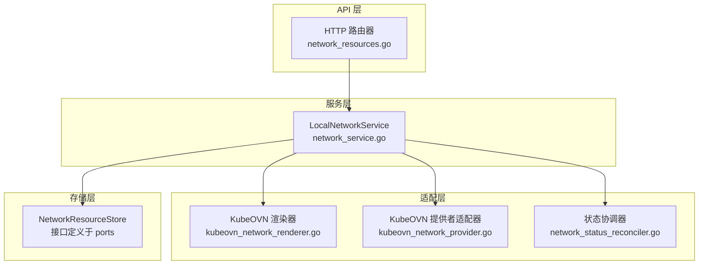
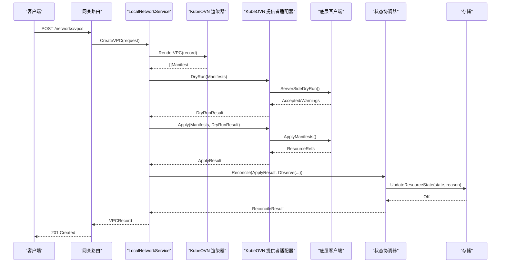
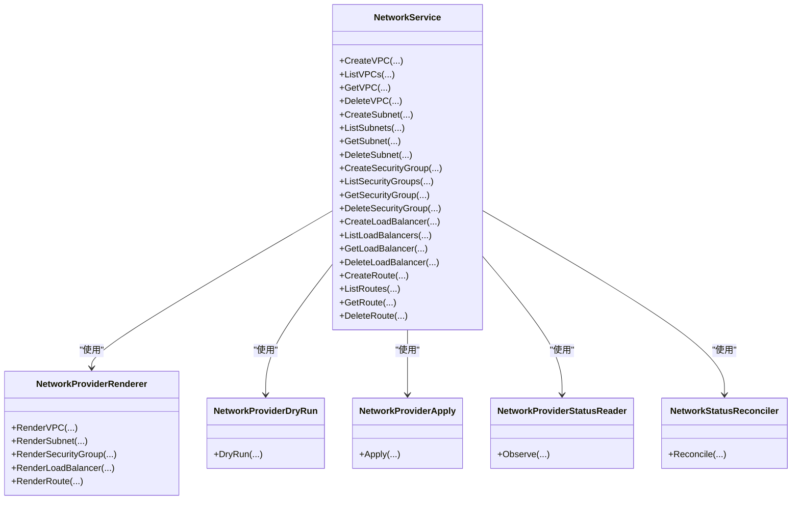
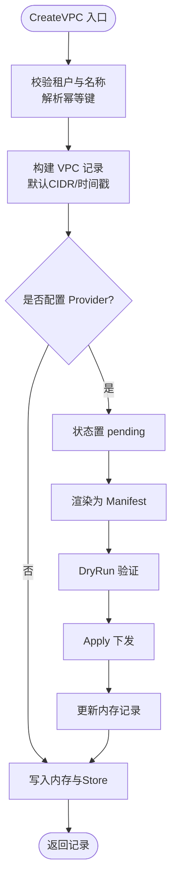
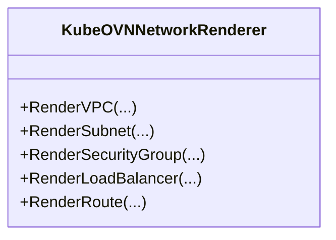
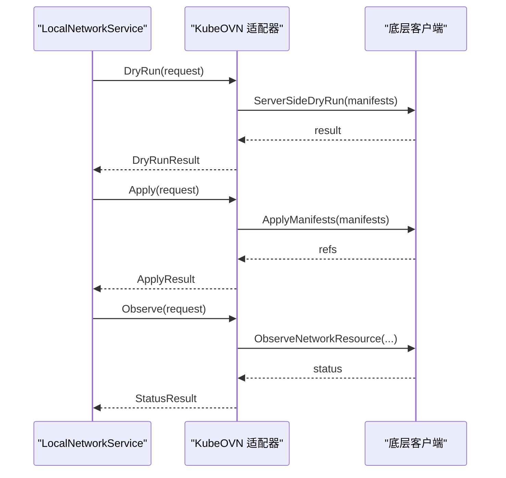
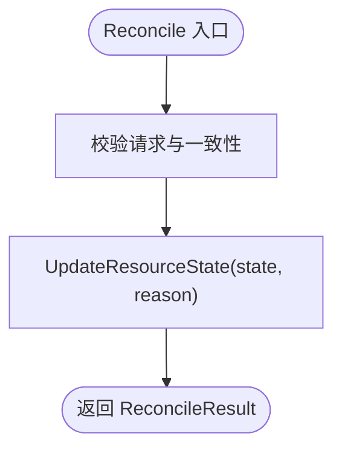
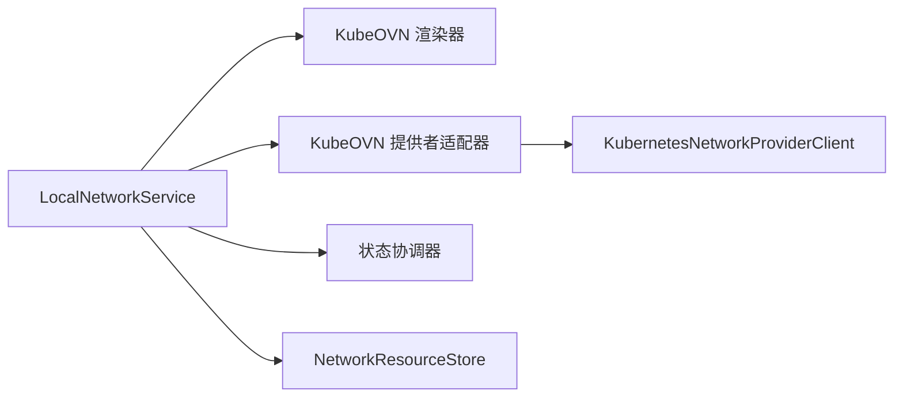

# 网络资源接口

<cite>
**本文引用的文件**
- [repo/pkg/ports/network_resources.go](file://repo/pkg/ports/network_resources.go)
- [repo/pkg/adapters/runtime/network_service.go](file://repo/pkg/adapters/runtime/network_service.go)
- [repo/pkg/adapters/runtime/kubeovn_network_provider.go](file://repo/pkg/adapters/runtime/kubeovn_network_provider.go)
- [repo/pkg/adapters/runtime/kubeovn_network_renderer.go](file://repo/pkg/adapters/runtime/kubeovn_network_renderer.go)
- [repo/pkg/adapters/runtime/network_status_reconciler.go](file://repo/pkg/adapters/runtime/network_status_reconciler.go)
- [repo/services/ani-gateway/internal/router/network_resources.go](file://repo/services/ani-gateway/internal/router/network_resources.go)
</cite>

## 目录
1. [简介](#简介)
2. [项目结构](#项目结构)
3. [核心组件](#核心组件)
4. [架构总览](#架构总览)
5. [详细组件分析](#详细组件分析)
6. [依赖关系分析](#依赖关系分析)
7. [性能与可扩展性](#性能与可扩展性)
8. [故障恢复与状态同步](#故障恢复与状态同步)
9. [监控指标与调试工具](#监控指标与调试工具)
10. [结论](#结论)

## 简介
本文件面向“网络资源接口”的统一抽象，覆盖 VPC、子网、安全组、负载均衡器、路由等资源的创建、查询、删除与生命周期管理。文档重点说明：
- 统一接口定义：资源模型、请求/响应结构、操作语义
- KubeOVN 适配器实现：渲染为 Kubernetes/KubeOVN 资源、DryRun/Apply/Observe 流程
- 配置管理与状态同步：本地服务内存态 + 持久化 Store + 状态协调器
- 拓扑管理、监控指标与调试：概览能力、依赖关系、删除风险、开发模式提示

该设计将上层 API 与底层网络后端解耦，便于替换或扩展其他网络提供者（如云厂商 LB、CNI 等）。

## 项目结构
围绕网络资源的核心代码分布在以下位置：
- 端口与数据模型：定义统一的网络资源接口与数据结构
- 运行时适配层：提供本地网络服务、KubeOVN 渲染器与提供者适配器、状态协调器
- 网关路由：暴露 HTTP 接口，映射到网络服务

图表来源
- [repo/services/ani-gateway/internal/router/network_resources.go:246-283](file://repo/services/ani-gateway/internal/router/network_resources.go#L246-L283)
- [repo/pkg/adapters/runtime/network_service.go:15-38](file://repo/pkg/adapters/runtime/network_service.go#L15-L38)
- [repo/pkg/adapters/runtime/kubeovn_network_renderer.go:13-17](file://repo/pkg/adapters/runtime/kubeovn_network_renderer.go#L13-L17)
- [repo/pkg/adapters/runtime/kubeovn_network_provider.go:17-48](file://repo/pkg/adapters/runtime/kubeovn_network_provider.go#L17-L48)
- [repo/pkg/adapters/runtime/network_status_reconciler.go:12-36](file://repo/pkg/adapters/runtime/network_status_reconciler.go#L12-L36)

章节来源
- [repo/pkg/ports/network_resources.go:8-350](file://repo/pkg/ports/network_resources.go#L8-L350)
- [repo/services/ani-gateway/internal/router/network_resources.go:246-283](file://repo/services/ani-gateway/internal/router/network_resources.go#L246-L283)

## 核心组件
- 统一接口与数据模型：VPC、Subnet、SecurityGroup、LoadBalancer、Route 及其 CRUD 请求/响应
- LocalNetworkService：内存态资源管理、幂等键控制、可选 Provider 执行路径
- KubeOVN 渲染器：将网络资源渲染为 KubeOVN/Kubernetes 清单（Vpc、Subnet、NetworkPolicy、Service）
- KubeOVN 提供者适配器：封装 DryRun/Apply/Observe，校验并转发至底层客户端
- 状态协调器：将 Provider 观察到的状态落库，完成期望与实际一致化

章节来源
- [repo/pkg/ports/network_resources.go:18-350](file://repo/pkg/ports/network_resources.go#L18-L350)
- [repo/pkg/adapters/runtime/network_service.go:15-109](file://repo/pkg/adapters/runtime/network_service.go#L15-L109)
- [repo/pkg/adapters/runtime/kubeovn_network_renderer.go:13-142](file://repo/pkg/adapters/runtime/kubeovn_network_renderer.go#L13-L142)
- [repo/pkg/adapters/runtime/kubeovn_network_provider.go:17-134](file://repo/pkg/adapters/runtime/kubeovn_network_provider.go#L17-L134)
- [repo/pkg/adapters/runtime/network_status_reconciler.go:12-65](file://repo/pkg/adapters/runtime/network_status_reconciler.go#L12-L65)

## 架构总览
网络资源的生命周期由网关路由触发，进入 LocalNetworkService；若配置了 Provider，则通过渲染器生成清单，再经提供者适配器进行 DryRun、Apply，最后通过状态协调器拉取实际状态并持久化。

图表来源
- [repo/services/ani-gateway/internal/router/network_resources.go:294-311](file://repo/services/ani-gateway/internal/router/network_resources.go#L294-L311)
- [repo/pkg/adapters/runtime/network_service.go:165-218](file://repo/pkg/adapters/runtime/network_service.go#L165-L218)
- [repo/pkg/adapters/runtime/kubeovn_network_renderer.go:19-33](file://repo/pkg/adapters/runtime/kubeovn_network_renderer.go#L19-L33)
- [repo/pkg/adapters/runtime/kubeovn_network_provider.go:50-105](file://repo/pkg/adapters/runtime/kubeovn_network_provider.go#L50-L105)
- [repo/pkg/adapters/runtime/network_status_reconciler.go:38-65](file://repo/pkg/adapters/runtime/network_status_reconciler.go#L38-L65)

## 详细组件分析

### 统一接口与数据模型（ports）
- 资源状态枚举：pending、available、failed、deleting、deleted
- 资源记录：VPC、Subnet、SecurityGroup、LoadBalancer、Route
- 规则与绑定：安全组规则、安全组绑定（实例/网卡/LB）
- IP 分配：子网 IP 分配记录
- 概览：资源统计、能力列表、创建顺序、关系图、删除风险
- 请求/响应：各资源的 Create/List/Get/Delete 及规则/绑定操作
- Provider 抽象：Renderer/DryRun/Apply/StatusReader/Reconciler

图表来源
- [repo/pkg/ports/network_resources.go:314-484](file://repo/pkg/ports/network_resources.go#L314-L484)

章节来源
- [repo/pkg/ports/network_resources.go:8-350](file://repo/pkg/ports/network_resources.go#L8-L350)

### LocalNetworkService（本地网络服务）
职责：
- 维护内存中的资源集合（VPC/Subnet/SG/LB/Route），支持按租户过滤、名称前缀匹配、状态过滤
- 幂等键去重：同一 IdempotencyKey 多次调用返回相同结果
- Provider 执行开关：当配置了 Provider 时，资源先置 pending，随后执行渲染、DryRun、Apply，成功后更新状态
- 失败标记：Provider 执行失败时，将资源状态置 failed 并记录原因
- 安全组规则：支持创建、更新、删除，自动同步回安全组摘要

关键流程（以创建 VPC 为例）：
- 参数校验与幂等键解析
- 构造记录，设置默认 CIDR
- 若配置 Provider，则状态设为 pending 并执行 apply
- 写入内存与 Store，返回最终记录

图表来源
- [repo/pkg/adapters/runtime/network_service.go:165-218](file://repo/pkg/adapters/runtime/network_service.go#L165-L218)

章节来源
- [repo/pkg/adapters/runtime/network_service.go:111-800](file://repo/pkg/adapters/runtime/network_service.go#L111-L800)

### KubeOVN 渲染器
职责：
- 将网络资源渲染为 KubeOVN/Kubernetes 清单
- VPC -> kubeovn.io/v1/Vpc（包含命名空间隔离）
- Subnet -> kubeovn.io/v1/Subnet（协议、CIDR、VPC 引用、网关等）
- SecurityGroup -> networking.k8s.io/v1/NetworkPolicy（基于规则生成 ingress/egress）
- LoadBalancer -> v1/Service（ClusterIP 或 LoadBalancer，监听映射为端口）
- Route -> kubeovn.io/v1/Vpc 的 staticRoutes（仅支持 gateway 类型下一跳）

图表来源
- [repo/pkg/adapters/runtime/kubeovn_network_renderer.go:13-142](file://repo/pkg/adapters/runtime/kubeovn_network_renderer.go#L13-L142)

章节来源
- [repo/pkg/adapters/runtime/kubeovn_network_renderer.go:19-142](file://repo/pkg/adapters/runtime/kubeovn_network_renderer.go#L19-L142)

### KubeOVN 提供者适配器
职责：
- 封装 DryRun/Apply/Observe，统一校验身份、权限证明、资源引用
- DryRun：仅允许 create 操作，校验清单格式与 Provider 兼容性
- Apply：可开关（applyEnabled），成功时返回资源引用列表
- Observe：校验身份与资源引用一致性，填充缺失字段（provider/state/time）

图表来源
- [repo/pkg/adapters/runtime/kubeovn_network_provider.go:50-134](file://repo/pkg/adapters/runtime/kubeovn_network_provider.go#L50-L134)

章节来源
- [repo/pkg/adapters/runtime/kubeovn_network_provider.go:17-225](file://repo/pkg/adapters/runtime/kubeovn_network_provider.go#L17-L225)

### 状态协调器（Reconciler）
职责：
- 接收 Provider 观察到的状态，校验与 Apply 结果的一致性（租户、资源种类、ID、Provider、资源引用）
- 将状态与原因持久化到 Store，完成期望与实际一致化

图表来源
- [repo/pkg/adapters/runtime/network_status_reconciler.go:38-65](file://repo/pkg/adapters/runtime/network_status_reconciler.go#L38-L65)

章节来源
- [repo/pkg/adapters/runtime/network_status_reconciler.go:12-107](file://repo/pkg/adapters/runtime/network_status_reconciler.go#L12-L107)

### 网关路由（HTTP 接口）
职责：
- 注册网络资源 RESTful 路由（overview、vpcs、subnets、security-groups、load-balancers、routes）
- 将 JSON 请求转换为内部请求对象，调用 NetworkService，再将记录转为响应
- 错误处理：统一写回网络错误格式

章节来源
- [repo/services/ani-gateway/internal/router/network_resources.go:246-735](file://repo/services/ani-gateway/internal/router/network_resources.go#L246-L735)

## 依赖关系分析
- LocalNetworkService 依赖：
  - NetworkResourceStore：持久化资源与状态
  - NetworkProviderRenderer：渲染为下游清单
  - NetworkProviderDryRun/Apply/StatusReader：执行与观察
  - NetworkStatusReconciler：状态协调
- KubeOVN 适配器依赖：
  - KubernetesNetworkProviderClient：DryRun/Apply/Observe
- 渲染器无外部依赖，纯转换逻辑

图表来源
- [repo/pkg/adapters/runtime/network_service.go:15-38](file://repo/pkg/adapters/runtime/network_service.go#L15-L38)
- [repo/pkg/adapters/runtime/kubeovn_network_provider.go:11-15](file://repo/pkg/adapters/runtime/kubeovn_network_provider.go#L11-L15)

章节来源
- [repo/pkg/adapters/runtime/network_service.go:15-38](file://repo/pkg/adapters/runtime/network_service.go#L15-L38)
- [repo/pkg/adapters/runtime/kubeovn_network_provider.go:11-15](file://repo/pkg/adapters/runtime/kubeovn_network_provider.go#L11-L15)

## 性能与可扩展性
- 内存态并发：LocalNetworkService 使用读写锁保护资源集合，适合单机/测试环境
- 幂等键：避免重复创建导致的资源风暴
- Provider 执行开关：在开发/测试时可禁用 Apply，提升迭代速度
- 渲染器无 IO：纯 CPU 转换，开销低
- 可扩展点：
  - 替换 Renderer/Provider 以支持不同后端（云 LB、CNI、SDN）
  - 接入分布式 Store 替代内存态，支持多副本部署

[本节为通用指导，不直接分析具体文件]

## 故障恢复与状态同步
- 失败标记：Provider 执行失败时，资源状态置 failed，并记录原因
- 状态协调：Reconciler 校验 Apply 与 Observed 的一致性后，持久化状态
- 幂等与重试：幂等键保证重复请求安全；协调器可被调度器周期性触发，收敛状态
- 建议：
  - 对 Apply 失败增加退避重试
  - 对状态不一致（Observed 与 Apply 资源引用不匹配）告警

章节来源
- [repo/pkg/adapters/runtime/network_service.go:165-218](file://repo/pkg/adapters/runtime/network_service.go#L165-L218)
- [repo/pkg/adapters/runtime/network_status_reconciler.go:38-107](file://repo/pkg/adapters/runtime/network_status_reconciler.go#L38-L107)

## 监控指标与调试工具
- 概览能力：通过 GetOverview 获取资源统计、能力列表、创建顺序、关系图、删除风险
- 开发模式提示：响应中包含 dev_profile，指示当前运行环境与 Provider 执行开关
- 调试建议：
  - 使用 overview 检查资源状态分布与依赖关系
  - 查看安全组规则列表与绑定，确认流量策略
  - 在 Provider DryRun 阶段捕获 warnings，提前发现配置问题

章节来源
- [repo/pkg/adapters/runtime/network_service.go:111-163](file://repo/pkg/adapters/runtime/network_service.go#L111-L163)
- [repo/services/ani-gateway/internal/router/network_resources.go:285-292](file://repo/services/ani-gateway/internal/router/network_resources.go#L285-L292)

## 结论
本网络资源接口通过统一抽象将 VPC、子网、安全组、负载均衡器、路由等资源生命周期管理标准化，并以 KubeOVN 作为默认后端实现。LocalNetworkService 提供内存态与幂等保障，渲染器与提供者适配器解耦了上层业务与底层实现，状态协调器确保期望与实际一致。结合概览能力与开发模式提示，便于快速定位问题与调优。后续可基于此接口扩展更多网络后端，并引入分布式存储与更完善的监控告警体系。