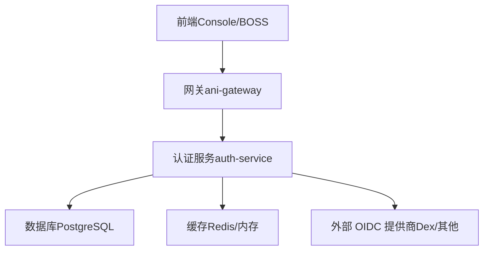
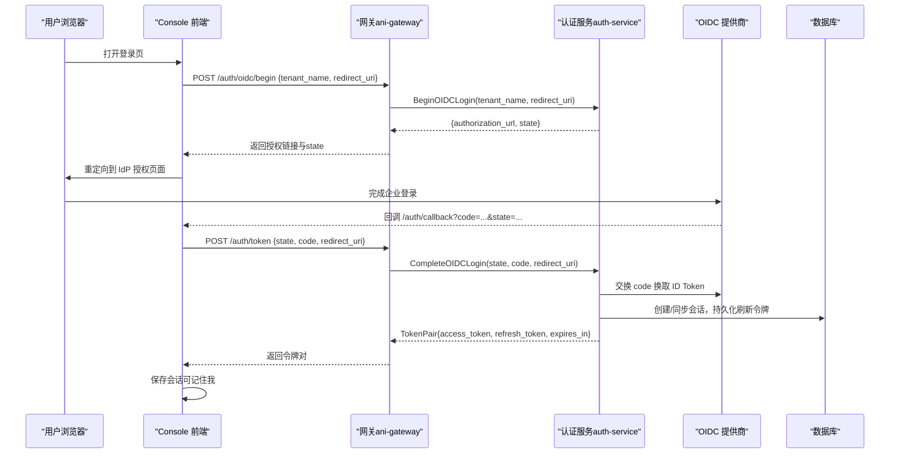
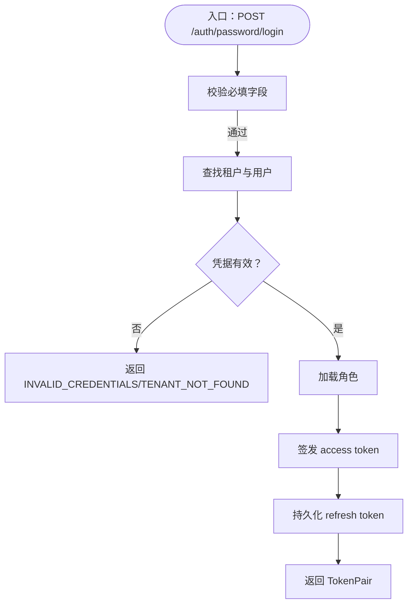
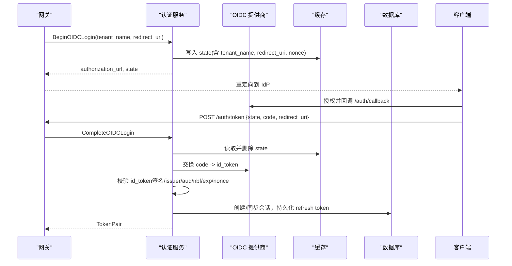
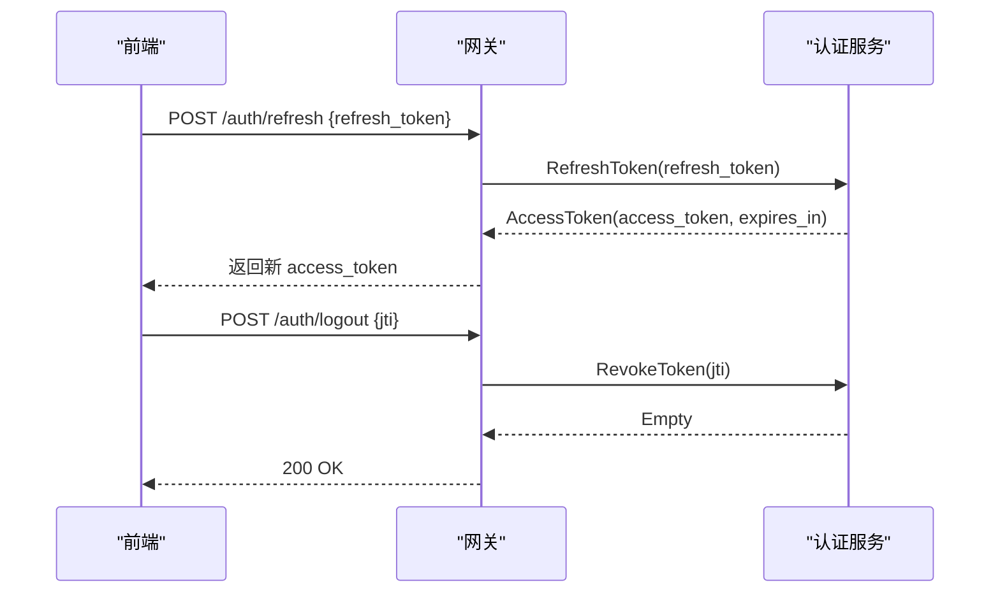
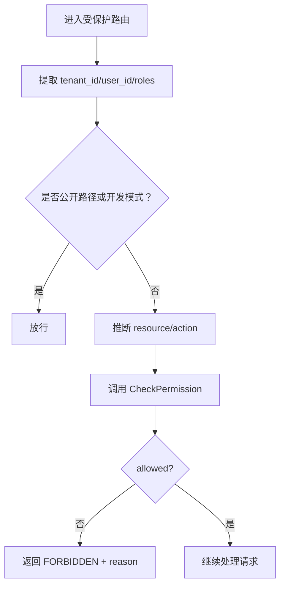
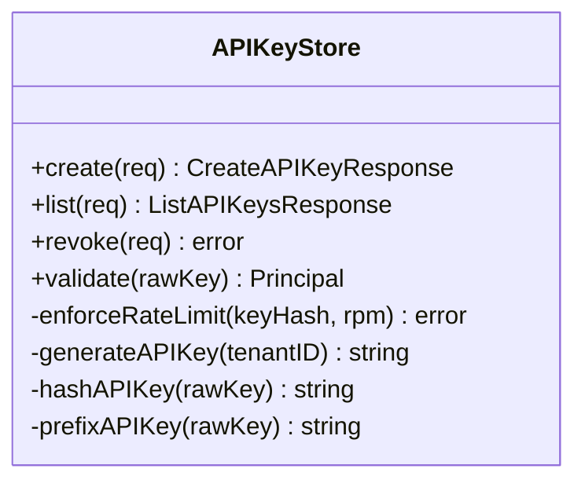
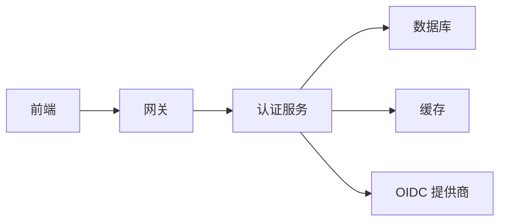

# 身份认证接口

<cite>
**本文引用的文件**
- [auth_service.proto](file://repo/api/proto/auth/v1/auth_service.proto)
- [auth.go](file://services/ani-gateway/internal/router/auth.go)
- [rbac.go](file://services/ani-gateway/internal/middleware/rbac.go)
- [password_login.go](file://services/auth-service/internal/service/password_login.go)
- [platform_login.go](file://services/auth-service/internal/service/platform_login.go)
- [oidc.go](file://services/auth-service/internal/service/oidc.go)
- [api_keys.go](file://services/auth-service/internal/service/api_keys.go)
- [identity_provider.go](file://pkg/ports/identity_provider.go)
- [login.tsx](file://frontends/console/src/routes/login.tsx)
- [auth.ts（控制台）](file://frontends/console/src/api/auth.ts)
- [auth.ts（BOSS）](file://frontends/boss/src/api/auth.ts)
</cite>

## 目录
1. [简介](#简介)
2. [项目结构](#项目结构)
3. [核心组件](#核心组件)
4. [架构总览](#架构总览)
5. [详细组件分析](#详细组件分析)
6. [依赖关系分析](#依赖关系分析)
7. [性能考虑](#性能考虑)
8. [故障排查指南](#故障排查指南)
9. [结论](#结论)
10. [附录](#附录)

## 简介
本文件面向 ANI 平台的身份认证与授权子系统，系统性说明用户身份验证、权限控制、会话管理、多租户隔离、RBAC、OIDC 集成、API Key 管理、令牌刷新与撤销等能力。文档同时给出 API 契约、调用时序、安全最佳实践与审计合规要点，帮助开发者快速理解并正确接入。

## 项目结构
ANI 的认证体系由三层组成：
- 网关层（ani-gateway）：对外暴露 HTTP 认证相关端点，负责参数校验、错误映射、上下文注入（租户、用户、角色），以及将请求转发至认证服务。
- 认证服务（auth-service）：实现登录、OIDC 流程、令牌签发与校验、RBAC 鉴权、API Key 生命周期管理等核心逻辑。
- 前端（Console/BOSS）：处理 OIDC 跳转、回调、本地会话存储、自动刷新与登出。

图表来源
- [auth.go:102-113](file://services/ani-gateway/internal/router/auth.go#L102-L113)
- [auth_service.proto:11-30](file://repo/api/proto/auth/v1/auth_service.proto#L11-L30)
- [oidc.go:101-195](file://services/auth-service/internal/service/oidc.go#L101-L195)
- [api_keys.go:46-119](file://services/auth-service/internal/service/api_keys.go#L46-L119)

章节来源
- [auth.go:102-113](file://services/ani-gateway/internal/router/auth.go#L102-L113)
- [auth_service.proto:11-30](file://repo/api/proto/auth/v1/auth_service.proto#L11-L30)

## 核心组件
- 认证协议与服务定义：通过 gRPC Proto 定义 AuthService，包含登录、OIDC 开始/完成、刷新、撤销、令牌校验、权限检查、API Key 管理等 RPC。
- 网关路由与错误映射：HTTP 端点统一封装为 JSON 响应，错误码与消息标准化，便于前端消费。
- 密码登录（租户/平台）：分别实现租户与平台管理员的账号密码登录，签发 JWT 访问令牌与刷新令牌。
- OIDC 集成：支持 Authorization Code Flow，含 state/nonce 校验、ID Token 校验（静态公钥或 JWKS）、会话创建与令牌签发。
- RBAC 中间件：从请求上下文提取租户、用户、角色，推断资源与动作，调用 CheckPermission 进行鉴权。
- API Key 管理：生成、列表、撤销、速率限制、作用域控制、过期策略。
- 身份提供者抽象：IdentityProvider 接口用于扩展不同身份源（如企业 IdP）。

章节来源
- [auth_service.proto:11-30](file://repo/api/proto/auth/v1/auth_service.proto#L11-L30)
- [auth.go:115-229](file://services/ani-gateway/internal/router/auth.go#L115-L229)
- [password_login.go:32-92](file://services/auth-service/internal/service/password_login.go#L32-L92)
- [platform_login.go:37-88](file://services/auth-service/internal/service/platform_login.go#L37-L88)
- [oidc.go:101-195](file://services/auth-service/internal/service/oidc.go#L101-L195)
- [rbac.go:17-72](file://services/ani-gateway/internal/middleware/rbac.go#L17-L72)
- [api_keys.go:46-119](file://services/auth-service/internal/service/api_keys.go#L46-L119)
- [identity_provider.go:5-17](file://pkg/ports/identity_provider.go#L5-L17)

## 架构总览
下图展示一次完整的 Console 用户通过 OIDC 登录并获取令牌的端到端流程。

图表来源
- [login.tsx:77-111](file://frontends/console/src/routes/login.tsx#L77-L111)
- [auth.go:231-367](file://services/ani-gateway/internal/router/auth.go#L231-L367)
- [oidc.go:101-195](file://services/auth-service/internal/service/oidc.go#L101-L195)

章节来源
- [login.tsx:77-111](file://frontends/console/src/routes/login.tsx#L77-L111)
- [auth.go:231-367](file://services/ani-gateway/internal/router/auth.go#L231-L367)
- [oidc.go:101-195](file://services/auth-service/internal/service/oidc.go#L101-L195)

## 详细组件分析

### 认证协议与服务定义（Proto）
- 登录类：
  - Login：租户账号密码登录，返回 TokenPair。
  - PlatformPasswordLogin：平台管理员账号密码登录，返回 TokenPair。
  - BeginOIDCLogin/CompleteOIDCLogin：OIDC 授权码流程两阶段。
- 会话类：
  - RefreshToken：使用刷新令牌换取新的访问令牌。
  - RevokeToken：按 jti 撤销访问令牌（加入黑名单）。
- 鉴权类：
  - ValidateToken：网关内部校验 JWT 或 API Key，返回租户上下文。
  - CheckPermission：RBAC 鉴权，输入租户/用户/角色/资源/动作，输出允许与否及原因。
- API Key：
  - Create/List/Revoke APIKey：支持作用域、速率限制、过期时间、前缀显示等。

章节来源
- [auth_service.proto:11-138](file://repo/api/proto/auth/v1/auth_service.proto#L11-L138)

### 网关认证路由与错误映射
- 暴露的 HTTP 端点：
  - POST /auth/password/login
  - POST /auth/platform/password/login
  - POST /auth/oidc/begin
  - POST /auth/token
  - POST /auth/refresh
  - POST /auth/logout
  - GET /auth/api-keys
  - POST /auth/api-keys
  - DELETE /auth/api-keys/:key_id
- 错误映射：
  - 将 gRPC 状态码映射为 HTTP 状态码与业务错误码（如 INVALID_CREDENTIALS、TENANT_NOT_FOUND、AUTH_SERVICE_UNAVAILABLE 等）。
- 上下文注入：
  - 从令牌或 API Key 解析 tenant_id、user_id、roles，供后续 RBAC 中间件使用。

章节来源
- [auth.go:102-113](file://services/ani-gateway/internal/router/auth.go#L102-L113)
- [auth.go:115-229](file://services/ani-gateway/internal/router/auth.go#L115-L229)
- [auth.go:369-396](file://services/ani-gateway/internal/router/auth.go#L369-L396)

### 密码登录（租户与平台）
- 租户密码登录：
  - 校验 tenant_name、username、password；查找租户与用户；校验密码哈希与状态；加载角色；先签发 access token，再持久化 refresh token。
- 平台管理员密码登录：
  - 不依赖 tenant_name；查询平台用户（tenant_id IS NULL）；签发 platform scope 的 access token；持久化 refresh token。
- 安全要点：
  - 用户名禁止包含命名空间前缀；空密码哈希拒绝登录；失败计数/锁定已移除。

图表来源
- [password_login.go:32-92](file://services/auth-service/internal/service/password_login.go#L32-L92)
- [platform_login.go:37-88](file://services/auth-service/internal/service/platform_login.go#L37-L88)

章节来源
- [password_login.go:32-102](file://services/auth-service/internal/service/password_login.go#L32-L102)
- [platform_login.go:37-88](file://services/auth-service/internal/service/platform_login.go#L37-L88)

### OIDC 集成（Authorization Code Flow）
- Begin：
  - 校验 tenant_name、redirect_uri；生成 state 与 nonce；缓存 state（含租户与回调地址）；构造授权 URL。
- Complete：
  - 校验 state/code/redirect_uri；删除已消费的 state；向 IdP 交换 ID Token；校验签名、发行者、受众、时间戳与 nonce；创建会话并签发 TokenPair。
- 密钥校验：
  - 支持静态 RSA 公钥或 JWKS 动态拉取并缓存。

图表来源
- [oidc.go:101-195](file://services/auth-service/internal/service/oidc.go#L101-L195)
- [oidc.go:226-242](file://services/auth-service/internal/service/oidc.go#L226-L242)
- [oidc.go:333-444](file://services/auth-service/internal/service/oidc.go#L333-L444)

章节来源
- [oidc.go:101-195](file://services/auth-service/internal/service/oidc.go#L101-L195)
- [oidc.go:226-242](file://services/auth-service/internal/service/oidc.go#L226-L242)
- [oidc.go:333-444](file://services/auth-service/internal/service/oidc.go#L333-L444)

### 令牌刷新与撤销
- 刷新：
  - 网关接收 refresh_token，调用认证服务刷新，返回新的 access_token 与 expires_in。
- 撤销：
  - 前端在登出时解析 access_token 的 jti，调用 /auth/logout 将其加入黑名单，随后清理本地会话。

图表来源
- [auth.go:259-396](file://services/ani-gateway/internal/router/auth.go#L259-L396)
- [auth.ts（控制台）:124-172](file://frontends/console/src/api/auth.ts#L124-L172)
- [auth.ts（BOSS）:125-194](file://frontends/boss/src/api/auth.ts#L125-L194)

章节来源
- [auth.go:259-396](file://services/ani-gateway/internal/router/auth.go#L259-L396)
- [auth.ts（控制台）:124-172](file://frontends/console/src/api/auth.ts#L124-L172)
- [auth.ts（BOSS）:125-194](file://frontends/boss/src/api/auth.ts#L125-L194)

### RBAC 权限模型与多租户隔离
- 权限推断：
  - 根据 HTTP 方法与路径推断 resource 与 action（如 GET /v1/models -> models:get）。
- 鉴权流程：
  - 从上下文获取 tenant_id、user_id、roles；若为沙箱令牌则走白名单；否则调用 CheckPermission 判定。
- 多租户隔离：
  - 所有数据访问通过 SetDBTenant 设置当前租户上下文，结合数据库行级安全（RLS）确保跨租户数据不可见。

图表来源
- [rbac.go:17-72](file://services/ani-gateway/internal/middleware/rbac.go#L17-L72)
- [rbac.go:74-98](file://services/ani-gateway/internal/middleware/rbac.go#L74-L98)

章节来源
- [rbac.go:17-72](file://services/ani-gateway/internal/middleware/rbac.go#L17-L72)
- [rbac.go:74-98](file://services/ani-gateway/internal/middleware/rbac.go#L74-L98)

### API Key 管理
- 创建：
  - 生成随机密钥，计算哈希与可见前缀；设置作用域（scope:resource:action）、速率限制（RPM）、可选过期时间；事务写入数据库。
- 列表：
  - 按 tenant_id 与可选 user_id 过滤，返回键元信息（不包含明文 key）。
- 撤销：
  - 标记 revoked_at，立即失效。
- 校验与限流：
  - 解析 tenant_id，匹配哈希，检查未撤销与未过期；基于缓存做每分钟速率限制；更新 last_used_at。

图表来源
- [api_keys.go:46-119](file://services/auth-service/internal/service/api_keys.go#L46-L119)
- [api_keys.go:121-189](file://services/auth-service/internal/service/api_keys.go#L121-L189)
- [api_keys.go:191-221](file://services/auth-service/internal/service/api_keys.go#L191-L221)
- [api_keys.go:223-269](file://services/auth-service/internal/service/api_keys.go#L223-L269)
- [api_keys.go:320-351](file://services/auth-service/internal/service/api_keys.go#L320-L351)

章节来源
- [api_keys.go:46-119](file://services/auth-service/internal/service/api_keys.go#L46-L119)
- [api_keys.go:121-189](file://services/auth-service/internal/service/api_keys.go#L121-L189)
- [api_keys.go:191-221](file://services/auth-service/internal/service/api_keys.go#L191-L221)
- [api_keys.go:223-269](file://services/auth-service/internal/service/api_keys.go#L223-L269)
- [api_keys.go:320-351](file://services/auth-service/internal/service/api_keys.go#L320-L351)

### 会话管理与前端交互
- 登录态：
  - Console/BOSS 在路由守卫中检测 token 有效期，必要时调用 /auth/refresh 无感续期。
- 记住我：
  - 登录时选择 remember_me，影响回调后存储介质选择。
- 登出：
  - 解析 access_token 的 jti，调用 /auth/logout 撤销，然后清理本地会话。

章节来源
- [login.tsx:77-111](file://frontends/console/src/routes/login.tsx#L77-L111)
- [auth.ts（控制台）:124-172](file://frontends/console/src/api/auth.ts#L124-L172)
- [auth.ts（BOSS）:125-194](file://frontends/boss/src/api/auth.ts#L125-L194)

## 依赖关系分析
- 网关依赖认证服务：通过 AuthClient 调用 gRPC 方法（Login、PlatformPasswordLogin、BeginOIDCLogin、CompleteOIDCLogin、RefreshToken、RevokeToken、CreateAPIKey、ListAPIKeys、RevokeAPIKey、ValidateToken、CheckPermission）。
- 认证服务依赖：
  - 数据库：PostgreSQL（users、refresh_tokens、api_keys 等表，配合 RLS 实现多租户隔离）。
  - 缓存：Redis/内存（OIDC state、JWKS 缓存、API Key 速率限制）。
  - 外部 IdP：Dex 或其他 OIDC 提供商（授权、令牌交换、JWKS）。
- 前端依赖：
  - 网关 HTTP 端点进行登录、刷新、登出与 API Key 管理。

图表来源
- [auth.go:102-113](file://services/ani-gateway/internal/router/auth.go#L102-L113)
- [auth_service.proto:11-30](file://repo/api/proto/auth/v1/auth_service.proto#L11-L30)
- [oidc.go:101-195](file://services/auth-service/internal/service/oidc.go#L101-L195)
- [api_keys.go:46-119](file://services/auth-service/internal/service/api_keys.go#L46-L119)

章节来源
- [auth.go:102-113](file://services/ani-gateway/internal/router/auth.go#L102-L113)
- [auth_service.proto:11-30](file://repo/api/proto/auth/v1/auth_service.proto#L11-L30)

## 性能考虑
- 令牌签发顺序优化：先签发 access token（纯计算），成功后再持久化 refresh token，避免孤儿数据。
- OIDC JWKS 缓存：短期缓存公钥集合，减少外部网络开销。
- API Key 速率限制：基于缓存的每分钟计数器，防止滥用。
- 并发刷新去重：前端对刷新请求进行并发锁，避免重复刷新风暴。

[本节为通用指导，无需特定文件引用]

## 故障排查指南
- 常见错误码与含义：
  - INVALID_CREDENTIALS：用户名或密码错误，或用户状态非 active。
  - TENANT_NOT_FOUND：租户不存在。
  - AUTH_SERVICE_UNAVAILABLE：认证服务不可用。
  - BAD_REQUEST：参数缺失或格式错误（如缺少 tenant_name、state、code、refresh_token、jti 等）。
  - UNAUTHORIZED：令牌无效或被撤销。
  - RATE_LIMIT_EXCEEDED：API Key 超过速率限制。
- 排查步骤：
  - 确认请求参数完整且符合约束（如 RFC3339 时间、绝对 redirect_uri、无 fragment）。
  - 检查 OIDC state 是否存在且未被消费。
  - 核对 JWKS/公钥配置是否正确，issuer/audience 是否匹配。
  - 查看数据库 RLS 与租户上下文是否正确设置。
  - 检查 API Key 是否被撤销或过期。

章节来源
- [auth.go:157-174](file://services/ani-gateway/internal/router/auth.go#L157-L174)
- [auth.go:214-229](file://services/ani-gateway/internal/router/auth.go#L214-L229)
- [auth.go:533-548](file://services/ani-gateway/internal/router/auth.go#L533-L548)
- [oidc.go:101-195](file://services/auth-service/internal/service/oidc.go#L101-L195)
- [api_keys.go:306-318](file://services/auth-service/internal/service/api_keys.go#L306-L318)

## 结论
本认证体系以网关为统一入口，认证服务为核心，结合 OIDC、JWT、RBAC 与 API Key 机制，提供完善的身份验证、权限控制与会话管理能力。通过多租户隔离与安全设计（哈希存储、令牌黑名单、速率限制、JWKS 校验），满足生产环境的安全与合规要求。建议在生产部署中严格配置 OIDC、启用最小权限原则、开启审计日志与告警，并定期轮换密钥与审查权限。

[本节为总结性内容，无需特定文件引用]

## 附录

### 安全最佳实践
- 密码存储：使用 bcrypt 哈希，禁止明文存储。
- 令牌安全：短 TTL 的 access token + 长 TTL 的 refresh token；支持撤销与黑名单。
- OIDC 安全：校验 issuer、audience、exp/nbf/iat、nonce；仅接受 https 回调；禁用 fragment。
- 多租户隔离：强制 SetDBTenant 与 RLS；禁止跨租户访问。
- API Key：最小作用域、限速、过期、仅首次展示明文值。
- 审计与合规：记录登录、刷新、撤销、API Key 操作；保留必要日志；遵循最小披露原则。

[本节为通用指导，无需特定文件引用]

### 适配器实现模式（身份提供者）
- IdentityProvider 接口定义了 ProviderName、ValidateToken、SyncPrincipal，便于接入不同身份源（如企业 IdP）。
- OIDC 模块通过 exchanger（code 交换）与 verifier（ID Token 校验）解耦具体 IdP 实现，支持静态公钥与 JWKS 两种模式。

章节来源
- [identity_provider.go:5-17](file://pkg/ports/identity_provider.go#L5-L17)
- [oidc.go:255-316](file://services/auth-service/internal/service/oidc.go#L255-L316)
- [oidc.go:333-444](file://services/auth-service/internal/service/oidc.go#L333-L444)