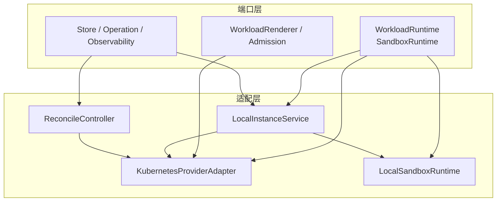
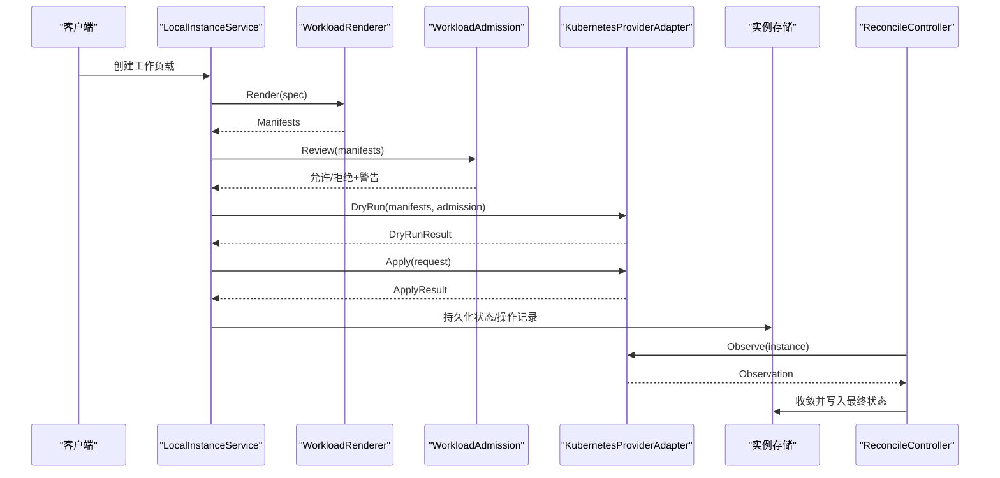
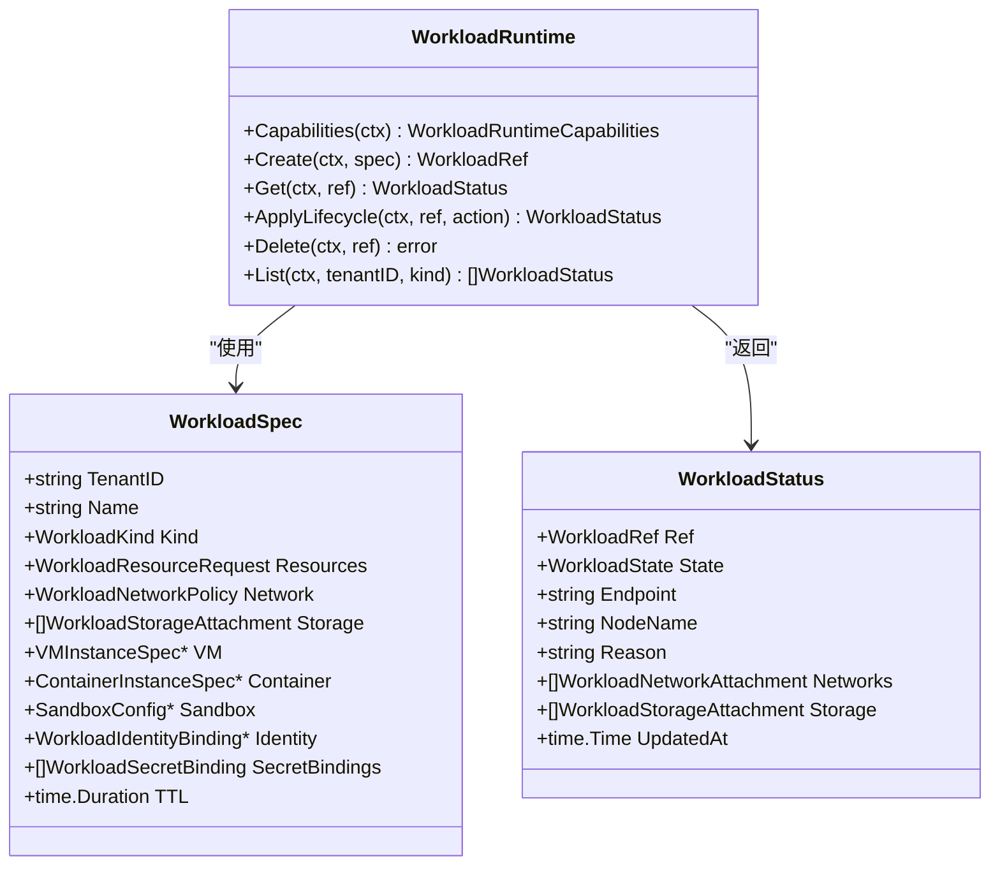
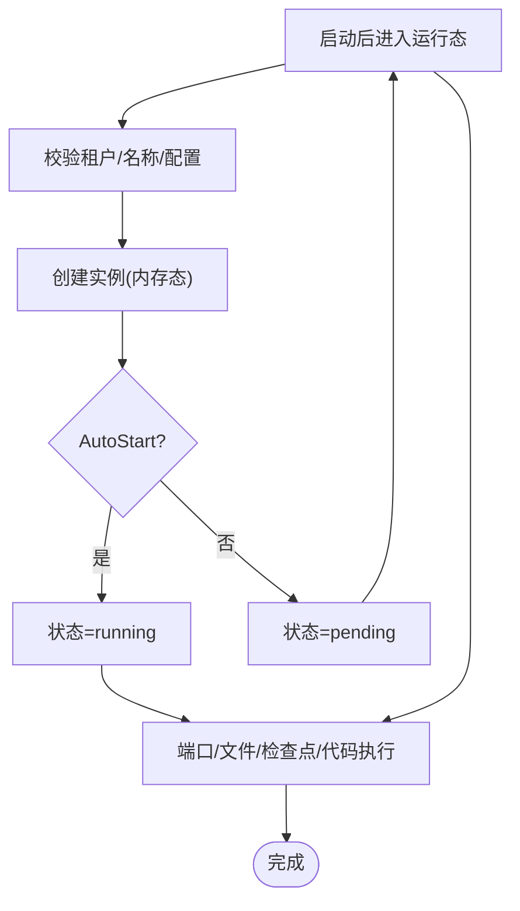
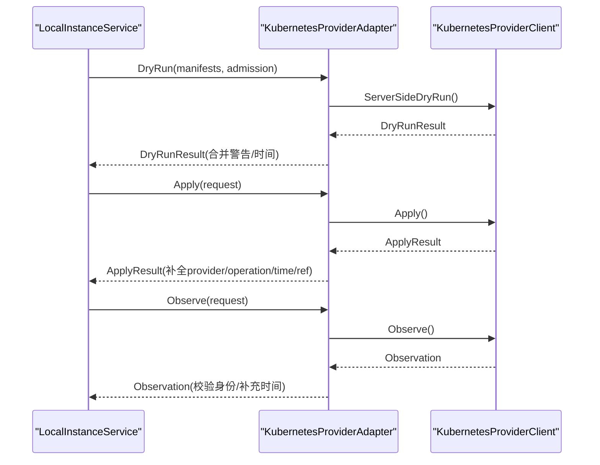
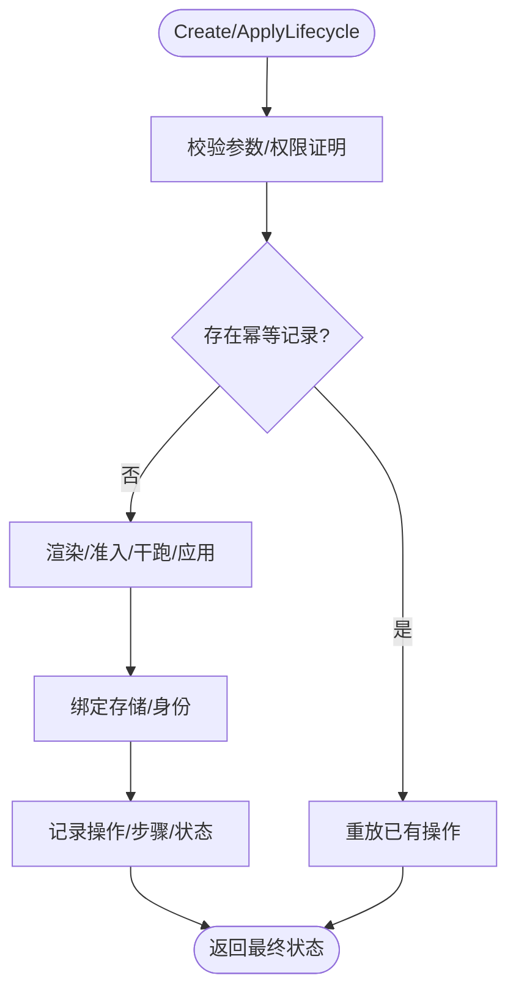
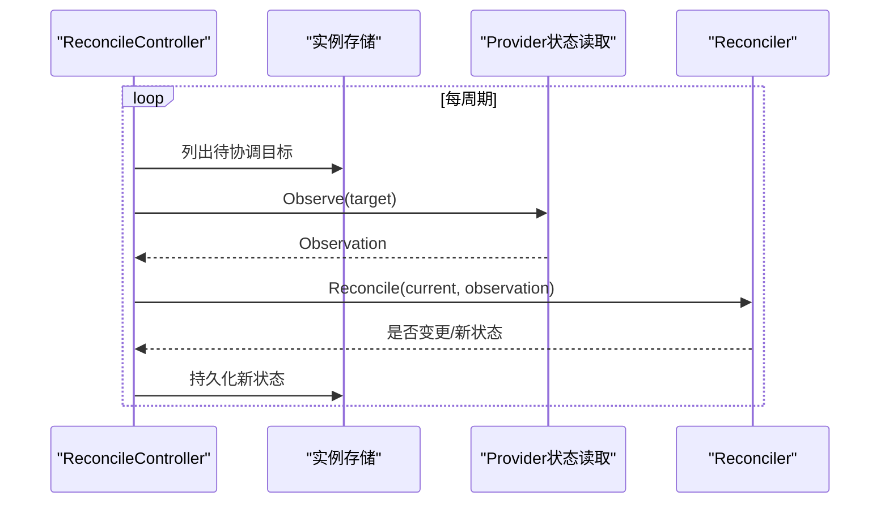
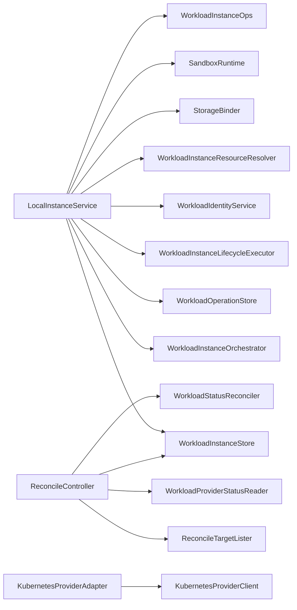

# 运行时接口

<cite>
**本文引用的文件**
- [workload_runtime.go](file://repo/pkg/ports/workload_runtime.go)
- [sandbox_runtime.go](file://repo/pkg/ports/sandbox_runtime.go)
- [kubernetes_provider_adapter.go](file://repo/pkg/adapters/runtime/kubernetes_provider_adapter.go)
- [local_sandbox_runtime.go](file://repo/pkg/adapters/runtime/local_sandbox_runtime.go)
- [instance_service.go](file://repo/pkg/adapters/runtime/instance_service.go)
- [reconcile_controller.go](file://repo/pkg/adapters/runtime/reconcile_controller.go)
</cite>

## 目录
1. [简介](#简介)
2. [项目结构](#项目结构)
3. [核心组件](#核心组件)
4. [架构总览](#架构总览)
5. [详细组件分析](#详细组件分析)
6. [依赖关系分析](#依赖关系分析)
7. [性能与可观测性](#性能与可观测性)
8. [故障排查指南](#故障排查指南)
9. [结论](#结论)
10. [附录](#附录)

## 简介
本文件面向工作负载运行时的统一抽象与实现，覆盖容器、虚拟机、沙箱等不同运行环境的统一接口设计，以及实例生命周期管理、资源调度、状态同步等核心能力。同时说明 Kubernetes、KubeVirt 等后端的适配器接入方式，并提供部署、扩缩容、故障恢复机制的使用要点，以及监控、日志、调试工具的使用建议。

## 项目结构
运行时相关代码主要分布在两个层次：
- 端口层（接口定义）：位于 repo/pkg/ports，定义跨后端统一的 WorkloadRuntime、SandboxRuntime、渲染、准入、操作、存储等接口与数据模型。
- 适配层（实现）：位于 repo/pkg/adapters/runtime，提供基于 Kubernetes 的 Provider 适配器、本地沙箱运行时、实例服务编排、状态协调控制器等实现。

图表来源
- [workload_runtime.go:775-792](file://repo/pkg/ports/workload_runtime.go#L775-L792)
- [sandbox_runtime.go:278-296](file://repo/pkg/ports/sandbox_runtime.go#L278-L296)
- [kubernetes_provider_adapter.go:17-169](file://repo/pkg/adapters/runtime/kubernetes_provider_adapter.go#L17-L169)
- [local_sandbox_runtime.go:34-122](file://repo/pkg/adapters/runtime/local_sandbox_runtime.go#L34-L122)
- [instance_service.go:23-80](file://repo/pkg/adapters/runtime/instance_service.go#L23-L80)
- [reconcile_controller.go:15-58](file://repo/pkg/adapters/runtime/reconcile_controller.go#L15-L58)

章节来源
- [workload_runtime.go:775-792](file://repo/pkg/ports/workload_runtime.go#L775-L792)
- [sandbox_runtime.go:278-296](file://repo/pkg/ports/sandbox_runtime.go#L278-L296)

## 核心组件
- 统一工作负载接口
  - WorkloadRuntime：对 VM、容器、GPU 容器、推理、笔记本、沙箱、批处理等统一提供创建、查询、生命周期操作、删除、列表能力。
  - WorkloadSpec：描述租户、名称、镜像、资源请求、网络策略、存储挂载、VM/容器/Sandbox 配置、身份绑定、密钥绑定、TTL 等。
  - 生命周期动作：创建、启动、停止、重启、调整规格、重建、删除、快照、卷/文件系统挂载/卸载、回滚、扩缩容、镜像更新、密钥绑定/解绑、安全组变更、终止保护、暂停/恢复、延长、空闲触达、控制台会话等。
  - 状态机：pending、provisioning、running、starting、stopping、stopped、failed、deleting、deleted。
- 统一沙箱接口
  - SandboxRuntime：提供沙箱实例的创建、获取、列表、生命周期、令牌、端口、文件、检查点、代码执行等能力。
  - SandboxConfig：包含 RuntimeClass、模板、超时策略、网络出口策略、环境变量、初始端口等。
- 渲染与准入
  - WorkloadRenderer：将计划后的实例转换为 Provider Manifests，供审阅、干跑验证与后续执行。
  - WorkloadAdmission：在提交到 Provider 前进行策略校验与告警。
- 提供者适配
  - KubernetesProviderAdapter：封装 Server-Side DryRun、Apply、Observe，负责参数校验、结果归一化、开关控制。
- 实例服务与协调
  - LocalInstanceService：编排创建、生命周期、存储绑定、身份绑定、操作记录、审计、错误分类与重试标记。
  - ReconcileController：周期性拉取目标、读取 Provider 观察、调用 Reconciler 收敛状态、持久化并统计指标。

章节来源
- [workload_runtime.go:8-83](file://repo/pkg/ports/workload_runtime.go#L8-L83)
- [workload_runtime.go:104-381](file://repo/pkg/ports/workload_runtime.go#L104-L381)
- [workload_runtime.go:499-591](file://repo/pkg/ports/workload_runtime.go#L499-L591)
- [workload_runtime.go:766-792](file://repo/pkg/ports/workload_runtime.go#L766-L792)
- [sandbox_runtime.go:8-43](file://repo/pkg/ports/sandbox_runtime.go#L8-L43)
- [sandbox_runtime.go:259-296](file://repo/pkg/ports/sandbox_runtime.go#L259-L296)
- [kubernetes_provider_adapter.go:17-169](file://repo/pkg/adapters/runtime/kubernetes_provider_adapter.go#L17-L169)
- [instance_service.go:23-80](file://repo/pkg/adapters/runtime/instance_service.go#L23-L80)
- [reconcile_controller.go:15-58](file://repo/pkg/adapters/runtime/reconcile_controller.go#L15-L58)

## 架构总览
下图展示了从 API 到 Provider 的端到端流程：渲染生成清单、准入校验、干跑验证、应用下发、观察状态、协调器收敛。

图表来源
- [workload_runtime.go:788-798](file://repo/pkg/ports/workload_runtime.go#L788-L798)
- [kubernetes_provider_adapter.go:50-144](file://repo/pkg/adapters/runtime/kubernetes_provider_adapter.go#L50-L144)
- [instance_service.go:90-294](file://repo/pkg/adapters/runtime/instance_service.go#L90-L294)
- [reconcile_controller.go:89-157](file://repo/pkg/adapters/runtime/reconcile_controller.go#L89-L157)

## 详细组件分析

### 统一工作负载接口与数据模型
- 工作负载种类与工作负载状态
  - 种类包括 VM、容器、GPU 容器、推理、笔记本、沙箱、代理沙箱、批处理任务等。
  - 状态涵盖 pending、provisioning、running、starting、stopping、stopped、failed、deleting、deleted。
- 资源与网络
  - 资源请求包含 CPU、内存、GPU 调度、存储容量与类。
  - 网络支持多平面（租户 VPC、基础 Mesh、存储、管理、公网入口），支持安全组、子网、私有 IP、出站策略等。
- 存储挂载
  - 支持根盘、数据盘、共享 PVC、对象存储 FUSE、临时盘等类型；支持只读、必需、加密、失败时删除、随实例删除等策略。
- 身份与密钥
  - 支持工作负载身份绑定（作用域、有效期、撤销）、密钥绑定（挂载路径、环境变量前缀）。
- 操作与审计
  - 操作记录包含步骤、前后规格、提供方引用、失败原因、是否可重试等；计划审计记录渲染清单与准入结果。

图表来源
- [workload_runtime.go:104-381](file://repo/pkg/ports/workload_runtime.go#L104-L381)
- [workload_runtime.go:766-786](file://repo/pkg/ports/workload_runtime.go#L766-L786)

章节来源
- [workload_runtime.go:8-83](file://repo/pkg/ports/workload_runtime.go#L8-L83)
- [workload_runtime.go:104-381](file://repo/pkg/ports/workload_runtime.go#L104-L381)
- [workload_runtime.go:766-786](file://repo/pkg/ports/workload_runtime.go#L766-L786)

### 沙箱运行时接口与本地实现
- 沙箱配置与上下文
  - 支持 RuntimeClass、模板、会话/空闲超时、网络出口策略、环境变量、初始端口。
  - 执行上下文包含租户、实例、名称、提供方、状态、会话状态、配置、开发画像、端口、资源引用等。
- 本地沙箱运行时
  - 提供内存态实例、令牌、端口、文件、检查点、代码执行的本地实现，便于开发与测试。
  - 支持幂等键、过期时间、协议限制、大小限制、排序与分页等。

图表来源
- [sandbox_runtime.go:33-53](file://repo/pkg/ports/sandbox_runtime.go#L33-L53)
- [local_sandbox_runtime.go:124-164](file://repo/pkg/adapters/runtime/local_sandbox_runtime.go#L124-L164)

章节来源
- [sandbox_runtime.go:278-296](file://repo/pkg/ports/sandbox_runtime.go#L278-L296)
- [local_sandbox_runtime.go:34-122](file://repo/pkg/adapters/runtime/local_sandbox_runtime.go#L34-L122)

### Kubernetes 提供者适配器
- 职责边界
  - 仅暴露 DryRun、Apply、Observe 三个能力，屏蔽底层 Kubernetes 细节。
  - 负责清单批次校验、提供方一致性、结果字段补全、时间戳规范化。
- 开关与健壮性
  - Apply 可通过选项禁用，避免误写。
  - 未配置或传入空参数时返回明确错误。
  - 观察阶段要求先 Apply 成功，且必须包含资源引用。

图表来源
- [kubernetes_provider_adapter.go:50-144](file://repo/pkg/adapters/runtime/kubernetes_provider_adapter.go#L50-L144)

章节来源
- [kubernetes_provider_adapter.go:17-169](file://repo/pkg/adapters/runtime/kubernetes_provider_adapter.go#L17-L169)

### 实例服务：生命周期编排与幂等
- 创建流程
  - 可选资源解析、意图指纹、幂等记录、存储绑定、身份绑定、操作记录与步骤追踪。
  - 对失败路径进行分类错误码与可重试标记，保障可观测性与可恢复性。
- 生命周期操作
  - 统一通过 applyLifecycle 路由到具体动作（启动、停止、重启、调整规格、删除、快照、挂载/卸载、回滚等）。
  - 支持会话型操作（日志、事件、终端、执行、控制台等）并记录审计。
- 列表与过滤
  - 支持按状态、关键字、时间范围、规格、镜像、节点、滚动状态、GPU 模型/队列/调度状态、模板、会话状态等过滤与排序。

图表来源
- [instance_service.go:90-294](file://repo/pkg/adapters/runtime/instance_service.go#L90-L294)
- [instance_service.go:655-773](file://repo/pkg/adapters/runtime/instance_service.go#L655-L773)

章节来源
- [instance_service.go:90-294](file://repo/pkg/adapters/runtime/instance_service.go#L90-L294)
- [instance_service.go:655-773](file://repo/pkg/adapters/runtime/instance_service.go#L655-L773)

### 状态协调控制器：状态同步与自愈
- 工作循环
  - 定时拉取待协调目标，跳过退避中的目标，并发上限受控。
  - 读取 Provider 观察，调用 Reconciler 收敛状态，持久化并统计指标。
- 异常处理
  - 若 Provider 资源丢失，直接标记为 failed 并记录原因。
  - 根据当前状态映射默认生命周期动作（如 stopped->stop、deleting->delete 等）。

图表来源
- [reconcile_controller.go:66-157](file://repo/pkg/adapters/runtime/reconcile_controller.go#L66-L157)
- [reconcile_controller.go:170-221](file://repo/pkg/adapters/runtime/reconcile_controller.go#L170-L221)

章节来源
- [reconcile_controller.go:66-157](file://repo/pkg/adapters/runtime/reconcile_controller.go#L66-L157)
- [reconcile_controller.go:170-221](file://repo/pkg/adapters/runtime/reconcile_controller.go#L170-L221)

## 依赖关系分析
- 松耦合设计
  - 业务服务仅依赖 ports 定义的接口，不直接绑定 KubeVirt/Kubernetes 具体 SDK。
  - 适配器通过选项注入时钟、开关、后端客户端，便于测试与灰度。
- 关键依赖链
  - LocalInstanceService 依赖 Orchestrator、Store、OperationStore、LifecycleExecutor、Identity、ResourceResolver、Storage、Sandbox、Ops。
  - ReconcileController 依赖 TargetLister、Store、ProviderStatusReader、Reconciler。
  - KubernetesProviderAdapter 依赖 KubernetesProviderClient（DryRun/Apply/Observe）。

图表来源
- [instance_service.go:23-80](file://repo/pkg/adapters/runtime/instance_service.go#L23-L80)
- [reconcile_controller.go:15-58](file://repo/pkg/adapters/runtime/reconcile_controller.go#L15-L58)
- [kubernetes_provider_adapter.go:11-15](file://repo/pkg/adapters/runtime/kubernetes_provider_adapter.go#L11-L15)

章节来源
- [instance_service.go:23-80](file://repo/pkg/adapters/runtime/instance_service.go#L23-L80)
- [reconcile_controller.go:15-58](file://repo/pkg/adapters/runtime/reconcile_controller.go#L15-L58)
- [kubernetes_provider_adapter.go:11-15](file://repo/pkg/adapters/runtime/kubernetes_provider_adapter.go#L11-L15)

## 性能与可观测性
- 性能特性
  - 协调器支持活跃/非活跃间隔切换与最大并发限制，降低热点抖动。
  - 本地沙箱运行时使用内存态数据结构，适合开发与测试；生产环境应替换为真实 Provider。
  - 适配器对批量清单进行校验与去重，减少无效调用。
- 可观测性
  - 操作记录与步骤追踪：创建/生命周期/会话等操作均记录步骤、失败原因、是否可重试。
  - 协调器指标：Tick、Success、Failure、BackoffSkip 等，便于评估收敛效率。
  - 日志与调试：
    - 通过 WorkloadInstanceOps 支持日志、事件、指标、终端、执行、控制台、VNC、串口等访问。
    - 本地沙箱支持文件浏览、写入、删除，以及检查点创建/恢复/克隆，便于问题定位与复现。
- 监控建议
  - 关注协调器失败率与退避次数，识别不稳定目标。
  - 跟踪 Provider 观察失败与资源丢失场景，及时告警。
  - 结合外部监控系统采集指标与日志，建立端到端链路追踪。

章节来源
- [reconcile_controller.go:265-289](file://repo/pkg/adapters/runtime/reconcile_controller.go#L265-L289)
- [instance_service.go:713-773](file://repo/pkg/adapters/runtime/instance_service.go#L713-L773)
- [local_sandbox_runtime.go:378-601](file://repo/pkg/adapters/runtime/local_sandbox_runtime.go#L378-L601)

## 故障排查指南
- 常见错误与定位
  - 未配置 Provider：适配器返回未配置错误，需检查配置与注入。
  - 准入拒绝：DryRun 前被拒绝，查看准入告警与原因。
  - 资源引用缺失：Apply/Observe 必须包含资源引用，否则报错。
  - 幂等冲突：重复提交相同意图会被重放或拒绝，检查幂等键与指纹。
  - 会话不可用：需要运行态的沙箱/实例才能打开端口、文件、终端等。
- 排查步骤
  - 查看操作记录与步骤，定位失败阶段。
  - 检查协调器指标与最近一次收敛结果。
  - 使用 Ops 接口获取日志、事件、指标、终端连接信息。
  - 对于沙箱，使用文件与检查点能力快速复现场景。

章节来源
- [kubernetes_provider_adapter.go:77-144](file://repo/pkg/adapters/runtime/kubernetes_provider_adapter.go#L77-L144)
- [instance_service.go:90-294](file://repo/pkg/adapters/runtime/instance_service.go#L90-L294)
- [reconcile_controller.go:201-221](file://repo/pkg/adapters/runtime/reconcile_controller.go#L201-L221)

## 结论
本运行时通过统一的端口接口屏蔽了容器、虚拟机、沙箱等差异，借助渲染、准入、干跑与应用四段式流水线，配合协调器的持续收敛，实现了稳定可靠的工作负载生命周期管理。Kubernetes 适配器提供了可扩展的后端接入点，本地沙箱实现则降低了开发与调试成本。结合操作记录、协调器指标与多种运维通道，形成了完整的部署、扩缩容与故障恢复闭环。

## 附录
- 部署与扩缩容要点
  - 创建：提供 WorkloadSpec，指定 Kind、镜像、资源、网络、存储、身份与密钥绑定。
  - 扩缩容：通过 Resize/Scale 动作更新资源或副本数，协调器会驱动 Provider 收敛。
  - 故障恢复：协调器自动检测 Provider 资源丢失并标记失败；必要时触发重建或迁移。
- 调试工具
  - 日志/事件/指标：通过 Ops 接口获取。
  - 终端/执行/控制台：通过 Ops 接口建立会话，注意权限与过期时间。
  - 沙箱文件与检查点：用于快速复现与对比问题。