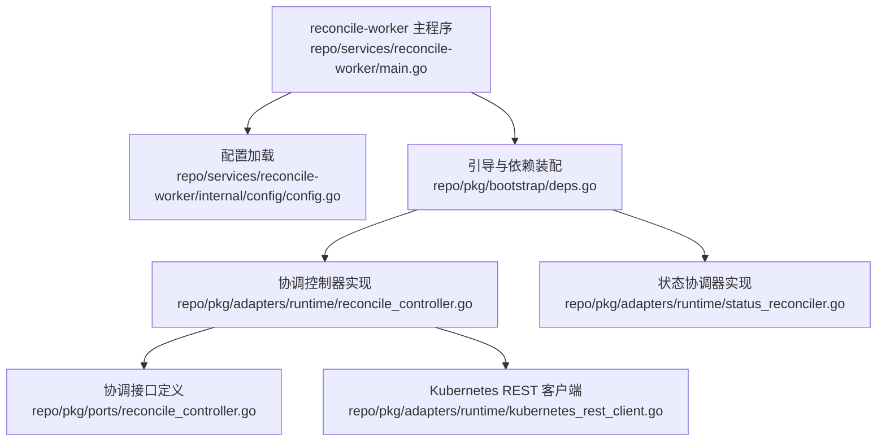
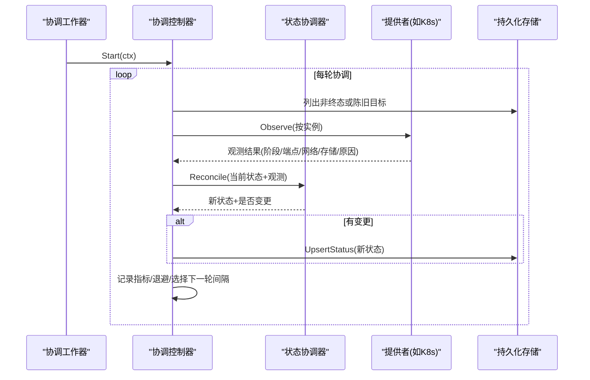
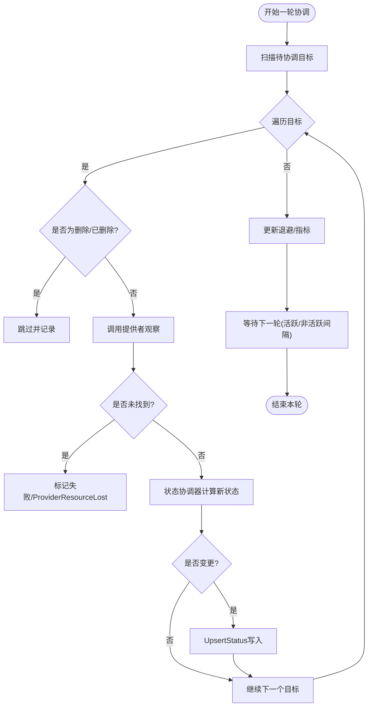
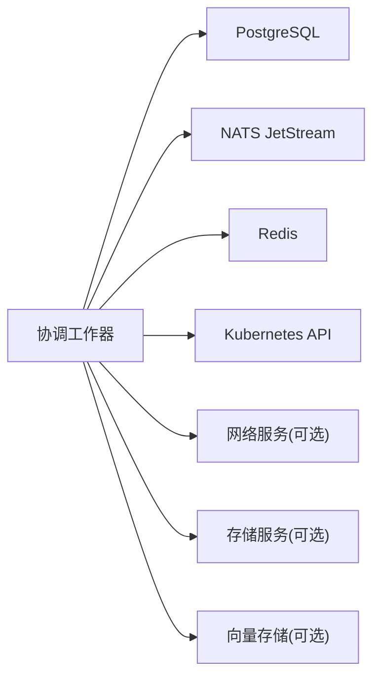

# 协调工作器

<cite>
**本文引用的文件**
- [main.go](file://repo/services/reconcile-worker/main.go)
- [config.go](file://repo/services/reconcile-worker/internal/config/config.go)
- [reconcile_controller.go](file://repo/pkg/adapters/runtime/reconcile_controller.go)
- [status_reconciler.go](file://repo/pkg/adapters/runtime/status_reconciler.go)
- [reconcile_controller.go](file://repo/pkg/ports/reconcile_controller.go)
- [deps.go](file://repo/pkg/bootstrap/deps.go)
- [kubernetes_rest_client.go](file://repo/pkg/adapters/runtime/kubernetes_rest_client.go)
</cite>

## 目录
1. [简介](#简介)
2. [项目结构](#项目结构)
3. [核心组件](#核心组件)
4. [架构总览](#架构总览)
5. [详细组件分析](#详细组件分析)
6. [依赖关系分析](#依赖关系分析)
7. [性能考虑](#性能考虑)
8. [故障排查指南](#故障排查指南)
9. [结论](#结论)
10. [附录](#附录)

## 简介
本文件面向协调工作器（reconcile-worker），系统性说明其状态协调机制、控制器模式实现、资源同步逻辑与冲突解决策略，并给出启动配置、监控指标、故障恢复、性能调优的实践建议。同时提供自定义协调器的开发指南与扩展示例，以及协调循环的工作原理与最佳实践。该工作器以“观察—对齐”的方式持续将底层提供者（如 Kubernetes/KubeVirt/物理机）的实际状态与 ANI Core 控制面存储中的期望状态保持一致，确保在网关重启或外部变更时仍能收敛到一致状态。

## 项目结构
协调工作器由一个最小化的可执行程序组成：加载配置、连接基础设施依赖、启动协调控制器。核心协调逻辑位于运行时适配器与端口定义中，并通过引导模块装配能力。

**图示来源**
- [main.go:1-15](file://repo/services/reconcile-worker/main.go#L1-L15)
- [config.go:1-40](file://repo/services/reconcile-worker/internal/config/config.go#L1-L40)
- [deps.go:89-137](file://repo/pkg/bootstrap/deps.go#L89-L137)
- [reconcile_controller.go:15-114](file://repo/pkg/adapters/runtime/reconcile_controller.go#L15-L114)
- [status_reconciler.go:12-63](file://repo/pkg/adapters/runtime/status_reconciler.go#L12-L63)
- [reconcile_controller.go:8-114](file://repo/pkg/ports/reconcile_controller.go#L8-L114)
- [kubernetes_rest_client.go:63-100](file://repo/pkg/adapters/runtime/kubernetes_rest_client.go#L63-L100)

**章节来源**
- [main.go:1-15](file://repo/services/reconcile-worker/main.go#L1-L15)
- [config.go:1-40](file://repo/services/reconcile-worker/internal/config/config.go#L1-L40)
- [deps.go:89-137](file://repo/pkg/bootstrap/deps.go#L89-L137)

## 核心组件
- 协调控制器（LocalWorkloadReconcileController）：负责后台协调循环，按周期扫描需要处理的实例，调用提供者状态读取与状态协调器，更新持久化状态，并维护退避与指标。
- 状态协调器（LocalStatusReconciler）：根据提供者观测结果映射为内部工作负载状态，计算差异并返回是否变更。
- 协调接口（ports.ReconcileControllerConfig / ReconcileTarget / ReconcileResult 等）：定义协调目标、配置项、结果结构与控制器契约。
- 引导装配（bootstrap.NewCapabilitiesWithConfig）：组装数据库、消息总线、缓存、Kubernetes 客户端、各领域服务与协调控制器；支持可选的基于元数据的领导者选举包装。
- Kubernetes REST 客户端：封装对 K8s API 的访问、超时与幂等重试策略，并在特定条件下将 404 转换为未找到错误以便控制器进行缺失资源处理。

**章节来源**
- [reconcile_controller.go:15-114](file://repo/pkg/adapters/runtime/reconcile_controller.go#L15-L114)
- [status_reconciler.go:12-63](file://repo/pkg/adapters/runtime/status_reconciler.go#L12-L63)
- [reconcile_controller.go:8-114](file://repo/pkg/ports/reconcile_controller.go#L8-L114)
- [deps.go:89-137](file://repo/pkg/bootstrap/deps.go#L89-L137)
- [kubernetes_rest_client.go:63-100](file://repo/pkg/adapters/runtime/kubernetes_rest_client.go#L63-L100)

## 架构总览
协调工作器采用“控制器模式 + 观察者—对齐”的架构：控制器周期性拉取待协调目标，逐个观察提供者实际状态，交由状态协调器计算新状态并写回存储。通过失败退避、活跃/非活跃轮询间隔切换、并发限制与可选领导者选举，保证高可用与稳定性。

**图示来源**
- [reconcile_controller.go:66-156](file://repo/pkg/adapters/runtime/reconcile_controller.go#L66-L156)
- [status_reconciler.go:34-63](file://repo/pkg/adapters/runtime/status_reconciler.go#L34-L63)
- [reconcile_controller.go:8-114](file://repo/pkg/ports/reconcile_controller.go#L8-L114)

## 详细组件分析

### 协调控制器（LocalWorkloadReconcileController）
- 职责
  - 启动协调循环：校验配置后进入无限循环，每次执行一次协调，再根据是否存在瞬态实例选择活跃或非活跃间隔等待。
  - 目标选择：从存储中获取非终态或陈旧的目标列表。
  - 单次协调流程：读取实例、判断是否需要跳过（删除/已删除）、构造应用参数、调用提供者观察、调用状态协调器、仅在变更时写回状态。
  - 失败处理：对瞬态错误进行退避，避免风暴；成功时清除退避。
  - 指标记录：tick、success、failure、skipped_backoff。
- 关键行为
  - 活跃/非活跃间隔：当存在瞬态实例时使用更短的活跃间隔，否则使用正常间隔。
  - 缺失提供者处理：当提供者返回未找到错误时，标记实例为失败并附带“ProviderResourceLost”原因。
  - 并发限制：通过配置项限制每轮最大并发协调数（实现层可按需使用）。

**图示来源**
- [reconcile_controller.go:66-156](file://repo/pkg/adapters/runtime/reconcile_controller.go#L66-L156)
- [reconcile_controller.go:239-317](file://repo/pkg/adapters/runtime/reconcile_controller.go#L239-L317)

**章节来源**
- [reconcile_controller.go:66-156](file://repo/pkg/adapters/runtime/reconcile_controller.go#L66-L156)
- [reconcile_controller.go:239-317](file://repo/pkg/adapters/runtime/reconcile_controller.go#L239-L317)

### 状态协调器（LocalStatusReconciler）
- 职责
  - 校验请求参数。
  - 将提供者阶段映射为内部工作负载状态。
  - 合并端点、节点名、网络、存储、原因等信息。
  - 计算是否发生变更，返回新状态与时间戳。
- 设计要点
  - 仅做状态映射与合并，不创建/删除任何提供者资源，遵循“观察—对齐”原则。
  - 时间戳优先使用观测时间，其次使用协调器当前时间。

**章节来源**
- [status_reconciler.go:12-63](file://repo/pkg/adapters/runtime/status_reconciler.go#L12-L63)

### 协调接口与配置（ports）
- 协调目标（ReconcileTarget）：标识租户、实例、类型、状态、提供者、最近观测时间。
- 协调配置（ReconcileControllerConfig）：正常/活跃间隔、陈旧阈值、最大并发、失败退避秒数。
- 协调结果（ReconcileResult）：包含前后状态、是否变更、提供者缺失标志、原因与协调时间。
- 控制器接口（WorkloadReconcileController）：Start 与 ReconcileNow，明确生命周期与即时触发能力。

**章节来源**
- [reconcile_controller.go:8-114](file://repo/pkg/ports/reconcile_controller.go#L8-L114)

### 引导装配与领导者选举（bootstrap）
- 能力装配：构建元数据、消息总线、缓存、Kubernetes 客户端、各领域服务与协调控制器。
- 协调控制器装配：默认使用本地实现；若启用领导者选举，则用基于元数据的选举器包装，确保多副本下只有一个实例运行协调循环。
- 配置映射：将配置项映射为协调控制器配置（间隔、陈旧阈值、并发、退避）。

**章节来源**
- [deps.go:89-137](file://repo/pkg/bootstrap/deps.go#L89-L137)
- [deps.go:439-447](file://repo/pkg/bootstrap/deps.go#L439-L447)

### Kubernetes REST 客户端与缺失资源处理
- 作用：封装对 K8s API 的访问、超时与幂等重试策略，支持字段管理器与令牌来源。
- 缺失资源处理：当观察到主资源 HTTP 404 时，转换为未找到错误，使控制器能将其识别为“提供者资源丢失”，从而将实例状态置为失败并附带相应原因。

**章节来源**
- [kubernetes_rest_client.go:63-100](file://repo/pkg/adapters/runtime/kubernetes_rest_client.go#L63-L100)

## 依赖关系分析
协调工作器依赖以下关键组件：
- 数据库（PostgreSQL）：用于持久化工作负载实例状态与元数据。
- 消息总线（NATS JetStream）：用于事件分发与任务编排（由引导模块统一接入）。
- 缓存（Redis）：用于短期缓存与限流（由引导模块统一接入）。
- Kubernetes API：作为主要提供者，被状态读取与生命周期操作使用。
- 其他领域服务：网络、存储、向量存储等，按需装配。

**图示来源**
- [deps.go:89-137](file://repo/pkg/bootstrap/deps.go#L89-L137)

**章节来源**
- [deps.go:89-137](file://repo/pkg/bootstrap/deps.go#L89-L137)

## 性能考虑
- 轮询间隔
  - 正常间隔：所有实例处于稳定终态时使用较长间隔，降低系统压力。
  - 活跃间隔：存在瞬态实例时使用较短间隔，加速收敛。
- 并发限制
  - 每轮最大并发协调数：限制对提供者的并发调用，避免过载。
- 失败退避
  - 对瞬态错误进行退避，减少重复失败带来的抖动。
- 陈旧阈值
  - 对长时间未观测的实例提升优先级，尽快刷新状态。
- 指标
  - 通过协调控制器指标（ticks、successes、failures、skipped_backoff）评估吞吐与异常率，指导调优。

[本节为通用性能指导，不直接分析具体文件]

## 故障排查指南
- 常见问题定位
  - 协调循环未运行：检查引导装配是否启用协调控制器，确认健康端口与服务名称配置。
  - 提供者不可达：检查 Kubernetes API 配置与网络连通性；关注超时与重试策略。
  - 资源丢失：当提供者返回未找到错误时，控制器会将实例标记为失败并附带“ProviderResourceLost”原因；检查外部删除路径与幂等性。
  - 状态不一致：核对状态协调器映射逻辑与观测数据完整性（端点、网络、存储、节点名、原因）。
- 诊断手段
  - 查看协调控制器指标：ticks、successes、failures、skipped_backoff。
  - 检查实例状态与更新时间：确认是否被正确 Upsert。
  - 验证配置项：正常/活跃间隔、陈旧阈值、并发限制、失败退避。
  - 日志与探针：结合健康检查与日志输出定位问题。

**章节来源**
- [reconcile_controller.go:66-156](file://repo/pkg/adapters/runtime/reconcile_controller.go#L66-L156)
- [reconcile_controller.go:239-317](file://repo/pkg/adapters/runtime/reconcile_controller.go#L239-L317)
- [status_reconciler.go:34-63](file://repo/pkg/adapters/runtime/status_reconciler.go#L34-L63)

## 结论
协调工作器通过清晰的控制器模式与“观察—对齐”机制，实现了跨多种提供者的状态一致性保障。其配置化轮询、失败退避、并发限制与可选领导者选举，使其在生产环境中具备高可用与可扩展性。配合完善的指标与故障恢复策略，能够有效应对外部资源变更与系统波动，确保控制面与数据面的一致性。

[本节为总结性内容，不直接分析具体文件]

## 附录

### 启动配置与环境变量
- 数据库地址：DATABASE_URL
- 消息总线地址：NATS_URL
- 缓存地址：REDIS_URL
- 健康检查端口：HEALTH_PORT
- 服务名称：ServiceName（固定为 reconcile-worker）
- 协调控制器开关：WorkloadReconcileControllerEnabled（默认启用）

**章节来源**
- [config.go:10-20](file://repo/services/reconcile-worker/internal/config/config.go#L10-L20)

### 监控指标
- ticks：协调循环轮次计数
- successes：成功协调次数
- failures：失败协调次数
- skipped_backoff：因退避而跳过的次数

**章节来源**
- [reconcile_controller.go:265-289](file://repo/pkg/adapters/runtime/reconcile_controller.go#L265-L289)
- [reconcile_controller.go:60-64](file://repo/pkg/adapters/runtime/reconcile_controller.go#L60-L64)

### 故障恢复与幂等性
- 幂等性：重复协调同一实例应保持状态一致，不会破坏已有失败状态。
- 缺失资源恢复：当外部删除导致提供者资源丢失时，控制器会持久化失败状态；后续恢复提供者后，再次协调可重新收敛。
- 领导者选举：在多副本部署中，通过基于元数据的选举器确保仅一个实例运行协调循环，避免重复执行。

**章节来源**
- [deps.go:123-137](file://repo/pkg/bootstrap/deps.go#L123-L137)
- [reconcile_controller.go:89-156](file://repo/pkg/adapters/runtime/reconcile_controller.go#L89-L156)

### 自定义协调器开发指南
- 扩展点
  - 实现 WorkloadReconcileController 接口：提供 Start 与 ReconcileNow。
  - 实现 WorkloadStatusReconciler 接口：实现状态映射与差异计算。
  - 实现 ReconcileTargetLister 接口：提供目标列表查询逻辑。
- 集成方式
  - 在引导装配中替换默认实现，或通过选项注入自定义实现。
  - 如需 HA，使用领导者选举器包装控制器。
- 最佳实践
  - 保持“观察—对齐”原则，不在协调器中创建/删除提供者资源。
  - 合理设置轮询间隔与并发限制，避免对提供者造成压力。
  - 完善指标与日志，便于监控与排障。

**章节来源**
- [reconcile_controller.go:8-114](file://repo/pkg/ports/reconcile_controller.go#L8-L114)
- [deps.go:89-137](file://repo/pkg/bootstrap/deps.go#L89-L137)

### 扩展示例
- 示例场景：为新的提供者（如私有云平台）添加状态读取与状态映射。
- 步骤
  - 实现 WorkloadProviderStatusReader：读取提供者状态并返回观测结果。
  - 扩展 LocalStatusReconciler：新增提供者阶段到内部状态的映射。
  - 在引导装配中注册新提供者适配器。
  - 调整协调控制器配置：针对新提供者的特性优化间隔与并发。
- 验证
  - 编写单元测试覆盖正常、异常与缺失资源场景。
  - 通过 live-gate 或端到端测试验证协调路径的正确性与幂等性。

[本节为概念性扩展示例，不直接分析具体文件]