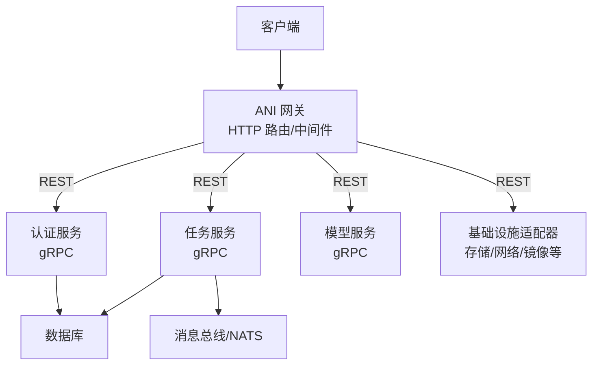
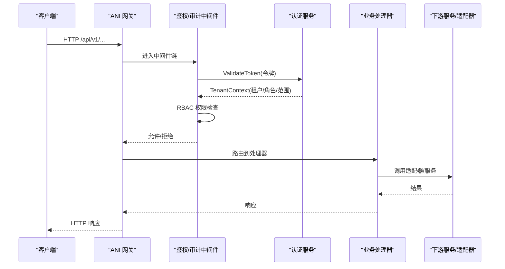
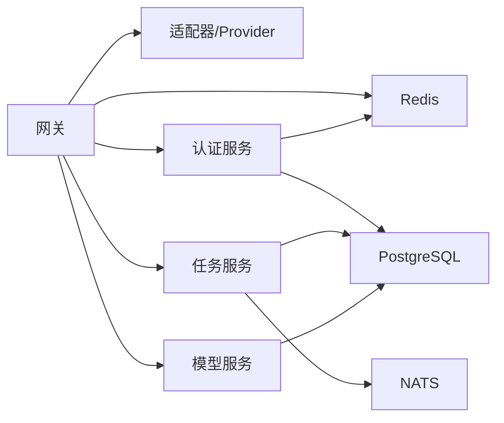

# 核心服务

<cite>
**本文引用的文件**
- [README.md](file://repo/README.md)
- [main.go（网关）](file://repo/services/ani-gateway/main.go)
- [router.go（网关路由）](file://repo/services/ani-gateway/internal/router/router.go)
- [auth_service.proto](file://repo/api/proto/auth/v1/auth_service.proto)
- [main.go（认证服务）](file://repo/services/auth-service/main.go)
- [auth_service.go（认证服务实现）](file://repo/services/auth-service/internal/service/auth_service.go)
- [main.go（任务服务）](file://repo/services/task-service/main.go)
- [task_service.go（任务服务实现）](file://repo/services/task-service/internal/service/task_service.go)
- [main.go（模型服务）](file://repo/services/model-service/main.go)
- [v1.yaml（Core OpenAPI）](file://repo/api/openapi/v1.yaml)
- [server.go（引导与gRPC启动）](file://repo/pkg/bootstrap/server.go)
- [errors.go（通用错误类型）](file://repo/pkg/types/errors.go)
- [audit.go（审计中间件）](file://repo/services/ani-gateway/internal/middleware/audit.go)
</cite>

## 目录
1. [简介](#简介)
2. [项目结构](#项目结构)
3. [核心组件](#核心组件)
4. [架构总览](#架构总览)
5. [详细组件分析](#详细组件分析)
6. [依赖关系分析](#依赖关系分析)
7. [性能考量](#性能考量)
8. [故障排查指南](#故障排查指南)
9. [结论](#结论)
10. [附录](#附录)

## 简介
本文件面向 ANI 核心服务的开发者与运维人员，系统性说明 API 网关、认证授权、异步任务、模型服务等核心组件的职责、接口契约、配置项与集成方式。重点覆盖：
- API 网关的路由机制、中间件链、错误处理策略
- 认证授权的多租户鉴权、RBAC 权限控制、OIDC 集成
- 任务的异步处理、Outbox 模式与工作器租约/心跳
- 模型服务的版本管理与推理服务部署要点
并提供可追溯的代码级来源与图示，便于快速定位实现细节。

## 项目结构
ANI 采用 monorepo 组织，核心服务位于 services 目录，公共能力抽象在 pkg，API 契约在 api。Gateway 作为统一 HTTP 入口，将 Core 资源路由到本地适配器或下游 gRPC 服务；认证、任务、模型等服务通过 gRPC 暴露能力。

**图表来源**
- [main.go（网关）:20-220](file://repo/services/ani-gateway/main.go#L20-L220)
- [router.go（网关路由）:47-102](file://repo/services/ani-gateway/internal/router/router.go#L47-L102)
- [server.go（引导与gRPC启动）:387-445](file://repo/pkg/bootstrap/server.go#L387-L445)

**章节来源**
- [README.md:18-67](file://repo/README.md#L18-L67)
- [main.go（网关）:20-220](file://repo/services/ani-gateway/main.go#L20-L220)
- [router.go（网关路由）:47-102](file://repo/services/ani-gateway/internal/router/router.go#L47-L102)

## 核心组件
- API 网关：负责 HTTP 路由注册、中间件链（鉴权、限流、幂等、审计）、健康探针、OpenAI 兼容推理代理、以及将请求分发到各后端服务或本地适配器。
- 认证授权服务：提供登录、OIDC 流程、令牌签发与校验、令牌撤销、API Key 管理、RBAC 权限检查。
- 任务服务：提供任务查询、工作器租约获取与心跳、进度更新、失败与完成状态变更；配合 Outbox 发布事件。
- 模型服务：提供模型仓库的 CRUD 能力（当前为早期 Services 逻辑），通过 gRPC 暴露。

**章节来源**
- [main.go（网关）:20-220](file://repo/services/ani-gateway/main.go#L20-L220)
- [auth_service.proto:11-30](file://repo/api/proto/auth/v1/auth_service.proto#L11-L30)
- [auth_service.go（认证服务实现）:21-57](file://repo/services/auth-service/internal/service/auth_service.go#L21-L57)
- [task_service.go（任务服务实现）:22-34](file://repo/services/task-service/internal/service/task_service.go#L22-L34)
- [main.go（模型服务）:10-18](file://repo/services/model-service/main.go#L10-L18)

## 架构总览
下图展示一次典型请求从网关进入，经过中间件鉴权与 RBAC，再调用认证服务校验令牌并返回租户上下文，随后路由至具体业务处理器或下游服务。

**图表来源**
- [router.go（网关路由）:47-102](file://repo/services/ani-gateway/internal/router/router.go#L47-L102)
- [auth_service.go（认证服务实现）:123-159](file://repo/services/auth-service/internal/service/auth_service.go#L123-L159)
- [audit.go（审计中间件）:10-55](file://repo/services/ani-gateway/internal/middleware/audit.go#L10-L55)

## 详细组件分析

### API 网关
职责
- 启动 Hertz 服务器，加载各运行时适配器（K8s 集群代理、加密、密钥、GPU 库存、网络、存储、镜像仓库、向量库、实例观测等）。
- 注册路由组：/api/v1（Core 资源）、/api/v1/svc（Services 过渡路由）、/v1（OpenAI 兼容推理代理）。
- 注入中间件：审计、鉴权、限流、幂等、RBAC、请求 ID 等。
- 提供健康/就绪探针与优雅关闭。

路由机制
- 使用 RegisterWithOptions 集中注册所有资源路由，按资源域分组。
- 对可选依赖（如 KB 服务、向量库）提供降级路径，保证网关在无后端时仍可启动。

中间件处理
- 审计：非阻塞记录请求元数据，避免影响主链路。
- 鉴权与 RBAC：通过认证服务校验令牌与权限。
- 限流与幂等：基于 Redis 共享存储实现。

错误处理策略
- 统一错误码映射（NOT_FOUND、CONFLICT、UNAUTHORIZED、FORBIDDEN、BAD_REQUEST、RATE_LIMIT_EXCEEDED、INTERNAL_ERROR）。
- 健康端点独立于业务路由，不受鉴权限制。

配置选项（节选）
- 监听地址：GATEWAY_LISTEN_ADDR（默认 :8080）
- Redis 连接：GATEWAY_REDIS_URL/REDIS_URL、模式/节点/主从/凭据/DB
- 各 Provider 环境变量：WORKLOAD_PROVIDER、NETWORK_PROVIDER、STORAGE_PROVIDER、REGISTRY_PROVIDER_MODE、HARBOR_*、VECTOR_STORE_*、INSTANCE_OBSERVABILITY_* 等
- 健康端口：HEALTH_PORT

最佳实践
- 通过环境变量覆盖默认值，生产环境务必显式配置 Redis、Provider 与 TLS。
- 对无后端的可选能力保持降级，确保网关可用性。
- 使用统一的错误类型与 HTTP 状态映射，便于前端一致处理。

**章节来源**
- [main.go（网关）:20-220](file://repo/services/ani-gateway/main.go#L20-L220)
- [router.go（网关路由）:47-102](file://repo/services/ani-gateway/internal/router/router.go#L47-L102)
- [audit.go（审计中间件）:10-55](file://repo/services/ani-gateway/internal/middleware/audit.go#L10-L55)
- [server.go（引导与gRPC启动）:387-445](file://repo/pkg/bootstrap/server.go#L387-L445)
- [v1.yaml（Core OpenAPI）:24-38](file://repo/api/openapi/v1.yaml#L24-L38)

### 认证授权服务
职责
- 多租户认证：支持密码登录、平台密码登录、OIDC 登录流程。
- 令牌管理：签发 Access Token、Refresh Token、令牌撤销（黑名单）。
- API Key 管理：创建、列举、撤销，支持速率限制。
- 权限控制：基于角色的访问控制（RBAC），支持 scope 粒度。

API 接口（gRPC）
- Login / PlatformPasswordLogin：返回 TokenPair
- BeginOIDCLogin / CompleteOIDCLogin：OIDC 授权码流程
- RefreshToken：续期 Access Token
- RevokeToken：加入令牌黑名单
- ValidateToken：内部校验令牌并返回租户上下文
- CheckPermission：RBAC 权限判断
- Create/List/Revoke APIKey：API Key 生命周期

多租户与 OIDC
- 登录请求携带 tenant_name 进行租户隔离。
- OIDC 集成包含授权 URL、回调、JWKS 与 group-to-role 映射。

错误处理
- 未配置功能返回 Unimplemented/FailedPrecondition。
- 无效令牌返回 Unauthenticated。
- 速率限制返回 ResourceExhausted。

配置选项（节选）
- JWT：公钥/私钥、Issuer
- OIDC：IssuerURL、ClientID/Secret、AuthURL、TokenURL、JWKSURL、GroupRoleMapJSON
- gRPC 端口：GRPC_PORT

最佳实践
- 使用短期 Access Token + Refresh Token 组合，降低泄露风险。
- 通过 CheckPermission 在网关侧做细粒度 RBAC 拦截。
- 对敏感操作启用令牌黑名单，支持即时失效。

**章节来源**
- [auth_service.proto:11-30](file://repo/api/proto/auth/v1/auth_service.proto#L11-L30)
- [auth_service.go（认证服务实现）:59-159](file://repo/services/auth-service/internal/service/auth_service.go#L59-L159)
- [main.go（认证服务）:9-31](file://repo/services/auth-service/main.go#L9-L31)

### 任务服务
职责
- 任务查询：按租户与任务 ID 获取任务详情。
- 工作器协作：租约获取、心跳续期、进度更新、失败与完成。
- Outbox 模式：可选开启，将领域事件持久化并通过消息总线发布。

异步处理与工作器调度
- AcquireTaskLease：工作器竞争获取任务租约，防止重复执行。
- HeartbeatTaskLease：周期性续租，超时释放。
- UpdateTaskProgress：上报进度百分比。
- FailTask/CompleteTask：事务性写入最终状态，失败时支持补偿动作。

Outbox 模式
- 通过 OutboxPublisher 轮询待发布事件，批量推送到消息总线，保障“写库即发信”的最终一致性。

配置选项（节选）
- OutboxEnabled：是否启用 Outbox
- OutboxPollInterval：轮询间隔
- OutboxBatchSize：批量大小
- gRPC 端口：GRPC_PORT

错误处理
- 参数校验失败返回 InvalidArgument。
- 租约冲突返回 AlreadyExists。
- 未知错误返回 Internal。

最佳实践
- 工作器必须实现租约与心跳，避免僵尸任务。
- 使用事务包裹状态变更，保证一致性。
- 合理设置最大重试次数与死信队列，便于问题追踪。

**章节来源**
- [main.go（任务服务）:15-36](file://repo/services/task-service/main.go#L15-L36)
- [task_service.go（任务服务实现）:36-151](file://repo/services/task-service/internal/service/task_service.go#L36-L151)

### 模型服务
职责
- 提供模型仓库的基础 CRUD 能力（早期 Services 逻辑），通过 gRPC 暴露。
- 与存储层交互，持久化模型元数据。

版本管理与推理服务部署
- 版本管理：通过模型资源的版本字段与列表接口进行演进与回滚。
- 推理服务：结合网关 /v1 推理代理与外部推理运行时（如 vLLM、Triton）进行部署与流量转发。

配置选项（节选）
- gRPC 端口：GRPC_PORT
- 存储相关：通过 bootstrap 配置对象存储/向量库等

最佳实践
- 对外暴露稳定 gRPC 接口，内部实现可替换。
- 推理服务应与健康探针、弹性伸缩、灰度发布策略结合。

**章节来源**
- [main.go（模型服务）:10-18](file://repo/services/model-service/main.go#L10-L18)

## 依赖关系分析
- 网关依赖：各 Provider 适配器（网络、存储、镜像、向量库、实例观测）、Redis 共享存储、KB 服务（可选）、任务存储（用于任务路由）。
- 认证服务依赖：PostgreSQL、Redis（令牌黑名单/缓存）、JWT/OIDC 配置。
- 任务服务依赖：PostgreSQL（任务与 Outbox）、NATS（消息总线）。
- 模型服务依赖：PostgreSQL（模型元数据）。

**图表来源**
- [main.go（网关）:20-220](file://repo/services/ani-gateway/main.go#L20-L220)
- [server.go（引导与gRPC启动）:387-445](file://repo/pkg/bootstrap/server.go#L387-L445)

**章节来源**
- [main.go（网关）:20-220](file://repo/services/ani-gateway/main.go#L20-L220)
- [server.go（引导与gRPC启动）:387-445](file://repo/pkg/bootstrap/server.go#L387-L445)

## 性能考量
- 网关层：
  - 使用 Hertz 高性能 HTTP 框架，合理设置监听地址与优雅关闭。
  - 中间件尽量非阻塞（如审计），避免放大延迟。
  - 对无后端能力提供降级，减少冷启动失败。
- 认证服务：
  - JWT 校验与 RBAC 计算应在内存中高效完成，借助 Redis 缓存热点数据。
  - 令牌黑名单需考虑高并发写入与过期清理。
- 任务服务：
  - 租约与心跳需设置合理 TTL，避免频繁锁竞争。
  - Outbox 批量推送可降低消息总线压力。
- 通用：
  - 统一错误映射，减少不必要的重试风暴。
  - 健康探针独立端口，避免与业务争抢资源。

[本节为通用指导，不直接分析具体文件]

## 故障排查指南
常见问题与定位建议
- 网关无法启动：
  - 检查 Redis 连接与各 Provider 配置是否正确。
  - 查看日志中的初始化错误信息。
- 鉴权失败：
  - 确认令牌格式与签名，检查 OIDC/JWT 配置。
  - 使用 ValidateToken 接口验证令牌有效性。
- 权限不足：
  - 检查角色与 scope 是否匹配资源与动作。
  - 使用 CheckPermission 接口进行预检。
- 任务卡住：
  - 检查工作器是否持续发送心跳。
  - 查看租约是否被其他工作器持有。
- 错误码不一致：
  - 对照 OpenAPI 错误定义与统一错误类型映射。

参考实现
- 统一错误类型与 HTTP 状态映射见通用错误模块。
- 健康探针与 gRPC 拦截器见引导模块。

**章节来源**
- [errors.go（通用错误类型）:9-74](file://repo/pkg/types/errors.go#L9-L74)
- [server.go（引导与gRPC启动）:551-574](file://repo/pkg/bootstrap/server.go#L551-L574)

## 结论
ANI 核心服务以网关为中心，通过清晰的边界与契约将认证、任务、模型等能力解耦。网关提供稳定的 HTTP 入口与中间件能力；认证服务实现多租户与 RBAC；任务服务保障异步处理的可靠性；模型服务支撑模型生命周期与推理部署。遵循本文的配置与最佳实践，可在不同环境中快速集成与扩展。

[本节为总结，不直接分析具体文件]

## 附录
- API 契约：Core 与 Services 的 OpenAPI 定义位于 api/openapi。
- gRPC 协议：各服务接口定义位于 api/proto。
- 构建与验证：使用 make test 与 make validate-* 进行质量门禁。

[本节为补充信息，不直接分析具体文件]