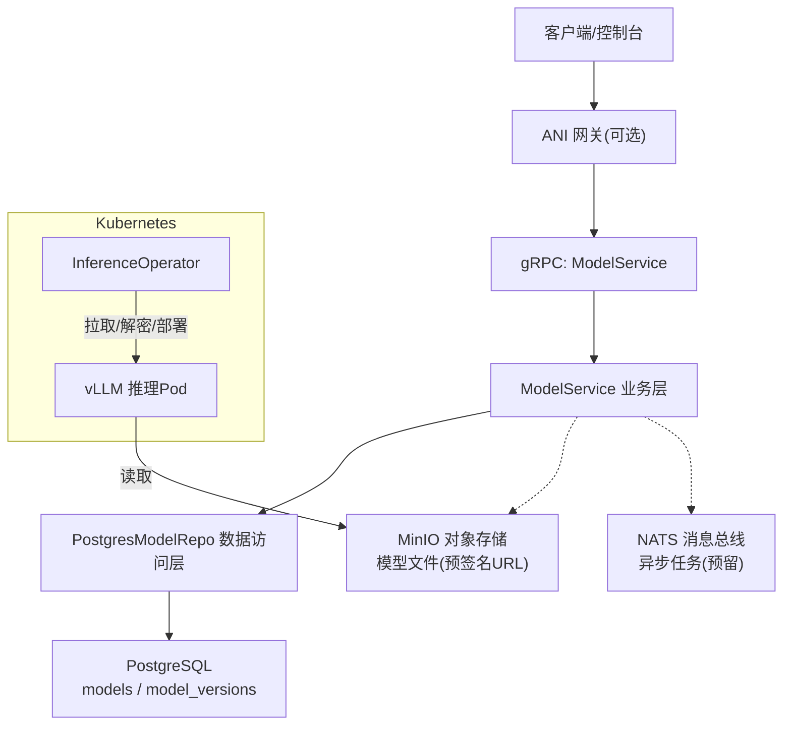
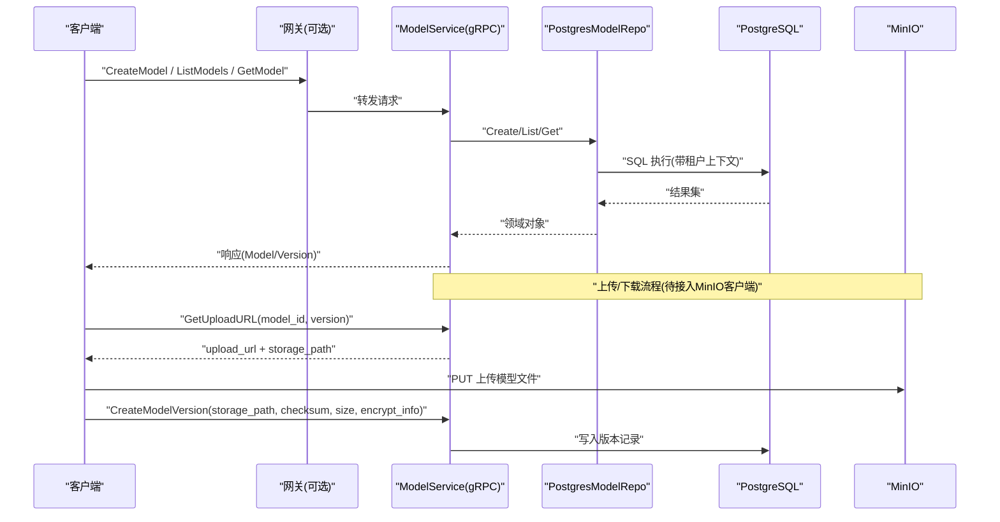
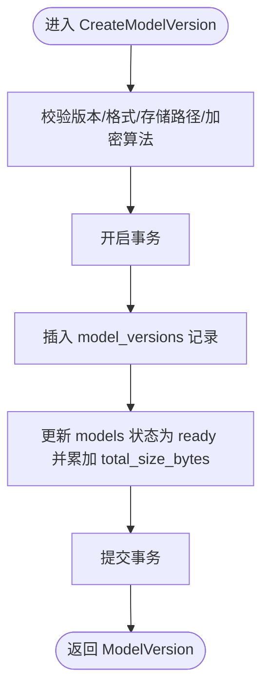
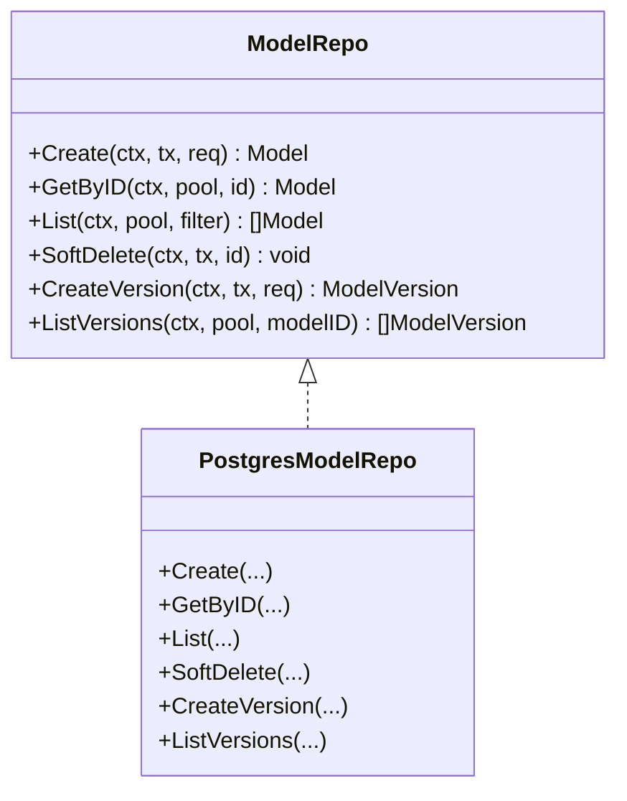
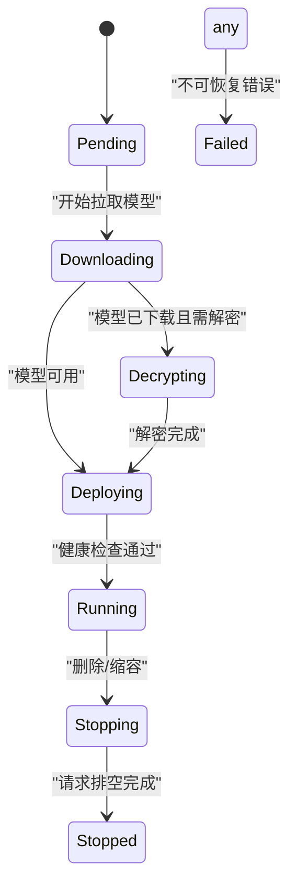
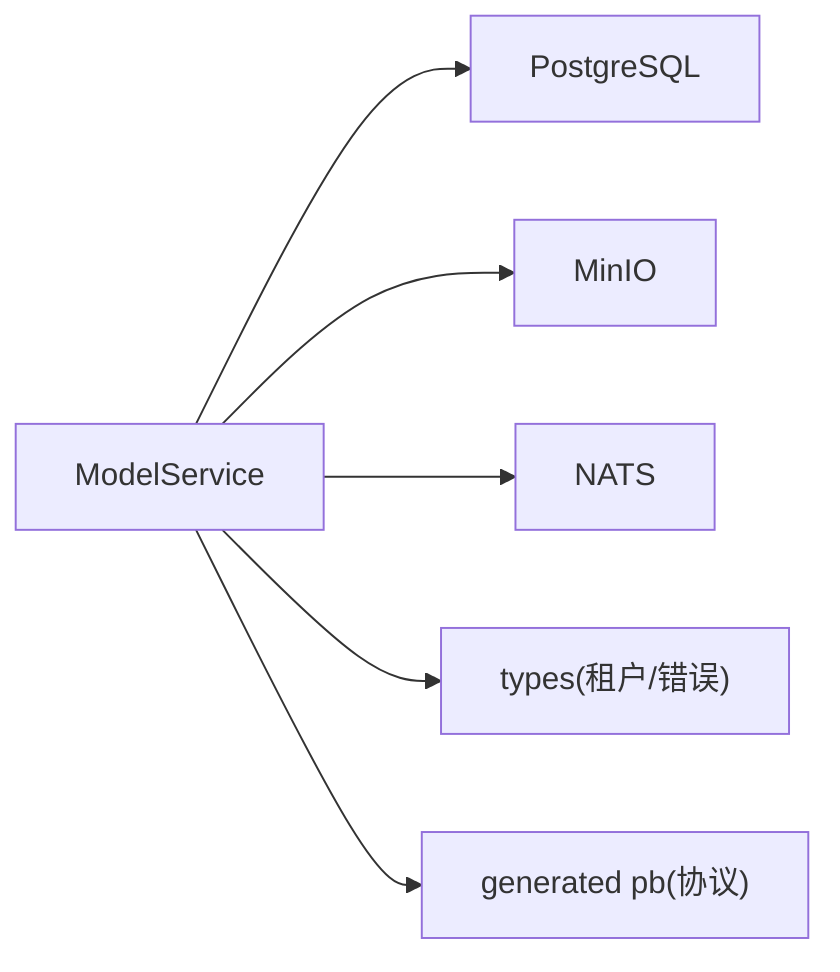

# 模型服务

<cite>
**本文引用的文件**
- [model_service.proto](file://repo/api/proto/model/v1/model_service.proto)
- [main.go](file://services/model-service/main.go)
- [model_service.go](file://services/model-service/internal/service/model_service.go)
- [model_repo.go](file://services/model-service/internal/repo/model_repo.go)
- [config.go](file://services/model-service/internal/config/config.go)
- [inferenceservice_types.go](file://operators/inference-operator/api/v1/inferenceservice_types.go)
- [20260501_001_init_schema.sql](file://deploy/migrations/20260501_001_init_schema.sql)
</cite>

## 目录
1. [简介](#简介)
2. [项目结构](#项目结构)
3. [核心组件](#核心组件)
4. [架构总览](#架构总览)
5. [详细组件分析](#详细组件分析)
6. [依赖关系分析](#依赖关系分析)
7. [性能与扩展性](#性能与扩展性)
8. [故障排查指南](#故障排查指南)
9. [结论](#结论)
10. [附录：API 接口与使用示例](#附录api-接口与使用示例)

## 简介
本文件面向“模型服务”（Model Service），系统性说明其在 ANI 平台中的职责与实现，覆盖以下能力：
- 模型注册表：模型的创建、查询、列表、软删除与版本管理。
- 元数据存储：基于 PostgreSQL 的租户隔离存储，包含模型与版本信息、加密标记与格式等。
- 推理服务部署：通过 InferenceService CRD 驱动 vLLM 推理 Pod 的下载、解密与部署生命周期。
- 模型仓库集成：支持上传直传到 MinIO 并生成预签名 URL；预留 HuggingFace/ModelScope 异步导入任务。
- 安全与合规：可选加密存储（SM4/ZUC/AES-256-GCM）、租户级行级隔离（RLS）、审计与计量基础。
- API 契约：gRPC ModelService 定义，提供模型与版本管理的标准接口。

## 项目结构
模型服务采用 Go 微服务形态，入口程序加载配置、连接基础设施（数据库、消息总线、缓存），注册 gRPC 服务，并通过仓储层访问 PostgreSQL。推理侧由 Kubernetes Operator 管理，CRD 为 InferenceService。

图表来源
- [main.go:1-19](file://services/model-service/main.go#L1-L19)
- [model_service.go:22-34](file://services/model-service/internal/service/model_service.go#L22-L34)
- [model_repo.go:16-29](file://services/model-service/internal/repo/model_repo.go#L16-L29)
- [inferenceservice_types.go:55-96](file://operators/inference-operator/api/v1/inferenceservice_types.go#L55-L96)

章节来源
- [main.go:1-19](file://services/model-service/main.go#L1-L19)
- [config.go:10-20](file://services/model-service/internal/config/config.go#L10-L20)

## 核心组件
- 服务入口与启动：加载配置、建立数据库连接、构造仓储与服务、注册 gRPC 端点。
- 业务服务：实现模型与版本的 CRUD、校验、事务控制、错误映射。
- 数据仓储：封装 Postgres 操作，包括模型与版本读写、分页、软删除、租户上下文注入。
- 数据模型：models 与 model_versions 两张核心表，承载模型元数据与版本信息。
- 推理编排：InferenceService CRD 描述推理服务的期望状态，Operator 负责将模型下载到 Pod 并启动推理。

章节来源
- [model_service.go:36-184](file://services/model-service/internal/service/model_service.go#L36-L184)
- [model_repo.go:90-245](file://services/model-service/internal/repo/model_repo.go#L90-L245)
- [20260501_001_init_schema.sql:126-180](file://deploy/migrations/20260501_001_init_schema.sql#L126-L180)
- [inferenceservice_types.go:55-144](file://operators/inference-operator/api/v1/inferenceservice_types.go#L55-L144)

## 架构总览
模型服务作为私有模型注册中心，对外暴露 gRPC 接口，对内通过仓储访问 PostgreSQL，并与对象存储（MinIO）协作完成模型文件的上传与下载。推理侧通过 InferenceService CRD 驱动 vLLM 推理 Pod 的生命周期，包括模型拉取、解密与部署。

图表来源
- [model_service.proto:12-40](file://repo/api/proto/model/v1/model_service.proto#L12-L40)
- [model_service.go:36-184](file://services/model-service/internal/service/model_service.go#L36-L184)
- [model_repo.go:90-245](file://services/model-service/internal/repo/model_repo.go#L90-L245)

## 详细组件分析

### 服务入口与配置
- 入口 main 函数：加载配置、连接基础设施、初始化仓储与服务、启动 gRPC。
- 配置项：数据库 URL、NATS URL、Redis URL、gRPC 端口、健康检查端口、服务名。

章节来源
- [main.go:10-18](file://services/model-service/main.go#L10-L18)
- [config.go:10-20](file://services/model-service/internal/config/config.go#L10-L20)

### 业务服务（ModelService）
- 能力清单：
  - CreateModel：创建模型元数据，设置 source=upload。
  - GetModel/ListModels：按租户查询模型与分页列表。
  - DeleteModel：软删除模型（若被推理服务引用则失败）。
  - CreateModelVersion：注册新版本，更新模型状态与累计大小。
  - GetUploadURL：返回 MinIO 预签名 PUT URL（当前未实现，占位）。
  - ImportModel：从 HuggingFace/ModelScope 异步导入（当前未实现，占位）。
  - GetModelDownloadURL：返回 MinIO 预签名 GET URL（当前未实现，占位）。
- 关键逻辑：
  - 参数校验：模型名称正则、版本必填、格式白名单、加密算法白名单。
  - 事务控制：创建/删除/版本注册均使用事务，确保一致性。
  - 错误映射：统一转换为 gRPC 状态码（NotFound/AlreadyExists/InvalidArgument/PermissionDenied/Unauthenticated/Internal）。
  - 租户隔离：在上下文中注入 tenant_id，并在仓储层设置数据库会话变量以启用 RLS。

图表来源
- [model_service.go:139-172](file://services/model-service/internal/service/model_service.go#L139-L172)
- [model_repo.go:218-245](file://services/model-service/internal/repo/model_repo.go#L218-L245)

章节来源
- [model_service.go:36-184](file://services/model-service/internal/service/model_service.go#L36-L184)
- [model_service.go:186-218](file://services/model-service/internal/service/model_service.go#L186-L218)
- [model_service.go:282-297](file://services/model-service/internal/service/model_service.go#L282-L297)

### 数据仓储（PostgresModelRepo）
- 能力清单：
  - Create：插入 models 记录，默认 source=upload。
  - GetByID：按 ID 获取模型及版本列表。
  - List：分页查询模型列表，支持状态过滤与游标翻页。
  - SoftDelete：软删除模型（status=deleted）。
  - CreateVersion：插入 model_versions，并更新 models 的状态与累计大小。
  - ListVersions：按模型 ID 列出所有版本。
- 关键特性：
  - 租户上下文：通过 SetDBTenant 设置 current_setting('app.current_tenant_id')，配合 RLS 策略实现行级隔离。
  - 分页：使用 created_at 与 id 组合编码游标，保证稳定排序。
  - 索引：对 tenant_id、status、created_at 等字段建立索引以提升查询性能。

图表来源
- [model_repo.go:16-29](file://services/model-service/internal/repo/model_repo.go#L16-L29)

章节来源
- [model_repo.go:90-245](file://services/model-service/internal/repo/model_repo.go#L90-L245)
- [model_repo.go:264-341](file://services/model-service/internal/repo/model_repo.go#L264-L341)

### 数据模型与迁移
- 核心表：
  - models：模型元数据，包含租户、名称、显示名、描述、来源、能力、状态、错误信息、累计大小、时间戳。
  - model_versions：版本信息，包含模型关联、版本号、格式、加密标志与算法、大小、校验和、存储路径、配置 JSON、时间戳。
  - model_import_tasks：异步导入任务进度与状态（用于 HuggingFace/ModelScope 导入）。
- 行级安全（RLS）：所有相关表启用 RLS，通过 current_setting('app.current_tenant_id') 进行租户隔离。
- 索引与约束：唯一键（tenant_id,name）、外键约束、状态枚举约束、索引优化查询。

章节来源
- [20260501_001_init_schema.sql:126-180](file://deploy/migrations/20260501_001_init_schema.sql#L126-L180)
- [20260501_001_init_schema.sql:556-568](file://deploy/migrations/20260501_001_init_schema.sql#L556-L568)

### 推理服务与 Operator
- InferenceService CRD：
  - Spec：指定模型标识（name:version）、副本数、GPU 类型与数量、最大并发、放置偏好、加密密钥引用、优雅停机超时。
  - Status：阶段（Pending/Downloading/Decrypting/Deploying/Running/Stopping/Stopped/Failed）、就绪副本数、端点 URL、条件与消息。
- 生命周期：
  - Pending → Downloading：开始拉取模型。
  - Downloading → Decrypting：模型下载完成，如需解密则进入解密阶段。
  - Decrypting/Downloading → Deploying：调度 vLLM Pod。
  - Deploying → Running：健康检查通过。
  - Running → Stopping → Stopped：优雅停机，等待请求结束。
  - 任意阶段 → Failed：不可恢复错误。

图表来源
- [inferenceservice_types.go:18-42](file://operators/inference-operator/api/v1/inferenceservice_types.go#L18-L42)
- [inferenceservice_types.go:55-96](file://operators/inference-operator/api/v1/inferenceservice_types.go#L55-L96)
- [inferenceservice_types.go:116-144](file://operators/inference-operator/api/v1/inferenceservice_types.go#L116-L144)

章节来源
- [inferenceservice_types.go:55-144](file://operators/inference-operator/api/v1/inferenceservice_types.go#L55-L144)

## 依赖关系分析
- 外部依赖：
  - PostgreSQL：持久化模型与版本元数据，启用 RLS 实现租户隔离。
  - MinIO：对象存储，用于模型文件上传与下载（预签名 URL 机制）。
  - NATS：消息总线，用于异步任务（如模型导入）发布与消费（当前预留）。
  - Redis：缓存与会话（当前未直接使用，保留配置）。
- 内部依赖：
  - bootstrap：通用启动与依赖注入（数据库、NATS、Redis 连接）。
  - types：通用类型与错误封装、租户上下文处理。
  - generated pb：gRPC 协议生成的类型与注册方法。

图表来源
- [main.go:10-18](file://services/model-service/main.go#L10-L18)
- [model_service.go:3-20](file://services/model-service/internal/service/model_service.go#L3-L20)
- [model_repo.go:3-14](file://services/model-service/internal/repo/model_repo.go#L3-L14)

章节来源
- [main.go:10-18](file://services/model-service/main.go#L10-L18)
- [model_service.go:3-20](file://services/model-service/internal/service/model_service.go#L3-L20)
- [model_repo.go:3-14](file://services/model-service/internal/repo/model_repo.go#L3-L14)

## 性能与扩展性
- 查询性能：
  - 列表分页：使用 created_at 与 id 组合游标，避免深翻页开销。
  - 索引优化：对 tenant_id、status、created_at 建索引，提升过滤与排序效率。
- 事务与一致性：
  - 写操作使用事务，确保模型状态与版本记录的原子性。
  - 软删除避免硬删导致的引用不一致。
- 可扩展点：
  - MinIO 客户端接入：实现 GetUploadURL 与 GetModelDownloadURL，支持大文件直传与高效下载。
  - 异步导入：结合 outbox 与 worker 实现 HuggingFace/ModelScope 导入任务，支持进度回调与重试。
  - 监控与计量：利用 inference_audit_logs 与 metering_records 记录调用量与资源消耗，便于容量规划与计费。

[本节为通用指导，不直接分析具体文件]

## 故障排查指南
- 常见错误与状态码：
  - NotFound：模型或版本不存在。
  - AlreadyExists：重复创建同名模型或版本。
  - InvalidArgument：参数校验失败（名称、格式、加密算法等）。
  - PermissionDenied：权限不足（租户或角色限制）。
  - Unauthenticated：认证失败。
  - Internal：内部错误（数据库、事务、系统异常）。
- 排查步骤：
  - 检查租户上下文是否正确注入（current_setting('app.current_tenant_id')）。
  - 核对模型名称与版本格式是否符合约定。
  - 查看数据库日志与事务执行情况，确认是否发生死锁或长事务。
  - 验证 MinIO 权限与网络连通性（上传/下载 URL 生成与访问）。
  - 对于异步导入任务，检查 outbox 事件与 worker 消费情况。

章节来源
- [model_service.go:282-297](file://services/model-service/internal/service/model_service.go#L282-L297)
- [model_repo.go:327-341](file://services/model-service/internal/repo/model_repo.go#L327-L341)

## 结论
模型服务提供了完整的模型注册与版本管理能力，结合 PostgreSQL 的租户隔离与 MinIO 的对象存储，实现了安全、可扩展的模型仓库。推理侧通过 InferenceService CRD 与 Operator 协同，完成模型的下载、解密与部署。未来可进一步完善 MinIO 集成与异步导入任务，增强监控与计量能力，提升整体平台的 AI 模型治理能力。

[本节为总结，不直接分析具体文件]

## 附录：API 接口与使用示例
以下为 gRPC ModelService 的核心接口与用途说明（基于协议定义）：
- CreateModel：创建模型元数据，source 默认为 upload。
- GetModel：按模型 ID 获取模型详情。
- ListModels：分页列出模型，支持状态过滤。
- DeleteModel：软删除模型。
- CreateModelVersion：注册新版本，需提供存储路径、校验和、大小与加密信息。
- GetUploadURL：获取 MinIO 预签名 PUT URL（当前未实现）。
- ImportModel：异步导入模型（当前未实现）。
- GetModelDownloadURL：获取 MinIO 预签名 GET URL（当前未实现）。

使用建议：
- 上传流程：先调用 CreateModel，再调用 GetUploadURL 获取上传地址，客户端直传 MinIO，最后调用 CreateModelVersion 完成版本注册。
- 推理部署：通过 InferenceService CRD 指定模型与资源需求，Operator 自动完成模型拉取、解密与 Pod 部署。
- 安全实践：启用加密存储时，确保 encrypt_algo 在白名单内，并在推理侧提供正确的密钥引用。

章节来源
- [model_service.proto:12-40](file://repo/api/proto/model/v1/model_service.proto#L12-L40)
- [model_service.proto:44-123](file://repo/api/proto/model/v1/model_service.proto#L44-L123)
- [inferenceservice_types.go:55-96](file://operators/inference-operator/api/v1/inferenceservice_types.go#L55-L96)